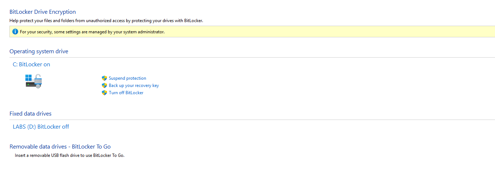
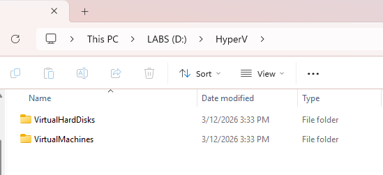
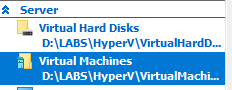
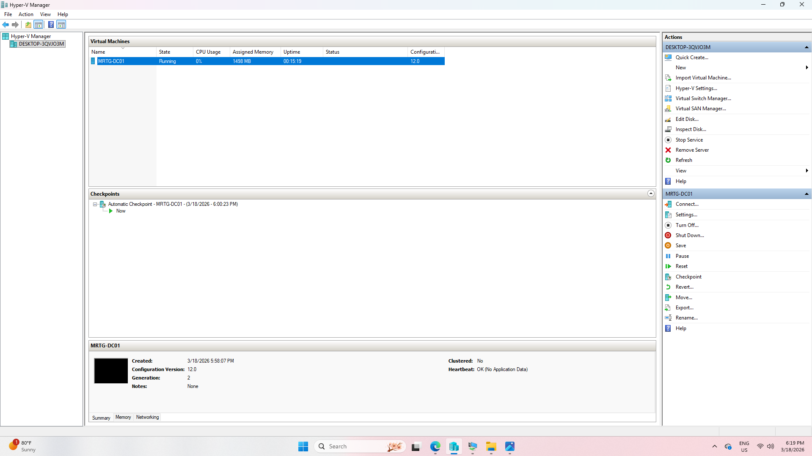

# Lab-01 — Virtualization and Identity Infrastructure Foundation

---

## Overview

This lab establishes the foundational identity infrastructure for the MRTG enterprise IAM environment.

A controlled virtualization boundary was prepared to support Active Directory Domain Services (AD DS), enabling secure, isolated deployment and policy-driven identity management.

---

## Why This Matters

Enterprise identity systems depend on clearly defined infrastructure boundaries.

A properly configured virtualization host provides:

- Isolation between host and domain environment  
- Secure deployment of Active Directory  
- Controlled authentication and access control validation  
- Scalability for future IAM services  

This foundation defines the security boundary for centralized identity governance.

---

## Environment

| Component         | Value                   |
|------------------|------------------------|
| Host OS           | Windows 11 Pro         |
| Hypervisor        | Hyper-V                |
| Domain Controller | Windows Server 2022    |
| VM Count          | 2                      |
| Network           | Internal Virtual Switch|

---

## Architecture

### Host Layer
- Windows 11 Pro  
- Hyper-V enabled  
- BitLocker encryption enforced  

### Virtualization Layer
- Hyper-V Manager  
- Internal Virtual Switch (isolated network)  

### Planned Identity Role
- Primary Domain Controller (AD DS, DNS)

---

## Security Controls Implemented

- Hyper-V used to isolate host and lab environments  
- BitLocker enabled on host system  
- Standard user model enforced (administrative tasks restricted)  
- Internal virtual switch to prevent external exposure  

---

## Implementation & Validation

### 1. Host Resource Validation

---

### 2. Platform Architecture Validation

---

### 3. Host Operating System Validation

---

### 4. TPM Validation

---

### 5. BitLocker Encryption Validation

---

### 6. CPU Virtualization Capability Validation

---

### 7. Hyper-V Feature Validation

---

### 8. Hyper-V Management Console Initialization

---

### 9. Internal Virtual Switch Configuration

---

### 10. Lab Storage Structure Configuration

---

### 11. Hyper-V Storage Path Configuration

---

### 12. Windows Server 2022 Installation Media Preparation

---

### 13. Domain Controller Virtual Machine Configuration

Virtual machine **MRTG-DC01** was provisioned with:

- Generation 2  
- 8 GB RAM  
- 2 vCPU  
- Internal virtual network (MRTG-Internal)  
- 80 GB dynamically expanding VHDX  
- Windows Server 2022 ISO attached  

---

### 14. MRTG-DC01 Virtual Machine Provisioning

---

## Outcome

A secure virtualization boundary was established to support enterprise Active Directory deployment.

The MRTG-DC01 virtual machine was provisioned and prepared for Domain Controller promotion.

This environment now functions as the controlled identity boundary for authentication, authorization, and policy enforcement within the MRTG IAM architecture.

---

## Next Lab

[Lab-02 — Active Directory Domain Services (AD DS) Deployment](../Lab-02-AD-DS-Deployment/README.md)

The next lab will cover:

- Installing the Active Directory Domain Services (AD DS) role  
- Creating a new domain forest  
- Configuring DNS for the domain environment  
- Promoting the server to a Domain Controller  
