# Lab 01 — Virtualization and Identity Infrastructure Foundation


---

## Objective

The objective of this lab is to establish the virtualization foundation for the Monroe Redstone Technology Group IAM lab environment.

This lab prepares the Windows 11 Pro host, validates hardware and security prerequisites, enables Hyper-V, creates the internal lab network, organizes virtual machine storage, and creates the first Windows Server virtual machine.

The focus is on building a controlled foundation that can support future Active Directory, DNS, DHCP, Group Policy, endpoint, monitoring, and IAM governance labs.

---

## Business Problem

Monroe Redstone Technology Group needs a safe and repeatable lab environment for building and validating identity infrastructure.

Before Active Directory, Group Policy, access control, monitoring, or IAM governance can be implemented, the environment needs a stable virtualization foundation.

This lab addresses the need to:

- Validate the host system can support virtualization
- Confirm operating system and hardware readiness
- Confirm TPM and BitLocker protection on the host
- Enable Hyper-V and required management tools
- Create an isolated virtual network
- Organize VM and virtual disk storage
- Prepare installation media
- Create the first Windows Server virtual machine
- Establish a repeatable base for future identity labs

---

## Lab Summary

In this lab, I prepared the virtualization foundation for the MRTG IAM lab series.

The host system was validated for Windows 11 Pro, 64-bit architecture, TPM readiness, BitLocker protection, and CPU virtualization support.

Hyper-V was enabled, Hyper-V Manager was opened, an internal virtual switch was created, storage folders were prepared on the lab drive, and the Windows Server 2022 ISO was staged.

The first server VM, `MRTG-DC01`, was created and connected to the internal lab network.

This lab serves as the starting point for the full IAM lab series.

---

## Environment

| Component | Details |
|---|---|
| Host Operating System | Windows 11 Pro |
| Host Version | 25H2 |
| Processor | AMD Ryzen 5 7600X3D |
| Installed RAM | 32 GB |
| System Type | 64-bit operating system, x64-based processor |
| Hypervisor | Hyper-V |
| Lab Storage Drive | `D:\LABS` |
| Virtual Switch | `MRTG-Internal` |
| First VM Created | `MRTG-DC01` |
| Server ISO | Windows Server 2022 |
| Lab Organization | Monroe Redstone Technology Group |

---

## Scope

### Included

- Host hardware review
- Host operating system validation
- System architecture validation
- TPM readiness validation
- BitLocker status validation
- CPU virtualization validation
- Hyper-V feature validation
- Hyper-V Manager validation
- Internal virtual switch creation
- Hyper-V folder structure preparation
- Hyper-V default storage path configuration
- Windows Server ISO staging
- `MRTG-DC01` virtual machine creation
- Initial Hyper-V VM inventory validation

### Not Included

- Windows Server installation
- Active Directory Domain Services installation
- Domain controller promotion
- DNS configuration
- DHCP configuration
- Domain join validation
- Group Policy configuration
- User or group provisioning
- SIEM or logging configuration

---

## Host Readiness

The host system was reviewed before creating the virtual lab environment.

| Requirement | Status |
|---|---|
| Windows 11 Pro | Confirmed |
| 64-bit operating system | Confirmed |
| x64-based processor | Confirmed |
| 32 GB RAM | Confirmed |
| CPU virtualization | Enabled |
| TPM | Ready for use |
| BitLocker | Enabled on OS drive |
| Hyper-V | Installed |

This confirmed that the host system could support a Hyper-V-based identity lab.

---

## Virtualization Foundation

Hyper-V was selected as the virtualization platform for the lab environment.

Hyper-V provides a controlled environment for building and testing identity infrastructure without affecting the host system.

This allows future labs to safely configure and validate:

- Active Directory Domain Services
- DNS
- DHCP
- Domain controllers
- Domain-joined workstations
- Group Policy
- Security baselines
- Logging and monitoring
- IAM governance controls

---

## Lab Network Design

An internal Hyper-V virtual switch was created for isolated lab communication.

| Network Component | Purpose |
|---|---|
| `MRTG-Internal` | Provides isolated communication between lab VMs |
| `MRTG-DC01` | Future primary domain controller |
| Future client VM | Used for domain join, policy testing, and endpoint validation |
| Future server VMs | Used for logging, monitoring, replication, and infrastructure services |

The internal virtual switch keeps the lab environment separated from the physical network while allowing lab systems to communicate with each other.

---

## Planned Lab Systems

| System | Planned Role |
|---|---|
| `MRTG-DC01` | Primary domain controller |
| `MRTG-DC02` | Additional domain controller |
| `MRTG-CLIENT-01` | Domain-joined workstation |
| `MRTG-LOG01` | Logging and monitoring server |

---

## Naming Standard

A consistent naming standard was used for lab systems.

| Name | Purpose |
|---|---|
| `MRTG-DC01` | Primary domain controller |
| `MRTG-DC02` | Additional domain controller |
| `MRTG-CLIENT-01` | Domain-joined workstation |
| `MRTG-LOG01` | Logging and monitoring server |

The `MRTG` prefix represents Monroe Redstone Technology Group and keeps lab systems grouped clearly.

---

## Storage Design

The lab storage structure was prepared on the `D:` drive.

```text
D:\LABS
├── HyperV
│   ├── VirtualHardDisks
│   └── VirtualMachines
└── ISO
    └── Windows_Server_2022.iso
```

This structure separates virtual machine configuration files, virtual hard disks, and installation media.

---

## Virtual Machine Configuration

The first virtual machine was created for the future primary domain controller.

| Setting | Value |
|---|---|
| VM Name | `MRTG-DC01` |
| Generation | Generation 2 |
| Memory | 8192 MB |
| Network | `MRTG-Internal` |
| Virtual Hard Disk | `D:\LABS\HyperV\VirtualHardDisks\MRTG-DC01.vhdx` |
| Installation Media | `D:\LABS\ISO\Windows_Server_2022.iso` |

---

## Infrastructure Design Principles

This lab was built around the following principles:

- Keep the lab isolated from personal or production systems
- Use clear VM naming standards
- Separate server and client roles
- Store lab files in a predictable folder structure
- Build infrastructure in phases
- Preserve clean rollback points
- Document each major configuration step
- Collect evidence for future troubleshooting and review

---

## Implementation and Validation

### 1. Host Hardware Specifications Reviewed

The host system hardware was reviewed to confirm that the machine had enough resources to support the lab environment.

Validated hardware included:

- AMD Ryzen 5 7600X3D processor
- 32 GB RAM

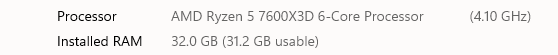

---

### 2. Host System Architecture Validated

The system type was reviewed to confirm that the host was running a 64-bit operating system on an x64-based processor.


This confirmed the host architecture was compatible with Hyper-V virtualization.

---

### 3. Host Operating System Version Confirmed

The Windows edition and version were reviewed.

Validated host operating system:

```text
Windows 11 Pro
Version 25H2
```

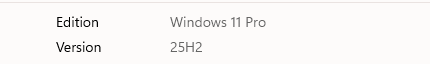

Windows 11 Pro supports Hyper-V, making it suitable for the local lab environment.

---

### 4. TPM Readiness Validated

TPM Management was opened to confirm that the Trusted Platform Module was ready for use.

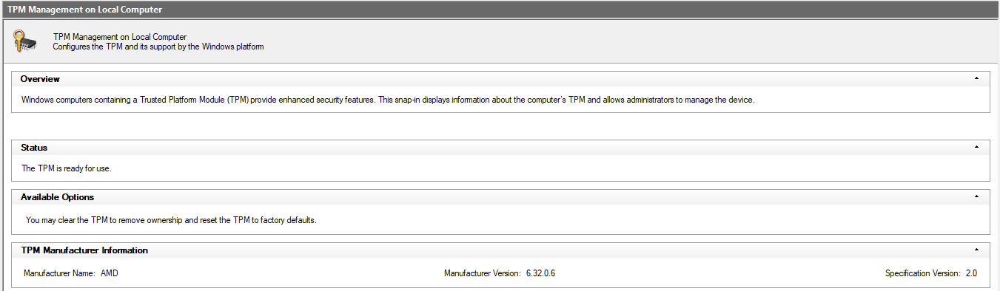

This supports host security readiness and confirms that the system has modern platform security capabilities.

---

### 5. BitLocker Protection Confirmed

BitLocker Drive Encryption was reviewed.

The operating system drive showed:

```text
C: BitLocker on
```

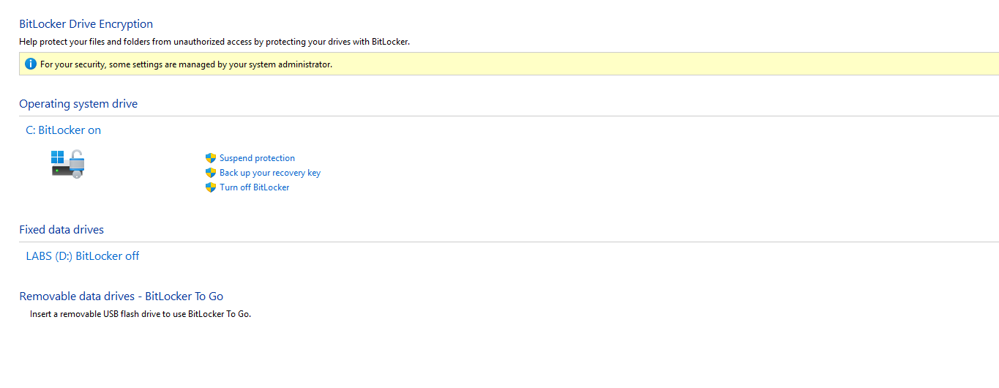

This confirmed that the host operating system drive was protected with BitLocker.

---

### 6. CPU Virtualization Confirmed

Task Manager was used to confirm that virtualization was enabled.

Validated setting:

```text
Virtualization: Enabled
```

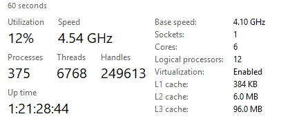

This confirmed that the host CPU was ready to support Hyper-V virtual machines.

---

### 7. Hyper-V Feature Installed

Windows Features confirmed that Hyper-V was enabled.

Validated components included:

- Hyper-V Management Tools
- Hyper-V Platform


---

### 8. Hyper-V Manager Opened

Hyper-V Manager was opened successfully.

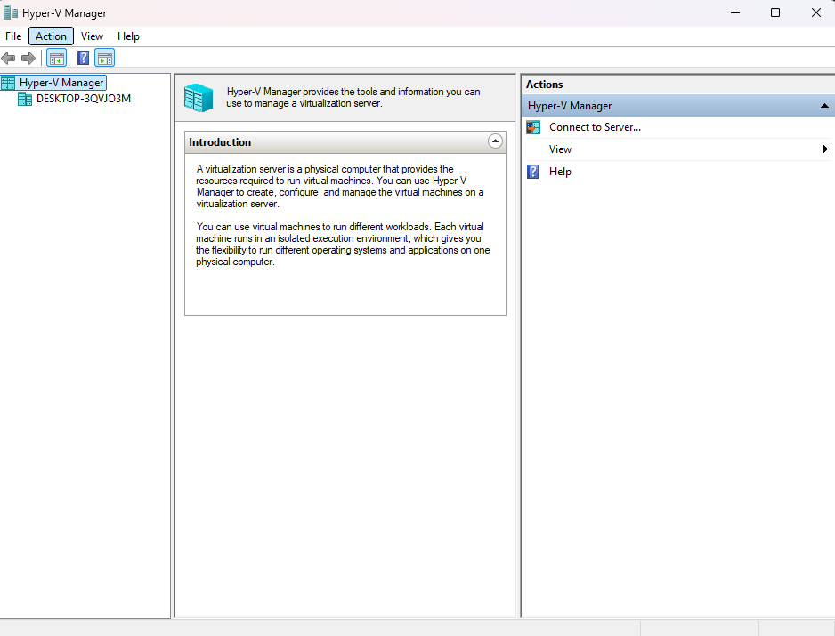

This confirmed that Hyper-V management tools were available and ready for VM creation.

---

### 9. Internal Virtual Network Created

A Hyper-V internal virtual switch was created for lab communication.

Virtual switch name:

```text
MRTG-Internal
```

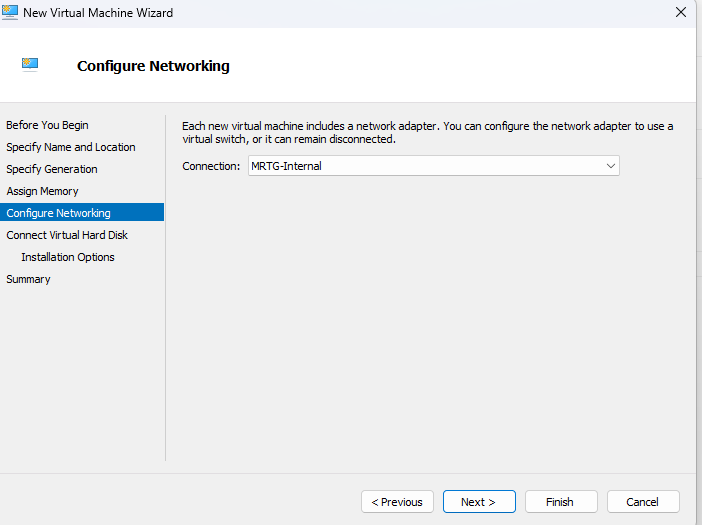

This provided isolated network connectivity for future MRTG lab virtual machines.

---

### 10. Hyper-V Folder Structure Created

A dedicated folder structure was created under `D:\LABS`.

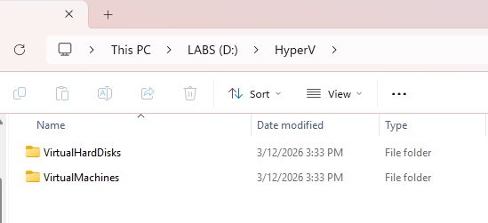

This organized lab storage for virtual machines and virtual hard disks.

---

### 11. Hyper-V Default Storage Paths Configured

Hyper-V default storage paths were configured to use the dedicated lab folders.

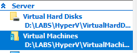

This ensured new virtual machines and virtual hard disks would be stored in the intended lab location.

---

### 12. Windows Server ISO Prepared

The Windows Server 2022 ISO was stored in the lab ISO folder.

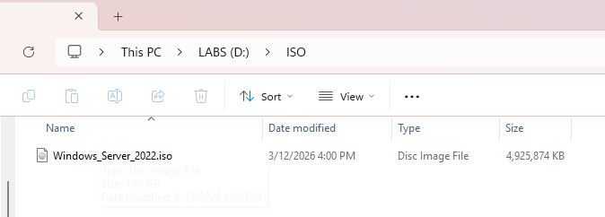

This prepared installation media for the first server VM.

---

### 13. MRTG-DC01 Virtual Machine Configured

The New Virtual Machine Wizard was used to configure `MRTG-DC01`.

Validated settings included:

- Generation 2 VM
- 8192 MB memory
- `MRTG-Internal` network
- VHDX stored under `D:\LABS\HyperV\VirtualHardDisks`
- Windows Server 2022 ISO attached

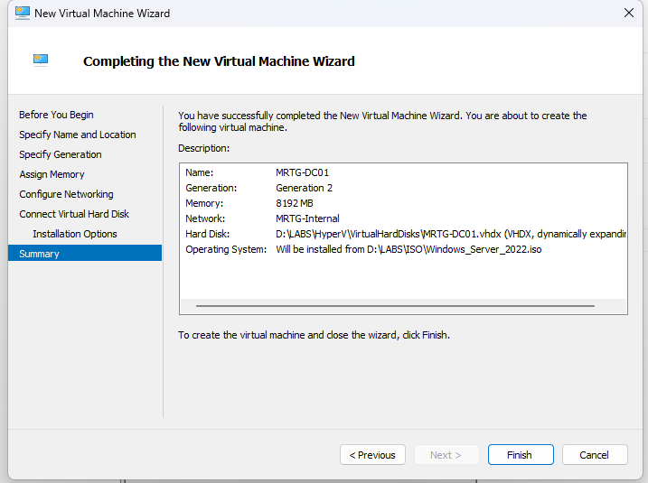

---

### 14. MRTG-DC01 Created and Started

`MRTG-DC01` was created and shown running in Hyper-V Manager.

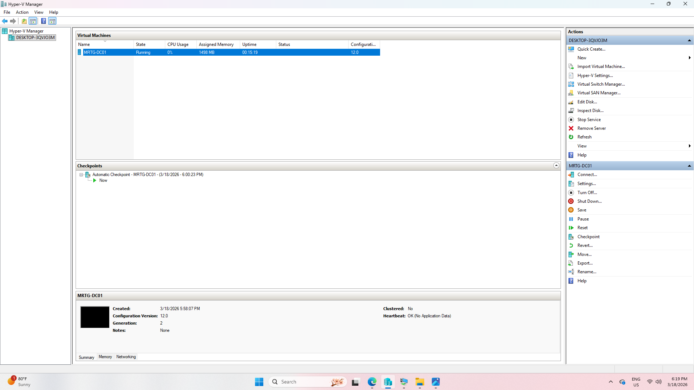

This confirmed the first server VM was created successfully and ready for operating system installation.

---

## Security Perspective

This lab demonstrates that identity infrastructure starts with secure and controlled infrastructure.

A reliable IAM lab requires more than just installing Active Directory. The host, storage, networking, virtual switch design, and rollback strategy all affect how stable and repeatable the environment will be.

From a security and IAM perspective, this lab supports:

- Isolated lab testing
- Controlled infrastructure buildout
- Host security validation
- BitLocker-protected host storage
- TPM readiness
- Virtualization readiness
- Repeatable VM deployment
- Clear system naming
- Evidence-based documentation

---

## Risk Addressed

Without a controlled virtualization foundation, identity labs can become inconsistent, difficult to troubleshoot, and difficult to rebuild.

This lab reduces the risk of:

- Uncontrolled lab sprawl
- Inconsistent system naming
- Weak host readiness validation
- No clear separation between server and client roles
- Poor VM storage organization
- Network misconfiguration
- Weak foundation for future Active Directory labs
- Difficulty reproducing or troubleshooting future configurations

---

## Control Mapping

| Control Area | How This Lab Supports It |
|---|---|
| Infrastructure foundation | Establishes the virtual environment for future IAM labs |
| Host readiness | Validates OS, hardware, TPM, BitLocker, and virtualization support |
| Security isolation | Uses an internal Hyper-V network for lab systems |
| Operational consistency | Uses standard VM names and planned roles |
| Change readiness | Creates a clean base for phased configuration |
| Documentation | Captures setup evidence for future review |
| Future audit readiness | Establishes screenshot-based evidence collection |

---

## Validation

The following validation checks were completed:

| Validation Item | Result |
|---|---|
| Host hardware reviewed | Passed |
| Windows 11 Pro confirmed | Passed |
| 64-bit system architecture confirmed | Passed |
| TPM ready for use | Passed |
| BitLocker enabled on OS drive | Passed |
| CPU virtualization enabled | Passed |
| Hyper-V installed | Passed |
| Hyper-V Manager opened successfully | Passed |
| Internal virtual switch created | Passed |
| Lab folder structure created | Passed |
| Hyper-V storage paths configured | Passed |
| Windows Server 2022 ISO staged | Passed |
| `MRTG-DC01` VM configured | Passed |
| `MRTG-DC01` created and running | Passed |

---

## Evidence Collected

The following evidence was collected during the lab:

| Evidence | File |
|---|---|
| Host hardware specifications | `screenshots/lab-01-01_host_hardware_specs.png` |
| Host system architecture | `screenshots/lab-01-02_host_system_architecture.png` |
| Host OS version | `screenshots/lab-01-03_host_os_version.png` |
| TPM readiness | `screenshots/lab-01-04-tpm-ready.png` |
| BitLocker enabled | `screenshots/lab-01-05_bitlocker_enabled.png` |
| CPU virtualization enabled | `screenshots/lab-01-06-cpu-virtualization-enabled.png` |
| Hyper-V installed | `screenshots/lab-01-07_hyperv_installed.png` |
| Hyper-V Manager console | `screenshots/lab-01-08_hyperv_manager_console.png` |
| Internal virtual network created | `screenshots/lab-01-09_internal_network_created.png` |
| Hyper-V folder structure | `screenshots/lab-01-10-hyperv-folder-structure.png` |
| Hyper-V default storage paths | `screenshots/lab-01-11-hyperv-default-storage-paths.png` |
| Windows Server ISO ready | `screenshots/lab-01-12-windows-server-iso-ready.png` |
| MRTG-DC01 VM configuration | `screenshots/lab-01-13-dc01-vm-configuration.png` |
| MRTG-DC01 created | `screenshots/lab-01-14-mrtg-dc01-created.png` |

---

## What I Would Improve in Production

In a production environment, I would improve this process by:

- Using formal infrastructure design documentation
- Defining resource requirements before deployment
- Documenting network segmentation and firewall rules
- Using approved naming standards
- Tracking infrastructure assets in a CMDB
- Applying baseline security hardening before production use
- Defining backup and recovery requirements
- Documenting administrative ownership
- Validating licensing and support requirements
- Using formal change management before deploying infrastructure
- Monitoring host performance and capacity over time

---

## Lessons Learned

This lab reinforced that identity infrastructure starts before Active Directory is installed.

A stable virtualization foundation makes the rest of the IAM environment easier to build, troubleshoot, document, and validate.

The biggest takeaway is that good IAM labs need structure from the beginning. Naming standards, VM roles, network planning, storage planning, and evidence collection all matter because they support every future identity and access control lab.

---

## Outcome

Lab 01 successfully established the virtualization and infrastructure foundation for the MRTG IAM lab series.

The lab confirmed:

- The Windows 11 Pro host supports Hyper-V
- CPU virtualization is enabled
- TPM is ready for use
- BitLocker is enabled on the host OS drive
- Hyper-V is installed and manageable
- An internal lab virtual switch was created
- Lab storage folders were organized
- Windows Server 2022 ISO media was prepared
- `MRTG-DC01` was created as the first server VM

This lab created the base environment required for the rest of the IAM lab series.

---

## Next Lab

[Lab 02 — AD DS Deployment Preparation](../Lab-02-AD-DS-Deployment/)

Lab 02 will focus on installing the Active Directory Domain Services role and preparing the server for domain controller promotion.
