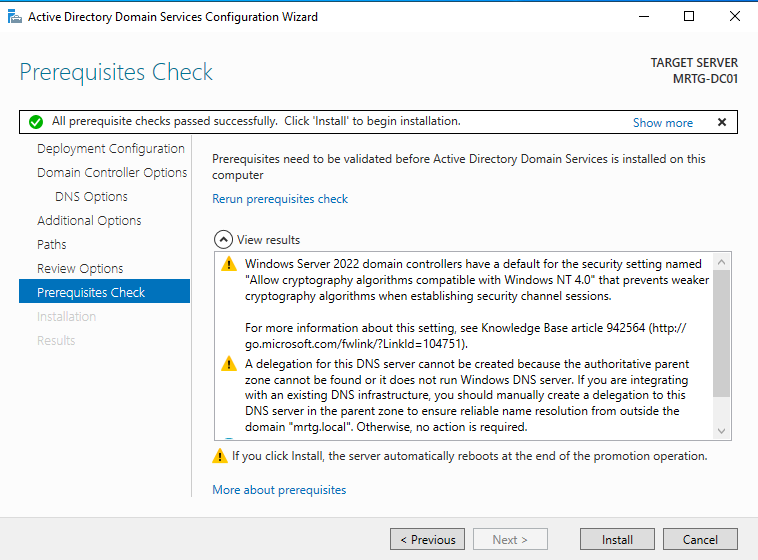

# Lab 02 — AD DS Deployment Preparation


---

## Objective

The objective of this lab is to prepare `MRTG-DC01` for Active Directory Domain Services deployment.

This lab focuses on installing the AD DS role, confirming required management tools, and validating that the server is ready for domain controller promotion.

The actual domain controller promotion, new forest creation, DNS validation, and identity activation are completed in Lab 03.

---

## Business Problem

Monroe Redstone Technology Group needs a centralized identity platform for authentication, authorization, policy enforcement, and future IAM governance.

Before a domain controller can provide those services, the server must be prepared with the required Active Directory Domain Services role and validated before promotion.

This lab addresses the need to:

- Prepare the first identity server for AD DS deployment
- Install the AD DS role and required management tools
- Confirm the server is ready for promotion
- Validate prerequisite checks before identity activation
- Separate role installation from domain controller promotion
- Establish a clean handoff point for Lab 03

---

## Lab Summary

In this lab, I prepared `MRTG-DC01` for Active Directory Domain Services deployment.

The AD DS role and supporting management tools were selected for installation through Server Manager.

After role selection, the Active Directory Domain Services Configuration Wizard was used to begin promotion preparation for a new forest named `mrtg.local`.

The prerequisite checks passed successfully, confirming that `MRTG-DC01` was ready to be promoted as the first domain controller in Lab 03.

---

## Environment

| Component | Details |
|---|---|
| Domain | `mrtg.local` |
| Server | `MRTG-DC01` |
| Operating System | Windows Server 2022 |
| Role Prepared | Active Directory Domain Services |
| Management Tools | Group Policy Management, AD DS tools, PowerShell module |
| Virtualization Platform | Hyper-V |
| Lab Organization | Monroe Redstone Technology Group |
| Promotion Status | Prepared in this lab, completed in Lab 03 |

---

## Scope

### Included

- AD DS role selection
- AD DS management tool selection
- Group Policy Management tool selection
- Deployment configuration preparation
- New forest preparation for `mrtg.local`
- AD DS prerequisite validation
- Promotion readiness confirmation

### Not Included

- Completed domain controller promotion
- New forest creation completion
- Full DNS zone validation
- SRV record validation
- Kerberos authentication validation
- Domain health validation
- Organizational Unit design
- Group Policy enforcement
- Domain-joined client validation

---

## Architecture

This lab prepares `MRTG-DC01` to become the first domain controller in the MRTG environment.

```text
MRTG-DC01
└── Active Directory Domain Services role prepared
    ├── Group Policy Management tools selected
    ├── AD DS and AD LDS tools selected
    ├── Active Directory PowerShell module selected
    ├── Active Directory Administrative Center selected
    └── AD DS snap-ins and command-line tools selected
```

Planned domain:

```text
mrtg.local
```

This prepares the server for the identity activation phase completed in Lab 03.

---

## AD DS Deployment Model

This lab separates AD DS deployment into two phases.

| Phase | Lab | Purpose |
|---|---|---|
| Preparation | Lab 02 | Install AD DS role and validate promotion readiness |
| Activation | Lab 03 | Promote the server, create the forest, and validate domain services |

This separation makes the build easier to document, troubleshoot, and explain.

---

## AD DS Role Components

The following components were selected during AD DS role installation:

| Component | Purpose |
|---|---|
| Active Directory Domain Services | Provides directory services and domain identity foundation |
| Group Policy Management | Supports centralized policy management |
| Remote Server Administration Tools | Provides management tools for AD DS |
| AD DS and AD LDS Tools | Provides AD DS administration tools |
| Active Directory Module for Windows PowerShell | Supports AD administration through PowerShell |
| Active Directory Administrative Center | Provides modern AD management interface |
| AD DS Snap-ins and Command-Line Tools | Supports classic AD administration and validation |

---

## Implementation and Validation

### 1. AD DS Role and Management Tools Selected

The Active Directory Domain Services role was selected for installation on `MRTG-DC01`.

The installation selection included:

- Active Directory Domain Services
- Group Policy Management
- Remote Server Administration Tools
- AD DS and AD LDS Tools
- Active Directory module for Windows PowerShell
- Active Directory Administrative Center
- AD DS snap-ins and command-line tools


This prepared the server with the required components for future domain controller promotion.

---

### 2. AD DS Prerequisite Check Completed

The Active Directory Domain Services Configuration Wizard was used to prepare the server for a new forest deployment.

The intended root domain name was:

```text
mrtg.local
```

The prerequisite check completed successfully.

Validation result:

```text
All prerequisite checks passed successfully.
```



The DNS delegation warning was expected because this is an isolated internal lab domain with no external parent DNS zone.

This confirmed that `MRTG-DC01` was ready for domain controller promotion in Lab 03.

---

## Security Perspective

This lab prepares a future Tier 0 identity asset.

A domain controller is one of the most sensitive systems in a Windows environment because it controls authentication, authorization, policy processing, and directory services.

From a security and IAM perspective, this lab supports:

- Controlled identity infrastructure preparation
- Separation between role installation and promotion
- Clear documentation of privileged infrastructure changes
- Promotion readiness validation before identity activation
- Preparation for centralized authentication and policy enforcement
- Reduced risk of undocumented domain controller build steps

---

## Risk Addressed

Without proper AD DS deployment preparation, domain controller promotion may fail or result in an unstable identity foundation.

This lab reduces the risk of:

- Missing AD DS role components
- Missing management tools
- Incomplete server preparation
- Failed prerequisite checks
- Poor separation between installation and promotion
- Weak documentation of the identity infrastructure build process
- Unclear handoff between AD DS preparation and domain activation

---

## Control Mapping

| Control Area | How This Lab Supports It |
|---|---|
| Identity infrastructure preparation | Prepares `MRTG-DC01` for AD DS deployment |
| Change control readiness | Documents role installation before promotion |
| Tier 0 planning | Identifies the future domain controller as privileged infrastructure |
| Operational consistency | Separates preparation from identity activation |
| Deployment validation | Confirms prerequisite checks passed |
| Audit readiness | Captures evidence of role selection and prerequisite validation |
| Future IAM foundation | Prepares the server for centralized authentication and policy enforcement |

---

## Validation

The following validation checks were completed:

| Validation Item | Result |
|---|---|
| AD DS role selected | Passed |
| Group Policy Management selected | Passed |
| Remote Server Administration Tools selected | Passed |
| AD DS and AD LDS Tools selected | Passed |
| Active Directory PowerShell module selected | Passed |
| Active Directory Administrative Center selected | Passed |
| AD DS snap-ins and command-line tools selected | Passed |
| New forest deployment path prepared | Passed |
| `mrtg.local` entered as planned root domain | Passed |
| AD DS prerequisite checks completed | Passed |
| Prerequisite checks passed successfully | Passed |
| DNS delegation warning reviewed | Passed |

---

## Evidence Collected

The following evidence was collected during the lab:

| Evidence | File |
|---|---|
| AD DS role and management tools selected | `screenshots/lab-02-01-ad-ds-role-installation.png` |
| AD DS prerequisite validation | `screenshots/lab-02-02-ad-ds-prerequisites-check.png` |

---

## What I Would Improve in Production

In a production environment, I would improve this process by:

- Using a formal domain controller deployment checklist
- Confirming server naming standards before promotion
- Validating static IP and DNS planning before role installation
- Documenting administrative ownership of the domain controller
- Reviewing Tier 0 administrative access before promotion
- Confirming backup and recovery requirements before identity activation
- Creating formal change management records
- Reviewing DNS delegation requirements for enterprise environments
- Capturing pre-change and post-change validation evidence
- Confirming time synchronization requirements
- Reviewing domain and forest naming standards before deployment

---

## Lessons Learned

This lab reinforced that AD DS deployment is a phased process.

Installing the AD DS role is not the same as fully activating a domain controller.

A clean lab structure separates preparation, promotion, and validation into clear phases. This makes the work easier to troubleshoot, document, and explain.

The key takeaway is that identity infrastructure should be built deliberately. The preparation phase matters because it sets up the conditions for a successful domain controller promotion.

---

## Outcome

Lab 02 successfully prepared `MRTG-DC01` for Active Directory Domain Services deployment.

The lab confirmed:

- AD DS role components were selected
- Required management tools were included
- New forest deployment preparation was started
- `mrtg.local` was entered as the planned root domain
- AD DS prerequisite checks passed successfully
- DNS delegation warning was reviewed and understood
- The server was ready for domain controller promotion in Lab 03

This lab created the controlled preparation point before activating the MRTG identity domain.

---

## Next Lab

[Lab 03 — Domain Controller Promotion](../Lab-03-Domain-Controller-Promotion/)

Lab 03 will promote `MRTG-DC01` to the first domain controller, create the `mrtg.local` forest, configure AD-integrated DNS, and validate core domain services.
