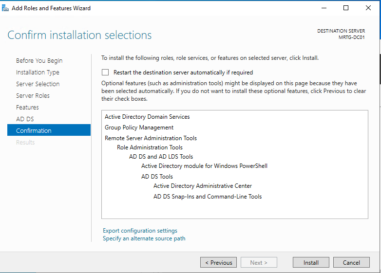

# Lab 02 — AD DS Deployment Preparation

---

## Objective

The objective of this lab is to prepare `MRTG-DC01` for Active Directory Domain Services deployment.

This lab focuses on the AD DS deployment preparation phase before the domain controller becomes fully operational.

The actual domain controller promotion, forest creation, DNS validation, and identity activation are completed in Lab 03.

---

## Business Problem

Monroe Redstone Technology Group needs a centralized identity platform for authentication, authorization, policy enforcement, and future IAM governance.

Before a domain controller can provide those services, the server must be prepared with the required Active Directory Domain Services role and validated before promotion.

This lab addresses the need to:

- Prepare the first identity server for AD DS deployment
- Install and confirm the required AD DS components
- Validate promotion readiness
- Confirm prerequisite checks pass before identity activation
- Establish a controlled handoff point before domain creation
- Keep role installation and domain controller promotion documented as separate phases

---

## Lab Summary

In this lab, I prepared `MRTG-DC01` for Active Directory Domain Services deployment.

The AD DS role and supporting management tools were selected and prepared for installation.

After the AD DS role was available, the Active Directory Domain Services Configuration Wizard was used to begin deployment preparation for a new forest named `mrtg.local`.

The prerequisite checks passed successfully, confirming the server was ready for promotion in the next phase.

---

## Environment

| Component | Details |
|---|---|
| Domain | `mrtg.local` |
| Server | `MRTG-DC01` |
| Operating System | Windows Server 2022 |
| Role | Active Directory Domain Services |
| Virtualization Platform | Hyper-V |
| Lab Organization | Monroe Redstone Technology Group |
| Promotion Status | Prepared in this lab, completed in Lab 03 |

---

## Scope

### Included

- AD DS role preparation
- AD DS management tool selection
- Deployment configuration review
- New forest preparation for `mrtg.local`
- Prerequisite validation
- Promotion readiness confirmation

### Not Included

- Completed domain controller promotion
- Full DNS zone validation
- SRV record validation
- Kerberos authentication validation
- Domain health validation
- Organizational Unit design
- Group Policy enforcement
- Domain-joined client validation

---

## AD DS Role and Management Tools Selection

The AD DS role and supporting management tools were selected for installation on `MRTG-DC01`.

The selected components included:

- Active Directory Domain Services
- Group Policy Management
- Remote Server Administration Tools
- AD DS and AD LDS Tools
- Active Directory module for Windows PowerShell
- Active Directory Administrative Center
- AD DS snap-ins and command-line tools

---

## Deployment Configuration Preparation

The Active Directory Domain Services Configuration Wizard was used to prepare the server for a new forest deployment.

The selected deployment operation was:

`Add a new forest`

The root domain name entered was:

`mrtg.local`

This prepared `MRTG-DC01` for promotion as the first domain controller in the new MRTG forest.

---

## Prerequisites Check

The AD DS Configuration Wizard prerequisite checks were completed successfully.

The wizard confirmed:

`All prerequisite checks passed successfully.`

The warning about DNS delegation was expected in this lab because this was a new isolated internal lab domain and no external parent DNS delegation was required.

---

## Security Considerations

This lab prepared a server that will become a Tier 0 identity asset.

Security considerations include:

- Domain controllers must be treated as privileged identity infrastructure
- Administrative access should be limited to approved administrators
- Role installation and promotion should be documented separately
- DNS and authentication configuration must be validated after promotion
- A clean checkpoint should be maintained before and after major identity changes
- AD DS deployment should occur only on designated servers

---

## Risk Addressed

Without proper AD DS deployment preparation, the domain controller promotion process may fail or create an unstable identity foundation.

This lab reduces that risk by validating the required role components and confirming that prerequisite checks passed before completing identity activation.

The main risks addressed include:

- Missing AD DS role components
- Incomplete server preparation
- Failed promotion readiness checks
- Unclear separation between role installation and domain promotion
- Poor documentation of the identity infrastructure build process

---

## Control Mapping

| Control Area | How This Lab Supports It |
|---|---|
| Identity infrastructure preparation | Prepares `MRTG-DC01` for AD DS deployment |
| Change control readiness | Documents the preparation phase before promotion |
| Tier 0 planning | Identifies the future domain controller as privileged infrastructure |
| Operational consistency | Separates role preparation from domain controller promotion |
| Audit readiness | Captures evidence of role selection and prerequisite validation |
| Deployment validation | Confirms prerequisite checks passed before identity activation |

---

## Validation

The following validation checks were completed:

| Validation Item | Result |
|---|---|
| AD DS role selected | Passed |
| Required management tools selected | Passed |
| New forest deployment path selected | Passed |
| `mrtg.local` entered as the root domain name | Passed |
| AD DS prerequisite checks completed | Passed |
| Prerequisite checks passed successfully | Passed |
| DNS delegation warning reviewed | Passed |

---

## Evidence Collected

The following evidence was collected during the lab:

| Evidence | File |
|---|---|
| AD DS role and management tools selection | `images/01-ad-ds-role-installation.png` |
| AD DS prerequisite validation | `images/02-ad-ds-prerequisites-check.png` |

---

## What I Would Improve in Production

In a production environment, I would improve this process by:

- Using a formal deployment checklist before installing AD DS
- Confirming server naming standards before promotion
- Validating static IP and DNS planning before role installation
- Documenting administrative ownership of the domain controller
- Reviewing Tier 0 administrative access before promotion
- Confirming backup and recovery requirements before identity activation
- Creating formal change management records
- Reviewing DNS delegation requirements for enterprise environments
- Capturing pre-change and post-change validation evidence

---

## Lessons Learned

This lab reinforced that AD DS deployment is a phased process.

Installing and preparing the AD DS role is not the same as fully activating a domain controller.

A clean lab structure separates preparation, promotion, and validation into clear phases. This makes the work easier to troubleshoot, document, and explain.

The key takeaway is that identity infrastructure should be built deliberately. The preparation phase matters because it sets up the conditions for a successful domain controller promotion.

---

## Outcome

Lab 02 successfully prepared `MRTG-DC01` for Active Directory Domain Services deployment.

The lab confirmed:

- AD DS role components were selected
- Required management tools were included
- New forest deployment preparation was started
- `mrtg.local` was entered as the planned root domain
- AD DS prerequisite checks passed successfully
- The server was ready for domain controller promotion in Lab 03

This lab created the controlled preparation point before activating the MRTG identity domain.

---

## Next Lab

[Lab 03 — Domain Controller Promotion](../Lab-03-Domain-Controller-Promotion/)

Lab 03 will promote `MRTG-DC01` to the first domain controller, create the `mrtg.local` forest, configure AD-integrated DNS, and validate core domain services.
