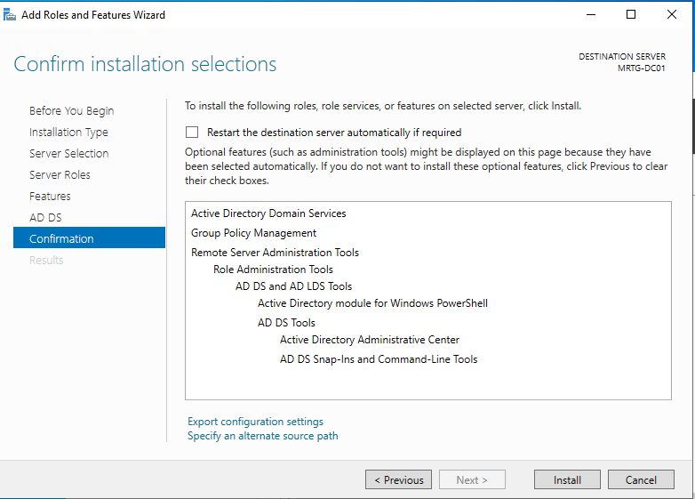
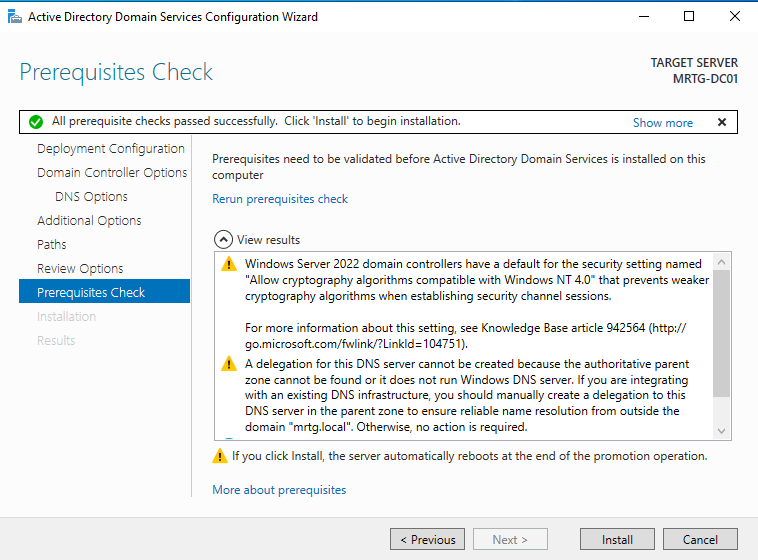
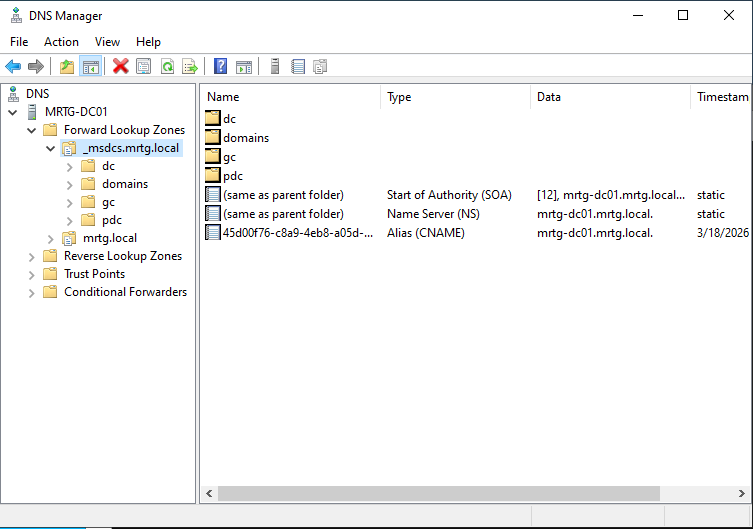
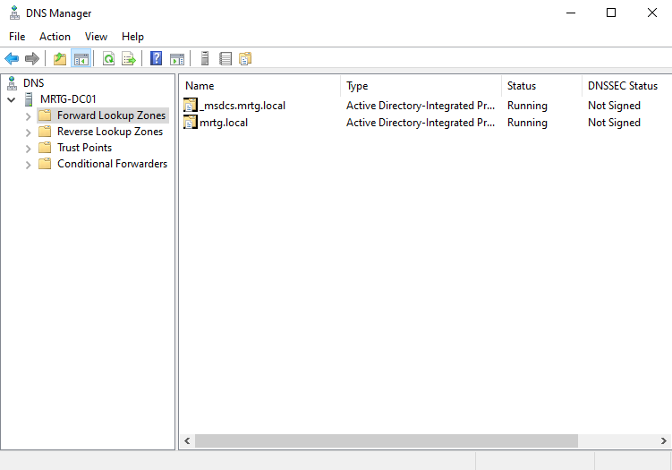
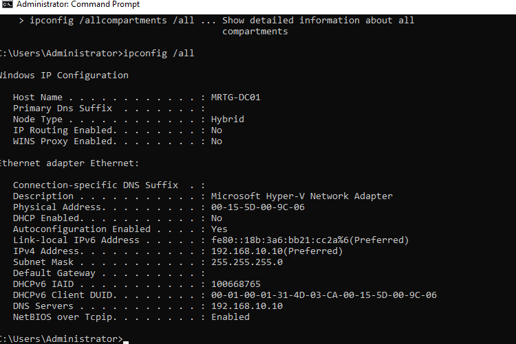
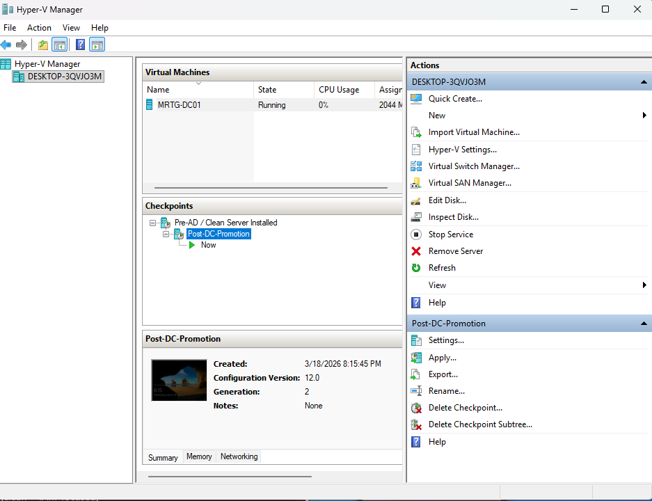

# Lab-02 — Active Directory Domain Services (AD DS) Installation

---

## Overview

This lab focuses on deploying Active Directory Domain Services (AD DS) within the MRTG environment by promoting a Windows Server to a Domain Controller.

This establishes centralized identity management, enabling authentication, authorization, and directory-based access control across the environment.

---

## Why This Matters

Active Directory serves as the core identity provider in most enterprise and government environments.

Proper deployment of AD DS enables:

- Centralized authentication using Kerberos
- Structured identity management through directory services
- Secure access control across systems and resources
- Foundation for Group Policy, RBAC, and auditing

This lab establishes the identity authority that all future access control and policy enforcement will depend on.

---

## Environment

| Component           | Value                              |
|--------------------|-----------------------------------|
| Domain Name        | mrtg.local                         |
| Domain Controller  | MRTG-DC01                          |
| OS                 | Windows Server 2022                |
| Role               | Active Directory Domain Services   |
| Virtualization     | Hyper-V                            |

---

## Architecture

- **Domain Controller: MRTG-DC01**
  - Active Directory Domain Services (AD DS)
  - DNS Server

- **Directory Structure**
  - New forest: `mrtg.local`

- **Authentication Model**
  - Kerberos-based authentication

This deployment establishes the centralized identity authority for the MRTG environment.

---

## Security Considerations

- Domain Controller deployed in isolated virtual network
- AD DS installed using least privilege administrative access
- DNS integrated with Active Directory for secure name resolution
- Environment prepared for future policy enforcement and auditing

---

## Lab Steps and Evidence

### 1. Installed AD DS Role
The Active Directory Domain Services role was installed on MRTG-DC01.

---

### 2. Prerequisites Check
All prerequisite checks passed before promoting the server to a Domain Controller.

---

### 3. Created New Forest
A new Active Directory forest was created using the root domain `mrtg.local`.

---

### 4. Verified DNS Zones
DNS zones were created and integrated with Active Directory.

---

### 5. Verified AD-Integrated DNS Records
Service records were automatically created within the `_msdcs.mrtg.local` zone.

---

### 6. Verified Host and Service Records
DNS records confirm proper name resolution and domain controller registration.

---

### 7. Verified Network Configuration
The domain controller was configured with a static IP and pointed to itself for DNS resolution.

---

### 8. Created Post-Deployment Checkpoint
A Hyper-V checkpoint was created after successful domain controller promotion.

---

## Outcome

A fully functional Active Directory Domain Services environment was successfully deployed.

- Domain `mrtg.local` created
- MRTG-DC01 configured as Domain Controller
- DNS integrated with Active Directory
- Core identity infrastructure established

This environment now supports authentication, authorization, and future IAM policy enforcement.

---

## Next Lab

[Lab-03 — AD Identity Structure](../Lab-03-AD-Identity-Structure)

The next lab will cover:

- Organizational Unit (OU) structure design  
- User and group provisioning  
- Security group implementation (RBAC foundation)  
- Identity organization aligned to business roles  

---
