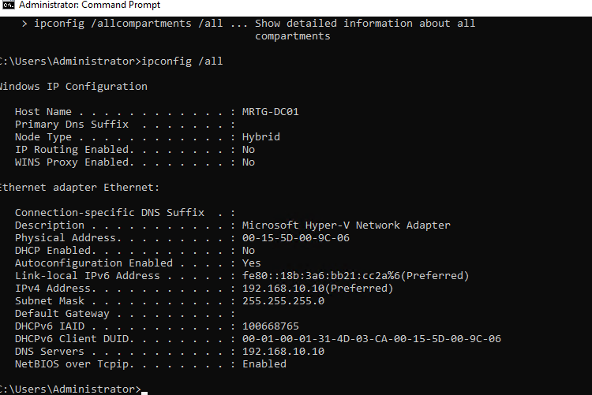
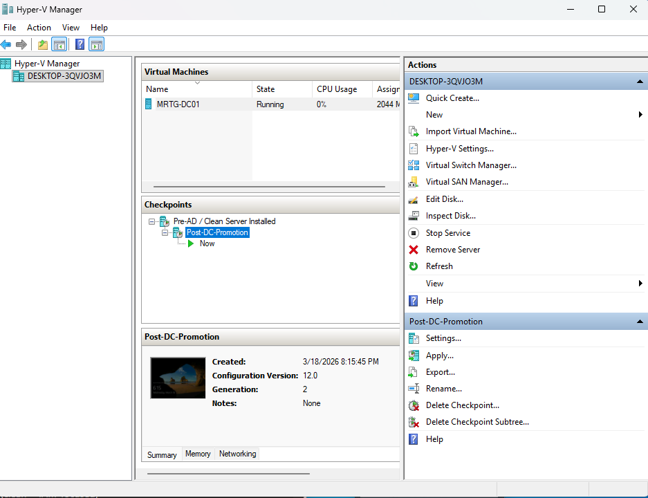

# Lab 03 — Domain Controller Promotion


---

## Objective

The objective of this lab is to promote `MRTG-DC01` to the first domain controller for the `mrtg.local` domain.

This lab activates the MRTG identity infrastructure by creating the new forest, validating AD-integrated DNS, confirming domain controller service records, validating domain authentication, and preserving a stable post-promotion baseline.

---

## Business Problem

Monroe Redstone Technology Group needs a centralized identity authority for authentication, authorization, DNS-integrated service discovery, and future policy enforcement.

After preparing the server in Lab 02, `MRTG-DC01` must be promoted to a domain controller so the environment can operate as a real identity domain.

This lab addresses the need to:

- Create the `mrtg.local` forest
- Promote `MRTG-DC01` to a domain controller
- Establish centralized authentication
- Validate AD-integrated DNS
- Confirm service discovery records
- Validate domain controller network configuration
- Confirm domain authentication and name resolution
- Preserve a clean post-promotion rollback point

---

## Lab Summary

In this lab, I promoted `MRTG-DC01` to the first domain controller in the `mrtg.local` forest.

The lab validated that Active Directory was operational, DNS zones were created, service records were registered, the domain controller used itself for DNS resolution, domain authentication worked, and a stable Hyper-V checkpoint was created after promotion.

This lab activates the identity control plane for the rest of the MRTG IAM lab series.

---

## Environment

| Component | Details |
|---|---|
| Domain | `mrtg.local` |
| Domain Controller | `MRTG-DC01` |
| Operating System | Windows Server 2022 |
| Role | Domain Controller |
| DNS | AD-integrated DNS |
| Virtualization Platform | Hyper-V |
| Lab Organization | Monroe Redstone Technology Group |

---

## Scope

### Included

- Domain controller promotion
- New forest creation for `mrtg.local`
- AD-integrated DNS validation
- `_msdcs` service record validation
- Host and service record validation
- Static IP and DNS self-reference validation
- Domain authentication validation
- Domain name resolution validation
- Post-promotion Hyper-V checkpoint

### Not Included

- Organizational Unit design
- Security group provisioning
- Group Policy enforcement
- Domain-joined workstation configuration
- Delegation of control
- Lifecycle automation

---

## Architecture

`MRTG-DC01` operates as the first domain controller within the `mrtg.local` forest.

It provides:

- Active Directory Domain Services
- AD-integrated DNS
- Kerberos-based authentication
- Service discovery through SRV records
- Centralized identity authority for the MRTG environment

This system functions as the authoritative identity provider for the lab domain.

---

## Identity Activation Phases

### Phase 1 — Domain Controller Promotion

The Active Directory Domain Services Configuration Wizard was used to promote `MRTG-DC01` to a domain controller.

Deployment operation selected:

`Add a new forest`

Root domain name:

`mrtg.local`


This established `mrtg.local` as the forest root domain.

---

### Phase 2 — DNS Zone Validation

After promotion, DNS Manager was used to validate that AD-integrated DNS zones were created.

Validated zones:

- `_msdcs.mrtg.local`
- `mrtg.local`


These zones are required for domain controller service discovery and domain authentication.

---

### Phase 3 — `_msdcs` Service Record Validation

The `_msdcs.mrtg.local` zone was reviewed to confirm domain controller service registration.

The zone contained service-related folders and records used by Active Directory clients to locate domain controllers.


This confirmed that Active Directory service discovery records were created after promotion.

---

### Phase 4 — DNS Host and Service Record Validation

DNS host and service records were reviewed to confirm proper domain controller registration.

Validated records included:

- SOA record
- NS record
- Domain controller host reference
- Domain controller service record structure


This confirmed that `MRTG-DC01` was properly registered in DNS.

---

### Phase 5 — Network Configuration Validation

The network configuration was reviewed using `ipconfig /all`.

Validation confirmed:

- Hostname: `MRTG-DC01`
- Static IPv4 address: `192.168.10.10`
- DNS server: `192.168.10.10`
- DNS self-reference configured



DNS self-reference is expected for the first domain controller because it hosts the AD-integrated DNS zone.

---

### Phase 6 — Domain Authentication and Name Resolution Validation

Domain authentication and name resolution were validated from the domain controller.

Commands used:

```cmd
echo %USERDOMAIN%
whoami
ping mrtg.local
```

Validation confirmed:

- Domain context: `MRTG`
- Logged-on account context: `mrtg\administrator`
- Name resolution for `mrtg.local`
- Successful replies from `192.168.10.10`
- No packet loss during domain name resolution testing


This confirmed that the domain controller was responding as the identity authority for the new domain.

---

### Phase 7 — Infrastructure Baseline Checkpoint

A Hyper-V checkpoint was created after domain controller promotion.

Checkpoint created:

`Post-DC-Promotion`



This checkpoint preserves a clean post-promotion baseline before future configuration work, including OU design, Group Policy, security groups, and client domain join validation.

---

## Security Perspective

The domain controller represents a Tier 0 identity asset and must be treated as privileged infrastructure.

Security posture considerations include:

- Administrative access should be restricted to dedicated privileged accounts
- Standard user logons should be avoided on domain controllers
- Domain controllers should be monitored and audited
- DNS and authentication services should be validated after promotion
- Checkpoints or backups should be created before major identity changes
- Domain controllers should be protected as critical identity infrastructure

Compromise of a domain controller can lead to compromise of the entire identity domain.

---

## Risk Addressed

Without a properly promoted and validated domain controller, the environment cannot provide centralized authentication, directory services, or policy enforcement.

This lab reduces that risk by establishing and validating the first domain controller for the MRTG environment.

The main risks addressed include:

- No centralized identity authority
- No Kerberos-based domain authentication
- No AD-integrated DNS for service discovery
- Improper DNS registration after promotion
- Incorrect domain controller DNS configuration
- Failed domain name resolution
- No rollback point after identity activation

---

## Control Mapping

| Control Area | How This Lab Supports It |
|---|---|
| Centralized authentication | Establishes `mrtg.local` as the identity domain |
| Directory services | Promotes `MRTG-DC01` to domain controller |
| DNS service discovery | Validates AD-integrated DNS and service records |
| Kerberos authentication foundation | Creates the domain identity structure required for Kerberos |
| Name resolution | Confirms `mrtg.local` resolves to the domain controller |
| Operational resilience | Creates a post-promotion Hyper-V checkpoint |
| Tier 0 security | Identifies the domain controller as privileged identity infrastructure |
| Audit readiness | Captures promotion, DNS, network, authentication, and checkpoint evidence |

---

## Validation

The following validation checks were completed:

| Validation Item | Result |
|---|---|
| New forest deployment selected | Passed |
| `mrtg.local` configured as root domain | Passed |
| `MRTG-DC01` promoted to domain controller | Passed |
| AD-integrated DNS zones created | Passed |
| `_msdcs.mrtg.local` zone present | Passed |
| `mrtg.local` zone present | Passed |
| DNS service records present | Passed |
| DNS host records present | Passed |
| Static IP confirmed | Passed |
| DNS self-reference confirmed | Passed |
| Domain context confirmed | Passed |
| Domain administrator context confirmed | Passed |
| `mrtg.local` name resolution confirmed | Passed |
| Post-promotion checkpoint created | Passed |

---

## Evidence Collected

The following evidence was collected during the lab:

| Evidence | File |
|---|---|
| New forest creation | `images/03-new-forest-mrtg-local.png` |
| DNS zone validation | `images/04-dns-zones-mrtg-local.png` |
| `_msdcs` service record validation | `images/05-dns-msdcs-service-records.png` |
| DNS host and service records | `images/06-dns-host-and-service-record.png` |
| IP and DNS self-reference validation | `images/07-ipconfig-domain-controller.png` |
| Domain authentication validation | `images/08-domain-authentication-validation.png` |
| Post-promotion checkpoint | `images/09-post-dc-promotion-checkpoint.png` |

---

## What I Would Improve in Production

In a production environment, I would improve this process by:

- Using a formal domain controller promotion checklist
- Confirming IP addressing and DNS design before promotion
- Reviewing forest and domain naming standards
- Documenting administrative ownership of Tier 0 systems
- Defining backup requirements before promotion
- Validating time synchronization
- Configuring monitoring for domain controller health
- Reviewing DNS delegation requirements
- Creating formal change management documentation
- Applying domain controller hardening baselines
- Validating recovery procedures after promotion

---

## Lessons Learned

This lab reinforced that domain controller promotion is the point where the environment becomes a functioning identity domain.

Installing the AD DS role is not enough by itself. The domain controller must be promoted, DNS must register correctly, network configuration must be validated, name resolution must work, and a stable post-promotion baseline should be preserved.

The key takeaway is that the domain controller becomes the control plane for the environment. Every future IAM control depends on this identity foundation being healthy and secure.

---

## Outcome

Lab 03 successfully promoted `MRTG-DC01` to the first domain controller for the `mrtg.local` domain.

The lab confirmed:

- `mrtg.local` forest was created
- `MRTG-DC01` became the first domain controller
- AD-integrated DNS zones were created
- `_msdcs` service records were present
- DNS host and service records were validated
- Static IP and DNS self-reference were confirmed
- Domain context was validated
- Domain name resolution worked successfully
- A post-promotion checkpoint was created

The environment now has a centralized identity authority that supports future:

- Domain authentication
- Directory-based access control
- Group Policy enforcement
- Domain-joined workstation validation
- Security group management
- IAM governance and audit readiness

---

## Next Lab

[Lab 04 — OU Design and GPO Enforcement](../Lab-04-OU-Design-and-GPO-Enforcement/)

Lab 04 will build on the domain controller foundation by designing an Organizational Unit structure and applying initial Group Policy controls for centralized identity and endpoint management.
