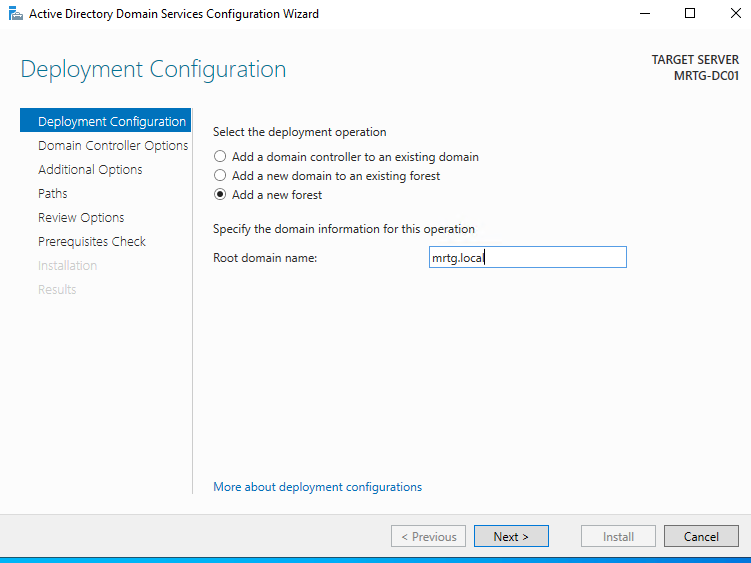
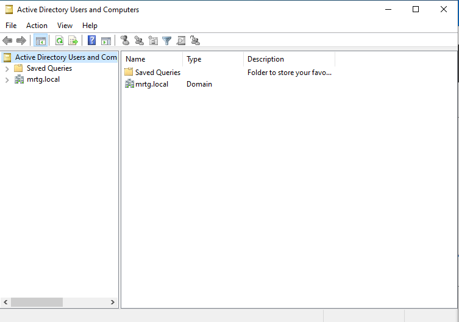
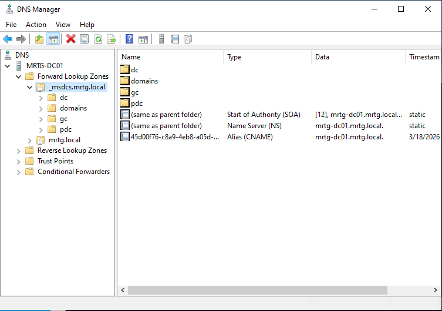
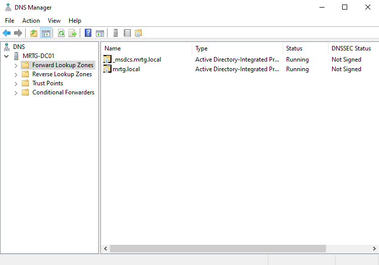
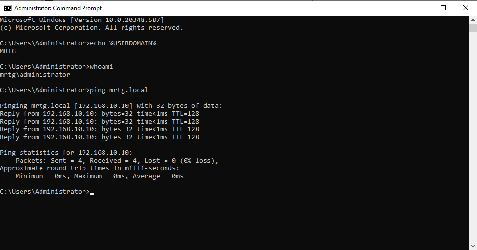

# Lab 03 — Domain Controller Promotion and Identity Activation


---

## Objective

The objective of this lab is to promote `MRTG-DC01` to the first domain controller in the `mrtg.local` Active Directory forest.

This lab activates the identity foundation prepared in Lab 02 by creating the new forest, validating Active Directory Domain Services, confirming DNS registration, verifying domain authentication context, and creating a stable post-promotion checkpoint.

---

## Business Problem

Monroe Redstone Technology Group needs a centralized identity authority for authentication, authorization, policy enforcement, and future IAM governance.

Before users, groups, policies, access controls, and monitoring can be built, the organization needs an operational Active Directory domain.

This lab addresses the need to:

- Promote the prepared server into a domain controller
- Create the `mrtg.local` Active Directory forest
- Establish centralized domain authentication
- Validate AD-integrated DNS zones
- Confirm domain controller service records
- Verify network and DNS configuration
- Validate domain authentication context
- Preserve a stable post-promotion baseline

---

## Lab Summary

In this lab, I promoted `MRTG-DC01` as the first domain controller for the new `mrtg.local` forest.

After promotion, I validated that the domain existed in Active Directory Users and Computers, confirmed AD-integrated DNS zones, reviewed `_msdcs` service records, verified the domain controller IP and DNS configuration, confirmed domain authentication context, and created a post-promotion Hyper-V checkpoint.

This lab transitions the MRTG environment from a prepared server into an operational identity platform.

---

## Environment

| Component | Details |
|---|---|
| Domain | `mrtg.local` |
| Domain Controller | `MRTG-DC01` |
| Operating System | Windows Server 2022 |
| Directory Service | Active Directory Domain Services |
| DNS | AD-integrated DNS |
| Authentication | Kerberos-based domain authentication |
| IP Address | `192.168.10.10` |
| Virtualization Platform | Hyper-V |
| Lab Organization | Monroe Redstone Technology Group |

---

## Scope

### Included

- New forest deployment configuration
- Domain controller promotion
- `mrtg.local` forest creation
- Active Directory Users and Computers validation
- AD-integrated DNS zone validation
- `_msdcs` service record validation
- Forward lookup zone validation
- Domain controller IP and DNS validation
- Domain authentication context validation
- Domain name resolution validation
- Post-promotion Hyper-V checkpoint creation

### Not Included

- OU structure design
- User and group provisioning
- Group Policy enforcement
- Domain-joined client configuration
- Additional domain controller deployment
- DHCP configuration
- Centralized logging
- Fine-grained password policies

---

## Architecture

This lab establishes `MRTG-DC01` as the first domain controller in the MRTG environment.

```text
mrtg.local
└── MRTG-DC01
    ├── Active Directory Domain Services
    ├── AD-integrated DNS
    ├── Kerberos authentication
    └── Domain controller service registration
```

The domain controller becomes the authoritative identity provider for the lab environment.

```text
MRTG-DC01
└── mrtg.local
    ├── Authentication
    ├── Authorization
    ├── DNS service location
    ├── Directory services
    └── Future Group Policy enforcement
```

---

## Identity Activation Model

Lab 02 prepared the server for Active Directory Domain Services.

Lab 03 activates the domain.

| Phase | Lab | Purpose |
|---|---|---|
| Preparation | Lab 02 | AD DS role installed and prerequisite checks passed |
| Activation | Lab 03 | Server promoted and `mrtg.local` domain created |
| Governance Foundation | Lab 04 | OU structure and Group Policy controls begin |

This separation keeps the identity build process clean, reviewable, and easier to troubleshoot.

---

## Domain Controller Role

After promotion, `MRTG-DC01` provides the following core services:

| Service | Purpose |
|---|---|
| Active Directory Domain Services | Stores and manages domain identities |
| DNS | Supports domain name resolution and service discovery |
| Kerberos | Provides domain authentication |
| Service Records | Allows clients and services to locate domain controllers |
| Directory Management | Enables future users, groups, OUs, and policies |

---

## Implementation and Validation

### 1. New Forest Deployment Configured

The Active Directory Domain Services Configuration Wizard was used to configure a new forest.

Selected deployment operation:

```text
Add a new forest
```

Root domain name:

```text
mrtg.local
```



This step started the identity activation process for the MRTG domain.

---

### 2. Active Directory Domain Created

After promotion, Active Directory Users and Computers was opened to confirm that the `mrtg.local` domain existed.



This confirmed that the new Active Directory domain was created successfully.

---

### 3. DNS `_msdcs` Service Records Validated

DNS Manager was used to review the `_msdcs.mrtg.local` zone.

The zone contained domain controller service location records required for Active Directory discovery.



This confirmed that domain controller service registration was present.

---

### 4. DNS Forward Lookup Zones Validated

DNS Manager was used to validate the forward lookup zones.

Confirmed zones included:

```text
_msdcs.mrtg.local
mrtg.local
```



This confirmed that AD-integrated DNS zones were created and running.

---

### 5. Domain Controller Network Configuration Validated

`ipconfig /all` was used to confirm the domain controller network configuration.

Validated values included:

| Setting | Value |
|---|---|
| Host Name | `MRTG-DC01` |
| IPv4 Address | `192.168.10.10` |
| Subnet Mask | `255.255.255.0` |
| DNS Server | `192.168.10.10` |


This confirmed that the domain controller was using itself for DNS resolution.

---

### 6. Domain Authentication and Name Resolution Validated

Domain context and domain name resolution were validated from the command line.

Commands used:

```cmd
echo %USERDOMAIN%
whoami
ping mrtg.local
```

Validated results included:

```text
USERDOMAIN = MRTG
whoami = mrtg\administrator
mrtg.local resolved to 192.168.10.10
```



This confirmed that the server was operating in the domain context and that the domain name resolved correctly.

---

### 7. Post-Promotion Checkpoint Created

A Hyper-V checkpoint was created after successful promotion and validation.

Checkpoint name:

```text
Post-DC-Promotion
```


This preserved a stable post-promotion baseline for future labs and rollback.

---

## Security Perspective

This lab establishes the first Tier 0 identity asset in the MRTG environment.

A domain controller is a critical security system because it controls authentication, authorization, directory services, and future policy enforcement.

From a security and IAM perspective, this lab supports:

- Centralized domain authentication
- AD-integrated DNS service discovery
- Kerberos-based identity operations
- Controlled identity infrastructure activation
- Tier 0 infrastructure awareness
- Evidence-based validation
- Stable rollback readiness through checkpointing

Compromise of a domain controller can compromise the entire identity domain, so this system must be treated as privileged infrastructure.

---

## Risk Addressed

Without a properly promoted and validated domain controller, the environment cannot reliably support identity operations.

This lab reduces the risk of:

- Failed domain creation
- Missing AD-integrated DNS zones
- Broken domain controller service discovery
- Incorrect DNS self-reference
- Weak post-promotion validation
- No rollback point after identity activation
- Poor evidence for foundational identity infrastructure

---

## Control Mapping

| Control Area | How This Lab Supports It |
|---|---|
| Identity activation | Promotes `MRTG-DC01` as the first domain controller |
| Centralized authentication | Creates the `mrtg.local` domain |
| DNS service discovery | Validates `_msdcs` and forward lookup zones |
| Network validation | Confirms IP and DNS configuration |
| Authentication validation | Confirms domain context and domain resolution |
| Operational resilience | Creates post-promotion checkpoint |
| Audit readiness | Captures evidence of domain creation and validation |
| Tier 0 awareness | Establishes the first privileged identity infrastructure asset |

---

## Validation

The following validation checks were completed:

| Validation Item | Result |
|---|---|
| New forest deployment configured | Passed |
| `mrtg.local` root domain entered | Passed |
| `MRTG-DC01` promoted as domain controller | Passed |
| `mrtg.local` visible in Active Directory Users and Computers | Passed |
| `_msdcs.mrtg.local` DNS zone present | Passed |
| `mrtg.local` DNS zone present | Passed |
| Domain controller service records present | Passed |
| Domain controller IP configuration validated | Passed |
| DNS self-reference validated | Passed |
| Domain context confirmed with `%USERDOMAIN%` | Passed |
| Domain identity confirmed with `whoami` | Passed |
| `mrtg.local` resolved to `192.168.10.10` | Passed |
| Post-promotion checkpoint created | Passed |

---

## Evidence Collected

The following evidence was collected during the lab:

| Evidence | File |
|---|---|
| New forest deployment configuration | `screenshots/lab-03-01-new-forest-mrtg-local.png` |
| Active Directory domain created | `screenshots/lab-03-02-active-directory-domain-created.png` |
| DNS `_msdcs` service records | `screenshots/lab-03-03-dns-msdcs-service-records.png` |
| DNS forward lookup zones | `screenshots/lab-03-04-dns-forward-lookup-zones.png` |
| Domain controller IP configuration | `screenshots/lab-03-05-domain-controller-ipconfig.png` |
| Domain authentication validation | `screenshots/lab-03-06-domain-authentication-validation.png` |
| Post-DC promotion checkpoint | `screenshots/lab-03-07-post-dc-promotion-checkpoint.png` |

---

## What I Would Improve in Production

In a production environment, I would improve this process by:

- Using a formal domain controller promotion checklist
- Validating DNS design before promotion
- Confirming domain and forest naming standards
- Documenting Tier 0 administrative ownership
- Configuring domain controller backup immediately after promotion
- Reviewing time synchronization configuration
- Applying domain controller hardening baselines
- Restricting interactive logon to approved administrators
- Monitoring domain controller security events
- Creating a post-promotion health report
- Avoiding unnecessary roles on domain controllers
- Using formal change control for domain creation

---

## Lessons Learned

This lab reinforced that domain controller promotion is the point where identity infrastructure becomes operational.

Installing AD DS prepares the server, but promotion activates the domain.

The biggest takeaway is that promotion must be validated from multiple angles: Active Directory visibility, DNS zone creation, service records, IP configuration, domain context, and name resolution.

A domain controller should never be assumed healthy just because the promotion wizard finishes.

---

## Outcome

Lab 03 successfully promoted `MRTG-DC01` as the first domain controller in the `mrtg.local` Active Directory forest.

The lab confirmed:

- A new forest was configured for `mrtg.local`
- `MRTG-DC01` became the first domain controller
- The `mrtg.local` domain was visible in Active Directory Users and Computers
- AD-integrated DNS zones were created
- `_msdcs` service records were present
- The domain controller used `192.168.10.10` for DNS
- Domain context was validated
- `mrtg.local` resolved successfully
- A stable post-promotion checkpoint was created

The MRTG environment now has an operational Active Directory identity foundation.

---

## Next Lab

[Lab 04 — OU Design and GPO Enforcement](../Lab-04-OU-Design-and-GPO-Enforcement/)

Lab 04 will build on the activated domain by creating a structured OU design and applying Group Policy controls for centralized identity and endpoint governance.
