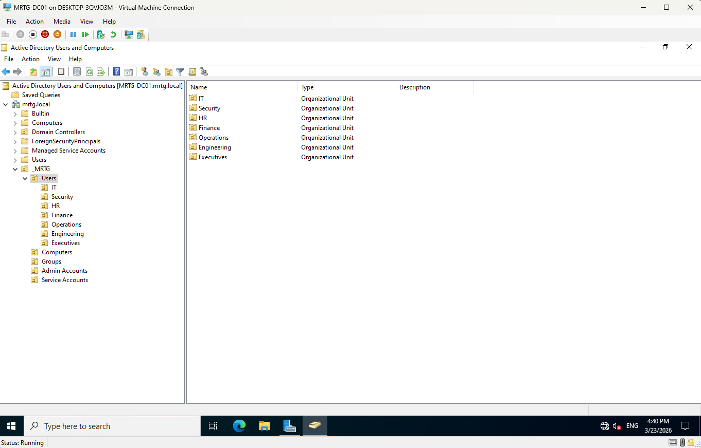
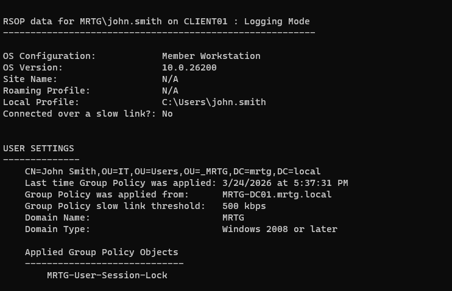
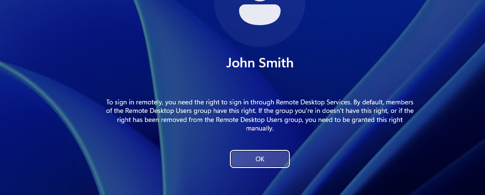
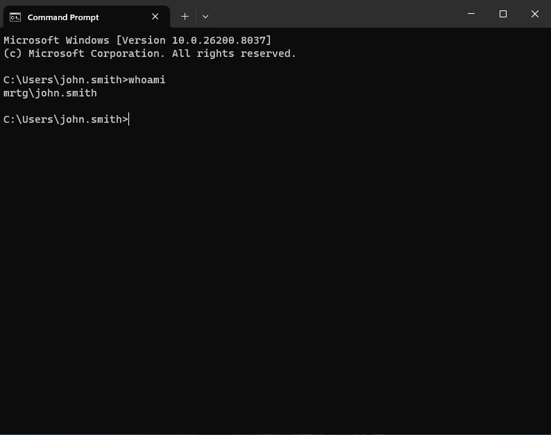

# Lab 04 — OU Design and GPO Enforcement


---

## Objective

The objective of this lab is to design an Organizational Unit structure and enforce baseline policy through Group Policy in the `mrtg.local` Active Directory domain.

This lab transitions the environment from a functioning domain controller into a structured, policy-driven identity environment.

The focus is on OU-based policy targeting, GPO enforcement, and group-based access control.

---

## Business Problem

Monroe Redstone Technology Group needs a scalable way to organize users, computers, administrative accounts, service accounts, and access groups.

Without a structured OU design and policy enforcement model, identity management becomes inconsistent, manual, and difficult to audit.

This lab addresses the need to:

- Organize Active Directory objects by function
- Separate users, computers, groups, admin accounts, and service accounts
- Apply Group Policy to targeted systems
- Validate that computer and user policies apply correctly
- Enforce access through security group membership
- Support repeatable identity governance

---

## Lab Summary

In this lab, I created a structured OU hierarchy for the MRTG domain and configured Group Policy enforcement for domain-joined systems.

I validated policy application using `gpresult /r` and tested access control behavior through Remote Desktop access.

The lab demonstrated that access should be granted through group membership instead of direct user-level permissions.

---

## Environment

| Component | Details |
|---|---|
| Domain | `mrtg.local` |
| Domain Controller | `MRTG-DC01` |
| Client System | `CLIENT01` |
| Operating System | Windows Server 2022 |
| Management Tool | Group Policy Management Console |
| Directory Tool | Active Directory Users and Computers |
| Lab Organization | Monroe Redstone Technology Group |

---

## Scope

### Included

- Organizational Unit design
- Computer OU segmentation
- Workstation object placement
- Group Policy Object creation
- GPO linking to targeted OU
- GPO scope and security filtering review
- User session lock policy configuration
- Computer policy validation
- User policy validation
- Group-based access control testing
- RDP denied and remediation validation

### Not Included

- Domain controller promotion
- Password policy hardening
- Account lockout hardening
- Fine-grained password policies
- Windows LAPS
- Certificate services
- Lifecycle automation

---

## Architecture

The MRTG domain uses a structured OU hierarchy to support policy targeting and future delegated administration.

```text
mrtg.local
└── _MRTG
    ├── Users
    │   ├── IT
    │   ├── Security
    │   ├── HR
    │   ├── Finance
    │   ├── Operations
    │   ├── Engineering
    │   └── Executives
    ├── Computers
    │   ├── Workstations
    │   └── Servers
    ├── Groups
    ├── Admin Accounts
    └── Service Accounts
```

This structure supports:

- OU-based policy targeting
- Separation of users and computers
- Administrative boundary planning
- Group-based access control
- Future delegation of control
- Future lifecycle management

---

## Identity Governance Model

This lab uses three core identity governance controls:

| Control | Purpose |
|---|---|
| Organizational Units | Structure identity and computer objects for management |
| Group Policy Objects | Enforce configuration and security settings |
| Security Groups | Control access through role-based membership |

Together, these controls create a scalable policy and access control model.

---

## Group Policy Strategy

The workstation baseline policy was designed to apply to domain-joined client systems.

The policy model used:

- GPO linked to the Workstations OU
- Security filtering through authenticated domain users
- User and computer policy validation
- Group-based access control for Remote Desktop access

This keeps policy enforcement centralized and repeatable.

---

## Access Control Model

Access was governed through security group membership.

Example group:

`GG_Remote_Desktop_Users`

This model avoids direct user-level access assignments.

Instead, access is granted by placing users into the appropriate security group.

This supports:

- Least privilege
- Easier access review
- Cleaner permissions management
- Better auditability
- Scalable access control

---

## Implementation and Validation

### 1. Organizational Unit Structure Created

A structured OU hierarchy was created under the MRTG domain.

The OU structure separated users, computers, groups, admin accounts, and service accounts.



---

### 2. Computer OU Segmentation Implemented

Computer objects were organized into dedicated OUs for future workstation and server policy targeting.


---

### 3. Client Workstation Placed in Workstations OU

`CLIENT01` was placed in the Workstations OU so workstation-specific policy could be applied.


---

### 4. User Session Lock Policy Configured

A user session lock policy was configured through Group Policy.

The policy supported endpoint security by enforcing session protection for inactive users.


---

### 5. GPO Linked to Workstations OU

The workstation policy GPO was linked to the Workstations OU.

This ensured the policy targeted the correct set of domain-joined client systems.


---

### 6. GPO Scope and Security Filtering Reviewed

The GPO scope and security filtering were reviewed to confirm the policy applied to the intended targets.


---

### 7. Computer Policy Application Validated

Computer policy application was validated using:

```powershell
gpresult /r
```

The output showed that the workstation baseline policy was applied to `CLIENT01`.


---

### 8. User Policy Application Validated

User policy application was validated to confirm that user-side policy processing was working correctly.

The output showed that the user session lock policy was applied for the signed-in domain user.



---

### 9. Access Control Failure Simulated

Remote Desktop access was tested before the user was granted the required group-based access.

The access attempt failed as expected.



This confirmed that access was not being granted automatically or through unnecessary privilege.

---

### 10. Group-Based Access Control Implemented

The user was added to the appropriate Remote Desktop access group.

Group used:

`GG_Remote_Desktop_Users`


This implemented access through role-based group membership instead of direct user-level permissions.

---

### 11. Access Remediation Validated

After group membership was updated, Remote Desktop access was tested again.

The user successfully signed in after the correct group-based permission was assigned.



This validated the group-based access control model.

---

## Security Perspective

This lab demonstrates that identity governance depends on structure, policy, and access control working together.

The OU structure provides targeting.

Group Policy provides enforcement.

Security groups provide access control.

From a security perspective, this lab supports:

- Least privilege
- Centralized policy enforcement
- Reduced manual configuration
- Group-based access control
- Easier audit review
- Repeatable access management
- Scalable identity governance

---

## Risk Addressed

Without OU structure and GPO enforcement, identity environments become inconsistent and difficult to govern.

This lab reduces the risk of:

- Unstructured Active Directory growth
- Policy misapplication
- Manual endpoint configuration drift
- Direct user-level permissions
- Inconsistent access control
- Poor auditability
- Weak least-privilege enforcement

---

## Control Mapping

| Control Area | How This Lab Supports It |
|---|---|
| OU governance | Organizes users, computers, groups, admin accounts, and service accounts |
| Policy enforcement | Applies GPO settings through OU targeting |
| Endpoint security | Enforces user session lock controls |
| Access control | Uses security groups for Remote Desktop access |
| Least privilege | Access is denied until proper group membership is assigned |
| Audit readiness | Screenshots and validation evidence document the control state |
| Operational consistency | Uses repeatable GPO and group-based access patterns |

---

## Validation

The following validation checks were completed:

| Validation Item | Result |
|---|---|
| OU hierarchy created | Passed |
| Computer OUs created | Passed |
| Client workstation placed in correct OU | Passed |
| User session lock policy configured | Passed |
| GPO linked to Workstations OU | Passed |
| GPO scope reviewed | Passed |
| Computer policy validated with `gpresult /r` | Passed |
| User policy validated | Passed |
| RDP access denied before group membership | Passed |
| User added to access group | Passed |
| RDP access granted after group membership update | Passed |

---

## Evidence Collected

The following evidence was collected during the lab:

| Evidence | File |
|---|---|
| OU structure | `images/step01_ou_structure.png` |
| Computer OU structure | `images/step02_computer_ou_structure.png` |
| Workstation OU membership | `images/step03_workstation_ou_membership.png` |
| User session lock policy | `images/step06_user_session_lock.png` |
| GPO linked to OU | `images/step07_gpo_linked_to_ou.png` |
| GPO scope filtering | `images/step08_gpo_scope_filtering.png` |
| Computer policy applied | `images/step09_computer_policy_applied.png` |
| User policy applied | `images/step10_user_policy_applied.png` |
| RDP access denied | `images/step11_rdp_access_denied.png` |
| RDP group membership | `images/step12_rdp_group_membership.png` |
| RDP successful login | `images/step13_rdp_successful_login.png` |

---

## What I Would Improve in Production

In a production environment, I would improve this process by:

- Creating a formal OU design document
- Defining naming standards for OUs, groups, and GPOs
- Separating workstation and server policy baselines
- Applying security filtering more narrowly where required
- Using WMI filtering only when needed
- Documenting GPO ownership and review cycles
- Using change management for policy changes
- Testing GPOs in a pilot OU before broad deployment
- Reviewing access groups on a regular schedule
- Avoiding direct user permissions wherever possible
- Monitoring GPO changes through event logging or SIEM

---

## Lessons Learned

This lab reinforced that Active Directory governance starts with structure.

A domain by itself is not enough. Objects need to be organized, policies need to be targeted, and access needs to be granted through groups.

The biggest takeaway is that OU design and Group Policy are foundational IAM controls. They create the structure needed for later labs involving password hardening, delegation, LAPS, lifecycle automation, and audit review.

---

## Outcome

Lab 04 successfully implemented OU-based policy targeting and group-based access control in the MRTG domain.

The lab confirmed:

- A structured OU hierarchy was created
- Computer objects were segmented into workstation and server OUs
- `CLIENT01` was placed in the Workstations OU
- A user session lock policy was configured
- GPO linking and scope were reviewed
- Computer policy application was validated
- User policy application was validated
- RDP access was denied before group-based permission assignment
- Access was granted after group membership remediation

The environment now operates as a more structured and policy-driven identity system.

---

## Next Lab

[Lab 05 — Identity Lifecycle Management](../Lab-05-Identity-Lifecycle-Management/)

Lab 05 will build on the OU and Group Policy foundation by implementing joiner, mover, and leaver workflows for managing user identities across the MRTG environment.
