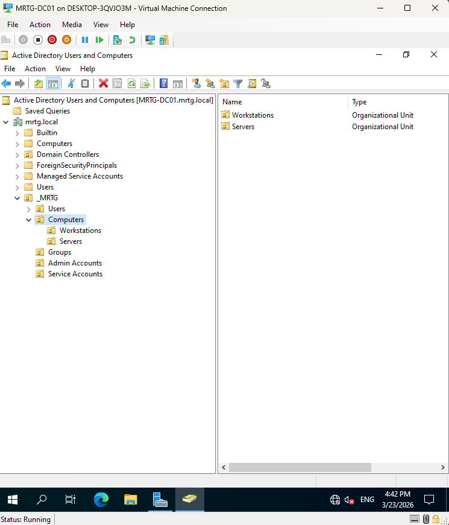
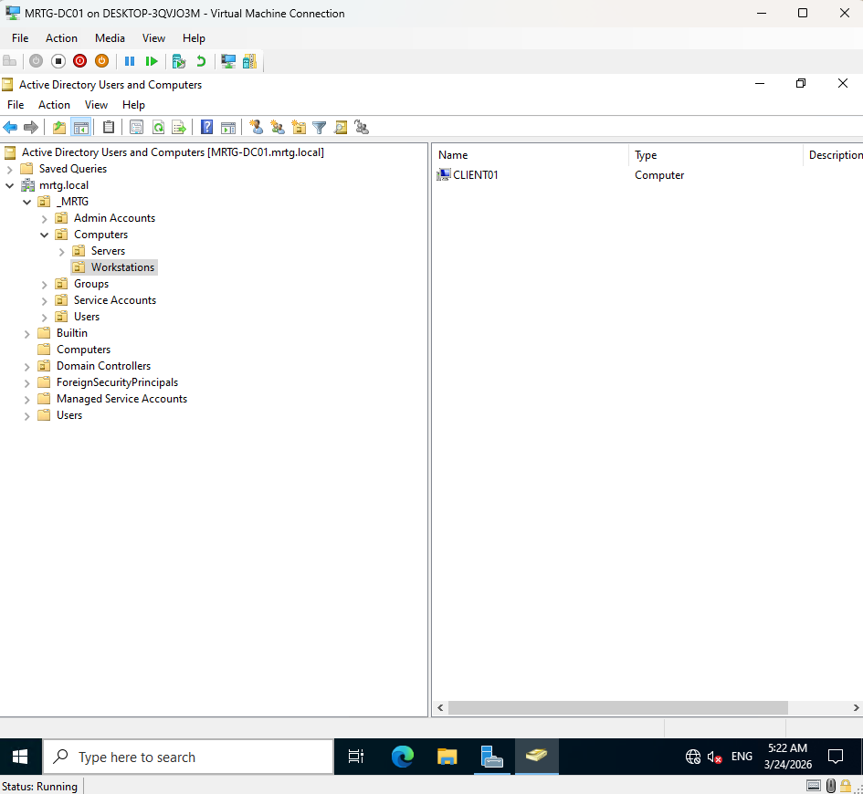
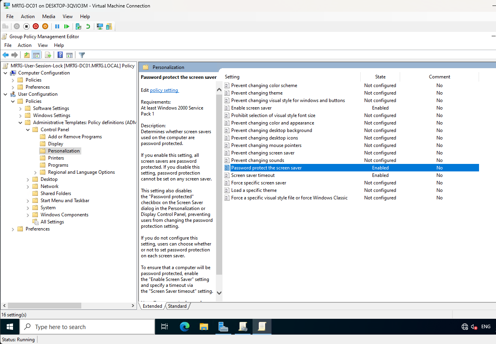
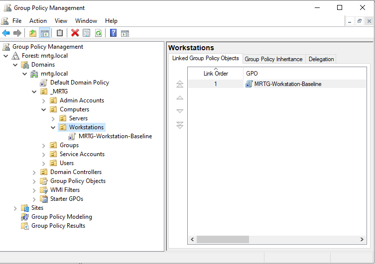
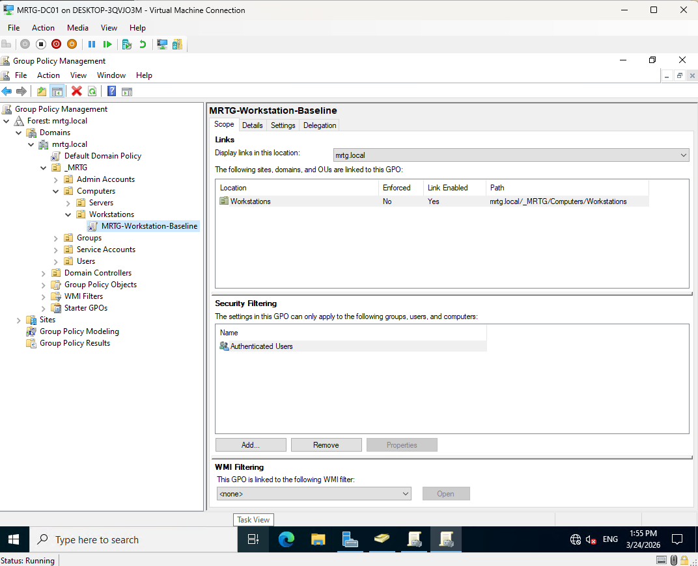
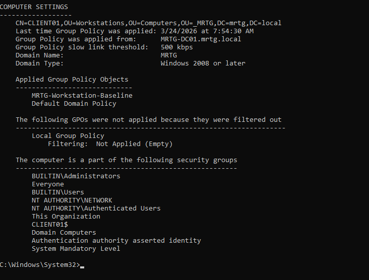
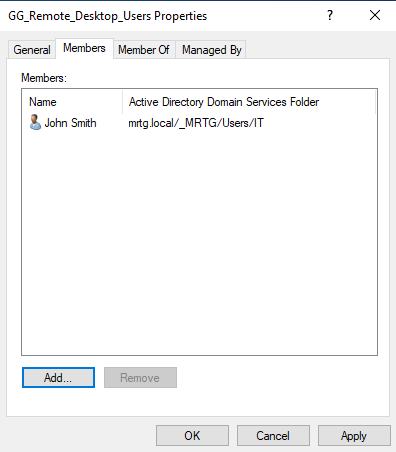

# Lab 04 — OU Design and GPO Enforcement


---

## Objective

The objective of this lab is to create a structured Organizational Unit design in the `mrtg.local` Active Directory domain and validate Group Policy enforcement against a domain-joined workstation.

This lab builds on the operational domain created in Lab 03 by introducing OU-based organization, scoped Group Policy targeting, and group-based access control.

The focus is on creating a clean directory structure, linking a workstation baseline GPO, validating policy application, and testing Remote Desktop access through security group membership.

---

## Business Problem

Monroe Redstone Technology Group needs a structured Active Directory layout that supports scalable administration, policy enforcement, and access control.

Without a clean OU structure, systems and users become difficult to manage. Group Policy becomes harder to target, access control becomes inconsistent, and troubleshooting becomes slower.

This lab addresses the need to:

- Organize users and computers into logical OUs
- Separate workstation and server computer objects
- Prepare the domain for scalable Group Policy targeting
- Apply a user session lock policy through Group Policy
- Validate computer-side and user-side policy application
- Test access denial when a user lacks required rights
- Grant access through security group membership
- Confirm successful domain user access after remediation

---

## Lab Summary

In this lab, I created the foundational MRTG OU structure inside Active Directory.

The structure separated users, computers, groups, admin accounts, and service accounts into dedicated containers. Under the Users OU, department OUs were created for IT, Security, HR, Finance, Operations, Engineering, and Executives. Under the Computers OU, separate Workstations and Servers OUs were created.

A workstation baseline GPO was linked to the Workstations OU, and a user session lock policy was configured and validated.

Policy application was confirmed using `gpresult`, and Remote Desktop access was tested from the user side. The first test failed because the user did not have the required Remote Desktop permission. Access was then granted through the `GG_Remote_Desktop_Users` group, and the domain user successfully logged in.

---

## Environment

| Component | Details |
|---|---|
| Domain | `mrtg.local` |
| Domain Controller | `MRTG-DC01` |
| Client Workstation | `CLIENT01` |
| User Tested | `john.smith` |
| Security Group | `GG_Remote_Desktop_Users` |
| Workstation GPO | `MRTG-Workstation-Baseline` |
| Tools Used | Active Directory Users and Computers, Group Policy Management, gpresult |
| Virtualization Platform | Hyper-V |
| Lab Organization | Monroe Redstone Technology Group |

---

## Scope

### Included

- MRTG OU structure creation
- Department-based user OU creation
- Computer OU segmentation
- Workstations and Servers OU creation
- Workstation computer object placement
- Workstation baseline GPO linking
- GPO scope and security filtering validation
- User session lock policy configuration
- Computer policy validation with `gpresult`
- User policy validation with `gpresult`
- Remote Desktop denied-access test
- Group-based Remote Desktop access remediation
- Successful domain user login validation

### Not Included

- Password policy hardening
- Account lockout policy hardening
- Fine-Grained Password Policies
- NTFS and share permissions
- Advanced delegation
- SIEM integration
- Multi-domain-controller replication
- Local administrator password management

---

## Architecture

This lab introduces the foundational MRTG OU structure.

```text
mrtg.local
└── _MRTG
    ├── Users
    │   ├── IT
    │   ├── Security
    │   ├── HR
    │   ├── Finance
    │   ├── Operations
    │   ├── Engineering
    │   └── Executives
    ├── Computers
    │   ├── Workstations
    │   │   └── CLIENT01
    │   └── Servers
    ├── Groups
    ├── Admin Accounts
    └── Service Accounts
```

This structure supports:

- Cleaner identity administration
- Better Group Policy targeting
- Separation between users and computers
- Separation between workstations and servers
- Scalable role-based access control
- Future lifecycle, permissions, and delegation labs

---

## Group Policy Design

The workstation policy was scoped to the Workstations OU.

```text
_MRTG
└── Computers
    └── Workstations
        ├── CLIENT01
        └── MRTG-Workstation-Baseline
```

| GPO | Linked OU | Purpose |
|---|---|---|
| `MRTG-Workstation-Baseline` | `_MRTG > Computers > Workstations` | Applies baseline workstation policy settings |

The GPO was scoped using the default `Authenticated Users` security filtering.

This allows the policy to apply to authenticated domain systems in the linked OU.

---

## Access Control Model

Remote Desktop access was controlled through security group membership.

| Access Requirement | Control |
|---|---|
| User needs Remote Desktop access | Add user to approved RDP access group |
| User lacks required rights | RDP connection denied |
| Access granted through group | User can sign in successfully |

Security group used:

```text
GG_Remote_Desktop_Users
```

Test user:

```text
john.smith
```

This reinforces a key IAM principle: access should be granted through groups, not one-off manual decisions.

---

## Implementation and Validation

### 1. MRTG User OU Structure Created

The `_MRTG` OU structure was reviewed in Active Directory Users and Computers.

Department OUs were created under `_MRTG > Users`.

Departments included:

- IT
- Security
- HR
- Finance
- Operations
- Engineering
- Executives


This created a clean structure for future identity lifecycle and access management labs.

---

### 2. Computer OU Structure Created

The Computers OU was organized into separate endpoint categories.

Created OUs:

```text
Workstations
Servers
```



This separated workstation and server objects so each category can receive different policies.

---

### 3. Workstation Object Placed in Workstations OU

The `CLIENT01` computer object was placed in the Workstations OU.



This ensured workstation policies could be targeted correctly through OU placement.

---

### 4. User Session Lock Policy Configured

The `MRTG-User-Session-Lock` policy was configured to require password protection for the screen saver.

Configured setting:

```text
Password protect the screen saver = Enabled
```



This supports basic workstation session protection by reducing the chance of unattended user sessions remaining accessible.

---

### 5. Workstation Baseline GPO Linked

The `MRTG-Workstation-Baseline` GPO was linked to the Workstations OU.



This confirmed that workstation policy targeting was based on OU placement.

---

### 6. GPO Scope and Security Filtering Reviewed

The GPO scope was reviewed in Group Policy Management.

Security filtering showed:

```text
Authenticated Users
```



This confirmed that the GPO was linked to the correct OU and had valid security filtering.

---

### 7. Computer Policy Application Validated

Computer-side Group Policy application was validated on `CLIENT01`.

Command used:

```cmd
gpresult /r
```

Confirmed applied GPOs included:

```text
MRTG-Workstation-Baseline
Default Domain Policy
```



This confirmed that the workstation received the intended computer policy from Active Directory.

---

### 8. User Policy Application Validated

User-side Group Policy application was validated for:

```text
MRTG\john.smith
```

The result showed that `MRTG-User-Session-Lock` applied to the user session.


This confirmed that user-targeted policy was applying successfully.

---

### 9. Remote Desktop Access Denied

A Remote Desktop sign-in attempt was tested for `John Smith`.

The sign-in failed because the user did not have the required right to sign in through Remote Desktop Services.


This validated that access was denied when the user lacked the required permission.

---

### 10. Remote Desktop Group Membership Updated

`John Smith` was added to the `GG_Remote_Desktop_Users` security group.



This remediated the access issue using group-based access control instead of direct user-level permission assignment.

---

### 11. Successful Domain User Login Validated

After access was remediated through group membership, `John Smith` successfully logged in.

Command used:

```cmd
whoami
```

Validated result:

```text
mrtg\john.smith
```


This confirmed that access was granted correctly after group membership was updated.

---

## Security Perspective

This lab demonstrates how Active Directory structure supports identity governance.

A clean OU design allows administrators to apply policy by system type, department, and administrative boundary. Group Policy allows settings to be enforced centrally instead of relying on manual local configuration.

From a security and IAM perspective, this lab supports:

- OU-based policy targeting
- Department-based identity organization
- Workstation and server separation
- User session protection
- Group-based access control
- Least privilege validation
- Access denial and remediation testing
- Policy validation using native Windows tools

The important lesson is that structure matters. Good access control depends on clean identity organization.

---

## Risk Addressed

Without OU design and GPO enforcement, Active Directory becomes harder to manage and easier to misconfigure.

This lab reduces the risk of:

- Unstructured directory growth
- Poor Group Policy targeting
- Workstations and servers receiving incorrect policies
- Manual endpoint configuration drift
- Users receiving direct access instead of group-based access
- Unvalidated policy enforcement
- Inconsistent access remediation
- Poor evidence during troubleshooting or review

---

## Control Mapping

| Control Area | How This Lab Supports It |
|---|---|
| Directory organization | Creates structured MRTG OUs |
| Policy targeting | Links workstation GPO to Workstations OU |
| Endpoint governance | Applies workstation baseline policy |
| Session protection | Enables password-protected screen saver policy |
| Access control | Tests and remediates RDP access through group membership |
| Least privilege | Validates denied access before granting access |
| Operational validation | Uses `gpresult` and login testing |
| Audit readiness | Captures evidence of OU design, GPO scope, and access results |

---

## Validation

The following validation checks were completed:

| Validation Item | Result |
|---|---|
| Department user OUs created | Passed |
| Workstations OU created | Passed |
| Servers OU created | Passed |
| `CLIENT01` placed in Workstations OU | Passed |
| User session lock policy configured | Passed |
| `MRTG-Workstation-Baseline` linked to Workstations OU | Passed |
| GPO scope and security filtering reviewed | Passed |
| Computer-side policy applied to `CLIENT01` | Passed |
| User-side policy applied to `john.smith` | Passed |
| RDP access denied before group membership | Passed |
| `john.smith` added to `GG_Remote_Desktop_Users` | Passed |
| Successful domain user login validated | Passed |

---

## Evidence Collected

The following evidence was collected during the lab:

| Evidence | File |
|---|---|
| OU structure | `screenshots/lab-04-01-ou-structure.png` |
| Computer OU structure | `screenshots/lab-04-02-computer-ou-structure.png` |
| Workstation OU membership | `screenshots/lab-04-03-workstation-ou-membership.png` |
| User session lock GPO setting | `screenshots/lab-04-04-user-session-lock-gpo-setting.png` |
| Workstation baseline GPO linked | `screenshots/lab-04-05-workstation-baseline-gpo-linked.png` |
| GPO scope and security filtering | `screenshots/lab-04-06-gpo-scope-and-security-filtering.png` |
| Computer policy applied | `screenshots/lab-04-07-computer-policy-applied.png` |
| User policy applied | `screenshots/lab-04-08-user-policy-applied.png` |
| RDP access denied | `screenshots/lab-04-09-rdp-access-denied.png` |
| Remote Desktop Users group membership | `screenshots/lab-04-10-remote-desktop-users-group-membership.png` |
| Successful domain user login | `screenshots/lab-04-11-successful-domain-user-login.png` |

---

## What I Would Improve in Production

In a production environment, I would improve this process by:

- Documenting an approved OU design standard
- Separating production, test, and administrative systems
- Using formal naming standards for all OUs and groups
- Creating dedicated GPOs for specific control purposes
- Avoiding broad GPO changes without testing
- Using pilot OUs before applying policies broadly
- Reviewing GPO inheritance and blocking rules carefully
- Auditing Remote Desktop group membership regularly
- Monitoring privileged and remote access group changes
- Using change management for GPO updates
- Documenting access request and approval workflows
- Reviewing RDP access against least privilege requirements

---

## Lessons Learned

This lab reinforced that Active Directory governance starts with structure.

OUs are not just folders. They are policy targeting and administrative boundary tools.

The biggest takeaway is that Group Policy and access control both need validation. A GPO should be confirmed with `gpresult`, and access should be tested from the user side.

The RDP test also reinforced an important security principle: access should fail by default until the user is placed into the correct approved group.

---

## Outcome

Lab 04 successfully implemented foundational OU design, Group Policy enforcement, and group-based access control in the MRTG Active Directory environment.

The lab confirmed:

- The MRTG OU structure was created
- Department user OUs were established
- Workstations and Servers OUs were created
- `CLIENT01` was placed in the Workstations OU
- A workstation baseline GPO was linked
- A user session lock policy was configured
- Computer-side policy applied successfully
- User-side policy applied successfully
- Remote Desktop access was denied before proper group membership
- Access was remediated through `GG_Remote_Desktop_Users`
- Successful domain user login was validated

The environment now has a structured foundation for future identity lifecycle, access control, and policy governance labs.

---

## Next Lab

[Lab 05 — Identity Lifecycle Management](../Lab-05-Identity-Lifecycle-Management/)

Lab 05 will build on the OU and access control foundation by implementing joiner, mover, and leaver workflows for managing user identities across the MRTG environment.
