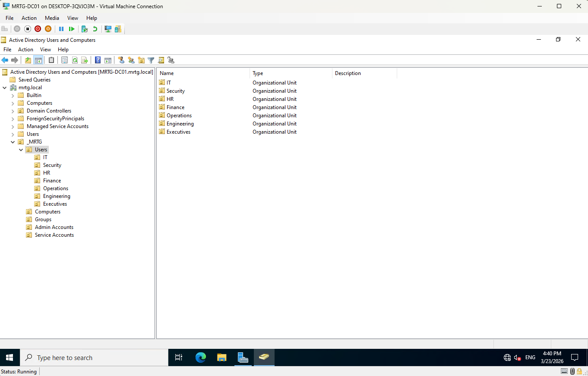
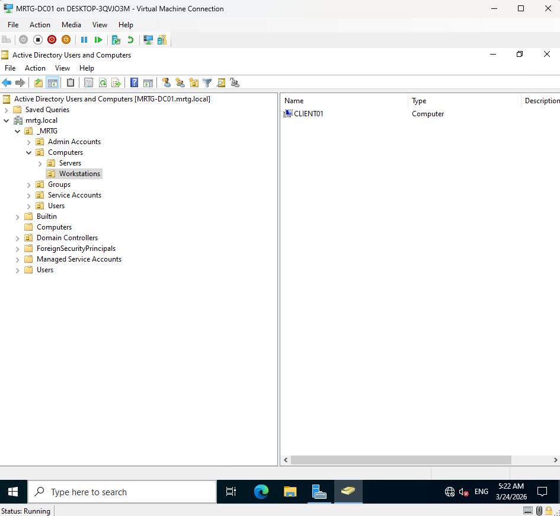
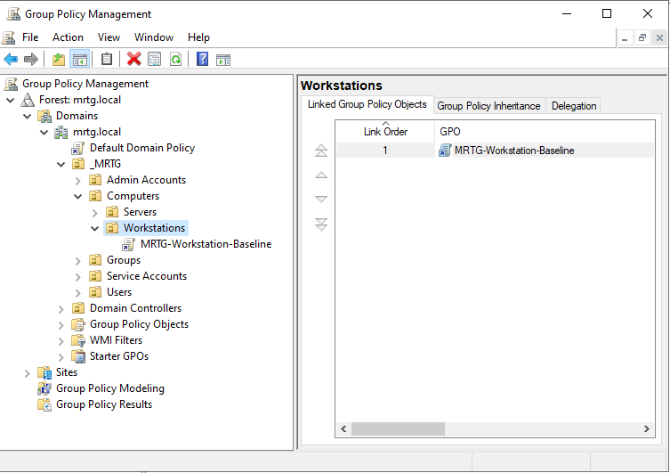
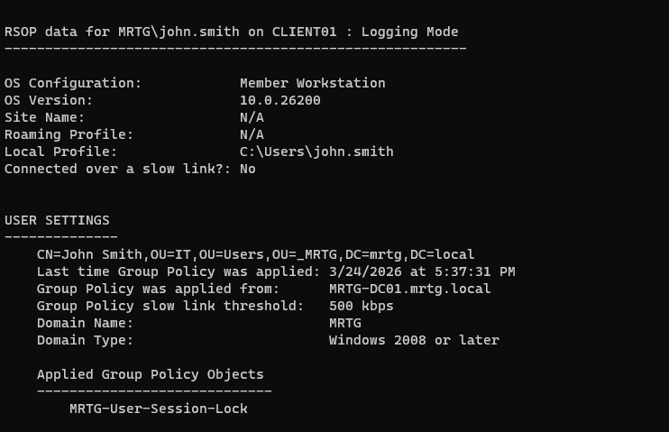

Lab-04 — OU Design and GPO Enforcement (Access Control)
---

## Overview

This lab focuses on implementing policy-based identity control within the MRTG Active Directory environment using Organizational Units (OUs) and Group Policy Objects (GPOs).

This phase introduces centralized policy enforcement, enabling standardized configuration, security controls, and scalable identity management across the domain.

This lab demonstrates how identity transitions from static objects to controlled and governed entities.

---

## Why This Matters

In enterprise and government environments, identity must be controlled through policy.

Group Policy enables:

- Centralized configuration management
- Enforcement of security baselines
- Identity-based targeting through OU structure
- Scalable and repeatable access control

Without policy enforcement, identity systems become inconsistent and insecure.

---

## Environment

| Component           | Value              |
|--------------------|-------------------|
| Domain Name        | mrtg.local        |
| Domain Controller  | MRTG-DC01         |
| Tools Used         | Group Policy Management Console (GPMC) |
| Platform           | Windows Server 2022 |

---

## Architecture

### Organizational Unit Structure

mrtg.local
│
└── _MRTG
├── Users
├── Computers
│ ├── Workstations
│ └── Servers
├── Groups
├── Admin Accounts
└── Service Accounts

---

## Lab Steps and Evidence

### 1. Designed Organizational Unit (OU) Structure

A structured OU hierarchy was created to reflect enterprise business functions and enable policy targeting.

---

### 2. Implemented Computer OU Segmentation

Dedicated OUs were created for Servers and Workstations to allow device-specific policy enforcement.

---

### 3. Joined Client Machine to Domain and Placed in Workstations OU

CLIENT01 was domain-joined and moved into the Workstations OU for policy application.

---

### 4. Configured Password Policy

A baseline password policy was implemented to enforce credential security:

- Password history enforced  
- Minimum length configured  
- Complexity requirements enabled  

---

### 5. Configured Account Lockout Policy

Account lockout settings were applied to protect against brute-force attacks:

- Lockout threshold defined  
- Lockout duration configured  
- Reset counter configured  

---

### 6. Configured User Session Lock Policy

A user-based GPO was created to enforce automatic session locking:

- Screen saver enabled  
- Password protection enforced  
- Idle timeout configured  

---

### 7. Linked GPO to Workstations OU

The workstation baseline GPO was linked to the Workstations OU to enforce policy at the device level.

---

### 8. Configured GPO Scope and Security Filtering

Security filtering was configured to ensure policies applied only to intended users and systems.

---

### 9. Validated Computer Policy Application

Group Policy results confirmed that workstation-level policies were successfully applied.

---

### 10. Validated User Policy Application

User-level policies were verified using gpresult to confirm correct GPO enforcement.

---

### 11. Simulated Access Control Issue (RDP Denied)

An RDP login attempt failed due to missing group-based access permissions.

---

### 12. Implemented Group-Based Access Control

User was added to the Remote Desktop Users group to grant appropriate access.

---

### 13. Validated Access Remediation

After group assignment and policy update, RDP access was successfully granted.

---

## Outcome

Policy-based identity control was successfully implemented.

- OUs structured for targeted policy application
- Security baseline policies enforced via GPO
- Policy application validated at both computer and user levels
- Access control enforced through group-based permissions

This environment now supports scalable, policy-driven identity and access management.

---

## IAM / Security Perspective

This lab demonstrates how identity is governed through policy enforcement.

Key concepts implemented:

- OU-based policy targeting
- Role-based access control (RBAC)
- Security baseline enforcement
- Validation through system tools (`gpresult`)
- Access control through group membership

This reflects real-world enterprise IAM practices, where identity, policy, and access are tightly integrated.

---

## Next Lab

[Lab-05 — Identity Lifecycle Management](../Lab-05-Identity-Lifecycle-Management)

The next lab will cover:

- User provisioning (Joiner process)
- Role changes (Mover process)
- Account deactivation (Leaver process)
- Identity lifecycle governance

---
