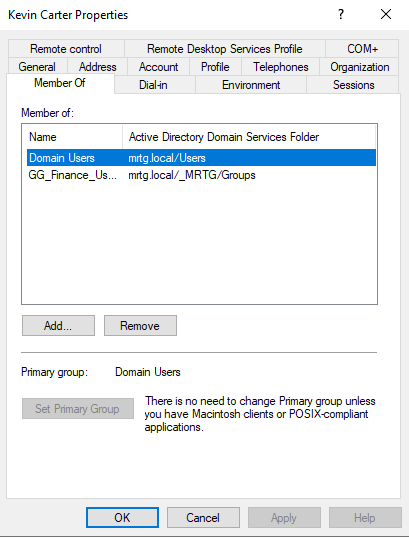
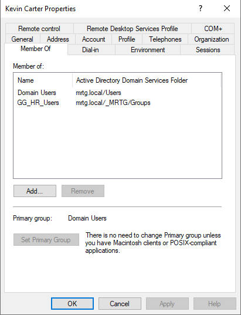
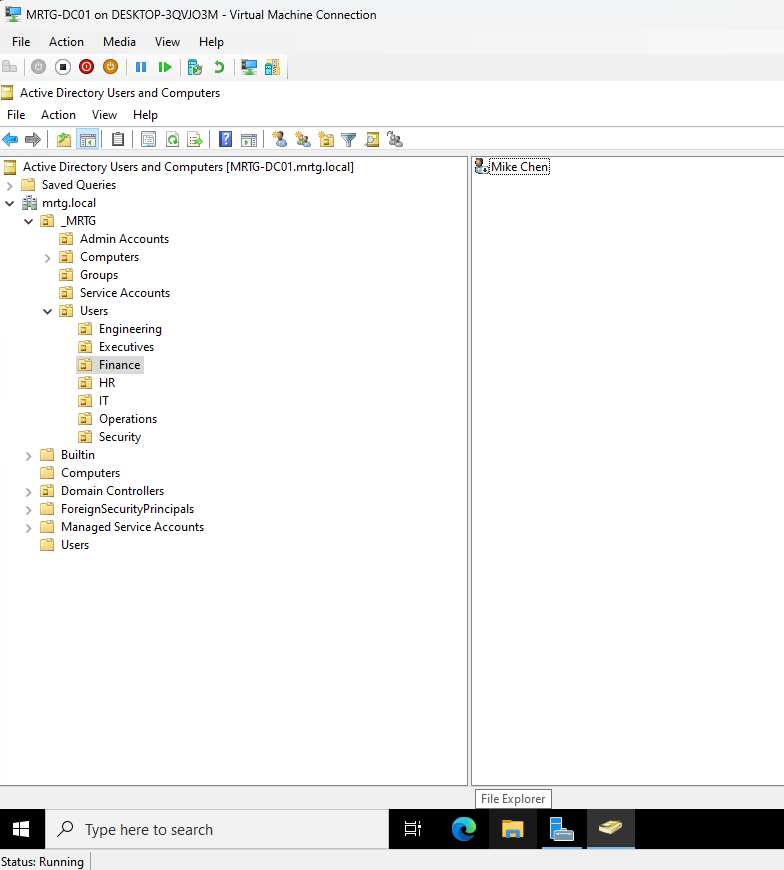
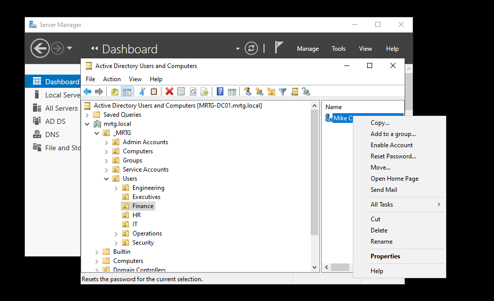
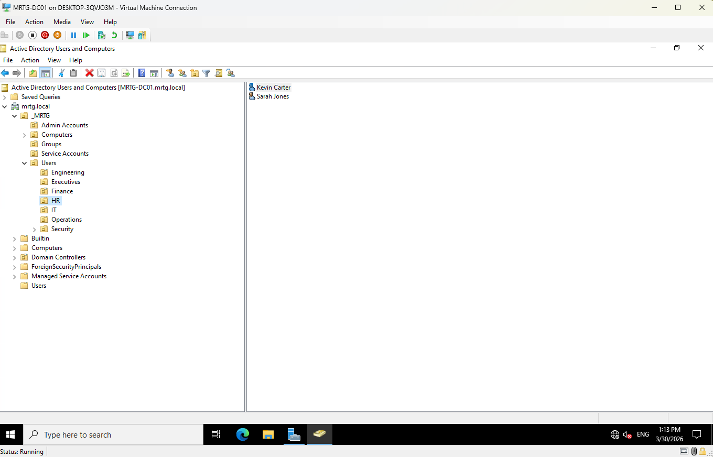

# Lab 05 — Identity Lifecycle Management


---

## Objective

The objective of this lab is to implement identity lifecycle management workflows in the `mrtg.local` Active Directory domain.

This lab focuses on joiner, mover, and leaver operations using department-aligned Organizational Units and group-based access control.

The goal is to show how user identities are created, updated, corrected, transferred, and prepared for offboarding in a controlled enterprise environment.

---

## Business Problem

Monroe Redstone Technology Group needs a repeatable process for managing user identities throughout the employment lifecycle.

Without a controlled lifecycle process, user accounts can be created inconsistently, assigned incorrect access, left in the wrong department, or remain active after a user leaves the organization.

This lab addresses the need to:

- Create users using a consistent naming standard
- Place users into the correct department OU
- Assign access through security groups
- Correct access when an identity is placed in the wrong group
- Update access when a user changes departments
- Prepare user accounts for offboarding actions
- Validate that identity state matches the user lifecycle stage
- Preserve account history instead of deleting accounts immediately

---

## Lab Summary

In this lab, I performed identity lifecycle workflows inside Active Directory Users and Computers.

The lab included:

- Reviewing the existing MRTG OU structure
- Reviewing department-based security groups
- Validating default user group membership
- Assigning department-based access through security groups
- Creating a new user account
- Correcting a user’s group membership after an initial misalignment
- Updating a user’s access during a department transfer
- Moving users into the correct department OUs
- Preparing an account action for a user lifecycle event

This lab reinforced that OU placement and group membership are related but separate controls.

OU placement supports organization and policy targeting.

Group membership controls access.

Both must be reviewed during identity lifecycle changes.

---

## Environment

| Component | Details |
|---|---|
| Domain | `mrtg.local` |
| Domain Controller | `MRTG-DC01` |
| Platform | Hyper-V |
| Directory Service | Active Directory Domain Services |
| Management Tool | Active Directory Users and Computers |
| Directory Structure | Department-based OUs under `_MRTG/Users` |
| Group Model | Global security groups for departmental access |
| Lab Organization | Monroe Redstone Technology Group |

---

## Scope

### Included

- OU structure review
- Department security group review
- User account creation
- Default group membership validation
- Department group assignment
- Group membership correction
- Department transfer workflow
- OU placement validation
- User lifecycle account action review
- Lifecycle validation through ADUC

### Not Included

- Microsoft Entra ID synchronization
- Hybrid identity
- MFA configuration
- Automated provisioning
- HR system integration
- PowerShell lifecycle automation
- Access certification campaigns
- Privileged Identity Management
- NTFS or share permission validation
- Full account deletion workflow

---

## Architecture

The MRTG directory is structured around department-aligned OUs and global security groups.

```text
mrtg.local
└── _MRTG
    ├── Users
    │   ├── Engineering
    │   ├── Executives
    │   ├── Finance
    │   ├── HR
    │   ├── IT
    │   ├── Operations
    │   └── Security
    ├── Computers
    │   ├── Servers
    │   └── Workstations
    ├── Groups
    ├── Admin Accounts
    └── Service Accounts
```

This structure supports:

- Department-based identity organization
- Group-based access assignment
- Cleaner user lifecycle tracking
- Future delegation of control
- Future automation and access review workflows

---

## Identity Lifecycle Model

This lab uses the joiner, mover, leaver model.

| Lifecycle Stage | Description |
|---|---|
| Joiner | A new user account is created, placed in the correct OU, and assigned baseline group access |
| Mover | An existing user changes department, requiring OU placement and group membership updates |
| Leaver | A departing user account is prepared for controlled offboarding actions |

This model reflects how identity teams manage account state in enterprise and government environments.

---

## Naming Convention

This lab uses the existing MRTG naming convention.

| Attribute | Format |
|---|---|
| Display Name | `First Last` |
| User Logon Name | `first.last@mrtg.local` |
| Pre-Windows 2000 Logon | `first.last` |

Example:

```text
kevin.carter@mrtg.local
```

---

## Security Groups Used

The following department-based security groups were used:

| Group | Purpose |
|---|---|
| `GG_HR_Users` | Grants HR-aligned access |
| `GG_IT_Users` | Grants IT-aligned access |
| `GG_Finance_Users` | Grants Finance-aligned access |
| `GG_Engineering_Users` | Grants Engineering-aligned access |
| `GG_Operations_Users` | Grants Operations-aligned access |
| `GG_Security_Users` | Grants Security-aligned access |
| `GG_Remote_Desktop_Users` | Grants approved Remote Desktop access |

Access is assigned through group membership instead of direct user-level permissions.

---

## Lifecycle Workflow Summary

| Workflow | User | Starting State | Ending State |
|---|---|---|---|
| Joiner | `Kevin Carter` | New user account needed | Created and corrected into HR access alignment |
| Mover | `Sarah Jones` | HR-aligned user | Moved to IT OU and assigned to `GG_IT_Users` |
| Leaver preparation | `Mike Chen` | Finance-aligned user | Account action reviewed for lifecycle handling |

---

## Implementation and Validation

### 1. Existing MRTG OU Structure Reviewed

The existing MRTG Active Directory structure was reviewed to confirm that department-based OUs were available for lifecycle management.

The structure included dedicated containers for users, computers, service accounts, admin accounts, and groups.


This confirmed that the environment had the required OU foundation for lifecycle operations.

---

### 2. Global Security Groups Reviewed

Existing global security groups were reviewed to confirm that department access could be assigned through group-based membership.


This confirmed that lifecycle workflows could use role-based access assignment instead of direct permissions.

---

### 3. Default User Membership Reviewed

Sarah Jones’s group membership was reviewed before assigning department access.

Her account was initially only a member of:

```text
Domain Users
```


This showed that the user did not yet have department-based access alignment.

---

### 4. HR User Group Membership Assigned

Sarah Jones was added to:

```text
GG_HR_Users
```


This aligned her account with HR access before later simulating a department transfer.

---

### 5. Finance User Group Membership Assigned

Mike Chen’s group membership was reviewed and confirmed to be aligned with Finance through:

```text
GG_Finance_Users
```


This established a Finance-aligned account state before lifecycle handling.

---

### 6. New User Created Using Naming Standard

A new user account was created for Kevin Carter using the MRTG naming convention.

The user account followed the `first.last` naming standard.

Initial creation path shown:

```text
mrtg.local/_MRTG/Users/Finance
```


This began the joiner workflow and also created a realistic correction scenario.

---

### 7. Initial Kevin Carter Finance Membership Reviewed

Kevin Carter was initially shown with Finance group membership.

Group shown:

```text
GG_Finance_Users
```



This was reviewed as an identity alignment issue because Kevin Carter was intended to be HR-aligned.

---

### 8. Kevin Carter Membership Corrected

Kevin Carter’s group membership was corrected from Finance alignment to HR alignment.

Corrected group:

```text
GG_HR_Users
```



This demonstrated a realistic lifecycle correction: when a user is placed into the wrong access group, the group membership must be corrected instead of leaving inherited access in place.

---

### 9. Sarah Jones IT Group Membership Updated

Sarah Jones was transferred from HR to IT by updating her group membership.

Final IT-aligned group:

```text
GG_IT_Users
```


This demonstrated how access should change when a user changes departments.

---

### 10. IT Users OU Membership Validated

The IT OU was reviewed to confirm user placement.

Visible IT users included:

```text
John Smith
Sarah Jones
```


This confirmed that Sarah Jones’s directory placement aligned with the IT department after the transfer.

---

### 11. Finance Users OU Membership Validated

The Finance OU was reviewed to confirm Finance-aligned user placement.

Visible Finance user:

```text
Mike Chen
```



This confirmed that Mike Chen remained placed in the Finance OU before lifecycle handling.

---

### 12. User Lifecycle Account Action Reviewed

A user account action menu was reviewed for Mike Chen.

Available lifecycle-related actions included:

- Reset password
- Enable account
- Move
- Delete
- Properties



This showed where account lifecycle operations can be performed from Active Directory Users and Computers.

---

### 13. HR Users OU Membership Validated

The HR OU was reviewed after correcting Kevin Carter’s membership.

Visible HR users included:

```text
Kevin Carter
Sarah Jones
```



This confirmed HR OU membership visibility during the lifecycle workflow.

---

## Correction Note

During the joiner workflow, Kevin Carter was initially created or aligned under Finance.

That was corrected by updating Kevin Carter’s group membership to:

```text
GG_HR_Users
```

This is worth documenting because identity teams regularly deal with access correction scenarios.

The important lesson is not that every lifecycle task goes perfectly. The important lesson is that incorrect access must be found, corrected, and documented.

---

## Security Perspective

Identity lifecycle management is one of the most important IAM functions.

User access should reflect the user’s current business role.

This lab supports:

- Least privilege
- Controlled onboarding
- Controlled department transfers
- Controlled account handling
- Group-based access assignment
- Reduced orphaned account risk
- Cleaner audit review
- Separation of identity placement and access assignment
- Correction of misaligned access

A user account should not keep access from a previous or incorrect department.

A lifecycle account action should be deliberate, documented, and tied to a business reason.

---

## Risk Addressed

Without lifecycle management, Active Directory environments can accumulate stale, misaligned, or overprivileged accounts.

This lab reduces the risk of:

- Inconsistent account creation
- Incorrect OU placement
- Missing department group membership
- Wrong department access assignment
- Retained access after department transfer
- Direct user-level access assignment
- Poor auditability
- Excess privilege over time
- Unreviewed account lifecycle actions

---

## Control Mapping

| Control Area | How This Lab Supports It |
|---|---|
| Joiner process | Creates a new user and assigns department-based access |
| Mover process | Updates group membership and OU placement after department transfer |
| Leaver preparation | Reviews user account lifecycle actions |
| RBAC | Uses department security groups for access alignment |
| Least privilege | Corrects wrong department access and updates transfer access |
| Audit readiness | Documents identity state before and after lifecycle changes |
| Operational consistency | Uses repeatable naming, OU placement, and group membership patterns |
| Access correction | Documents correction of misaligned group membership |

---

## Validation

The following validation checks were completed:

| Validation Item | Result |
|---|---|
| MRTG OU structure reviewed | Passed |
| Department security groups reviewed | Passed |
| Sarah Jones default membership reviewed | Passed |
| Sarah Jones added to `GG_HR_Users` | Passed |
| Mike Chen Finance membership validated | Passed |
| Kevin Carter account created | Passed |
| Kevin Carter initial Finance alignment reviewed | Passed |
| Kevin Carter corrected to `GG_HR_Users` | Passed |
| Sarah Jones updated to `GG_IT_Users` | Passed |
| Sarah Jones visible in IT OU | Passed |
| Mike Chen visible in Finance OU | Passed |
| User lifecycle account action menu reviewed | Passed |
| HR OU membership reviewed | Passed |

---

## Evidence Collected

The following evidence was collected during the lab:

| Evidence | File |
|---|---|
| MRTG OU structure | `screenshots/lab-05-01-mrtg-ou-structure.png` |
| Global security groups | `screenshots/lab-05-02-global-security-groups-created.png` |
| Default Domain Users membership | `screenshots/lab-05-03-user-default-domain-users-membership.png` |
| HR user group membership assigned | `screenshots/lab-05-04-hr-user-group-membership-assigned.png` |
| Finance user group membership assigned | `screenshots/lab-05-05-finance-user-group-membership-assigned.png` |
| New finance user Kevin Carter | `screenshots/lab-05-06-new-finance-user-kevin-carter.png` |
| Kevin Carter Finance group membership | `screenshots/lab-05-07-kevin-carter-finance-group-membership.png` |
| Kevin Carter membership correction | `screenshots/lab-05-08-kevin-carter-membership-correction.png` |
| Sarah Jones IT group membership updated | `screenshots/lab-05-09-sarah-jones-it-group-membership-updated.png` |
| IT users OU membership | `screenshots/lab-05-10-it-users-ou-membership.png` |
| Finance users OU membership | `screenshots/lab-05-11-finance-users-ou-membership.png` |
| User password reset action | `screenshots/lab-05-12-user-password-reset-action.png` |
| HR users OU membership | `screenshots/lab-05-13-hr-users-ou-membership.png` |

---

## What I Would Improve in Production

In a production environment, I would improve this process by:

- Using a formal joiner, mover, leaver request process
- Requiring manager approval for access changes
- Defining standard access packages by department
- Automating user provisioning with PowerShell or an IAM platform
- Integrating identity lifecycle workflows with an HR system
- Requiring ticket numbers for user lifecycle changes
- Performing access reviews after department transfers
- Moving disabled users to a dedicated Disabled Users OU
- Removing group memberships during offboarding where appropriate
- Defining retention timelines before account deletion
- Monitoring lifecycle changes through event logs or SIEM
- Adding a peer review step for new user creation and group assignment

---

## Lessons Learned

This lab reinforced that identity lifecycle management is not just account creation.

A complete lifecycle process includes onboarding, role changes, access correction, and account handling.

The biggest takeaway is that OU placement and group membership must both be maintained. A user can be in the correct OU but still have the wrong access if group membership is not updated.

The Kevin Carter correction was a useful reminder: mistakes in identity lifecycle work are security issues until they are corrected.

Lifecycle management is where IAM becomes operational discipline.

---

## Outcome

Lab 05 successfully implemented identity lifecycle workflows in the MRTG Active Directory environment.

The lab confirmed:

- The MRTG OU structure supported lifecycle management
- Department security groups existed for group-based access
- Sarah Jones was assigned HR access before transfer
- Mike Chen was validated as Finance-aligned
- Kevin Carter was created using the established naming standard
- Kevin Carter’s incorrect Finance alignment was identified
- Kevin Carter’s group membership was corrected to HR
- Sarah Jones was transitioned to IT access
- Sarah Jones was visible in the IT OU
- Mike Chen was visible in the Finance OU
- User account lifecycle actions were reviewed
- Access was managed through group membership instead of direct assignment

The environment now supports controlled identity lifecycle management for onboarding, transfer, correction, and account handling.

---

## Next Lab

[Lab 06 — NTFS and Share Permissions](../Lab-06-NTFS-and-Share-Permissions/)

Lab 06 will build on identity lifecycle management by applying NTFS and share permissions to control access to department resources using Active Directory users and groups.
