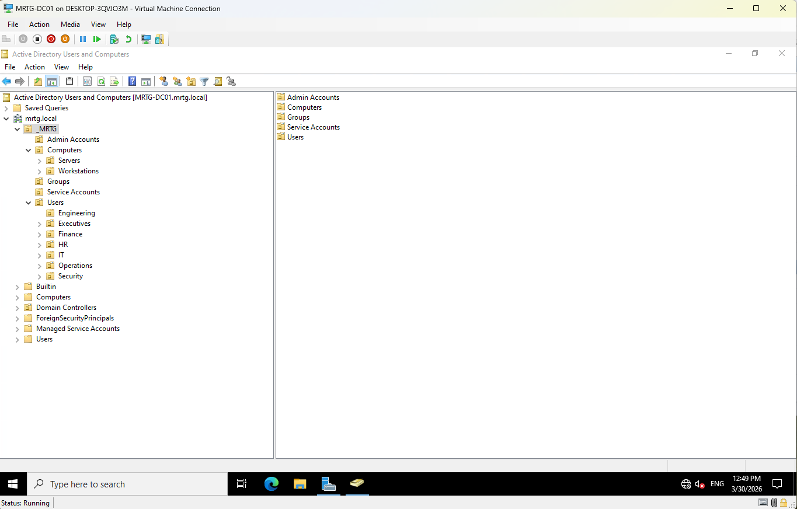
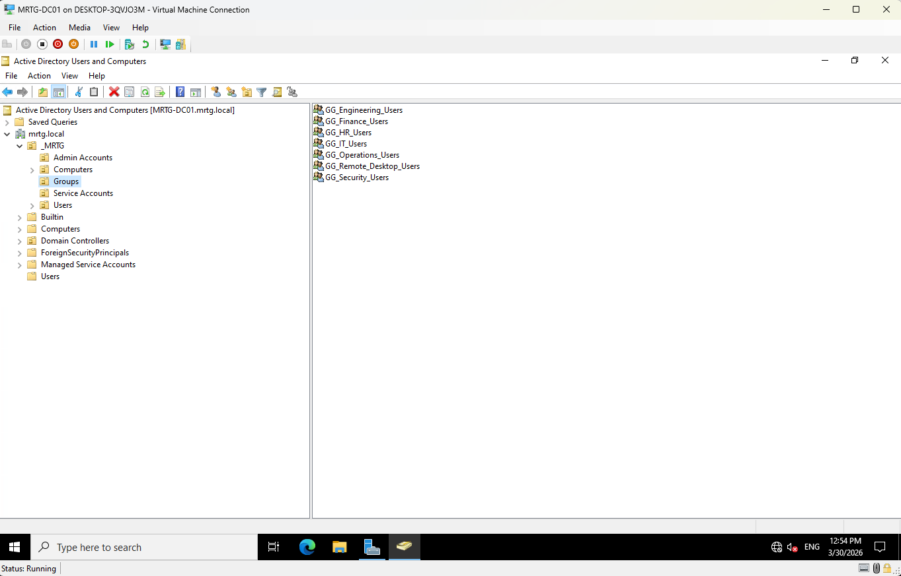
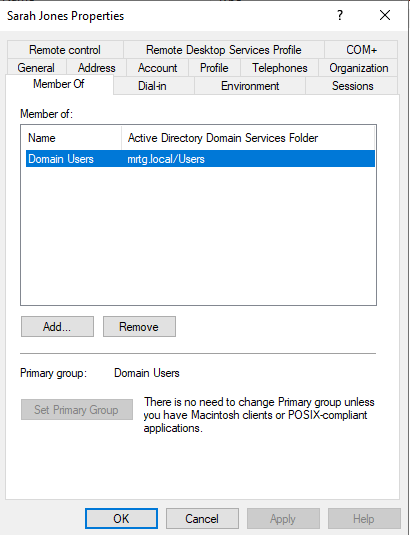
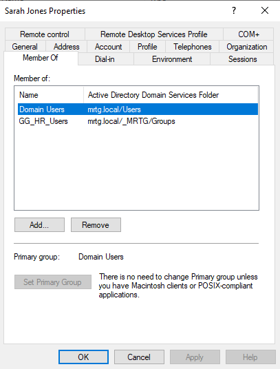
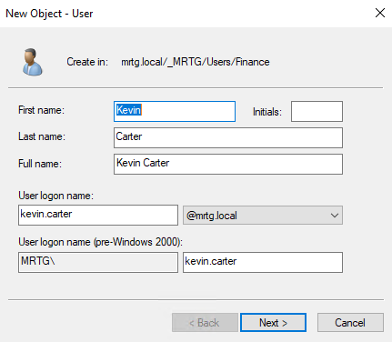
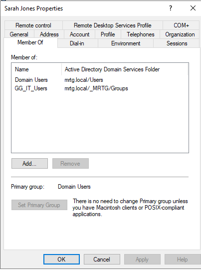
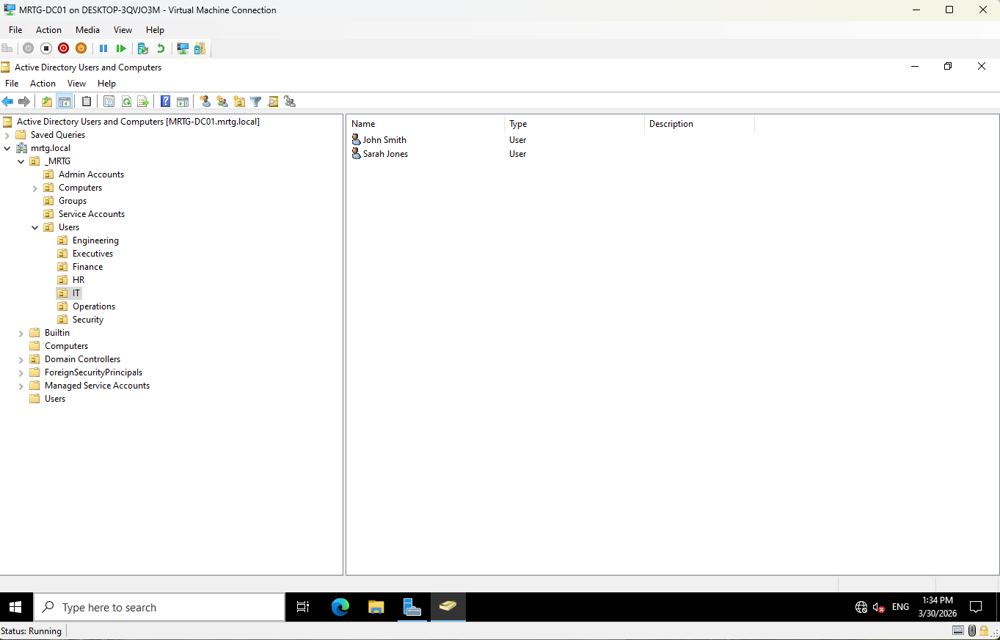

# Lab 05 — Identity Lifecycle Management


---

## Objective

The objective of this lab is to implement identity lifecycle management workflows in the `mrtg.local` Active Directory domain.

This lab focuses on joiner, mover, and leaver operations using department-aligned Organizational Units and group-based access control.

The goal is to show how user identities are created, updated, transferred, and disabled in a controlled enterprise environment.

---

## Business Problem

Monroe Redstone Technology Group needs a repeatable process for managing user identities throughout the employment lifecycle.

Without a controlled lifecycle process, user accounts can be created inconsistently, assigned incorrect access, left in the wrong department, or remain active after a user leaves the organization.

This lab addresses the need to:

- Create users using a consistent naming standard
- Place users into the correct department OU
- Assign access through security groups
- Update access when a user changes departments
- Disable accounts during offboarding
- Validate that identity state matches the user lifecycle stage

---

## Lab Summary

In this lab, I performed three core identity lifecycle workflows:

- Joiner workflow for a new HR employee
- Mover workflow for a user transferring from HR to IT
- Leaver workflow for a departing Finance employee

The lab used Active Directory Users and Computers to manage user placement, group membership, and account status.

The lab reinforced that OU placement and access group membership are related but separate controls. OU placement supports organization and policy targeting, while group membership controls access.

---

## Environment

| Component | Details |
|---|---|
| Domain | `mrtg.local` |
| Domain Controller | `MRTG-DC01` |
| Platform | Hyper-V |
| Directory Service | Active Directory Domain Services |
| Management Tool | Active Directory Users and Computers |
| Directory Structure | Department-based OUs under `_MRTG/Users` |
| Group Model | Global security groups for departmental access |
| Lab Organization | Monroe Redstone Technology Group |

---

## Scope

### Included

- User account creation
- Department OU placement
- Security group membership review
- Security group membership correction
- Joiner workflow
- Mover workflow
- Leaver workflow
- Account disablement
- Lifecycle validation through ADUC

### Not Included

- Entra ID synchronization
- Hybrid identity
- MFA configuration
- Automated provisioning
- HR system integration
- PowerShell lifecycle automation
- Access certification campaigns
- Privileged identity management

---

## Architecture

The MRTG directory is structured around department-aligned OUs and global security groups.

```text
mrtg.local
└── _MRTG
    ├── Users
    │   ├── IT
    │   ├── Security
    │   ├── HR
    │   ├── Finance
    │   ├── Operations
    │   ├── Engineering
    │   └── Executives
    ├── Computers
    │   ├── Workstations
    │   └── Servers
    ├── Groups
    ├── Admin Accounts
    └── Service Accounts
```

This structure supports:

- Department-based identity organization
- Group-based access assignment
- Cleaner user lifecycle tracking
- Future delegation of control
- Future automation and access review workflows

---

## Identity Lifecycle Model

This lab uses the joiner, mover, leaver model.

| Lifecycle Stage | Description |
|---|---|
| Joiner | A new user account is created, placed in the correct OU, and assigned baseline group access |
| Mover | An existing user changes department, requiring OU placement and group membership updates |
| Leaver | A departing user account is disabled to prevent continued access |

This model reflects how identity teams manage account state in enterprise and government environments.

---

## Naming Convention

This lab uses the existing MRTG naming convention.

| Attribute | Format |
|---|---|
| Display Name | `First Last` |
| User Logon Name | `first.last@mrtg.local` |
| Pre-Windows 2000 Logon | `first.last` |

Example:

```text
kevin.carter@mrtg.local
```

---

## Security Groups Used

The following department-based security groups were used:

| Group | Purpose |
|---|---|
| `GG_HR_Users` | Grants HR-aligned access |
| `GG_IT_Users` | Grants IT-aligned access |
| `GG_Finance_Users` | Grants Finance-aligned access |

Access is assigned through group membership instead of direct user-level permissions.

---

## Implementation and Validation

### 1. Existing MRTG Directory Structure Reviewed

The existing MRTG Active Directory structure was reviewed to confirm that department-based OUs were available for lifecycle management.

The structure included dedicated containers for users, computers, service accounts, admin accounts, and groups.



---

### 2. Department Security Groups Reviewed

Existing department security groups were reviewed to confirm that access could be assigned using group-based membership.



This confirmed that lifecycle workflows could use role-based access assignment instead of direct permissions.

---

### 3. Existing HR Group Alignment Validated

Sarah Jones’s group membership was reviewed before the mover workflow.

Her account was initially only a member of `Domain Users`.



This showed a gap between department placement and group-based access alignment.

---

### 4. HR Group Membership Corrected

Sarah Jones was added to `GG_HR_Users` to establish a clean HR baseline before simulating a transfer to IT.



This aligned her account with the HR department before the mover scenario.

---

### 5. Finance Group Membership Validated

Mike Chen’s group membership was reviewed before the leaver workflow.

His account was confirmed to be aligned with Finance through `GG_Finance_Users`.


This established a clean baseline before account disablement.

---

### 6. New User Created Using Naming Standard

A new account was created for Kevin Carter using the MRTG naming convention.

The user account followed the `first.last` naming standard.



This began the joiner workflow.

---

### 7. New Hire Placed in HR OU

Kevin Carter was placed in the HR Organizational Unit.


This aligned the user object with the correct department container.

---

### 8. New Hire Assigned to HR Security Group

Kevin Carter was added to `GG_HR_Users`.


This completed the joiner workflow by aligning both OU placement and group-based access.

---

### 9. Department Transfer Group Membership Updated

Sarah Jones was transferred from HR to IT by changing her group membership.

Her membership was updated from:

```text
GG_HR_Users
```

to:

```text
GG_IT_Users
```



This demonstrated how access should change when a user changes departments.

---

### 10. User Object Moved to IT OU

Sarah Jones was moved into the IT OU.



This completed the mover workflow by aligning both access and directory placement with the new department.

---

### 11. Departing Employee Account Disabled

Mike Chen’s Finance account was disabled to simulate a leaver workflow.


The account was retained in a disabled state instead of being deleted immediately.

This supports a safer offboarding model where account history and audit visibility are preserved.

---

## Security Perspective

Identity lifecycle management is one of the most important IAM functions.

User access should reflect the user’s current business role.

This lab supports:

- Least privilege
- Controlled onboarding
- Controlled department transfers
- Controlled offboarding
- Group-based access assignment
- Reduced orphaned account risk
- Cleaner audit review
- Separation of identity placement and access assignment

A user account should not keep access from a previous department after changing roles.

A departing user account should not remain enabled after offboarding.

---

## Risk Addressed

Without lifecycle management, Active Directory environments can accumulate stale, misaligned, or overprivileged accounts.

This lab reduces the risk of:

- Inconsistent account creation
- Incorrect OU placement
- Missing department group membership
- Retained access after department transfer
- Active accounts for departed users
- Direct user-level access assignment
- Poor auditability
- Excess privilege over time

---

## Control Mapping

| Control Area | How This Lab Supports It |
|---|---|
| Joiner process | Creates a new user and assigns department-based access |
| Mover process | Updates group membership and OU placement after department transfer |
| Leaver process | Disables a departing user account |
| RBAC | Uses department security groups for access alignment |
| Least privilege | Removes old department access during transfer |
| Audit readiness | Documents identity state before and after lifecycle changes |
| Operational consistency | Uses repeatable naming, OU placement, and group membership patterns |

---

## Validation

The following validation checks were completed:

| Validation Item | Result |
|---|---|
| MRTG directory structure reviewed | Passed |
| Department security groups reviewed | Passed |
| Sarah Jones initial membership reviewed | Passed |
| Sarah Jones added to `GG_HR_Users` | Passed |
| Mike Chen Finance membership validated | Passed |
| Kevin Carter account created | Passed |
| Kevin Carter placed in HR OU | Passed |
| Kevin Carter added to `GG_HR_Users` | Passed |
| Sarah Jones moved from HR access to IT access | Passed |
| Sarah Jones moved to IT OU | Passed |
| Mike Chen account disabled | Passed |

---

## Evidence Collected

The following evidence was collected during the lab:

| Evidence | File |
|---|---|
| MRTG directory structure | `images/lab05-01.png` |
| Department security groups | `images/lab05-02.png` |
| Sarah Jones initial group membership | `images/lab05-03.png` |
| Sarah Jones HR group membership correction | `images/lab05-04.png` |
| Mike Chen Finance group membership | `images/lab05-05.png` |
| Kevin Carter user creation | `images/lab05-06.png` |
| Kevin Carter HR OU placement | `images/lab05-07.png` |
| Kevin Carter HR group membership | `images/lab05-08.png` |
| Sarah Jones IT group membership | `images/lab05-09.png` |
| Sarah Jones IT OU placement | `images/lab05-10.png` |
| Mike Chen account disabled | `images/lab05-11.png` |

---

## What I Would Improve in Production

In a production environment, I would improve this process by:

- Using a formal joiner, mover, leaver request process
- Requiring manager approval for access changes
- Defining standard access packages by department
- Automating user provisioning with PowerShell or an IAM platform
- Integrating identity lifecycle workflows with an HR system
- Requiring ticket numbers for user lifecycle changes
- Performing access reviews after department transfers
- Moving disabled users to a dedicated Disabled Users OU
- Removing group memberships during offboarding where appropriate
- Defining retention timelines before account deletion
- Monitoring lifecycle changes through event logs or SIEM

---

## Lessons Learned

This lab reinforced that identity lifecycle management is not just account creation.

A complete lifecycle process includes onboarding, role changes, and offboarding.

The biggest takeaway is that OU placement and group membership must both be maintained. A user can be in the correct OU but still have the wrong access if group membership is not updated.

Lifecycle management is where IAM becomes operational discipline.

---

## Outcome

Lab 05 successfully implemented joiner, mover, and leaver workflows in the MRTG Active Directory environment.

The lab confirmed:

- Kevin Carter was created using the established naming standard
- Kevin Carter was placed in the HR OU
- Kevin Carter was added to `GG_HR_Users`
- Sarah Jones was transitioned from HR access to IT access
- Sarah Jones was moved to the IT OU
- Mike Chen’s Finance account was disabled for offboarding
- Access was managed through group membership instead of direct assignment

The environment now supports controlled identity lifecycle management for user onboarding, transfer, and offboarding.

---

## Next Lab

[Lab 06 — NTFS and Share Permissions](../Lab-06-NTFS-and-Share-Permissions/)

Lab 06 will build on identity lifecycle management by applying NTFS and share permissions to control access to department resources using Active Directory users and groups.
