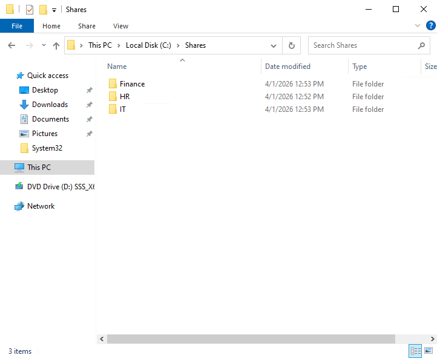
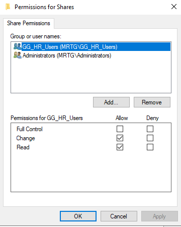
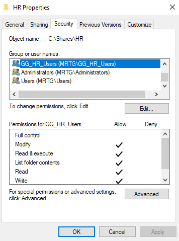
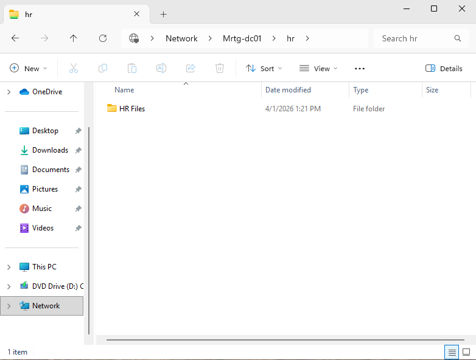
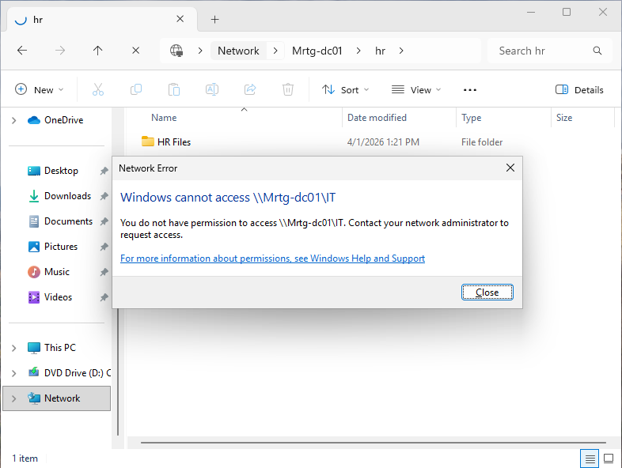
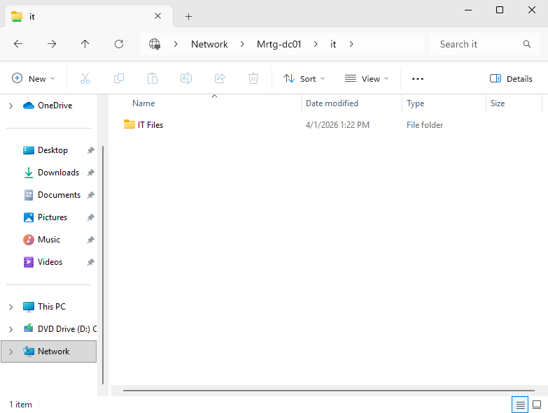
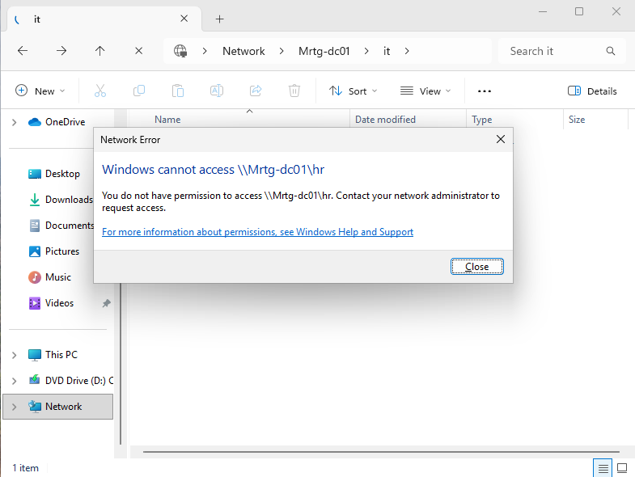

# Lab-06 — NTFS and Share Permissions

## Overview
In this lab, I implemented resource access control within the Monroe Redstone Technology Group (MRTG) Active Directory environment by configuring NTFS permissions and shared folder permissions for departmental resources. Building directly on the identity lifecycle work from Lab-05, this lab demonstrates how department-based security groups can be used to control access to shared resources in a structured enterprise environment.

## Objectives
- Create departmental shared folders for HR, IT, and Finance
- Configure share permissions using department security groups
- Configure NTFS permissions using department security groups
- Validate that authorized users can access only their assigned departmental shares
- Validate that unauthorized access is denied
- Reinforce role-based access control through group-based permission assignment

## Scope
This lab focuses on Windows file share administration and access control using NTFS permissions and share permissions in an on-premises Active Directory environment. It does not include DFS namespaces, file screening, advanced auditing, or dynamic access control.

## Lab Environment

| Component | Details |
|---|---|
| Organization | Monroe Redstone Technology Group (MRTG) |
| Domain | mrtg.local |
| Domain Controller / File Server | MRTG-DC01 |
| Platform | Hyper-V |
| Core Services | Active Directory Domain Services, DNS, SMB File Sharing |
| Share Location | `C:\Shares` |
| Department Groups | `GG_HR_Users`, `GG_IT_Users`, `GG_Finance_Users` |

## Architecture / Design
The MRTG environment uses department-aligned Active Directory security groups to control access to shared resources. Shared folders were created for HR, IT, and Finance, and access was assigned to department groups rather than directly to individual user accounts. This approach supports cleaner administration, reinforces role-based access control, and allows access decisions to follow group membership established in the identity lifecycle lab.

## Technologies Used
- Active Directory Users and Computers
- Windows Server File Sharing
- NTFS Permissions
- SMB Share Permissions
- Hyper-V

## Permission Model
This lab uses department-based security groups to control access to shared resources. Share permissions and NTFS permissions were configured together, with effective access determined by the most restrictive result. Access was assigned to groups rather than directly to user accounts in order to support cleaner administration and reinforce role-based access control.

### Department Access Model
- `GG_HR_Users` → HR share
- `GG_IT_Users` → IT share
- `GG_Finance_Users` → Finance share
- `Administrators` → Full Control
- `SYSTEM` → Full Control where applicable

## Implementation Steps

### Step 1 - Create Department Share Structure
Created a central `C:\Shares` directory and built departmental folders for HR, IT, and Finance. These folders served as the resource targets for group-based access control.

### Step 2 - Configure HR Share Permissions
Configured share permissions for the HR folder using `GG_HR_Users` and `Administrators`. This established the first layer of network-based access control for the HR department share.

### Step 3 - Configure HR NTFS Permissions
Configured NTFS permissions on the HR folder so that `GG_HR_Users` had Modify access while administrative control remained with the appropriate administrative accounts. This established the second layer of access control at the file system level.

### Step 4 - Apply the Same Access Model to IT and Finance
Repeated the same permission model for the IT and Finance folders using `GG_IT_Users` and `GG_Finance_Users`. This kept the access design consistent across departmental resources and reinforced the use of group-based permission assignment.

### Step 5 - Validate Authorized HR Access
Tested access to the HR share using Kevin Carter’s HR-aligned account. Kevin was able to open the HR share successfully, validating that the assigned group permissions were working as intended.

### Step 6 - Validate Denied IT Access for an HR User
Tested access to the IT share using Kevin Carter’s HR-aligned account. Access was denied, confirming that least privilege was being enforced and that Kevin did not receive access outside his assigned department.

### Step 7 - Validate Authorized IT Access
Tested access to the IT share using Sarah Jones’s IT-aligned account. Since Sarah was moved into IT during Lab-05, she was able to access the IT share successfully.

### Step 8 - Validate Denied HR Access for an IT User
Tested access to the HR share using Sarah Jones’s IT-aligned account. Access was denied, confirming that the move from HR to IT had changed both her identity alignment and her resulting resource access.

## Validation / Verification
- Confirmed that departmental folders were created under `C:\Shares`
- Verified that HR share permissions were assigned to `GG_HR_Users`
- Verified that HR NTFS permissions granted Modify access to `GG_HR_Users`
- Confirmed that Kevin Carter, as an HR user, could access the HR share
- Confirmed that Kevin Carter was denied access to the IT share
- Confirmed that Sarah Jones, as an IT user, could access the IT share
- Confirmed that Sarah Jones was denied access to the HR share
- Verified that access outcomes aligned with the identity and group membership changes established in Lab-05

## Outcome
This lab demonstrated how identity group membership can be extended into resource access control through properly configured share permissions and NTFS permissions. It reinforced the principle that access should be granted to groups rather than directly to users, and it validated that least privilege was being enforced through both successful and denied access tests. This lab also strengthened the continuity of the IAM series by showing that the lifecycle changes made in Lab-05 directly influenced real resource access outcomes in Lab-06.

## Next Lab
➡️ [Lab-07 - Service Accounts and Delegation](../Lab-07-Service-Accounts-and-Delegation/README.md)
