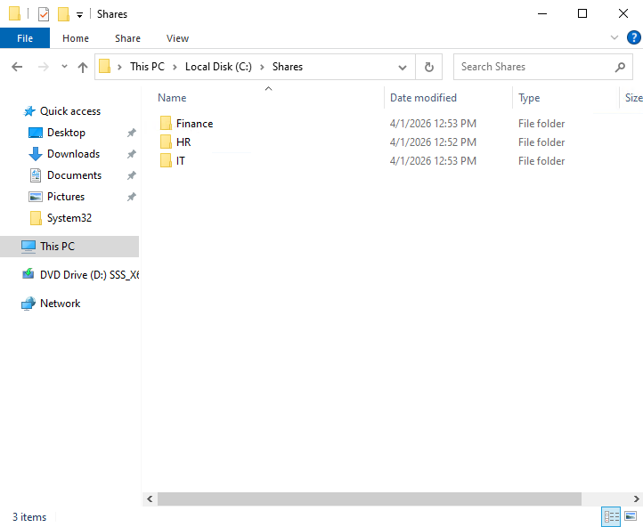
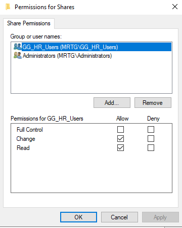
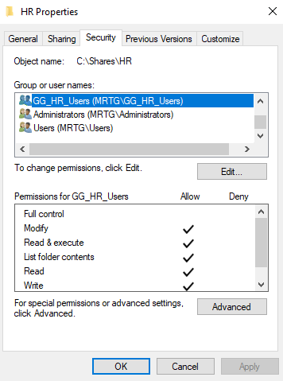
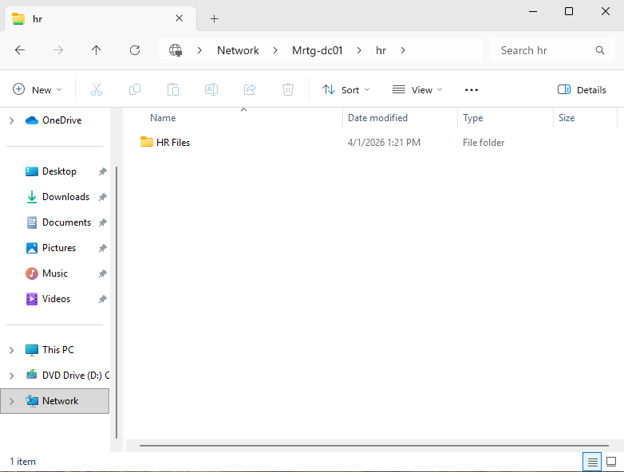
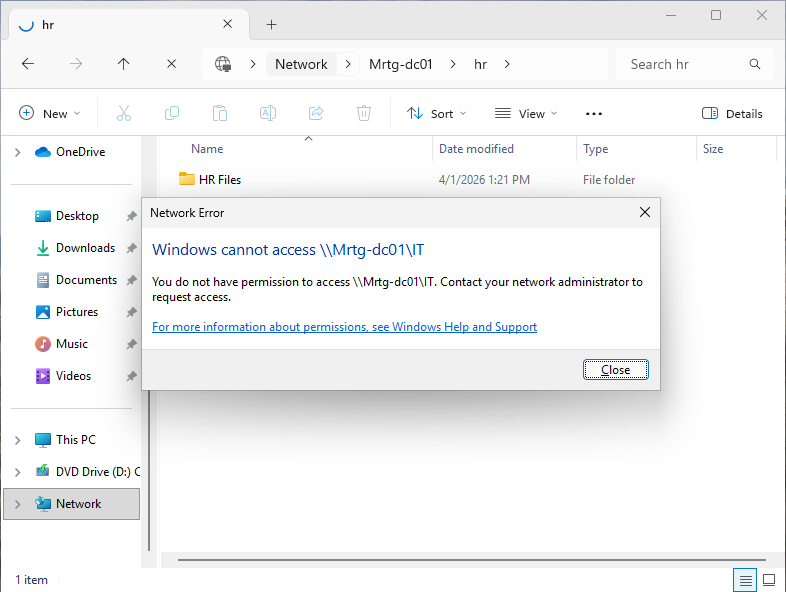
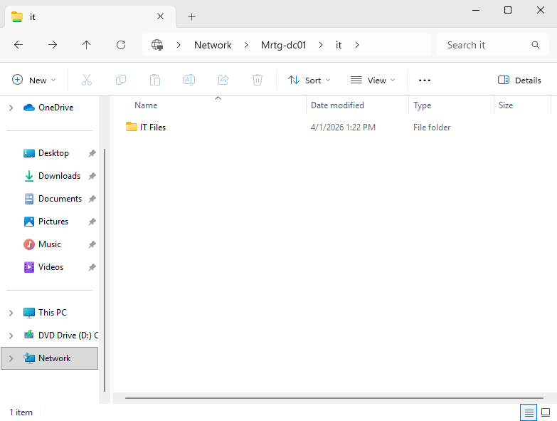
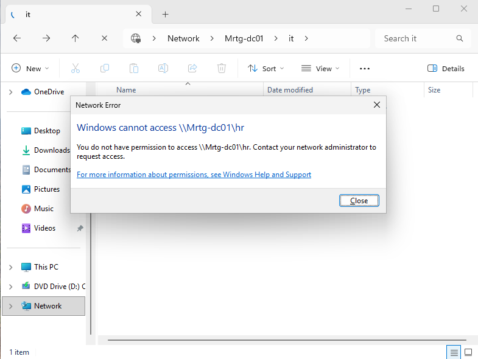

# Lab 06 — NTFS and Share Permissions


---

## Objective

The objective of this lab is to configure department-based resource access using NTFS permissions and SMB share permissions in the `mrtg.local` Active Directory domain.

This lab builds directly on the identity lifecycle work from Lab 05 by applying department security groups to shared resources.

The focus is on enforcing least privilege through group-based access control.

---

## Business Problem

Monroe Redstone Technology Group needs to control access to departmental file shares in a way that is secure, scalable, and easy to manage.

Without group-based resource permissions, administrators may assign access directly to users. This can create inconsistent permissions, excessive access, permission drift, and poor auditability.

This lab addresses the need to:

- Create department-specific shared folders
- Assign access through Active Directory security groups
- Configure SMB share permissions
- Configure NTFS permissions
- Validate authorized access
- Validate unauthorized access denial
- Reinforce least privilege through group-based resource access

---

## Lab Summary

In this lab, I created departmental shared folders for HR, IT, and Finance.

I configured share permissions and NTFS permissions using department-based Active Directory security groups.

Access was tested with users from different departments to confirm that users could access only the resources aligned to their group membership.

This lab demonstrated how identity group membership becomes real resource access control.

---

## Environment

| Component | Details |
|---|---|
| Domain | `mrtg.local` |
| Domain Controller / File Server | `MRTG-DC01` |
| Platform | Hyper-V |
| Directory Service | Active Directory Domain Services |
| File Sharing Protocol | SMB |
| Share Location | `C:\Shares` |
| Department Groups | `GG_HR_Users`, `GG_IT_Users`, `GG_Finance_Users` |
| Lab Organization | Monroe Redstone Technology Group |

---

## Scope

### Included

- Department folder creation
- SMB share configuration
- Share permission configuration
- NTFS permission configuration
- Group-based access assignment
- HR access validation
- IT access validation
- Unauthorized access denial testing
- Least privilege validation

### Not Included

- DFS namespaces
- File Server Resource Manager
- File screening
- Access-based enumeration
- Advanced auditing
- Dynamic Access Control
- Data Loss Prevention
- Microsoft Entra ID file access controls
- Cloud file access controls

---

## Architecture

The MRTG file access model uses department security groups to control access to department shares.

```text
C:\Shares
├── Finance
├── HR
└── IT
```

Access is assigned through Active Directory groups.

```text
GG_HR_Users       → HR share
GG_IT_Users       → IT share
GG_Finance_Users  → Finance share
Administrators    → Full Control
SYSTEM            → Full Control
```

This structure supports:

- Group-based access control
- Department-based resource separation
- Least privilege
- Cleaner access reviews
- Easier onboarding and transfer workflows
- Stronger audit readiness

---

## Permission Model

This lab uses both SMB share permissions and NTFS permissions.

Effective access is determined by the most restrictive combination of both permission layers.

| Permission Layer | Purpose |
|---|---|
| Share Permissions | Controls access over the network |
| NTFS Permissions | Controls access at the file system level |
| Security Groups | Assign access based on department or role |

Access was assigned to groups instead of individual users.

This supports a cleaner RBAC model because access follows group membership instead of one-off manual assignments.

---

## Department Access Model

| Department | Security Group | Resource |
|---|---|---|
| HR | `GG_HR_Users` | `\\MRTG-DC01\HR` |
| IT | `GG_IT_Users` | `\\MRTG-DC01\IT` |
| Finance | `GG_Finance_Users` | `\\MRTG-DC01\Finance` |

---

## Implementation and Validation

### 1. Department Share Folders Created

A central `C:\Shares` directory was created on `MRTG-DC01`.

Department folders were created for:

- Finance
- HR
- IT



This created the resource structure for department-based access control.

---

### 2. HR Share Permissions Configured

Share permissions were configured for the HR folder.

The HR share used group-based access through:

```text
GG_HR_Users
```

The HR group was granted Change and Read permissions at the share layer.



This established the network access layer for the HR department share.

---

### 3. HR NTFS Permissions Configured

NTFS permissions were configured on the HR folder.

`GG_HR_Users` was granted Modify access to the HR folder while administrative control remained with privileged accounts.



This established the file system access layer for the HR department share.

---

### 4. IT and Finance Permission Model Applied

The same access model was applied to the IT and Finance folders.

The following group-to-folder mappings were used:

| Folder | Security Group |
|---|---|
| HR | `GG_HR_Users` |
| IT | `GG_IT_Users` |
| Finance | `GG_Finance_Users` |

This kept the permission design consistent across department resources.

---

### 5. Authorized HR Access Validated

Kevin Carter’s HR-aligned account was used to test access to the HR share.

Kevin was able to open the HR share successfully.



This confirmed that HR group membership allowed access to the HR resource.

---

### 6. Unauthorized IT Access Denied for HR User

Kevin Carter’s HR-aligned account was used to test access to the IT share.

Access was denied.



This confirmed that HR users were not granted access to IT resources.

---

### 7. Authorized IT Access Validated

Sarah Jones’s IT-aligned account was used to test access to the IT share.

Sarah was able to open the IT share successfully.



This confirmed that IT group membership allowed access to the IT resource.

---

### 8. Unauthorized HR Access Denied for IT User

Sarah Jones’s IT-aligned account was used to test access to the HR share.

Access was denied.



This confirmed that Sarah’s move from HR to IT changed her effective resource access.

---

## Security Perspective

This lab demonstrates how identity and access control connect to real resources.

OU placement helps organize identities.

Group membership defines access.

NTFS and share permissions enforce access at the resource layer.

From a security and IAM perspective, this lab supports:

- Least privilege
- Role-based access control
- Department resource separation
- Group-based access assignment
- Reduced direct user permissions
- Cleaner access reviews
- Stronger audit readiness
- Controlled resource access after lifecycle changes

---

## Risk Addressed

Without structured NTFS and share permissions, users may gain access to resources outside their role or department.

This lab reduces the risk of:

- Direct user-level permissions
- Excessive department access
- Unauthorized file share access
- Inconsistent permission assignment
- Poor access review visibility
- Permission drift over time
- Weak separation between department resources

---

## Control Mapping

| Control Area | How This Lab Supports It |
|---|---|
| Resource access control | Uses NTFS and share permissions to protect department folders |
| RBAC | Assigns permissions to department security groups |
| Least privilege | Validates users can access only assigned department shares |
| Separation of duties | Prevents HR users from accessing IT resources and IT users from accessing HR resources |
| Lifecycle continuity | Uses group changes from Lab 05 to influence resource access |
| Audit readiness | Documents permission configuration and access test results |
| Operational consistency | Applies the same permission model across HR, IT, and Finance |

---

## Validation

The following validation checks were completed:

| Validation Item | Result |
|---|---|
| Department folders created under `C:\Shares` | Passed |
| HR share permissions configured | Passed |
| HR NTFS permissions configured | Passed |
| IT permission model applied | Passed |
| Finance permission model applied | Passed |
| Kevin Carter accessed HR share successfully | Passed |
| Kevin Carter denied access to IT share | Passed |
| Sarah Jones accessed IT share successfully | Passed |
| Sarah Jones denied access to HR share | Passed |
| Access outcomes matched department group membership | Passed |

---

## Evidence Collected

The following evidence was collected during the lab:

| Evidence | File |
|---|---|
| Department share folders created | `screenshots/lab-06-01-department-share-folders-created.png` |
| HR share permissions configured | `screenshots/lab-06-02-hr-share-permissions-configured.png` |
| HR NTFS permissions configured | `screenshots/lab-06-03-hr-ntfs-permissions-configured.png` |
| HR user access allowed | `screenshots/lab-06-04-hr-user-access-allowed.png` |
| HR user denied access to IT share | `screenshots/lab-06-05-hr-user-it-access-denied.png` |
| IT user access allowed | `screenshots/lab-06-06-it-user-access-allowed.png` |
| IT user denied access to HR share | `screenshots/lab-06-07-it-user-hr-access-denied.png` |

---

## What I Would Improve in Production

In a production environment, I would improve this process by:

- Separating file server duties from the domain controller
- Using a dedicated file server instead of hosting shares on `MRTG-DC01`
- Creating a formal department share naming standard
- Using AGDLP or AGUDLP group nesting for scalable permission management
- Applying access-based enumeration where appropriate
- Enabling auditing for sensitive department folders
- Reviewing access groups on a regular schedule
- Documenting data owners for each department share
- Using change control for permission changes
- Creating a standard access request process
- Monitoring share access and permission changes through event logs or SIEM

---

## Lessons Learned

This lab reinforced that group membership becomes meaningful when it controls access to real resources.

Creating users and groups is only the identity layer.

NTFS and share permissions are where access is enforced against actual data.

The biggest takeaway is that access should be assigned to groups, not directly to users. This makes onboarding, transfers, offboarding, and access reviews cleaner and more reliable.

---

## Outcome

Lab 06 successfully implemented group-based access control for departmental file shares in the MRTG Active Directory environment.

The lab confirmed:

- Department folders were created under `C:\Shares`
- Share permissions were configured for department access
- NTFS permissions were configured for file system enforcement
- Kevin Carter could access HR resources
- Kevin Carter was denied access to IT resources
- Sarah Jones could access IT resources
- Sarah Jones was denied access to HR resources
- Access outcomes matched department group membership

The environment now supports least-privilege file share access using Active Directory security groups.

---

## Next Lab

[Lab 07 — Service Accounts and Delegation](../Lab-07-Service-Accounts-and-Delegation/)

Lab 07 will build on resource access control by creating service accounts and applying delegation practices to support controlled administrative access in the MRTG environment.
