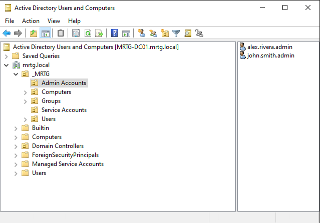
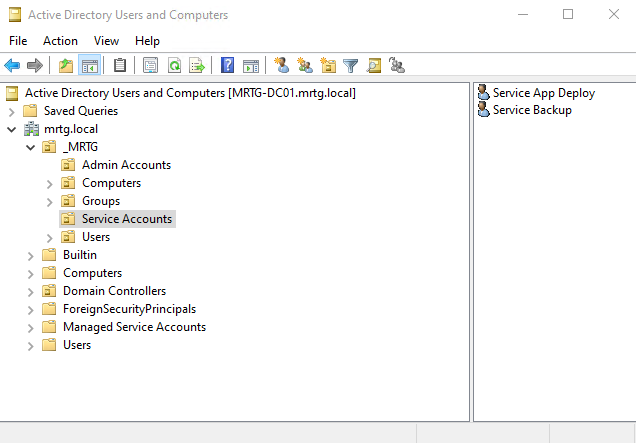
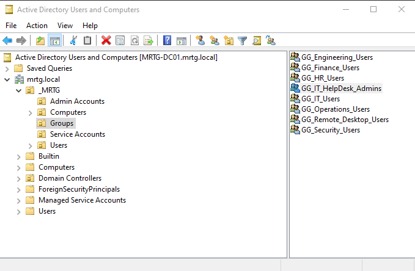

# Lab 07 — Service Accounts and Delegation


---

## Objective

The objective of this lab is to implement foundational privileged identity controls in the `mrtg.local` Active Directory domain.

This lab separates standard user accounts, named administrative accounts, service accounts, and delegated support groups.

The focus is on reducing broad administrative privilege by assigning limited user-management rights through scoped delegation.

---

## Business Problem

Monroe Redstone Technology Group needs a controlled way to support routine administrative tasks without giving Help Desk or support staff full Domain Admin access.

Without delegated administration, organizations often overuse broad privileged groups, creating unnecessary risk and poor accountability.

This lab addresses the need to:

- Separate human administrative accounts from standard user accounts
- Separate service accounts from interactive user accounts
- Create a delegated support group for limited administrative tasks
- Assign a named admin account to the delegated support role
- Delegate password reset permissions over the Users OU
- Validate that delegated access is narrower than Domain Admin privilege
- Reinforce least privilege for administrative operations

---

## Lab Summary

In this lab, I reviewed the privileged identity structure in the MRTG domain and implemented delegated administration for limited Help Desk-style support tasks.

I confirmed that named admin accounts were stored separately from standard users, service accounts were placed in a dedicated OU, and a delegated support group was created for scoped administration.

The lab delegated password reset rights over the `_MRTG/Users` OU and validated that `john.smith.admin` received delegated support rights without being added to `Domain Admins`.

---

## Environment

| Component | Details |
|---|---|
| Domain | `mrtg.local` |
| Domain Controller | `MRTG-DC01` |
| Platform | Hyper-V |
| Directory Service | Active Directory Domain Services |
| Management Tool | Active Directory Users and Computers |
| Privileged Account OU | `_MRTG/Admin Accounts` |
| Service Account OU | `_MRTG/Service Accounts` |
| Delegation Target | `_MRTG/Users` |
| Lab Organization | Monroe Redstone Technology Group |

---

## Scope

### Included

- Named administrative account review
- Service account OU review
- Delegated administration group creation
- Delegated support group membership assignment
- Delegation of password reset rights
- Validation of delegated group membership
- Validation that delegated admin account is not a Domain Admin
- Least-privilege administrative access model

### Not Included

- Group Managed Service Accounts
- Kerberos SPN configuration
- Privileged Access Management platform integration
- Tiered admin workstation deployment
- Just-in-time access
- Just Enough Administration
- Entra ID Privileged Identity Management
- Advanced privileged access monitoring

---

## Architecture

The MRTG privileged identity model separates accounts by function.

```text
mrtg.local
└── _MRTG
    ├── Users
    ├── Groups
    ├── Admin Accounts
    │   ├── alex.rivera.admin
    │   └── john.smith.admin
    └── Service Accounts
        ├── Service App Deploy
        └── Service Backup
```

Delegated administration is applied through a support group:

```text
GG_IT_HelpDesk_Admins
└── john.smith.admin
```

Delegation target:

```text
_MRTG/Users
```

This design supports:

- Separation of standard and privileged identities
- Separation of human and non-human accounts
- Scoped administrative permissions
- Least-privilege support operations
- Better accountability for administrative actions
- Reduced reliance on broad domain-wide privilege

---

## Privileged Identity Model

This lab uses three distinct privileged identity layers.

| Identity Type | Purpose |
|---|---|
| Named Admin Accounts | Used for identifiable human administrative activity |
| Service Accounts | Used for non-human operational functions |
| Delegated Admin Groups | Used to assign limited administrative rights |

This model avoids using standard user accounts for administrative tasks and avoids assigning broad privilege when scoped delegation is enough.

---

## Administrative Accounts

The following named administrative accounts were reviewed:

| Account | Purpose |
|---|---|
| `alex.rivera.admin` | Named administrative identity |
| `john.smith.admin` | Named administrative identity used for delegated support role |

Named administrative accounts support accountability because administrative actions can be tied to a specific identity.

---

## Service Accounts

The following service accounts were reviewed:

| Account | Purpose |
|---|---|
| `Service App Deploy` | Non-human service identity |
| `Service Backup` | Non-human service identity |

Service accounts were stored separately from standard users and human administrative accounts.

This supports cleaner service account governance and reduces confusion between interactive and non-interactive identities.

---

## Delegated Support Group

The delegated support group used in this lab was:

```text
GG_IT_HelpDesk_Admins
```

This group was used to assign limited password reset rights over the `_MRTG/Users` OU.

The goal was to delegate a realistic support task without assigning full domain-wide administrative privilege.

---

## Implementation and Validation

### 1. Named Administrative Accounts Reviewed

The dedicated Admin Accounts OU was reviewed to confirm that privileged human identities were separated from standard user accounts.



This supports administrative accountability by separating privileged access from day-to-day user activity.

---

### 2. Dedicated Service Accounts Reviewed

The dedicated Service Accounts OU was reviewed to confirm that non-human operational identities were stored separately.



This supports cleaner identity governance by separating service identities from standard users and named administrators.

---

### 3. Delegated Administration Group Created

The `GG_IT_HelpDesk_Admins` security group was created in the Groups OU.



This group represents a scoped support role for delegated administrative tasks.

---

### 4. Named Admin Account Assigned to Delegated Group

`john.smith.admin` was added to `GG_IT_HelpDesk_Admins`.


This assigned the delegated support role to a named administrative identity while preserving accountability.

---

### 5. Password Reset Rights Delegated Over Users OU

The Delegation of Control Wizard was used on `_MRTG/Users`.

The delegated group was granted the ability to:

- Reset user passwords
- Force password change at next logon


This provided a realistic Help Desk-style support permission without assigning unrestricted administrative control.

---

### 6. Scoped Privileged Group Membership Validated

`john.smith.admin` group membership was reviewed.

The account was confirmed as a member of:

```text
GG_IT_HelpDesk_Admins
```

The account was not a member of:

```text
Domain Admins
```


This confirmed that the delegated admin account remained scoped to a limited support role.

---

## Security Perspective

This lab demonstrates that administrative access should be scoped to the task being performed.

Not every support function requires Domain Admin rights.

From a security perspective, this lab supports:

- Least privilege
- Privileged identity separation
- Named administrative accountability
- Service account separation
- Scoped administrative delegation
- Reduced Domain Admin exposure
- Cleaner audit review
- Better privileged access boundaries

Delegation allows routine tasks to be performed safely without granting broad control over the entire domain.

---

## Risk Addressed

Without privileged identity separation and delegation, organizations often assign excessive administrative rights.

This lab reduces the risk of:

- Standard users performing administrative tasks
- Shared or unclear administrative accountability
- Service accounts being mixed with interactive users
- Help Desk users receiving excessive privilege
- Overuse of Domain Admin membership
- Poor privileged access boundaries
- Excessive blast radius from compromised support accounts

---

## Control Mapping

| Control Area | How This Lab Supports It |
|---|---|
| Privileged identity separation | Stores admin accounts separately from standard users |
| Service account governance | Stores service accounts in a dedicated OU |
| Least privilege | Delegates only password reset rights instead of Domain Admin access |
| RBAC | Uses `GG_IT_HelpDesk_Admins` as a delegated support role |
| Administrative accountability | Assigns delegation to a named admin account |
| Access boundary control | Scopes delegation to `_MRTG/Users` |
| Audit readiness | Documents privileged identity structure and delegation evidence |

---

## Validation

The following validation checks were completed:

| Validation Item | Result |
|---|---|
| Named administrative accounts reviewed | Passed |
| Admin accounts stored in `_MRTG/Admin Accounts` | Passed |
| Service accounts reviewed | Passed |
| Service accounts stored in `_MRTG/Service Accounts` | Passed |
| `GG_IT_HelpDesk_Admins` created | Passed |
| `john.smith.admin` added to delegated support group | Passed |
| Password reset rights delegated over `_MRTG/Users` | Passed |
| Force password change at next logon right delegated | Passed |
| `john.smith.admin` confirmed as delegated support member | Passed |
| `john.smith.admin` confirmed not in `Domain Admins` | Passed |

---

## Evidence Collected

The following evidence was collected during the lab:

| Evidence | File |
|---|---|
| Named administrative accounts | `images/lab07-01.png` |
| Dedicated service accounts | `images/lab07-02.png` |
| Delegated administration group | `images/lab07-03.png` |
| Delegated group membership | `images/lab07-04.png` |
| Password reset delegation | `images/lab07-05.png` |
| Scoped privileged group membership validation | `images/lab07-06.png` |

---

## What I Would Improve in Production

In a production environment, I would improve this process by:

- Using a formal privileged access model
- Defining Tier 0, Tier 1, and Tier 2 administrative boundaries
- Requiring separate privileged workstations for admin activity
- Using managed service accounts or gMSAs where appropriate
- Documenting service account owners and review cycles
- Auditing delegated rights regularly
- Monitoring password reset events
- Requiring ticket numbers for support actions
- Limiting interactive logon rights for service accounts
- Applying stronger controls to Domain Admin membership
- Using privileged access management or just-in-time access where available

---

## Lessons Learned

This lab reinforced that privileged access should be separated, scoped, and accountable.

A named admin account provides better accountability than using a standard user account for administrative work.

A service account should not be treated the same as a human admin account.

Delegated administration allows support teams to perform necessary tasks without receiving full control over the domain.

The biggest takeaway is that least privilege is not just about users. It also applies to administrators and service accounts.

---

## Outcome

Lab 07 successfully implemented foundational privileged identity controls in the MRTG Active Directory environment.

The lab confirmed:

- Named administrative accounts were separated from standard users
- Service accounts were separated into a dedicated OU
- A delegated support group was created
- `john.smith.admin` was assigned to the delegated support group
- Password reset rights were delegated over `_MRTG/Users`
- Delegated access was scoped below Domain Admin privilege
- Administrative access followed a least-privilege model

The environment now supports scoped delegated administration for routine support tasks.

---

## Next Lab

[Lab 08 — Identity Monitoring and Auditing](../Lab-08-Identity-Monitoring-and-Auditing/)

Lab 08 will build on service account and delegation controls by enabling identity monitoring and auditing to improve visibility into account activity and security-relevant events.
