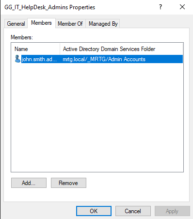
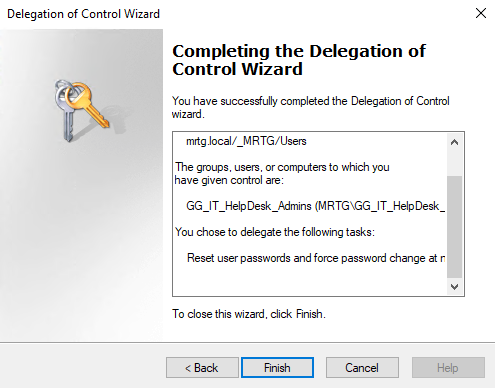
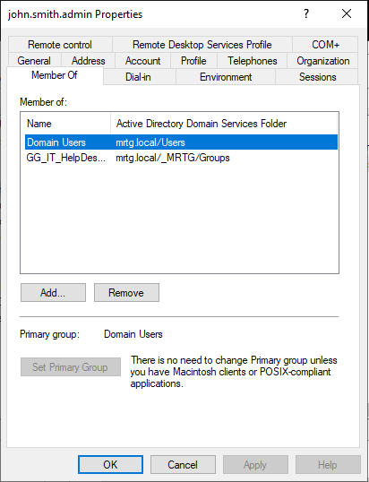

# Lab 07: Service Accounts and Delegation


---

## Objective

Implement foundational privileged identity controls in the `mrtg.local` Active Directory domain.

This lab separates standard user accounts, named administrative accounts, service accounts, and delegated support roles.

The primary goal is to reduce broad administrative privilege by assigning limited password-management permissions through scoped delegation.

---

## Business Scenario

Monroe Redstone Technology Group requires a controlled method for Help Desk personnel to perform routine identity-support tasks without receiving Domain Admin privileges.

Without delegated administration, organizations may assign excessive permissions to support personnel. This increases the impact of account compromise and weakens administrative accountability.

This lab addresses the need to:

- Separate standard and administrative identities
- Separate human and non-human accounts
- Create a delegated support group
- Assign a named administrator to the support role
- Delegate password-reset permissions over the Users OU
- Confirm that the delegated account is not a Domain Admin
- Apply least privilege to routine administrative operations

---

## Lab Summary

In this lab, I reviewed the privileged identity structure in the MRTG domain and configured scoped delegation for Help Desk-style password-management tasks.

Named administrative identities were stored separately from standard users. Service accounts were maintained in a dedicated OU, and the `GG_IT_HelpDesk_Admins` group represented the delegated support role.

The Delegation of Control Wizard granted the support group permission to reset passwords and require a password change at the next sign-in for users within `_MRTG\Users`.

The named administrative account `john.smith.admin` was assigned to the delegated group without being added to `Domain Admins`.

---

## Environment

| Component | Details |
|---|---|
| Domain | `mrtg.local` |
| Domain Controller | `MRTG-DC01` |
| Directory Service | Active Directory Domain Services |
| Management Tool | Active Directory Users and Computers |
| Administrative Account OU | `_MRTG\Admin Accounts` |
| Service Account OU | `_MRTG\Service Accounts` |
| Delegated Support Group | `GG_IT_HelpDesk_Admins` |
| Delegation Target | `_MRTG\Users` |
| Named Administrative Account | `john.smith.admin` |
| Virtualization Platform | Hyper-V |
| Organization | Monroe Redstone Technology Group |

---

## Prerequisites

- Operational `mrtg.local` Active Directory domain
- Established `_MRTG` OU structure
- Dedicated Admin Accounts OU
- Dedicated Service Accounts OU
- Groups OU for role-based security groups
- Named administrative account `john.smith.admin`
- Administrative access to configure delegation
- Defined Help Desk password-management responsibilities

---

## Scope

### Included

- Named administrative account review
- Service account OU review
- Delegated support group review
- Delegated group membership assignment
- Password-reset delegation
- Force-password-change delegation
- Delegation scope review
- Domain Admin membership review
- Least-privilege administrative design

### Not Included

- Functional password-reset testing while signed in as `john.smith.admin`
- Group Managed Service Accounts
- Service Principal Name configuration
- Privileged Access Management integration
- Privileged administrative workstation deployment
- Just-in-time access
- Just Enough Administration
- Microsoft Entra Privileged Identity Management
- Advanced privileged activity monitoring
- SIEM alerting

---

## Privileged Identity Architecture

The MRTG structure separates identities according to function.

```text
mrtg.local
`-- _MRTG
    |-- Users
    |-- Groups
    |-- Admin Accounts
    |   |-- alex.rivera.admin
    |   `-- john.smith.admin
    `-- Service Accounts
        |-- Service App Deploy
        `-- Service Backup
```

Delegated administration is assigned through a security group.

```text
GG_IT_HelpDesk_Admins
`-- john.smith.admin
```

Delegation target:

```text
_MRTG\Users
```

This design supports:

- Separation of standard and privileged identities
- Separation of human and non-human accounts
- Scoped administrative permissions
- Named accountability
- Reduced reliance on domain-wide privilege
- Group-based administration

Placing accounts in separate OUs improves management, policy targeting, and delegation. OU placement alone does not create a security boundary.

---

## Privileged Identity Model

| Identity Type | Purpose |
|---|---|
| Standard User Account | Used for normal day-to-day user activity |
| Named Administrative Account | Used for identifiable human administrative actions |
| Service Account | Used by an application, service, or scheduled process |
| Delegated Administrative Group | Assigns a defined set of administrative permissions |

Standard accounts should not be used for privileged administration. Service accounts should not be treated as human administrator accounts or used for routine interactive work.

---

## Administrative Accounts

| Account | Purpose |
|---|---|
| `alex.rivera.admin` | Named administrative identity |
| `john.smith.admin` | Named administrative identity assigned to the delegated support role |

Named administrative accounts improve accountability because privileged actions can be associated with a specific administrator.

Separate credentials also reduce the exposure of privileged access during ordinary user activity.

---

## Service Accounts

The following service account display names were reviewed:

| Display Name | Purpose |
|---|---|
| `Service App Deploy` | Non-human application deployment identity |
| `Service Backup` | Non-human backup identity |

The accounts were stored separately from standard users and human administrative identities.

This improves inventory management, policy targeting, ownership tracking, and future non-human identity governance.

---

## Delegated Support Role

Delegated support group:

```text
GG_IT_HelpDesk_Admins
```

Assigned administrator:

```text
john.smith.admin
```

Delegation target:

```text
_MRTG\Users
```

The group received only the permissions required for the defined password-support task.

---

## Delegated Permissions

The Delegation of Control Wizard granted the support group permission to:

- Reset user passwords
- Require users to change their password at the next sign-in

The permissions were scoped to user objects under:

```text
_MRTG\Users
```

The delegation did not require membership in `Domain Admins`.

---

## Implementation and Validation

### 1. Reviewed the Named Administrative Accounts

The Admin Accounts OU was reviewed to confirm that named human administrative identities were separated from standard user accounts.


This supports administrative accountability and allows privileged identities to receive different policies and controls.

---

### 2. Reviewed the Service Accounts

The Service Accounts OU was reviewed to confirm that non-human identities were maintained separately.


This established a foundation for service account ownership, restriction, monitoring, and review.

---

### 3. Reviewed the Security Groups

The Groups OU was reviewed to confirm that the delegated Help Desk group existed.

```text
GG_IT_HelpDesk_Admins
```


Using a group for delegation avoids assigning administrative permissions directly to individual accounts.

---

### 4. Validated the Delegated Group Membership

Membership of `GG_IT_HelpDesk_Admins` was reviewed.

Confirmed member:

```text
john.smith.admin
```



This associated the delegated support role with a named administrative identity.

---

### 5. Delegated Password-Management Permissions

The Delegation of Control Wizard was completed on `_MRTG\Users`.

Delegated tasks:

- Reset user passwords
- Force password change at the next sign-in



This configured limited Help Desk-style administration without granting unrestricted control over the domain.

---

### 6. Reviewed the Administrative Account Membership

The group membership of `john.smith.admin` was reviewed.

Confirmed delegated group:

```text
GG_IT_HelpDesk_Admins
```

The account was not shown as a member of:

```text
Domain Admins
```



This confirmed that the account was assigned to the scoped support role instead of the broad Domain Admin role.

---

## Validation Limitation

The captured evidence confirms:

- The delegated group exists
- `john.smith.admin` is a member
- Password-management permissions were configured on `_MRTG\Users`
- The account was not shown in `Domain Admins`

A complete operational test would also sign in as `john.smith.admin`, reset an approved test user's password, require a password change, and confirm that the account could not perform unauthorized administrative tasks outside the delegated scope.

That functional test was not included in the captured evidence for this lab.

---

## Security and IAM Relevance

This lab demonstrates that administrative access should be limited to the task and scope required.

Routine Help Desk work does not require Domain Admin membership.

This lab supports:

- Least privilege
- Separation of standard and privileged identities
- Named administrative accountability
- Separation of human and non-human identities
- Group-based delegated administration
- Reduced Domain Admin exposure
- Scoped access boundaries
- Improved access review
- Better privileged identity governance

Delegation reduces the potential impact of a compromised support account because the account does not automatically receive control over the entire domain.

---

## Risks Addressed

This lab reduces the risk of:

- Standard accounts being used for administrative work
- Unclear responsibility for privileged actions
- Service accounts being mixed with interactive users
- Direct assignment of delegated rights to individuals
- Excessive Help Desk privileges
- Overuse of Domain Admin membership
- Broad impact from compromised support credentials
- Weak privileged access reviews
- Poor documentation of delegated permissions

---

## Control Mapping

| Control Area | Lab Contribution |
|---|---|
| Privileged Identity Separation | Maintains named administrative identities separately from standard users |
| Non-Human Identity Organization | Maintains service accounts in a dedicated OU |
| Least Privilege | Delegates password-management tasks instead of Domain Admin access |
| Group-Based Administration | Uses `GG_IT_HelpDesk_Admins` as the delegated role |
| Administrative Accountability | Assigns the role to a named administrative identity |
| Scope Control | Limits the delegation to `_MRTG\Users` |
| Audit Readiness | Captures identity structure, membership, and delegation evidence |

---

## Validation Results

| Validation Item | Result |
|---|---|
| Named administrative accounts reviewed | Passed |
| Administrative accounts stored in `_MRTG\Admin Accounts` | Passed |
| Service accounts reviewed | Passed |
| Service accounts stored in `_MRTG\Service Accounts` | Passed |
| `GG_IT_HelpDesk_Admins` reviewed | Passed |
| `john.smith.admin` assigned to the delegated group | Passed |
| Password-reset permission delegated over `_MRTG\Users` | Passed |
| Force-password-change permission delegated | Passed |
| `john.smith.admin` confirmed in `GG_IT_HelpDesk_Admins` | Passed |
| `john.smith.admin` not shown in `Domain Admins` | Passed |
| Functional delegated password reset | Not tested |

---

## Evidence Collected

| Evidence | File |
|---|---|
| Named administrative accounts | `screenshots/lab-07-01-admin-accounts-created.png` |
| Service accounts | `screenshots/lab-07-02-service-accounts-created.png` |
| Security groups | `screenshots/lab-07-03-security-groups-updated.png` |
| Help Desk group membership | `screenshots/lab-07-04-helpdesk-admin-group-membership.png` |
| Password-reset delegation | `screenshots/lab-07-05-password-reset-delegation-completed.png` |
| Administrative account group membership | `screenshots/lab-07-06-admin-account-helpdesk-group-membership.png` |

---

## What I Would Improve in Production

In a production environment, I would:

- Define a formal enterprise administrative access model
- Separate administrative responsibilities by system and risk level
- Use privileged access workstations for sensitive administration
- Require separate credentials for standard and privileged activity
- Use Group Managed Service Accounts where supported
- Document service account owners, dependencies, and review dates
- Deny interactive sign-in for service accounts where appropriate
- Audit delegated permissions regularly
- Functionally test delegated roles before operational use
- Monitor password reset and account-management events
- Require approved tickets for support actions
- Review delegated group membership on a recurring schedule
- Protect high-privilege groups with stronger approval and monitoring
- Use just-in-time or time-bound privilege where available
- Remove unused delegated permissions promptly

---

## Lessons Learned

This lab reinforced that privileged access should be separated, scoped, and attributable.

Named administrative accounts provide stronger accountability than using standard user identities for privileged work.

Service accounts require different controls from human accounts because they support applications and processes rather than interactive users.

Delegated administration allows support personnel to perform defined tasks without receiving control over the entire domain.

The primary takeaway is that least privilege applies to administrators and non-human identities as much as it applies to standard users.

---

## Outcome

Lab 07 successfully implemented foundational privileged identity separation and scoped delegation in the MRTG environment.

The lab confirmed that:

- Named administrative accounts were separated from standard users
- Service accounts were maintained in a dedicated OU
- `GG_IT_HelpDesk_Admins` represented the delegated support role
- `john.smith.admin` was assigned to the delegated group
- Password-management permissions were delegated over `_MRTG\Users`
- The account was not assigned to `Domain Admins`
- Administrative access was scoped according to least privilege

The environment now has a documented foundation for delegated identity-support administration and service account governance.

---

## Next Lab

[Lab 08: Identity Monitoring and Auditing](../Lab-08-Identity-Monitoring-and-Auditing/)

Lab 08 enables identity auditing and reviews security-relevant account activity to improve visibility into authentication and account-management events.
