# Lab 08 — Identity Monitoring and Auditing


---

## Objective

The objective of this lab is to implement identity-focused monitoring and auditing in the `mrtg.local` Active Directory domain.

This lab builds on the delegated administration model from Lab 07 by configuring audit policy, applying object-level auditing, performing delegated identity actions, and validating the resulting security events.

The focus is on making identity activity visible, traceable, and reviewable.

---

## Business Problem

Monroe Redstone Technology Group needs visibility into administrative identity actions.

Delegated access is useful, but it must also be monitored. If password resets, user account changes, or directory object modifications are not logged, the organization has weak accountability and poor investigation capability.

This lab addresses the need to:

- Configure identity-focused audit policy
- Apply auditing to domain controllers
- Apply object-level auditing to user objects
- Generate controlled delegated identity activity
- Validate expected security events
- Improve visibility into administrative identity changes
- Support audit readiness for regulated environments

---

## Lab Summary

In this lab, I created a dedicated identity auditing GPO and linked it to the Domain Controllers OU.

I configured advanced audit policy settings for logon events, user account management, directory service changes, and security group management.

I then applied object-level auditing to the `_MRTG/Users` OU so changes to descendant user objects could generate detailed security events.

Using the delegated admin account `john.smith.admin`, I performed controlled identity actions against Kevin Carter and validated the resulting events in Event Viewer on `MRTG-DC01`.

---

## Environment

| Component | Details |
|---|---|
| Domain | `mrtg.local` |
| Domain Controller | `MRTG-DC01` |
| Directory Service | Active Directory Domain Services |
| Management Tools | Group Policy Management Console, ADUC, Event Viewer |
| Auditing GPO | `MRTG-DC-Identity-Auditing` |
| Delegated Admin Account | `john.smith.admin` |
| Delegated Admin Group | `GG_IT_HelpDesk_Admins` |
| Validation Target User | `Kevin Carter` |
| Auditing Target | `_MRTG/Users` |
| Lab Organization | Monroe Redstone Technology Group |

---

## Scope

### Included

- Pre-lab Hyper-V checkpoint
- Delegated administration baseline review
- Dedicated domain controller auditing GPO
- Advanced audit policy configuration
- Audit policy validation with `gpupdate` and `auditpol`
- Object-level auditing on `_MRTG/Users`
- Delegated password reset action
- Delegated user attribute change
- Event Viewer validation
- Security event review

### Not Included

- SIEM integration
- Windows Event Forwarding
- Microsoft Defender for Identity
- Centralized alerting
- Long-term log retention architecture
- Splunk correlation
- Entra ID auditing
- Cloud identity monitoring

---

## Architecture

This lab used a single-domain Active Directory environment with audit policy applied at the domain controller level.

```text
mrtg.local
└── _MRTG
    ├── Users
    │   └── Kevin Carter
    ├── Admin Accounts
    │   └── john.smith.admin
    └── Groups
        └── GG_IT_HelpDesk_Admins
```

Audit policy was applied through:

```text
Domain Controllers OU
└── MRTG-DC-Identity-Auditing GPO
```

Object-level auditing was applied to:

```text
_MRTG/Users
└── Descendant User objects
```

The high-level flow was:

```text
Audit GPO created
→ Advanced audit policy configured
→ Audit policy applied and validated
→ Object-level auditing configured
→ Delegated identity actions performed
→ Security events validated
```

---

## Audit Policy Strategy

The auditing strategy focused on identity-related activity that matters for IAM operations.

| Audit Area | Purpose |
|---|---|
| Logon Events | Track successful and failed authentication activity |
| User Account Management | Track user account changes such as password resets |
| Directory Service Changes | Track Active Directory object modifications |
| Security Group Management | Track changes to security groups |

This provides visibility into actions that affect authentication, access, and identity state.

---

## Object-Level Auditing Strategy

Advanced audit policy alone is not enough to capture detailed directory object changes.

To capture meaningful changes to users under `_MRTG/Users`, object-level auditing was configured on the OU.

The auditing entry used:

| Setting | Value |
|---|---|
| Principal | `Everyone` |
| Type | `Success` |
| Applies To | `Descendant User objects` |

This allowed changes to user objects under `_MRTG/Users` to generate directory service change events.

---

## Implementation and Validation

### 1. Pre-Lab Checkpoint Created

A Hyper-V checkpoint was created before changing audit policy.

This preserved the clean post-Lab-07 environment.

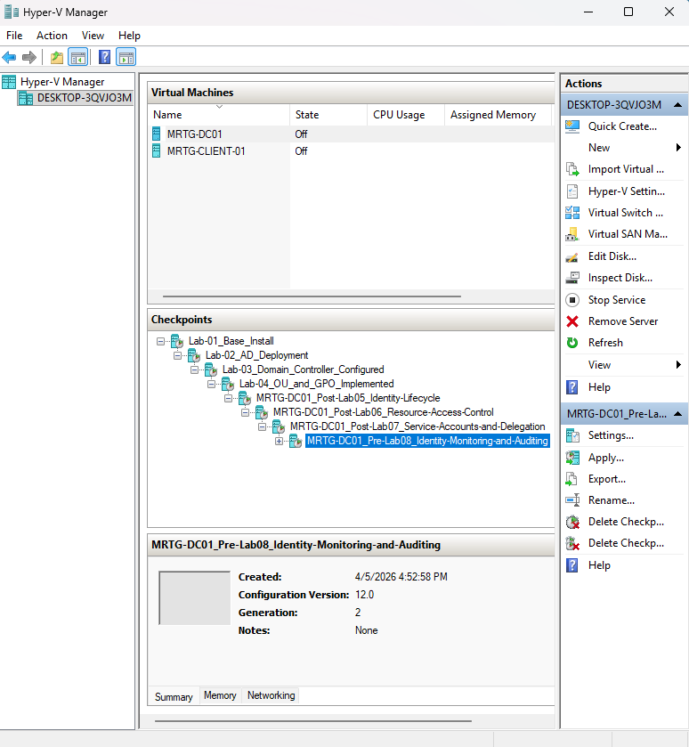

---

### 2. Delegated Administration Baseline Confirmed

The delegated administration baseline was reviewed.

`john.smith.admin` remained a member of:

`GG_IT_HelpDesk_Admins`

The `_MRTG/Users` OU structure was also confirmed.

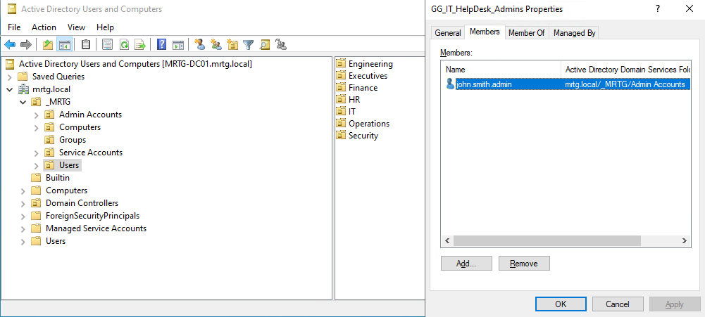

This confirmed that the lab started from the intended delegated-access model.

---

### 3. Auditing GPO Created and Linked

A dedicated GPO named `MRTG-DC-Identity-Auditing` was created and linked to the Domain Controllers OU.

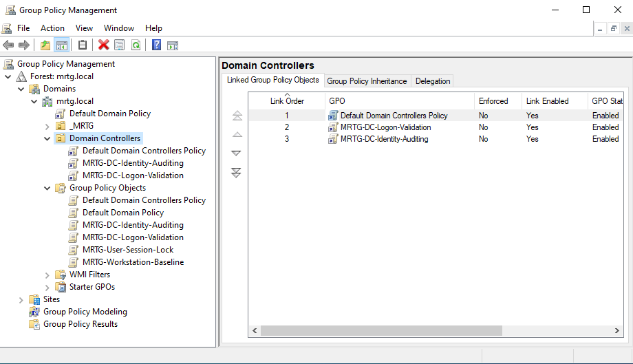

A dedicated GPO was used instead of modifying the default policy so the auditing configuration would remain easier to manage, explain, and validate.

---

### 4. Audit Logon Configured

Audit Logon was enabled for both success and failure events.

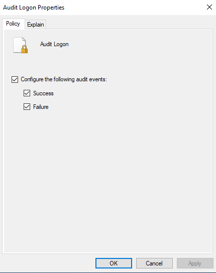

This provides visibility into authentication activity on the domain controller.

---

### 5. Audit User Account Management Configured

Audit User Account Management was enabled for both success and failure events.

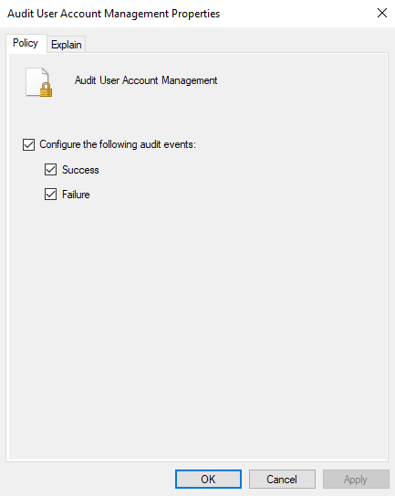

This supports monitoring of identity actions such as password resets and user account changes.

---

### 6. Audit Directory Service Changes Configured

Audit Directory Service Changes was enabled for success events.

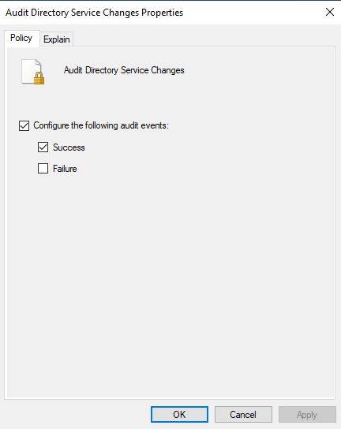

This supports tracking of Active Directory object changes when paired with object-level auditing.

---

### 7. Audit Security Group Management Configured

Audit Security Group Management was enabled for both success and failure events.


This improves visibility into changes affecting access-control groups.

---

### 8. Audit Policy Applied and Verified

The updated policy was applied and validated.

Commands used:

```cmd
gpupdate /force
auditpol /get /category:*
```

The output confirmed that the required audit subcategories were enabled.

Validated audit areas included:

- Logon
- Security Group Management
- User Account Management
- Directory Service Changes

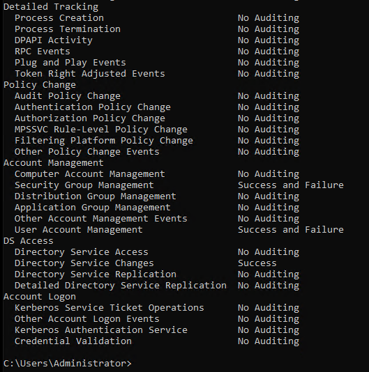

---

### 9. Users OU Auditing Configuration Opened

Advanced Features were enabled in Active Directory Users and Computers.

The security settings for `_MRTG/Users` were opened and the Auditing tab was reviewed.

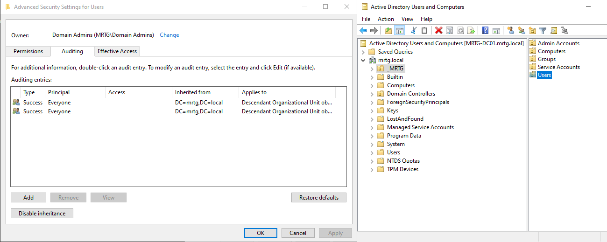

This prepared the OU for object-level auditing.

---

### 10. Auditing Entry Added for Descendant User Objects

An auditing entry was created for descendant user objects under `_MRTG/Users`.

Configuration used:

| Setting | Value |
|---|---|
| Principal | `Everyone` |
| Type | `Success` |
| Applies To | `Descendant User objects` |

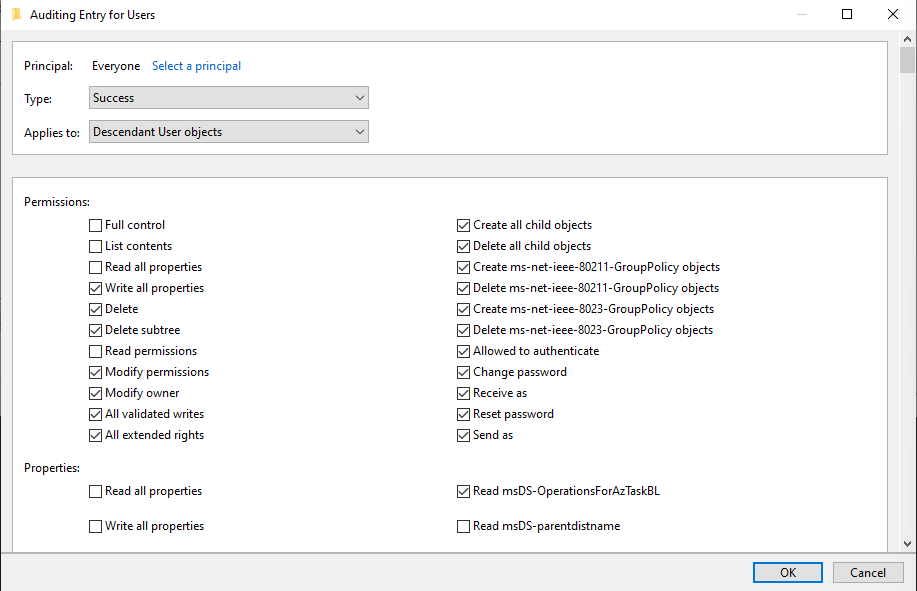

This step was critical because directory service change auditing requires both audit policy and an object-level auditing entry.

---

### 11. Delegated Password Reset Performed

Using `john.smith.admin`, the password for Kevin Carter was reset.

The option `User must change password at next logon` was selected.

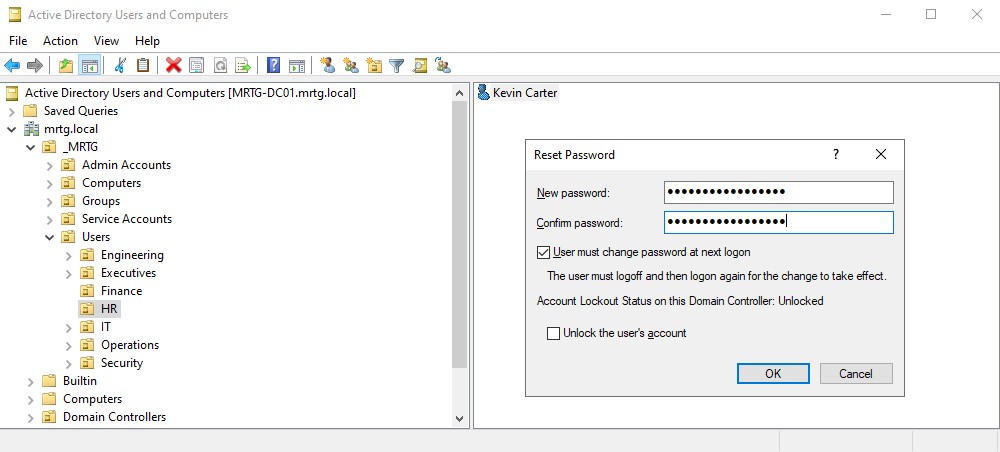

This generated controlled delegated identity activity for audit validation.

---

### 12. Delegated User Attribute Change Performed

Using `john.smith.admin`, the Description field for Kevin Carter was modified.

Description value used:

`Lab 08 audit validation change`

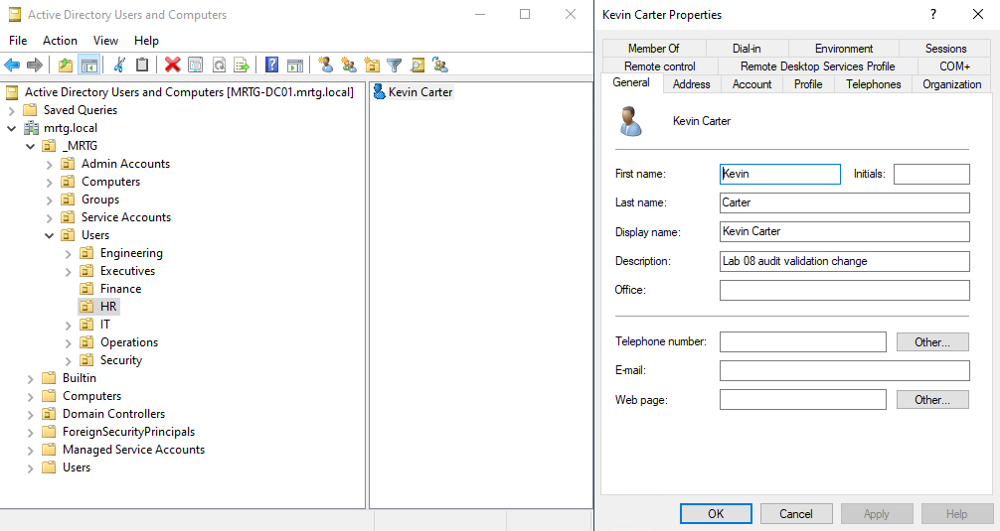

This created a second controlled identity action for audit validation.

---

### 13. Event ID 4724 Validated

Event Viewer was used on `MRTG-DC01` to review the Security log.

Event ID `4724` was confirmed.

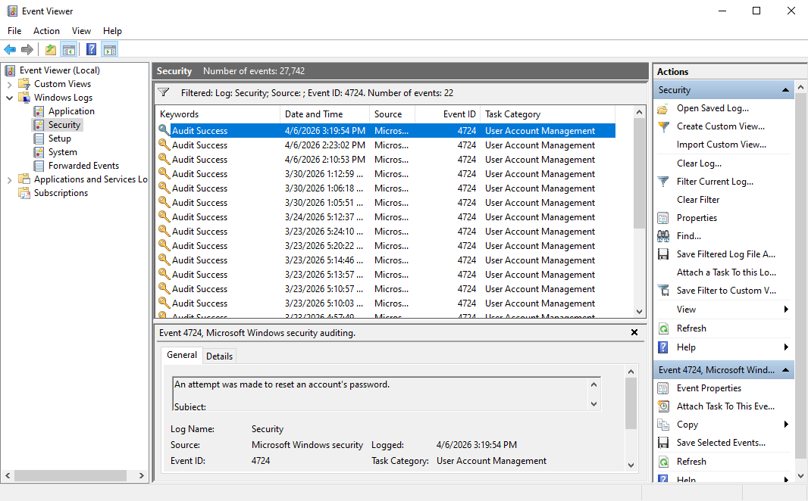

This event indicates that an attempt was made to reset an account password.

---

### 14. Event ID 4738 Validated

Event ID `4738` was confirmed in the Security log.


This event indicates that a user account was changed.

---

### 15. Event ID 5136 Validated

Event ID `5136` was confirmed in the Security log.

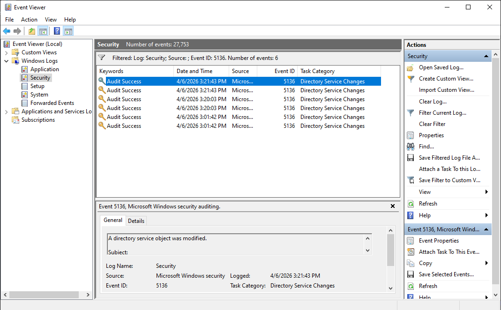

This event indicates that a directory service object was modified.

This validated that object-level auditing on `_MRTG/Users` was working as intended.

---

### 16. Event ID 4719 Validated

Event ID `4719` was confirmed in the Security log.

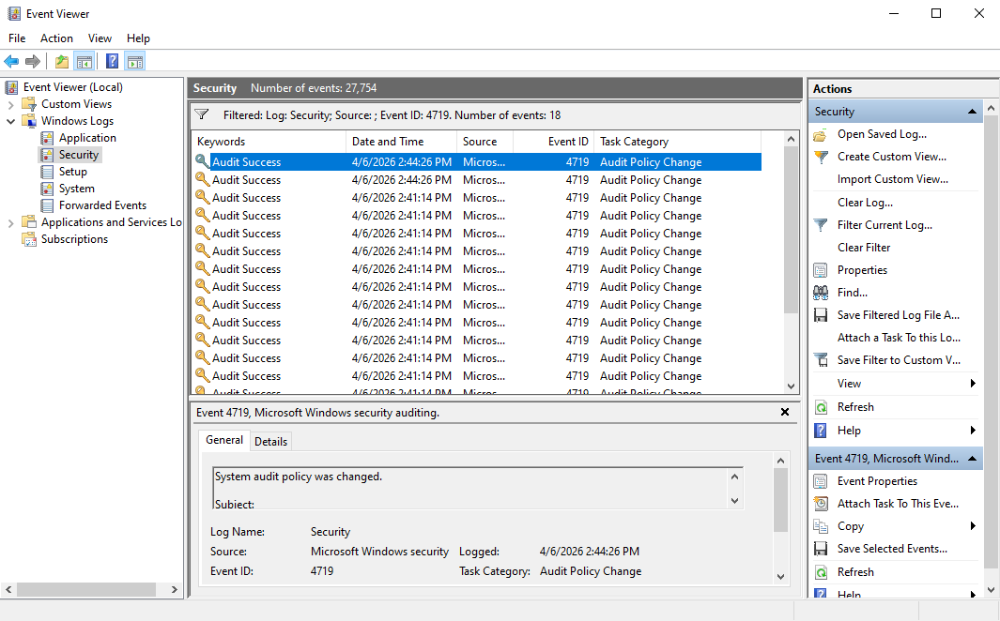

This event indicates that system audit policy was changed.

This confirmed that audit policy configuration activity itself was also logged.

---

## Security Perspective

This lab demonstrates that delegated access must be monitored.

Granting scoped administrative rights is only part of the control. The organization also needs visibility into what delegated administrators do.

From a security perspective, this lab supports:

- Identity monitoring
- Administrative accountability
- Delegated action visibility
- Password reset tracking
- User object change tracking
- Directory service change monitoring
- Audit policy change visibility
- Regulated environment audit readiness

---

## Risk Addressed

Without identity monitoring and auditing, administrative actions can occur without enough visibility.

This lab reduces the risk of:

- Untracked password resets
- Unreviewed user account changes
- Invisible delegated admin activity
- Weak accountability for identity changes
- Poor incident investigation capability
- Missing evidence for audit reviews
- Unvalidated audit policy configuration

---

## Control Mapping

| Control Area | How This Lab Supports It |
|---|---|
| Identity monitoring | Enables auditing for identity-related activity |
| Delegated administration review | Tracks actions performed by delegated admin accounts |
| Password reset accountability | Validates Event ID `4724` |
| User change tracking | Validates Event ID `4738` |
| Directory object auditing | Validates Event ID `5136` |
| Audit policy monitoring | Validates Event ID `4719` |
| Audit readiness | Captures configuration and event evidence |
| Least privilege support | Monitors scoped delegated administrative activity |

---

## Validation

The following validation checks were completed:

| Validation Item | Result |
|---|---|
| Pre-lab checkpoint created | Passed |
| Delegated admin baseline reviewed | Passed |
| Auditing GPO created | Passed |
| Auditing GPO linked to Domain Controllers OU | Passed |
| Audit Logon configured | Passed |
| Audit User Account Management configured | Passed |
| Audit Directory Service Changes configured | Passed |
| Audit Security Group Management configured | Passed |
| `gpupdate /force` completed | Passed |
| `auditpol` confirmed audit settings | Passed |
| `_MRTG/Users` auditing configuration opened | Passed |
| Object-level auditing entry created | Passed |
| Delegated password reset performed | Passed |
| Delegated user attribute change performed | Passed |
| Event ID `4724` validated | Passed |
| Event ID `4738` validated | Passed |
| Event ID `5136` validated | Passed |
| Event ID `4719` validated | Passed |

---

## Evidence Collected

The following evidence was collected during the lab:

| Evidence | File |
|---|---|
| Pre-auditing checkpoint | `images/Lab-08-01-Pre-Auditing-Checkpoint.png` |
| Delegated admin baseline | `images/Lab-08-02-Delegated-Admin-Baseline.png` |
| Auditing GPO created | `images/Lab-08-03-Auditing-GPO-Created.png` |
| Audit Logon configured | `images/Lab-08-04-Audit-Logon-Configured.png` |
| Audit User Account Management configured | `images/Lab-08-05-Audit-User-Account-Management-Configured.png` |
| Audit Directory Service Changes configured | `images/Lab-08-06-Audit-Directory-Service-Changes-Configured.png` |
| Audit Security Group Management configured | `images/Lab-08-07-Audit-Security-Group-Management-Configured.png` |
| GPUpdate and auditpol verification | `images/Lab-08-08-GPUpdate-and-AuditPol-Verification.png` |
| Users OU auditing tab | `images/Lab-08-09-Users-OU-Auditing-Tab.png` |
| Users OU auditing entry | `images/Lab-08-10-Users-OU-Auditing-Entry.png` |
| Password reset action | `images/Lab-08-11-Password-Reset-Action.png` |
| User attribute change | `images/Lab-08-12-User-Attribute-Change.png` |
| Event 4724 password reset | `images/Lab-08-13-Event-4724-Password-Reset.png` |
| Event 4738 user changed | `images/Lab-08-14-Event-4738-User-Changed.png` |
| Event 5136 directory object modified | `images/Lab-08-15-Event-5136-Directory-Object-Modified.png` |
| Event 4719 audit policy changed | `images/Lab-08-16-Event-4719-Audit-Policy-Changed.png` |

---

## What I Would Improve in Production

In a production environment, I would improve this process by:

- Forwarding security logs to a centralized SIEM
- Defining audit log retention requirements
- Creating alerts for password resets
- Creating alerts for privileged group membership changes
- Monitoring delegated admin activity
- Separating audit policy administration from routine support activity
- Restricting who can modify audit policy
- Reviewing object-level auditing scope regularly
- Using least-privilege admin workstations
- Documenting audit policy ownership
- Mapping audit events to incident response playbooks

---

## Lessons Learned

This lab reinforced that delegation and auditing must work together.

Delegating password reset permissions helps reduce overuse of Domain Admin rights, but those actions still need to be visible.

The biggest takeaway is that audit policy alone is not always enough. For directory object changes, object-level auditing must also be configured on the target OU or object.

Identity monitoring becomes much stronger when policy configuration, scoped permissions, and event validation are all documented together.

---

## Outcome

Lab 08 successfully implemented identity monitoring and auditing in the MRTG Active Directory environment.

The lab confirmed:

- A dedicated auditing GPO was created
- Advanced audit policy was configured for identity activity
- Audit policy was applied and validated with `auditpol`
- Object-level auditing was configured on `_MRTG/Users`
- Delegated password reset activity generated Event ID `4724`
- User account change activity generated Event ID `4738`
- Directory object modification generated Event ID `5136`
- Audit policy change activity generated Event ID `4719`

The environment now supports auditable identity operations and improved visibility into delegated administrative activity.

---

## Next Lab

[Lab 09 — Password Policy and Account Lockout Hardening](../Lab-09-Password-Policy-and-Account-Lockout-Hardening/)

Lab 09 will build on the auditing foundation by implementing password policy and account lockout controls to strengthen authentication security across the MRTG domain.
