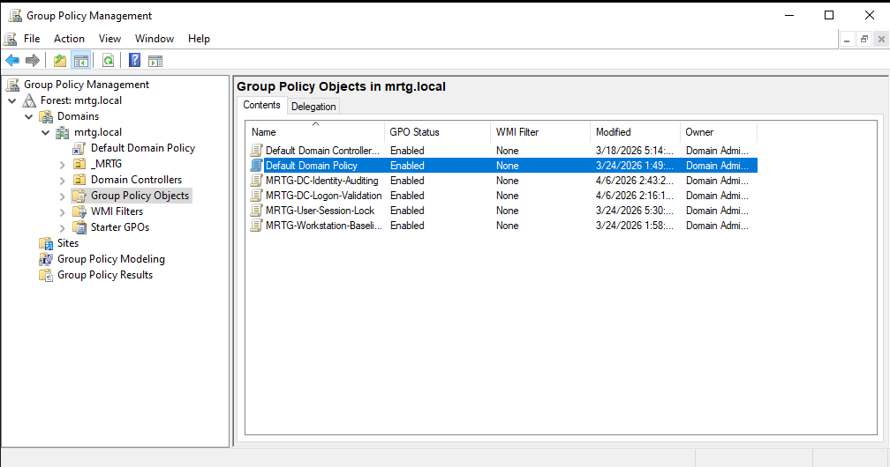
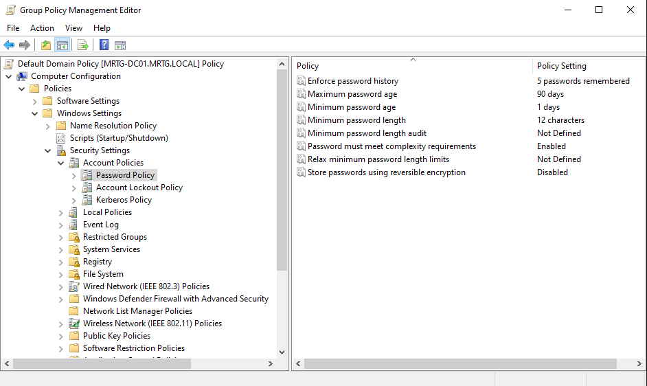
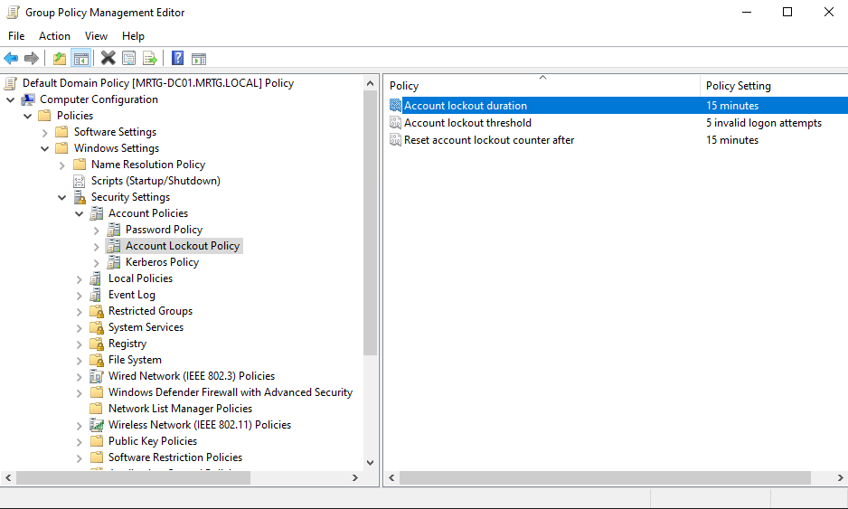
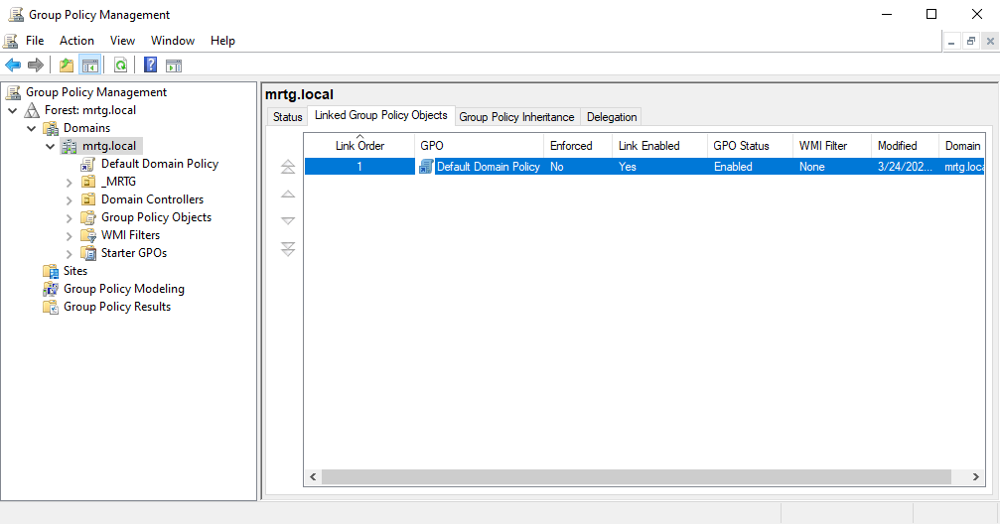
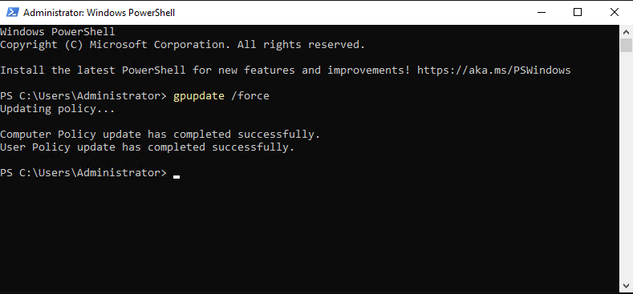
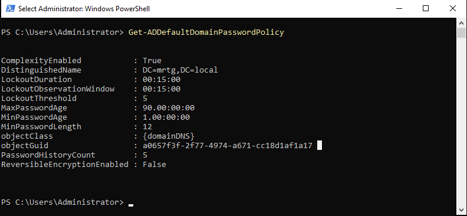
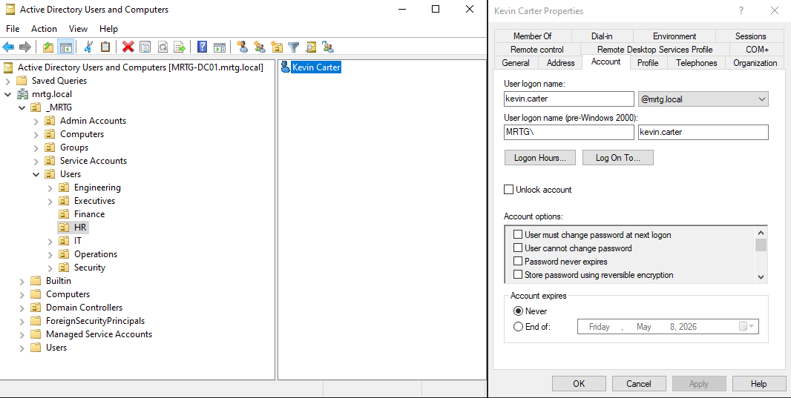
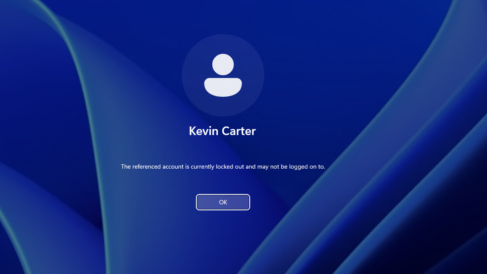
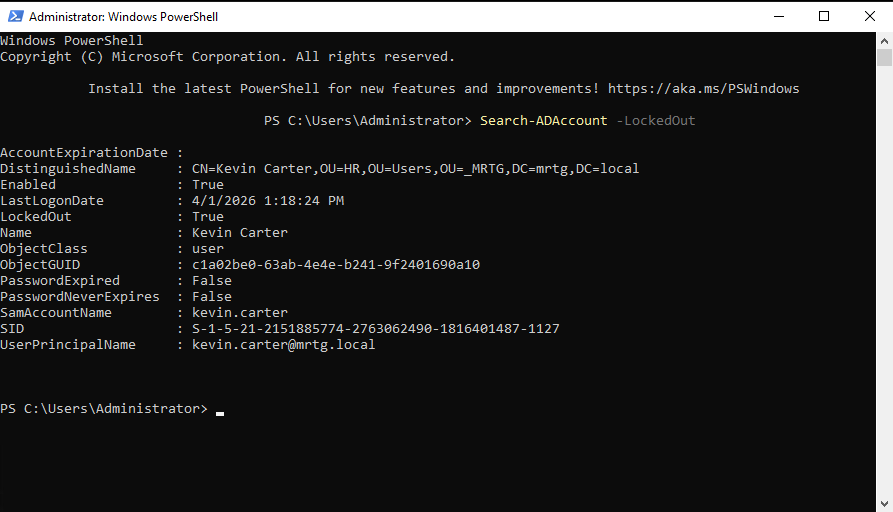

# Lab 09 — Password Policy and Account Lockout Hardening


---

## Objective

The objective of this lab is to harden domain authentication in the `mrtg.local` Active Directory domain by configuring password policy and account lockout settings.

This lab focuses on domain-level authentication controls using the Default Domain Policy.

The goal is to enforce stronger password requirements, limit repeated failed sign-in attempts, and validate real account lockout behavior from both the user and administrator perspectives.

---

## Business Problem

Monroe Redstone Technology Group needs stronger baseline authentication controls to reduce weak password practices and limit repeated failed sign-in attempts against domain accounts.

Without password and lockout policy enforcement, users may rely on weak passwords, reuse old passwords, or allow repeated failed authentication attempts without consequence.

This lab addresses the need to:

- Configure centralized password requirements
- Configure account lockout controls
- Apply policy at the correct domain scope
- Validate the effective domain password policy
- Trigger a real account lockout from a client workstation
- Confirm the locked account state from the administrator side
- Strengthen authentication security across the domain

---

## Lab Summary

In this lab, I configured domain-level password policy and account lockout settings in the Default Domain Policy.

I applied the policy, validated the effective domain password settings with PowerShell, and tested lockout behavior using a standard domain user account.

The lab confirmed that repeated failed sign-in attempts triggered account lockout and that the locked state could be verified from an administrative PowerShell session.

This lab reinforces a core IAM principle: authentication controls must be configured, applied, and validated through real user behavior.

---

## Environment

| Component | Details |
|---|---|
| Domain | `mrtg.local` |
| Domain Controller | `MRTG-DC01` |
| Client Workstation | `MRTG-CLIENT-01` |
| Directory Service | Active Directory Domain Services |
| Policy Tool | Group Policy Management Console |
| Validation Tool | PowerShell |
| Test User | `Kevin Carter` |
| Test User UPN | `kevin.carter@mrtg.local` |
| Policy Target | Default Domain Policy |
| Lab Organization | Monroe Redstone Technology Group |

---

## Scope

### Included

- Domain GPO structure review
- Password policy configuration
- Account lockout policy configuration
- Default Domain Policy scope confirmation
- Policy application with `gpupdate /force`
- Effective policy validation with PowerShell
- Standard user lockout testing
- Administrative locked account verification

### Not Included

- Fine-Grained Password Policies
- Microsoft Entra ID authentication controls
- MFA configuration
- Self-service password reset
- Conditional Access
- Privileged Identity Management
- SIEM filtering
- Advanced event correlation

---

## Architecture

This lab uses the Default Domain Policy to enforce classic Active Directory domain password and lockout settings.

```text
mrtg.local
└── Default Domain Policy
    └── Computer Configuration
        └── Policies
            └── Windows Settings
                └── Security Settings
                    └── Account Policies
                        ├── Password Policy
                        └── Account Lockout Policy
```

This matters because classic Active Directory password and account lockout policies must be configured at the domain level to apply correctly to domain user accounts.

This lab is different from earlier workstation or user-session GPO labs because it focuses on domain authentication policy instead of endpoint or OU-scoped configuration.

---

## Authentication Hardening Model

This lab uses two core authentication controls.

| Control | Purpose |
|---|---|
| Password Policy | Enforces stronger password requirements |
| Account Lockout Policy | Limits repeated failed sign-in attempts |

Together, these controls reduce weak password exposure and make repeated failed authentication attempts harder to abuse.

---

## Password Policy Settings

The following password policy settings were configured:

| Setting | Value |
|---|---|
| Enforce password history | `5 passwords remembered` |
| Maximum password age | `90 days` |
| Minimum password age | `1 day` |
| Minimum password length | `12 characters` |
| Password must meet complexity requirements | `Enabled` |
| Store passwords using reversible encryption | `Disabled` |

---

## Account Lockout Policy Settings

The following account lockout settings were configured:

| Setting | Value |
|---|---|
| Account lockout threshold | `5 invalid logon attempts` |
| Account lockout duration | `15 minutes` |
| Reset account lockout counter after | `15 minutes` |

---

## Implementation and Validation

### 1. Domain GPO Structure Reviewed

Group Policy Management was opened on `MRTG-DC01`.

The `mrtg.local` domain structure and available Group Policy Objects were reviewed.



This confirmed that the Default Domain Policy existed and was available for domain-level account policy configuration.

---

### 2. Password Policy Settings Configured

The Default Domain Policy was edited.

Password policy settings were configured under:

```text
Computer Configuration
└── Policies
    └── Windows Settings
        └── Security Settings
            └── Account Policies
                └── Password Policy
```



This established stronger baseline password requirements for the domain.

---

### 3. Account Lockout Policy Configured

Account lockout settings were configured under:

```text
Computer Configuration
└── Policies
    └── Windows Settings
        └── Security Settings
            └── Account Policies
                └── Account Lockout Policy
```



This created an enforced response to repeated failed authentication attempts.

---

### 4. Domain-Level Scope Confirmed

The Default Domain Policy link was reviewed at the `mrtg.local` domain root.



This confirmed that the password and lockout settings were configured at the correct domain scope.

---

### 5. Policy Applied

The updated policy was applied on `MRTG-DC01`.

Command used:

```powershell
gpupdate /force
```



This confirmed that Group Policy updated successfully.

---

### 6. Effective Default Domain Password Policy Validated

The effective domain password and lockout policy was validated using PowerShell.

Command used:

```powershell
Get-ADDefaultDomainPasswordPolicy
```



Validated values included:

- Complexity enabled
- Minimum password length set to `12`
- Password history count set to `5`
- Maximum password age set to `90 days`
- Lockout threshold set to `5`
- Lockout duration set to `15 minutes`
- Lockout observation window set to `15 minutes`

This confirmed that the domain was using the configured policy values.

---

### 7. Test User Prepared

The Kevin Carter account was reviewed in Active Directory Users and Computers before lockout testing.



This confirmed the test identity was available for real sign-in validation.

---

### 8. Account Lockout Triggered from Client Workstation

Kevin Carter was used on `MRTG-CLIENT-01`.

An incorrect password was entered repeatedly until the lockout threshold was reached.



The sign-in screen displayed the lockout message, confirming that the policy was enforced from the user side.

---

### 9. Locked Account Verified from Administrator Side

The locked account state was verified from PowerShell on `MRTG-DC01`.

Command used:

```powershell
Search-ADAccount -LockedOut
```



Kevin Carter appeared in the results with the account locked.

This confirmed the lockout from the administrator side.

---

## Security Perspective

Password policy and account lockout controls are foundational identity protections.

This lab supports:

- Stronger password hygiene
- Reduced weak password exposure
- Reduced password reuse
- Controlled response to repeated failed authentication attempts
- Centralized domain authentication hardening
- User-side enforcement validation
- Admin-side operational verification

The key IAM principle is that controls must be both configured and validated.

A policy that exists only in the editor is not enough. The effective policy and real user behavior must confirm that the control works.

---

## Risk Addressed

Without password and lockout hardening, domain accounts are more exposed to weak password practices and repeated failed authentication attempts.

This lab reduces the risk of:

- Weak passwords
- Excessive password reuse
- Unrestricted failed logon attempts
- Poor authentication baseline enforcement
- Misconfigured domain password policy
- Lockout settings applied at the wrong scope
- Lack of operational validation
- Authentication controls that exist only on paper

---

## Control Mapping

| Control Area | How This Lab Supports It |
|---|---|
| Authentication hardening | Configures password and lockout settings |
| Password hygiene | Enforces length, history, complexity, and age requirements |
| Brute-force resistance | Locks accounts after repeated failed attempts |
| Domain-level policy | Uses the Default Domain Policy at the domain root |
| Operational validation | Confirms effective policy with PowerShell |
| User-side enforcement | Tests lockout from the client workstation |
| Admin-side verification | Uses `Search-ADAccount -LockedOut` |
| Audit readiness | Captures configuration and validation evidence |

---

## Validation

The following validation checks were completed:

| Validation Item | Result |
|---|---|
| Domain GPO structure reviewed | Passed |
| Default Domain Policy identified | Passed |
| Password policy configured | Passed |
| Account lockout policy configured | Passed |
| Default Domain Policy linked at domain root | Passed |
| `gpupdate /force` completed successfully | Passed |
| Effective domain policy validated with PowerShell | Passed |
| Kevin Carter prepared as test user | Passed |
| Account lockout triggered from client workstation | Passed |
| Locked account verified from administrator side | Passed |

---

## Evidence Collected

The following evidence was collected during the lab:

| Evidence | File |
|---|---|
| Domain GPO structure | `screenshots/lab-09-01-domain-gpo-structure.png` |
| Password policy settings | `screenshots/lab-09-02-password-policy-settings.png` |
| Lockout policy settings | `screenshots/lab-09-03-lockout-policy-settings.png` |
| Domain root link confirmation | `screenshots/lab-09-04-domain-root-link-confirmation.png` |
| GPUpdate success | `screenshots/lab-09-05-gpupdate-success.png` |
| Password policy validation | `screenshots/lab-09-06-password-policy-validation.png` |
| Test user ready | `screenshots/lab-09-07-test-user-ready.png` |
| Account lockout triggered | `screenshots/lab-09-08-account-lockout-triggered.png` |
| Locked account verification | `screenshots/lab-09-09-locked-account-verification.png` |

---

## What I Would Improve in Production

In a production environment, I would improve this process by:

- Reviewing password policy against organizational security requirements
- Using longer password or passphrase guidance where appropriate
- Aligning settings with compliance requirements
- Monitoring lockout events for attack patterns
- Alerting on repeated failed authentication attempts
- Reviewing Help Desk lockout and unlock procedures
- Using Fine-Grained Password Policies for privileged or service accounts
- Implementing MFA where supported
- Integrating authentication logs with a SIEM
- Documenting policy ownership and review cycles
- Aligning lockout policy with user support and security needs
- Testing policy impact before wide production rollout

---

## Lessons Learned

This lab reinforced that domain authentication hardening must be configured at the correct scope.

Classic Active Directory password and account lockout policy belongs at the domain level, not treated like a normal OU-linked user policy.

The biggest takeaway is that configuration alone is not proof. Effective policy validation and real account lockout testing are what prove the control is working.

This lab also showed how authentication policy directly affects user experience and Help Desk operations.

---

## Outcome

Lab 09 successfully implemented password policy and account lockout hardening in the MRTG Active Directory environment.

The lab confirmed:

- Password policy was configured in the Default Domain Policy
- Account lockout policy was configured in the Default Domain Policy
- The Default Domain Policy was linked at the domain root
- Group Policy updated successfully
- Effective password and lockout values were validated with PowerShell
- Kevin Carter’s account locked after repeated failed sign-in attempts
- The locked account state was confirmed from the administrator side

The environment now supports stronger domain-level authentication controls.

---

## Next Lab

[Lab 10 — Fine-Grained Password Policies for Tiered Identity Control](../Lab-10-Fine-Grained-Password-Policies-for-Tiered-Identity-Control/)

Lab 10 will build on domain-level authentication hardening by applying fine-grained password policies to support tiered identity control for standard, service, and privileged accounts.
