# Lab-10: Fine-Grained Password Policies for Tiered Identity Control

## Overview

In this lab, I implemented **Fine-Grained Password Policies (FGPPs)** in the **Monroe Redstone Technology Group (MRTG)** Active Directory environment to apply different authentication controls to different identity tiers. The objective was to move beyond a single domain-wide password policy and show that **standard users, privileged admin accounts, and service accounts** can be governed by separate password settings based on identity type and risk.

Unlike traditional domain password policy, FGPP is not configured through a normal GPO. Instead, it is built through **Password Settings Objects (PSOs)** in the **Active Directory Administrative Center** and applied to **users or global security groups**. In this lab, I used group-based targeting so each identity tier could receive its own password policy design.

This lab builds directly on the authentication hardening work from **Lab 09**. Lab 09 established domain-wide password and lockout controls. Lab 10 extends that foundation by introducing **tiered authentication control**, which is more aligned with real IAM and privileged access design.

---

## Objectives

- Create global security groups for FGPP targeting
- Build separate Password Settings Objects for:
  - standard users
  - privileged admin accounts
  - service accounts
- Apply FGPP through security groups rather than individual accounts
- Validate that different identity types receive different password settings
- Demonstrate tiered identity control in Active Directory

---

## Scope

### Included
- Creation of FGPP targeting groups
- Creation of three Password Settings Objects
- Group-based assignment of PSOs
- Validation of directly associated password settings in AD Administrative Center
- Comparison of policy precedence across identity tiers

### Not Included
- Fine-Grained Password Policy precedence conflict testing
- Password reset workflow testing
- Authentication policy silos
- Microsoft Entra ID password protection
- Hybrid identity password writeback
- LAPS or local administrator password rotation

This lab stays focused on **Active Directory Fine-Grained Password Policies** and their use in **tiered identity administration**.

---

## Lab Environment

### Systems
- **Host Platform:** Hyper-V
- **Domain Controller:** `MRTG-DC01`
- **Domain:** `mrtg.local`

### Directory Structure
- **Parent OU:** `_MRTG`
- **Groups OU:** `_MRTG/Groups`
- **Admin Accounts OU:** `_MRTG/Admin Accounts`
- **Service Accounts OU:** `_MRTG/Service Accounts`
- **Users OU:** `_MRTG/Users`

### Identity Tiers Used
- **Standard User:** `kevin.carter`
- **Privileged Admin:** `john.smith.admin`
- **Service Account:** `Service App Deploy`

### FGPP Targeting Groups
- `GG_PSO_Standard_Users`
- `GG_PSO_Privileged_Admins`
- `GG_PSO_Service_Accounts`

### Tools / Technologies Used
- Windows Server 2022
- Active Directory Users and Computers
- Active Directory Administrative Center
- Fine-Grained Password Policies
- Password Settings Objects (PSOs)
- Group-based policy targeting

---

## Architecture / Design

This lab was designed to support the following identity-control need:

> **MRTG requires differentiated password policy enforcement so that higher-risk identities are not governed by the exact same authentication standards as normal user accounts.**

### Design Logic
- **Standard users** receive a strong but practical baseline password policy
- **Privileged admin accounts** receive tighter controls with stronger password requirements and stricter lockout behavior
- **Service accounts** receive a separate policy tier with a longer password length and extended password lifetime model

### IAM Perspective

This design supports:

- **identity tiering**
- **group-based authentication control**
- **privileged account protection**
- **policy differentiation by account type**
- **centralized password governance**

The key design point is that FGPP is **not a standard GPO setting**. It is a directory-level password policy model built with **PSOs** and applied through **users or global security groups**. That distinction matters because this lab is proving **tiered identity control**, not ordinary GPO administration.

---

## Implementation Steps

### 1. Created a Pre-Lab Checkpoint

Before making changes, I created a Hyper-V checkpoint to preserve the clean post-Lab 09 environment.

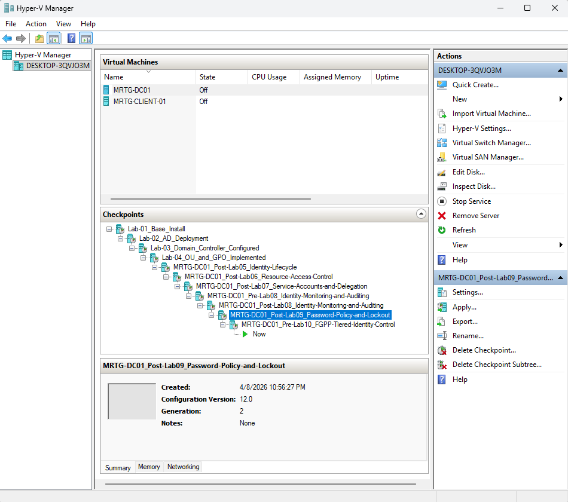

---

### 2. Created FGPP Targeting Groups

In **Active Directory Users and Computers**, I created the following global security groups inside the `_MRTG/Groups` OU:

- `GG_PSO_Standard_Users`
- `GG_PSO_Privileged_Admins`
- `GG_PSO_Service_Accounts`

These groups were used as the policy targets for the Password Settings Objects.

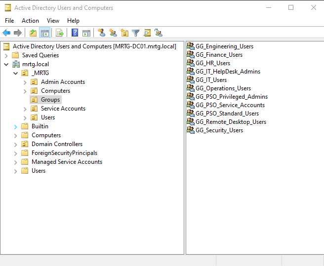

---

### 3. Added Group Membership for Policy Targeting

I populated the FGPP targeting groups with representative identities:

- `kevin.carter` → `GG_PSO_Standard_Users`
- `john.smith.admin` → `GG_PSO_Privileged_Admins`
- `Service App Deploy` → `GG_PSO_Service_Accounts`

This allowed each identity tier to receive a different password policy through group membership.

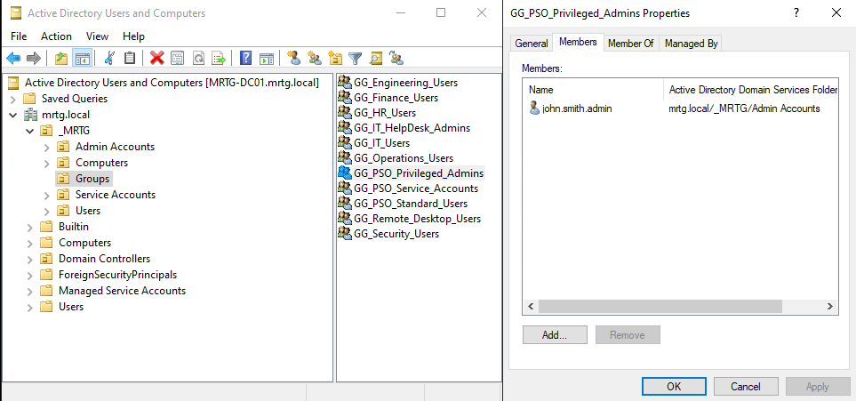

---

### 4. Opened the Password Settings Container

In **Active Directory Administrative Center**, I browsed to:

`mrtg.local > System > Password Settings Container`

This is the location where Fine-Grained Password Policies are created and managed.

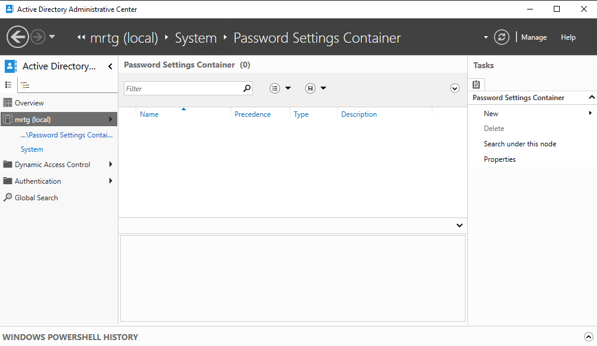

---

### 5. Created the Standard Users PSO

I created a Password Settings Object named **`PSO-Standard-Users`** and applied it to `GG_PSO_Standard_Users`.

**Configured values:**
- **Precedence:** `30`
- **Minimum password length:** `12`
- **Password history:** `5`
- **Maximum password age:** `90 days`
- **Minimum password age:** `1 day`
- **Complexity:** `Enabled`
- **Reversible encryption:** `Disabled`
- **Lockout threshold:** `5`
- **Reset lockout counter after:** `15 minutes`
- **Lockout duration:** `15 minutes`

This policy represents the baseline authentication standard for normal workforce identities.

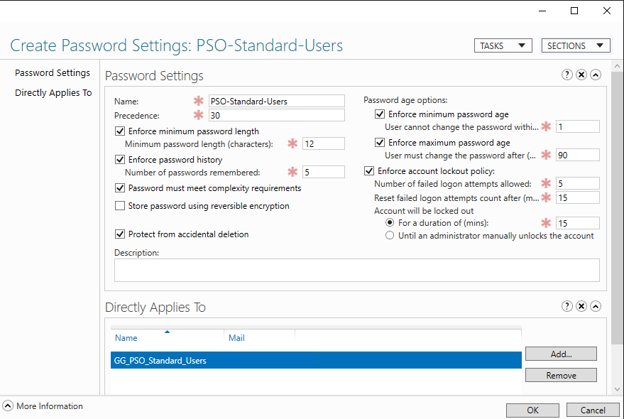

---

### 6. Created the Privileged Admins PSO

I created a Password Settings Object named **`PSO-Privileged-Admins`** and applied it to `GG_PSO_Privileged_Admins`.

**Configured values:**
- **Precedence:** `20`
- **Minimum password length:** `14`
- **Password history:** `10`
- **Maximum password age:** `60 days`
- **Minimum password age:** `1 day`
- **Complexity:** `Enabled`
- **Reversible encryption:** `Disabled`
- **Lockout threshold:** `3`
- **Reset lockout counter after:** `30 minutes`
- **Lockout duration:** `30 minutes`

This policy was designed to apply stronger requirements to a higher-risk privileged identity tier.

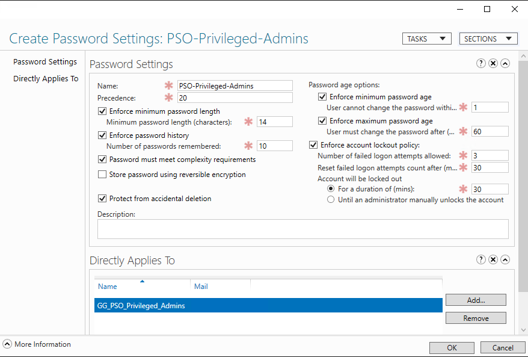

---

### 7. Created the Service Accounts PSO

I created a Password Settings Object named **`PSO-Service-Accounts`** and applied it to `GG_PSO_Service_Accounts`.

**Configured values:**
- **Precedence:** `10`
- **Minimum password length:** `20`
- **Password history:** `5`
- **Maximum password age:** `365 days`
- **Minimum password age:** `1 day`
- **Complexity:** `Enabled`
- **Reversible encryption:** `Disabled`
- **Lockout threshold:** `5`
- **Reset lockout counter after:** `15 minutes`
- **Lockout duration:** `15 minutes`

This policy tier differentiates service identities from normal user accounts by using a longer minimum password length and an extended password lifetime model.

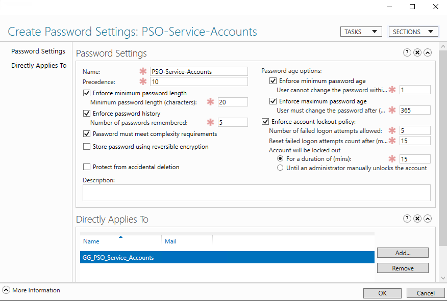

---

### 8. Confirmed PSO Object Creation

After creating the three PSOs, I returned to the **Password Settings Container** and verified that all three objects were present with the expected precedence values.

- `PSO-Service-Accounts` — `10`
- `PSO-Privileged-Admins` — `20`
- `PSO-Standard-Users` — `30`

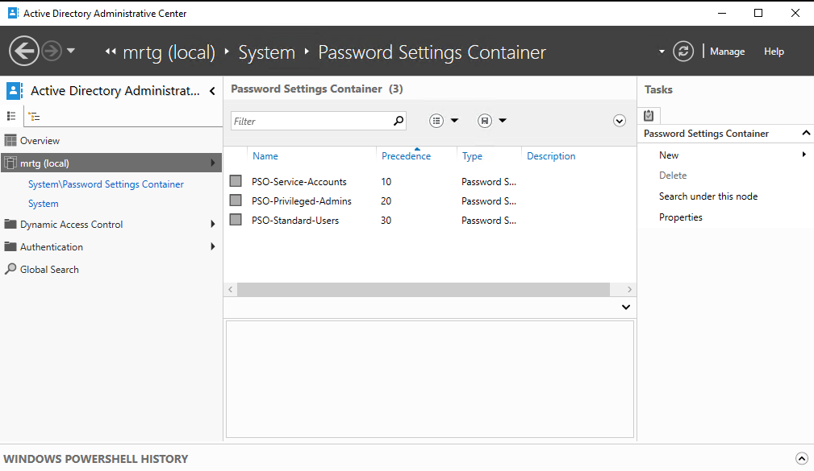

---

## Validation / Proof

### Validation Scenario 1 - Standard User Tier

**Identity tested:** `kevin.carter`

I opened the user object in **Active Directory Administrative Center** and confirmed that:

- the account was a member of `GG_PSO_Standard_Users`
- the **Directly Associated Password Settings** section showed `PSO-Standard-Users`
- the associated precedence was `30`

This confirmed that the standard user identity tier was receiving the intended PSO.

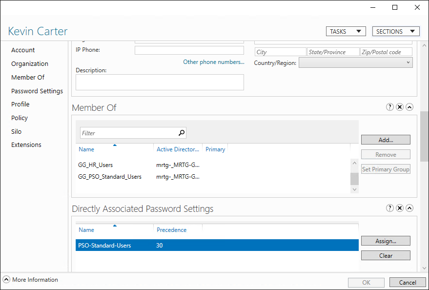

---

### Validation Scenario 2 - Privileged Admin Tier

**Identity tested:** `john.smith.admin`

I opened the privileged admin account in **Active Directory Administrative Center** and confirmed that:

- the account was a member of `GG_PSO_Privileged_Admins`
- the **Directly Associated Password Settings** section showed `PSO-Privileged-Admins`
- the associated precedence was `20`

This confirmed that the privileged identity tier was receiving stronger authentication controls than the standard user tier.

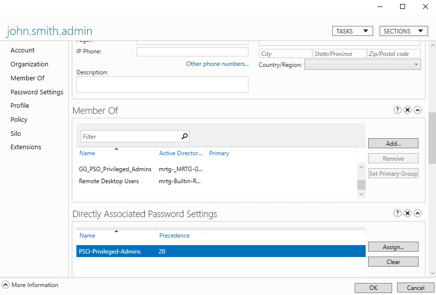

---

### Validation Scenario 3 - Service Account Tier

**Identity tested:** `Service App Deploy`

I opened the service account object in **Active Directory Administrative Center** and confirmed that:

- the account was a member of `GG_PSO_Service_Accounts`
- the **Directly Associated Password Settings** section showed `PSO-Service-Accounts`
- the associated precedence was `10`

This confirmed that the service account tier was receiving its own differentiated password settings.

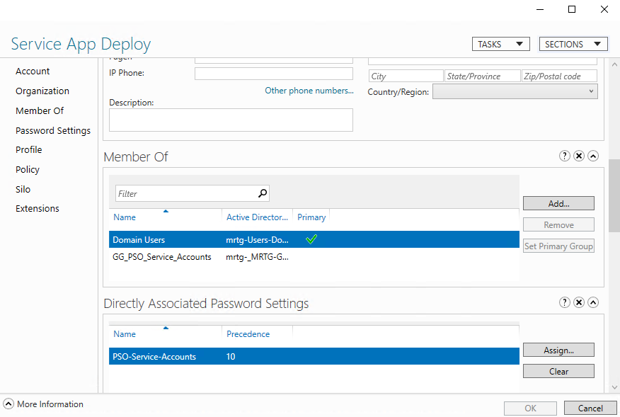

---

### Validation Scenario 4 - Tiered Policy Comparison

I returned to the **Password Settings Container** and reviewed all three PSOs together with precedence visible.

This final validation confirmed that the MRTG environment now contains a clear tiered FGPP design:

- **Service Accounts** — precedence `10`
- **Privileged Admins** — precedence `20`
- **Standard Users** — precedence `30`

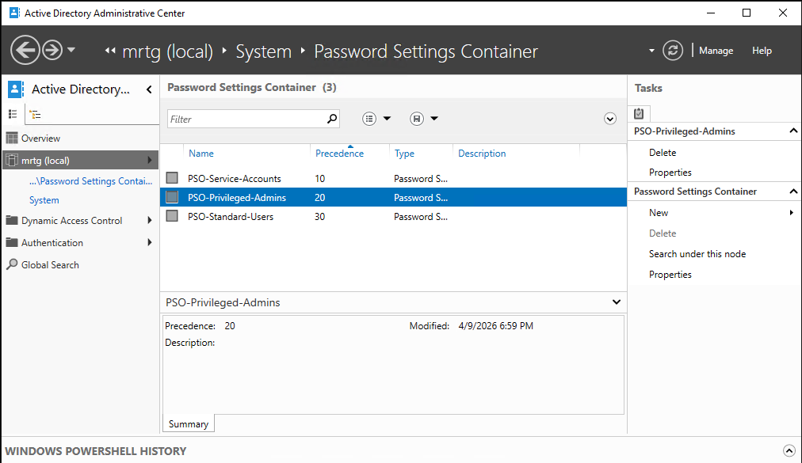

---

## Security Relevance

This lab strengthens the MRTG environment by moving beyond one-size-fits-all password policy and into **identity-tiered authentication control**.

Key security benefits include:

- stronger protection for privileged identities
- differentiated controls based on account risk
- centralized password governance through group-based assignment
- better alignment with IAM and privileged access design
- clearer separation between normal user, admin, and service-account policy models

This matters because different account types do not present the same risk. Standard users, delegated admins, and service identities should not always be governed by identical password controls. FGPP gives Active Directory a practical way to apply differentiated authentication policy without redesigning the entire domain policy model.

---

## Key Skills Demonstrated

- Active Directory Administrative Center
- Fine-Grained Password Policies
- Password Settings Objects (PSOs)
- Global security group targeting
- Group-based policy assignment
- Password policy tier design
- Privileged identity protection concepts
- Service account policy differentiation
- Directly associated password settings validation
- IAM-focused authentication control

---

## Outcome

By the end of this lab, the MRTG environment was able to:

- create separate password policy tiers for different identity types
- apply FGPP through security groups instead of individual account sprawl
- assign differentiated password settings to standard users, privileged admins, and service accounts
- validate that real identities were receiving the intended Password Settings Objects

This lab moved the environment from basic authentication hardening into **tiered identity control**, which is a stronger IAM model than relying on a single password policy for every account in the domain.

---

## Next Lab

Lab-11 should build on this identity-tiering foundation by implementing **Privileged Group Governance and Access Review** so the MRTG environment continues progressing toward more mature IAM administration.
