# Lab 10 — Fine-Grained Password Policies for Tiered Identity Control


---

## Objective

The objective of this lab is to implement Fine-Grained Password Policies in the `mrtg.local` Active Directory domain.

This lab builds on the domain-level authentication hardening from Lab 09 by applying different password policy requirements to different identity tiers.

The focus is on using Password Settings Objects and group-based targeting to apply separate authentication controls for standard users, privileged administrators, and service accounts.

---

## Business Problem

Monroe Redstone Technology Group needs differentiated password controls for different types of identities.

A single domain-wide password policy is useful as a baseline, but standard users, privileged administrators, and service accounts do not carry the same level of risk.

This lab addresses the need to:

- Move beyond one-size-fits-all password policy
- Apply stronger controls to privileged accounts
- Apply separate controls to service accounts
- Use group-based targeting for scalable policy assignment
- Validate that different identities receive the correct Password Settings Object
- Support tiered identity control in Active Directory

---

## Lab Summary

In this lab, I created Fine-Grained Password Policies using Password Settings Objects in Active Directory Administrative Center.

I created three policy targeting groups:

- `GG_PSO_Standard_Users`
- `GG_PSO_Privileged_Admins`
- `GG_PSO_Service_Accounts`

I then created three Password Settings Objects and applied them to the appropriate groups.

The lab validated that standard user, privileged admin, and service account identities received the intended password policy tier.

This lab moved the MRTG environment from a single domain-wide password baseline into a tiered identity control model.

---

## Environment

| Component | Details |
|---|---|
| Domain | `mrtg.local` |
| Domain Controller | `MRTG-DC01` |
| Directory Service | Active Directory Domain Services |
| Management Tools | Active Directory Users and Computers, Active Directory Administrative Center |
| FGPP Container | Password Settings Container |
| Standard User | `kevin.carter` |
| Privileged Admin | `john.smith.admin` |
| Service Account | `Service App Deploy` |
| Lab Organization | Monroe Redstone Technology Group |

---

## Scope

### Included

- Pre-lab Hyper-V checkpoint
- FGPP targeting group creation
- Group membership assignment for policy targeting
- Password Settings Container review
- Standard user Password Settings Object creation
- Privileged admin Password Settings Object creation
- Service account Password Settings Object creation
- PSO object validation
- Directly associated password settings validation
- Tiered policy comparison

### Not Included

- Password reset workflow testing
- FGPP precedence conflict testing
- Authentication policy silos
- Microsoft Entra ID Password Protection
- Hybrid password writeback
- LAPS or local administrator password rotation
- MFA or Conditional Access
- Privileged Identity Management

---

## Architecture

This lab uses Fine-Grained Password Policies to apply different password settings by identity tier.

```text
mrtg.local
└── System
    └── Password Settings Container
        ├── PSO-Service-Accounts
        ├── PSO-Privileged-Admins
        └── PSO-Standard-Users
```

Group-based targeting was used:

```text
GG_PSO_Standard_Users
└── kevin.carter

GG_PSO_Privileged_Admins
└── john.smith.admin

GG_PSO_Service_Accounts
└── Service App Deploy
```

This structure supports:

- Tiered authentication control
- Group-based password policy assignment
- Stronger privileged account protection
- Separate service account password requirements
- Cleaner policy administration
- Improved IAM governance

---

## Fine-Grained Password Policy Model

Fine-Grained Password Policies are not configured like normal Group Policy settings.

FGPP uses Password Settings Objects stored in the Password Settings Container.

| Component | Purpose |
|---|---|
| Password Settings Object | Defines password and lockout requirements |
| Precedence | Determines which PSO wins if multiple policies apply |
| Global Security Group | Used to target the PSO to identities |
| Directly Associated Password Settings | Shows which PSO is associated with the account |

This lab used group-based targeting instead of assigning PSOs directly to individual users.

---

## Identity Tiers

| Identity Tier | Example Identity | Targeting Group | Password Settings Object |
|---|---|---|---|
| Standard Users | `kevin.carter` | `GG_PSO_Standard_Users` | `PSO-Standard-Users` |
| Privileged Admins | `john.smith.admin` | `GG_PSO_Privileged_Admins` | `PSO-Privileged-Admins` |
| Service Accounts | `Service App Deploy` | `GG_PSO_Service_Accounts` | `PSO-Service-Accounts` |

---

## Password Settings Object Design

| PSO | Precedence | Minimum Length | Password History | Maximum Age | Lockout Threshold |
|---|---:|---:|---:|---|---:|
| `PSO-Service-Accounts` | `10` | `20` | `5` | `365 days` | `5` |
| `PSO-Privileged-Admins` | `20` | `14` | `10` | `60 days` | `3` |
| `PSO-Standard-Users` | `30` | `12` | `5` | `90 days` | `5` |

Lower precedence numbers have higher priority.

---

## Implementation and Validation

### 1. Pre-Lab Checkpoint Created

A Hyper-V checkpoint was created before making Fine-Grained Password Policy changes.

This preserved the clean post-Lab-09 environment.

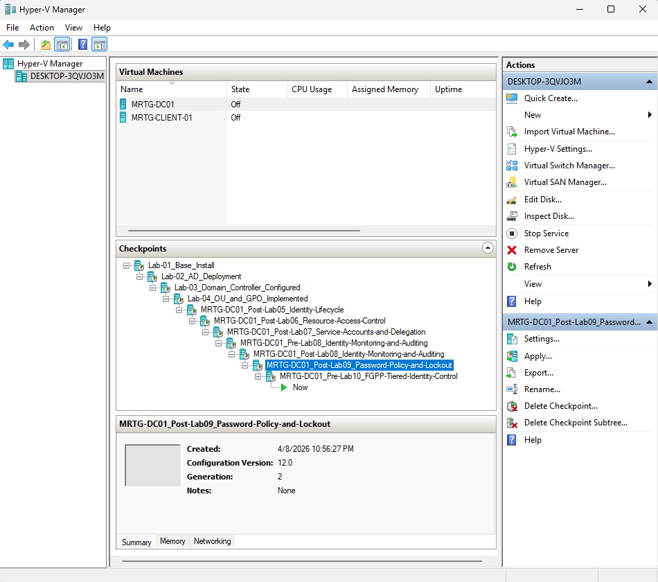

---

### 2. FGPP Targeting Groups Created

The following global security groups were created inside the `_MRTG/Groups` OU:

- `GG_PSO_Standard_Users`
- `GG_PSO_Privileged_Admins`
- `GG_PSO_Service_Accounts`

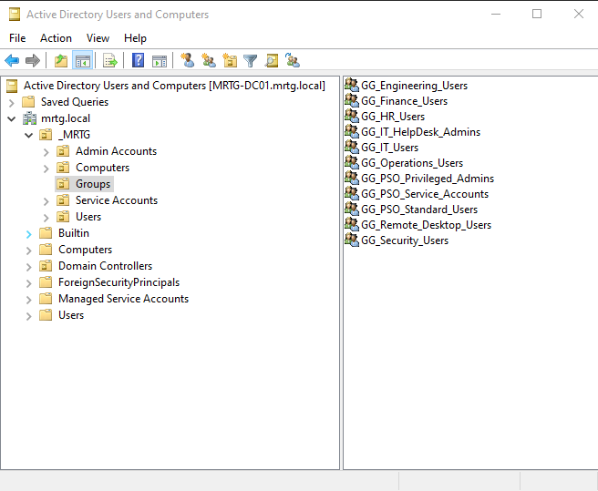

These groups were used to apply Password Settings Objects by identity tier.

---

### 3. Policy Targeting Group Membership Assigned

Representative identities were added to the FGPP targeting groups.

| Identity | Group |
|---|---|
| `kevin.carter` | `GG_PSO_Standard_Users` |
| `john.smith.admin` | `GG_PSO_Privileged_Admins` |
| `Service App Deploy` | `GG_PSO_Service_Accounts` |

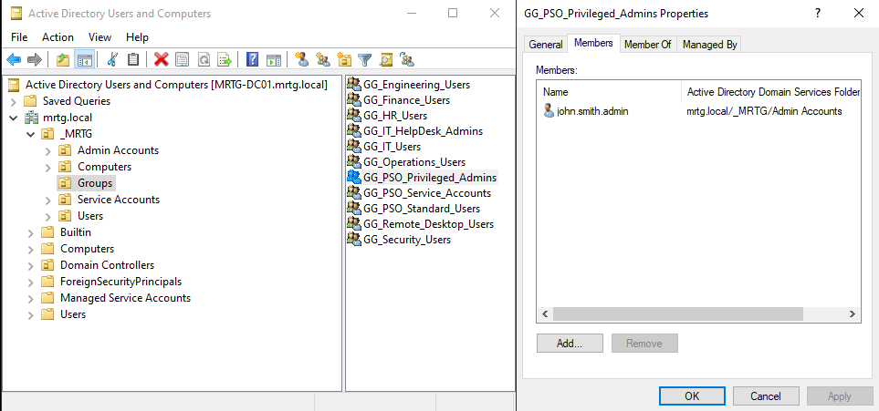

This allowed each identity type to receive a different password policy through group membership.

---

### 4. Password Settings Container Opened

Active Directory Administrative Center was used to open the Password Settings Container.

Path reviewed:

```text
mrtg.local
└── System
    └── Password Settings Container
```

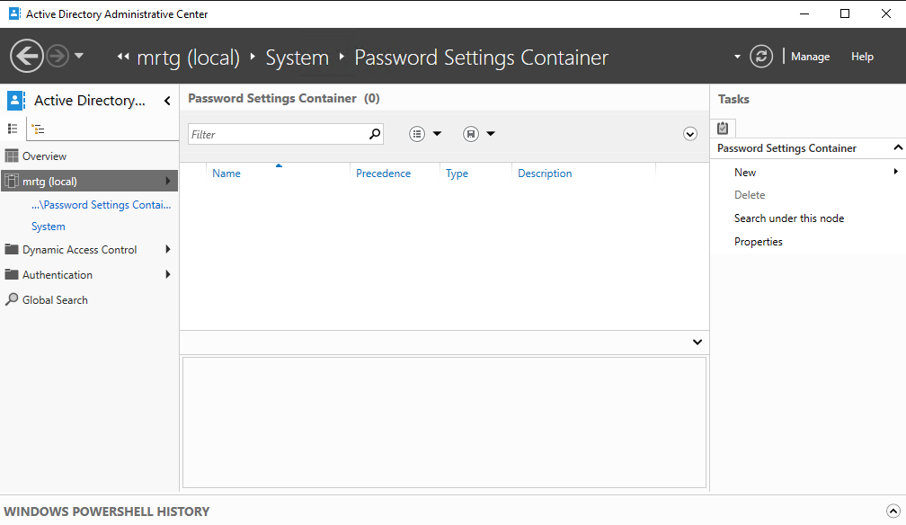

This is where Fine-Grained Password Policies are created and managed.

---

### 5. Standard Users PSO Created

A Password Settings Object named `PSO-Standard-Users` was created and applied to:

```text
GG_PSO_Standard_Users
```

Configured values included:

| Setting | Value |
|---|---|
| Precedence | `30` |
| Minimum password length | `12` |
| Password history | `5` |
| Maximum password age | `90 days` |
| Minimum password age | `1 day` |
| Complexity | `Enabled` |
| Reversible encryption | `Disabled` |
| Lockout threshold | `5` |
| Reset lockout counter after | `15 minutes` |
| Lockout duration | `15 minutes` |

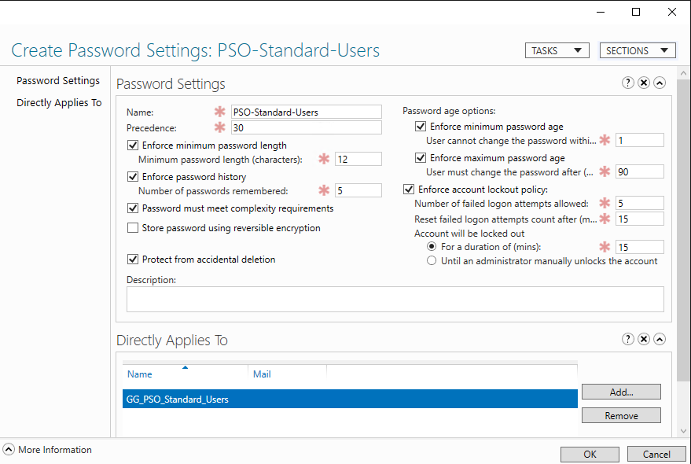

This policy represents the baseline authentication standard for normal workforce identities.

---

### 6. Privileged Admins PSO Created

A Password Settings Object named `PSO-Privileged-Admins` was created and applied to:

```text
GG_PSO_Privileged_Admins
```

Configured values included:

| Setting | Value |
|---|---|
| Precedence | `20` |
| Minimum password length | `14` |
| Password history | `10` |
| Maximum password age | `60 days` |
| Minimum password age | `1 day` |
| Complexity | `Enabled` |
| Reversible encryption | `Disabled` |
| Lockout threshold | `3` |
| Reset lockout counter after | `30 minutes` |
| Lockout duration | `30 minutes` |

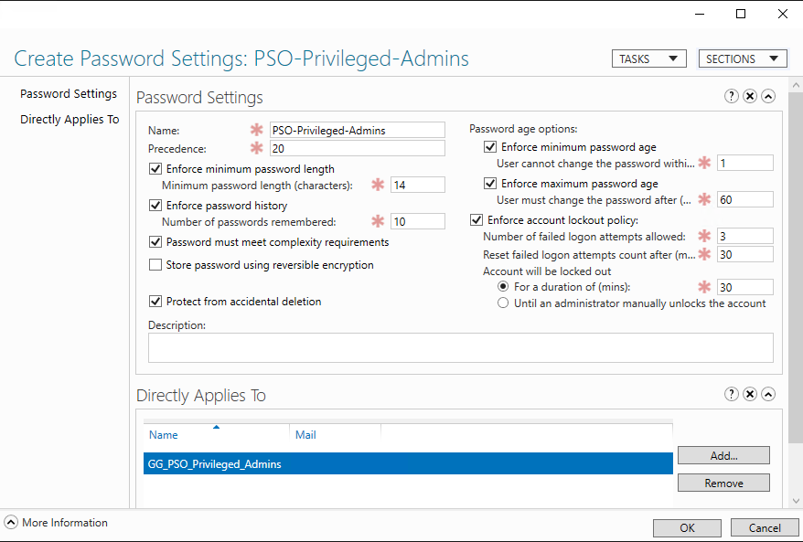

This policy applies stronger requirements to higher-risk privileged identities.

---

### 7. Service Accounts PSO Created

A Password Settings Object named `PSO-Service-Accounts` was created and applied to:

```text
GG_PSO_Service_Accounts
```

Configured values included:

| Setting | Value |
|---|---|
| Precedence | `10` |
| Minimum password length | `20` |
| Password history | `5` |
| Maximum password age | `365 days` |
| Minimum password age | `1 day` |
| Complexity | `Enabled` |
| Reversible encryption | `Disabled` |
| Lockout threshold | `5` |
| Reset lockout counter after | `15 minutes` |
| Lockout duration | `15 minutes` |

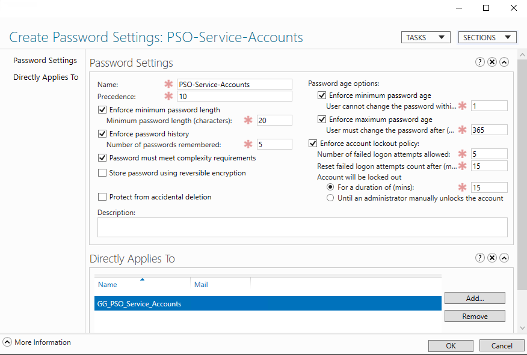

This policy differentiates service identities from normal user accounts by using a longer minimum password length and a separate password lifetime model.

---

### 8. PSO Objects Confirmed

The Password Settings Container was reviewed after creating all three PSOs.

The following objects were present:

| Password Settings Object | Precedence |
|---|---:|
| `PSO-Service-Accounts` | `10` |
| `PSO-Privileged-Admins` | `20` |
| `PSO-Standard-Users` | `30` |

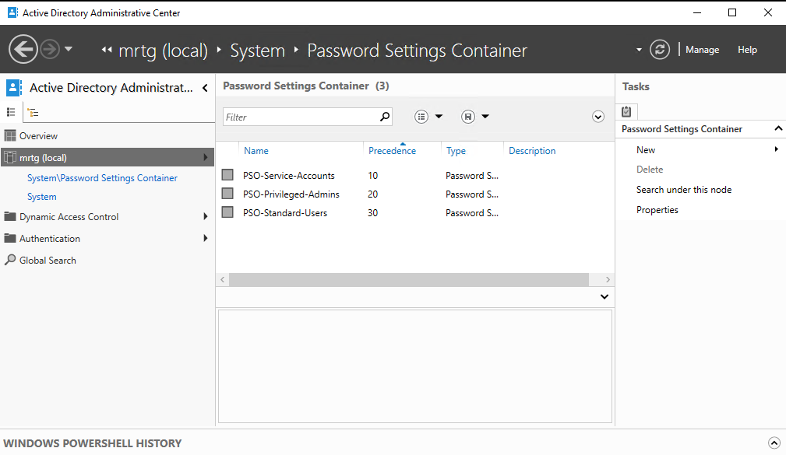

This confirmed that all three policy tiers were created successfully.

---

### 9. Standard User Resultant PSO Validated

The `kevin.carter` user object was reviewed in Active Directory Administrative Center.

Validation confirmed:

- The account was a member of `GG_PSO_Standard_Users`
- Directly Associated Password Settings showed `PSO-Standard-Users`
- Associated precedence was `30`

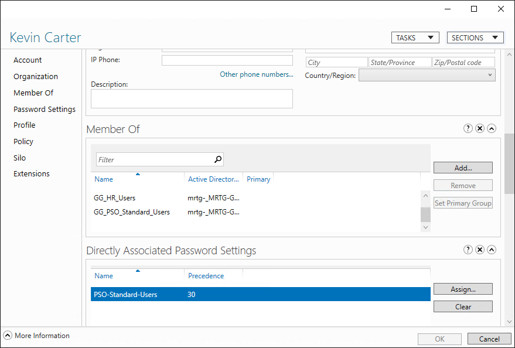

This confirmed that the standard user tier received the intended PSO.

---

### 10. Privileged Admin Resultant PSO Validated

The `john.smith.admin` account was reviewed in Active Directory Administrative Center.

Validation confirmed:

- The account was a member of `GG_PSO_Privileged_Admins`
- Directly Associated Password Settings showed `PSO-Privileged-Admins`
- Associated precedence was `20`

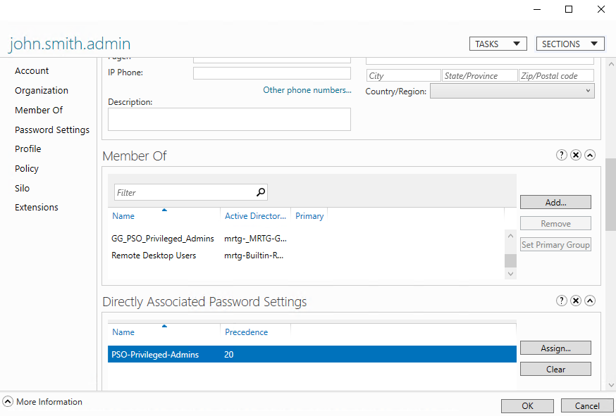

This confirmed that the privileged admin tier received stronger authentication controls than the standard user tier.

---

### 11. Service Account Resultant PSO Validated

The `Service App Deploy` account was reviewed in Active Directory Administrative Center.

Validation confirmed:

- The account was a member of `GG_PSO_Service_Accounts`
- Directly Associated Password Settings showed `PSO-Service-Accounts`
- Associated precedence was `10`

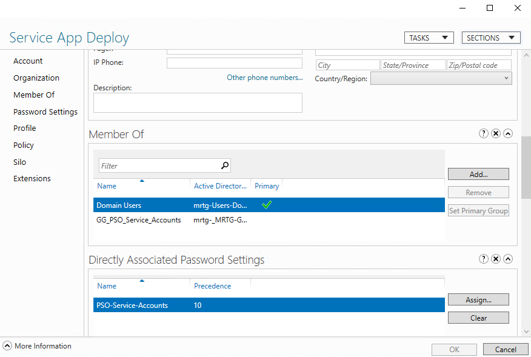

This confirmed that the service account tier received its own password policy.

---

### 12. Tiered Policy Comparison Validated

The Password Settings Container was reviewed with all three PSOs visible.

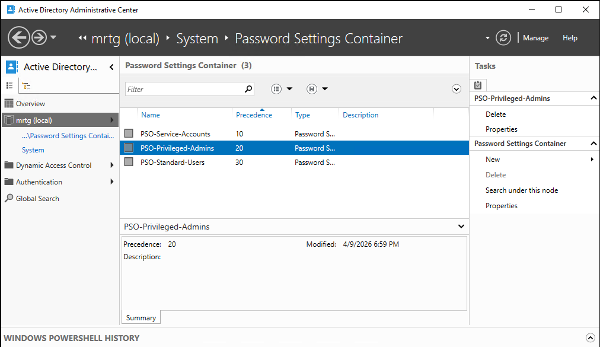

This confirmed that the environment contained a complete tiered FGPP design:

- Service Accounts — precedence `10`
- Privileged Admins — precedence `20`
- Standard Users — precedence `30`

---

## Security Perspective

This lab demonstrates that different identity types should not always share the same authentication policy.

Standard users, privileged administrators, and service accounts carry different risk profiles.

From a security perspective, this lab supports:

- Tiered identity control
- Stronger privileged account protection
- Differentiated service account policy
- Group-based authentication policy assignment
- Centralized password governance
- Reduced one-size-fits-all policy design
- Improved IAM maturity

FGPP gives Active Directory a practical way to apply different authentication controls without creating separate domains.

---

## Risk Addressed

Without Fine-Grained Password Policies, all domain users are governed by the same domain password policy unless other controls are introduced.

This lab reduces the risk of:

- Privileged accounts using the same password rules as standard users
- Service accounts being governed by an unsuitable password policy
- Lack of differentiation between identity tiers
- Manual per-user password policy assignment
- Weak privileged account authentication standards
- Poor service account password governance
- One-size-fits-all authentication control

---

## Control Mapping

| Control Area | How This Lab Supports It |
|---|---|
| Tiered identity control | Applies different password policies by account type |
| Privileged access protection | Applies stronger settings to admin accounts |
| Service account governance | Applies separate password settings to service accounts |
| Group-based targeting | Uses security groups to assign PSOs |
| Authentication hardening | Extends domain-wide hardening from Lab 09 |
| Audit readiness | Documents PSO creation, assignment, and validation |
| IAM maturity | Differentiates controls based on identity risk |

---

## Validation

The following validation checks were completed:

| Validation Item | Result |
|---|---|
| Pre-lab checkpoint created | Passed |
| FGPP targeting groups created | Passed |
| Users added to PSO targeting groups | Passed |
| Password Settings Container opened | Passed |
| `PSO-Standard-Users` created | Passed |
| `PSO-Privileged-Admins` created | Passed |
| `PSO-Service-Accounts` created | Passed |
| PSO precedence values configured | Passed |
| All PSO objects visible in container | Passed |
| Kevin Carter associated with `PSO-Standard-Users` | Passed |
| `john.smith.admin` associated with `PSO-Privileged-Admins` | Passed |
| `Service App Deploy` associated with `PSO-Service-Accounts` | Passed |
| Tiered PSO design validated | Passed |

---

## Evidence Collected

The following evidence was collected during the lab:

| Evidence | File |
|---|---|
| Pre-FGPP checkpoint | `screenshots/lab-10-01-pre-fgpp-checkpoint.png` |
| PSO groups created | `screenshots/lab-10-02-pso-groups-created.png` |
| PSO group membership | `screenshots/lab-10-03-pso-group-membership.png` |
| Password Settings Container opened | `screenshots/lab-10-04-password-settings-container-opened.png` |
| Standard users PSO configured | `screenshots/lab-10-05-standard-users-pso-configured.png` |
| Privileged admins PSO configured | `screenshots/lab-10-06-privileged-admins-pso-configured.png` |
| Service accounts PSO configured | `screenshots/lab-10-07-service-accounts-pso-configured.png` |
| PSO objects created | `screenshots/lab-10-08-pso-objects-created.png` |
| Resultant PSO Kevin Carter | `screenshots/lab-10-09-resultant-pso-kevin-carter.png` |
| Resultant PSO John Smith Admin | `screenshots/lab-10-10-resultant-pso-john-smith-admin.png` |
| Resultant PSO service account | `screenshots/lab-10-11-resultant-pso-service-account.png` |
| AD user policy tier validation | `screenshots/lab-10-12-ad-user-policy-tier-validation.png` |

---

## What I Would Improve in Production

In a production environment, I would improve this process by:

- Documenting formal identity tiers
- Defining password policy standards by account type
- Reviewing service account ownership and rotation requirements
- Avoiding normal user accounts in privileged policy groups
- Testing PSO precedence conflicts
- Validating resultant password settings with PowerShell
- Monitoring group membership changes for PSO targeting groups
- Reviewing PSO assignments on a regular schedule
- Aligning privileged account policy with compliance requirements
- Combining FGPP with MFA and privileged access controls where supported
- Using managed service accounts or gMSAs where appropriate
- Testing password change behavior after PSO assignment

---

## Lessons Learned

This lab reinforced that Fine-Grained Password Policies are separate from normal GPO-based password policy management.

FGPP uses Password Settings Objects, not standard OU-linked GPO settings.

The biggest takeaway is that identity risk should influence authentication controls. A service account, a privileged admin account, and a standard user account should not automatically receive the same password requirements.

Group-based PSO targeting keeps the model scalable and easier to review.

---

## Outcome

Lab 10 successfully implemented Fine-Grained Password Policies for tiered identity control in the MRTG Active Directory environment.

The lab confirmed:

- FGPP targeting groups were created
- Standard users, privileged admins, and service accounts were assigned to separate groups
- Three Password Settings Objects were created
- PSOs were applied through group-based targeting
- Each identity tier received the correct directly associated password settings
- The environment now supports differentiated authentication controls by account type

This moved the environment from domain-wide authentication hardening into tiered identity control.

---

## Next Lab

[Lab 11 — DHCP Services for Enterprise Identity Infrastructure](../Lab-11-DHCP-Services-for-Enterprise-Identity-Infrastructure/)

Lab 11 will build on tiered identity control by deploying DHCP services to support reliable IP address assignment for domain-joined systems in the MRTG environment.
