# Lab-11 — DHCP Services for Enterprise Identity Infrastructure


---

## Overview

In this lab, I implemented DHCP Services in the Monroe Redstone Technology Group (MRTG) Active Directory environment to centralize IPv4 address assignment for domain-connected systems and support identity-aware infrastructure management. The objective was to move beyond static-only client addressing and begin standardizing how workstation systems receive network configuration inside the MRTG lab.

Before enabling DHCP for clients, I documented the baseline network state of both the domain controller and the client workstation. I then installed the DHCP Server role on `MRTG-DC01`, completed post-installation configuration, authorized the DHCP server in Active Directory, created an IPv4 scope, defined the address pool, added exclusions, configured DNS scope options, activated the scope, and transitioned the client from static configuration to automatic addressing.

This lab builds directly on the authentication hardening work from Lab 10. Lab 10 established differentiated password controls across identity tiers. Lab 11 extends that foundation by implementing a supporting infrastructure service that helps domain-connected systems receive standardized network settings through centrally managed services.

---

## Objectives

- Document the pre-DHCP network baseline for the server and client systems
- Install the DHCP Server role on `MRTG-DC01`
- Complete DHCP post-installation configuration
- Authorize the DHCP server in Active Directory
- Create and activate an IPv4 scope for MRTG client systems
- Define a controlled DHCP address range and exclusion range
- Configure DNS-related DHCP scope options
- Transition the client from static addressing to automatic addressing
- Validate that the client successfully receives a dynamic IPv4 lease
- Confirm that the client can still reach domain infrastructure after DHCP assignment

---

## Scope

### Included

- Hyper-V checkpoint creation before DHCP changes
- Baseline `ipconfig /all` capture from the domain controller
- Baseline `ipconfig /all` capture from the client workstation
- Baseline client connectivity and DNS testing
- Installation of the DHCP Server role
- DHCP post-installation configuration
- Active Directory authorization of the DHCP server
- Creation of an IPv4 scope
- Scope range definition
- Exclusion range configuration
- DNS scope option configuration
- Scope activation
- Client adapter reconfiguration to automatic addressing
- DHCP lease renewal and validation
- Address lease visibility in the DHCP console
- Post-DHCP client connectivity and domain discovery validation

### Not Included

- DHCP reservations
- DHCP failover
- Split-scope DHCP design
- DHCP relay configuration
- IPv6 DHCP configuration
- Multi-site DHCP deployment
- PXE or imaging integration
- Advanced DHCP policy targeting
- Gateway distribution to routed subnets

This lab stays focused on single-scope DHCP deployment and client lease validation inside a compact Windows Server and Active Directory lab environment.

---

## Lab Environment

### Systems

- **Host Platform:** Hyper-V
- **Domain Controller / DNS / DHCP Server:** `MRTG-DC01`
- **Client Workstation:** `CLIENT01`
- **Domain:** `mrtg.local`

### Baseline Network State

- **Domain Controller IPv4 Address:** `192.168.10.10`
- **Client Baseline IPv4 Address:** `192.168.10.20`
- **Subnet Mask:** `255.255.255.0`
- **DNS Server:** `192.168.10.10`

### DHCP Scope Configuration

- **Scope Name:** `MRTG-Client-Scope`
- **Network:** `192.168.10.0/24`
- **Start IP Address:** `192.168.10.100`
- **End IP Address:** `192.168.10.200`
- **Exclusion Range:** `192.168.10.150 - 192.168.10.160`
- **DNS Domain Name:** `mrtg.local`
- **DNS Server Distributed by DHCP:** `192.168.10.10`

> This lab was built on an isolated single-subnet internal network. A default gateway was not configured in the DHCP scope because routed outbound connectivity was not required for this stage of the environment.

### Tools / Technologies Used

- Windows Server 2022
- Hyper-V
- Server Manager
- DHCP Server role
- DHCP Management Console
- Active Directory
- DNS
- Command Prompt
- `ipconfig`
- `ping`
- `nslookup`
- `nltest`
- `whoami`

---

## Architecture / Design

This lab was designed to support the following identity-infrastructure need:

> MRTG requires centrally managed IPv4 configuration so domain-connected systems can receive standardized network settings and reliably communicate with internal Active Directory and DNS services.

### Design Logic

- Core directory infrastructure should remain on static addressing
- Client systems should transition from manual addressing to centrally managed lease assignment
- DHCP must be authorized in Active Directory so only approved infrastructure can issue leases
- The DHCP scope should align with the MRTG lab subnet and reserve part of the pool through exclusions
- DNS settings distributed by DHCP should direct clients to the internal domain controller and DNS server
- Post-change validation should prove that domain connectivity still works after DHCP assignment

### IAM Perspective

This design supports:

- centralized infrastructure control
- identity-aware network standardization
- more consistent DNS delivery to domain-connected systems
- reduced configuration drift on workstations
- stronger administrative governance over client network settings

The key design point is that DHCP is not just a convenience service. In an Active Directory environment, it becomes part of the supporting identity infrastructure. Clients need correct IP configuration and correct DNS settings to locate domain services, process policy, and authenticate consistently. This lab shows how DHCP begins to standardize that foundation.

---

## Implementation Steps

### 1. Created a Pre-Lab Checkpoint

Before making DHCP changes, I created a Hyper-V checkpoint to preserve the clean post-Lab 10 environment.

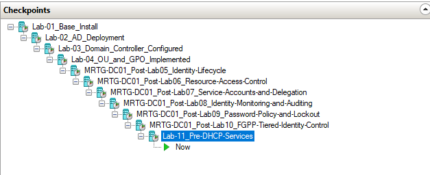

---

### 2. Documented the Domain Controller Network Baseline

I ran `ipconfig /all` on `MRTG-DC01` to record the domain controller’s baseline network configuration before DHCP deployment.

This confirmed that the server was using the expected static IPv4 address of `192.168.10.10`.

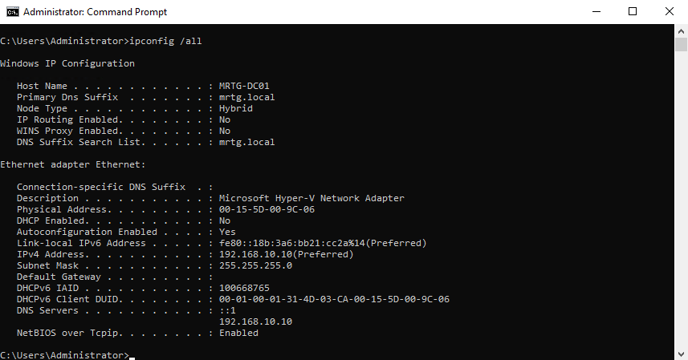

---

### 3. Reviewed the Existing Identity Infrastructure Baseline

In Server Manager, I verified that the environment already had Active Directory Domain Services and DNS in place before adding DHCP.

This established the pre-change infrastructure baseline.

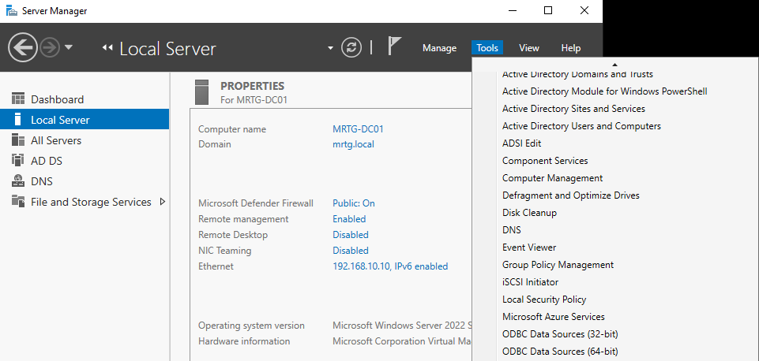

---

### 4. Documented the Client Network Baseline

I ran `ipconfig /all` on `CLIENT01` to record the client’s pre-DHCP network state.

This confirmed that the client was still statically configured and that **DHCP Enabled** was set to **No**.

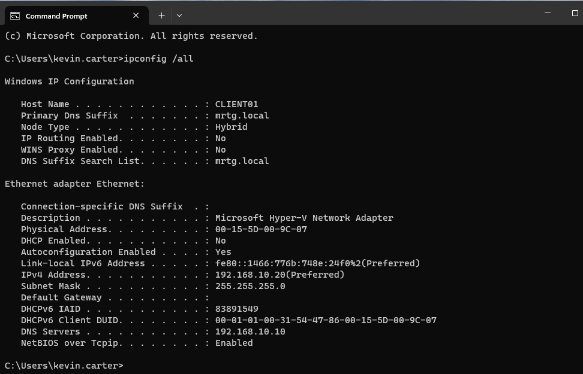

---

### 5. Validated Baseline Client Connectivity and DNS Resolution

Before introducing DHCP, I tested client communication with the domain controller and internal DNS.

**Commands used:**

```powershell
ping MRTG-DC01
nslookup mrtg.local
```

This confirmed that the client could already reach domain infrastructure before the DHCP rollout.

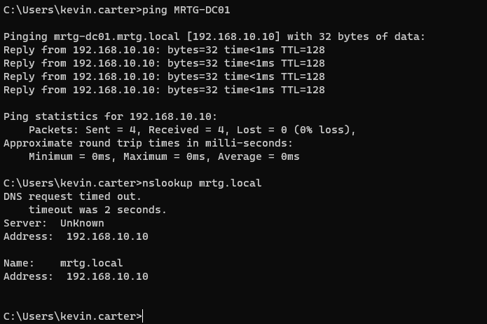

---

### 6. Installed the DHCP Server Role

On `MRTG-DC01`, I opened the Add Roles and Features Wizard and selected the **DHCP Server** role.

This added the service required to centrally manage IPv4 address assignment for MRTG client systems.

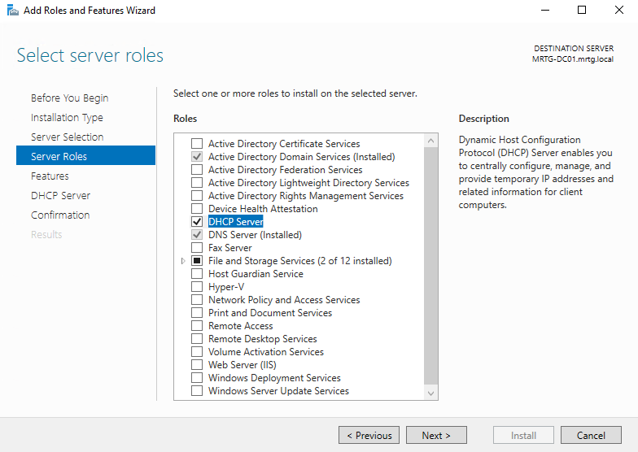

---

### 7. Confirmed DHCP Role Installation Success

After installation completed, I verified that the DHCP Server role and management tools were successfully installed.

The installation results also showed that post-installation configuration was still required.

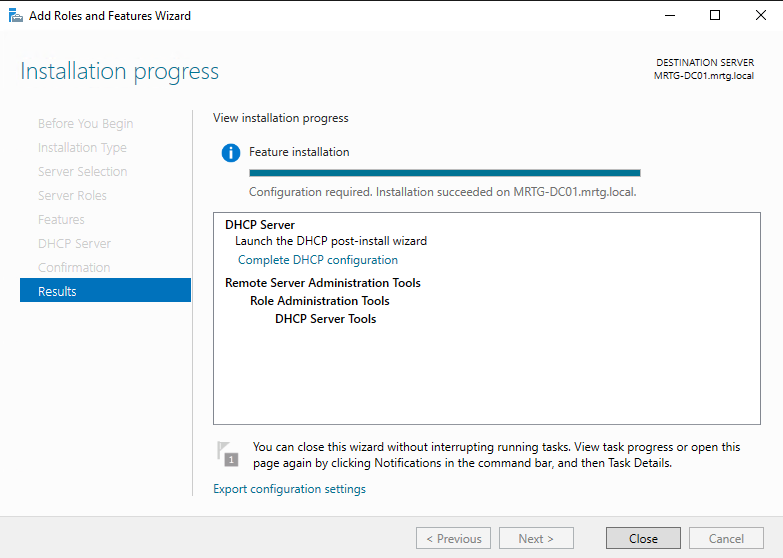

---

### 8. Opened the DHCP Post-Installation Configuration Task

In Server Manager, I opened the notification flag and selected **Complete DHCP configuration** to finish the required post-deployment setup.

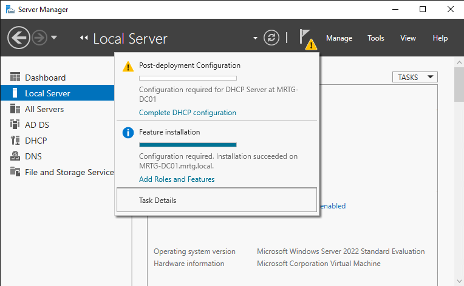

---

### 9. Authorized the DHCP Server Using Domain Credentials

In the DHCP Post-Install Configuration Wizard, I used the displayed domain administrative credentials to authorize the DHCP server in Active Directory.

This step matters because domain environments are designed to trust only approved DHCP infrastructure.

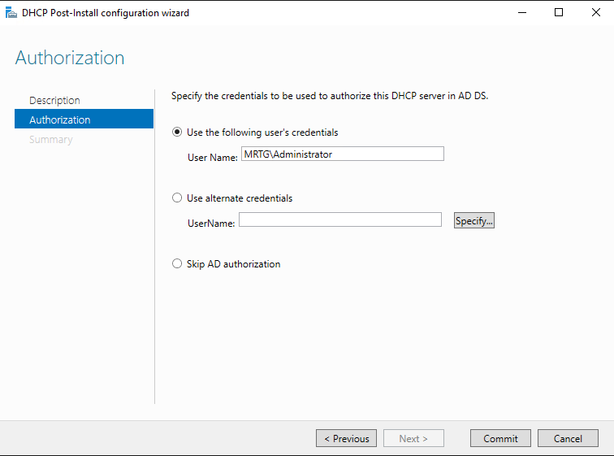

---

### 10. Confirmed DHCP Authorization Success

I completed the wizard and verified that the post-installation summary showed both security group creation and DHCP authorization as complete.

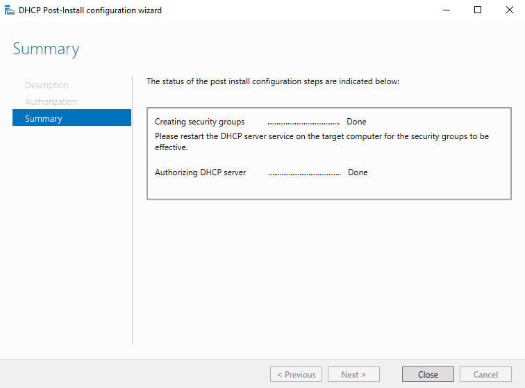

---

### 11. Opened the DHCP Management Console

After authorization, I opened the DHCP console and verified that `MRTG-DC01.mrtg.local` appeared in the management tree with both IPv4 and IPv6 containers visible.

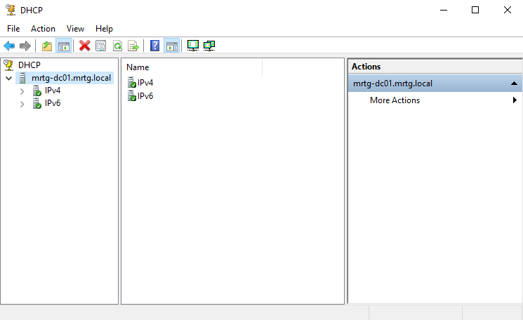

---

### 12. Created the New Scope Name

Inside the New Scope Wizard, I named the first IPv4 scope `MRTG-Client-Scope` and documented its purpose for domain client systems on the `192.168.10.0/24` network.

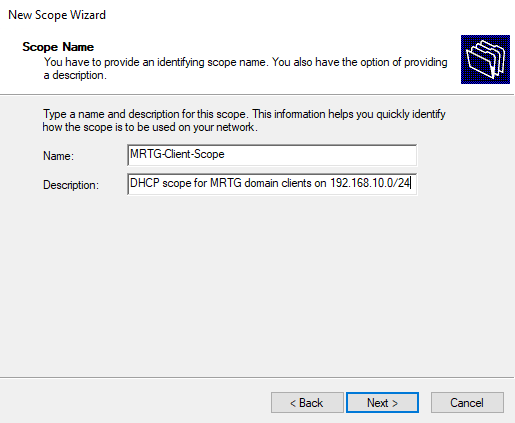

---

### 13. Defined the DHCP Address Pool

I configured the scope to distribute addresses from `192.168.10.100` through `192.168.10.200` with a `/24` subnet mask.

This created the usable dynamic address range for client systems.

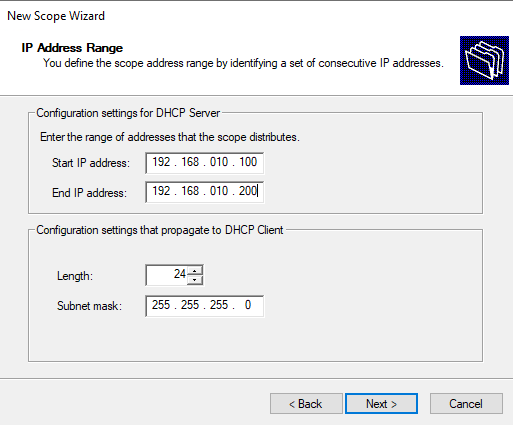

---

### 14. Added an Exclusion Range

I configured an exclusion range of `192.168.10.150` through `192.168.10.160`.

This reserved part of the scope so those addresses would not be distributed dynamically.

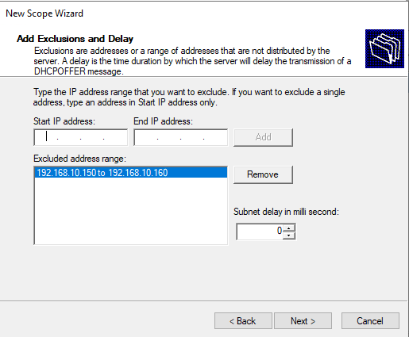

---

### 15. Reviewed the Router / Default Gateway Option

The Router (Default Gateway) step was left unconfigured in this isolated single-subnet lab.

That was intentional. This lab did not require routed outbound connectivity, so the scope focused on internal client-to-directory communication rather than internet or multi-subnet routing.

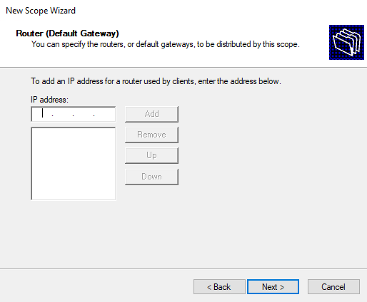

---

### 16. Configured DNS Scope Options

I configured the scope to distribute the MRTG domain name and internal DNS server.

**Configured values:**

- **Parent domain:** `mrtg.local`
- **DNS server:** `192.168.10.10`

These settings are the identity-critical part of the scope because they allow clients to locate internal domain services through the correct DNS infrastructure.

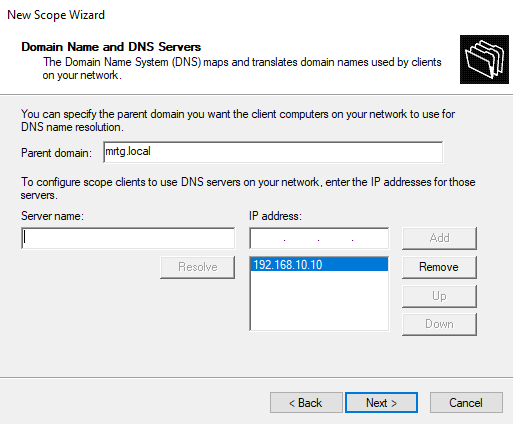

---

### 17. Activated the Scope

I selected the option to activate the scope immediately so the DHCP server could begin issuing leases to eligible clients.

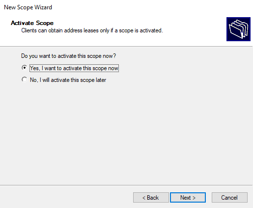

---

### 18. Verified the Scope Was Active

After completing the wizard, I confirmed that the active IPv4 scope appeared in the DHCP console with its major containers visible, including:

- Address Pool
- Address Leases
- Scope Options
- Policies

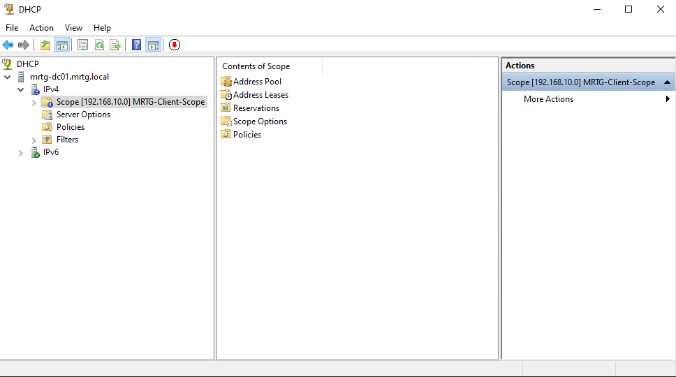

---

### 19. Switched the Client Adapter to Automatic Addressing

On `CLIENT01`, I changed the IPv4 adapter settings to:

- **Obtain an IP address automatically**
- **Obtain DNS server address automatically**

This transitioned the workstation from static client configuration to DHCP-managed configuration.

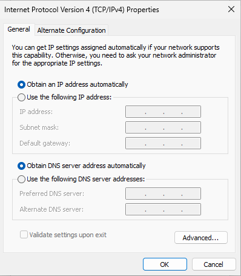

---

### 20. Released and Renewed the Client Lease

After switching the adapter to automatic addressing, I used Command Prompt to release the old configuration and request a new DHCP lease.

**Commands used:**

```powershell
ipconfig /release
ipconfig /renew
```

The client successfully received a new IPv4 address from the MRTG DHCP scope.

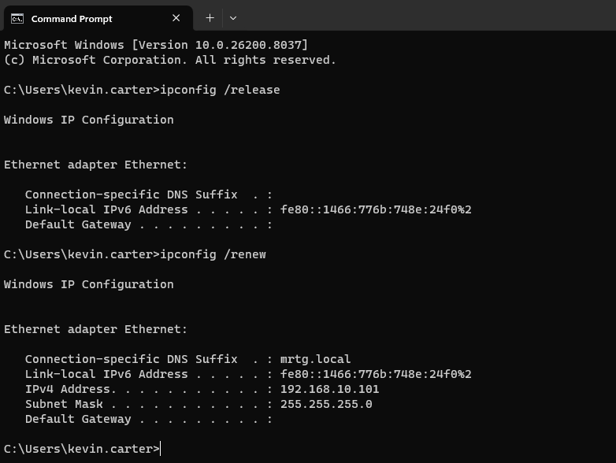

---

### 21. Confirmed DHCP-Assigned Client Configuration

I ran `ipconfig /all` again on `CLIENT01` and confirmed that the client had transitioned to DHCP.

**Validated values included:**

- **DHCP Enabled:** `Yes`
- **IPv4 Address:** `192.168.10.101`
- **Subnet Mask:** `255.255.255.0`
- **DNS Server:** `192.168.10.10`
- **Connection-specific DNS suffix:** `mrtg.local`

This proved that the client was now receiving its network configuration dynamically from DHCP.

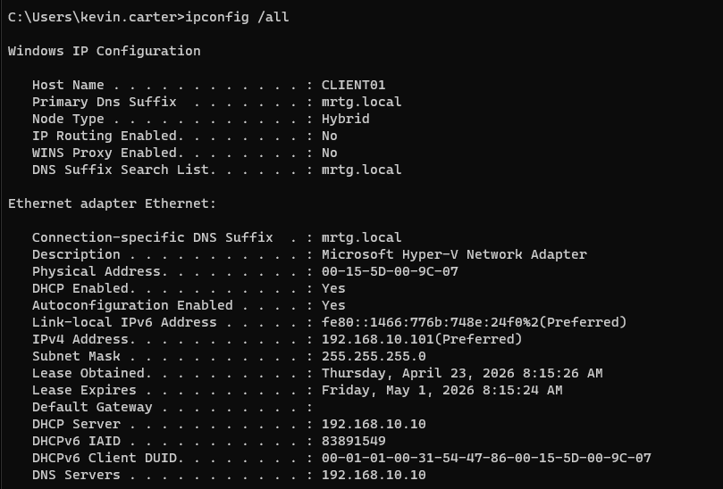

---

### 22. Verified the Address Lease in the DHCP Console

Back on `MRTG-DC01`, I opened **Address Leases** and confirmed that the DHCP server showed an active lease for `CLIENT01.mrtg.local` with the assigned address `192.168.10.101`.

This provided server-side proof that the lease had been issued and tracked successfully.

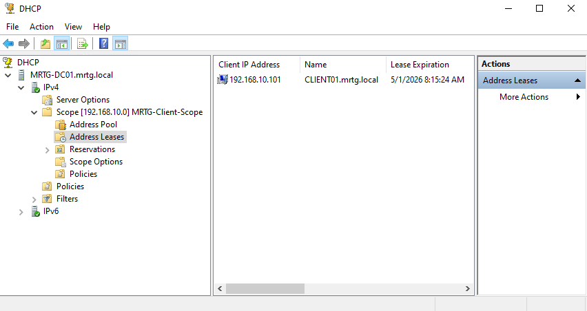

---

### 23. Validated Client Connectivity to the Domain Controller After DHCP

After the DHCP transition, I confirmed that the client could still communicate with the domain controller.

**Command used:**

```powershell
ping MRTG-DC01
```

The ping succeeded, which showed that basic connectivity to internal domain infrastructure remained intact after DHCP assignment.

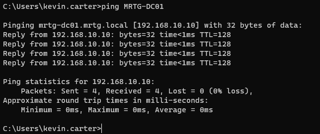

---

### 24. Validated Internal DNS Resolution After DHCP

I ran an internal DNS lookup from the DHCP-configured client.

**Command used:**

```powershell
nslookup mrtg.local
```

The result resolved `mrtg.local` to `192.168.10.10`. The screenshot also shows `Server: Unknown` and an initial timeout, which is consistent with missing reverse lookup information for the DNS server address. The forward lookup still succeeded, which is the important validation point for this lab.

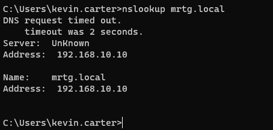

---

### 25. Validated Domain Controller Discovery After DHCP

I tested domain controller discovery directly from the DHCP-configured client.

**Command used:**

```powershell
nltest /dsgetdc:mrtg.local
```

This confirmed that the client could still locate the domain controller and identify core directory service roles after moving to DHCP.

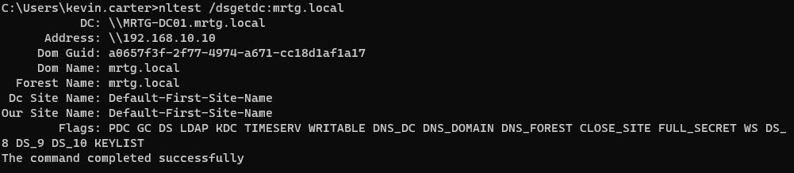

---

### 26. Confirmed the Client Was Still Operating in a Domain User Session

I confirmed the current logged-in user context after the DHCP transition.

**Command used:**

```powershell
whoami
```

The result showed `mrtg\kevin.carter`, which confirmed that the client was still operating inside the MRTG domain context after switching to DHCP.

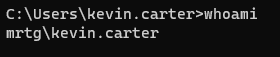

---

## Validation / Proof

### Validation Scenario 1 - DHCP Server Deployment and Authorization

**System tested:** `MRTG-DC01`

I confirmed that:

- the DHCP Server role installed successfully
- post-installation configuration was completed
- the DHCP server was authorized in Active Directory
- the DHCP server appeared in the management console

This proved that DHCP infrastructure was deployed and trusted for use in the MRTG domain.

---

### Validation Scenario 2 - Active Scope Configuration

**System tested:** `MRTG-DC01`

I confirmed that:

- the scope name was created correctly
- the IP range was configured for the `192.168.10.0/24` subnet
- the exclusion range was present
- the DNS scope options were configured
- the scope was activated successfully

This proved that the DHCP server had a usable and active client scope.

---

### Validation Scenario 3 - Client Transition to DHCP

**System tested:** `CLIENT01`

I confirmed that:

- the client adapter was reconfigured for automatic addressing
- the client successfully released and renewed its address
- the client received the DHCP-assigned address `192.168.10.101`
- `DHCP Enabled` changed from `No` to `Yes`

This proved that the workstation successfully transitioned from static addressing to DHCP-managed configuration.

---

### Validation Scenario 4 - Server-Side Lease Visibility

**System tested:** `MRTG-DC01`

I confirmed that the DHCP console displayed an address lease for `CLIENT01.mrtg.local` at `192.168.10.101`.

This proved that the lease was not only received by the client, but also visible and tracked from the server side.


---

### Validation Scenario 5 - Post-DHCP Domain Connectivity

**System tested:** `CLIENT01`

I confirmed that after DHCP assignment:

- the client could ping the domain controller
- internal DNS forward lookup still resolved `mrtg.local`
- the client could discover a domain controller through `nltest`
- the session remained inside the MRTG domain user context

This proved that DHCP assignment did not break basic domain communication or identity context.

---

## Security Relevance

This lab strengthens the MRTG environment by moving beyond static-only client addressing and into centrally managed network configuration for domain-connected systems.

**Key security benefits include:**

- centralized control of client IPv4 assignment
- Active Directory authorization of DHCP infrastructure
- more consistent DNS distribution to domain-connected systems
- reduced client-side configuration drift
- stronger operational visibility through server-side lease tracking
- better support for identity-dependent services that rely on correct network and DNS configuration

This matters because Active Directory environments break in boring ways first. Bad DNS, inconsistent client configuration, and unmanaged address assignment cause authentication issues, service discovery problems, and troubleshooting waste. DHCP helps reduce that mess by standardizing how client systems receive network settings.

---

## Key Skills Demonstrated

- Hyper-V checkpoint management
- Baseline network documentation
- `ipconfig /all` analysis
- DHCP Server role installation
- DHCP post-installation configuration
- Active Directory-integrated DHCP authorization
- IPv4 scope creation
- DHCP exclusion range configuration
- DNS scope option configuration
- Scope activation
- Client transition from static to dynamic addressing
- DHCP lease renewal and validation
- DHCP console lease tracking
- Internal DNS and domain controller discovery validation

---

## Outcome

By the end of this lab, the MRTG environment was able to:

- preserve a clean pre-DHCP checkpoint
- document the pre-change server and client network baseline
- deploy and authorize DHCP on `MRTG-DC01`
- create and activate a working IPv4 client scope
- distribute DHCP-based addressing to `CLIENT01`
- confirm the client received `192.168.10.101` dynamically
- verify the lease from both the client side and the server side
- validate that the client retained internal DNS resolution and domain communication after switching to DHCP

This lab moved the MRTG environment from manual client networking toward centrally managed infrastructure. That is a more realistic enterprise model and a stronger identity-supporting foundation for the labs that follow.

---

## Next Lab

[**Lab-12 — Additional Domain Controller and AD Replication**](../Lab-12-Additional-Domain-Controller-and-AD-Replication)

Lab-12 builds on the identity-supporting network services foundation by deploying an additional domain controller and validating Active Directory replication for improved directory resilience.
