# Lab 11 — DHCP Services for Enterprise Identity Infrastructure


---

## Objective

The objective of this lab is to deploy DHCP services in the `mrtg.local` Active Directory environment.

This lab centralizes IPv4 address assignment for client systems and validates that domain-connected workstations can receive DHCP configuration while maintaining communication with internal Active Directory and DNS services.

The focus is on identity-supporting network infrastructure, DHCP authorization, scope configuration, client lease validation, and post-DHCP domain discovery.

---

## Business Problem

Monroe Redstone Technology Group needs centrally managed IP address assignment for domain-connected systems.

Static-only workstation addressing does not scale well and increases the risk of configuration drift, duplicate addressing, DNS issues, and inconsistent client settings.

This lab addresses the need to:

- Deploy DHCP as a managed infrastructure service
- Authorize DHCP in Active Directory
- Create a controlled IPv4 scope
- Distribute internal DNS settings to domain clients
- Transition a client from static addressing to DHCP
- Validate client lease assignment
- Confirm that domain connectivity still works after DHCP assignment
- Support reliable identity infrastructure through standardized network configuration

---

## Lab Summary

In this lab, I deployed the DHCP Server role on `MRTG-DC01`.

I documented the pre-DHCP network baseline for the domain controller and client workstation, installed and authorized DHCP, created an IPv4 scope, configured an address pool and exclusion range, added DNS scope options, activated the scope, and transitioned `CLIENT01` from static addressing to automatic addressing.

After the client received a DHCP lease, I validated the lease from both the client side and server side. I also confirmed that the client could still communicate with the domain controller, resolve the domain name, discover a domain controller, and operate in a domain user session.

---

## Environment

| Component | Details |
|---|---|
| Domain | `mrtg.local` |
| Domain Controller / DNS / DHCP Server | `MRTG-DC01` |
| Client Workstation | `CLIENT01` |
| Platform | Hyper-V |
| Operating System | Windows Server 2022 |
| Directory Service | Active Directory Domain Services |
| Network Service | DHCP Server |
| DNS Server | `192.168.10.10` |
| Lab Organization | Monroe Redstone Technology Group |

---

## Scope

### Included

- Pre-lab Hyper-V checkpoint
- Domain controller network baseline documentation
- Client workstation network baseline documentation
- Baseline connectivity and DNS validation
- DHCP Server role installation
- DHCP post-installation configuration
- DHCP authorization in Active Directory
- IPv4 scope creation
- DHCP address range configuration
- Exclusion range configuration
- DNS scope option configuration
- Scope activation
- Client adapter transition to automatic addressing
- DHCP lease release and renewal
- Client-side DHCP validation
- Server-side lease validation
- Post-DHCP domain connectivity validation
- Post-DHCP DNS and domain controller discovery validation

### Not Included

- DHCP reservations
- DHCP failover
- Split-scope DHCP design
- DHCP relay configuration
- IPv6 DHCP configuration
- Multi-site DHCP deployment
- PXE or imaging integration
- Advanced DHCP policies
- Routed subnet gateway distribution

---

## Baseline Network State

| System | Setting | Value |
|---|---|---|
| `MRTG-DC01` | IPv4 Address | `192.168.10.10` |
| `CLIENT01` | Baseline IPv4 Address | `192.168.10.20` |
| Network | Subnet Mask | `255.255.255.0` |
| DNS | DNS Server | `192.168.10.10` |
| Domain | DNS Suffix | `mrtg.local` |

---

## DHCP Scope Configuration

| Setting | Value |
|---|---|
| Scope Name | `MRTG-Client-Scope` |
| Network | `192.168.10.0/24` |
| Start IP Address | `192.168.10.100` |
| End IP Address | `192.168.10.200` |
| Exclusion Range | `192.168.10.150 - 192.168.10.160` |
| DNS Domain Name | `mrtg.local` |
| DNS Server Distributed by DHCP | `192.168.10.10` |
| Default Gateway | Not configured for this isolated single-subnet lab |

---

## Architecture

This lab uses `MRTG-DC01` as the domain controller, DNS server, and DHCP server for the isolated MRTG lab subnet.

```text
mrtg.local
├── MRTG-DC01
│   ├── Active Directory Domain Services
│   ├── DNS
│   └── DHCP Server
│
└── CLIENT01
    └── DHCP client lease from MRTG-Client-Scope
```

DHCP scope design:

```text
Network:          192.168.10.0/24
DHCP Range:       192.168.10.100 - 192.168.10.200
Excluded Range:   192.168.10.150 - 192.168.10.160
DNS Server:       192.168.10.10
DNS Domain:       mrtg.local
```

This design supports:

- Centralized IP address management
- Active Directory-authorized DHCP service
- Consistent DNS distribution
- Reduced workstation configuration drift
- Reliable client-to-domain communication
- Better identity infrastructure stability

---

## Identity Infrastructure Relevance

DHCP is not only a network convenience service in an Active Directory environment.

Domain-joined systems need correct IP and DNS configuration to locate domain controllers, authenticate, process Group Policy, and resolve internal domain names.

This lab supports IAM operations by ensuring client systems receive the correct network settings required for identity services.

| Dependency | Why It Matters |
|---|---|
| IP Address | Allows the client to communicate on the domain subnet |
| DNS Server | Allows the client to locate domain services |
| DNS Suffix | Supports internal name resolution for `mrtg.local` |
| DHCP Authorization | Ensures only approved DHCP servers issue leases |
| Lease Visibility | Provides operational tracking of client address assignment |

---

## Implementation and Validation

### 1. Pre-Lab Checkpoint Created

A Hyper-V checkpoint was created before making DHCP changes.

This preserved the clean post-Lab-10 environment.


---

### 2. Domain Controller Network Baseline Documented

`ipconfig /all` was run on `MRTG-DC01`.

This confirmed that the domain controller used the expected static IPv4 address.

Validated server address:

`192.168.10.10`

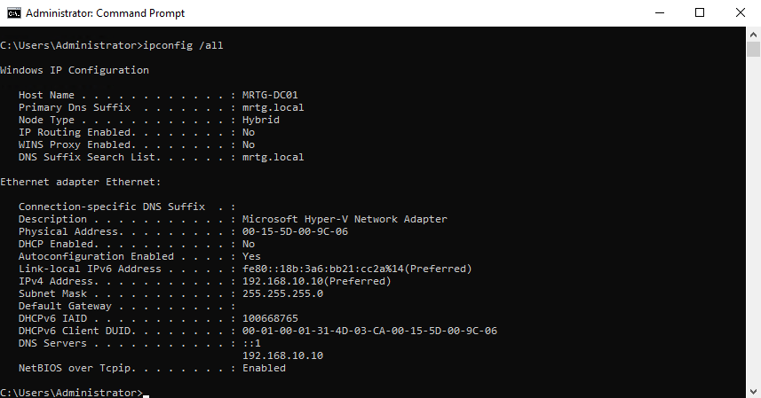

---

### 3. Existing Identity Infrastructure Baseline Reviewed

Server Manager was reviewed to confirm that Active Directory Domain Services and DNS were already installed before adding DHCP.


This established the pre-change infrastructure baseline.

---

### 4. Client Network Baseline Documented

`ipconfig /all` was run on `CLIENT01`.

This confirmed that the client was still statically configured before DHCP deployment.

Baseline result:

`DHCP Enabled: No`


---

### 5. Baseline Client Connectivity and DNS Resolution Validated

Client communication with the domain controller and internal DNS was tested before DHCP was introduced.

Commands used:

```powershell
ping MRTG-DC01
nslookup mrtg.local
```

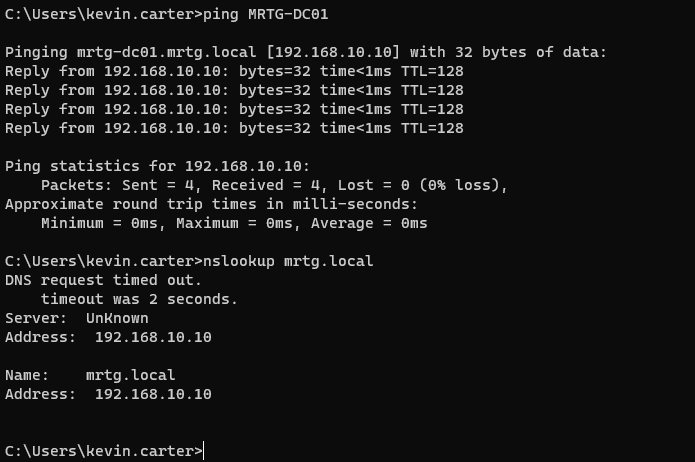

This confirmed the client could reach domain infrastructure before DHCP changes.

---

### 6. DHCP Server Role Installed

The DHCP Server role was selected in the Add Roles and Features Wizard on `MRTG-DC01`.


This added the server role required to centrally manage IPv4 address assignment.

---

### 7. DHCP Role Installation Confirmed

The DHCP Server role installation completed successfully.

The installation results showed that post-installation configuration was still required.


---

### 8. DHCP Post-Installation Configuration Opened

The Server Manager notification flag was used to open the DHCP post-installation configuration task.

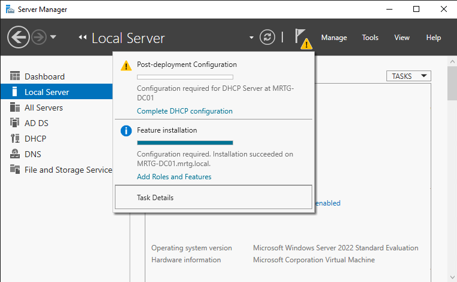

---

### 9. DHCP Authorization Configured with Domain Credentials

The DHCP Post-Install Configuration Wizard was completed using domain administrative credentials.

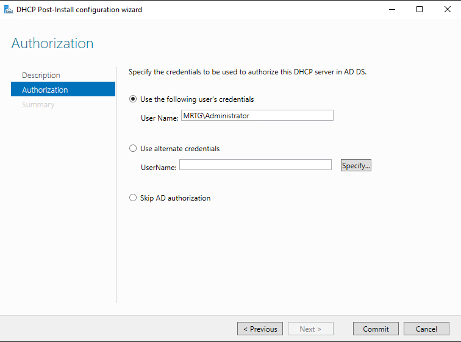

This authorized the DHCP server in Active Directory.

---

### 10. DHCP Authorization Confirmed

The post-installation summary confirmed that DHCP authorization completed successfully.


This validated that the DHCP server was approved to issue leases in the domain.

---

### 11. DHCP Console Server Visibility Confirmed

The DHCP Management Console was opened.

`MRTG-DC01.mrtg.local` appeared in the console with IPv4 and IPv6 containers visible.

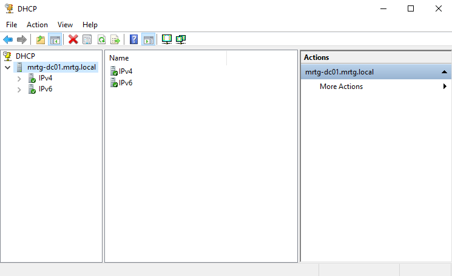

---

### 12. New IPv4 Scope Named

A new IPv4 scope was created and named:

`MRTG-Client-Scope`


The scope was created for domain client systems on the `192.168.10.0/24` network.

---

### 13. DHCP Address Pool Defined

The DHCP address pool was configured.

| Setting | Value |
|---|---|
| Start IP Address | `192.168.10.100` |
| End IP Address | `192.168.10.200` |
| Subnet Mask | `255.255.255.0` |

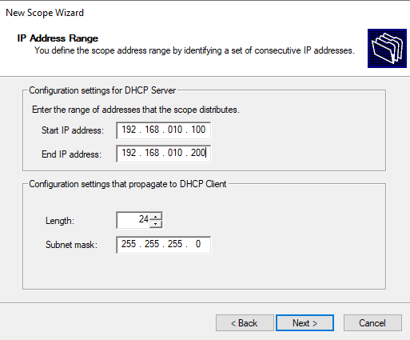

---

### 14. Exclusion Range Added

An exclusion range was configured so selected addresses would not be distributed dynamically.

Exclusion range:

`192.168.10.150 - 192.168.10.160`

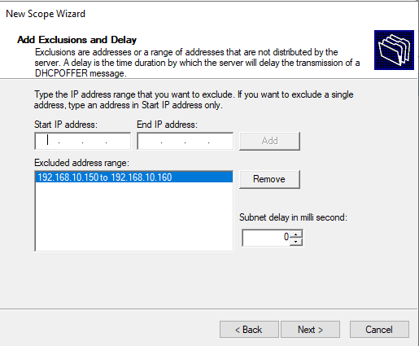

---

### 15. Default Gateway Option Reviewed

The Router / Default Gateway option was left unconfigured.

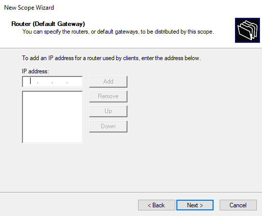

This was intentional because the lab used an isolated single-subnet internal network and did not require routed outbound connectivity.

---

### 16. DNS Scope Options Configured

The DHCP scope was configured to distribute internal DNS settings.

| Option | Value |
|---|---|
| Parent Domain | `mrtg.local` |
| DNS Server | `192.168.10.10` |

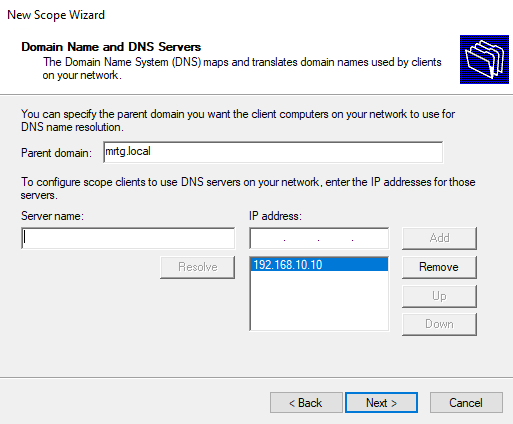

These settings allow clients to locate internal domain services through the correct DNS infrastructure.

---

### 17. DHCP Scope Activated

The scope was activated immediately after configuration.

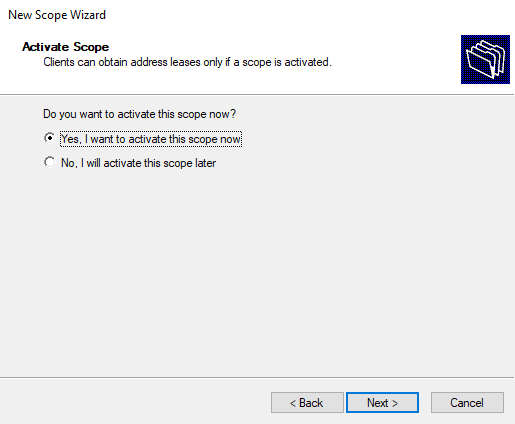

This allowed the DHCP server to begin issuing leases to eligible clients.

---

### 18. Active Scope Verified

The DHCP console was reviewed after scope creation.

The active IPv4 scope appeared with the expected containers:

- Address Pool
- Address Leases
- Scope Options
- Policies

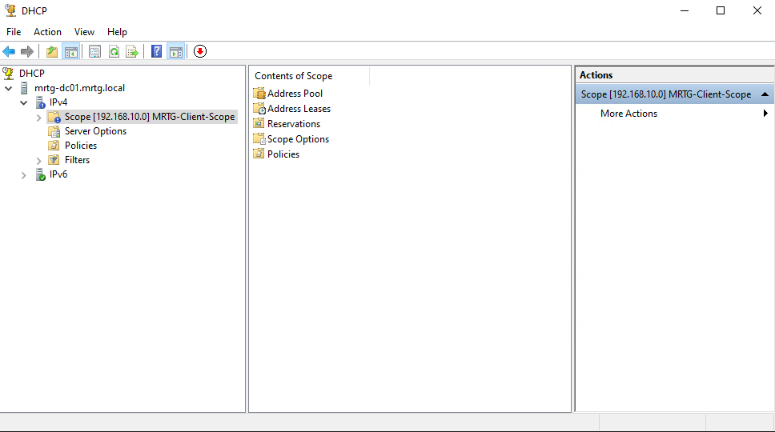

---

### 19. Client Adapter Set to Automatic Addressing

On `CLIENT01`, IPv4 adapter settings were changed to:

- Obtain an IP address automatically
- Obtain DNS server address automatically


This transitioned the client from static configuration to DHCP-managed configuration.

---

### 20. Client DHCP Lease Released and Renewed

The old client network configuration was released and a new DHCP lease was requested.

Commands used:

```powershell
ipconfig /release
ipconfig /renew
```

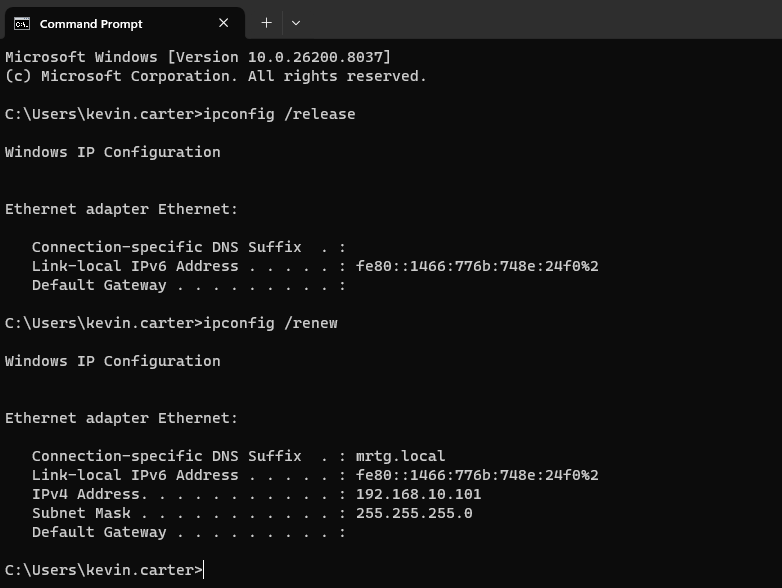

The client successfully received a DHCP lease from the MRTG scope.

---

### 21. DHCP-Assigned Client Configuration Confirmed

`ipconfig /all` was run again on `CLIENT01`.

Validated values included:

| Setting | Value |
|---|---|
| DHCP Enabled | `Yes` |
| IPv4 Address | `192.168.10.101` |
| Subnet Mask | `255.255.255.0` |
| DNS Server | `192.168.10.10` |
| Connection-specific DNS Suffix | `mrtg.local` |


This confirmed the client was receiving network configuration dynamically.

---

### 22. DHCP Address Lease Verified in Console

The DHCP console showed an active lease for:

| Client | Address |
|---|---|
| `CLIENT01.mrtg.local` | `192.168.10.101` |

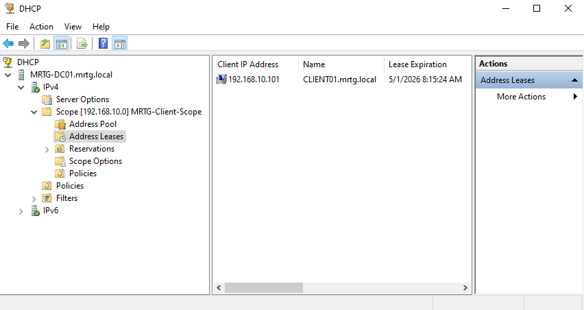

This provided server-side proof that the lease was issued and tracked successfully.

---

### 23. Post-DHCP Client Connectivity Validated

After DHCP assignment, client connectivity to the domain controller was tested.

Command used:

```powershell
ping MRTG-DC01
```


The ping succeeded, confirming basic domain infrastructure connectivity remained intact.

---

### 24. Post-DHCP Internal DNS Resolution Validated

Internal DNS resolution was tested from the DHCP-configured client.

Command used:

```powershell
nslookup mrtg.local
```

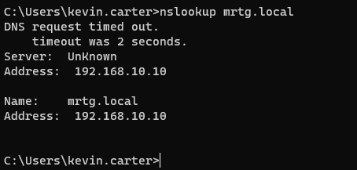

The forward lookup resolved `mrtg.local` to `192.168.10.10`.

The screenshot showed `Server: Unknown` and an initial timeout, which was acceptable in this lab because forward lookup still succeeded. That behavior is consistent with missing reverse lookup information for the DNS server address.

---

### 25. Domain Controller Discovery Validated

Domain controller discovery was tested from the DHCP-configured client.

Command used:

```powershell
nltest /dsgetdc:mrtg.local
```


This confirmed that the client could locate a domain controller after moving to DHCP.

---

### 26. Domain User Session Confirmed

The current logged-in user context was confirmed after the DHCP transition.

Command used:

```powershell
whoami
```

Result:

`mrtg\kevin.carter`


This confirmed that the client remained operating in the MRTG domain context after switching to DHCP.

---

## Security Perspective

This lab demonstrates that identity infrastructure depends on reliable supporting network services.

In Active Directory environments, poor DNS or inconsistent client network settings can break authentication, Group Policy processing, domain controller discovery, and user productivity.

From a security and operations perspective, this lab supports:

- Centralized network configuration
- Approved DHCP infrastructure through AD authorization
- Consistent DNS distribution to domain clients
- Reduced workstation configuration drift
- Improved client-to-domain reliability
- Better lease visibility for administrators
- Stronger identity-supporting infrastructure governance

---

## Risk Addressed

Without centralized DHCP and correct DNS distribution, client systems may use inconsistent or incorrect network settings.

This lab reduces the risk of:

- Manual IP configuration errors
- Duplicate IP address assignment
- Incorrect DNS server configuration
- Domain controller discovery failures
- Group Policy processing issues
- Authentication problems caused by poor name resolution
- Weak visibility into client address assignment

---

## Control Mapping

| Control Area | How This Lab Supports It |
|---|---|
| Network configuration management | Centralizes client IPv4 assignment through DHCP |
| Identity infrastructure support | Provides DNS settings required for domain service discovery |
| Active Directory governance | Authorizes DHCP server in AD before lease issuance |
| Operational consistency | Standardizes client network configuration |
| Lease visibility | Tracks active client address assignment in DHCP console |
| Change control readiness | Captures pre-change baseline and post-change validation |
| Domain reliability | Validates domain connectivity after DHCP assignment |

---

## Validation

The following validation checks were completed:

| Validation Item | Result |
|---|---|
| Pre-lab checkpoint created | Passed |
| Domain controller baseline documented | Passed |
| Client baseline documented | Passed |
| Baseline ping and DNS tests completed | Passed |
| DHCP Server role installed | Passed |
| DHCP post-install configuration completed | Passed |
| DHCP server authorized in Active Directory | Passed |
| DHCP console showed server visibility | Passed |
| IPv4 scope created | Passed |
| DHCP address range configured | Passed |
| Exclusion range configured | Passed |
| DNS scope option configured | Passed |
| Scope activated | Passed |
| Client adapter changed to automatic addressing | Passed |
| Client lease released and renewed | Passed |
| Client received DHCP address `192.168.10.101` | Passed |
| DHCP lease visible in server console | Passed |
| Client pinged domain controller after DHCP | Passed |
| Client resolved `mrtg.local` after DHCP | Passed |
| Client discovered domain controller with `nltest` | Passed |
| Domain user context confirmed with `whoami` | Passed |

---

## Evidence Collected

The following evidence was collected during the lab:

| Evidence | File |
|---|---|
| Pre-DHCP checkpoint | `images/Lab-11-01-Pre-DHCP-Checkpoint.png` |
| DC ipconfig baseline | `images/Lab-11-02-DC-ipconfig-all-Baseline.png` |
| Server Manager AD/DNS baseline | `images/Lab-11-03-Server-Manager-AD-DNS-Baseline.png` |
| Client ipconfig baseline | `images/Lab-11-04-Client-ipconfig-all-Baseline.png` |
| Client ping and nslookup baseline | `images/Lab-11-05-Client-Ping-and-NSLookup-Baseline.png` |
| DHCP role selected | `images/Lab-11-06-Add-Roles-Wizard-DHCP-Selected.png` |
| DHCP installation success | `images/Lab-11-07-DHCP-Installation-Success.png` |
| DHCP post-install configuration | `images/Lab-11-08-DHCP-Post-Install-Configuration.png` |
| DHCP configuration credentials | `images/Lab-11-09-DHCP-Configuration-Credentials.png` |
| DHCP authorization success | `images/Lab-11-10-DHCP-Authorization-Success.png` |
| DHCP console server visible | `images/Lab-11-11-DHCP-Console-Server-Visible.png` |
| New scope name | `images/Lab-11-12-New-Scope-Wizard-Name.png` |
| New scope IP range | `images/Lab-11-13-New-Scope-IP-Range.png` |
| New scope exclusions | `images/Lab-11-14-New-Scope-Exclusions.png` |
| New scope gateway option | `images/Lab-11-15-New-Scope-Gateway-Option.png` |
| New scope DNS option | `images/Lab-11-16-New-Scope-DNS-Option.png` |
| New scope activation summary | `images/Lab-11-17-New-Scope-Activation-Summary.png` |
| DHCP IPv4 scope active | `images/Lab-11-18-DHCP-IPv4-Scope-Active.png` |
| Client IPv4 set to automatic | `images/Lab-11-19-Client-IPv4-Set-to-Automatic.png` |
| Client DHCP lease renew | `images/Lab-11-20-Client-ipconfig-Renew-DHCP-Lease.png` |
| Client DHCP assigned config | `images/Lab-11-21-Client-ipconfig-all-DHCP-Assigned.png` |
| DHCP address lease visible | `images/Lab-11-22-DHCP-Address-Lease-Visible.png` |
| Client ping DC after DHCP | `images/Lab-11-23-Client-Ping-DC-After-DHCP.png` |
| Client nslookup after DHCP | `images/Lab-11-24-Client-NSLookup-Domain-After-DHCP.png` |
| Client logon server after DHCP | `images/Lab-11-25-Client-LogonServer-After-DHCP.png` |
| Client domain user session after DHCP | `images/Lab-11-26-Client-Domain-User-Session-After-DHCP.png` |

---

## What I Would Improve in Production

In a production environment, I would improve this process by:

- Hosting DHCP on a dedicated infrastructure server instead of a domain controller
- Configuring DHCP failover for resilience
- Creating DHCP reservations for infrastructure systems
- Defining standard scope naming conventions
- Documenting IP address management ownership
- Using IPAM for larger environments
- Configuring DHCP audit logging review
- Using DHCP policies where appropriate
- Creating alerting for unauthorized DHCP behavior
- Adding DHCP relay configuration for routed networks
- Defining gateway options for routed subnets
- Implementing lease monitoring through centralized logging or SIEM

---

## Lessons Learned

This lab reinforced that identity infrastructure depends on more than Active Directory alone.

Domain clients need reliable IP addressing and correct DNS settings to locate domain controllers, authenticate, and operate correctly.

The biggest takeaway is that DNS and DHCP are identity-supporting services. If client network configuration is wrong, IAM controls may fail before authentication even happens.

DHCP centralizes client configuration and reduces workstation drift, but it must be authorized, scoped, and validated carefully.

---

## Outcome

Lab 11 successfully deployed DHCP services in the MRTG Active Directory environment.

The lab confirmed:

- A pre-DHCP checkpoint was created
- Server and client network baselines were documented
- DHCP Server role was installed
- DHCP post-installation configuration was completed
- DHCP was authorized in Active Directory
- An IPv4 scope was created and activated
- DNS scope options were configured
- `CLIENT01` transitioned from static addressing to DHCP
- `CLIENT01` received `192.168.10.101`
- The lease was visible in the DHCP console
- The client could still reach the domain controller
- The client could resolve `mrtg.local`
- The client could discover the domain controller
- The client remained in a domain user session

The environment now supports centrally managed client IPv4 assignment and stronger identity-supporting infrastructure.

---

## Next Lab

[Lab 12 — Additional Domain Controller and AD Replication](../Lab-12-Additional-Domain-Controller-and-AD-Replication/)

Lab 12 will build on the identity-supporting network services foundation by deploying an additional domain controller and validating Active Directory replication for improved directory resilience.
