# Lab 11 — DHCP Services for Enterprise Identity Infrastructure


---

## Objective

The objective of this lab is to deploy DHCP services in the `mrtg.local` Active Directory environment.

This lab centralizes IPv4 address assignment for client systems and validates that domain-connected workstations can receive DHCP configuration while maintaining communication with internal Active Directory and DNS services.

The focus is on identity-supporting network infrastructure, DHCP authorization, scope configuration, DNS option distribution, client lease validation, and domain service discovery.

---

## Business Problem

Monroe Redstone Technology Group needs centrally managed IP address assignment for domain-connected systems.

Static-only workstation addressing does not scale well and increases the risk of configuration drift, duplicate addressing, DNS issues, and inconsistent client settings.

This lab addresses the need to:

- Deploy DHCP as a managed infrastructure service
- Authorize DHCP in Active Directory
- Create a controlled IPv4 scope
- Distribute internal DNS settings to domain clients
- Activate DHCP scope services
- Validate client DHCP lease assignment
- Confirm client-to-domain communication after DHCP assignment
- Support reliable identity infrastructure through standardized network configuration

---

## Lab Summary

In this lab, I deployed the DHCP Server role on `MRTG-DC01`.

I documented the pre-DHCP network baseline for the domain controller and client workstation, installed and authorized DHCP, created an IPv4 scope, configured an address pool and exclusion range, reviewed the gateway option, and configured DNS scope options for `mrtg.local`.

After the scope was activated, I changed the client workstation to obtain IP and DNS settings automatically, renewed the DHCP lease, confirmed the assigned DHCP address, validated the lease in the DHCP console, and confirmed domain communication using ping, DNS lookup, domain controller discovery, and the active domain user session.

This lab proves that DHCP is not just a network service. It supports identity operations by ensuring domain clients receive the correct IP and DNS configuration needed to locate and communicate with Active Directory services.

---

## Environment

| Component | Details |
|---|---|
| Domain | `mrtg.local` |
| Domain Controller / DNS / DHCP Server | `MRTG-DC01` |
| Client Workstation | `CLIENT01` |
| Platform | Hyper-V |
| Operating System | Windows Server 2022 |
| Directory Service | Active Directory Domain Services |
| Network Service | DHCP Server |
| DNS Server | `192.168.10.10` |
| DHCP Scope | `MRTG-Client-Scope` |
| Lab Organization | Monroe Redstone Technology Group |

---

## Scope

### Included

- Pre-lab Hyper-V checkpoint
- Domain controller network baseline documentation
- Client workstation network baseline documentation
- Baseline connectivity and DNS validation
- DHCP Server role installation
- DHCP post-installation configuration
- DHCP authorization in Active Directory
- IPv4 scope creation
- DHCP address range configuration
- Exclusion range configuration
- Gateway option review
- DNS scope option configuration
- DHCP scope activation
- Client automatic IPv4 configuration
- DHCP lease release and renewal
- Client DHCP lease validation
- DHCP console lease validation
- Post-DHCP domain connectivity validation
- Domain controller discovery validation
- Domain user session confirmation

### Not Included

- DHCP reservations
- DHCP failover
- Split-scope DHCP design
- DHCP relay configuration
- IPv6 DHCP configuration
- Multi-site DHCP deployment
- PXE or imaging integration
- Advanced DHCP policies
- Routed subnet gateway distribution
- Centralized DHCP logging
- DHCP SIEM integration

---

## Baseline Network State

| System | Setting | Value |
|---|---|---|
| `MRTG-DC01` | IPv4 Address | `192.168.10.10` |
| `CLIENT01` | Baseline IPv4 Address | `192.168.10.20` |
| Network | Subnet Mask | `255.255.255.0` |
| DNS | DNS Server | `192.168.10.10` |
| Domain | DNS Suffix | `mrtg.local` |

---

## DHCP Scope Configuration

| Setting | Value |
|---|---|
| Scope Name | `MRTG-Client-Scope` |
| Network | `192.168.10.0/24` |
| Start IP Address | `192.168.10.100` |
| End IP Address | `192.168.10.200` |
| Exclusion Range | `192.168.10.150 - 192.168.10.160` |
| DNS Domain Name | `mrtg.local` |
| DNS Server Distributed by DHCP | `192.168.10.10` |
| Default Gateway | Not configured for this isolated single-subnet lab |
| Scope Status | Activated |

---

## Post-DHCP Client Lease Result

| Client | DHCP Assigned Address | DHCP Server | DNS Server | Domain Suffix |
|---|---|---|---|---|
| `CLIENT01` | `192.168.10.101` | `192.168.10.10` | `192.168.10.10` | `mrtg.local` |

---

## Architecture

This lab uses `MRTG-DC01` as the domain controller, DNS server, and DHCP server for the isolated MRTG lab subnet.

```text
mrtg.local
├── MRTG-DC01
│   ├── Active Directory Domain Services
│   ├── DNS
│   └── DHCP Server
│
└── CLIENT01
    └── Domain client receiving DHCP configuration
```

DHCP scope design:

```text
Network:          192.168.10.0/24
DHCP Range:       192.168.10.100 - 192.168.10.200
Excluded Range:   192.168.10.150 - 192.168.10.160
DNS Server:       192.168.10.10
DNS Domain:       mrtg.local
Client Lease:     192.168.10.101
```

This design supports:

- Centralized IP address management
- Active Directory-authorized DHCP service
- Consistent DNS distribution
- Reduced workstation configuration drift
- Reliable client-to-domain communication
- Better identity infrastructure stability

---

## Identity Infrastructure Relevance

DHCP is not only a network convenience service in an Active Directory environment.

Domain-joined systems need correct IP and DNS configuration to locate domain controllers, authenticate, process Group Policy, and resolve internal domain names.

This lab supports IAM operations by ensuring client systems receive the correct network settings required for identity services.

| Dependency | Why It Matters |
|---|---|
| IP Address | Allows the client to communicate on the domain subnet |
| DNS Server | Allows the client to locate domain services |
| DNS Suffix | Supports internal name resolution for `mrtg.local` |
| DHCP Authorization | Ensures only approved DHCP servers issue leases |
| Scope Options | Standardizes network settings for domain clients |
| Lease Visibility | Gives administrators operational visibility into client addressing |
| Domain Controller Discovery | Confirms the client can locate Active Directory services |

---

## Implementation and Validation

### 1. Pre-Lab Checkpoint Created

A Hyper-V checkpoint was created before making DHCP changes.

This preserved the clean post-Lab-10 environment.

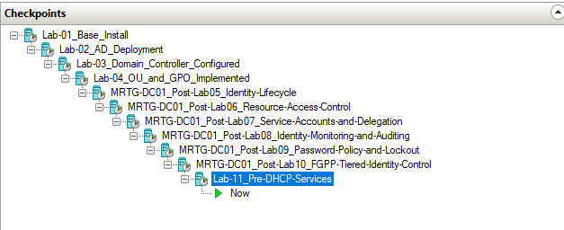

---

### 2. Domain Controller Network Baseline Documented

`ipconfig /all` was run on `MRTG-DC01`.

This confirmed that the domain controller used the expected static IPv4 address.

Validated server address:

```text
192.168.10.10
```


---

### 3. Existing Identity Infrastructure Baseline Reviewed

Server Manager was reviewed to confirm that Active Directory Domain Services and DNS were already installed before adding DHCP.

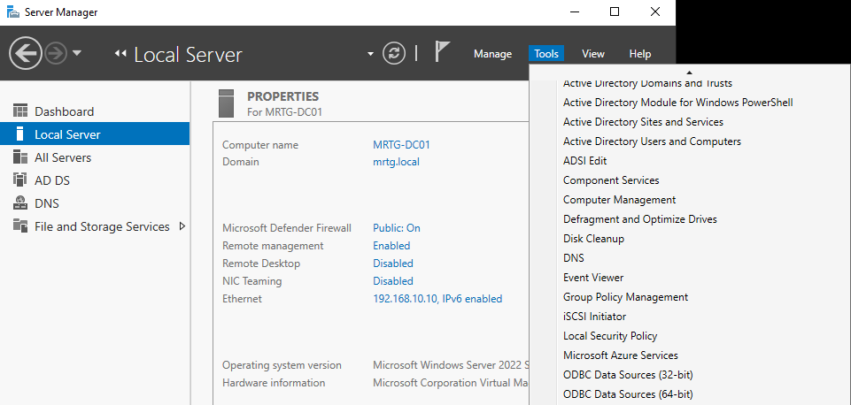

This established the pre-change infrastructure baseline.

---

### 4. Client Network Baseline Documented

`ipconfig /all` was run on `CLIENT01`.

This confirmed that the client was still statically configured before DHCP deployment.

Baseline result:

```text
DHCP Enabled: No
IPv4 Address: 192.168.10.20
DNS Server: 192.168.10.10
```

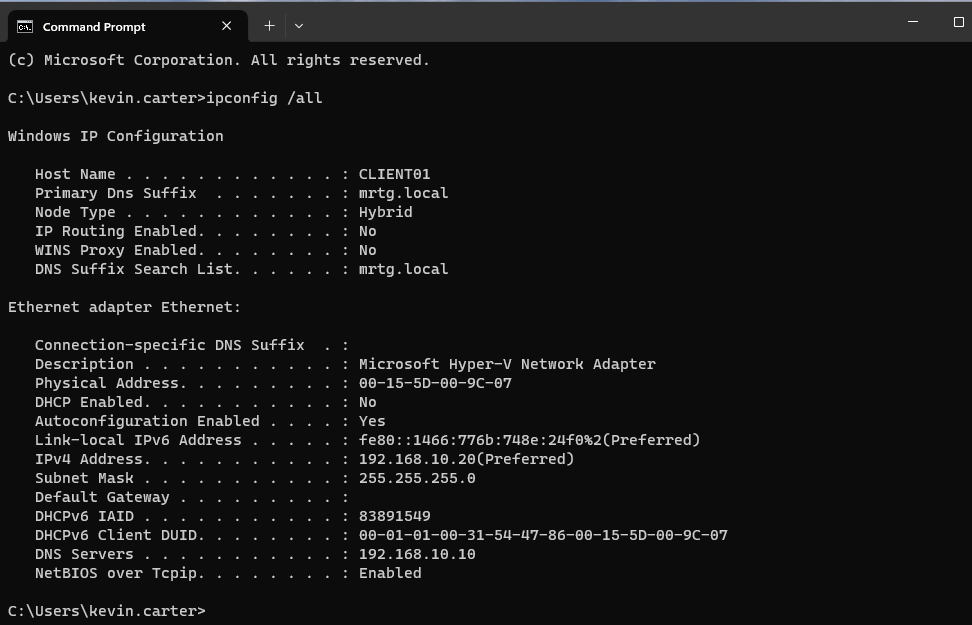

---

### 5. Baseline Client Connectivity and DNS Resolution Validated

Client communication with the domain controller and internal DNS was tested before DHCP was introduced.

Commands used:

```cmd
ping MRTG-DC01
nslookup mrtg.local
```


This confirmed the client could reach domain infrastructure before DHCP changes.

---

### 6. DHCP Server Role Installed

The DHCP Server role was selected in the Add Roles and Features Wizard on `MRTG-DC01`.

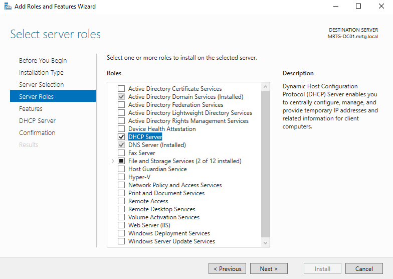

This added the server role required to centrally manage IPv4 address assignment.

---

### 7. DHCP Role Installation Confirmed

The DHCP Server role installation completed successfully.

The installation results showed that post-installation configuration was still required.

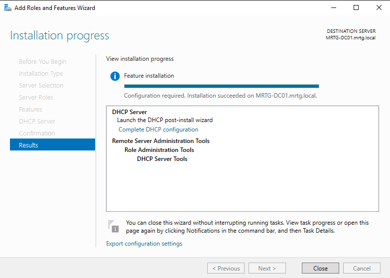

---

### 8. DHCP Post-Installation Configuration Opened

The Server Manager notification flag was used to open the DHCP post-installation configuration task.


This step is required because a DHCP server must be authorized before it should issue addresses in an Active Directory environment.

---

### 9. DHCP Authorization Configured with Domain Credentials

The DHCP Post-Install Configuration Wizard was completed using domain administrative credentials.

Account used:

```text
MRTG\Administrator
```


This authorized the DHCP server in Active Directory.

---

### 10. DHCP Authorization Confirmed

The post-installation summary confirmed that DHCP authorization completed successfully.

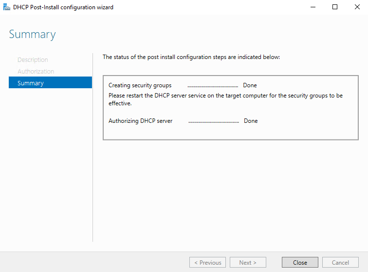

This validated that the DHCP server was approved to issue leases in the domain.

---

### 11. DHCP Console Server Visibility Confirmed

The DHCP Management Console was opened.

`mrtg-dc01.mrtg.local` appeared in the console with IPv4 and IPv6 containers visible.


---

### 12. New IPv4 Scope Named

A new IPv4 scope was created and named:

```text
MRTG-Client-Scope
```

Scope description:

```text
DHCP scope for MRTG domain clients on 192.168.10.0/24
```

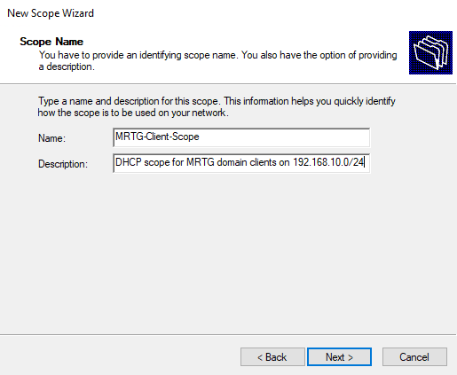

The scope was created for domain client systems on the `192.168.10.0/24` network.

---

### 13. DHCP Address Pool Defined

The DHCP address pool was configured.

| Setting | Value |
|---|---|
| Start IP Address | `192.168.10.100` |
| End IP Address | `192.168.10.200` |
| Subnet Mask | `255.255.255.0` |
| Prefix Length | `/24` |


---

### 14. Exclusion Range Added

An exclusion range was configured so selected addresses would not be distributed dynamically.

Exclusion range:

```text
192.168.10.150 - 192.168.10.160
```


This protects selected addresses from being automatically leased to clients.

---

### 15. Default Gateway Option Reviewed

The Router / Default Gateway option was left unconfigured.


This was intentional because the lab used an isolated single-subnet internal network and did not require routed outbound connectivity.

---

### 16. DNS Scope Options Configured

The DHCP scope was configured to distribute internal DNS settings.

| Option | Value |
|---|---|
| Parent Domain | `mrtg.local` |
| DNS Server | `192.168.10.10` |


These settings allow clients to locate internal domain services through the correct DNS infrastructure.

---

### 17. DHCP Scope Activation Selected

The new DHCP scope was configured to activate immediately after creation.

Selected option:

```text
Yes, I want to activate this scope now
```


This allowed clients to obtain DHCP leases from the `MRTG-Client-Scope` after the scope configuration was completed.

---

### 18. Active IPv4 Scope Confirmed

The DHCP console was reviewed after scope creation.

The active IPv4 scope appeared under:

```text
IPv4
└── Scope [192.168.10.0] MRTG-Client-Scope
```


This confirmed that the DHCP scope was created and visible in the DHCP console.

---

### 19. Client IPv4 Configuration Set to Automatic

The client workstation IPv4 settings were changed to obtain addressing information automatically.

Configured options:

```text
Obtain an IP address automatically
Obtain DNS server address automatically
```

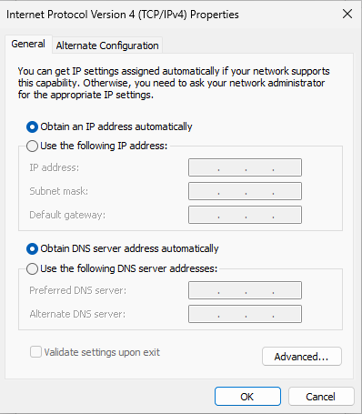

This allowed `CLIENT01` to request IP and DNS configuration from DHCP.

---

### 20. Client DHCP Lease Released and Renewed

On `CLIENT01`, the DHCP lease was released and renewed.

Commands used:

```cmd
ipconfig /release
ipconfig /renew
```

The client received:

```text
IPv4 Address: 192.168.10.101
Subnet Mask: 255.255.255.0
```


This confirmed the client successfully received a DHCP-assigned address.

---

### 21. Client DHCP Assignment Validated with ipconfig

`ipconfig /all` was run on `CLIENT01` after the lease renewal.

Validated settings included:

```text
DHCP Enabled: Yes
Autoconfiguration Enabled: Yes
IPv4 Address: 192.168.10.101
DHCP Server: 192.168.10.10
DNS Servers: 192.168.10.10
DNS Suffix Search List: mrtg.local
```

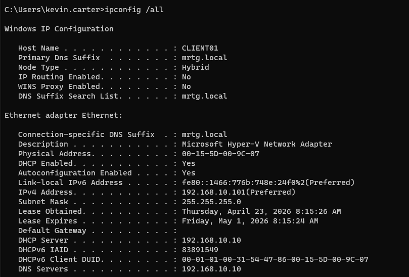

This confirmed that the client received both DHCP and DNS configuration from the DHCP server.

---

### 22. DHCP Address Lease Verified in DHCP Console

The DHCP console was used to review active address leases.

The lease showed:

```text
Client IP Address: 192.168.10.101
Name: CLIENT01.mrtg.local
```


This confirmed server-side lease visibility for the DHCP-assigned client address.

---

### 23. Post-DHCP Client Connectivity to Domain Controller Validated

After DHCP assignment, the client successfully pinged the domain controller.

Command used:

```cmd
ping MRTG-DC01
```

Validated result:

```text
Reply from 192.168.10.10
```

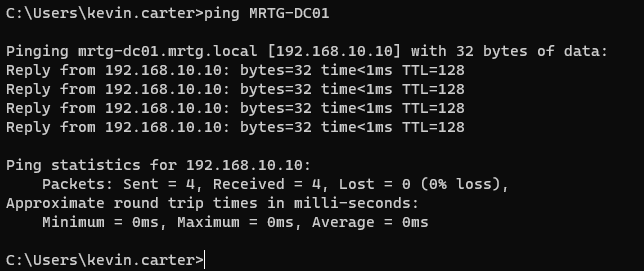

This confirmed that DHCP assignment did not break client communication with the domain controller.

---

### 24. Post-DHCP DNS Resolution Validated

The client tested DNS resolution for the internal domain.

Command used:

```cmd
nslookup mrtg.local
```

Validated result:

```text
Name: mrtg.local
Address: 192.168.10.10
```


The `Server: Unknown` message occurred because reverse lookup was not configured, but the forward lookup still resolved `mrtg.local` to `192.168.10.10`.

This confirmed that internal DNS resolution was still working after DHCP assignment.

---

### 25. Domain Controller Discovery Validated

The client validated domain controller discovery for `mrtg.local`.

Command used:

```cmd
nltest /dsgetdc:mrtg.local
```

Validated result:

```text
DC: \\MRTG-DC01.mrtg.local
Address: \\192.168.10.10
The command completed successfully
```

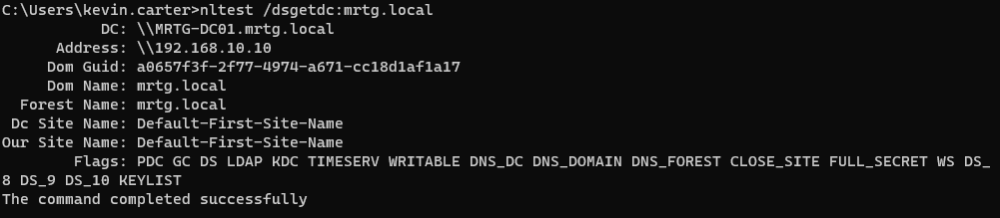

This confirmed that the DHCP-configured client could still locate the Active Directory domain controller.

---

### 26. Domain User Session Confirmed

The active user session was validated on the client workstation.

Command used:

```cmd
whoami
```

Validated result:

```text
mrtg\kevin.carter
```

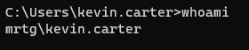

This confirmed that the client remained in a valid domain user context after DHCP configuration.

---

## Security Perspective

This lab demonstrates that identity infrastructure depends on reliable supporting network services.

In Active Directory environments, poor DNS or inconsistent client network settings can break authentication, Group Policy processing, domain controller discovery, and user productivity.

From a security and operations perspective, this lab supports:

- Centralized network configuration
- Approved DHCP infrastructure through AD authorization
- Consistent DNS distribution to domain clients
- Reduced workstation configuration drift
- Improved client-to-domain reliability
- DHCP lease visibility
- Stronger identity-supporting infrastructure governance

---

## Risk Addressed

Without centralized DHCP and correct DNS distribution, client systems may use inconsistent or incorrect network settings.

This lab reduces the risk of:

- Manual IP configuration errors
- Duplicate IP address assignment
- Incorrect DNS server configuration
- Domain controller discovery failures
- Group Policy processing issues
- Authentication problems caused by poor name resolution
- Weak visibility into client address configuration
- Unauthorized DHCP server behavior
- Client configuration drift

---

## Control Mapping

| Control Area | How This Lab Supports It |
|---|---|
| Network configuration management | Centralizes client IPv4 assignment through DHCP |
| Identity infrastructure support | Provides DNS settings required for domain service discovery |
| Active Directory governance | Authorizes DHCP server in AD before lease issuance |
| Operational consistency | Standardizes client network configuration |
| Scope management | Defines controlled DHCP address ranges and exclusions |
| Lease visibility | Confirms DHCP lease assignment in the DHCP console |
| Change control readiness | Captures pre-change and post-change validation evidence |
| Domain reliability | Validates DNS, ping, domain controller discovery, and domain user context |

---

## Validation

The following validation checks were completed:

| Validation Item | Result |
|---|---|
| Pre-lab checkpoint created | Passed |
| Domain controller baseline documented | Passed |
| Client baseline documented | Passed |
| Baseline ping and DNS tests completed | Passed |
| DHCP Server role installed | Passed |
| DHCP post-install configuration opened | Passed |
| DHCP server authorized in Active Directory | Passed |
| DHCP console showed server visibility | Passed |
| IPv4 scope created | Passed |
| DHCP address range configured | Passed |
| Exclusion range configured | Passed |
| Gateway option reviewed | Passed |
| DNS scope option configured | Passed |
| DHCP scope activated | Passed |
| Active IPv4 scope visible in DHCP console | Passed |
| Client configured for automatic IPv4 and DNS assignment | Passed |
| Client DHCP lease renewed successfully | Passed |
| Client received `192.168.10.101` from DHCP | Passed |
| DHCP lease visible in DHCP console | Passed |
| Client pinged `MRTG-DC01` successfully | Passed |
| Client resolved `mrtg.local` to `192.168.10.10` | Passed |
| Client discovered domain controller with `nltest` | Passed |
| Domain user session confirmed with `whoami` | Passed |

---

## Evidence Collected

The following evidence was collected during the lab:

| Evidence | File |
|---|---|
| Pre-DHCP services checkpoint | `screenshots/lab-11-01-pre-dhcp-services-checkpoint.png` |
| Domain controller ipconfig baseline | `screenshots/lab-11-02-domain-controller-ipconfig-baseline.png` |
| Server Manager AD DNS baseline | `screenshots/lab-11-03-server-manager-ad-dns-baseline.png` |
| Client ipconfig baseline | `screenshots/lab-11-04-client-ipconfig-baseline.png` |
| Client ping and nslookup baseline | `screenshots/lab-11-05-client-ping-and-nslookup-baseline.png` |
| DHCP server role selected | `screenshots/lab-11-06-dhcp-server-role-selected.png` |
| DHCP installation success | `screenshots/lab-11-07-dhcp-installation-success.png` |
| DHCP post-install configuration required | `screenshots/lab-11-08-dhcp-post-install-configuration-required.png` |
| DHCP authorization credentials | `screenshots/lab-11-09-dhcp-authorization-credentials.png` |
| DHCP authorization success | `screenshots/lab-11-10-dhcp-authorization-success.png` |
| DHCP console server visible | `screenshots/lab-11-11-dhcp-console-server-visible.png` |
| DHCP scope name | `screenshots/lab-11-12-dhcp-scope-name.png` |
| DHCP scope IP range | `screenshots/lab-11-13-dhcp-scope-ip-range.png` |
| DHCP scope exclusions | `screenshots/lab-11-14-dhcp-scope-exclusions.png` |
| DHCP scope gateway option | `screenshots/lab-11-15-dhcp-scope-gateway-option.png` |
| DHCP scope DNS option | `screenshots/lab-11-16-dhcp-scope-dns-option.png` |
| DHCP scope activation | `screenshots/lab-11-17-dhcp-scope-activation.png` |
| DHCP IPv4 scope active | `screenshots/lab-11-18-dhcp-ipv4-scope-active.png` |
| Client IPv4 automatic | `screenshots/lab-11-19-client-ipv4-automatic.png` |
| Client DHCP lease renewed | `screenshots/lab-11-20-client-dhcp-lease-renewed.png` |
| Client DHCP assigned ipconfig | `screenshots/lab-11-21-client-dhcp-assigned-ipconfig.png` |
| DHCP address lease visible | `screenshots/lab-11-22-dhcp-address-lease-visible.png` |
| Client ping DC after DHCP | `screenshots/lab-11-23-client-ping-dc-after-dhcp.png` |
| Client nslookup domain after DHCP | `screenshots/lab-11-24-client-nslookup-domain-after-dhcp.png` |
| Client domain controller discovery | `screenshots/lab-11-25-client-domain-controller-discovery.png` |
| Client domain user session | `screenshots/lab-11-26-client-domain-user-session.png` |

---

## What I Would Improve in Production

In a production environment, I would improve this process by:

- Hosting DHCP on a dedicated infrastructure server instead of a domain controller
- Configuring DHCP failover for resilience
- Creating DHCP reservations for infrastructure systems
- Defining standard scope naming conventions
- Documenting IP address management ownership
- Using IPAM for larger environments
- Configuring DHCP audit logging review
- Using DHCP policies where appropriate
- Creating alerting for unauthorized DHCP behavior
- Adding DHCP relay configuration for routed networks
- Defining gateway options for routed subnets
- Implementing lease monitoring through centralized logging or SIEM
- Creating reverse lookup zones for cleaner DNS lookup output

---

## Lessons Learned

This lab reinforced that identity infrastructure depends on more than Active Directory alone.

Domain clients need reliable IP addressing and correct DNS settings to locate domain controllers, authenticate, and operate correctly.

The biggest takeaway is that DNS and DHCP are identity-supporting services. If client network configuration is wrong, IAM controls may fail before authentication even happens.

DHCP centralizes client configuration and reduces workstation drift, but it must be authorized, scoped, activated, and validated carefully.

---

## Outcome

Lab 11 successfully deployed DHCP services in the MRTG Active Directory environment.

The lab confirmed:

- A pre-DHCP checkpoint was created
- Server and client network baselines were documented
- DHCP Server role was installed
- DHCP post-installation configuration was completed
- DHCP was authorized in Active Directory
- DHCP Management Console showed the authorized server
- An IPv4 scope was created
- DHCP address range was configured
- Exclusion range was configured
- Gateway option was reviewed
- DNS scope options were configured for `mrtg.local`
- The DHCP scope was activated
- `CLIENT01` was configured for automatic addressing
- `CLIENT01` received DHCP address `192.168.10.101`
- The DHCP lease was visible in the DHCP console
- Client connectivity to `MRTG-DC01` was validated
- Internal DNS resolution was validated
- Domain controller discovery was validated
- Domain user context was confirmed

The environment now supports centrally managed client IPv4 assignment and stronger identity-supporting infrastructure.

---

## Next Lab

[Lab 12 — Additional Domain Controller and AD Replication](../Lab-12-Additional-Domain-Controller-and-AD-Replication/)

Lab 12 will build on the identity-supporting network services foundation by deploying an additional domain controller and validating Active Directory replication for improved directory resilience.
