# Lab 12 — Additional Domain Controller and AD Replication


---

## Objective

The objective of this lab is to add a second domain controller to the `mrtg.local` Active Directory domain.

This lab improves directory resilience by promoting `MRTG-DC02` as an additional domain controller, enabling DNS and Global Catalog services, validating replication, and proving that identity objects replicate between both domain controllers.

The focus is on Active Directory redundancy, replication health, DNS dependency, and operational rollback readiness.

---

## Business Problem

Monroe Redstone Technology Group needs to reduce dependency on a single domain controller.

A single-domain-controller environment creates an availability risk. If the only domain controller fails, authentication, DNS resolution, Group Policy processing, and directory-backed access can be disrupted.

This lab addresses the need to:

- Add a second domain controller
- Improve identity infrastructure resilience
- Enable DNS and Global Catalog services on the second domain controller
- Validate domain controller registration
- Validate Active Directory replication health
- Prove two-way object replication
- Configure DNS redundancy between domain controllers
- Preserve final validated states with Hyper-V checkpoints

---

## Lab Summary

In this lab, I prepared `MRTG-DC02`, joined it to the existing `mrtg.local` domain, installed Active Directory Domain Services, and promoted it as an additional domain controller.

After promotion, I validated domain controller registration in Active Directory Users and Computers, Active Directory Sites and Services, DNS Manager, PowerShell, `repadmin`, and `dcdiag`.

I then proved two-way object replication by creating an OU on `MRTG-DC01` and confirming it appeared on `MRTG-DC02`, then creating a user on `MRTG-DC02` and confirming it appeared on `MRTG-DC01`.

Finally, I configured DNS redundancy and created final Hyper-V checkpoints for both domain controllers.

---

## Environment

| Component | Details |
|---|---|
| Domain | `mrtg.local` |
| Primary Domain Controller | `MRTG-DC01` |
| Additional Domain Controller | `MRTG-DC02` |
| Client Workstation | `MRTG-CLIENT-01` |
| Hypervisor | Hyper-V |
| Network | `MRTG-Internal` |
| Operating System | Windows Server 2022 Standard Evaluation |
| Directory Service | Active Directory Domain Services |
| Supporting Services | DNS, Global Catalog |
| Lab Organization | Monroe Redstone Technology Group |

---

## Scope

### Included

- Second domain controller VM preparation
- Static IP and DNS configuration for `MRTG-DC02`
- Domain join for `MRTG-DC02`
- Pre-AD DS Hyper-V checkpoint
- AD DS role installation
- Additional domain controller promotion
- DNS and Global Catalog configuration
- Domain controller registration validation
- DNS record validation
- Replication validation with `repadmin`
- Replication health validation with `dcdiag`
- Two-way object replication testing
- DNS redundancy configuration
- Final replication validation
- Final Hyper-V checkpoints

### Not Included

- Multi-site Active Directory topology
- Site link cost tuning
- Read-only domain controller deployment
- DHCP failover
- FSMO role transfer
- Domain controller backup automation
- Disaster recovery testing
- Azure or hybrid identity replication

---

## IP Addressing

| System | IP Address | Role |
|---|---:|---|
| `MRTG-DC01` | `192.168.10.10` | Existing domain controller, DNS, Global Catalog |
| `MRTG-DC02` | `192.168.10.11` | Additional domain controller, DNS, Global Catalog |
| `MRTG-CLIENT-01` | `192.168.10.101` | Domain client |

---

## Final DNS Client Configuration

### MRTG-DC01

| Setting | Value |
|---|---|
| Preferred DNS | `192.168.10.10` |
| Alternate DNS | `192.168.10.11` |

### MRTG-DC02

| Setting | Value |
|---|---|
| Preferred DNS | `192.168.10.11` |
| Alternate DNS | `192.168.10.10` |

This configuration allows each domain controller to use itself for DNS while retaining the other domain controller as a secondary resolver.

---

## Architecture

Before this lab, the environment used one domain controller.

```text
mrtg.local
└── MRTG-DC01
    ├── Active Directory Domain Services
    ├── DNS
    └── Global Catalog
```

After this lab, the environment includes two domain controllers.

```text
mrtg.local
├── MRTG-DC01
│   ├── Active Directory Domain Services
│   ├── DNS
│   └── Global Catalog
│
└── MRTG-DC02
    ├── Active Directory Domain Services
    ├── DNS
    └── Global Catalog
```

This improves identity infrastructure resilience by reducing dependency on a single domain controller.

---

## Directory Resilience Model

This lab supports the following resilience model:

| Component | Purpose |
|---|---|
| Additional Domain Controller | Provides another authentication and directory services endpoint |
| DNS on DC02 | Provides additional name resolution capability |
| Global Catalog on DC02 | Supports directory searches and logon operations |
| AD Replication | Keeps identity data synchronized between domain controllers |
| DNS Redundancy | Allows each DC to use the other as a secondary resolver |
| Hyper-V Checkpoints | Preserve validated rollback points |

---

## Implementation and Validation

### 1. Second Domain Controller VM Prepared

`MRTG-DC02` was created in Hyper-V and connected to the same internal lab network as `MRTG-DC01`.

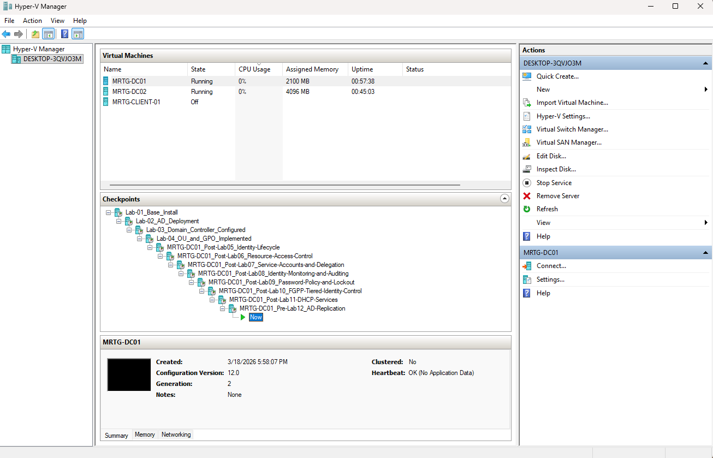

---

### 2. DC02 Renamed and IP Configured

`MRTG-DC02` was renamed and configured with the correct IP address.


---

### 3. DC02 Static IP and DNS Configured

`MRTG-DC02` was configured with a static IP address and pointed to `MRTG-DC01` for DNS before domain join.

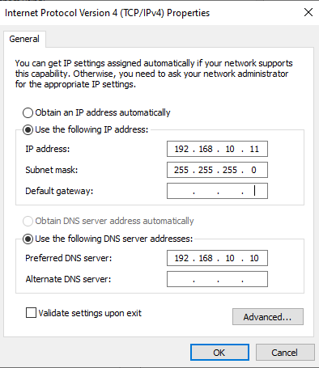

---

### 4. DC02 Connectivity to DC01 Validated

Initial connectivity validation confirmed that `MRTG-DC02` could reach `MRTG-DC01`, resolve the domain, and locate a domain controller.

Commands used:

```cmd
ping 192.168.10.10
ping MRTG-DC01
nslookup mrtg.local
nltest /dsgetdc:mrtg.local
```


---

### 5. DC02 Joined to the Domain

`MRTG-DC02` was joined to the existing `mrtg.local` domain.

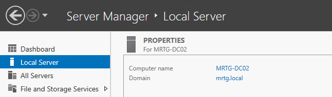

---

### 6. Pre-AD DS Checkpoint Created

Before installing Active Directory Domain Services, a Hyper-V checkpoint was created for rollback.

Checkpoint created:

`MRTG-DC02_Pre-ADDS-Install`

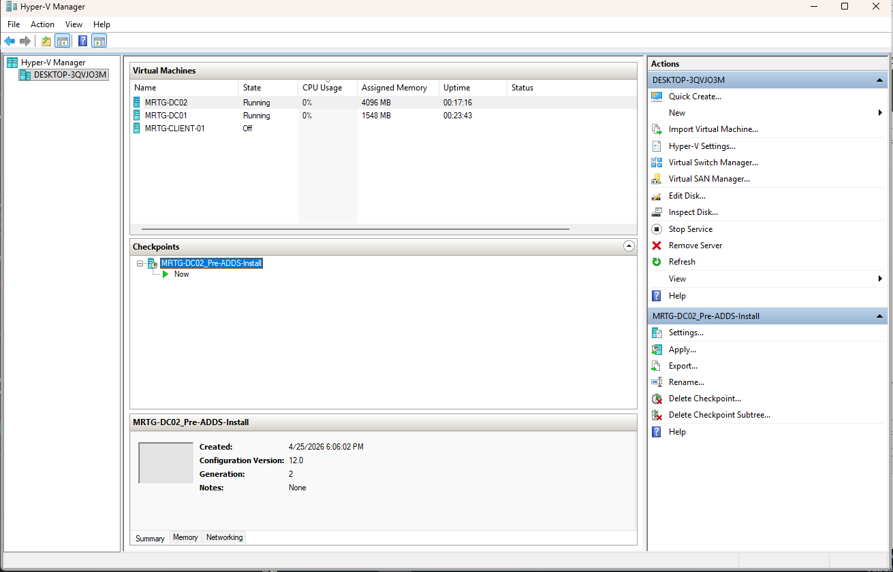

---

### 7. AD DS Role Selected on DC02

The Active Directory Domain Services role was selected on `MRTG-DC02`.

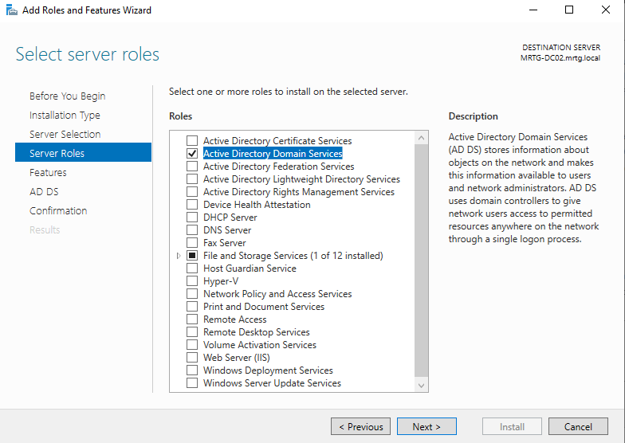

---

### 8. AD DS Role Installed on DC02

The AD DS role installed successfully.

Additional configuration was still required before the server could become a domain controller.


---

### 9. DC02 Promotion Started

`MRTG-DC02` was promoted using the option:

```text
Add a domain controller to an existing domain
```

Domain:

```text
mrtg.local
```


---

### 10. DNS and Global Catalog Selected

`MRTG-DC02` was configured as a DNS server and Global Catalog.


This allows the second domain controller to support name resolution and directory search operations.

---

### 11. Replication Source Selected

The replication source was set to the existing domain controller:

```text
MRTG-DC01.mrtg.local
```


---

### 12. Prerequisite Check Passed

The prerequisite check completed successfully before promotion.

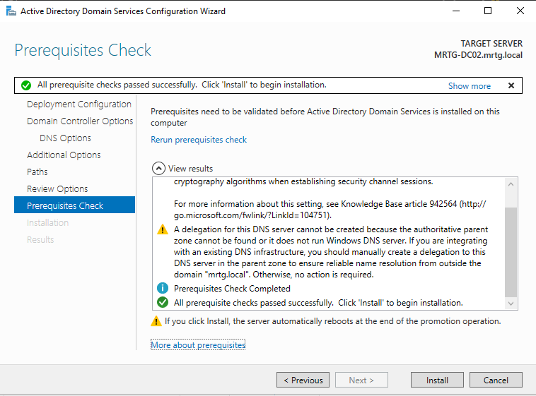

---

### 13. DC02 Promoted and Rebooted

After installation, `MRTG-DC02` rebooted and showed AD DS and DNS roles in Server Manager.


---

### 14. Domain Controllers Validated in ADUC

Active Directory Users and Computers confirmed that both domain controllers were present in the Domain Controllers OU.

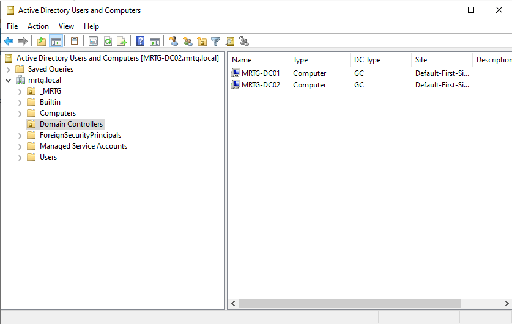

---

### 15. Domain Controllers Validated in Sites and Services

Active Directory Sites and Services confirmed that both domain controllers were registered under the default site.

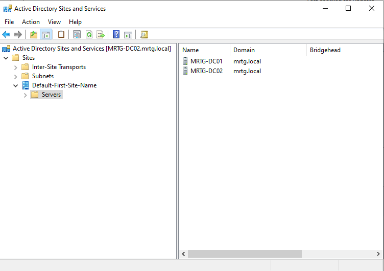

---

### 16. DNS Records Validated

DNS Manager confirmed DNS records for both domain controllers.


---

### 17. Domain Controllers Validated with PowerShell

PowerShell confirmed that both domain controllers were discoverable and configured as Global Catalog servers.

Command used:

```powershell
Get-ADDomainController -Filter * | Select-Object HostName, Site, IPv4Address, IsGlobalCatalog
```


---

### 18. Replication Summary Validated

Replication was validated using `repadmin`.

Command used:

```cmd
repadmin /replsummary
```

The output showed zero replication failures for both domain controllers.

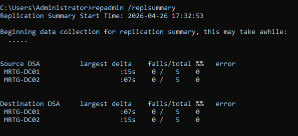

---

### 19. Detailed Replication Status Validated

Detailed replication status was validated using:

```cmd
repadmin /showrepl
```

The output showed successful inbound replication across the major naming contexts.

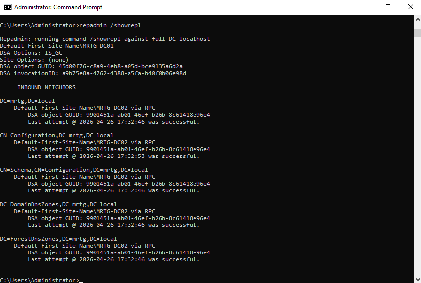

---

### 20. Replication Health Checked with DCDIAG

Replication-specific domain controller diagnostics were checked with:

```cmd
dcdiag /test:replications /q
```

No output was returned, which indicates no replication errors were detected by the replication-specific diagnostic test.

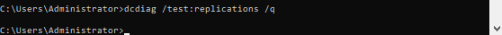

---

### 21. Test OU Created on DC01

To prove replication beyond command output, a test OU was created on `MRTG-DC01`.

Test OU:

```text
Lab12-Replication-Test
```

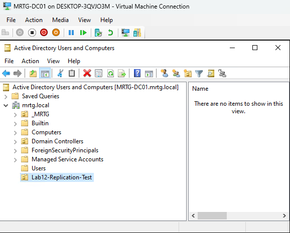

---

### 22. Test OU Replicated to DC02

The same OU appeared on `MRTG-DC02`, proving replication from `DC01` to `DC02`.

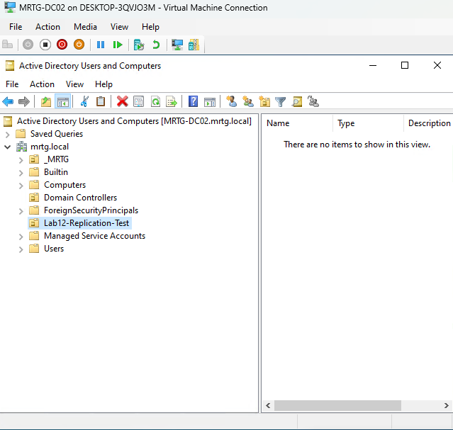

---

### 23. Test User Created on DC02

A test user was created on `MRTG-DC02`.

Test user:

```text
Replication Test
```


---

### 24. Test User Replicated to DC01

The test user appeared on `MRTG-DC01`, proving replication from `DC02` back to `DC01`.


This confirmed two-way Active Directory object replication between both domain controllers.

---

### 25. DC01 DNS Redundancy Configured

After `MRTG-DC02` was promoted and DNS was installed, DNS client settings were updated.

`MRTG-DC01` DNS settings:

```text
Preferred DNS: 192.168.10.10
Alternate DNS: 192.168.10.11
```


---

### 26. DC02 DNS Redundancy Configured

`MRTG-DC02` DNS settings:

```text
Preferred DNS: 192.168.10.11
Alternate DNS: 192.168.10.10
```

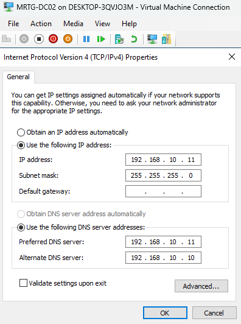

---

### 27. Final Replication Health Validated

Final replication validation was performed after updating DNS settings.

Commands used:

```cmd
repadmin /replsummary
dcdiag /test:replications /q
```

The replication summary showed zero failures, and the replication diagnostic test returned no errors.

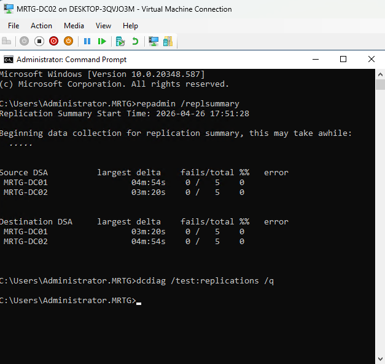

---

### 28. DC02 Final Checkpoint Created

A final checkpoint was created for `MRTG-DC02` after successful replication validation.

Checkpoint created:

```text
MRTG-DC02_Post-Lab12_AD-Replication-Validated
```


---

### 29. DC01 Final Checkpoint Created

A final checkpoint was created for `MRTG-DC01` after successful replication validation.

Checkpoint created:

```text
MRTG-DC01_Post-Lab12_AD-Replication-Validated
```

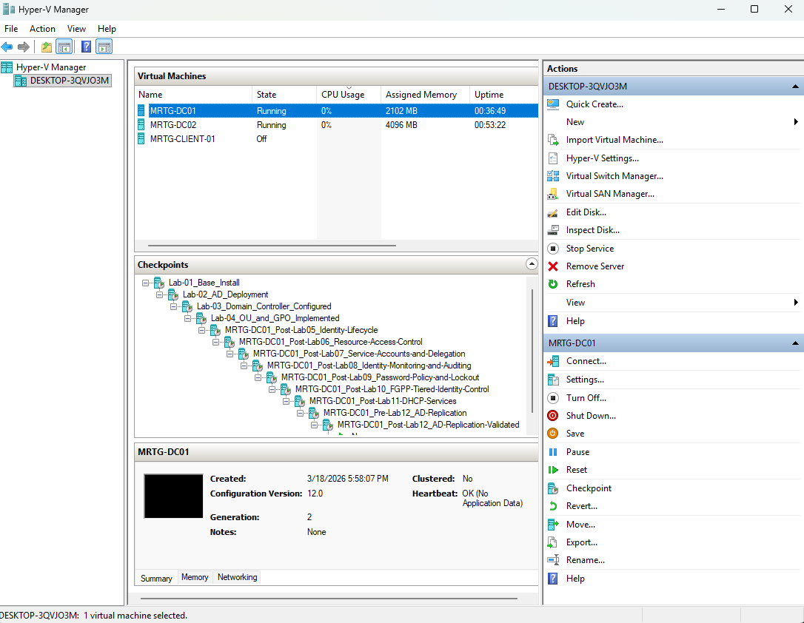

---

## Troubleshooting Note

During replication validation, the initial `repadmin /replsummary` output returned DNS lookup failures.

Error observed:

```text
8524 - The DSA operation is unable to proceed because of a DNS lookup failure.
```

The issue was resolved by validating AD DNS records, confirming domain controller GUID resolution under `_msdcs.mrtg.local`, forcing KCC recalculation, and re-running replication synchronization.

Commands used during troubleshooting:

```cmd
nslookup <DC-GUID>._msdcs.mrtg.local
nslookup -type=SRV _ldap._tcp.dc._msdcs.mrtg.local
repadmin /kcc
repadmin /syncall /AdeP
repadmin /replsummary
```

After correction, replication showed zero failures between `MRTG-DC01` and `MRTG-DC02`.

This reinforced the importance of DNS health in Active Directory replication.

---

## Security Perspective

Adding a second domain controller improves identity infrastructure resilience.

Active Directory is a core dependency for authentication, authorization, Group Policy, DNS, and access to domain resources.

From a security and IAM perspective, this lab supports:

- Directory service redundancy
- Improved authentication availability
- Global Catalog availability
- DNS redundancy
- Replication health validation
- Two-way identity object replication
- Operational rollback through checkpoints
- Resilient identity infrastructure

A single domain controller creates a major availability risk. If the only domain controller fails, users may lose access to authentication services, name resolution, policy processing, and directory-backed resources.

---

## Risk Addressed

Without a second domain controller, the environment depends entirely on one identity system.

This lab reduces the risk of:

- Single domain controller dependency
- Authentication service outage
- DNS service outage
- Group Policy processing disruption
- Directory-backed resource access disruption
- No replication partner for identity data
- Reduced operational resilience
- Weak rollback readiness after infrastructure changes

---

## Control Mapping

| Control Area | How This Lab Supports It |
|---|---|
| Directory resilience | Adds a second domain controller |
| Authentication availability | Provides another DC for domain services |
| DNS resilience | Configures DNS on both domain controllers |
| Global Catalog availability | Enables Global Catalog on `MRTG-DC02` |
| Replication validation | Uses `repadmin` and `dcdiag` |
| Identity data consistency | Proves OU and user replication both directions |
| Operational resilience | Creates checkpoints after validated configuration |
| Troubleshooting readiness | Documents DNS-related replication issue and fix |

---

## Validation

The following validation checks were completed:

| Validation Item | Result |
|---|---|
| `MRTG-DC02` VM prepared | Passed |
| `MRTG-DC02` static IP configured | Passed |
| `MRTG-DC02` DNS pointed to `MRTG-DC01` before promotion | Passed |
| Connectivity to `MRTG-DC01` validated | Passed |
| `MRTG-DC02` joined to `mrtg.local` | Passed |
| Pre-AD DS checkpoint created | Passed |
| AD DS role installed | Passed |
| `MRTG-DC02` promoted as additional domain controller | Passed |
| DNS role installed on `MRTG-DC02` | Passed |
| Global Catalog enabled on `MRTG-DC02` | Passed |
| Both DCs visible in ADUC | Passed |
| Both DCs visible in Sites and Services | Passed |
| DNS records present for both DCs | Passed |
| `Get-ADDomainController` showed both DCs | Passed |
| `repadmin /replsummary` showed zero failures | Passed |
| `repadmin /showrepl` showed successful replication | Passed |
| `dcdiag /test:replications /q` returned no errors | Passed |
| OU replicated from DC01 to DC02 | Passed |
| User replicated from DC02 to DC01 | Passed |
| DNS redundancy configured | Passed |
| Final replication validation passed | Passed |
| Final checkpoints created | Passed |

---

## Evidence Collected

The following evidence was collected during the lab:

| Evidence | File |
|---|---|
| Hyper-V showing DC01 and DC02 running | `images/01-hyperv-dc01-dc02-running.png` |
| DC02 renamed and IP configured | `images/02-dc02-server-renamed-and-ip-configured.png` |
| DC02 static IP and DNS configured | `images/03-dc02-static-ip-dns-configured.png` |
| DC02 connectivity to DC01 validated | `images/04-dc02-connectivity-to-dc01-validated.png` |
| DC02 domain membership confirmed | `images/05-dc02-domain-membership-confirmed.png` |
| DC02 pre-ADDS checkpoint created | `images/06-dc02-pre-adds-checkpoint-created.png` |
| AD DS role selected on DC02 | `images/07-adds-role-selected-on-dc02.png` |
| AD DS role installed on DC02 | `images/08-adds-role-installed-on-dc02.png` |
| Add domain controller to existing domain | `images/09-add-domain-controller-to-existing-domain.png` |
| DC02 DNS and Global Catalog selected | `images/10-dc02-dns-global-catalog-selected.png` |
| DC02 replication source DC01 | `images/11-dc02-replication-source-dc01.png` |
| DC02 prerequisite check passed | `images/12-dc02-prerequisite-check-passed.png` |
| DC02 promoted and rebooted | `images/13-dc02-promoted-and-rebooted.png` |
| Both domain controllers visible in ADUC | `images/14-both-domain-controllers-visible-in-aduc.png` |
| Both DCs visible in Sites and Services | `images/15-both-dcs-visible-in-sites-and-services.png` |
| DNS records for both domain controllers | `images/16-dns-records-for-both-domain-controllers.png` |
| Get-ADDomainController shows both DCs | `images/17-get-addomaincontroller-shows-both-dcs.png` |
| Repadmin replication summary successful | `images/18-repadmin-replsummary-successful.png` |
| Repadmin showrepl successful | `images/19-repadmin-showrepl-successful.png` |
| DCDIAG replication health check | `images/20-dcdiag-replication-health-check.png` |
| Test OU created on DC01 | `images/21-test-ou-created-on-dc01.png` |
| Test OU replicated to DC02 | `images/22-test-ou-replicated-to-dc02.png` |
| Test user created on DC02 | `images/23-test-user-created-on-dc02.png` |
| Test user replicated to DC01 | `images/24-test-user-replicated-to-dc01.png` |
| DC01 DNS redundancy configured | `images/25a-dc01-dns-redundancy-configured.png` |
| DC02 DNS redundancy configured | `images/25b-dc02-dns-redundancy-configured.png` |
| Final replication health validation | `images/26-final-replication-health-validation.png` |
| DC02 final Lab 12 checkpoint created | `images/27a-dc02-final-lab12-checkpoint-created.png` |
| DC01 final Lab 12 checkpoint created | `images/27b-dc01-final-lab12-checkpoint-created.png` |

---

## What I Would Improve in Production

In a production environment, I would improve this process by:

- Using a formal domain controller deployment checklist
- Placing domain controllers on separate hosts
- Using separate physical or logical locations where possible
- Documenting FSMO role ownership
- Validating backup and restore procedures for both domain controllers
- Monitoring AD replication continuously
- Configuring alerting for replication failures
- Reviewing DNS zone health regularly
- Avoiding unnecessary services on domain controllers
- Applying domain controller hardening baselines
- Documenting site topology and subnet mappings
- Testing domain controller failure scenarios
- Using formal change management for domain controller promotion

---

## Lessons Learned

This lab reinforced that Active Directory resilience depends heavily on DNS and replication health.

Adding a second domain controller is not finished when promotion completes. The environment still needs DNS validation, replication validation, object replication testing, and final health checks.

The biggest takeaway is that directory resilience must be proven, not assumed.

A second domain controller only adds value if authentication, DNS, Global Catalog functionality, and replication are healthy.

---

## Outcome

Lab 12 successfully added `MRTG-DC02` as an additional domain controller for the `mrtg.local` domain.

The lab confirmed:

- `MRTG-DC02` was prepared with static IP and DNS settings
- `MRTG-DC02` joined the existing domain
- AD DS was installed
- `MRTG-DC02` was promoted as an additional domain controller
- DNS and Global Catalog were enabled
- Both domain controllers were visible in ADUC and Sites and Services
- DNS records existed for both domain controllers
- `repadmin` and `dcdiag` confirmed healthy replication
- A test OU replicated from `MRTG-DC01` to `MRTG-DC02`
- A test user replicated from `MRTG-DC02` to `MRTG-DC01`
- DNS redundancy was configured
- Final checkpoints were created for both domain controllers

The environment now supports improved identity infrastructure resilience with two healthy domain controllers.

---

## Next Lab

[Lab 13 — Centralized Logging and Event Forwarding for Identity Events](../Lab-13-Centralized-Logging-and-Event-Forwarding-for-Identity-Events/)

Lab 13 will build on this directory resilience foundation by centralizing identity-related Windows security events and improving visibility into authentication, directory, and account lifecycle activity across the MRTG environment.
