# Lab-13 — Centralized Logging and Event Forwarding for Identity Events


## Lab Overview

This lab implements centralized Windows Event Forwarding for identity-related security events in the MRTG Active Directory environment.

The purpose of this lab is to improve visibility into authentication, account lifecycle, and directory-related activity by forwarding security events from domain controllers to a centralized logging server.

In this lab, `MRTG-LOG01` is configured as a Windows Event Collector. `MRTG-DC01` and `MRTG-DC02` are configured as event sources using Group Policy and WinRM. Identity-related security events are then collected centrally in the **Forwarded Events** log on `MRTG-LOG01`.

This lab builds on the previous Active Directory replication lab by moving from directory resilience to centralized audit visibility.

---

## Objectives

- Build and configure `MRTG-LOG01` as a centralized logging server
- Configure static IP and DNS settings for `MRTG-LOG01`
- Join `MRTG-LOG01` to the `mrtg.local` domain
- Enable the Windows Event Collector service
- Verify WinRM is enabled on both domain controllers
- Create a Group Policy Object for Windows Event Forwarding
- Configure the target Subscription Manager through Group Policy
- Link the event forwarding GPO to the Domain Controllers OU
- Confirm the GPO applies to both `MRTG-DC01` and `MRTG-DC02`
- Create an identity-focused event subscription
- Configure the subscription to collect important Security log event IDs
- Validate source computer check-in from both domain controllers
- Confirm forwarded security events appear on `MRTG-LOG01`
- Capture centralized identity events for audit review
- Create a final Hyper-V checkpoint for rollback

---

## Environment

| Component | Value |
|---|---|
| Hypervisor | Hyper-V |
| Domain | `mrtg.local` |
| Primary Domain Controller | `MRTG-DC01` |
| Additional Domain Controller | `MRTG-DC02` |
| Client Workstation | `MRTG-CLIENT-01` |
| Logging Server | `MRTG-LOG01` |
| Operating System | Windows Server 2022 Standard Evaluation |
| Network | `MRTG-Internal` |

---

## IP Addressing

| System | IP Address | Role |
|---|---:|---|
| `MRTG-DC01` | `192.168.10.10` | Primary domain controller / DNS / Global Catalog |
| `MRTG-DC02` | `192.168.10.11` | Additional domain controller / DNS / Global Catalog |
| `MRTG-CLIENT-01` | `192.168.10.101` | Domain-joined workstation |
| `MRTG-LOG01` | `192.168.10.20` | Windows Event Collector |

---

## Event IDs Collected

| Event ID | Meaning |
|---:|---|
| `4624` | Successful logon |
| `4625` | Failed logon |
| `4720` | User account created |
| `4722` | User account enabled |
| `4725` | User account disabled |
| `4726` | User account deleted |
| `4732` | Member added to local security group |
| `4738` | User account changed |
| `4740` | User account locked out |
| `4756` | Member added to universal security group |

These events support IAM visibility by tracking authentication activity, account lifecycle changes, group membership changes, and lockout activity.

---

## Architecture

Before this lab, identity-related events were available locally on individual domain controllers.

```text
MRTG-DC01
└── Local Security Logs

MRTG-DC02
└── Local Security Logs
```

After this lab, identity-related security events are forwarded to a centralized collector.

```text
MRTG-DC01 ─┐
           ├── Windows Event Forwarding ─── MRTG-LOG01
MRTG-DC02 ─┘                                └── Forwarded Events
```

This allows security-relevant identity activity to be reviewed from one central location.

---

## Phase 1 — Prepare the Logging Server

`MRTG-LOG01` was created in Hyper-V and brought online with the existing MRTG lab systems.

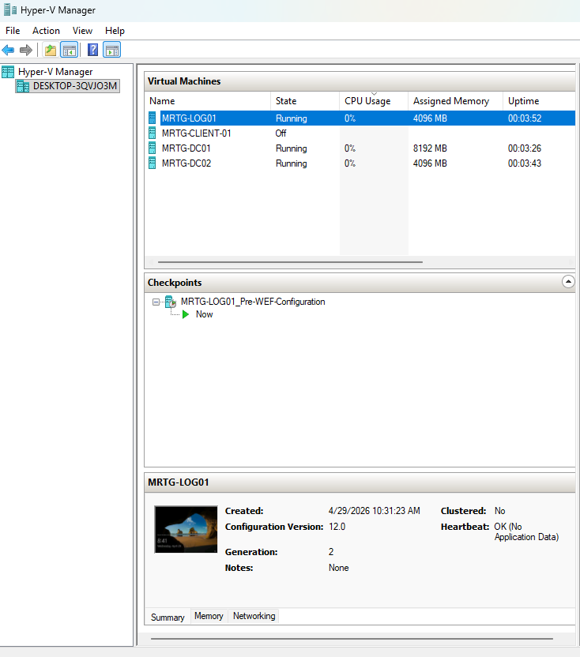

`MRTG-LOG01` was renamed and confirmed in Server Manager.

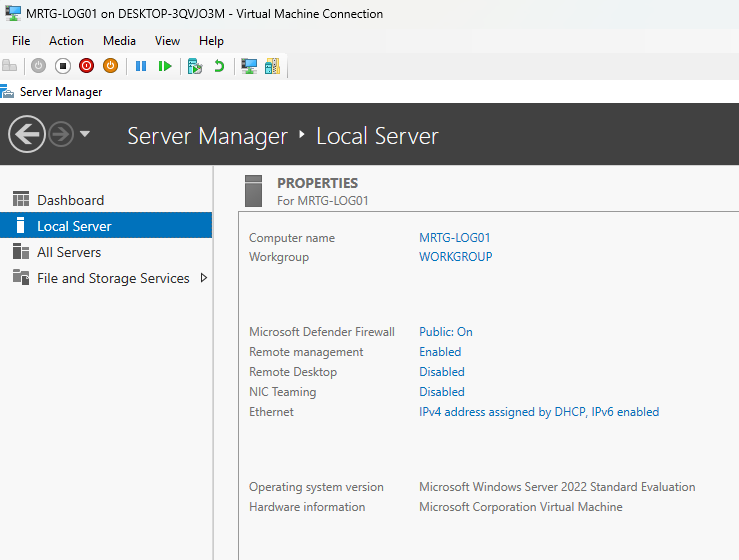

The logging server was configured with a static IP address and pointed to the domain controllers for DNS.

```text
IP address: 192.168.10.20
Subnet mask: 255.255.255.0
Default gateway: blank
Preferred DNS: 192.168.10.10
Alternate DNS: 192.168.10.11
```

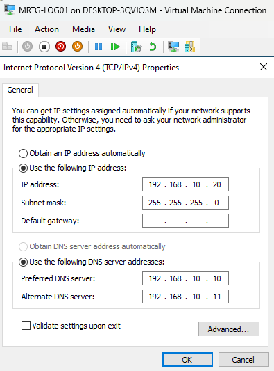

Domain connectivity was validated from `MRTG-LOG01`.

Commands used:

```cmd
ping 192.168.10.10
ping 192.168.10.11
ping MRTG-DC01
ping MRTG-DC02
nslookup mrtg.local
nltest /dsgetdc:mrtg.local
```

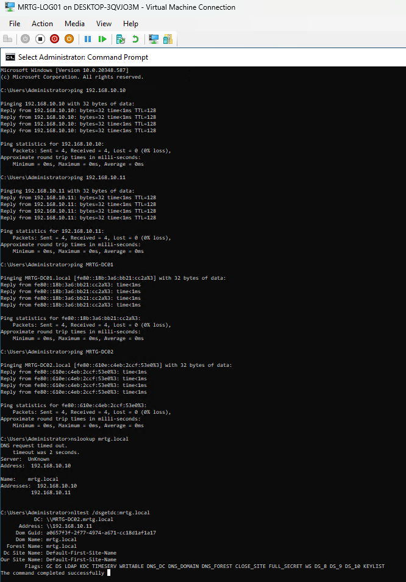

---

## Phase 2 — Join LOG01 to the Domain

`MRTG-LOG01` was joined to the existing `mrtg.local` domain.

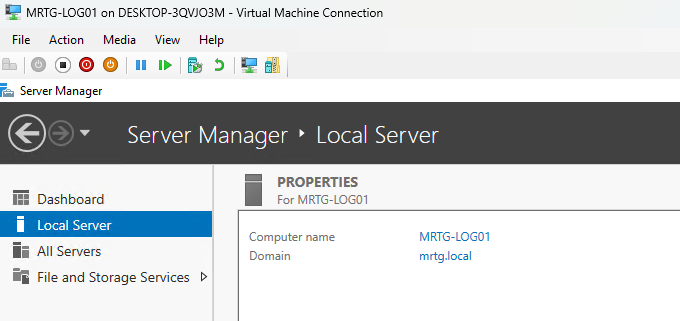

This allowed the logging server to participate in domain-based event forwarding and receive events from domain controllers.

---

## Phase 3 — Enable Windows Event Collector

The Windows Event Collector service was configured on `MRTG-LOG01`.

Command used:

```cmd
wecutil qc
```

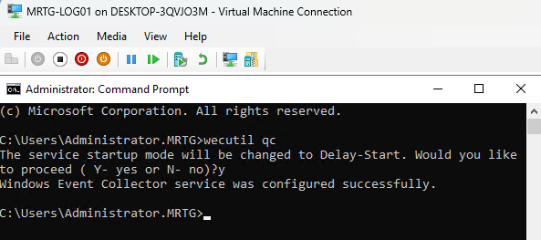

The Windows Event Collector service was then verified as running.

Command used:

```cmd
sc query Wecsvc
```

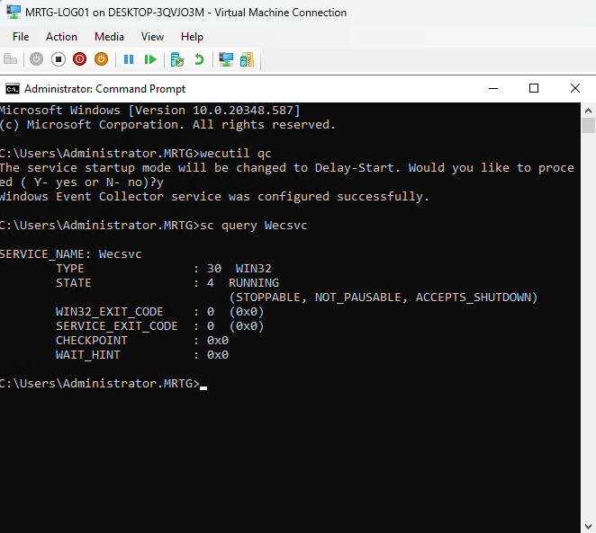

This confirmed that `MRTG-LOG01` was ready to receive forwarded events.

---

## Phase 4 — Prepare Domain Controllers for Event Forwarding

WinRM was verified on `MRTG-DC01`.

Commands used:

```cmd
winrm quickconfig
winrm enumerate winrm/config/listener
```

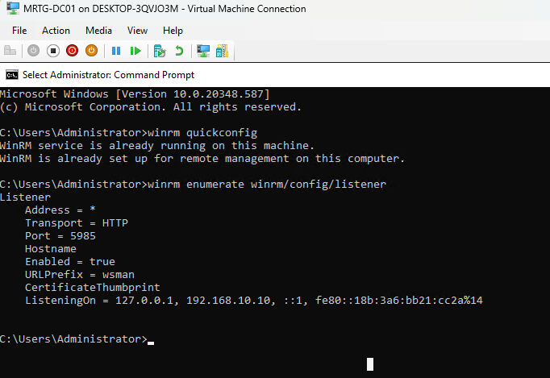

WinRM was also verified on `MRTG-DC02`.

Commands used:

```cmd
winrm quickconfig
winrm enumerate winrm/config/listener
```

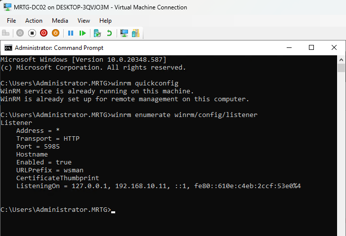

Both domain controllers were listening on HTTP port `5985`, which supports Windows Event Forwarding communication.

---

## Phase 5 — Create the Event Forwarding GPO

A new Group Policy Object was created for centralized event forwarding.

GPO name:

```text
MRTG-GPO-Centralized-Event-Forwarding
```

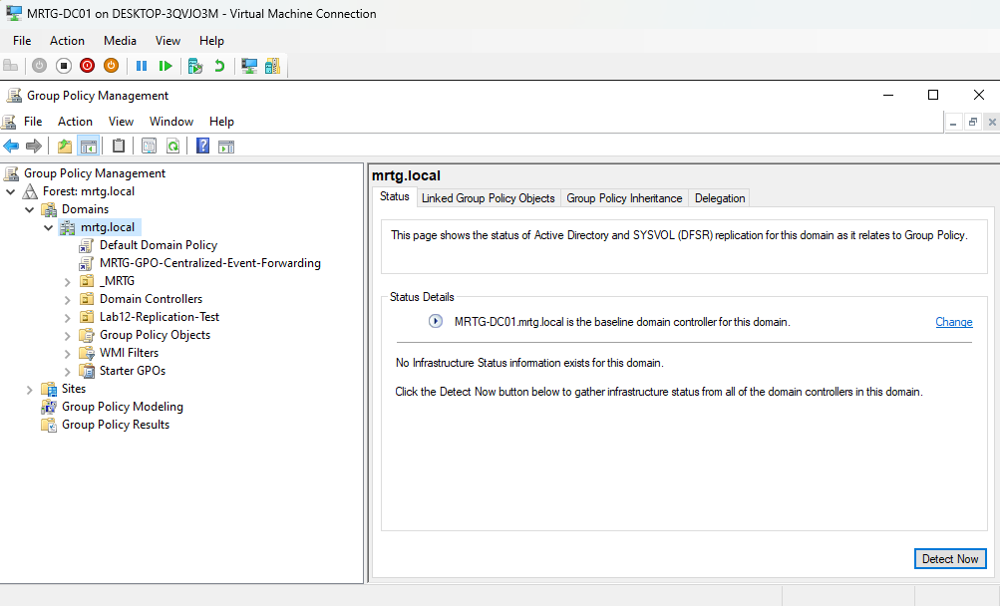

The GPO was configured with a target Subscription Manager.

Subscription Manager value:

```text
Server=http://MRTG-LOG01.mrtg.local:5985/wsman/SubscriptionManager/WEC,Refresh=60
```

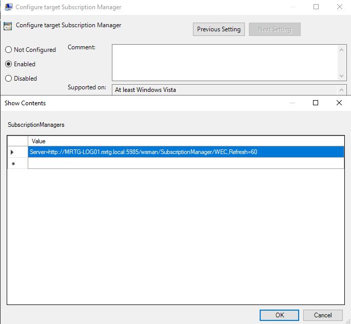

The GPO was linked to the **Domain Controllers** OU so that only domain controllers would receive the event forwarding configuration.

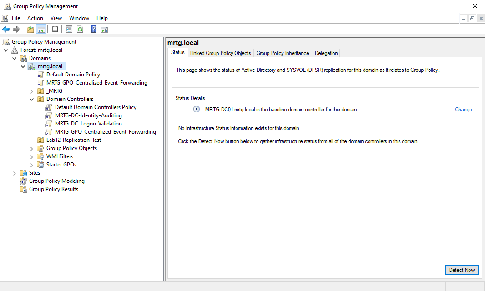

Group Policy was refreshed on both domain controllers and verified with `gpresult`.

Commands used:

```cmd
gpupdate /force
gpresult /r
```

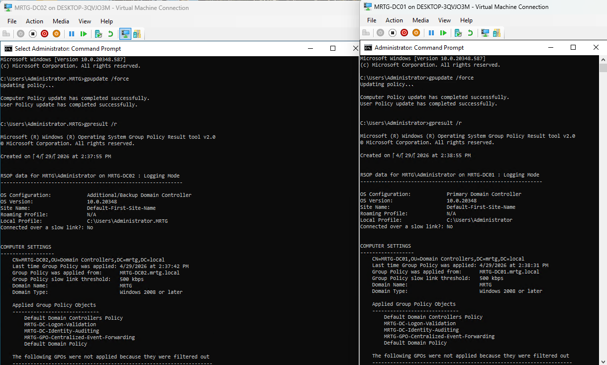

This confirmed that both `MRTG-DC01` and `MRTG-DC02` received the centralized event forwarding policy.

---

## Phase 6 — Configure the Event Subscription

On `MRTG-LOG01`, Event Viewer was opened and the **Subscriptions** node was confirmed.

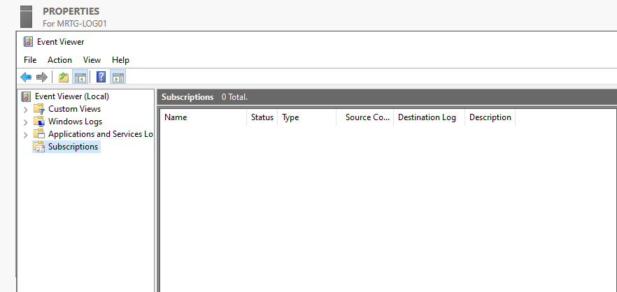

A new source-initiated subscription was created.

Subscription name:

```text
MRTG-Identity-Security-Events
```

Destination log:

```text
Forwarded Events
```

Subscription type:

```text
Source computer initiated
```

The event filter was configured to collect identity-related Security log events.

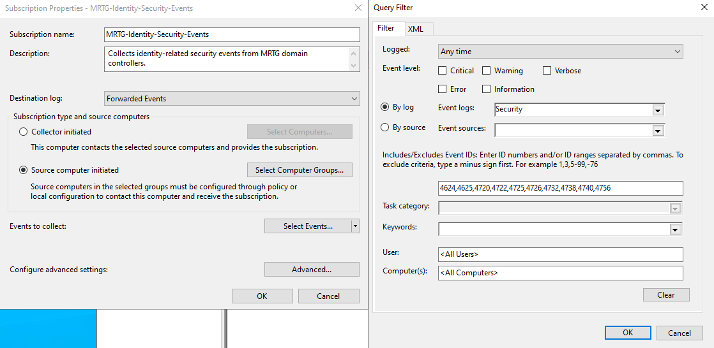

The subscription was created and shown as active in Event Viewer.

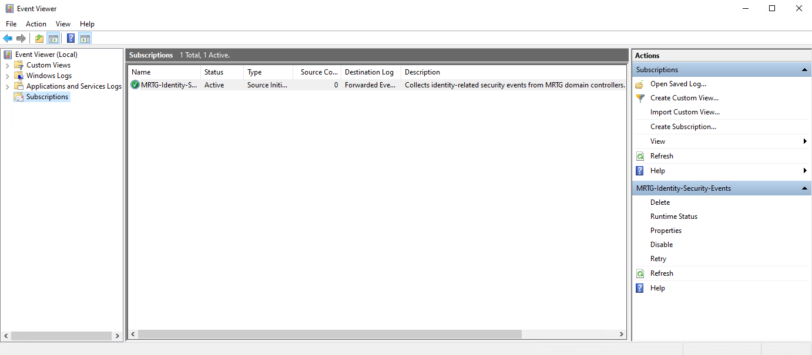

---

## Phase 7 — Configure Source Permissions and Restart WinRM

The `Network Service` account was added to the local **Event Log Readers** group on the domain controllers.

Command used:

```cmd
net localgroup "Event Log Readers" "Network Service" /add
```

WinRM was restarted on both source domain controllers.

Commands used:

```cmd
net stop winrm
net start winrm
```

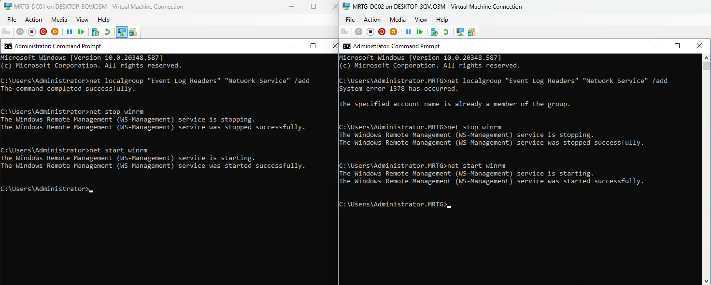

This ensured the forwarding service had the required access to read and forward events.

---

## Phase 8 — Validate Subscription Health

The subscription runtime status showed both source domain controllers as active.

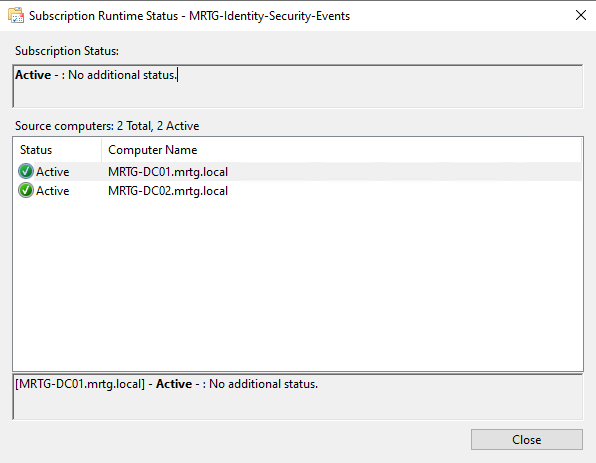

Runtime status confirmed:

| Source Computer | Status |
|---|---|
| `MRTG-DC01.mrtg.local` | Active |
| `MRTG-DC02.mrtg.local` | Active |

This validated that both domain controllers were successfully checking in to the collector.

---

## Phase 9 — Validate Forwarded Events

The **Forwarded Events** log on `MRTG-LOG01` began receiving Security events from the domain controllers.

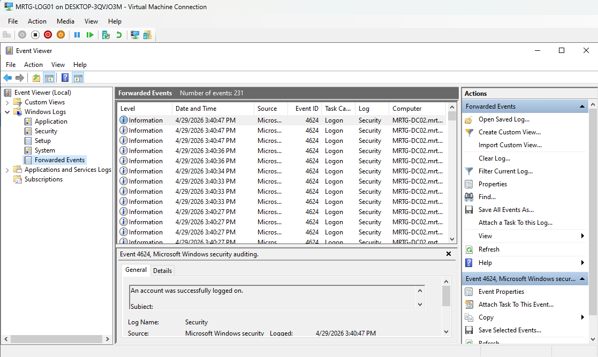

A forwarded account lockout event was collected centrally.

Event ID:

```text
4740
```

Meaning:

```text
A user account was locked out.
```

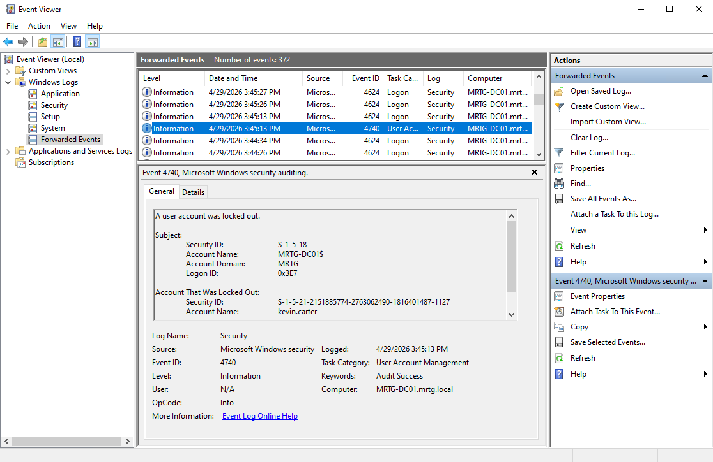

This event showed that `MRTG-LOG01` could collect high-value identity security events from the domain controller environment.

---

## Phase 10 — Additional Identity Event Validation

A test user was created in Active Directory to generate an account creation event.

Expected event ID:

```text
4720
```

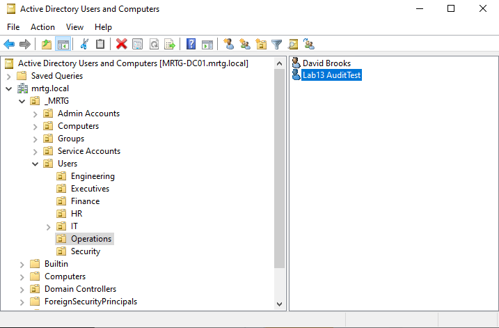

The account creation event was collected in Forwarded Events on `MRTG-LOG01`.

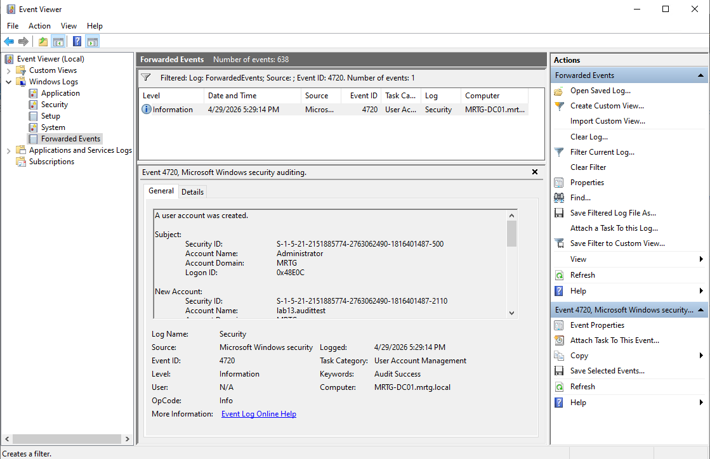

The test user was then disabled in Active Directory.

Expected event ID:

```text
4725
```

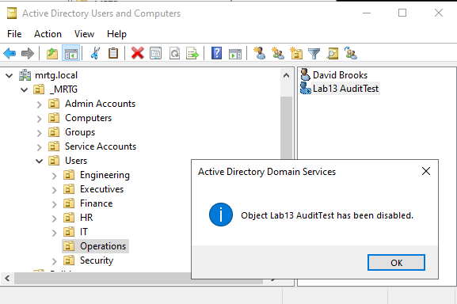

The account disabled event was collected in Forwarded Events on `MRTG-LOG01`.

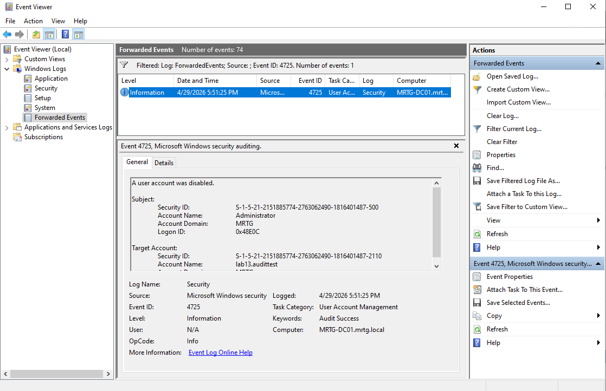

A final centralized event view confirmed multiple identity-related events were collected on `MRTG-LOG01`.

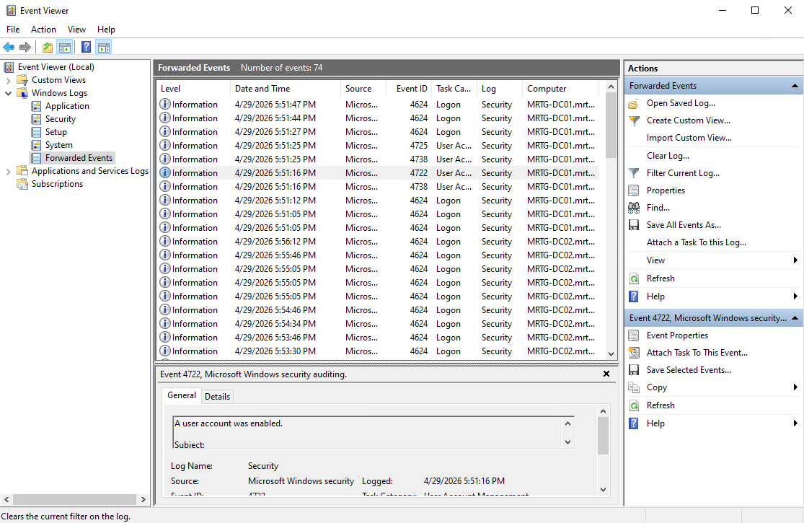

---

## Phase 11 — Final Hyper-V Checkpoint

A final checkpoint was created after validating centralized event forwarding.

Checkpoint name:

```text
MRTG-LOG01_Post-Lab13-WEF-Identity-Events-Validated
```

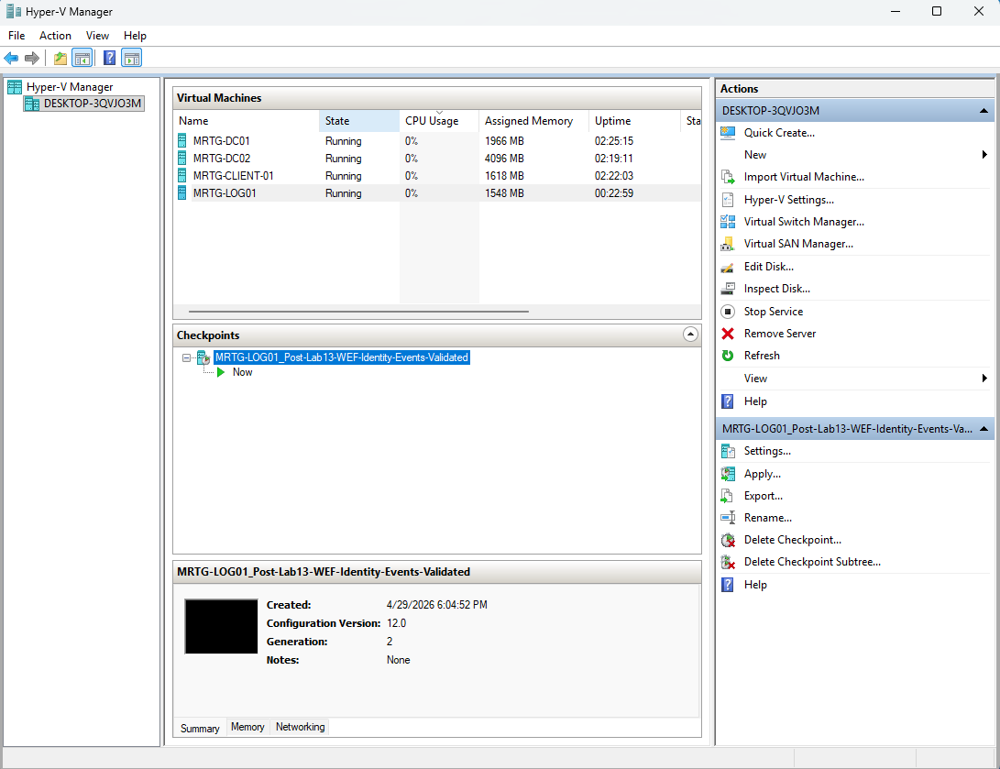

---

## Validation Summary

| Validation Check | Result |
|---|---|
| `MRTG-LOG01` created and running | Passed |
| Static IP configured on LOG01 | Passed |
| LOG01 domain connectivity validated | Passed |
| LOG01 joined to `mrtg.local` | Passed |
| Windows Event Collector configured | Passed |
| WEC service running | Passed |
| WinRM enabled on DC01 | Passed |
| WinRM enabled on DC02 | Passed |
| Event forwarding GPO created | Passed |
| Subscription Manager configured through GPO | Passed |
| GPO linked to Domain Controllers OU | Passed |
| GPO applied to both domain controllers | Passed |
| Source-initiated subscription created | Passed |
| Identity event IDs configured | Passed |
| Source DCs active in subscription runtime status | Passed |
| Forwarded Events populated on LOG01 | Passed |
| Account lockout event collected | Passed |
| User creation event collected | Passed |
| User disable event collected | Passed |
| Final checkpoint created | Passed |

---

## Security and IAM Relevance

Centralized logging is a major part of identity security operations. In an Active Directory environment, many high-value security events are generated on domain controllers, including logons, account changes, group membership updates, and account lockouts.

Without centralized collection, administrators must review logs separately on each domain controller. That does not scale and makes investigation slower.

This lab demonstrates several IAM and security-relevant concepts:

- Centralized audit visibility
- Windows Event Forwarding
- Domain controller security event collection
- Authentication monitoring
- Account lifecycle event tracking
- Account lockout investigation
- Group Policy-based logging configuration
- Event collection from multiple identity systems
- Operational readiness for security review

For government, defense, and regulated IT environments, centralized logging supports audit readiness, incident investigation, and identity governance.

---

## Outcome

Lab-13 implemented centralized Windows Event Forwarding for identity-related security events in the MRTG Active Directory environment.

The lab configured `MRTG-LOG01` as a Windows Event Collector, applied Group Policy-based event forwarding to both domain controllers, created an identity-focused event subscription, and validated that authentication and account lifecycle events were collected centrally in Forwarded Events.

Final state:

```text
MRTG-LOG01
├── Windows Event Collector
├── Forwarded Events log
├── Source-initiated subscription
└── Collects identity events from DC01 and DC02

MRTG-DC01
├── Domain Controller
├── Security event source
└── Forwards events to MRTG-LOG01

MRTG-DC02
├── Domain Controller
├── Security event source
└── Forwards events to MRTG-LOG01
```

Identity-related security events are now centrally collected and available for review on `MRTG-LOG01`.

---

## Next Lab

**Lab-14 — Active Directory Sites and Services**

Lab-14 will build on the multi-domain-controller environment by configuring Active Directory Sites and Services to improve replication topology, site awareness, and domain controller placement in the MRTG environment.
