# Lab 13 — Centralized Logging and Event Forwarding for Identity Events


---

## Objective

The objective of this lab is to implement centralized Windows Event Forwarding for identity-related security events in the `mrtg.local` Active Directory environment.

This lab configures `MRTG-LOG01` as a Windows Event Collector and configures `MRTG-DC01` and `MRTG-DC02` as event sources.

The focus is on centralized audit visibility, domain controller security event collection, Group Policy-based forwarding configuration, and validation of forwarded identity events.

---

## Business Problem

Monroe Redstone Technology Group needs centralized visibility into identity-related activity across multiple domain controllers.

Without centralized event collection, administrators must review security logs separately on each domain controller. That approach does not scale and makes investigations slower.

This lab addresses the need to:

- Centralize identity-related security events
- Collect authentication and account lifecycle events from domain controllers
- Configure Windows Event Forwarding through Group Policy
- Validate source computer check-in from both domain controllers
- Confirm forwarded events are collected on a dedicated logging server
- Improve audit readiness and incident investigation capability

---

## Lab Summary

In this lab, I built and configured `MRTG-LOG01` as a centralized Windows Event Collector.

I configured static IP and DNS settings, joined the server to the `mrtg.local` domain, enabled the Windows Event Collector service, verified WinRM on both domain controllers, and created a Group Policy Object for event forwarding.

I then created an identity-focused source-initiated subscription and validated that security events from `MRTG-DC01` and `MRTG-DC02` were collected centrally in the Forwarded Events log on `MRTG-LOG01`.

---

## Environment

| Component | Details |
|---|---|
| Domain | `mrtg.local` |
| Primary Domain Controller | `MRTG-DC01` |
| Additional Domain Controller | `MRTG-DC02` |
| Logging Server | `MRTG-LOG01` |
| Hypervisor | Hyper-V |
| Network | `MRTG-Internal` |
| Operating System | Windows Server 2022 Standard Evaluation |
| Event Collection Method | Windows Event Forwarding |
| Collector Log | Forwarded Events |
| Lab Organization | Monroe Redstone Technology Group |

---

## Scope

### Included

- Logging server buildout
- Static IP and DNS configuration for `MRTG-LOG01`
- Domain join for `MRTG-LOG01`
- Windows Event Collector configuration
- WinRM validation on both domain controllers
- Event forwarding GPO creation
- Subscription Manager configuration through Group Policy
- GPO link to the Domain Controllers OU
- GPO application validation on both domain controllers
- Source-initiated event subscription creation
- Identity-focused Security event filtering
- Source computer runtime status validation
- Forwarded Events validation
- Account lockout event collection
- User creation event collection
- User disabled event collection
- Final Hyper-V checkpoint

### Not Included

- SIEM integration
- Splunk forwarding
- Microsoft Defender for Identity
- Long-term log retention architecture
- Alerting workflows
- Windows Event Forwarding over HTTPS
- Advanced event correlation
- Cloud-based identity monitoring

---

## IP Addressing

| System | IP Address | Role |
|---|---:|---|
| `MRTG-DC01` | `192.168.10.10` | Primary domain controller, DNS, Global Catalog, event source |
| `MRTG-DC02` | `192.168.10.11` | Additional domain controller, DNS, Global Catalog, event source |
| `MRTG-LOG01` | `192.168.10.20` | Windows Event Collector |

---

## Event IDs Collected

| Event ID | Meaning |
|---:|---|
| `4624` | Successful logon |
| `4625` | Failed logon |
| `4720` | User account created |
| `4722` | User account enabled |
| `4725` | User account disabled |
| `4726` | User account deleted |
| `4732` | Member added to local security group |
| `4738` | User account changed |
| `4740` | User account locked out |
| `4756` | Member added to universal security group |

These events support IAM visibility by tracking authentication activity, account lifecycle changes, group membership changes, and account lockout activity.

---

## Architecture

Before this lab, identity-related events were available locally on individual domain controllers.

```text
MRTG-DC01
└── Local Security Logs

MRTG-DC02
└── Local Security Logs
```

After this lab, identity-related security events are forwarded to a centralized collector.

```text
MRTG-DC01 ─┐
           ├── Windows Event Forwarding ─── MRTG-LOG01
MRTG-DC02 ─┘                                └── Forwarded Events
```

This allows security-relevant identity activity to be reviewed from one central location.

---

## Centralized Logging Model

This lab uses Windows Event Forwarding with a source-initiated subscription.

| Component | Purpose |
|---|---|
| `MRTG-LOG01` | Central event collector |
| `MRTG-DC01` | Security event source |
| `MRTG-DC02` | Security event source |
| Windows Event Collector | Receives forwarded events |
| WinRM | Supports event forwarding communication |
| Group Policy | Configures source systems with the Subscription Manager |
| Forwarded Events | Central log where collected events are stored |

This model supports centralized audit visibility without requiring a full SIEM deployment.

---

## Implementation and Validation

### 1. Logging Server Created

`MRTG-LOG01` was created in Hyper-V and brought online with the existing MRTG lab systems.

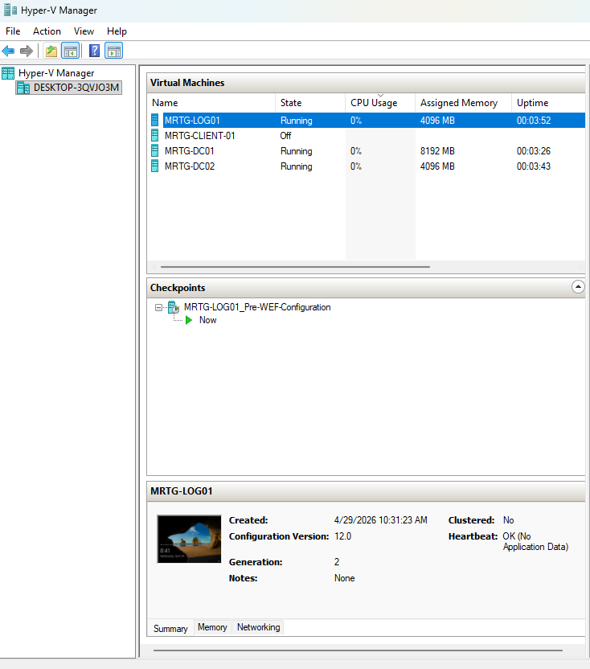

---

### 2. LOG01 Renamed

`MRTG-LOG01` was renamed and confirmed in Server Manager.

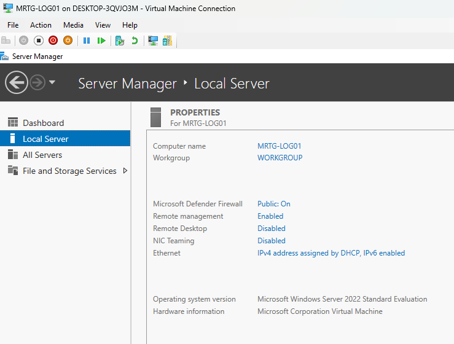

---

### 3. LOG01 Static IP and DNS Configured

The logging server was configured with a static IP address and pointed to the domain controllers for DNS.

```text
IP address: 192.168.10.20
Subnet mask: 255.255.255.0
Default gateway: blank
Preferred DNS: 192.168.10.10
Alternate DNS: 192.168.10.11
```


---

### 4. LOG01 Domain Connectivity Validated

Domain connectivity was validated from `MRTG-LOG01`.

Commands used:

```cmd
ping 192.168.10.10
ping 192.168.10.11
ping MRTG-DC01
ping MRTG-DC02
nslookup mrtg.local
nltest /dsgetdc:mrtg.local
```

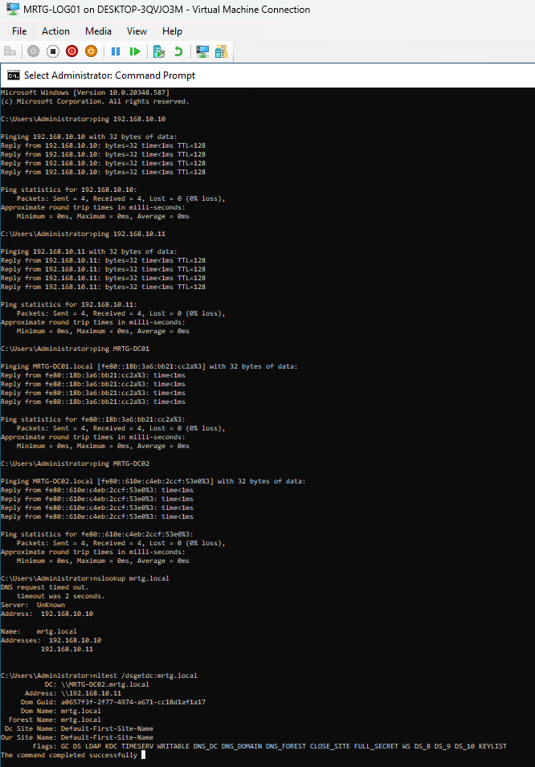

---

### 5. LOG01 Joined to the Domain

`MRTG-LOG01` was joined to the existing `mrtg.local` domain.


This allowed the logging server to participate in domain-based event forwarding.

---

### 6. Windows Event Collector Configured

The Windows Event Collector service was configured on `MRTG-LOG01`.

Command used:

```cmd
wecutil qc
```


---

### 7. Windows Event Collector Service Verified

The Windows Event Collector service was verified as running.

Command used:

```cmd
sc query Wecsvc
```


This confirmed that `MRTG-LOG01` was ready to receive forwarded events.

---

### 8. WinRM Verified on DC01

WinRM was verified on `MRTG-DC01`.

Commands used:

```cmd
winrm quickconfig
winrm enumerate winrm/config/listener
```


---

### 9. WinRM Verified on DC02

WinRM was verified on `MRTG-DC02`.

Commands used:

```cmd
winrm quickconfig
winrm enumerate winrm/config/listener
```

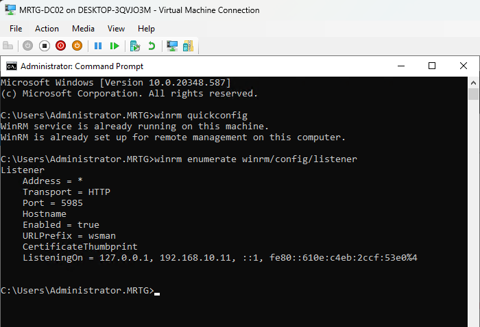

Both domain controllers were listening on HTTP port `5985`, which supports Windows Event Forwarding communication.

---

### 10. Event Forwarding GPO Created

A new Group Policy Object was created for centralized event forwarding.

GPO name:

```text
MRTG-GPO-Centralized-Event-Forwarding
```

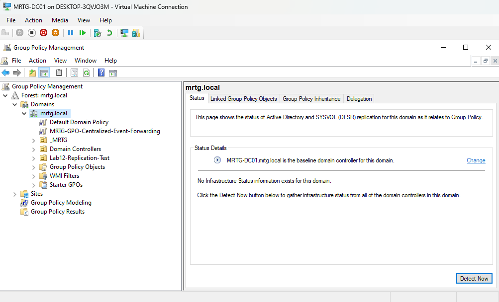

---

### 11. Subscription Manager Configured in GPO

The GPO was configured with a target Subscription Manager.

Subscription Manager value:

```text
Server=http://MRTG-LOG01.mrtg.local:5985/wsman/SubscriptionManager/WEC,Refresh=60
```

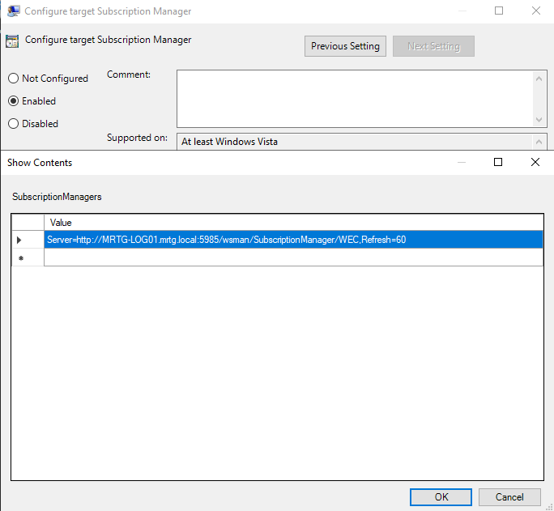

This tells the source computers where to check in for event forwarding subscriptions.

---

### 12. GPO Linked to Domain Controllers OU

The event forwarding GPO was linked to the Domain Controllers OU.

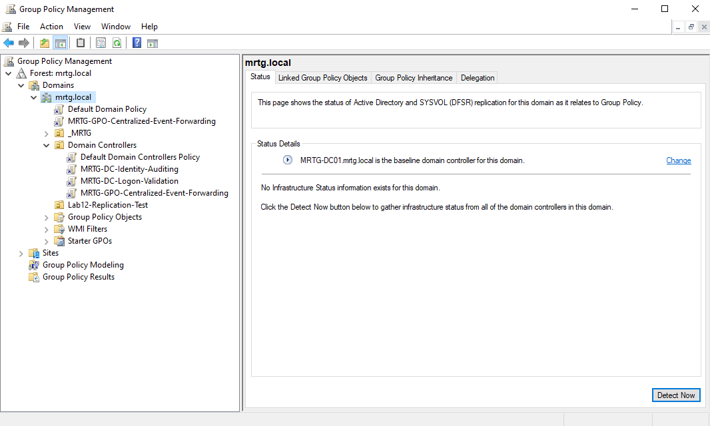

This ensured only domain controllers received the event forwarding configuration.

---

### 13. Event Forwarding GPO Applied to Domain Controllers

Group Policy was refreshed on both domain controllers and verified with `gpresult`.

Commands used:

```cmd
gpupdate /force
gpresult /r
```

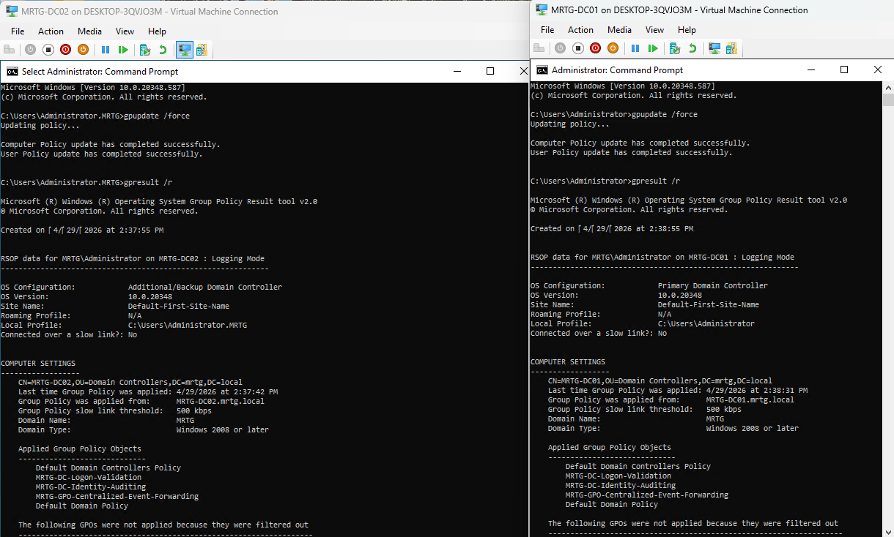

This confirmed that both `MRTG-DC01` and `MRTG-DC02` received the centralized event forwarding policy.

---

### 14. Event Viewer Subscriptions Opened on LOG01

Event Viewer was opened on `MRTG-LOG01`.

The Subscriptions node was confirmed.


---

### 15. Identity Security Event Subscription Created

A new source-initiated subscription was created.

| Setting | Value |
|---|---|
| Subscription Name | `MRTG-Identity-Security-Events` |
| Destination Log | `Forwarded Events` |
| Subscription Type | Source computer initiated |


The event filter was configured to collect identity-related Security log events.

---

### 16. Identity Security Event Subscription Verified

The subscription was created and shown as active in Event Viewer.

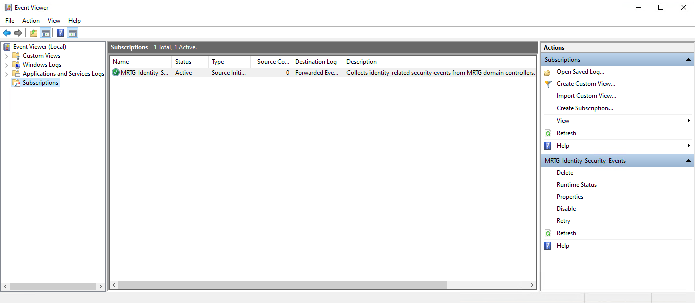

---

### 17. Source Permissions Configured and WinRM Restarted

The `Network Service` account was added to the local Event Log Readers group on the domain controllers.

Command used:

```cmd
net localgroup "Event Log Readers" "Network Service" /add
```

WinRM was restarted on both source domain controllers.

Commands used:

```cmd
net stop winrm
net start winrm
```

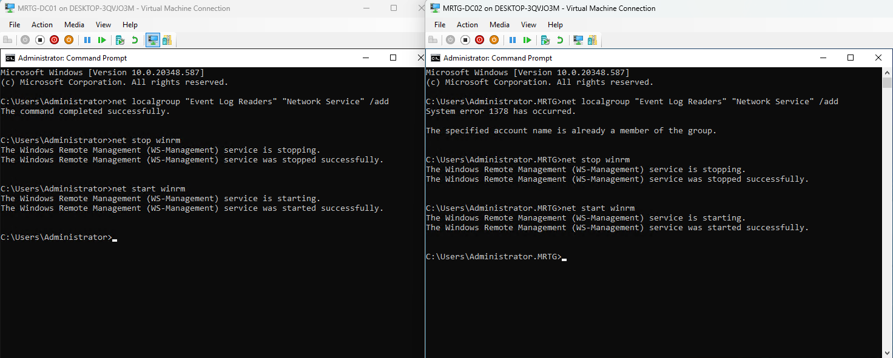

This ensured the forwarding service had the required access to read and forward events.

---

### 18. Subscription Runtime Status Validated

The subscription runtime status showed both source domain controllers as active.


Validated source computers:

| Source Computer | Status |
|---|---|
| `MRTG-DC01.mrtg.local` | Active |
| `MRTG-DC02.mrtg.local` | Active |

This confirmed that both domain controllers were successfully checking in to the collector.

---

### 19. Forwarded Events Log Validated

The Forwarded Events log on `MRTG-LOG01` began receiving Security events from the domain controllers.


This confirmed that centralized event collection was working.

---

### 20. Forwarded Account Lockout Event Validated

A forwarded account lockout event was collected centrally.

Event ID:

```text
4740
```

Meaning:

```text
A user account was locked out.
```

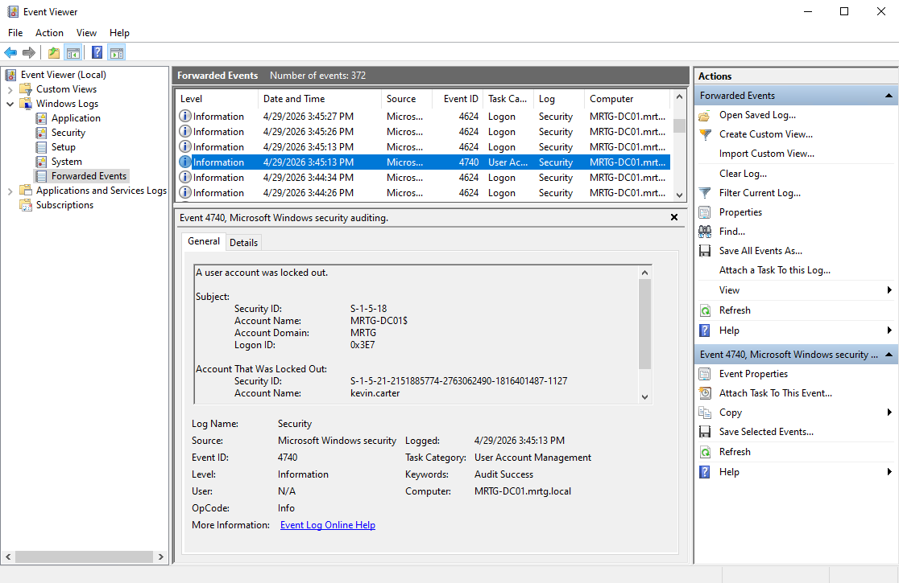

This validated collection of a high-value identity security event.

---

### 21. Test User Created in ADUC

A test user was created in Active Directory to generate an account creation event.

Expected event ID:

```text
4720
```


---

### 22. Forwarded User Creation Event Validated

The account creation event was collected in Forwarded Events on `MRTG-LOG01`.

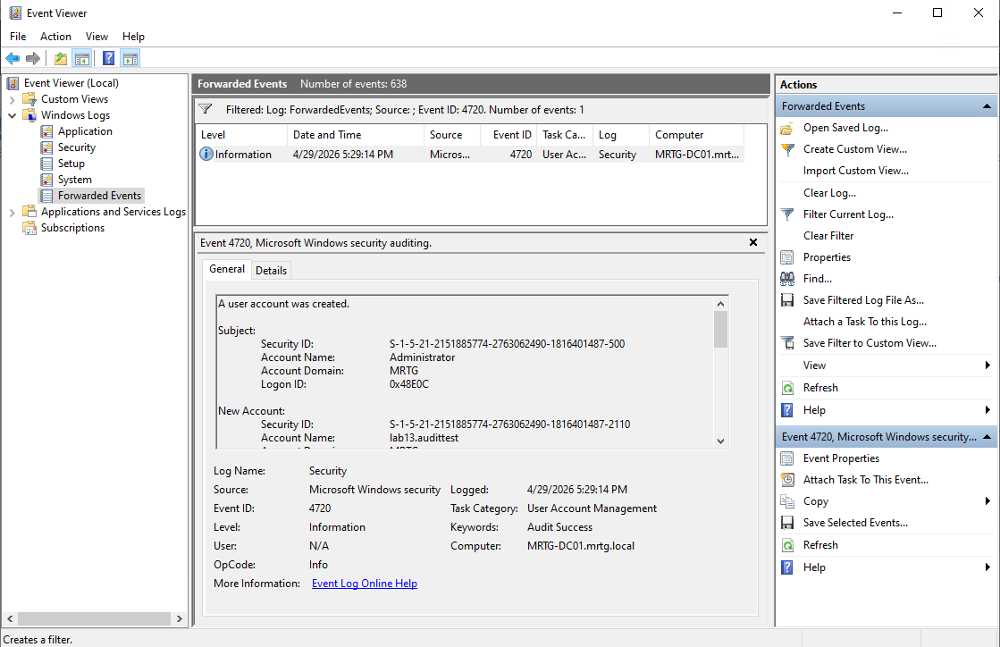

This confirmed that account lifecycle events were forwarded successfully.

---

### 23. Test User Disabled in ADUC

The test user was disabled in Active Directory.

Expected event ID:

```text
4725
```


---

### 24. Forwarded User Disabled Event Validated

The account disabled event was collected in Forwarded Events on `MRTG-LOG01`.


This confirmed centralized collection of user disablement activity.

---

### 25. Centralized Identity Events Confirmed

A final centralized event view confirmed that multiple identity-related events were collected on `MRTG-LOG01`.

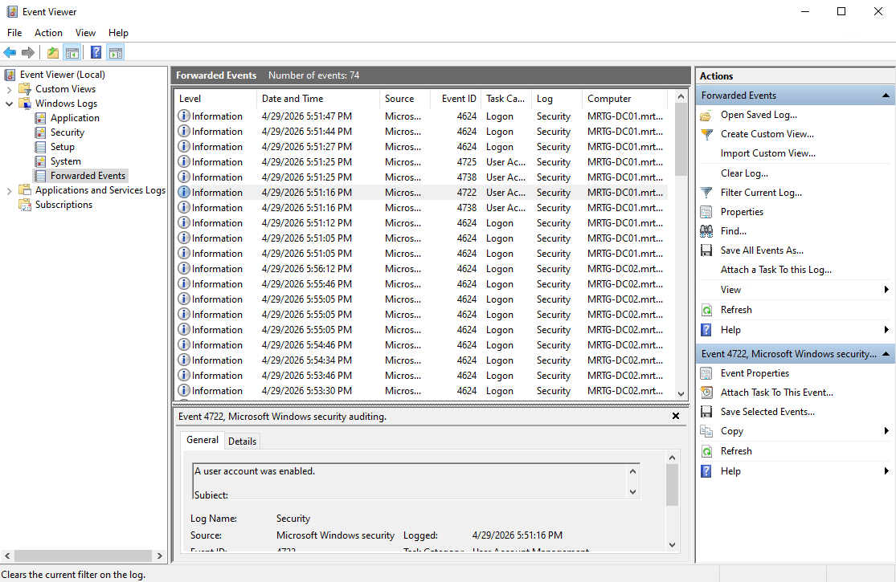

---

### 26. Final Lab 13 Checkpoint Created

A final checkpoint was created after validating centralized event forwarding.

Checkpoint name:

```text
MRTG-LOG01_Post-Lab13-WEF-Identity-Events-Validated
```


---

## Security Perspective

Centralized logging is a major part of identity security operations.

In Active Directory environments, many high-value security events are generated on domain controllers, including logons, account changes, group membership updates, and account lockouts.

From a security and IAM perspective, this lab supports:

- Centralized audit visibility
- Windows Event Forwarding
- Domain controller security event collection
- Authentication monitoring
- Account lifecycle event tracking
- Account lockout investigation
- Group Policy-based logging configuration
- Event collection from multiple identity systems
- Operational readiness for security review

Centralized logging helps support audit readiness, incident investigation, and identity governance.

---

## Risk Addressed

Without centralized collection, administrators must review logs separately on each domain controller.

This lab reduces the risk of:

- Missed identity security events
- Slow investigation across multiple domain controllers
- Inconsistent audit visibility
- Local-only event review
- Weak account lifecycle monitoring
- Poor visibility into account lockout activity
- Reduced evidence availability during security reviews

---

## Control Mapping

| Control Area | How This Lab Supports It |
|---|---|
| Centralized logging | Collects events from both domain controllers on `MRTG-LOG01` |
| Identity monitoring | Collects authentication and account lifecycle event IDs |
| Account lockout visibility | Validates forwarded Event ID `4740` |
| Account lifecycle tracking | Validates forwarded Events `4720` and `4725` |
| Group Policy enforcement | Uses GPO to configure source event forwarding |
| Source validation | Confirms both DCs are active in runtime status |
| Audit readiness | Captures forwarded security events in one central location |
| Operational resilience | Creates final checkpoint after validation |

---

## Validation

The following validation checks were completed:

| Validation Item | Result |
|---|---|
| `MRTG-LOG01` created and running | Passed |
| Static IP configured on LOG01 | Passed |
| LOG01 domain connectivity validated | Passed |
| LOG01 joined to `mrtg.local` | Passed |
| Windows Event Collector configured | Passed |
| WEC service running | Passed |
| WinRM enabled on DC01 | Passed |
| WinRM enabled on DC02 | Passed |
| Event forwarding GPO created | Passed |
| Subscription Manager configured through GPO | Passed |
| GPO linked to Domain Controllers OU | Passed |
| GPO applied to both domain controllers | Passed |
| Source-initiated subscription created | Passed |
| Identity event IDs configured | Passed |
| Source DCs active in subscription runtime status | Passed |
| Forwarded Events populated on LOG01 | Passed |
| Account lockout event collected | Passed |
| User creation event collected | Passed |
| User disable event collected | Passed |
| Final checkpoint created | Passed |

---

## Evidence Collected

The following evidence was collected during the lab:

| Evidence | File |
|---|---|
| Hyper-V showing LOG01 created and running | `images/01-hyperv-log01-created-and-running.png` |
| LOG01 server renamed | `images/02-log01-server-renamed.png` |
| LOG01 static IP and DNS configured | `images/03-log01-static-ip-dns-configured.png` |
| LOG01 domain connectivity validated | `images/04-log01-domain-connectivity-validated.png` |
| LOG01 domain membership confirmed | `images/05-log01-domain-membership-confirmed.png` |
| WECUTIL configured on LOG01 | `images/06-wecutil-qc-enabled-on-log01.png` |
| Windows Event Collector service running | `images/07-windows-event-collector-service-running.png` |
| WinRM enabled on DC01 | `images/08-winrm-enabled-on-dc01.png` |
| WinRM enabled on DC02 | `images/09-winrm-enabled-on-dc02.png` |
| Event forwarding GPO created | `images/10-event-forwarding-gpo-created.png` |
| Subscription Manager configured in GPO | `images/11-subscription-manager-configured-in-gpo.png` |
| GPO linked to Domain Controllers OU | `images/12-gpo-linked-to-domain-controllers-ou.png` |
| Event forwarding GPO applied to domain controllers | `images/13-event-forwarding-gpo-applied-to-domain-controllers.png` |
| Event Viewer Subscriptions opened on LOG01 | `images/14-event-viewer-subscriptions-opened-on-log01.png` |
| Identity security event subscription created | `images/15-identity-security-event-subscription-created.png` |
| Identity security event subscription visible | `images/16-identity-security-event-subscription-visible.png` |
| Network Service added and WinRM restarted on DCs | `images/17-network-service-added-and-winrm-restarted-on-dcs.png` |
| Subscription runtime status shows source DCs | `images/18-subscription-runtime-status-shows-source-dcs.png` |
| Forwarded Events log visible on LOG01 | `images/19-forwarded-events-log-visible-on-log01.png` |
| Forwarded account lockout event collected | `images/20-forwarded-4740-account-lockout-event-collected.png` |
| Test user created in ADUC | `images/21-test-user-created-in-aduc.png` |
| Forwarded user created event collected | `images/22-forwarded-4720-user-created-event-collected.png` |
| Test user disabled in ADUC | `images/23-test-user-disabled-in-aduc.png` |
| Forwarded user disabled event collected | `images/24-forwarded-4725-user-disabled-event-collected.png` |
| Centralized identity events collected on LOG01 | `images/25-centralized-identity-events-collected-on-log01.png` |
| Final Lab 13 checkpoint created | `images/26-final-lab13-checkpoint-created.png` |

---

## What I Would Improve in Production

In a production environment, I would improve this process by:

- Forwarding events to a SIEM for search, alerting, and retention
- Using HTTPS for Windows Event Forwarding where appropriate
- Defining event retention requirements
- Creating alerting for high-risk identity events
- Monitoring privileged group membership changes
- Monitoring repeated failed logons and lockouts
- Reviewing source computer health regularly
- Applying least privilege to event log access
- Separating log collection from domain controller roles
- Documenting event ID coverage and ownership
- Mapping collected events to incident response playbooks
- Testing event forwarding after domain controller maintenance

---

## Lessons Learned

This lab reinforced that identity events become more useful when they are centralized.

Domain controllers generate high-value security events, but reviewing them separately does not scale.

The biggest takeaway is that centralized logging improves visibility, troubleshooting, and audit readiness.

Windows Event Forwarding provides a practical native method for collecting identity events before moving into more advanced SIEM tooling.

---

## Outcome

Lab 13 successfully implemented centralized Windows Event Forwarding for identity-related security events in the MRTG Active Directory environment.

The lab confirmed:

- `MRTG-LOG01` was configured as a Windows Event Collector
- `MRTG-LOG01` joined the `mrtg.local` domain
- WinRM was enabled on both domain controllers
- Event forwarding was configured through Group Policy
- Both domain controllers checked in as active subscription sources
- Forwarded Events populated on `MRTG-LOG01`
- Account lockout event `4740` was collected
- User creation event `4720` was collected
- User disabled event `4725` was collected
- A final checkpoint was created after validation

The environment now supports centralized identity event collection from both domain controllers.

---

## Next Lab

[Lab 14 — Active Directory Sites and Services for Replication Topology](../Lab-14-Active-Directory-Sites-and-Services-for-Replication-Topology/)

Lab 14 will build on the multi-domain-controller environment by configuring Active Directory Sites and Services to improve replication topology, site awareness, and domain controller placement in the MRTG environment.
