# Lab 13: Centralized Logging and Event Forwarding for Identity Events


---

## Objective

Implement centralized Windows Event Forwarding for identity-related Security events in the `mrtg.local` Active Directory environment.

This lab configures `MRTG-LOG01` as a Windows Event Collector and configures `MRTG-DC01` and `MRTG-DC02` as event sources.

The goal is to centralize domain controller audit events, apply forwarding settings through Group Policy, and validate identity events in the Forwarded Events log.

---

## Business Scenario

Monroe Redstone Technology Group requires centralized visibility into identity activity across multiple domain controllers.

Reviewing each domain controller's Security log separately does not scale and makes investigations slower.

This lab addresses the need to:

- Centralize identity-related Security events
- Collect authentication and account-lifecycle events
- Configure event forwarding through Group Policy
- Validate source check-in from both domain controllers
- Confirm events arrive on a dedicated logging server
- Improve audit and investigation readiness
- Prepare the environment for later SIEM integration

---

## Lab Summary

In this lab, I built `MRTG-LOG01` as a centralized Windows Event Collector.

The server received static IP and DNS configuration, joined `mrtg.local`, and was configured with the Windows Event Collector service.

WinRM was validated on both domain controllers, and the `MRTG-GPO-Centralized-Event-Forwarding` GPO configured the source systems with the collector's Subscription Manager address.

A source-initiated subscription named `MRTG-Identity-Security-Events` was created on `MRTG-LOG01`.

Runtime status confirmed that both domain controllers were active sources. Event IDs `4740`, `4720`, and `4725` were then validated in the centralized Forwarded Events log.

---

## Environment

| Component | Details |
|---|---|
| Domain | `mrtg.local` |
| Original Domain Controller | `MRTG-DC01` |
| Additional Domain Controller | `MRTG-DC02` |
| Event Collector | `MRTG-LOG01` |
| Server Operating System | Windows Server 2022 Standard Evaluation |
| Event Collection Method | Windows Event Forwarding |
| Subscription Type | Source initiated |
| Destination Log | Forwarded Events |
| Virtual Network | `MRTG-Internal` |
| Hypervisor | Hyper-V |
| Organization | Monroe Redstone Technology Group |

---

## Prerequisites

- Operational `mrtg.local` domain
- Healthy `MRTG-DC01` and `MRTG-DC02`
- Identity-related audit policy configured
- Working internal DNS
- Network connectivity among all three servers
- Administrative access to Group Policy Management
- Administrative access to configure Windows Event Collector
- Security events available on both domain controllers

---

## Scope

### Included

- `MRTG-LOG01` deployment
- Static IP and DNS configuration
- Domain join
- Windows Event Collector configuration
- WinRM validation on both domain controllers
- Event-forwarding GPO creation
- Subscription Manager configuration
- GPO link to the Domain Controllers OU
- GPO application validation
- Source-initiated subscription creation
- Identity-focused event filtering
- Source permission configuration
- Subscription runtime validation
- Forwarded Events validation
- Account-lockout event collection
- User-creation event collection
- User-disablement event collection
- Temporary final Hyper-V checkpoint

### Not Included

- SIEM integration
- Splunk forwarding
- Microsoft Defender for Identity
- Automated alerting
- Long-term retention architecture
- WEF collector redundancy
- Advanced event correlation
- Cloud identity monitoring
- HTTPS transport configuration

---

## IP Addressing

| System | Address | Role |
|---|---:|---|
| `MRTG-DC01` | `192.168.10.10` | Domain controller, DNS, Global Catalog, and event source |
| `MRTG-DC02` | `192.168.10.11` | Domain controller, DNS, Global Catalog, and event source |
| `MRTG-LOG01` | `192.168.10.20` | Windows Event Collector |

---

## Collected Event IDs

| Event ID | Windows Event |
|---:|---|
| `4624` | Successful account logon to the audited system |
| `4625` | Failed account logon to the audited system |
| `4720` | User account created |
| `4722` | User account enabled |
| `4725` | User account disabled |
| `4726` | User account deleted |
| `4732` | Member added to a security-enabled local group |
| `4738` | User account changed |
| `4740` | User account locked out |
| `4756` | Member added to a security-enabled universal group |

This filter provides selected identity events. Broader domain authentication monitoring would also commonly include Kerberos, credential-validation, and global-group management events such as `4768`, `4769`, `4771`, `4776`, and `4728`.

---

## Architecture

### Before Centralized Collection

```text
MRTG-DC01
`-- Local Security log

MRTG-DC02
`-- Local Security log
```

### After Centralized Collection

```text
MRTG-DC01 ----\
               >---- Windows Event Forwarding ----> MRTG-LOG01
MRTG-DC02 ----/                                  `-- Forwarded Events
```

This design allows selected identity events from both domain controllers to be reviewed from one server.

---

## Centralized Logging Model

| Component | Purpose |
|---|---|
| `MRTG-LOG01` | Receives and stores forwarded events |
| `MRTG-DC01` | Generates and forwards Security events |
| `MRTG-DC02` | Generates and forwards Security events |
| Windows Event Collector | Manages subscriptions and receives events |
| WinRM | Provides the management transport used by WEF |
| Group Policy | Configures the Subscription Manager address on source systems |
| Forwarded Events | Stores events received by the collector |

The subscription uses HTTP on port `5985` in a domain environment. With Kerberos authentication, WinRM provides message-level encryption even though the URL uses HTTP. HTTPS may still be required by organizational policy or in environments where Kerberos cannot be used.

---

## Event Flow

```text
Domain controller generates Security event
                    |
                    v
Source checks the Subscription Manager policy
                    |
                    v
Source-initiated subscription selects matching event
                    |
                    v
WinRM transports the event to MRTG-LOG01
                    |
                    v
Windows Event Collector stores it in Forwarded Events
```

---

## Implementation and Validation

### 1. Created the Logging Server

`MRTG-LOG01` was created in Hyper-V and connected to the existing lab network.


---

### 2. Renamed the Server

The Windows Server computer name was configured as:

```text
MRTG-LOG01
```


---

### 3. Configured Static IP and DNS

`MRTG-LOG01` received the following network configuration:

```text
IP Address: 192.168.10.20
Subnet Mask: 255.255.255.0
Default Gateway: Not configured
Preferred DNS: 192.168.10.10
Alternate DNS: 192.168.10.11
```

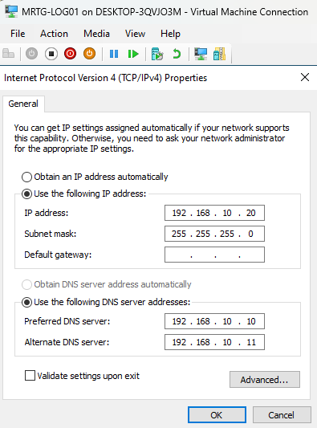

The isolated single-subnet lab did not require a default gateway.

---

### 4. Validated Domain Connectivity

Commands used:

```cmd
ping 192.168.10.10
ping 192.168.10.11
ping MRTG-DC01
ping MRTG-DC02
nslookup mrtg.local
nltest /dsgetdc:mrtg.local
```


The tests confirmed IP connectivity, DNS resolution, and domain controller discovery.

---

### 5. Joined MRTG-LOG01 to the Domain

`MRTG-LOG01` was joined to:

```text
mrtg.local
```

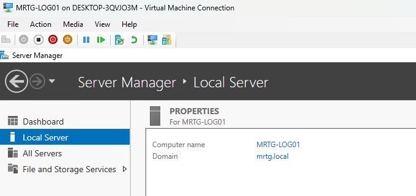

Domain membership allowed the server and sources to use Active Directory authentication for event forwarding.

---

### 6. Configured Windows Event Collector

Command used:

```cmd
wecutil qc
```

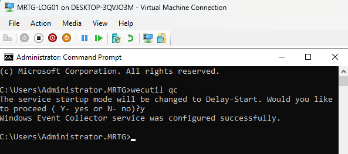

This quick configuration enabled and prepared the Windows Event Collector service.

---

### 7. Verified the Collector Service

Command used:

```cmd
sc query Wecsvc
```

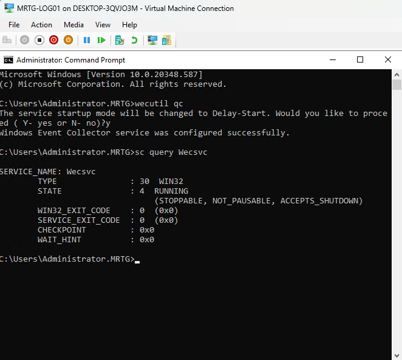

The service reported a running state, confirming that the server was ready to manage subscriptions.

---

### 8. Verified WinRM on MRTG-DC01

Commands used:

```cmd
winrm quickconfig
winrm enumerate winrm/config/listener
```

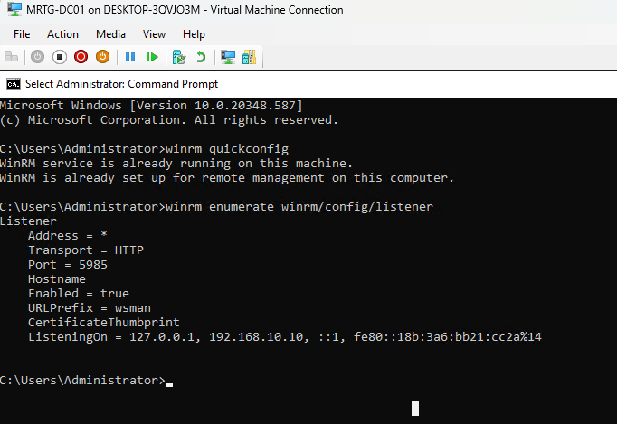

The source had a WinRM listener on HTTP port `5985`.

---

### 9. Verified WinRM on MRTG-DC02

Commands used:

```cmd
winrm quickconfig
winrm enumerate winrm/config/listener
```


Both domain controllers were prepared for Windows Event Forwarding communication.

---

### 10. Created the Event-Forwarding GPO

GPO name:

```text
MRTG-GPO-Centralized-Event-Forwarding
```


A dedicated GPO kept the forwarding configuration separate from default domain controller policy.

---

### 11. Configured the Subscription Manager

Subscription Manager value:

```text
Server=http://MRTG-LOG01.mrtg.local:5985/wsman/SubscriptionManager/WEC,Refresh=60
```


This directed the source computers to check `MRTG-LOG01` for source-initiated subscriptions every 60 seconds.

---

### 12. Linked the GPO to the Domain Controllers OU

The event-forwarding GPO was linked to the Domain Controllers OU.


This limited the policy scope to the domain controller computer accounts.

---

### 13. Applied and Verified the GPO

Commands used on both domain controllers:

```cmd
gpupdate /force
gpresult /r
```


This confirmed that both sources received the Subscription Manager configuration.

---

### 14. Opened Event Viewer Subscriptions

Event Viewer was opened on `MRTG-LOG01`, and the Subscriptions node was reviewed.

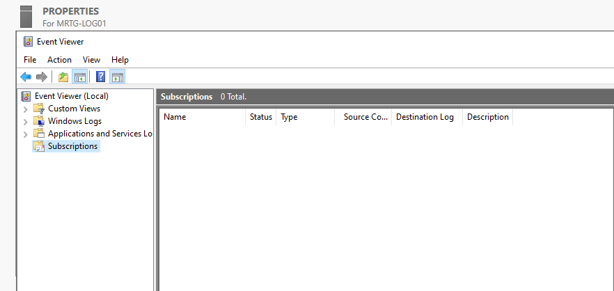

---

### 15. Created the Identity Event Subscription

| Setting | Value |
|---|---|
| Subscription Name | `MRTG-Identity-Security-Events` |
| Destination Log | `Forwarded Events` |
| Subscription Type | Source computer initiated |

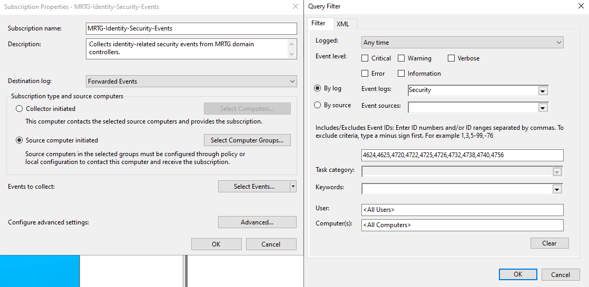

The subscription filter selected the identity-related Security event IDs documented in this lab.

The authorized source-computer configuration allowed the two domain controllers to participate in the subscription.

---

### 16. Confirmed the Subscription

The completed subscription appeared in Event Viewer.


This confirmed that the collector-side subscription existed.

---

### 17. Configured Source Event-Log Access

The `Network Service` identity was added to Event Log Readers on the source domain controllers.

```cmd
net localgroup "Event Log Readers" "Network Service" /add
```

WinRM was restarted on both source computers.

```cmd
net stop winrm
net start winrm
```


This allowed the forwarding service to read the selected Security events.

Because domain controllers do not have a local SAM database, built-in group changes on a domain controller affect the corresponding domain built-in group and should be reviewed carefully.

---

### 18. Validated Subscription Runtime Status

The subscription runtime status showed both sources as active.

| Source | Status |
|---|---|
| `MRTG-DC01.mrtg.local` | Active |
| `MRTG-DC02.mrtg.local` | Active |

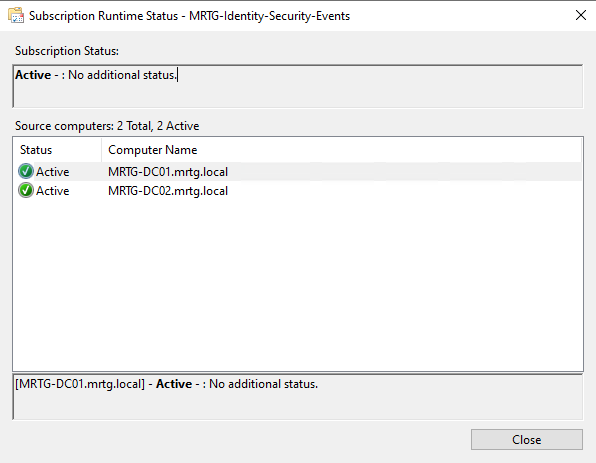

This confirmed that both domain controllers were checking in with the collector.

---

### 19. Validated the Forwarded Events Log

The Forwarded Events log began receiving Security events.

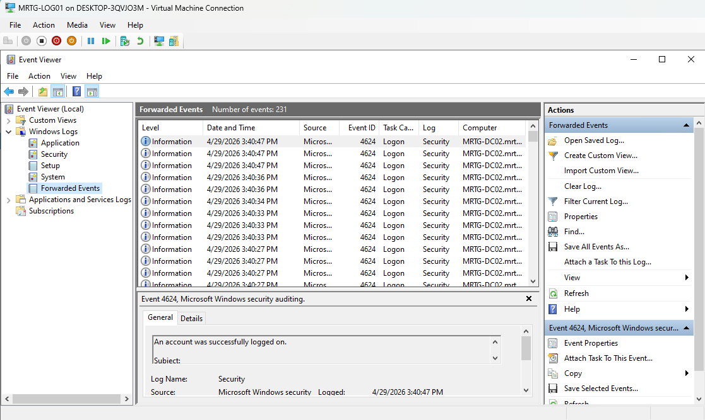

This confirmed end-to-end event forwarding.

---

### 20. Validated a Forwarded Account-Lockout Event

Event ID:

```text
4740
```

Windows description:

```text
A user account was locked out.
```


This confirmed centralized collection of account-lockout activity.

---

### 21. Created a Test User

A controlled test user was created in Active Directory.

Expected event ID:

```text
4720
```

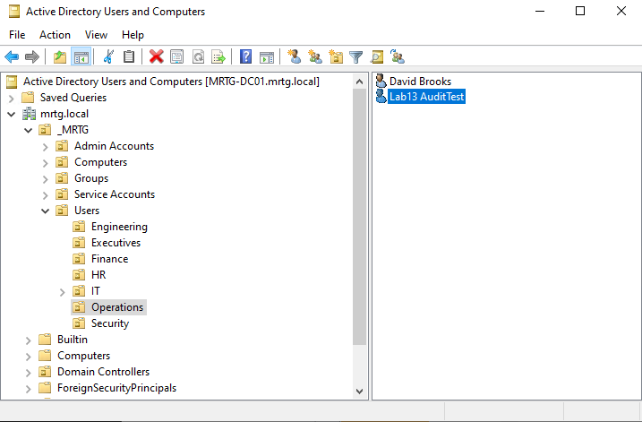

---

### 22. Validated the Forwarded User-Creation Event

The Forwarded Events log contained Event ID `4720`.


This confirmed centralized collection of user-provisioning activity.

---

### 23. Disabled the Test User

The controlled test user was disabled.

Expected event ID:

```text
4725
```

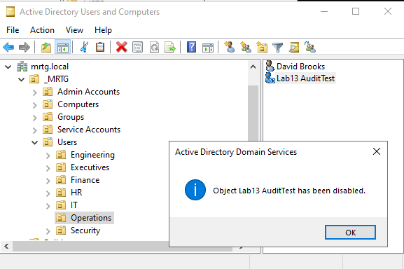

---

### 24. Validated the Forwarded User-Disablement Event

The Forwarded Events log contained Event ID `4725`.

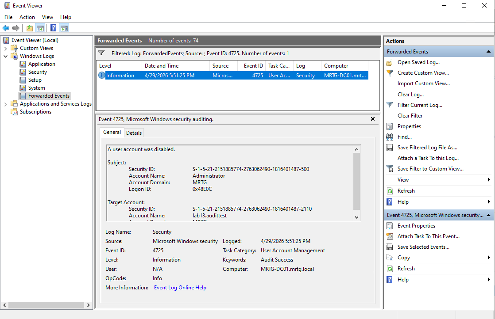

This confirmed centralized collection of account-disablement activity.

---

### 25. Reviewed the Centralized Identity Events

A final Forwarded Events view showed multiple identity-related events from the source domain controllers.


The centralized view reduced the need to review each source log separately.

---

### 26. Created the Final Lab Checkpoint

Checkpoint name:

```text
MRTG-LOG01_Post-Lab13-WEF-Identity-Events-Validated
```

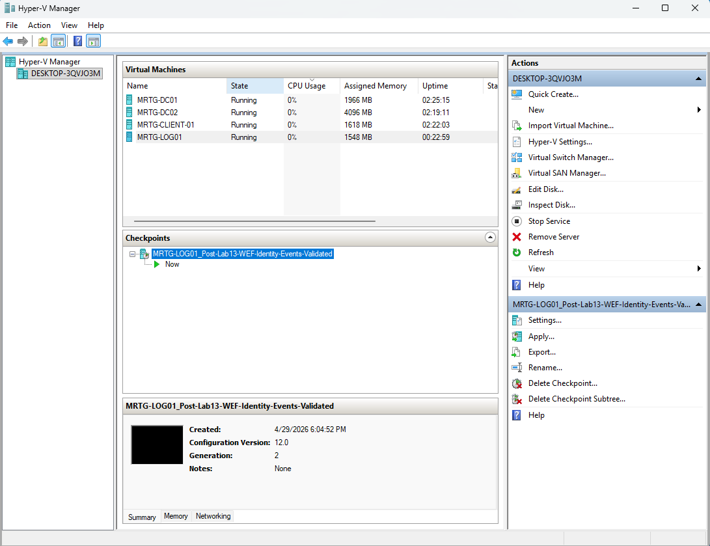

This created a temporary lab recovery point after validation. It was not treated as a log backup or long-term retention mechanism.

---

## Security and IAM Relevance

Domain controllers generate high-value identity events involving authentication, account management, group membership, and lockouts.

Centralized collection supports:

- Identity activity visibility
- Account-lifecycle monitoring
- Account-lockout investigation
- Cross-domain-controller review
- Administrative accountability
- Incident investigation
- Audit evidence collection
- Preparation for SIEM ingestion

Windows Event Forwarding centralizes selected records but does not provide full SIEM capabilities such as correlation, analytics, alerting, dashboards, or long-term retention by itself.

---

## Risks Addressed

This lab reduces the risk of:

- Identity events remaining isolated on individual domain controllers
- Slow review across multiple source systems
- Missed account-lifecycle activity
- Weak account-lockout visibility
- Inconsistent event collection
- Limited evidence during investigation
- Poor preparation for centralized monitoring

The lab does not eliminate the risk of collector failure, log tampering, insufficient retention, or incomplete event selection.

---

## Control Mapping

| Control Area | Lab Contribution |
|---|---|
| Centralized Logging | Collects selected events from both domain controllers |
| Identity Monitoring | Collects authentication and account-lifecycle events |
| Account-Lockout Visibility | Validates Event ID `4740` |
| Account Lifecycle | Validates Event IDs `4720` and `4725` |
| Group Policy Enforcement | Configures source Subscription Manager settings |
| Source Validation | Confirms both domain controllers as active sources |
| Audit Readiness | Stores selected Security events in one location |
| SIEM Preparation | Establishes a centralized Windows event source for later ingestion |

---

## Validation Results

| Validation Item | Result |
|---|---|
| `MRTG-LOG01` created and running | Passed |
| Static IP and DNS configured | Passed |
| Domain connectivity validated | Passed |
| `MRTG-LOG01` joined to `mrtg.local` | Passed |
| Windows Event Collector configured | Passed |
| Windows Event Collector service running | Passed |
| WinRM listener confirmed on `MRTG-DC01` | Passed |
| WinRM listener confirmed on `MRTG-DC02` | Passed |
| Event-forwarding GPO created | Passed |
| Subscription Manager configured | Passed |
| GPO linked to Domain Controllers OU | Passed |
| GPO applied to both domain controllers | Passed |
| Source-initiated subscription created | Passed |
| Identity event filter configured | Passed |
| Source event-log access configured | Passed |
| Both domain controllers active in runtime status | Passed |
| Forwarded Events log populated | Passed |
| Event ID `4740` collected | Passed |
| Event ID `4720` collected | Passed |
| Event ID `4725` collected | Passed |
| Temporary final checkpoint created | Passed |

---

## Evidence Collected

| Evidence | File |
|---|---|
| Logging server VM | `screenshots/lab-13-01-log01-created-and-running.png` |
| Logging server name | `screenshots/lab-13-02-log01-server-renamed.png` |
| Static IP and DNS configuration | `screenshots/lab-13-03-log01-static-ip-dns-configured.png` |
| Domain connectivity | `screenshots/lab-13-04-log01-domain-connectivity-validated.png` |
| Domain membership | `screenshots/lab-13-05-log01-domain-membership-confirmed.png` |
| Windows Event Collector configuration | `screenshots/lab-13-06-windows-event-collector-configured.png` |
| Collector service status | `screenshots/lab-13-07-windows-event-collector-service-running.png` |
| MRTG-DC01 WinRM configuration | `screenshots/lab-13-08-winrm-enabled-on-dc01.png` |
| MRTG-DC02 WinRM configuration | `screenshots/lab-13-09-winrm-enabled-on-dc02.png` |
| Event-forwarding GPO | `screenshots/lab-13-10-centralized-event-forwarding-gpo-created.png` |
| Subscription Manager policy | `screenshots/lab-13-11-subscription-manager-configured-in-gpo.png` |
| Domain Controllers OU link | `screenshots/lab-13-12-gpo-linked-to-domain-controllers-ou.png` |
| GPO application | `screenshots/lab-13-13-event-forwarding-gpo-applied-to-domain-controllers.png` |
| Event Viewer Subscriptions | `screenshots/lab-13-14-event-viewer-subscriptions-opened-on-log01.png` |
| Source-initiated subscription | `screenshots/lab-13-15-identity-security-event-subscription-created.png` |
| Active subscription | `screenshots/lab-13-16-identity-security-event-subscription-visible.png` |
| Source event-log access | `screenshots/lab-13-17-network-service-added-and-winrm-restarted-on-dcs.png` |
| Subscription runtime status | `screenshots/lab-13-18-subscription-runtime-status-shows-source-dcs.png` |
| Forwarded Events log | `screenshots/lab-13-19-forwarded-events-log-visible-on-log01.png` |
| Forwarded account lockout | `screenshots/lab-13-20-forwarded-4740-account-lockout-event-collected.png` |
| Test-user creation | `screenshots/lab-13-21-test-user-created-in-aduc.png` |
| Forwarded user creation | `screenshots/lab-13-22-forwarded-4720-user-created-event-collected.png` |
| Test-user disablement | `screenshots/lab-13-23-test-user-disabled-in-aduc.png` |
| Forwarded user disablement | `screenshots/lab-13-24-forwarded-4725-user-disabled-event-collected.png` |
| Centralized identity-event view | `screenshots/lab-13-25-centralized-identity-events-collected-on-log01.png` |
| Final lab checkpoint | `screenshots/lab-13-26-final-lab13-checkpoint-created.png` |

---

## What I Would Improve in Production

In a production environment, I would:

- Use multiple collectors or a resilient collector design
- Forward collected events to a SIEM
- Define log-retention and archive requirements
- Increase log size based on event volume
- Protect collector access with least privilege
- Restrict and monitor changes to subscriptions
- Use HTTPS where required by policy or trust design
- Add Kerberos and credential-validation event IDs
- Add global and privileged group-management events
- Tune subscriptions to balance coverage and volume
- Use separate baseline and high-priority subscriptions
- Monitor source heartbeat and forwarding latency
- Alert when a source stops forwarding
- Protect logs from unauthorized modification
- Synchronize time across all sources and collectors
- Map important events to response playbooks
- Remove or archive controlled test identities
- Use supported backups instead of Hyper-V checkpoints

---

## Lessons Learned

This lab reinforced that identity events become more useful when they are centralized.

Domain controllers generate high-value Security events, but reviewing each server independently does not scale.

The primary takeaway is that successful WEF deployment requires more than enabling WinRM. The collector service, source policy, subscription permissions, event-log access, runtime status, and end-to-end event delivery must all be validated.

Windows Event Forwarding provides a practical native collection layer before adding SIEM analytics and alerting.

---

## Outcome

Lab 13 successfully implemented centralized Windows Event Forwarding for selected identity events.

The lab confirmed that:

- `MRTG-LOG01` was configured as a Windows Event Collector
- The server joined `mrtg.local`
- WinRM was available on both domain controllers
- Event forwarding was configured through Group Policy
- A source-initiated subscription was created
- Both domain controllers appeared as active sources
- The Forwarded Events log received Security events
- Event ID `4740` recorded an account lockout
- Event ID `4720` recorded user creation
- Event ID `4725` recorded user disablement

The environment now has a validated centralized event-collection layer for both domain controllers and is prepared for later SIEM integration.

---

## Next Lab

[Lab 14: Active Directory Sites and Services for Replication Topology](../Lab-14-Active-Directory-Sites-and-Services-for-Replication-Topology/)

Lab 14 configures Active Directory Sites and Services to document site placement, subnet mapping, and replication topology for the multi-domain-controller environment.
