# Lab-14 — Active Directory Sites and Services for Replication Topology


## Lab Overview

This lab configures Active Directory Sites and Services for the MRTG Active Directory environment.

The purpose of this lab is to improve directory topology by renaming the default Active Directory site, mapping the lab subnet to that site, validating site-aware domain controller discovery, and confirming replication health after the site configuration.

In this lab, the default site was renamed to `MRTG-HQ-Site`, the `192.168.10.0/24` subnet was associated with that site, and both domain controllers were validated as site-aware members of the same Active Directory site.

This lab builds on the previous multi-domain-controller environment by organizing domain controllers into a cleaner enterprise-style site topology.

---

## Objectives

- Review the existing Active Directory Sites and Services topology
- Rename the default Active Directory site
- Associate the lab subnet with the renamed site
- Review the default IP site link
- Validate site awareness from both domain controllers
- Validate site-aware domain controller discovery
- Confirm domain controller site membership using PowerShell
- Validate Active Directory replication health after site configuration
- Confirm DNS site records exist for the renamed site
- Create final Hyper-V checkpoints for rollback

---

## Environment

| Component | Value |
|---|---|
| Hypervisor | Hyper-V |
| Domain | `mrtg.local` |
| Primary Domain Controller | `MRTG-DC01` |
| Additional Domain Controller | `MRTG-DC02` |
| Operating System | Windows Server 2022 Standard Evaluation |
| Network | `MRTG-Internal` |

---

## IP Addressing

| System | IP Address | Role |
|---|---:|---|
| `MRTG-DC01` | `192.168.10.10` | Primary domain controller / DNS / Global Catalog |
| `MRTG-DC02` | `192.168.10.11` | Additional domain controller / DNS / Global Catalog |

---

## Site Design

| Active Directory Site | Subnet | Domain Controllers |
|---|---|---|
| `MRTG-HQ-Site` | `192.168.10.0/24` | `MRTG-DC01`, `MRTG-DC02` |

This lab intentionally keeps both domain controllers in the same site because both systems are on the same `192.168.10.0/24` subnet.

---

## Architecture

Before this lab, the domain controllers were assigned to the default Active Directory site.

```text
Sites
└── Default-First-Site-Name
    └── Servers
        ├── MRTG-DC01
        └── MRTG-DC02
```

After this lab, the default site was renamed and the subnet was mapped to the site.

```text
Sites
├── Subnets
│   └── 192.168.10.0/24 → MRTG-HQ-Site
└── MRTG-HQ-Site
    └── Servers
        ├── MRTG-DC01
        └── MRTG-DC02
```

This improves site awareness and provides a cleaner foundation for future multi-site replication labs.

---

## Phase 1 — Baseline Active Directory Sites and Services

Active Directory Sites and Services was opened on `MRTG-DC01`.

The baseline view showed both domain controllers under the default site.

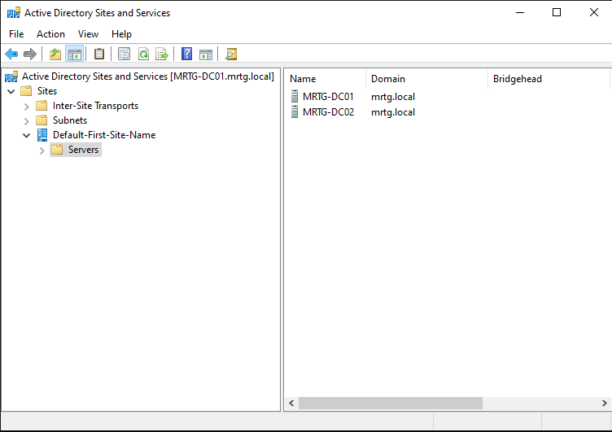

Baseline site:

```text
Default-First-Site-Name
```

Domain controllers present:

```text
MRTG-DC01
MRTG-DC02
```

---

## Phase 2 — Rename the Default Site

The default Active Directory site was renamed to:

```text
MRTG-HQ-Site
```

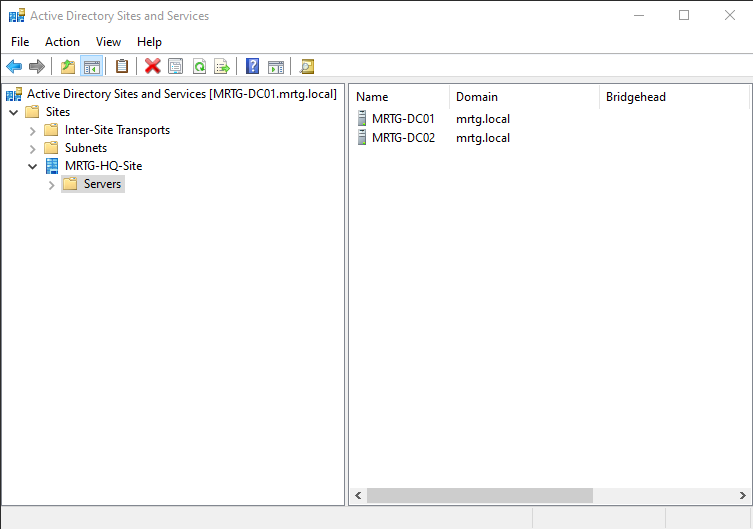

This gives the environment a clearer enterprise-style site name instead of leaving the default placeholder name.

---

## Phase 3 — Create and Associate the AD Subnet

A new subnet object was created in Active Directory Sites and Services.

Subnet prefix:

```text
192.168.10.0/24
```

Site object:

```text
MRTG-HQ-Site
```

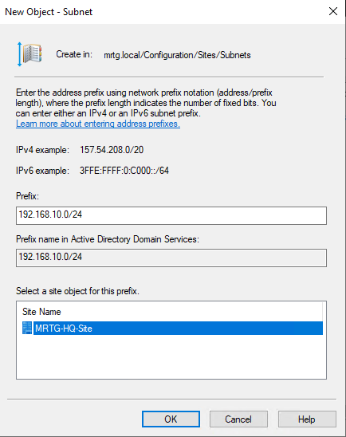

The subnet was then confirmed under the Subnets container and associated with `MRTG-HQ-Site`.

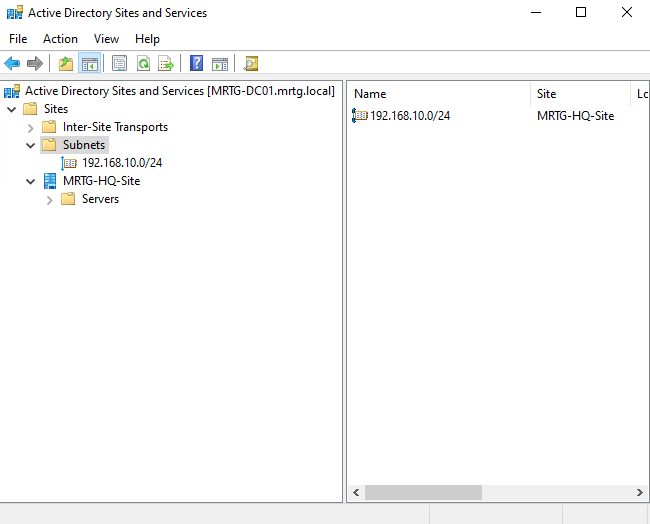

This allows Active Directory to map systems on the `192.168.10.0/24` network to the correct site.

---

## Phase 4 — Review the Default Site Link

The default IP site link was reviewed under:

```text
Sites
└── Inter-Site Transports
    └── IP
        └── DEFAULTIPSITELINK
```

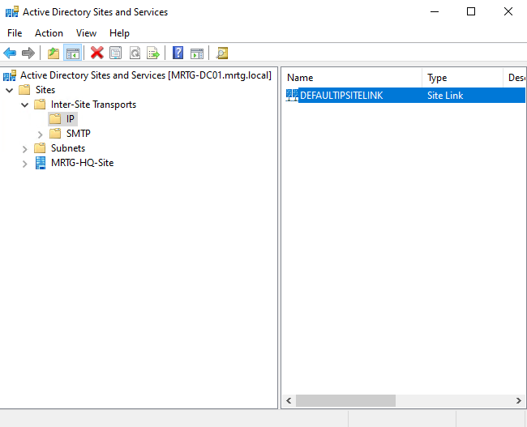

Because this lab uses a single Active Directory site, no site link changes were required.

---

## Phase 5 — Validate Site Awareness

Site awareness was validated from `MRTG-DC01`.

Command used:

```cmd
nltest /dsgetsite
```

Expected result:

```text
MRTG-HQ-Site
The command completed successfully
```

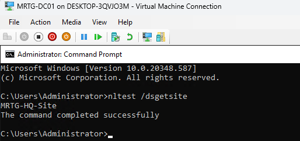

Site awareness was also validated from `MRTG-DC02`.

Command used:

```cmd
nltest /dsgetsite
```

Expected result:

```text
MRTG-HQ-Site
The command completed successfully
```

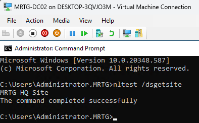

Both domain controllers correctly identified their Active Directory site as `MRTG-HQ-Site`.

---

## Phase 6 — Validate Site-Aware Domain Controller Discovery

Domain controller discovery was validated using `nltest`.

Command used:

```cmd
nltest /dsgetdc:mrtg.local
```

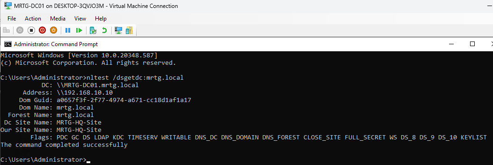

The output confirmed:

```text
DC Site Name: MRTG-HQ-Site
Our Site Name: MRTG-HQ-Site
The command completed successfully
```

This proves domain controller discovery is aware of the renamed site and subnet mapping.

---

## Phase 7 — Confirm Domain Controller Site Membership

PowerShell was used to confirm domain controller site membership.

Command used:

```powershell
Get-ADDomainController -Filter * | Select-Object HostName,Site,IPv4Address,IsGlobalCatalog
```

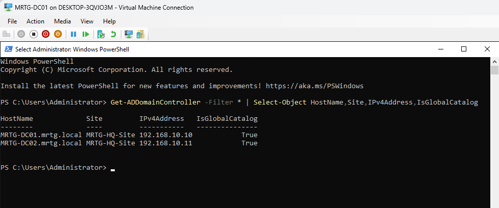

Both domain controllers were shown in `MRTG-HQ-Site`.

| Domain Controller | Site | IP Address | Global Catalog |
|---|---|---:|---|
| `MRTG-DC01.mrtg.local` | `MRTG-HQ-Site` | `192.168.10.10` | `True` |
| `MRTG-DC02.mrtg.local` | `MRTG-HQ-Site` | `192.168.10.11` | `True` |

---

## Phase 8 — Validate Replication Health

Replication health was checked after the site and subnet configuration.

Command used:

```cmd
repadmin /replsummary
```

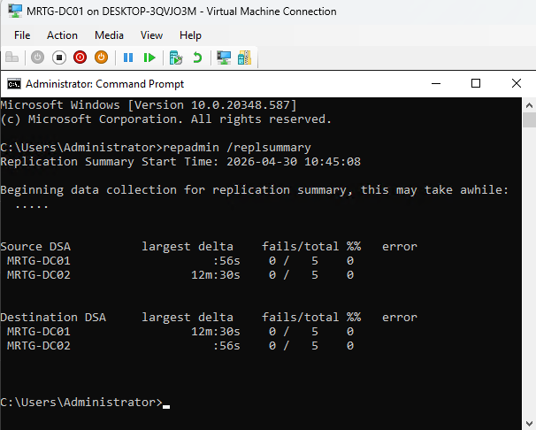

The replication summary showed zero failures.

```text
MRTG-DC01    0 / 5    0%
MRTG-DC02    0 / 5    0%
```

Additional replication validation was performed with `repadmin /showrepl`.

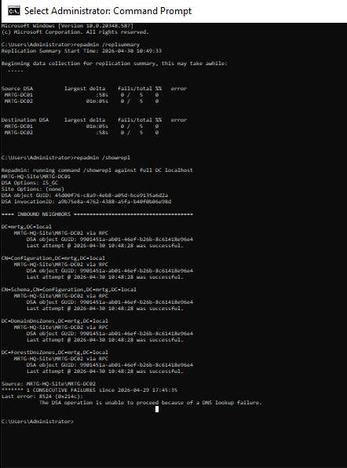

A previous DNS lookup failure was observed during validation but cleared after DNS registration, KCC recalculation, and replication synchronization. The final replication summary showed zero failures between `MRTG-DC01` and `MRTG-DC02`.

Replication diagnostics were also checked.

Command used:

```cmd
dcdiag /test:replications /q
```

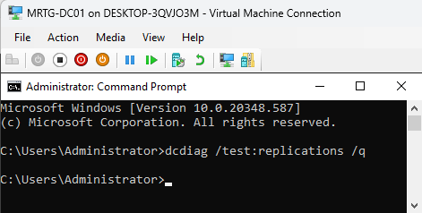

No output was returned, which indicates no replication errors were detected by that test.

---

## Phase 9 — Validate DNS Site Records

DNS Manager was used to confirm that site-aware DNS records existed for the renamed site.

Path reviewed:

```text
Forward Lookup Zones
└── _msdcs.mrtg.local
    └── dc
        └── _sites
            └── MRTG-HQ-Site
```

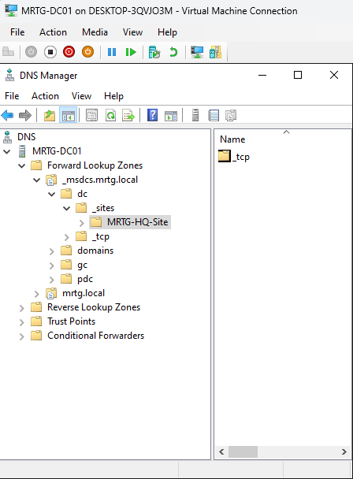

This confirms that Active Directory DNS is publishing site-aware records for `MRTG-HQ-Site`.

---

## Phase 10 — Final Active Directory Sites and Services Validation

The final Active Directory Sites and Services view showed the completed site and subnet configuration.

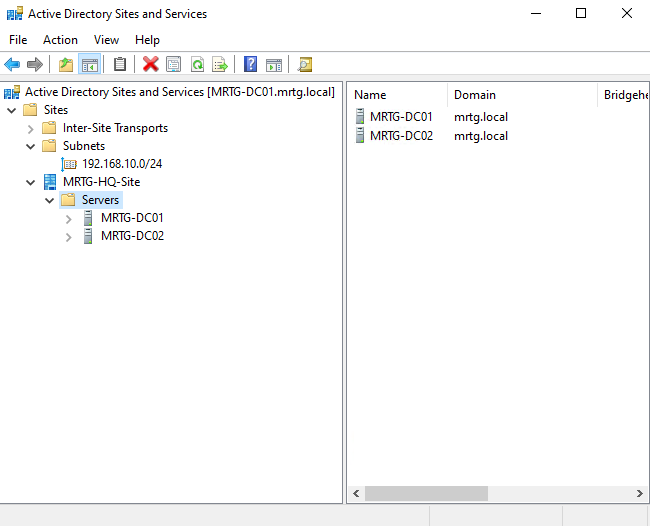

Final topology:

```text
Sites
├── Subnets
│   └── 192.168.10.0/24
└── MRTG-HQ-Site
    └── Servers
        ├── MRTG-DC01
        └── MRTG-DC02
```

This confirmed that both domain controllers were assigned to the correct site and the subnet mapping was present.

---

## Phase 11 — Final Hyper-V Checkpoints

A final checkpoint was created for `MRTG-DC01`.

Checkpoint name:

```text
MRTG-DC01_Post-Lab14_AD-Sites-and-Services-Validated
```

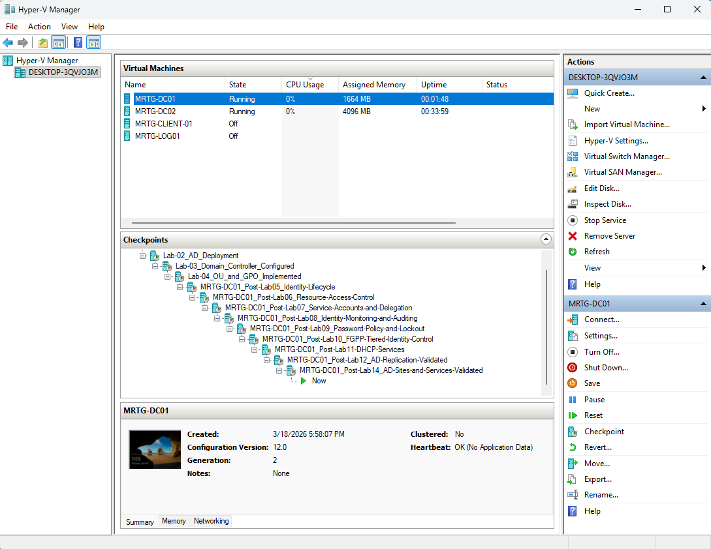

A final checkpoint was also created for `MRTG-DC02`.

Checkpoint name:

```text
MRTG-DC02_Post-Lab14_AD-Sites-and-Services-Validated
```

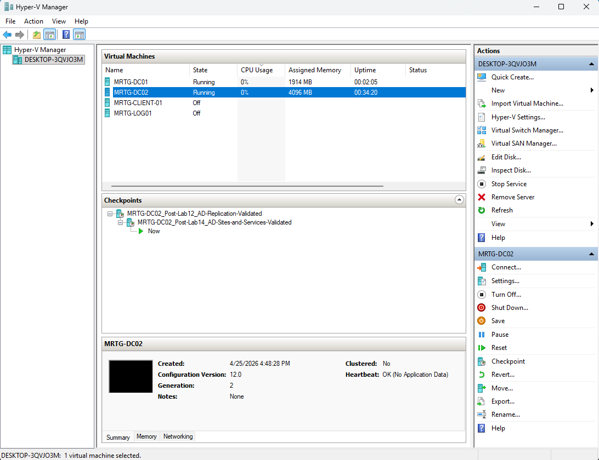

---

## Validation Summary

| Validation Check | Result |
|---|---|
| Baseline AD site topology reviewed | Passed |
| Default site renamed to `MRTG-HQ-Site` | Passed |
| Subnet `192.168.10.0/24` created | Passed |
| Subnet associated with `MRTG-HQ-Site` | Passed |
| Default IP site link reviewed | Passed |
| `MRTG-DC01` site awareness validated | Passed |
| `MRTG-DC02` site awareness validated | Passed |
| Site-aware DC discovery validated | Passed |
| PowerShell confirmed both DCs in `MRTG-HQ-Site` | Passed |
| Replication summary showed zero failures | Passed |
| `dcdiag /test:replications /q` returned no errors | Passed |
| DNS site records visible under `_msdcs.mrtg.local` | Passed |
| Final AD Sites and Services topology validated | Passed |
| Final checkpoint created for DC01 | Passed |
| Final checkpoint created for DC02 | Passed |

---

## Security and IAM Relevance

Active Directory Sites and Services supports more than replication organization. It also affects authentication flow, domain controller discovery, Group Policy processing, service location, and operational resilience.

In larger environments, systems use subnet mappings to determine the closest or most appropriate domain controller. Poor site and subnet configuration can cause authentication delays, inefficient replication, and unnecessary traffic between locations.

This lab demonstrates several IAM and infrastructure concepts:

- Active Directory site topology
- Subnet-to-site mapping
- Site-aware domain controller discovery
- DNS service location records
- Replication health validation
- Global Catalog placement awareness
- Identity infrastructure organization
- Operational readiness for multi-site environments

For government, defense, and regulated IT environments, clear site topology supports reliable authentication, predictable replication, and stronger identity infrastructure design.

---

## Outcome

Lab-14 configured Active Directory Sites and Services for the MRTG environment by renaming the default AD site to `MRTG-HQ-Site`, mapping the `192.168.10.0/24` subnet to the site, validating site-aware domain controller discovery, confirming both domain controllers were assigned to the correct site, and verifying replication health after the topology update.

Final state:

```text
MRTG-HQ-Site
├── Subnet
│   └── 192.168.10.0/24
└── Servers
    ├── MRTG-DC01
    │   ├── Domain Controller
    │   ├── DNS Server
    │   └── Global Catalog
    └── MRTG-DC02
        ├── Domain Controller
        ├── DNS Server
        └── Global Catalog
```

Active Directory site awareness and replication health were successfully validated.

---

## Next Lab

**Lab-15 — Certificate Services for Identity Infrastructure**

Lab-15 will build on the MRTG identity foundation by introducing Active Directory Certificate Services and preparing the environment for certificate-based identity, trust, and secure internal services.
