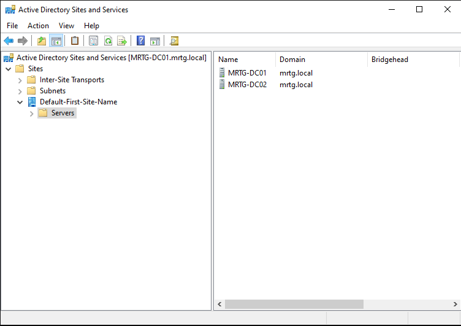
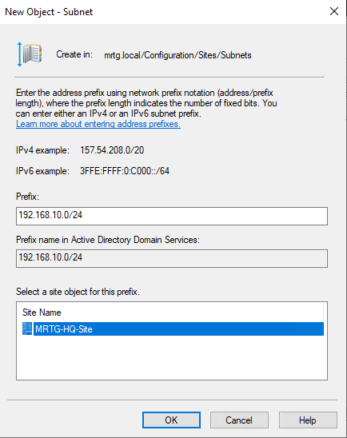
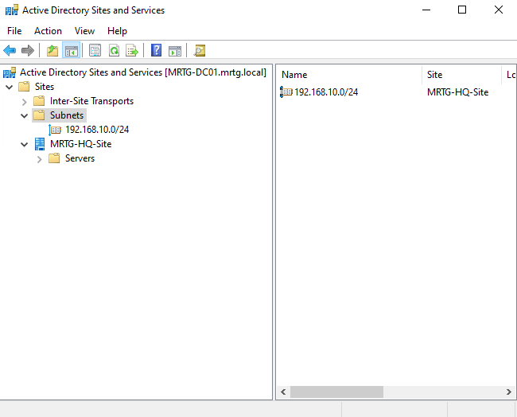
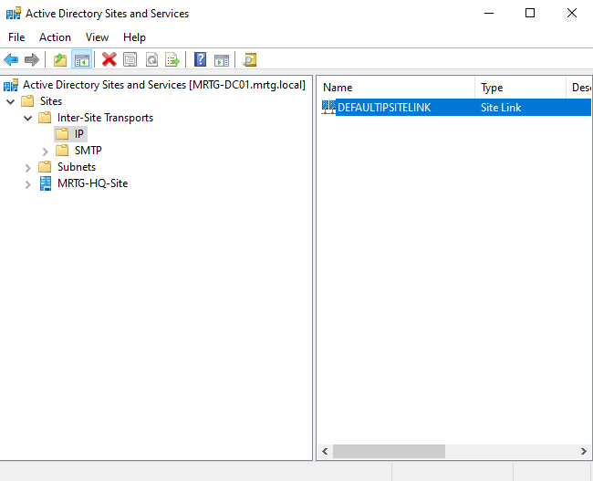
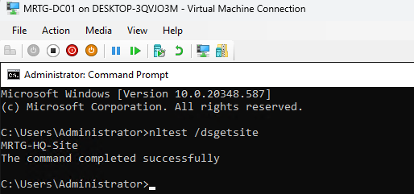
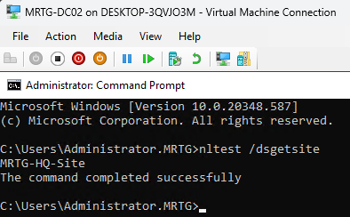
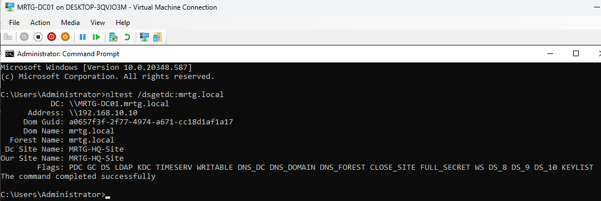
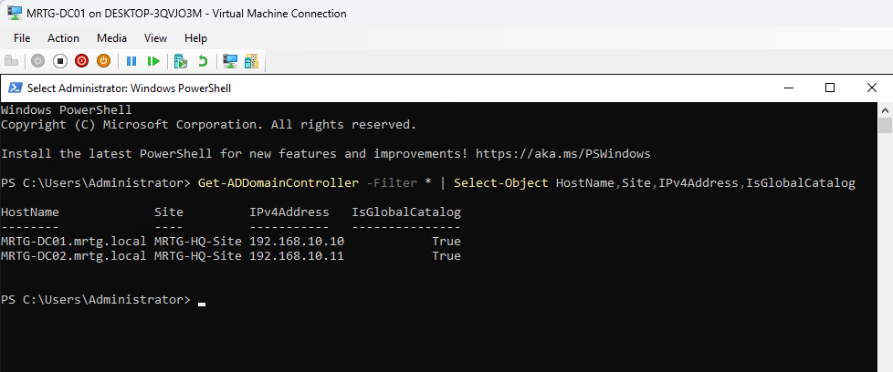
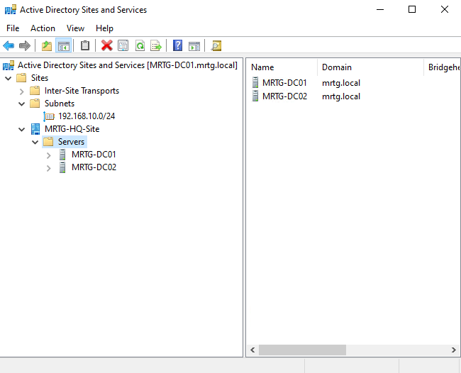

# Lab 14: Active Directory Sites and Services for Replication Topology


---

## Objective

Configure Active Directory Sites and Services for the `mrtg.local` environment.

This lab renames the default Active Directory site, maps the `192.168.10.0/24` subnet to that site, validates site-aware domain controller discovery, confirms DNS site records, and verifies that replication remains healthy.

---

## Business Scenario

Monroe Redstone Technology Group requires a documented Active Directory topology that maps network subnets to the correct site.

Default site naming may be acceptable during initial deployment, but it does not clearly describe the environment. In larger networks, missing or incorrect subnet mappings can cause clients to select less appropriate domain controllers and can complicate replication planning.

This lab addresses the need to:

- Replace the default site name with a descriptive name
- Map the lab subnet to the correct Active Directory site
- Validate domain controller site awareness
- Confirm site-aware domain controller discovery
- Review the default IP site link
- Confirm DNS site records
- Verify replication health after the topology change
- Establish a documented foundation for future multi-site design

---

## Lab Summary

In this lab, I renamed `Default-First-Site-Name` to `MRTG-HQ-Site`.

The `192.168.10.0/24` subnet was then created in Active Directory Sites and Services and associated with the renamed site.

Both domain controllers correctly identified `MRTG-HQ-Site` through `nltest`, and PowerShell confirmed their site membership and Global Catalog status.

Site-aware DNS records were reviewed, and replication health was validated with `repadmin` and `dcdiag`.

Temporary Hyper-V checkpoints were created after the configuration was validated.

---

## Environment

| Component | Details |
|---|---|
| Domain | `mrtg.local` |
| Original Domain Controller | `MRTG-DC01` |
| Additional Domain Controller | `MRTG-DC02` |
| Active Directory Site | `MRTG-HQ-Site` |
| Mapped Subnet | `192.168.10.0/24` |
| Server Operating System | Windows Server 2022 Standard Evaluation |
| Directory Service | Active Directory Domain Services |
| Management Tool | Active Directory Sites and Services |
| Virtual Network | `MRTG-Internal` |
| Hypervisor | Hyper-V |
| Organization | Monroe Redstone Technology Group |

---

## Prerequisites

- Operational `mrtg.local` domain
- Healthy `MRTG-DC01` and `MRTG-DC02`
- Working Active Directory replication
- Active Directory-integrated DNS
- Both domain controllers using addresses in `192.168.10.0/24`
- Administrative access to Active Directory Sites and Services
- Active Directory PowerShell module
- Access to `nltest`, `repadmin`, and `dcdiag`

---

## Scope

### Included

- Baseline site-topology review
- Default site rename
- Subnet object creation
- Subnet-to-site association
- Default IP site-link review
- Site-awareness validation with `nltest /dsgetsite`
- Site-aware domain controller discovery
- PowerShell site-membership validation
- Replication summary review
- Detailed replication review
- Replication diagnostics
- DNS site-record validation
- Final topology review
- Temporary final Hyper-V checkpoints

### Not Included

- Additional physical or logical sites
- Inter-site replication testing
- Site-link cost tuning
- Site-link schedule configuration
- Preferred bridgehead server configuration
- Read-only domain controller deployment
- WAN replication simulation
- Cloud or hybrid identity topology

---

## IP Addressing

| System | Address | Role |
|---|---:|---|
| `MRTG-DC01` | `192.168.10.10` | Domain controller, DNS, and Global Catalog |
| `MRTG-DC02` | `192.168.10.11` | Domain controller, DNS, and Global Catalog |

---

## Site Design

| Active Directory Site | Associated Subnet | Domain Controllers |
|---|---|---|
| `MRTG-HQ-Site` | `192.168.10.0/24` | `MRTG-DC01`, `MRTG-DC02` |

Both domain controllers remain in one site because they are connected to the same well-connected lab subnet.

---

## Architecture

### Before Lab 14

```text
Sites
`-- Default-First-Site-Name
    `-- Servers
        |-- MRTG-DC01
        `-- MRTG-DC02
```

### After Lab 14

```text
Sites
|-- Subnets
|   `-- 192.168.10.0/24 -> MRTG-HQ-Site
|
`-- MRTG-HQ-Site
    `-- Servers
        |-- MRTG-DC01
        `-- MRTG-DC02
```

Renaming the site improves documentation. Creating the subnet mapping allows Active Directory to associate systems on `192.168.10.0/24` with `MRTG-HQ-Site`.

Because the environment contains only one site, this change does not introduce inter-site replication behavior.

---

## Site Awareness Model

| Component | Purpose |
|---|---|
| Active Directory Site | Represents one or more well-connected IP subnets |
| Subnet Object | Maps an IP network to an Active Directory site |
| Domain Controller Site | Identifies the site in which a domain controller provides services |
| DNS Site Records | Publish site-specific service-location records |
| Domain Controller Locator | Helps clients locate an appropriate domain controller |
| Site Link | Defines replication relationships between separate sites |

Site links affect inter-site replication. With only one site, `DEFAULTIPSITELINK` does not carry replication traffic between distinct MRTG sites.

---

## Implementation and Validation

### 1. Reviewed the Baseline Topology

Active Directory Sites and Services was opened on `MRTG-DC01`.

Baseline site:

```text
Default-First-Site-Name
```

Domain controllers:

```text
MRTG-DC01
MRTG-DC02
```



This documented the topology before the changes.

---

### 2. Renamed the Default Site

The default site was renamed to:

```text
MRTG-HQ-Site
```


The descriptive name identifies the site's intended role within the fictional organization.

---

### 3. Created the Subnet Object

Subnet prefix:

```text
192.168.10.0/24
```

Associated site:

```text
MRTG-HQ-Site
```



This created the network-to-site mapping used by Active Directory site discovery.

---

### 4. Confirmed the Subnet Association

The new subnet appeared in the Subnets container and showed its association with `MRTG-HQ-Site`.



This confirmed the completed subnet-to-site mapping.

---

### 5. Reviewed the Default IP Site Link

The default IP site link was reviewed at:

```text
Sites
`-- Inter-Site Transports
    `-- IP
        `-- DEFAULTIPSITELINK
```



No configuration change was required because the environment contained only one Active Directory site.

---

### 6. Validated Site Awareness on MRTG-DC01

Command used:

```cmd
nltest /dsgetsite
```

Validated result:

```text
MRTG-HQ-Site
The command completed successfully.
```



This confirmed that `MRTG-DC01` identified the renamed site.

---

### 7. Validated Site Awareness on MRTG-DC02

Command used:

```cmd
nltest /dsgetsite
```

Validated result:

```text
MRTG-HQ-Site
The command completed successfully.
```



Both domain controllers reported the expected site.

---

### 8. Validated Site-Aware Domain Controller Discovery

Command used:

```cmd
nltest /dsgetdc:mrtg.local
```



Validated output included:

```text
DC Site Name: MRTG-HQ-Site
Our Site Name: MRTG-HQ-Site
The command completed successfully.
```

This confirmed that the Domain Controller Locator process returned site information consistent with the new configuration.

---

### 9. Confirmed Domain Controller Site Membership

Command used:

```powershell
Get-ADDomainController -Filter * |
    Select-Object HostName, Site, IPv4Address, IsGlobalCatalog
```



| Domain Controller | Site | Address | Global Catalog |
|---|---|---:|---|
| `MRTG-DC01.mrtg.local` | `MRTG-HQ-Site` | `192.168.10.10` | `True` |
| `MRTG-DC02.mrtg.local` | `MRTG-HQ-Site` | `192.168.10.11` | `True` |

This confirmed the site placement of both domain controllers.

---

### 10. Validated the Replication Summary

Command used:

```cmd
repadmin /replsummary
```


Validated result:

```text
MRTG-DC01    0 / 5    0%
MRTG-DC02    0 / 5    0%
```

The summary reported zero replication failures.

---

### 11. Reviewed Detailed Replication

Command used:

```cmd
repadmin /showrepl
```


A DNS lookup warning appeared during an earlier validation attempt. The final replication results showed successful inbound replication between the domain controllers.

The warning was documented rather than treated as proof of a replication failure.

---

### 12. Ran Replication Diagnostics

Command used:

```cmd
dcdiag /test:replications /q
```


The quiet-mode command returned no output, indicating that the replication test did not report an error.

---

### 13. Validated DNS Site Records

DNS Manager was used to review site-aware service records.

```text
Forward Lookup Zones
`-- _msdcs.mrtg.local
    `-- dc
        `-- _sites
            `-- MRTG-HQ-Site
```


This confirmed that Active Directory-integrated DNS contained site-specific records for `MRTG-HQ-Site`.

---

### 14. Reviewed the Final Topology

The completed Sites and Services structure showed:

```text
Sites
|-- Subnets
|   `-- 192.168.10.0/24
|
`-- MRTG-HQ-Site
    `-- Servers
        |-- MRTG-DC01
        `-- MRTG-DC02
```



This confirmed the site name, subnet mapping, and domain controller placement.

---

### 15. Created the Final MRTG-DC01 Lab Checkpoint

Checkpoint name:

```text
MRTG-DC01_Post-Lab14_AD-Sites-and-Services-Validated
```


---

### 16. Created the Final MRTG-DC02 Lab Checkpoint

Checkpoint name:

```text
MRTG-DC02_Post-Lab14_AD-Sites-and-Services-Validated
```


The checkpoints created temporary recovery points for the controlled lab. They were not treated as supported Active Directory backups.

---

## Security and IAM Relevance

Active Directory Sites and Services supports identity availability and service discovery by mapping network location to domain infrastructure.

This lab supports:

- Documented site topology
- Subnet-to-site mapping
- Site-aware domain controller discovery
- DNS service-location validation
- Domain controller placement awareness
- Replication health validation
- Preparation for multi-site identity architecture

Site configuration does not directly grant or restrict user access. It supports the reliable delivery of authentication, directory, and policy services.

---

## Risks Addressed

This lab reduces the risk of:

- Undocumented site topology
- Missing subnet-to-site mapping
- Clients receiving incomplete site information
- Confusing default site naming
- Unvalidated DNS site records
- Replication problems going unnoticed after topology changes
- Poor preparation for future multi-site deployment

A single-site lab cannot validate WAN replication, site-link scheduling, site-link costs, or cross-site failover.

---

## Control Mapping

| Control Area | Lab Contribution |
|---|---|
| Site Topology | Replaces the default site name with `MRTG-HQ-Site` |
| Subnet Mapping | Associates `192.168.10.0/24` with the site |
| Domain Controller Discovery | Validates site information with `nltest` |
| Directory Services | Confirms both domain controllers belong to the expected site |
| DNS Service Location | Confirms site records in Active Directory-integrated DNS |
| Replication Health | Validates replication after the site change |
| Audit Readiness | Documents topology and validation evidence |
| Multi-Site Preparation | Establishes the concepts required for future expansion |

---

## Validation Results

| Validation Item | Result |
|---|---|
| Baseline site topology reviewed | Passed |
| Default site renamed to `MRTG-HQ-Site` | Passed |
| Subnet `192.168.10.0/24` created | Passed |
| Subnet associated with `MRTG-HQ-Site` | Passed |
| Default IP site link reviewed | Passed |
| `MRTG-DC01` reported `MRTG-HQ-Site` | Passed |
| `MRTG-DC02` reported `MRTG-HQ-Site` | Passed |
| Site-aware domain controller discovery reviewed | Passed |
| PowerShell confirmed both domain controllers in the site | Passed |
| Replication summary reported zero failures | Passed |
| Detailed replication status reviewed | Passed |
| Replication diagnostic reported no errors | Passed |
| DNS site records confirmed | Passed |
| Final topology reviewed | Passed |
| Temporary final checkpoints created | Passed |

---

## Evidence Collected

| Evidence | File |
|---|---|
| Baseline Sites and Services topology | `screenshots/lab-14-01-ad-sites-and-services-baseline.png` |
| Renamed site | `screenshots/lab-14-02-site-renamed-to-mrtg-hq-site.png` |
| Created subnet | `screenshots/lab-14-03-subnet-created-192-168-10-0-24.png` |
| Subnet-to-site association | `screenshots/lab-14-04-subnet-associated-with-mrtg-hq-site.png` |
| Default IP site link | `screenshots/lab-14-05-default-ip-site-link-reviewed.png` |
| MRTG-DC01 site discovery | `screenshots/lab-14-06-dc01-site-discovery-validated.png` |
| MRTG-DC02 site discovery | `screenshots/lab-14-07-dc02-site-discovery-validated.png` |
| Domain controller discovery | `screenshots/lab-14-08-site-aware-dc-discovery-validated.png` |
| PowerShell site membership | `screenshots/lab-14-09-domain-controllers-site-membership-validated.png` |
| Replication summary | `screenshots/lab-14-10-repadmin-replsummary-successful-after-site-config.png` |
| Detailed replication status | `screenshots/lab-14-11-repadmin-showrepl-validation-after-site-config.png` |
| Replication diagnostics | `screenshots/lab-14-12-dcdiag-replication-test-successful-after-site-config.png` |
| DNS site records | `screenshots/lab-14-13-dns-site-records-visible.png` |
| Final Sites and Services topology | `screenshots/lab-14-14-final-ad-sites-and-services-validated.png` |
| MRTG-DC01 checkpoint | `screenshots/lab-14-15-final-lab14-checkpoint-dc01-created.png` |
| MRTG-DC02 checkpoint | `screenshots/lab-14-16-final-lab14-checkpoint-dc02-created.png` |

---

## What I Would Improve in Production

In a production environment, I would:

- Design sites around real well-connected network boundaries
- Maintain an authoritative subnet inventory
- Map every production subnet to the correct site
- Use formal site and subnet naming standards
- Document domain controller placement
- Design Global Catalog placement around application and sign-in requirements
- Configure site-link costs according to WAN paths
- Configure replication schedules according to business requirements
- Monitor replication health continuously
- Alert on replication failures and latency
- Validate DNS site records regularly
- Review client domain controller selection from each location
- Use formal change management for topology updates
- Use supported backups instead of Hyper-V checkpoints

---

## Lessons Learned

This lab reinforced that Active Directory sites are based on network topology rather than organizational departments.

Sites represent well-connected IP networks. Subnet objects tell Active Directory which systems belong to each site.

The primary takeaway is that configuration must be validated from several perspectives. The site name, subnet mapping, domain controller membership, DNS records, discovery results, and replication health should agree.

A clean single-site design is useful preparation, but real inter-site behavior requires multiple sites and distinct network paths.

---

## Outcome

Lab 14 successfully configured Active Directory Sites and Services for the MRTG environment.

The lab confirmed that:

- The default site was renamed to `MRTG-HQ-Site`
- The `192.168.10.0/24` subnet was created
- The subnet was associated with the renamed site
- Both domain controllers reported the correct site
- Domain controller discovery returned matching site information
- PowerShell confirmed both domain controllers in `MRTG-HQ-Site`
- DNS site records were present
- Replication remained healthy after the change
- The final topology was documented

The environment now has a clear single-site topology and a validated foundation for future multi-site Active Directory design.

---

## Next Lab

[Lab 15: Group Policy Security Baselines for Workstations and Servers](../Lab-15-Group-Policy-Security-Baselines-for-Workstations-and-Servers/)

Lab 15 applies separate Group Policy security baselines to domain-joined workstations and servers.
