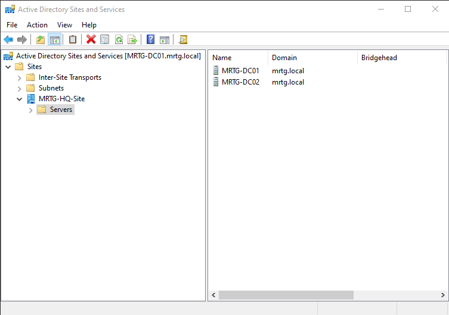
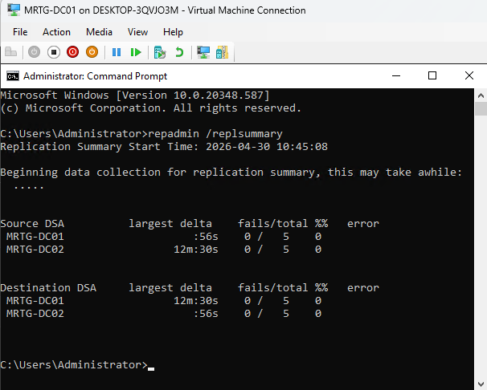
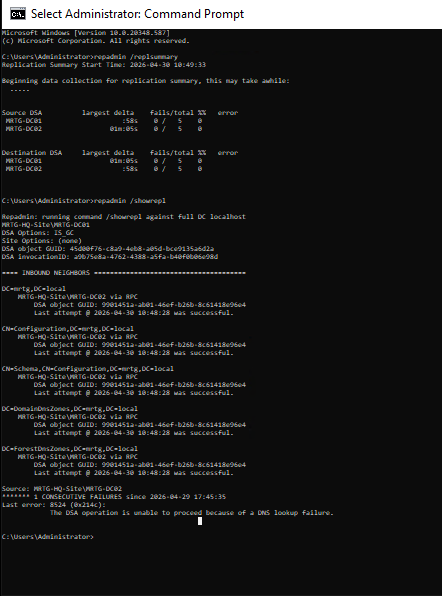
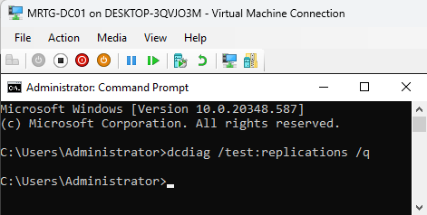
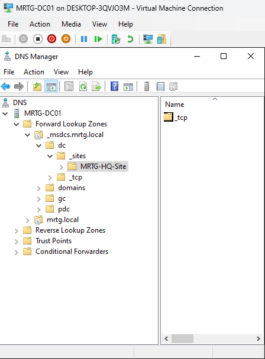
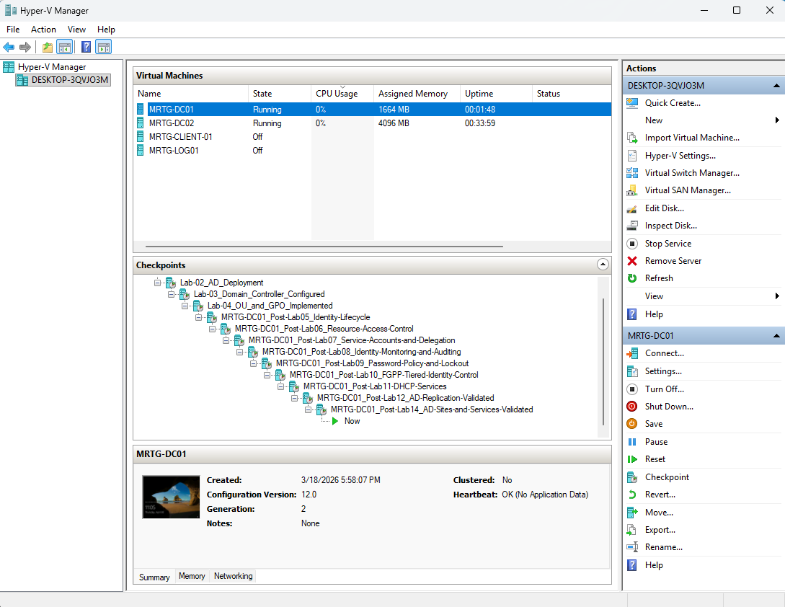
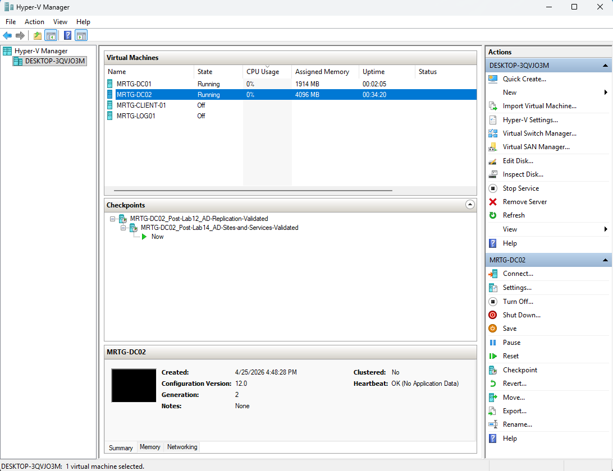

# Lab 14 — Active Directory Sites and Services for Replication Topology


---

## Objective

The objective of this lab is to configure Active Directory Sites and Services for the `mrtg.local` Active Directory environment.

This lab improves directory topology by renaming the default Active Directory site, mapping the lab subnet to that site, validating site-aware domain controller discovery, and confirming replication health after the site configuration.

The focus is on site awareness, subnet-to-site mapping, replication topology organization, DNS site records, and operational readiness for future multi-site environments.

---

## Business Problem

Monroe Redstone Technology Group needs a cleaner Active Directory site topology to support reliable domain controller discovery and replication behavior.

Leaving domain controllers in the default site name works in a small lab, but it does not reflect a structured enterprise environment. In larger environments, poor site and subnet configuration can cause authentication delays, inefficient replication, and unnecessary traffic between locations.

This lab addresses the need to:

- Rename the default Active Directory site
- Map the lab subnet to the correct site
- Validate site-aware domain controller discovery
- Confirm domain controller site membership
- Validate replication health after topology changes
- Confirm DNS site records exist
- Preserve final validated states with Hyper-V checkpoints

---

## Lab Summary

In this lab, I configured Active Directory Sites and Services for the MRTG environment.

The default site was renamed to `MRTG-HQ-Site`, and the `192.168.10.0/24` subnet was associated with that site.

I validated site awareness from both domain controllers, confirmed site-aware domain controller discovery with `nltest`, verified site membership with PowerShell, checked replication health with `repadmin` and `dcdiag`, confirmed DNS site records, and created final Hyper-V checkpoints for both domain controllers.

---

## Environment

| Component | Details |
|---|---|
| Domain | `mrtg.local` |
| Primary Domain Controller | `MRTG-DC01` |
| Additional Domain Controller | `MRTG-DC02` |
| Hypervisor | Hyper-V |
| Network | `MRTG-Internal` |
| Operating System | Windows Server 2022 Standard Evaluation |
| Directory Service | Active Directory Domain Services |
| Management Tool | Active Directory Sites and Services |
| Lab Organization | Monroe Redstone Technology Group |

---

## Scope

### Included

- Baseline Active Directory site topology review
- Default site rename
- Subnet object creation
- Subnet-to-site association
- Default IP site link review
- Site awareness validation with `nltest /dsgetsite`
- Site-aware domain controller discovery with `nltest /dsgetdc`
- Domain controller site membership validation with PowerShell
- Replication validation with `repadmin`
- Replication diagnostics with `dcdiag`
- DNS site record validation
- Final Active Directory Sites and Services validation
- Final Hyper-V checkpoints for both domain controllers

### Not Included

- Multi-site Active Directory design
- Additional physical site deployment
- Site link cost tuning
- Site link schedule configuration
- Bridgehead server configuration
- Read-only domain controller deployment
- WAN replication modeling
- Cloud or hybrid identity site topology

---

## IP Addressing

| System | IP Address | Role |
|---|---:|---|
| `MRTG-DC01` | `192.168.10.10` | Primary domain controller, DNS, Global Catalog |
| `MRTG-DC02` | `192.168.10.11` | Additional domain controller, DNS, Global Catalog |

---

## Site Design

| Active Directory Site | Subnet | Domain Controllers |
|---|---|---|
| `MRTG-HQ-Site` | `192.168.10.0/24` | `MRTG-DC01`, `MRTG-DC02` |

Both domain controllers remain in the same Active Directory site because both systems are on the same `192.168.10.0/24` subnet.

---

## Architecture

Before this lab, the domain controllers were assigned to the default Active Directory site.

```text
Sites
└── Default-First-Site-Name
    └── Servers
        ├── MRTG-DC01
        └── MRTG-DC02
```

After this lab, the default site was renamed and the lab subnet was mapped to the site.

```text
Sites
├── Subnets
│   └── 192.168.10.0/24 → MRTG-HQ-Site
└── MRTG-HQ-Site
    └── Servers
        ├── MRTG-DC01
        └── MRTG-DC02
```

This creates a cleaner foundation for future multi-site replication labs.

---

## Site Awareness Model

Active Directory uses sites and subnets to help clients and domain controllers understand network location.

| Component | Purpose |
|---|---|
| Site | Represents a network location or logical AD topology boundary |
| Subnet | Maps IP address ranges to an Active Directory site |
| Domain Controller Site Membership | Helps clients locate an appropriate domain controller |
| DNS Site Records | Publish site-aware domain controller service records |
| Replication Topology | Helps AD organize replication paths and behavior |

This lab keeps the environment simple while introducing the real enterprise concept of site-aware identity infrastructure.

---

## Implementation and Validation

### 1. Baseline Active Directory Sites and Services Reviewed

Active Directory Sites and Services was opened on `MRTG-DC01`.

The baseline view showed both domain controllers under the default site.

Baseline site:

```text
Default-First-Site-Name
```

Domain controllers present:

```text
MRTG-DC01
MRTG-DC02
```


---

### 2. Default Site Renamed

The default Active Directory site was renamed to:

```text
MRTG-HQ-Site
```



This replaced the default placeholder name with a clearer enterprise-style site name.

---

### 3. Subnet Object Created

A new subnet object was created in Active Directory Sites and Services.

Subnet prefix:

```text
192.168.10.0/24
```

Site object:

```text
MRTG-HQ-Site
```


This allows Active Directory to map systems on the lab subnet to the correct site.

---

### 4. Subnet Associated with MRTG-HQ-Site

The subnet was confirmed under the Subnets container and associated with `MRTG-HQ-Site`.


This completed the subnet-to-site mapping.

---

### 5. Default IP Site Link Reviewed

The default IP site link was reviewed under:

```text
Sites
└── Inter-Site Transports
    └── IP
        └── DEFAULTIPSITELINK
```


Because this lab uses a single Active Directory site, no site link changes were required.

---

### 6. DC01 Site Awareness Validated

Site awareness was validated from `MRTG-DC01`.

Command used:

```cmd
nltest /dsgetsite
```

Expected result:

```text
MRTG-HQ-Site
The command completed successfully
```


---

### 7. DC02 Site Awareness Validated

Site awareness was validated from `MRTG-DC02`.

Command used:

```cmd
nltest /dsgetsite
```

Expected result:

```text
MRTG-HQ-Site
The command completed successfully
```


Both domain controllers correctly identified their Active Directory site as `MRTG-HQ-Site`.

---

### 8. Site-Aware Domain Controller Discovery Validated

Domain controller discovery was validated using `nltest`.

Command used:

```cmd
nltest /dsgetdc:mrtg.local
```


The output confirmed:

```text
DC Site Name: MRTG-HQ-Site
Our Site Name: MRTG-HQ-Site
The command completed successfully
```

This confirmed site-aware domain controller discovery.

---

### 9. Domain Controller Site Membership Confirmed

PowerShell was used to confirm domain controller site membership.

Command used:

```powershell
Get-ADDomainController -Filter * | Select-Object HostName,Site,IPv4Address,IsGlobalCatalog
```


Validation confirmed:

| Domain Controller | Site | IP Address | Global Catalog |
|---|---|---:|---|
| `MRTG-DC01.mrtg.local` | `MRTG-HQ-Site` | `192.168.10.10` | `True` |
| `MRTG-DC02.mrtg.local` | `MRTG-HQ-Site` | `192.168.10.11` | `True` |

---

### 10. Replication Summary Validated

Replication health was checked after the site and subnet configuration.

Command used:

```cmd
repadmin /replsummary
```



The replication summary showed zero failures.

```text
MRTG-DC01    0 / 5    0%
MRTG-DC02    0 / 5    0%
```

---

### 11. Detailed Replication Validation Performed

Additional replication validation was performed with:

```cmd
repadmin /showrepl
```



A previous DNS lookup failure was observed during validation but cleared after DNS registration, KCC recalculation, and replication synchronization.

The final replication summary showed zero failures between `MRTG-DC01` and `MRTG-DC02`.

---

### 12. Replication Diagnostics Validated

Replication diagnostics were checked with:

```cmd
dcdiag /test:replications /q
```



No output was returned, which indicates no replication errors were detected by that test.

---

### 13. DNS Site Records Validated

DNS Manager was used to confirm that site-aware DNS records existed for the renamed site.

Path reviewed:

```text
Forward Lookup Zones
└── _msdcs.mrtg.local
    └── dc
        └── _sites
            └── MRTG-HQ-Site
```



This confirmed that Active Directory DNS was publishing site-aware records for `MRTG-HQ-Site`.

---

### 14. Final Sites and Services Topology Validated

The final Active Directory Sites and Services view showed the completed site and subnet configuration.

Final topology:

```text
Sites
├── Subnets
│   └── 192.168.10.0/24
└── MRTG-HQ-Site
    └── Servers
        ├── MRTG-DC01
        └── MRTG-DC02
```


This confirmed that both domain controllers were assigned to the correct site and the subnet mapping was present.

---

### 15. Final Checkpoint Created for DC01

A final checkpoint was created for `MRTG-DC01`.

Checkpoint name:

```text
MRTG-DC01_Post-Lab14_AD-Sites-and-Services-Validated
```



---

### 16. Final Checkpoint Created for DC02

A final checkpoint was created for `MRTG-DC02`.

Checkpoint name:

```text
MRTG-DC02_Post-Lab14_AD-Sites-and-Services-Validated
```



---

## Security Perspective

Active Directory Sites and Services supports more than replication organization.

Site configuration affects authentication flow, domain controller discovery, Group Policy processing, service location, and operational resilience.

From a security and IAM perspective, this lab supports:

- Active Directory site topology
- Subnet-to-site mapping
- Site-aware domain controller discovery
- DNS service location records
- Replication health validation
- Global Catalog placement awareness
- Identity infrastructure organization
- Operational readiness for multi-site environments

Poor site and subnet configuration can cause authentication delays, inefficient replication, and unnecessary traffic between locations.

---

## Risk Addressed

Without proper site and subnet configuration, Active Directory may not understand where systems are located.

This lab reduces the risk of:

- Clients locating less appropriate domain controllers
- Authentication delays
- Inefficient replication
- Poor site-aware DNS behavior
- Weak topology documentation
- Confusing default site naming
- Replication issues after topology changes
- Poor readiness for future multi-site design

---

## Control Mapping

| Control Area | How This Lab Supports It |
|---|---|
| Site topology | Renames and validates the AD site |
| Subnet mapping | Associates `192.168.10.0/24` with `MRTG-HQ-Site` |
| Domain controller discovery | Validates site-aware discovery with `nltest` |
| Directory services | Confirms both DCs belong to the correct site |
| DNS service location | Confirms site records under `_msdcs.mrtg.local` |
| Replication health | Validates replication after site changes |
| Operational resilience | Creates final checkpoints after validation |
| Audit readiness | Documents site topology and validation evidence |

---

## Validation

The following validation checks were completed:

| Validation Item | Result |
|---|---|
| Baseline AD site topology reviewed | Passed |
| Default site renamed to `MRTG-HQ-Site` | Passed |
| Subnet `192.168.10.0/24` created | Passed |
| Subnet associated with `MRTG-HQ-Site` | Passed |
| Default IP site link reviewed | Passed |
| `MRTG-DC01` site awareness validated | Passed |
| `MRTG-DC02` site awareness validated | Passed |
| Site-aware DC discovery validated | Passed |
| PowerShell confirmed both DCs in `MRTG-HQ-Site` | Passed |
| `repadmin /replsummary` showed zero failures | Passed |
| `repadmin /showrepl` validated replication state | Passed |
| `dcdiag /test:replications /q` returned no errors | Passed |
| DNS site records visible under `_msdcs.mrtg.local` | Passed |
| Final AD Sites and Services topology validated | Passed |
| Final checkpoint created for DC01 | Passed |
| Final checkpoint created for DC02 | Passed |

---

## Evidence Collected

The following evidence was collected during the lab:

| Evidence | File |
|---|---|
| Active Directory Sites and Services baseline | `images/01-active-directory-sites-and-services-baseline.png` |
| Site renamed to MRTG-HQ-Site | `images/02-site-renamed-to-mrtg-hq-site.png` |
| New subnet created | `images/03-new-subnet-created-192-168-10-0-24.png` |
| Subnet associated with MRTG-HQ-Site | `images/04-subnet-associated-with-mrtg-hq-site.png` |
| DEFAULTIPSITELINK reviewed | `images/05-defaultipsitelink-reviewed.png` |
| DC01 site awareness validated | `images/06-dc01-nltest-dsgetsite-validates-mrtg-hq-site.png` |
| DC02 site awareness validated | `images/07-dc02-nltest-dsgetsite-validates-mrtg-hq-site.png` |
| Site-aware domain controller discovery | `images/08-nltest-dsgetdc-shows-site-aware-dc-discovery.png` |
| Get-ADDomainController site membership | `images/09-get-addomaincontroller-shows-site-membership.png` |
| Replication summary after site config | `images/10-repadmin-replsummary-successful-after-site-config.png` |
| Replication validation after site config | `images/11-replication-validation-after-site-config.png` |
| DCDIAG replication test successful | `images/12-dcdiag-replication-test-successful-after-site-config.png` |
| DNS site records visible | `images/13-dns-site-records-visible.png` |
| Final AD Sites and Services validation | `images/14-final-ad-sites-and-services-validated.png` |
| Final checkpoint for DC01 | `images/15-final-lab14-checkpoint-dc01-created.png` |
| Final checkpoint for DC02 | `images/16-final-lab14-checkpoint-dc02-created.png` |

---

## What I Would Improve in Production

In a production environment, I would improve this process by:

- Designing sites based on real network locations
- Documenting subnet ownership
- Mapping all production subnets to the correct AD sites
- Reviewing site link costs and replication schedules
- Separating physical locations into appropriate AD sites
- Monitoring replication health continuously
- Alerting on replication failures
- Validating DNS site records regularly
- Documenting Global Catalog placement strategy
- Reviewing authentication flow across locations
- Using formal change management for topology updates

---

## Lessons Learned

This lab reinforced that Active Directory Sites and Services is not just a cosmetic configuration area.

Sites and subnets influence how clients locate domain controllers, how replication is organized, and how authentication behaves across network locations.

The biggest takeaway is that site topology must be validated after changes. Renaming a site and mapping a subnet are useful only if clients and domain controllers correctly recognize the site.

Site-aware discovery, DNS records, and replication health all need to agree.

---

## Outcome

Lab 14 successfully configured Active Directory Sites and Services for the MRTG environment.

The lab confirmed:

- The default site was renamed to `MRTG-HQ-Site`
- The `192.168.10.0/24` subnet was created
- The subnet was associated with `MRTG-HQ-Site`
- Both domain controllers identified their site correctly
- Site-aware domain controller discovery worked
- PowerShell confirmed both domain controllers were in `MRTG-HQ-Site`
- DNS site records existed under `_msdcs.mrtg.local`
- Replication health was validated after the topology update
- Final checkpoints were created for both domain controllers

The environment now has a cleaner Active Directory site topology and a stronger foundation for future multi-site replication design.

---

## Next Lab

[Lab 15 — Group Policy Security Baselines for Workstations and Servers](../Lab-15-Group-Policy-Security-Baselines-for-Workstations-and-Servers/)

Lab 15 will build on the MRTG identity foundation by applying security baseline controls to domain-joined workstations and servers, strengthening endpoint configuration, reducing insecure defaults, and improving enterprise policy enforcement through Group Policy.
