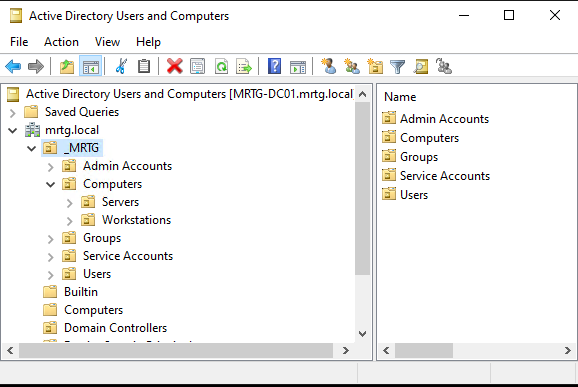
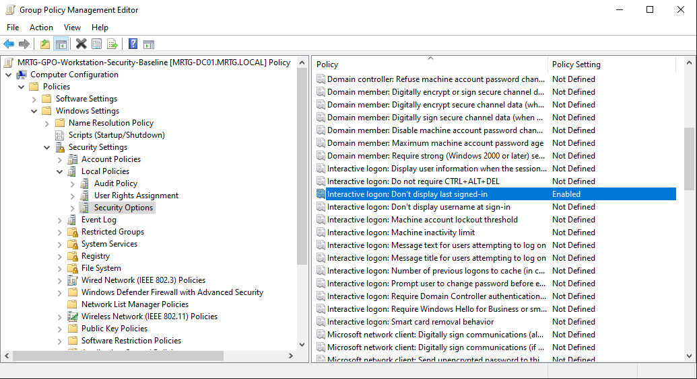
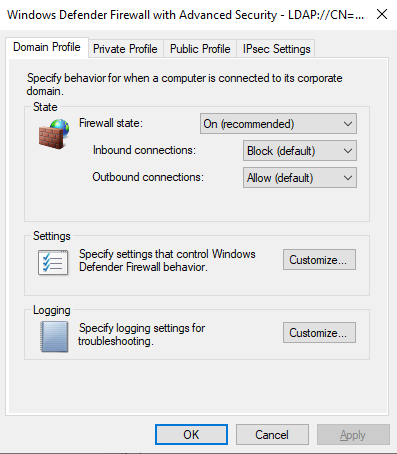
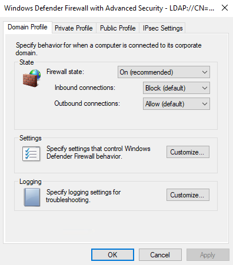
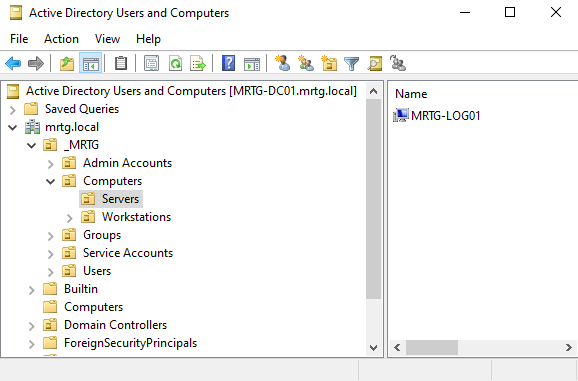
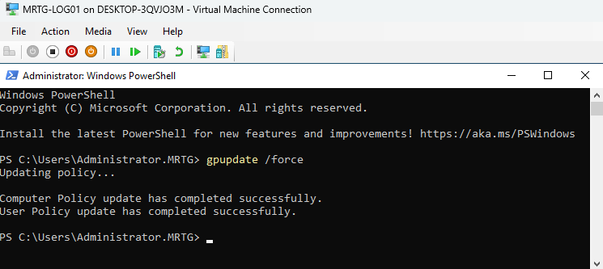
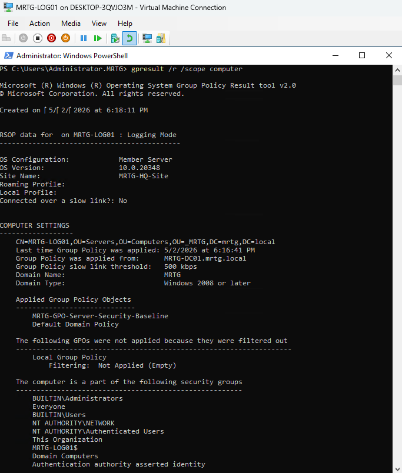
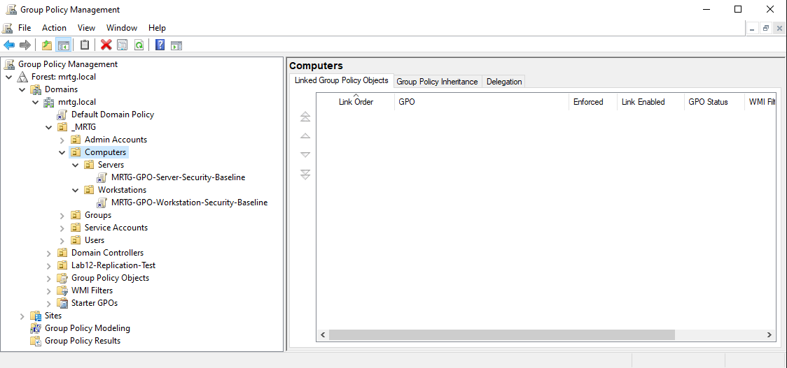

# Lab 15: Group Policy Security Baselines for Workstations and Servers


---

## Objective

Create separate Group Policy security baselines for workstation and server assets in the `mrtg.local` Active Directory environment.

This lab uses the existing Workstations and Servers OUs to apply system-role-based security settings through centralized Group Policy.

The goal is to separate policy scope, configure foundational endpoint controls, and validate the server baseline on a domain-joined member server.

---

## Business Scenario

Monroe Redstone Technology Group requires consistent security settings across domain-joined workstations and servers.

Manual local configuration can create inconsistent settings, configuration drift, weak auditing, and unnecessary endpoint exposure.

Workstations and servers also have different operational requirements. Applying one identical policy to every system can create security gaps or disrupt required services.

This lab addresses the need to:

- Reuse the existing workstation and server OU structure
- Separate workstation and server policy scope
- Create dedicated baseline GPOs
- Enforce sign-in privacy settings
- Enforce Windows Defender Firewall settings
- Configure foundational audit settings
- Validate policy application with native Windows tools
- Document the limits of the validation performed

---

## Lab Summary

In this lab, I reviewed and reused the existing `Workstations` and `Servers` OUs under `_MRTG\Computers`.

I created separate Group Policy Objects for workstation and server security baselines and linked each GPO to the appropriate OU.

The workstation baseline included sign-in privacy, Domain Profile firewall enforcement, and logon auditing.

The server baseline included sign-in privacy, Domain Profile firewall enforcement, logon auditing, account-management auditing, and audit-policy change auditing.

`MRTG-LOG01` was moved into the Servers OU and used to validate the server baseline through `gpupdate`, `gpresult`, and an HTML Group Policy report.

The workstation baseline was configured and linked but was not validated against a live workstation during this lab.

---

## Environment

| Component | Details |
|---|---|
| Domain | `mrtg.local` |
| Domain Controller | `MRTG-DC01` |
| Validated Member Server | `MRTG-LOG01` |
| Computer OU | `_MRTG\Computers` |
| Server OU | `_MRTG\Computers\Servers` |
| Workstation OU | `_MRTG\Computers\Workstations` |
| Server Baseline GPO | `MRTG-GPO-Server-Security-Baseline` |
| Workstation Baseline GPO | `MRTG-GPO-Workstation-Security-Baseline` |
| Tools | Group Policy Management, `gpupdate`, and `gpresult` |
| Virtualization Platform | Hyper-V |
| Organization | Monroe Redstone Technology Group |

---

## Prerequisites

- Operational `mrtg.local` Active Directory domain
- Existing `_MRTG\Computers\Servers` OU
- Existing `_MRTG\Computers\Workstations` OU
- Domain-joined member server `MRTG-LOG01`
- Administrative access to Group Policy Management
- Healthy Group Policy processing
- Network and DNS connectivity between the member server and domain controllers

---

## Scope

### Included

- Existing endpoint OU review
- Workstation baseline GPO creation
- Server baseline GPO creation
- GPO linking to the appropriate OUs
- Workstation sign-in privacy configuration
- Workstation firewall configuration
- Workstation logon-auditing configuration
- Server sign-in privacy configuration
- Server firewall configuration
- Server audit-policy configuration
- Member-server OU placement
- Group Policy refresh
- Applied-policy validation
- HTML Group Policy report generation
- Final GPO structure review
- Temporary Hyper-V checkpoints

### Not Included

- Live workstation baseline validation
- Microsoft Security Compliance Toolkit import
- CIS Benchmark import
- Full Microsoft security baseline coverage
- Intune security baselines
- Microsoft Defender for Endpoint
- Advanced firewall-rule design
- Windows LAPS
- Continuous configuration-drift monitoring
- SIEM alerting for Group Policy changes

---

## OU and GPO Architecture

The existing endpoint OUs provide separate Group Policy targets.

```text
mrtg.local
`-- _MRTG
    `-- Computers
        |-- Servers
        |   |-- MRTG-LOG01
        |   `-- Linked: MRTG-GPO-Server-Security-Baseline
        |
        `-- Workstations
            `-- Linked: MRTG-GPO-Workstation-Security-Baseline
```

This structure supports:

- Separate policy scope by system role
- Centralized configuration
- Controlled policy testing
- Reduced manual configuration
- Easier troubleshooting
- Future baseline expansion

Organizational Units provide Group Policy scope and delegation targets. They are not security boundaries by themselves.

---

## Group Policy Baseline Model

| GPO | Linked OU | Purpose |
|---|---|---|
| `MRTG-GPO-Workstation-Security-Baseline` | `_MRTG\Computers\Workstations` | Applies foundational workstation controls |
| `MRTG-GPO-Server-Security-Baseline` | `_MRTG\Computers\Servers` | Applies foundational member-server controls |

These are custom foundational baselines created for the lab. They are not complete Microsoft Security Baselines or CIS Benchmarks.

---

## Baseline Controls

### Workstation Baseline

| Control Area | Setting | Value |
|---|---|---|
| Interactive Sign-In | Do not display last signed-in user | Enabled |
| Windows Defender Firewall | Domain Profile state | On |
| Windows Defender Firewall | Inbound connections | Block |
| Windows Defender Firewall | Outbound connections | Allow |
| Audit Policy | Audit logon events | Success and Failure |

### Server Baseline

| Control Area | Setting | Value |
|---|---|---|
| Interactive Sign-In | Do not display last signed-in user | Enabled |
| Windows Defender Firewall | Domain Profile state | On |
| Windows Defender Firewall | Inbound connections | Block |
| Windows Defender Firewall | Outbound connections | Allow |
| Audit Policy | Audit logon events | Success and Failure |
| Audit Policy | Audit account management | Success and Failure |
| Audit Policy | Audit policy change | Success and Failure |

Blocking unsolicited inbound connections does not block traffic that matches an enabled firewall rule. Required management and application traffic must have documented allow rules.

---

## Implementation and Validation

### 1. Reviewed the Existing MRTG OU Structure

The MRTG OU hierarchy was reviewed before creating the baseline GPOs.


This confirmed the existing computer-management structure.

---

### 2. Confirmed the Workstations and Servers OUs

The Workstations and Servers OUs under `_MRTG\Computers` were reviewed.



These OUs were established earlier in the series and reused as the policy targets for this lab.

---

### 3. Reviewed the Endpoint OUs in Group Policy Management

Group Policy Management was opened to confirm that both endpoint OUs were available for GPO linking.


---

### 4. Created and Linked the Workstation Baseline

GPO name:

```text
MRTG-GPO-Workstation-Security-Baseline
```

Linked OU:

```text
_MRTG\Computers\Workstations
```


This established the policy scope for workstation computer objects.

---

### 5. Configured Workstation Sign-In Privacy

Policy path:

```text
Computer Configuration
`-- Policies
    `-- Windows Settings
        `-- Security Settings
            `-- Local Policies
                `-- Security Options
```

Configured setting:

```text
Interactive logon: Don't display last signed-in = Enabled
```



This reduces disclosure of the previous user's account name at the sign-in screen.

---

### 6. Configured the Workstation Domain Firewall

Configured values:

```text
Firewall state: On
Inbound connections: Block
Outbound connections: Allow
```



This established the foundational Domain Profile firewall behavior for workstations.

---

### 7. Configured Workstation Logon Auditing

Configured setting:

```text
Audit logon events = Success, Failure
```


This enables local visibility into successful and failed sign-in activity on workstation systems.

---

### 8. Created and Linked the Server Baseline

GPO name:

```text
MRTG-GPO-Server-Security-Baseline
```

Linked OU:

```text
_MRTG\Computers\Servers
```


This established a separate policy scope for member servers.

Domain controllers remain in the built-in Domain Controllers OU and do not receive this member-server baseline through the Servers OU.

---

### 9. Configured Server Sign-In Privacy

Configured setting:

```text
Interactive logon: Don't display last signed-in = Enabled
```


---

### 10. Configured the Server Domain Firewall

Configured values:

```text
Firewall state: On
Inbound connections: Block
Outbound connections: Allow
```



Required services must rely on appropriate enabled firewall rules.

---

### 11. Configured the Server Audit Policy

Configured settings:

```text
Audit account management = Success, Failure
Audit logon events = Success, Failure
Audit policy change = Success, Failure
```


The server baseline included additional auditing for account-management and policy-change activity.

---

### 12. Moved MRTG-LOG01 into the Servers OU

Target OU:

```text
_MRTG
`-- Computers
    `-- Servers
```



This placed the member-server computer object within the scope of the server baseline GPO.

---

### 13. Refreshed Group Policy on MRTG-LOG01

Command used:

```cmd
gpupdate /force
```



The policy refresh completed successfully.

---

### 14. Confirmed the Applied Server Baseline

Command used:

```cmd
gpresult /r /scope computer
```

Confirmed applied GPO:

```text
MRTG-GPO-Server-Security-Baseline
```



This confirmed that `MRTG-LOG01` processed the server baseline.

`gpresult` confirms policy application. Separate configuration queries or functional tests are required to verify every resulting security value.

---

### 15. Generated an HTML Group Policy Report

Commands used:

```powershell
New-Item -Path C:\Temp -ItemType Directory -Force
gpresult /h C:\Temp\mrtg-log01-gpresult.html
Start-Process C:\Temp\mrtg-log01-gpresult.html
```


The report provided detailed Resultant Set of Policy evidence.

---

### 16. Reviewed the Final GPO Structure

The final Group Policy structure showed both baseline GPOs linked to their intended OUs.



This confirmed separation between workstation and member-server policy scope.

---

### 17. Created a Post-Lab Checkpoint for MRTG-DC01


The checkpoint preserved a temporary lab recovery point after the GPO configuration.

---

### 18. Created a Post-Lab Checkpoint for MRTG-LOG01


The checkpoint preserved a temporary lab recovery point after server-side policy validation.

Hyper-V checkpoints were not treated as supported backups.

---

## Validation Limitation

The server baseline was applied and validated against `MRTG-LOG01`.

The workstation baseline was:

- Created
- Configured
- Linked to the Workstations OU
- Reviewed in Group Policy Management

A live workstation-side `gpresult` or functional validation was not captured during this lab.

The workstation baseline should therefore be described as configured and scoped, while the server baseline was applied and validated on an endpoint.

---

## Security and IAM Relevance

Group Policy provides centralized configuration control for domain-joined systems.

This lab supports:

- Centralized endpoint configuration
- Separate workstation and server policy scope
- Sign-in privacy
- Host firewall enforcement
- Security-event generation
- Reduced manual configuration
- Resultant policy evidence
- Preparation for compliance-based baselines

This lab supports IAM indirectly by protecting the systems that process identities, credentials, administrative sessions, and authentication events.

---

## Risks Addressed

This lab reduces the risk of:

- Manual local security configuration
- Workstations and servers receiving identical controls without review
- Weak Domain Profile firewall configuration
- Previous-user information being displayed at sign-in
- Limited endpoint audit visibility
- Configuration drift
- Unclear GPO ownership and scope
- Missing policy-application evidence

The limited custom settings do not provide a complete endpoint-hardening standard.

---

## Control Mapping

| Control Area | Lab Contribution |
|---|---|
| Endpoint Hardening | Configures foundational workstation and server controls |
| Policy Enforcement | Applies settings through Group Policy links |
| System-Role Targeting | Separates workstation and member-server scope |
| Identity Protection | Reduces prior-user disclosure at sign-in |
| Network Security | Enforces Domain Profile firewall behavior |
| Monitoring Readiness | Enables selected audit categories |
| Operational Consistency | Replaces repeated manual configuration with policy |
| Audit Readiness | Captures GPO and Resultant Set of Policy evidence |

---

## Validation Results

| Validation Item | Result |
|---|---|
| Existing endpoint OUs reviewed | Passed |
| Workstation baseline GPO created | Passed |
| Workstation GPO linked to Workstations OU | Passed |
| Workstation sign-in privacy configured | Passed |
| Workstation firewall configuration created | Passed |
| Workstation logon auditing configured | Passed |
| Server baseline GPO created | Passed |
| Server GPO linked to Servers OU | Passed |
| Server sign-in privacy configured | Passed |
| Server firewall configuration created | Passed |
| Server audit settings configured | Passed |
| `MRTG-LOG01` moved into Servers OU | Passed |
| Group Policy refreshed on `MRTG-LOG01` | Passed |
| Server baseline confirmed with `gpresult` | Passed |
| HTML Group Policy report generated | Passed |
| Final GPO structure reviewed | Passed |
| Live workstation application validation | Not tested |
| Temporary Hyper-V checkpoints created | Passed |

---

## Evidence Collected

| Evidence | File |
|---|---|
| Existing MRTG OU structure | `screenshots/lab-15-01-aduc-ou-structure-before-gpo-baselines.png` |
| Existing endpoint OUs | `screenshots/lab-15-02-workstations-and-servers-ous-created.png` |
| Endpoint OUs in GPMC | `screenshots/lab-15-03-gpmc-endpoint-ou-structure-before-baselines.png` |
| Workstation baseline GPO link | `screenshots/lab-15-04-workstation-security-baseline-gpo-linked.png` |
| Workstation sign-in privacy | `screenshots/lab-15-05-workstation-hide-last-signed-in-enabled.png` |
| Workstation Domain Profile firewall | `screenshots/lab-15-06-workstation-domain-firewall-enabled.png` |
| Workstation logon auditing | `screenshots/lab-15-07-workstation-audit-logon-events-enabled.png` |
| Server baseline GPO link | `screenshots/lab-15-08-server-security-baseline-gpo-linked.png` |
| Server sign-in privacy | `screenshots/lab-15-09-server-hide-last-signed-in-enabled.png` |
| Server Domain Profile firewall | `screenshots/lab-15-10-server-domain-firewall-enabled.png` |
| Server audit settings | `screenshots/lab-15-11-server-audit-policy-baseline-enabled.png` |
| MRTG-LOG01 OU placement | `screenshots/lab-15-12-log01-moved-to-servers-ou.png` |
| Group Policy refresh | `screenshots/lab-15-13-log01-gpupdate-success.png` |
| Applied server baseline | `screenshots/lab-15-14-log01-gpresult-server-baseline-applied.png` |
| HTML Resultant Set of Policy report | `screenshots/lab-15-15-log01-gpresult-html-report.png` |
| Final GPO structure | `screenshots/lab-15-16-final-role-based-security-baseline-structure.png` |
| MRTG-DC01 checkpoint | `screenshots/lab-15-17-final-lab15-checkpoint-dc01-created.png` |
| MRTG-LOG01 checkpoint | `screenshots/lab-15-18-final-lab15-checkpoint-log01-created.png` |

---

## What I Would Improve in Production

In a production environment, I would:

- Start with approved Microsoft Security Baselines or another authorized standard
- Map every setting to a security requirement
- Prefer advanced audit-policy subcategories over legacy audit categories
- Test GPOs in isolated and pilot OUs
- Validate workstation and server baselines independently
- Back up GPOs before major changes
- Use separate development, pilot, and production rollout stages
- Review required inbound firewall exceptions
- Document GPO ownership and approval authority
- Monitor Group Policy changes centrally
- Measure compliance and configuration drift
- Review exceptions regularly
- Use formal change management
- Use supported system backups instead of Hyper-V checkpoints

---

## Lessons Learned

This lab reinforced that workstation and server policies should be separated according to system function.

It also clarified the difference between configuring a GPO and proving its effect. A GPO link and `gpresult` show that policy was processed, but endpoint configuration and functional testing provide stronger validation.

The main takeaway is that clean OU design makes centralized policy easier to scope, troubleshoot, and review.

A custom lab baseline is a useful learning exercise, but production hardening should begin with an approved and maintained security standard.

---

## Outcome

Lab 15 successfully created separate foundational Group Policy baselines for workstation and member-server assets.

The lab confirmed that:

- Existing endpoint OUs were reused as policy targets
- Workstation and server GPOs were created separately
- Each GPO was linked to the correct OU
- Sign-in privacy, firewall, and audit settings were configured
- `MRTG-LOG01` was placed in the Servers OU
- The server baseline applied successfully
- Resultant policy evidence was generated
- The workstation baseline was configured but not live-tested

The environment now has a structured foundation for centralized endpoint hardening and future baseline expansion.

---

## Next Lab

[Lab 16: Delegation of Control and Tiered Administrative Boundaries](../Lab-16-Delegation-of-Control-and-Tiered-Administrative-Boundaries/)

Lab 16 expands delegated administration by defining additional administrative boundaries and validating least-privilege control over selected directory objects.
