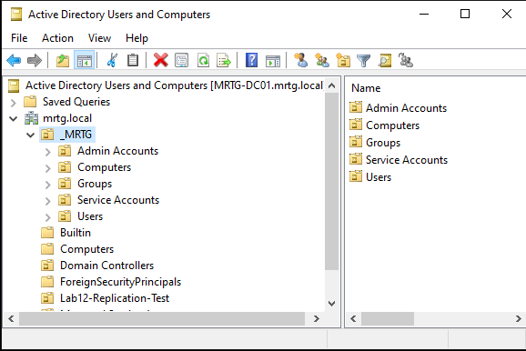
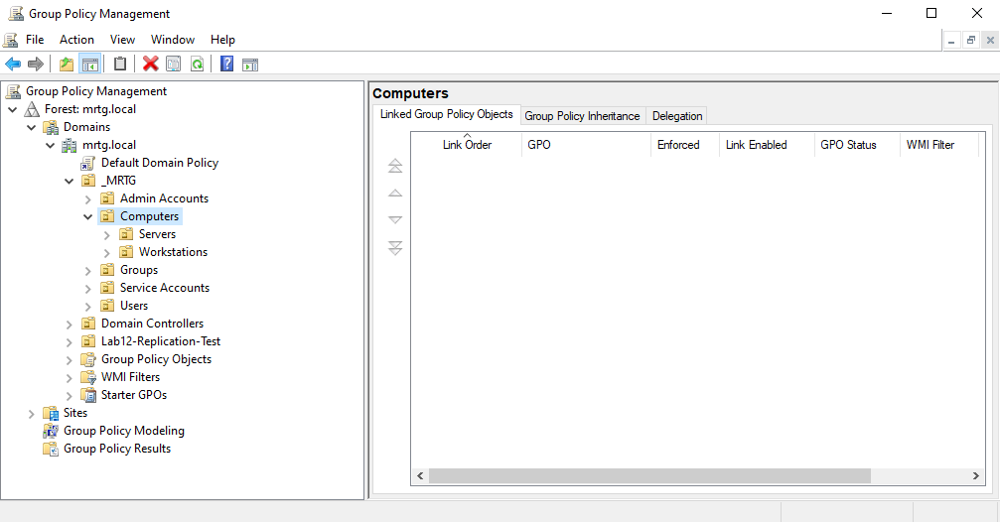
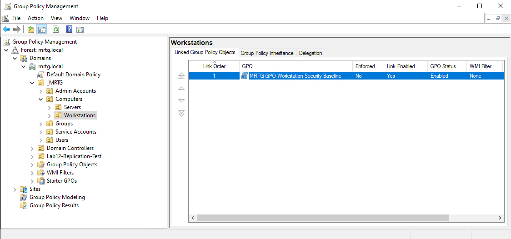
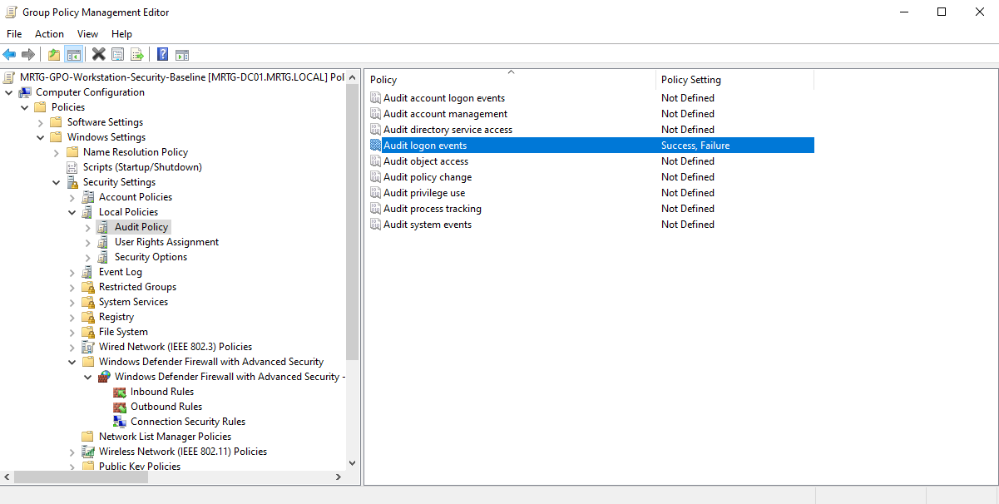
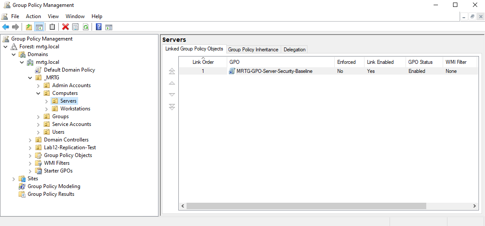
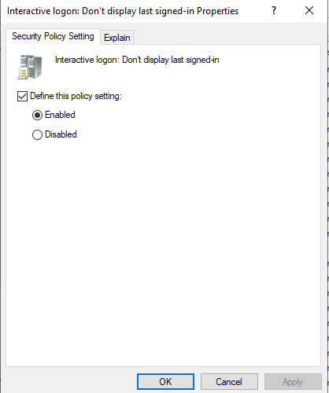
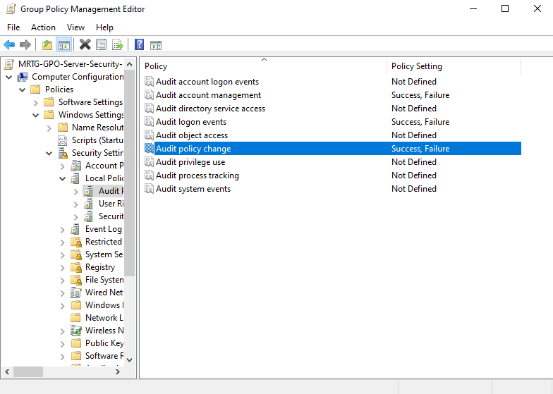
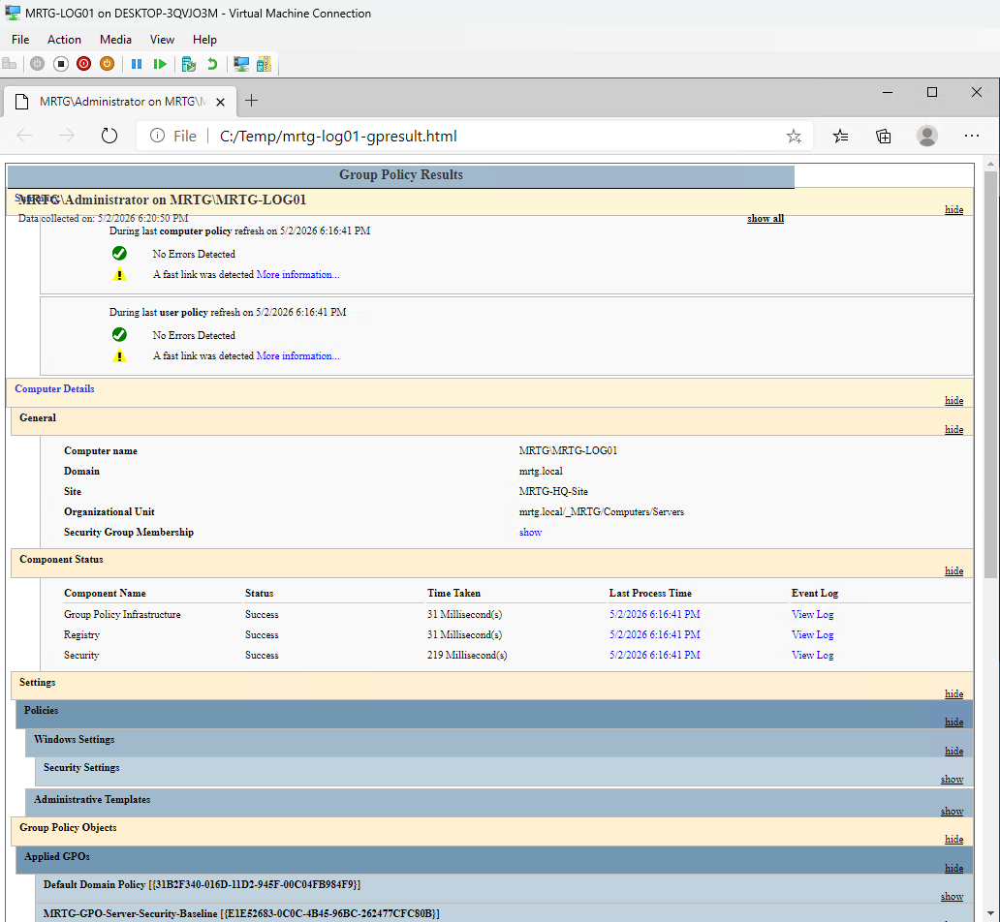
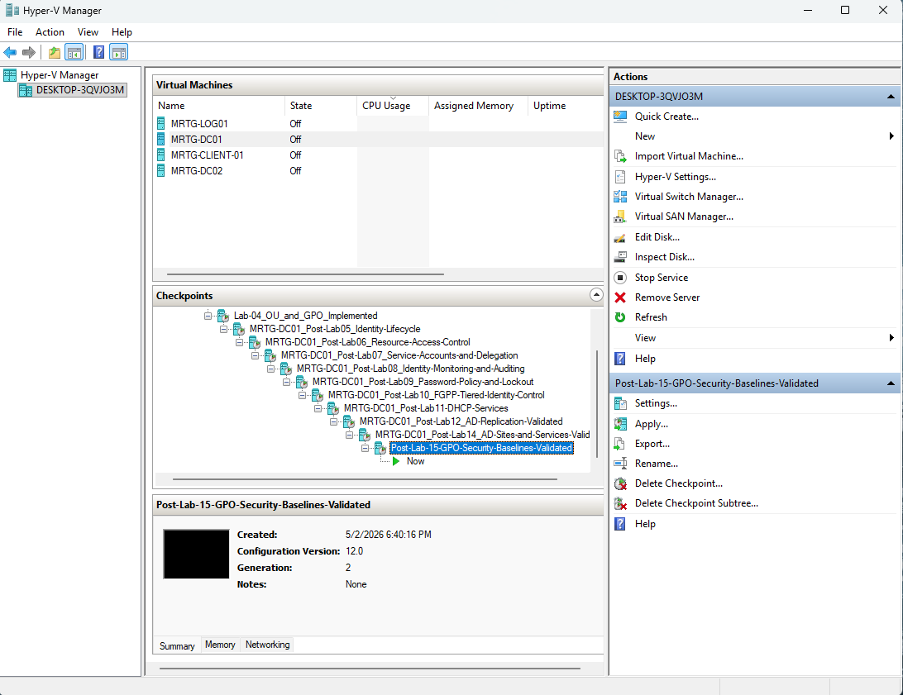
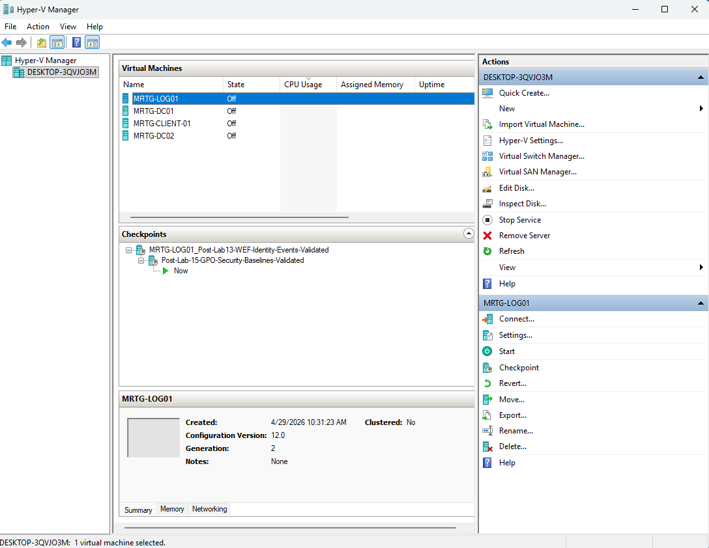

# Lab 15 — Group Policy Security Baselines for Workstations and Servers


---

## Objective

The objective of this lab is to create and validate role-based Group Policy security baselines for workstation and server assets in the `mrtg.local` Active Directory environment.

This lab uses Group Policy to centrally enforce baseline security controls through properly scoped Organizational Units.

The focus is on workstation and server policy separation, OU-based targeting, endpoint hardening, and Group Policy validation.

---

## Business Problem

Monroe Redstone Technology Group needs a consistent way to apply baseline security settings to domain-joined systems.

Without role-based Group Policy baselines, workstations and servers may rely on manual configuration, leading to inconsistent settings, configuration drift, weak auditing, and unnecessary endpoint exposure.

This lab addresses the need to:

- Separate workstation and server policy targeting
- Create dedicated endpoint OUs
- Apply security baselines through Group Policy
- Enforce sign-in privacy controls
- Enforce Windows Defender Firewall settings
- Configure audit policy settings
- Validate applied policy using native Windows tools
- Preserve final validated states with Hyper-V checkpoints

---

## Lab Summary

In this lab, I created dedicated `Servers` and `Workstations` OUs under the existing MRTG computer structure.

I created separate Group Policy Objects for workstation and server security baselines and linked each GPO to the correct role-based OU.

The workstation baseline was configured with endpoint-focused security controls, while the server baseline was configured with stronger auditing and firewall enforcement for server assets.

The available domain-joined member server, `MRTG-LOG01`, was moved into the Servers OU and used to validate Group Policy application with `gpupdate`, `gpresult`, and an HTML Group Policy report.

---

## Environment

| Component | Details |
|---|---|
| Domain | `mrtg.local` |
| Primary Domain Controller | `MRTG-DC01` |
| Validated Member Server | `MRTG-LOG01` |
| Parent OU | `_MRTG` |
| Computer OU | `_MRTG > Computers` |
| Server OU | `_MRTG > Computers > Servers` |
| Workstation OU | `_MRTG > Computers > Workstations` |
| Server Baseline GPO | `MRTG-GPO-Server-Security-Baseline` |
| Workstation Baseline GPO | `MRTG-GPO-Workstation-Security-Baseline` |
| Platform | Windows Server, Active Directory Domain Services, Group Policy |
| Lab Organization | Monroe Redstone Technology Group |

---

## Scope

### Included

- Existing OU structure review
- Dedicated Servers OU creation
- Dedicated Workstations OU creation
- Workstation security baseline GPO creation
- Server security baseline GPO creation
- GPO linking to role-based OUs
- Workstation logon privacy configuration
- Workstation firewall baseline configuration
- Workstation audit logon configuration
- Server logon privacy configuration
- Server firewall baseline configuration
- Server audit policy baseline configuration
- Computer object movement into role-based OU
- Group Policy refresh with `gpupdate`
- Applied policy validation with `gpresult`
- HTML Group Policy report generation
- Final Hyper-V checkpoints

### Not Included

- Microsoft Security Compliance Toolkit import
- CIS benchmark import
- Intune security baselines
- Defender for Endpoint integration
- Advanced firewall rule design
- Local administrator password management
- Windows LAPS configuration
- Security configuration drift monitoring
- SIEM-based GPO change alerting

---

## Architecture

The MRTG environment uses dedicated computer OUs to separate workstation and server policy targeting.

```text
mrtg.local
└── _MRTG
    ├── Admin Accounts
    ├── Groups
    ├── Service Accounts
    ├── Users
    └── Computers
        ├── Servers
        │   ├── MRTG-LOG01
        │   └── MRTG-GPO-Server-Security-Baseline
        └── Workstations
            └── MRTG-GPO-Workstation-Security-Baseline
```

This structure supports:

- Role-based policy targeting
- Separate workstation and server controls
- Centralized endpoint hardening
- Reduced manual configuration drift
- Better validation and audit evidence
- Cleaner future baseline expansion

---

## Group Policy Baseline Model

This lab uses separate GPOs for workstation and server assets.

| GPO Name | Linked OU | Purpose |
|---|---|---|
| `MRTG-GPO-Workstation-Security-Baseline` | `_MRTG > Computers > Workstations` | Applies baseline security controls to workstation assets |
| `MRTG-GPO-Server-Security-Baseline` | `_MRTG > Computers > Servers` | Applies baseline security controls to server assets |

This model avoids applying the same baseline blindly to every system.

Workstations and servers have different security needs, so their baseline controls should be separated and validated independently.

---

## Baseline Controls Configured

### Workstation Security Baseline

| Control Area | Setting | Value |
|---|---|---|
| Interactive Logon | Do not display last signed-in user | Enabled |
| Windows Defender Firewall | Domain Profile firewall state | On |
| Windows Defender Firewall | Inbound connections | Block |
| Windows Defender Firewall | Outbound connections | Allow |
| Audit Policy | Audit logon events | Success, Failure |

### Server Security Baseline

| Control Area | Setting | Value |
|---|---|---|
| Interactive Logon | Do not display last signed-in user | Enabled |
| Windows Defender Firewall | Domain Profile firewall state | On |
| Windows Defender Firewall | Inbound connections | Block |
| Windows Defender Firewall | Outbound connections | Allow |
| Audit Policy | Audit logon events | Success, Failure |
| Audit Policy | Audit account management | Success, Failure |
| Audit Policy | Audit policy change | Success, Failure |

---

## Implementation and Validation

### 1. Existing MRTG OU Structure Reviewed

The existing MRTG Active Directory OU structure was reviewed before creating dedicated endpoint OUs.



This confirmed the starting OU structure before role-based computer segmentation.

---

### 2. Servers and Workstations OUs Created

Dedicated `Servers` and `Workstations` OUs were created under the existing `_MRTG > Computers` OU.


This created separate policy targets for workstation and server security baselines.

---

### 3. Endpoint OU Structure Reviewed in Group Policy Management

Group Policy Management was opened to confirm the endpoint OU structure before creating baseline GPOs.



This confirmed that both endpoint OUs were visible and ready for GPO linking.

---

### 4. Workstation Security Baseline GPO Created and Linked

A new workstation baseline GPO was created and linked to the `Workstations` OU.

GPO created:

```text
MRTG-GPO-Workstation-Security-Baseline
```



This prepared workstation-specific baseline enforcement for future domain-joined workstation assets.

---

### 5. Workstation Logon Privacy Control Configured

The workstation baseline GPO was configured to hide the last signed-in user.

Policy path:

```text
Computer Configuration
└── Policies
    └── Windows Settings
        └── Security Settings
            └── Local Policies
                └── Security Options
```

Configured setting:

```text
Interactive logon: Don't display last signed-in = Enabled
```


This reduces username exposure on domain-joined workstations.

---

### 6. Workstation Domain Firewall Policy Configured

The workstation baseline GPO was configured to enforce Windows Defender Firewall on the Domain Profile.

Configured values:

```text
Firewall state: On
Inbound connections: Block
Outbound connections: Allow
```


This provides baseline firewall enforcement for workstation assets.

---

### 7. Workstation Audit Logon Events Configured

The workstation baseline GPO was configured to audit successful and failed logon events.

Configured setting:

```text
Audit logon events = Success, Failure
```



This improves visibility into authentication activity on workstation assets.

---

### 8. Server Security Baseline GPO Created and Linked

A new server baseline GPO was created and linked to the `Servers` OU.

GPO created:

```text
MRTG-GPO-Server-Security-Baseline
```



This prepared server-specific baseline enforcement for domain-joined server assets.

---

### 9. Server Logon Privacy Control Configured

The server baseline GPO was configured to hide the last signed-in user.

Configured setting:

```text
Interactive logon: Don't display last signed-in = Enabled
```



This reduces username exposure on domain-joined servers.

---

### 10. Server Domain Firewall Policy Configured

The server baseline GPO was configured to enforce Windows Defender Firewall on the Domain Profile.

Configured values:

```text
Firewall state: On
Inbound connections: Block
Outbound connections: Allow
```


This provides baseline firewall enforcement for server assets.

---

### 11. Server Audit Policy Baseline Configured

The server baseline GPO was configured with stronger auditing than the workstation baseline.

Configured audit settings:

```text
Audit account management = Success, Failure
Audit logon events = Success, Failure
Audit policy change = Success, Failure
```



This improves monitoring of privileged and security-relevant activity on server assets.

---

### 12. MRTG-LOG01 Moved into Servers OU

The `MRTG-LOG01` computer object was moved from the default Computers container into the role-based Servers OU.

Target OU:

```text
_MRTG
└── Computers
    └── Servers
```


This allowed the server security baseline GPO to apply through OU-based targeting.

---

### 13. Group Policy Refreshed on MRTG-LOG01

Group Policy was manually refreshed on `MRTG-LOG01`.

Command used:

```powershell
gpupdate /force
```


This forced the server to process the newly linked server security baseline GPO.

---

### 14. Applied GPO Verified with gpresult

Applied computer policies were reviewed using `gpresult`.

Command used:

```powershell
gpresult /r /scope computer
```

Confirmed applied GPO:

```text
MRTG-GPO-Server-Security-Baseline
```


This confirmed that `MRTG-LOG01` successfully applied the server security baseline GPO.

---

### 15. HTML Group Policy Report Generated

An HTML Group Policy report was generated for deeper validation evidence.

Commands used:

```powershell
mkdir C:\Temp
gpresult /h C:\Temp\mrtg-log01-gpresult.html
start C:\Temp\mrtg-log01-gpresult.html
```



This provided detailed evidence of applied Group Policy settings.

---

### 16. Final Role-Based GPO Structure Reviewed

The final GPMC structure was reviewed to confirm that both security baseline GPOs were linked to their correct role-based OUs.


This confirmed the final workstation and server baseline structure.

---

### 17. Post-Lab Checkpoint Created for MRTG-DC01

A Hyper-V checkpoint was created for `MRTG-DC01` after completing the Group Policy configuration.



---

### 18. Post-Lab Checkpoint Created for MRTG-LOG01

A Hyper-V checkpoint was created for `MRTG-LOG01` after validating the server baseline GPO.



---

## Validation Note

At the time of validation, `MRTG-LOG01` was the available domain-joined member server object in the lab environment.

The workstation security baseline GPO was created, linked, and configured for future domain-joined workstation assets. Live policy validation was performed against the server baseline because `MRTG-LOG01` was the available role-based endpoint object.

This keeps the lab accurate: the workstation baseline exists and is ready for workstation assets, while the server baseline was fully validated against an actual server object.

---

## Security Perspective

Group Policy is a core control mechanism in Active Directory environments.

It allows administrators to centrally enforce security settings across domain-joined systems instead of relying on manual local configuration.

From a security and IAM perspective, this lab supports:

- Centralized security control enforcement
- Role-based policy targeting
- Separation between workstation and server security requirements
- Reduced username exposure at sign-in
- Firewall enforcement for domain-connected systems
- Auditing of logon, account management, and policy change activity
- Validation of applied policy using native Windows tools
- Compliance-oriented administration

---

## Risk Addressed

Without role-based security baselines, endpoint configuration can become inconsistent and difficult to validate.

This lab reduces the risk of:

- Manual local security configuration
- Workstations and servers receiving the same baseline without review
- Inconsistent firewall enforcement
- Username exposure at sign-in
- Weak audit policy coverage
- Poor endpoint hardening visibility
- Unvalidated Group Policy application
- Configuration drift over time

---

## Control Mapping

| Control Area | How This Lab Supports It |
|---|---|
| Endpoint hardening | Applies workstation and server security baselines |
| Role-based policy targeting | Uses separate Servers and Workstations OUs |
| Group Policy enforcement | Links baseline GPOs to role-based OUs |
| Logon privacy | Hides last signed-in user |
| Firewall enforcement | Enables Domain Profile firewall settings |
| Identity monitoring | Enables logon and account management auditing |
| Validation | Uses `gpupdate`, `gpresult`, and HTML report evidence |
| Operational resilience | Creates final Hyper-V checkpoints |

---

## Validation

The following validation checks were completed:

| Validation Item | Result |
|---|---|
| Existing MRTG OU structure reviewed | Passed |
| Servers OU created | Passed |
| Workstations OU created | Passed |
| Endpoint OUs visible in GPMC | Passed |
| Workstation baseline GPO created | Passed |
| Workstation baseline GPO linked | Passed |
| Workstation logon privacy control configured | Passed |
| Workstation firewall baseline configured | Passed |
| Workstation audit logon policy configured | Passed |
| Server baseline GPO created | Passed |
| Server baseline GPO linked | Passed |
| Server logon privacy control configured | Passed |
| Server firewall baseline configured | Passed |
| Server audit policy baseline configured | Passed |
| `MRTG-LOG01` moved into Servers OU | Passed |
| `gpupdate /force` completed on `MRTG-LOG01` | Passed |
| `gpresult` confirmed server baseline applied | Passed |
| HTML Group Policy report generated | Passed |
| Final GPO structure reviewed | Passed |
| Hyper-V checkpoints created | Passed |

---

## Evidence Collected

The following evidence was collected during the lab:

| Evidence | File |
|---|---|
| Existing MRTG OU structure | `images/01-aduc-ou-structure-before-gpo-baselines.png` |
| Servers and Workstations OUs created | `images/02-aduc-workstations-and-servers-ous-created.png` |
| GPMC endpoint OU structure before baselines | `images/03-gpmc-endpoint-ou-structure-before-baselines.png` |
| Workstation baseline GPO linked | `images/04-gpmc-workstation-security-baseline-gpo-linked.png` |
| Workstation hide last signed-in user enabled | `images/05-workstation-gpo-hide-last-signed-in-user-enabled.png` |
| Workstation domain firewall enabled | `images/06-workstation-gpo-domain-firewall-enabled.png` |
| Workstation audit logon events enabled | `images/07-workstation-gpo-audit-logon-events-enabled.png` |
| Server baseline GPO linked | `images/08-gpmc-server-security-baseline-gpo-linked.png` |
| Server hide last signed-in user enabled | `images/09-server-gpo-hide-last-signed-in-user-enabled.png` |
| Server domain firewall enabled | `images/10-server-gpo-domain-firewall-enabled.png` |
| Server audit policy baseline enabled | `images/11-server-gpo-audit-policy-baseline-enabled.png` |
| MRTG-LOG01 moved into Servers OU | `images/12-aduc-server-object-moved-to-servers-ou.png` |
| MRTG-LOG01 gpupdate success | `images/13-mrtg-log01-gpupdate-force-success.png` |
| MRTG-LOG01 gpresult server baseline applied | `images/14-mrtg-log01-gpresult-server-baseline-applied.png` |
| MRTG-LOG01 gpresult HTML report | `images/15-mrtg-log01-gpresult-html-report.png` |
| Final role-based GPO structure | `images/16-gpmc-final-role-based-security-baseline-structure.png` |
| MRTG-DC01 post Lab 15 checkpoint | `images/17a-hyperv-mrtg-dc01-post-lab15-checkpoint.png` |
| MRTG-LOG01 post Lab 15 checkpoint | `images/17b-hyperv-mrtg-log01-post-lab15-checkpoint.png` |

---

## What I Would Improve in Production

In a production environment, I would improve this process by:

- Importing Microsoft Security Baselines where appropriate
- Comparing settings against CIS or DISA STIG guidance
- Separating baseline, role-specific, and exception GPOs
- Testing baselines in a pilot OU before broad rollout
- Documenting GPO owners and review cycles
- Using change management for GPO updates
- Enabling GPO change monitoring
- Reviewing firewall rules against application requirements
- Validating workstation baseline on an actual workstation object
- Using security filtering only when needed
- Documenting rollback procedures for baseline changes
- Exporting GPO backups for version control

---

## Lessons Learned

This lab reinforced that endpoint hardening should be centralized and role-based.

Workstations and servers should not automatically receive identical security settings.

The biggest takeaway is that Group Policy baselines need both careful scoping and real validation. Creating a GPO is not enough. The policy must be linked to the correct OU, applied to the correct computer object, and confirmed with tools like `gpupdate` and `gpresult`.

This lab also showed why OU design matters. Clean OU structure makes security baseline targeting easier and more reliable.

---

## Outcome

Lab 15 successfully created role-based Group Policy security baselines for workstation and server assets in the MRTG Active Directory environment.

The lab confirmed:

- Servers and Workstations OUs were created
- Workstation baseline GPO was created and linked
- Server baseline GPO was created and linked
- Workstation security controls were configured
- Server security controls were configured
- `MRTG-LOG01` was moved into the Servers OU
- Group Policy was refreshed on `MRTG-LOG01`
- `gpresult` confirmed the server baseline applied successfully
- An HTML Group Policy report was generated
- Final checkpoints were created

The environment now supports centralized, role-based security baseline enforcement through Active Directory Group Policy.

---

## Next Lab

[Lab 16 — Delegation of Control and Tiered Administrative Boundaries](../Lab-16-Delegation-of-Control-and-Tiered-Administrative-Boundaries/)

Lab 16 will build on this role-based Group Policy foundation by focusing on delegated administration, least privilege access, and tiered administrative boundaries within the MRTG Active Directory environment.
