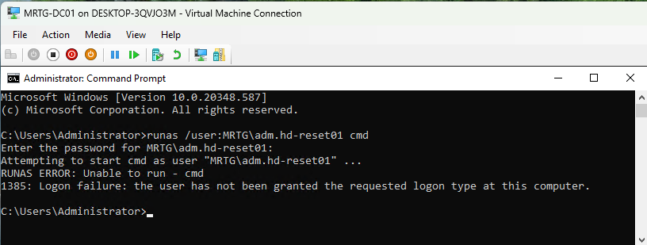
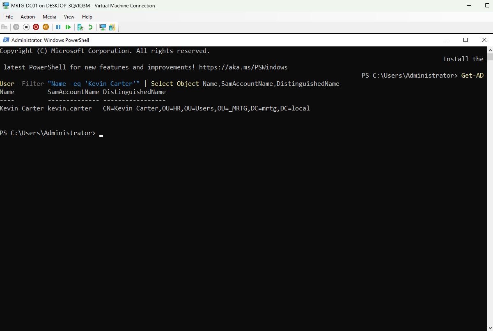
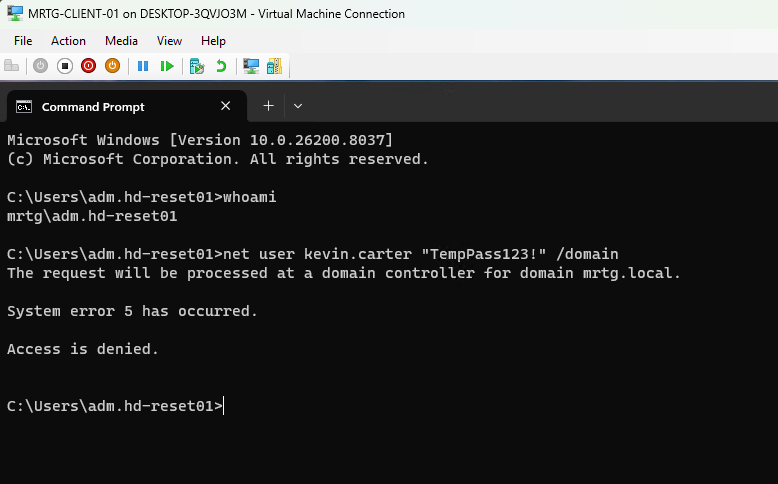
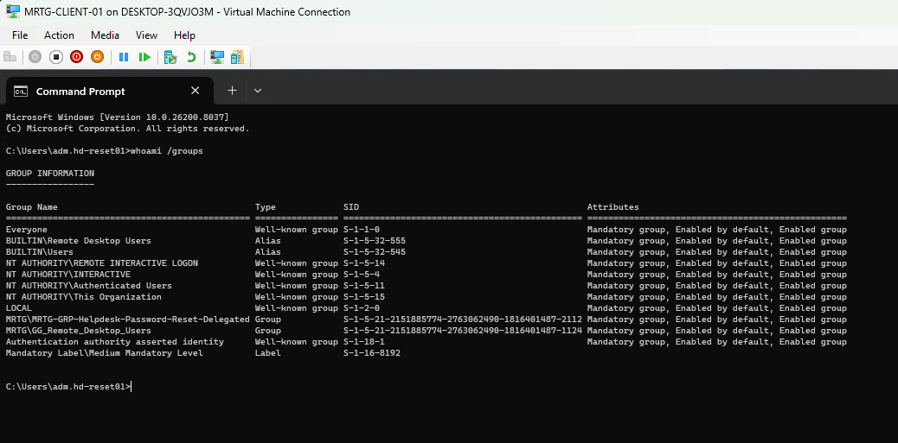
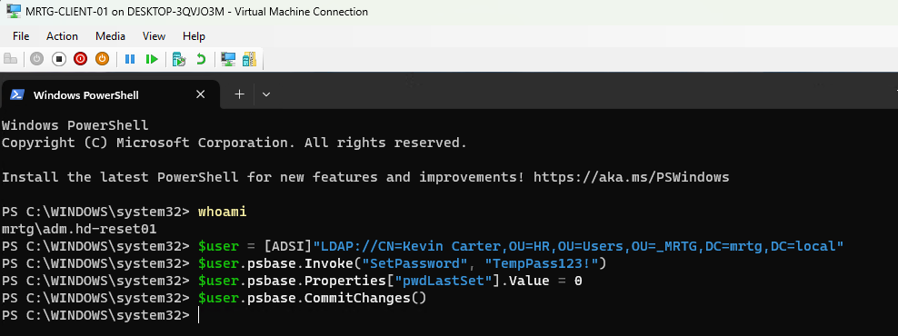
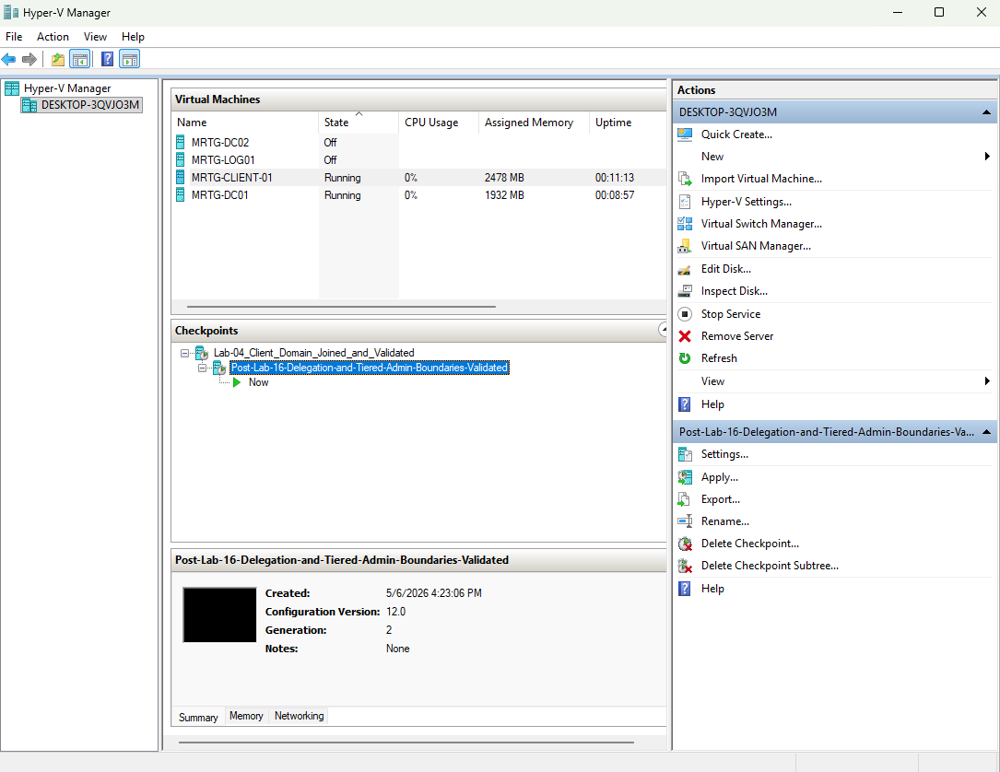

# Lab 16  — Delegation of Control and Tiered Administrative Boundaries


---

## Objective

The objective of this lab was to configure and validate delegated administrative access in the MRTG Active Directory environment.

This lab focused on allowing a dedicated help desk-style administrative account to reset passwords for standard user accounts without granting unnecessary elevated privileges such as Domain Admin, Account Operators, or interactive logon access to the domain controller.

---

## Business Problem

In real enterprise environments, help desk staff often need to perform identity support tasks such as password resets. A common mistake is granting too much access to make that work quickly.

That creates risk.

If a help desk account is overprivileged, it may be able to access domain controllers, reset privileged admin accounts, or modify users outside its required scope. In regulated, government, and defense-contractor environments, that is not acceptable.

This lab solves that problem by creating a scoped delegation model where a help desk admin can reset passwords only for standard users inside the approved OU boundary.

---

## Lab Summary

In this lab, a dedicated delegation group was created for help desk password reset permissions. A delegated administrative account was created and added to that group. The Delegation of Control Wizard was then used to assign password reset permissions to the standard Users OU.

The delegated admin account was tested from a management workstation, `MRTG-CLIENT-01`, instead of directly from the domain controller. The account was granted Remote Desktop access only to the management workstation and was denied interactive logon on the domain controller.

The lab validated both sides of least privilege:

- The delegated admin could reset a standard user password within the scoped Users OU.
- The delegated admin could not reset an admin account password outside the delegated scope.
- The delegated admin could not log on interactively to the domain controller.

---

## Environment

| Component | Value |
|---|---|
| Domain | `mrtg.local` |
| Domain Controller | `MRTG-DC01` |
| Management Workstation | `MRTG-CLIENT-01` |
| Parent OU | `_MRTG` |
| Standard User Scope | `_MRTG > Users` |
| Admin Account Scope | `_MRTG > Admin Accounts` |
| Delegated Group | `MRTG-GRP-Helpdesk-Password-Reset-Delegated` |
| Delegated Admin Account | `adm.hd-reset01` |
| Delegated Admin Display Name | `Jordan Hale (Admin)` |
| Standard Test User | `Kevin Carter` |
| Standard Test Username | `kevin.carter` |
| Platform | Windows Server / Active Directory Domain Services |

---

## Lab Architecture

```text
mrtg.local
│
└── _MRTG
    │
    ├── Admin Accounts
    │   ├── alex.rivera.admin
    │   ├── john.smith.admin
    │   └── Jordan Hale (Admin)
    │       └── adm.hd-reset01
    │
    ├── Groups
    │   └── MRTG-GRP-Helpdesk-Password-Reset-Delegated
    │       └── Member: Jordan Hale (Admin)
    │
    ├── Users
    │   └── HR
    │       └── Kevin Carter
    │           └── kevin.carter
    │
    └── Computers
        └── MRTG-CLIENT-01
            └── Local Remote Desktop Users
                └── MRTG\adm.hd-reset01
```

---

## IAM and Security Relevance

Delegation of Control is a core IAM concept in Active Directory environments.

Instead of granting broad administrative rights, permissions should be scoped by:

- Role
- Task
- Organizational Unit
- Business need
- Administrative boundary

This lab demonstrates least privilege by allowing a help desk-style account to perform a specific identity support task without giving that account full administrative control of the domain.

From an IAM and security operations perspective, this lab demonstrates:

- Role-based delegation
- Password reset delegation
- OU-scoped administrative permissions
- Separation between standard users and admin accounts
- Reduced dependency on Domain Admin accounts
- Management workstation-based administration
- Negative testing to confirm boundary enforcement
- Validation that delegated permissions do not grant domain controller logon rights

This is directly relevant to enterprise, MSP, government, and defense-contractor environments where privileged access must be tightly controlled and auditable.

---

## Accounts and Groups Created

| Object | Type | Purpose |
|---|---|---|
| `MRTG-GRP-Helpdesk-Password-Reset-Delegated` | Global Security Group | Receives delegated password reset permissions |
| `Jordan Hale (Admin)` | Admin Account Display Name | Delegated help desk admin identity |
| `adm.hd-reset01` | User Logon Name | Delegated admin account used for testing |
| `Kevin Carter` | Standard User | HR user used for password reset validation |

---

## Delegation Scope

Delegation was applied to:

```text
mrtg.local
└── _MRTG
    └── Users
```

This allowed the delegated group to manage standard user password reset tasks within the Users OU and its child OUs.

Delegation was not applied to:

```text
_MRTG > Admin Accounts
Domain Controllers
Domain Admins
Enterprise Admins
Account Operators
Server Operators
```

---

## Delegated Permission

The delegated task selected was:

```text
Reset user passwords and force password change at next logon
```

No additional delegation tasks were selected.

---

## Implementation Steps

### Step 1 — Reviewed the Existing MRTG OU Structure

The existing MRTG Active Directory OU structure was reviewed before configuring delegation. This confirmed that standard users, admin accounts, computers, groups, and service accounts were already separated into dedicated OUs.


---

### Step 2 — Created the Delegated Password Reset Group

A dedicated security group was created under `_MRTG > Groups`.

Group created:

```text
MRTG-GRP-Helpdesk-Password-Reset-Delegated
```

Group settings:

```text
Group scope: Global
Group type: Security
```


---

### Step 3 — Created the Delegated Help Desk Admin Account

A delegated administrative account was created under `_MRTG > Admin Accounts`.

Account details:

```text
Full name: Jordan Hale (Admin)
User logon name: adm.hd-reset01
Pre-Windows 2000 logon: MRTG\adm.hd-reset01
```


---

### Step 4 — Added the Delegated Admin Account to the Password Reset Group

The delegated admin account was added to the password reset delegation group.

Group:

```text
MRTG-GRP-Helpdesk-Password-Reset-Delegated
```

Member added:

```text
Jordan Hale (Admin)
```


---

### Step 5 — Selected the Delegation Group in the Delegation of Control Wizard

The Delegation of Control Wizard was launched on the standard Users OU.

Delegation scope:

```text
mrtg.local/_MRTG/Users
```

Selected group:

```text
MRTG-GRP-Helpdesk-Password-Reset-Delegated
```


---

### Step 6 — Selected the Password Reset Delegation Task

The delegated task was limited to password reset operations.

Selected task:

```text
Reset user passwords and force password change at next logon
```


---

### Step 7 — Completed the Delegation of Control Wizard

The Delegation of Control Wizard was completed and applied the scoped permission to the selected group.


---

### Step 8 — Identified a Standard User for Testing

A standard HR user account was selected for delegated password reset testing.

Selected test user:

```text
Kevin Carter
```

Location:

```text
_MRTG > Users > HR
```


---

### Step 9 — Granted Management Workstation Access to the Delegated Admin

The delegated admin account was granted Remote Desktop access to the management workstation only.

This was performed on:

```text
MRTG-CLIENT-01
```

Commands used:

```cmd
net localgroup "Remote Desktop Users" "MRTG\adm.hd-reset01" /add
net localgroup "Remote Desktop Users"
```


---

### Step 10 — Confirmed Delegated Admin Workstation Sign-In

The delegated admin account signed into the management workstation.

Validation command:

```cmd
whoami
```

Expected result:

```text
mrtg\adm.hd-reset01
```


---

### Step 11 — Confirmed Delegated Admin Could Not Log On to the Domain Controller

A logon attempt was made on the domain controller using the delegated admin account.

Command used:

```cmd
runas /user:MRTG\adm.hd-reset01 cmd
```

Result:

```text
1385: Logon failure: the user has not been granted the requested logon type at this computer.
```



---

### Step 12 — Identified Kevin Carter's SamAccountName

Kevin Carter's account information was queried before delegated password reset testing.

Command used:

```powershell
Get-ADUser -Filter "Name -eq 'Kevin Carter'" | Select-Object Name,SamAccountName,DistinguishedName
```

Confirmed username:

```text
kevin.carter
```

Distinguished Name:

```text
CN=Kevin Carter,OU=HR,OU=Users,OU=_MRTG,DC=mrtg,DC=local
```



---

### Step 13 — Tested Password Reset with net user

The delegated admin attempted to reset the standard user password using the `net user` command.

Command used:

```cmd
net user kevin.carter "TempPass123!" /domain
```

Result:

```text
System error 5 has occurred.
Access is denied.
```



---

### Step 14 — Verified Delegated Admin Group Membership

The delegated admin's security token was reviewed to confirm group membership.

Command used:

```cmd
whoami /groups
```

Confirmed group:

```text
MRTG\MRTG-GRP-Helpdesk-Password-Reset-Delegated
```



---

### Step 15 — Successfully Reset a Standard User Password with ADSI

The delegated admin account successfully reset Kevin Carter's password using ADSI from the management workstation.

Commands used:

```powershell
whoami

$user = [ADSI]"LDAP://CN=Kevin Carter,OU=HR,OU=Users,OU=_MRTG,DC=mrtg,DC=local"
$user.psbase.Invoke("SetPassword", "TempPass123!")
$user.psbase.Properties["pwdLastSet"].Value = 0
$user.psbase.CommitChanges()
```

Successful validation:

```text
whoami = mrtg\adm.hd-reset01
No access denied error returned
CommitChanges completed successfully
```



---

### Step 16 — Confirmed the Delegated Admin Could Not Reset an Admin Account Password

The delegated admin attempted to reset the password of an admin account outside the delegated Users OU scope.

Target admin account:

```text
alex.rivera.admin
```

Target location:

```text
_MRTG > Admin Accounts
```

Commands used:

```powershell
$admin = [ADSI]"LDAP://CN=alex.rivera.admin,OU=Admin Accounts,OU=_MRTG,DC=mrtg,DC=local"
$admin.psbase.Invoke("SetPassword", "TempPass123!")
$admin.psbase.CommitChanges()
```

Result:

```text
Access is denied.
Exception from HRESULT: 0x80070005 (E_ACCESSDENIED)
```


---

### Step 17 — Created a Post-Lab Checkpoint for MRTG-DC01

A Hyper-V checkpoint was created for the domain controller after delegation was configured and validated.

Checkpoint name:

```text
Post-Lab-16-Delegation-and-Tiered-Admin-Boundaries-Validated
```


---

### Step 18 — Created a Post-Lab Checkpoint for MRTG-CLIENT-01

A Hyper-V checkpoint was created for the management workstation after delegated access testing was completed.

Checkpoint name:

```text
Post-Lab-16-Delegation-and-Tiered-Admin-Boundaries-Validated
```



---

## Validation Commands Used

### Add Delegated Admin to Local Remote Desktop Users on the Management Workstation

```cmd
net localgroup "Remote Desktop Users" "MRTG\adm.hd-reset01" /add
net localgroup "Remote Desktop Users"
```

### Confirm Current Security Context

```cmd
whoami
```

### Confirm Delegated Admin Group Membership

```cmd
whoami /groups
```

### Identify Standard User Account

```powershell
Get-ADUser -Filter "Name -eq 'Kevin Carter'" | Select-Object Name,SamAccountName,DistinguishedName
```

### Attempt Password Reset with net user

```cmd
net user kevin.carter "TempPass123!" /domain
```

### Reset Standard User Password with ADSI

```powershell
$user = [ADSI]"LDAP://CN=Kevin Carter,OU=HR,OU=Users,OU=_MRTG,DC=mrtg,DC=local"
$user.psbase.Invoke("SetPassword", "TempPass123!")
$user.psbase.Properties["pwdLastSet"].Value = 0
$user.psbase.CommitChanges()
```

### Attempt Admin Account Password Reset Outside Delegated Scope

```powershell
$admin = [ADSI]"LDAP://CN=alex.rivera.admin,OU=Admin Accounts,OU=_MRTG,DC=mrtg,DC=local"
$admin.psbase.Invoke("SetPassword", "TempPass123!")
$admin.psbase.CommitChanges()
```

### Confirm Delegated Admin Cannot Launch a Session on the Domain Controller

```cmd
runas /user:MRTG\adm.hd-reset01 cmd
```

---

## Key Results

| Validation Area | Result |
|---|---|
| Delegated password reset group created | Successful |
| Delegated admin account created | Successful |
| Delegated admin added to delegation group | Successful |
| Delegation applied to `_MRTG > Users` | Successful |
| Password reset task scoped through Delegation of Control Wizard | Successful |
| Standard HR user identified for testing | Successful |
| Delegated admin granted workstation RDP access only | Successful |
| Delegated admin signed into management workstation | Successful |
| Delegated admin denied interactive logon to domain controller | Successful |
| Delegated admin group membership confirmed with `whoami /groups` | Successful |
| `net user /domain` password reset attempt returned Access Denied | Documented |
| ADSI password reset for standard HR user | Successful |
| Admin account password reset outside delegated scope | Denied |
| DC01 post-lab checkpoint created | Successful |
| CLIENT01 post-lab checkpoint created | Successful |

---

## Evidence Collected

| Evidence | File |
|---|---|
| Baseline ADUC structure before delegation | `screenshots/lab-16-01-aduc-baseline-before-delegation.png` |
| Delegated password reset group created | `screenshots/lab-16-02-helpdesk-password-reset-delegated-group-created.png` |
| Delegated help desk admin account created | `screenshots/lab-16-03-delegated-helpdesk-admin-account-created.png` |
| Delegated admin added to password reset group | `screenshots/lab-16-04-delegated-admin-added-to-password-reset-group.png` |
| Delegation Wizard group selection | `screenshots/lab-16-05-delegation-wizard-group-selected-for-users-ou.png` |
| Password reset delegation task selected | `screenshots/lab-16-06-delegation-task-reset-password-selected.png` |
| Delegation Wizard completion summary | `screenshots/lab-16-07-delegation-wizard-completion-summary.png` |
| Standard user target account identified | `screenshots/lab-16-08-standard-users-ou-target-accounts.png` |
| Delegated admin added to workstation Remote Desktop Users | `screenshots/lab-16-09a-delegated-admin-added-to-client-remote-desktop-users.png` |
| Delegated admin signed into management workstation | `screenshots/lab-16-09b-delegated-admin-signed-into-management-workstation.png` |
| Delegated admin denied logon to domain controller | `screenshots/lab-16-10a-delegated-admin-denied-logon-to-domain-controller.png` |
| Kevin Carter SamAccountName identified | `screenshots/lab-16-10b-kevin-carter-samaccountname-identified.png` |
| `net user` password reset denied | `screenshots/lab-16-10c-delegated-admin-net-user-reset-access-denied.png` |
| Delegated admin group membership token checked | `screenshots/lab-16-10d-delegated-admin-group-membership-token-check.png` |
| ADSI password reset succeeded | `screenshots/lab-16-10e-delegated-admin-adsi-password-reset-success.png` |
| Admin account password reset denied | `screenshots/lab-16-11-delegated-admin-denied-reset-admin-account.png` |
| MRTG-DC01 post-lab checkpoint | `screenshots/lab-16-12a-hyperv-mrtg-dc01-post-lab16-checkpoint.png` |
| MRTG-CLIENT-01 post-lab checkpoint | `screenshots/lab-16-12b-hyperv-mrtg-client01-post-lab16-checkpoint.png` |

---

## Troubleshooting Note

During testing, the `net user /domain` method returned:

```text
System error 5 has occurred.
Access is denied.
```

The delegated admin's group membership was then confirmed using:

```cmd
whoami /groups
```

The delegated password reset was successfully validated using an LDAP/ADSI password reset method from the management workstation.

This confirmed that the delegation itself was functioning while also documenting that not every administrative method behaves the same way under a delegated permission model.

RSAT Active Directory Users and Computers was not available on the management workstation during this lab, so delegated password reset validation was performed using PowerShell and ADSI from the delegated admin session. A future lab may expand management workstation tooling, but the delegation boundary and least privilege model were successfully validated in this lab.

---

## Security Boundary Notes

This lab intentionally separated delegated permissions from logon rights.

The delegated admin account was allowed to perform password reset actions within the scoped Users OU, but it was not granted unnecessary access to the domain controller.

This distinction matters in real environments:

```text
Delegated AD permission does not automatically equal server logon permission.
```

The delegated account had enough access to reset a standard user password, but not enough access to:

- Log on interactively to the domain controller
- Reset admin account passwords
- Manage accounts outside the delegated Users OU
- Become a Domain Admin
- Modify privileged administrative accounts

---

## Existing Help Desk Group Note

The `MRTG-GRP-Helpdesk-Password-Reset-Delegated` group was created as a scoped delegation group specifically for password reset permissions over standard user accounts.

Existing help desk or administrative groups were left unchanged to preserve prior lab configurations and to demonstrate more granular role separation.

This lab uses a task-specific delegation model instead of relying on a broad help desk admin group.

---

## Skills Demonstrated

- Active Directory Delegation of Control
- Least privilege administration
- OU-scoped administrative permissions
- Help desk password reset delegation
- Global security group-based delegation
- Admin account separation
- Management workstation-based administration
- Local Remote Desktop Users configuration
- Security context validation with `whoami`
- Group membership validation with `whoami /groups`
- ADSI-based password reset validation
- Negative access testing against admin accounts
- Domain controller logon restriction validation
- Hyper-V checkpoint management
- Enterprise-style documentation and evidence capture

---

## What I Would Improve in Production

In a production environment, I would improve this process by:

- Using a Privileged Access Management process for delegated admin accounts
- Requiring MFA for privileged and delegated admin access
- Using a dedicated privileged access workstation instead of a standard workstation
- Installing RSAT tools on an approved management workstation
- Using formal access request and approval workflows
- Auditing delegated password reset activity
- Reviewing delegated groups on a scheduled basis
- Applying stronger naming standards for delegated administrative roles
- Separating administrative tiers more formally
- Documenting delegated permissions in an access control matrix
- Monitoring password reset events through centralized logging or SIEM

---

## Lessons Learned

This lab reinforced that delegated administration is not the same as full administration.

A delegated help desk admin should only receive the permissions required for the assigned support task. In this case, the account was able to reset a standard user password inside the approved OU scope but was blocked from logging into the domain controller and blocked from resetting an admin account password.

The key lesson is that least privilege must be validated with both successful tests and denied-access tests. A permission model is not proven until the boundary is tested.

---

## Outcome

By the end of this lab, the MRTG Active Directory environment had a delegated help desk password reset model configured using a dedicated security group and a delegated admin account.

The delegated group was granted password reset permissions over the standard Users OU only. The delegated admin account, `adm.hd-reset01`, was able to sign into the management workstation and successfully reset the password for a standard HR user account using scoped delegated permissions.

The same delegated admin account was denied interactive logon on the domain controller and was denied when attempting to reset an admin account password outside the delegated Users OU scope.

This lab demonstrated a practical least-privilege administrative model where identity support tasks can be delegated without granting broad domain-level privileges.

---

## Next Lab

[Lab 17 — Windows LAPS and Local Administrator Control](../Lab-17-Windows-LAPS-and-Local-Administrator-Control/)

Lab 17 will build on this least privilege delegation model by focusing on Windows LAPS, local administrator password management, and privileged endpoint protection for domain-joined systems.
