# Lab 16: Delegation of Control and Tiered Administrative Boundaries


---

## Objective

Implement and functionally validate scoped password-reset delegation in the `mrtg.local` Active Directory domain.

This lab extends the foundational delegation configured in Lab 07 by creating a task-specific help desk role, performing administration from a management workstation, and testing both allowed and denied actions.

The goal is to prove that a delegated administrator can reset passwords for standard users without receiving access to privileged accounts or interactive access to the domain controller.

---

## Business Scenario

Monroe Redstone Technology Group requires Help Desk personnel to reset standard user passwords without receiving Domain Admin privileges.

Password resets are routine support tasks, but broad administrative access would increase the impact of compromised Help Desk credentials.

This lab addresses the need to:

- Create a task-specific delegated role
- Use a separate named administrative account
- Scope password-reset permissions to standard users
- Perform administration from a management workstation
- Deny access to privileged accounts outside the delegated scope
- Confirm that delegation does not grant domain controller logon rights
- Validate the boundary through positive and negative testing

---

## Lab Summary

In this lab, I created the `MRTG-GRP-Helpdesk-Password-Reset-Delegated` security group and the named administrative account `adm.hd-reset01`.

The Delegation of Control Wizard granted the group permission to reset passwords and require a password change at the next sign-in for users beneath `_MRTG\Users`.

The delegated administrator signed in to the management workstation and successfully reset Kevin Carter's password through ADSI.

Negative testing confirmed that the account could not reset a privileged administrator's password outside the delegated OU and could not start a session on the domain controller.

This demonstrated a functional least-privilege boundary rather than only documenting a configured delegation.

---

## Relationship to Lab 07

Lab 07 established the initial delegated-administration structure and documented password-reset delegation.

Lab 16 extends that work through:

- A dedicated task-specific delegation group
- A separate delegated Help Desk administrator
- Management-workstation administration
- Successful in-scope password-reset testing
- Failed out-of-scope password-reset testing
- Domain controller logon-denial testing
- Security-token validation

---

## Environment

| Component | Value |
|---|---|
| Domain | `mrtg.local` |
| Domain Controller | `MRTG-DC01` |
| Management Workstation Windows Name | `CLIENT01` |
| Management Workstation Hyper-V Name | `MRTG-CLIENT-01` |
| Standard User Scope | `_MRTG\Users` |
| Privileged Account Scope | `_MRTG\Admin Accounts` |
| Delegated Group | `MRTG-GRP-Helpdesk-Password-Reset-Delegated` |
| Delegated Account | `adm.hd-reset01` |
| Delegated Account Display Name | Jordan Hale (Admin) |
| Standard Test User | Kevin Carter |
| Standard Test Username | `kevin.carter` |
| Privileged Test Account | `alex.rivera.admin` |
| Tools | ADUC, Delegation of Control Wizard, PowerShell, ADSI, and Hyper-V |

---

## Prerequisites

- Operational `mrtg.local` domain
- Existing `_MRTG\Users` OU with department child OUs
- Existing `_MRTG\Admin Accounts` OU
- Existing `_MRTG\Groups` OU
- Standard test account for Kevin Carter
- Privileged test account outside the delegated scope
- Domain-joined management workstation
- Administrative access to configure delegation
- Network and DNS connectivity to the domain controllers

---

## Scope

### Included

- Existing OU structure review
- Delegated security-group creation
- Named delegated-account creation
- Group membership assignment
- OU-scoped password-reset delegation
- Management-workstation access
- Delegated-administrator sign-in validation
- Security-token group validation
- In-scope password-reset testing
- Out-of-scope password-reset denial testing
- Domain controller session-denial testing
- Temporary Hyper-V checkpoints

### Not Included

- Full enterprise administrative tiering
- Privileged Access Management platform
- Multifactor authentication
- Privileged Access Workstation deployment
- Just-in-time approval
- Automated access reviews
- SIEM alerting
- RSAT installation on the management workstation
- Production password-handling workflow

---

## Administrative Architecture

```text
mrtg.local
`-- _MRTG
    |-- Admin Accounts
    |   |-- alex.rivera.admin
    |   |-- john.smith.admin
    |   `-- Jordan Hale (Admin)
    |       `-- adm.hd-reset01
    |
    |-- Groups
    |   `-- MRTG-GRP-Helpdesk-Password-Reset-Delegated
    |       `-- adm.hd-reset01
    |
    |-- Users
    |   `-- HR
    |       `-- Kevin Carter
    |           `-- kevin.carter
    |
    `-- Computers
        `-- Workstations
            `-- CLIENT01
```

Management access used:

```text
CLIENT01
`-- Remote Desktop Users
    `-- MRTG\adm.hd-reset01
```

Directly adding the account to the workstation's local group was acceptable for this controlled test. A production design should normally manage workstation access through an approved domain group and centralized policy.

---

## Delegation Model

| Role | Target | Effective Boundary |
|---|---|---|
| Help Desk Password Reset Administrator | `_MRTG\Users` | Reset passwords and require change at next sign-in |
| Help Desk Password Reset Administrator | `_MRTG\Admin Accounts` | No delegated password-reset permission |
| Help Desk Password Reset Administrator | `MRTG-DC01` | No interactive session right |
| Help Desk Password Reset Administrator | `CLIENT01` | Remote Desktop sign-in permitted for testing |

This represents a foundational administrative boundary. It does not implement a complete enterprise Tier 0, Tier 1, and Tier 2 architecture.

---

## Delegated Permission

The selected task was:

```text
Reset user passwords and force password change at next logon
```

Delegation target:

```text
mrtg.local
`-- _MRTG
    `-- Users
```

The delegated Access Control Entries inherit to applicable user objects in the child department OUs.

No password-reset delegation was configured on `_MRTG\Admin Accounts`.

---

## Accounts and Groups

| Object | Type | Purpose |
|---|---|---|
| `MRTG-GRP-Helpdesk-Password-Reset-Delegated` | Global security group | Represents the delegated password-reset role |
| Jordan Hale (Admin) | Display name | Identifies the named delegated administrator |
| `adm.hd-reset01` | User logon name | Performs the delegated support task |
| Kevin Carter | Standard user | In-scope password-reset target |
| `alex.rivera.admin` | Privileged user | Out-of-scope negative-test target |

---

## Implementation and Validation

### 1. Reviewed the Existing OU Structure

The existing MRTG OU structure was reviewed before delegation was configured.

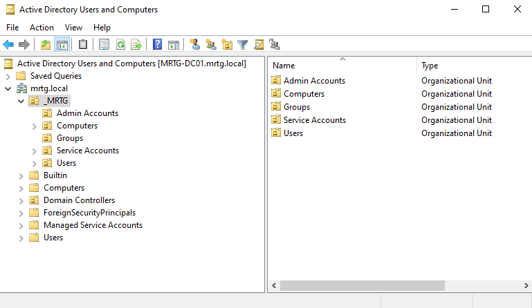

This confirmed separation among standard users, administrative accounts, computers, groups, and service accounts.

---

### 2. Created the Delegated Password-Reset Group

Group name:

```text
MRTG-GRP-Helpdesk-Password-Reset-Delegated
```

Group configuration:

```text
Scope: Global
Type: Security
```

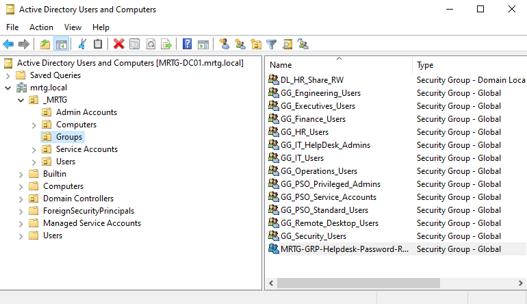

Using a group allows delegation assignments to remain separate from individual user accounts.

---

### 3. Created the Delegated Administrator

Display name:

```text
Jordan Hale (Admin)
```

User logon name:

```text
adm.hd-reset01
```

Location:

```text
_MRTG\Admin Accounts
```

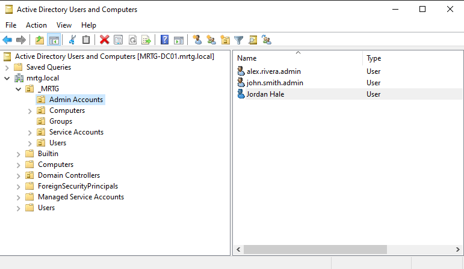

The separate administrative identity supports accountability and keeps privileged activity separate from normal user activity.

---

### 4. Assigned the Delegated Role

`adm.hd-reset01` was added to:

```text
MRTG-GRP-Helpdesk-Password-Reset-Delegated
```

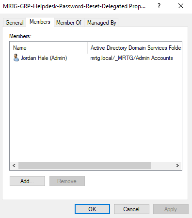

---

### 5. Selected the Delegation Group

The Delegation of Control Wizard was opened on:

```text
mrtg.local/_MRTG/Users
```

Selected group:

```text
MRTG-GRP-Helpdesk-Password-Reset-Delegated
```

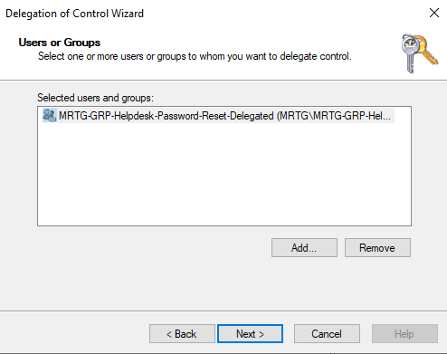

---

### 6. Selected the Password-Reset Task

Selected task:

```text
Reset user passwords and force password change at next logon
```

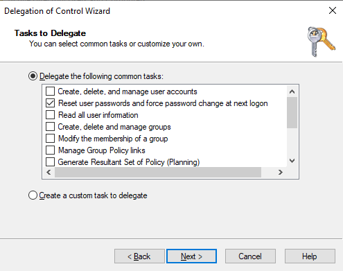

No additional delegation tasks were selected.

---

### 7. Completed the Delegation Wizard

The wizard applied the delegated permissions to the selected group at the Users OU.

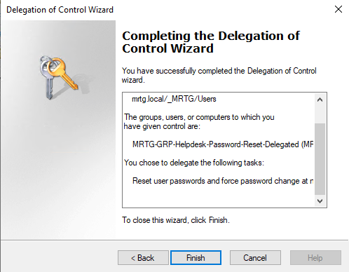

---

### 8. Identified the In-Scope Test User

Standard test account:

```text
Kevin Carter
```

Location:

```text
_MRTG\Users\HR
```

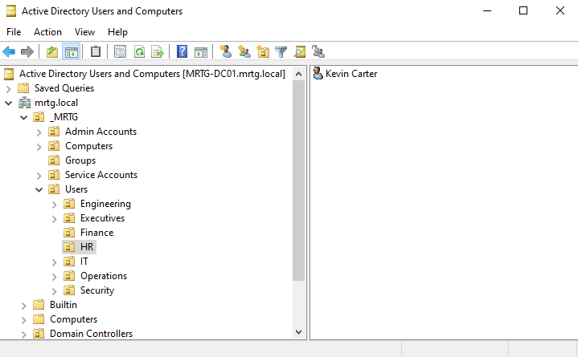

The HR OU is a child of the delegated Users OU, placing Kevin Carter within the intended inheritance scope.

---

### 9. Granted Management-Workstation Access

Commands run on `CLIENT01`:

```cmd
net localgroup "Remote Desktop Users" "MRTG\adm.hd-reset01" /add
net localgroup "Remote Desktop Users"
```

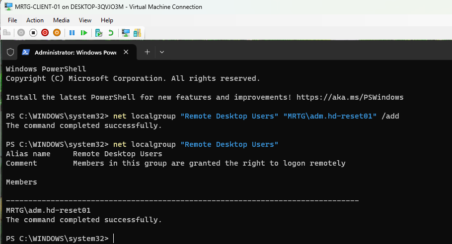

This granted Remote Desktop access to the management workstation for the controlled test.

---

### 10. Confirmed the Delegated Sign-In

The delegated administrator signed in to `CLIENT01`.

Command used:

```cmd
whoami
```

Validated result:

```text
mrtg\adm.hd-reset01
```

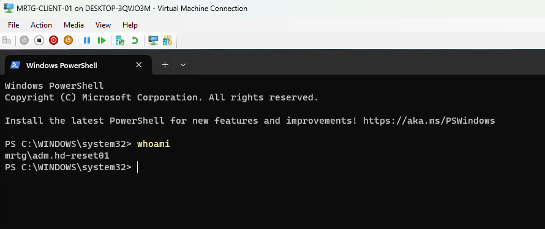

This confirmed the active security context on the management workstation.

---

### 11. Confirmed Domain Controller Session Denial

A session attempt was made on `MRTG-DC01`.

```cmd
runas /user:MRTG\adm.hd-reset01 cmd
```

Result:

```text
1385: Logon failure: the user has not been granted the requested logon type at this computer.
```


This confirmed that the delegated directory permission did not grant the requested logon right on the domain controller.

---

### 12. Identified Kevin Carter's Directory Attributes

Command used:

```powershell
Get-ADUser -Filter "Name -eq 'Kevin Carter'" |
    Select-Object Name, SamAccountName, DistinguishedName
```

Validated values:

```text
SamAccountName: kevin.carter
DistinguishedName: CN=Kevin Carter,OU=HR,OU=Users,OU=_MRTG,DC=mrtg,DC=local
```


This confirmed that the target account was located beneath the delegated Users OU.

---

### 13. Tested the net user Method

Command used:

```cmd
net user kevin.carter "<TemporaryPassword>" /domain
```

Result:

```text
System error 5 has occurred.
Access is denied.
```


This method did not succeed under the delegated session and was documented as part of troubleshooting.

No real password should be stored in public documentation. The command above uses a placeholder.

---

### 14. Confirmed the Delegated Group in the Security Token

Command used:

```cmd
whoami /groups
```

Confirmed group:

```text
MRTG\MRTG-GRP-Helpdesk-Password-Reset-Delegated
```


This confirmed that the delegated role was present in the active logon token.

---

### 15. Tested an Out-of-Scope Privileged Account

Target:

```text
alex.rivera.admin
```

Location:

```text
_MRTG\Admin Accounts
```

Commands used:

```powershell
$admin = [ADSI]"LDAP://CN=alex.rivera.admin,OU=Admin Accounts,OU=_MRTG,DC=mrtg,DC=local"
$admin.psbase.Invoke("SetPassword", "<TemporaryPassword>")
$admin.psbase.CommitChanges()
```

Result:

```text
Access is denied.
Exception from HRESULT: 0x80070005 (E_ACCESSDENIED)
```

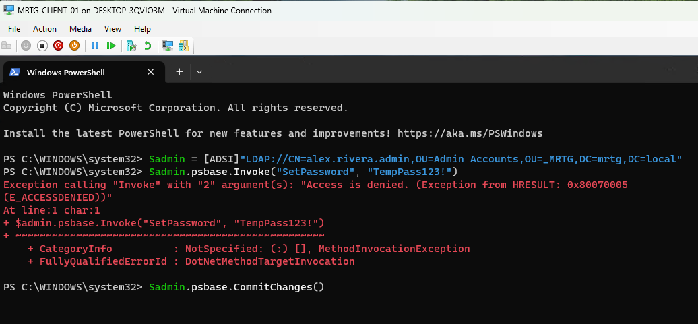

This confirmed that the delegated permission did not extend to the Admin Accounts OU.

---

### 16. Reset the In-Scope Standard User Password

The delegated administrator used ADSI from the management workstation.

```powershell
whoami

$user = [ADSI]"LDAP://CN=Kevin Carter,OU=HR,OU=Users,OU=_MRTG,DC=mrtg,DC=local"
$user.psbase.Invoke("SetPassword", "<TemporaryPassword>")
$user.psbase.Properties["pwdLastSet"].Value = 0
$user.psbase.CommitChanges()
```


Validation included:

```text
Security context: mrtg\adm.hd-reset01
No access-denied exception returned
CommitChanges completed
pwdLastSet configured to require a password change
```

This confirmed command completion under the delegated account.

A complete production validation would also confirm the reset through an approved test sign-in and review Event ID `4724`.

---

### 17. Created the MRTG-DC01 Lab Checkpoint

Checkpoint name:

```text
MRTG-DC01_Post-Lab-16-Delegation-and-Tiered-Admin-Boundaries-Validated
```

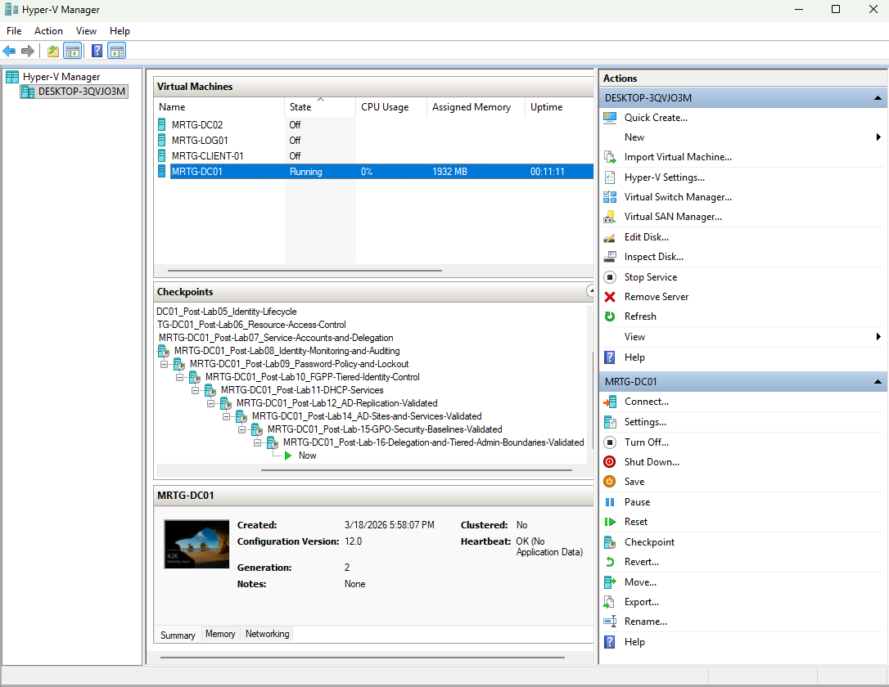

---

### 18. Created the Management-Workstation Lab Checkpoint

Checkpoint name:

```text
Post-Lab-16-Delegation-and-Tiered-Admin-Boundaries-Validated
```


The checkpoints were temporary lab recovery points and were not treated as backups.

---

## Validation Commands

### Add the Delegated Account to Remote Desktop Users

```cmd
net localgroup "Remote Desktop Users" "MRTG\adm.hd-reset01" /add
net localgroup "Remote Desktop Users"
```

### Confirm the Current Security Context

```cmd
whoami
```

### Confirm Token Group Membership

```cmd
whoami /groups
```

### Identify the Standard User

```powershell
Get-ADUser -Filter "Name -eq 'Kevin Carter'" |
    Select-Object Name, SamAccountName, DistinguishedName
```

### Attempt a Password Reset with net user

```cmd
net user kevin.carter "<TemporaryPassword>" /domain
```

### Reset the Standard User Password with ADSI

```powershell
$user = [ADSI]"LDAP://CN=Kevin Carter,OU=HR,OU=Users,OU=_MRTG,DC=mrtg,DC=local"
$user.psbase.Invoke("SetPassword", "<TemporaryPassword>")
$user.psbase.Properties["pwdLastSet"].Value = 0
$user.psbase.CommitChanges()
```

### Attempt an Out-of-Scope Password Reset

```powershell
$admin = [ADSI]"LDAP://CN=alex.rivera.admin,OU=Admin Accounts,OU=_MRTG,DC=mrtg,DC=local"
$admin.psbase.Invoke("SetPassword", "<TemporaryPassword>")
$admin.psbase.CommitChanges()
```

### Attempt a Session on the Domain Controller

```cmd
runas /user:MRTG\adm.hd-reset01 cmd
```

---

## Troubleshooting Note

The following command returned Access Denied:

```cmd
net user kevin.carter "<TemporaryPassword>" /domain
```

The active token was reviewed with:

```cmd
whoami /groups
```

The delegated group was present, and the password-reset delegation was then validated through LDAP and ADSI.

This demonstrated that different administrative interfaces may use different protocols or permission paths. A failed tool does not automatically prove that the underlying delegated Access Control Entry is incorrect.

RSAT Active Directory Users and Computers was not available on the management workstation, so ADSI provided the functional validation method.

---

## Security Boundary Results

| Test | Expected Result | Actual Result |
|---|---|---|
| Sign in to management workstation | Allowed | Allowed |
| Delegated group present in token | Present | Present |
| Reset Kevin Carter's password with ADSI | Allowed | Allowed |
| Reset privileged administrator password | Denied | Denied |
| Start requested session on domain controller | Denied | Denied |
| Receive Domain Admin membership | Not granted | Not granted |

Delegated directory permissions and computer logon rights are separate controls.

---

## Security and IAM Relevance

This lab demonstrates:

- Task-specific administrative delegation
- Group-based permission assignment
- Named administrative accountability
- OU-scoped access
- Separation of standard and privileged identities
- Management-workstation administration
- Positive authorization testing
- Negative boundary testing
- Reduced dependence on Domain Admin accounts

The lab is relevant to regulated environments because it documents who receives access, what task is permitted, where the permission applies, and which actions remain denied.

---

## Risks Addressed

This lab reduces the risk of:

- Help Desk personnel receiving Domain Admin access
- Standard user accounts being used for administration
- Password-reset rights extending to privileged accounts
- Administrators working directly on domain controllers
- Direct assignment of delegation to one individual
- Unvalidated administrative boundaries
- Unclear responsibility for delegated actions

---

## Control Mapping

| Control Area | Lab Contribution |
|---|---|
| Least Privilege | Limits the role to a defined password-reset task |
| Group-Based Delegation | Assigns the permission to a security group |
| Scope Control | Limits inherited delegation to `_MRTG\Users` |
| Privileged Account Protection | Confirms denial against `_MRTG\Admin Accounts` |
| Administrative Separation | Uses a named administrator instead of a standard account |
| Management Boundary | Performs delegated work from a workstation |
| Negative Testing | Confirms out-of-scope actions fail |
| Audit Readiness | Captures configuration and test evidence |

---

## Validation Results

| Validation Item | Result |
|---|---|
| Existing OU structure reviewed | Passed |
| Delegated password-reset group created | Passed |
| Named delegated account created | Passed |
| Delegated account added to the group | Passed |
| Delegation applied to `_MRTG\Users` | Passed |
| Password-reset task selected | Passed |
| In-scope standard user identified | Passed |
| Management-workstation access granted | Passed |
| Delegated sign-in confirmed | Passed |
| Domain controller session attempt denied | Passed |
| Standard user's distinguished name confirmed | Passed |
| `net user /domain` method | Access denied |
| Delegated group confirmed in token | Passed |
| Privileged-account password reset denied | Passed |
| Standard-user ADSI password reset completed | Passed |
| Temporary checkpoints created | Passed |

---

## Evidence Collected

| Evidence | Screenshot |
|---|---|
| Baseline ADUC structure | `screenshots/lab-16-01-aduc-baseline-before-delegation.png` |
| Delegated group creation | `screenshots/lab-16-02-helpdesk-password-reset-delegated-group-created.png` |
| Delegated account creation | `screenshots/lab-16-03-delegated-helpdesk-admin-account-created.png` |
| Delegated group membership | `screenshots/lab-16-04-delegated-admin-added-to-password-reset-group.png` |
| Delegation group selection | `screenshots/lab-16-05-delegation-wizard-group-selected-for-users-ou.png` |
| Password-reset task selection | `screenshots/lab-16-06-delegation-task-reset-password-selected.png` |
| Delegation Wizard completion | `screenshots/lab-16-07-delegation-wizard-completion-summary.png` |
| Standard user target | `screenshots/lab-16-08-standard-users-ou-target-accounts.png` |
| Workstation Remote Desktop membership | `screenshots/lab-16-09-delegated-admin-added-to-client-remote-desktop-users.png` |
| Delegated workstation sign-in | `screenshots/lab-16-10-delegated-admin-signed-into-management-workstation.png` |
| Domain controller session denial | `screenshots/lab-16-11-delegated-admin-denied-logon-to-domain-controller.png` |
| Standard user directory attributes | `screenshots/lab-16-12-kevin-carter-samaccountname-identified.png` |
| `net user` failure | `screenshots/lab-16-13-delegated-admin-net-user-reset-access-denied.png` |
| Delegated token membership | `screenshots/lab-16-14-delegated-admin-group-membership-token-check.png` |
| Privileged-account reset denial | `screenshots/lab-16-15-delegated-admin-denied-reset-admin-account.png` |
| Standard-user ADSI reset | `screenshots/lab-16-16-delegated-admin-adsi-password-reset-success.png` |
| MRTG-DC01 checkpoint | `screenshots/lab-16-17-final-lab16-checkpoint-dc01-created.png` |
| Management-workstation checkpoint | `screenshots/lab-16-18-final-lab16-checkpoint-client01-created.png` |

---

## What I Would Improve in Production

In a production environment, I would:

- Use an approved Privileged Access Management process
- Require multifactor authentication for delegated administrators
- Use a hardened Privileged Access Workstation
- Install approved RSAT tools on the management workstation
- Grant workstation sign-in through a domain group and centralized policy
- Use separate role and permission groups where the group model requires it
- Require access requests and approval records
- Verify user identity before every password reset
- Generate random temporary passwords securely
- Avoid exposing passwords in commands, screenshots, or documentation
- Audit Event ID `4724` and related account-management events
- Forward delegated-administration events to the SIEM
- Review delegated group membership regularly
- Review delegated Access Control Entries regularly
- Use time-bound access where supported
- Document permissions in an access-control matrix
- Use supported backups instead of Hyper-V checkpoints

---

## Lessons Learned

This lab reinforced that delegated administration is not the same as full administration.

The delegated account could perform one approved task within one directory scope. It could not reset a privileged account outside that scope or obtain the requested logon type on the domain controller.

The primary takeaway is that least privilege must be tested in both directions. Successful in-scope action proves usability, while denied out-of-scope actions prove the boundary.

The troubleshooting process also showed that tool behavior and underlying directory permissions are not always identical. Functional testing should use an approved management interface and capture the resulting audit event.

---

## Outcome

Lab 16 successfully implemented and tested a task-specific Help Desk password-reset role.

The lab confirmed that:

- A dedicated delegation group was created
- A named delegated administrator was assigned to the role
- Password-reset permissions were scoped to `_MRTG\Users`
- The delegated account worked from the management workstation
- The delegated group appeared in the active security token
- Kevin Carter's in-scope password reset completed through ADSI
- A privileged administrator's password reset was denied
- The requested domain controller session was denied
- Domain Admin membership was not granted

The environment now supports a validated least-privilege password-reset workflow for standard users.

---

## Next Lab

[Lab 17: Windows LAPS and Local Administrator Control](../Lab-17-Windows-LAPS-and-Local-Administrator-Control/)

Lab 17 implements Windows LAPS to manage local administrator passwords and reduce shared local credential risk on domain-joined systems.
