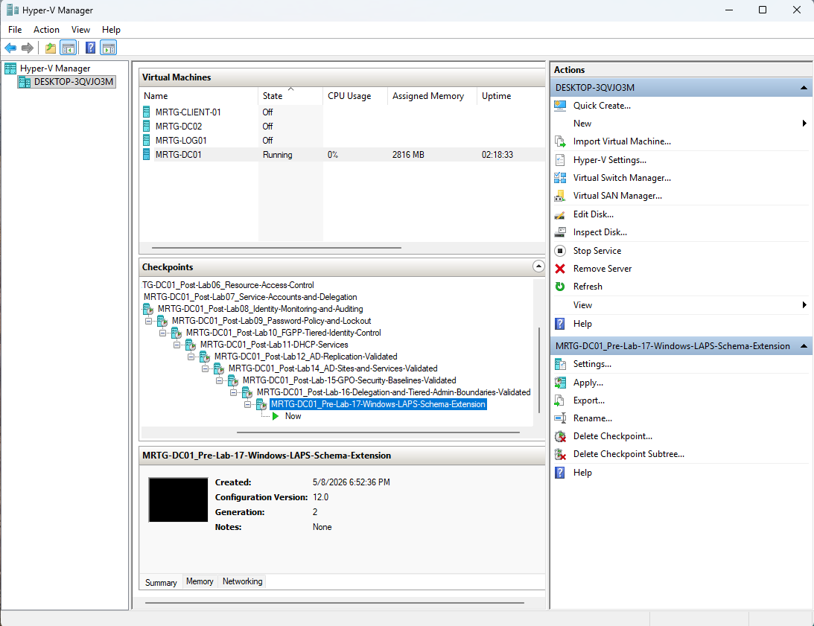
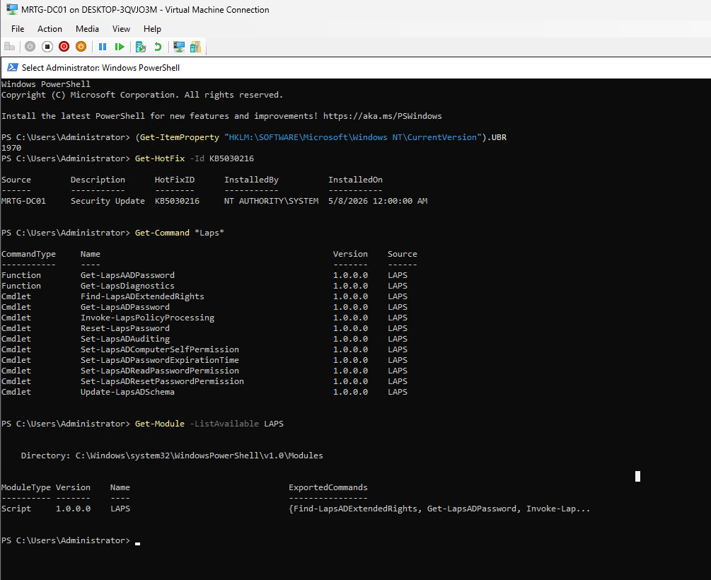
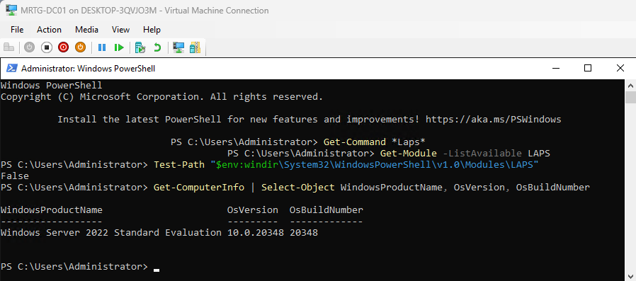
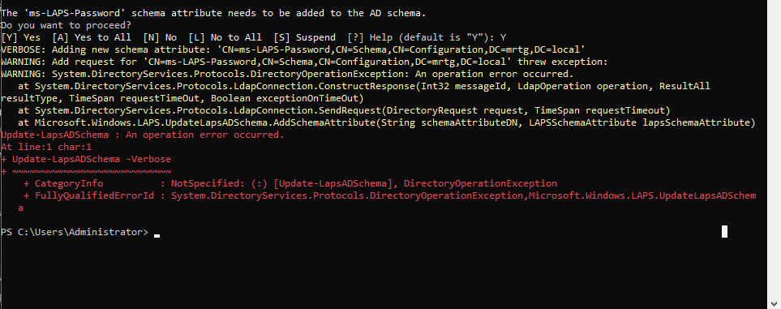
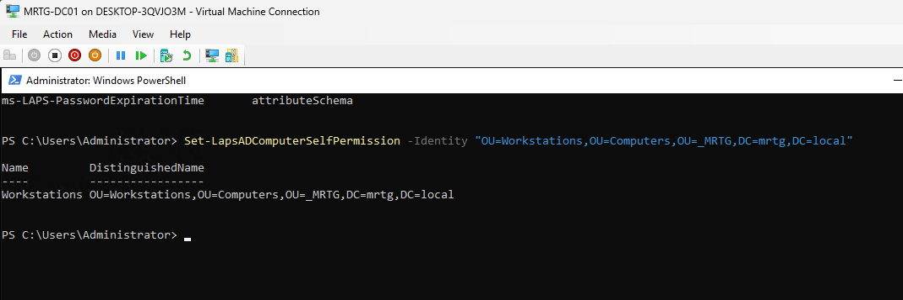
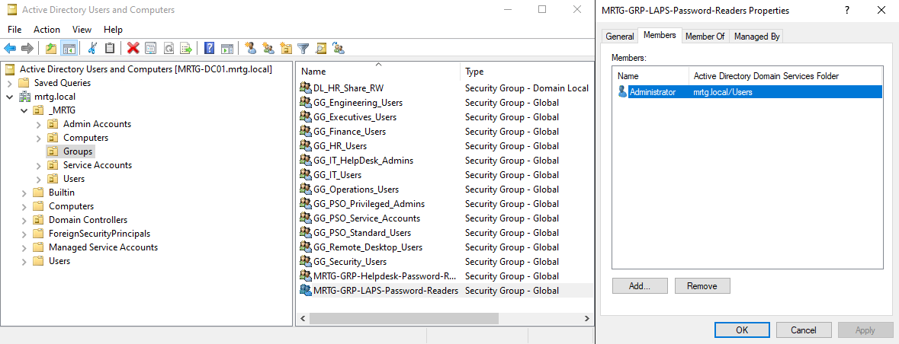
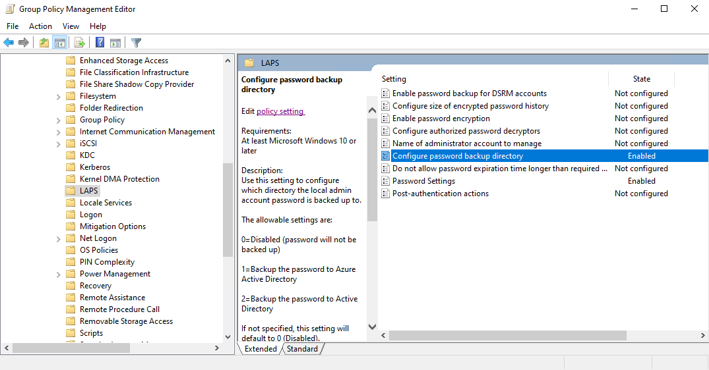
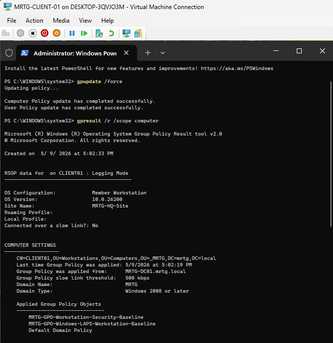
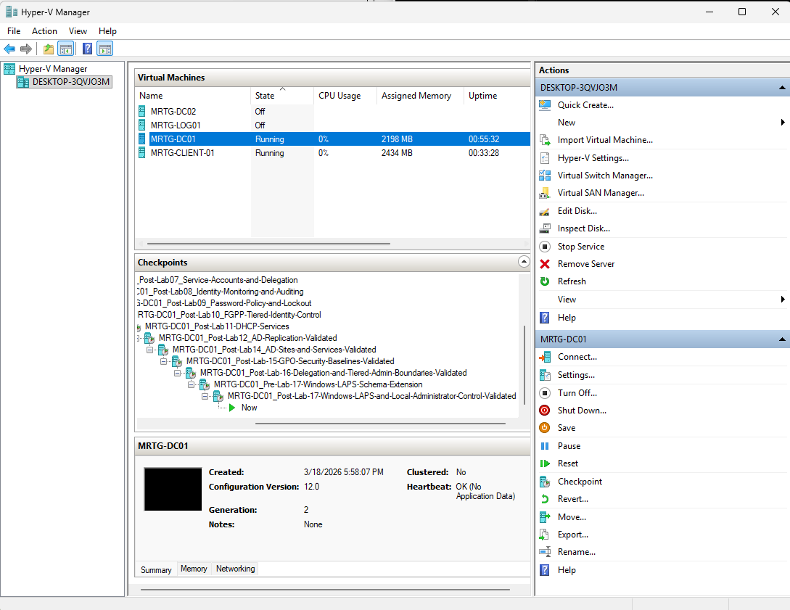
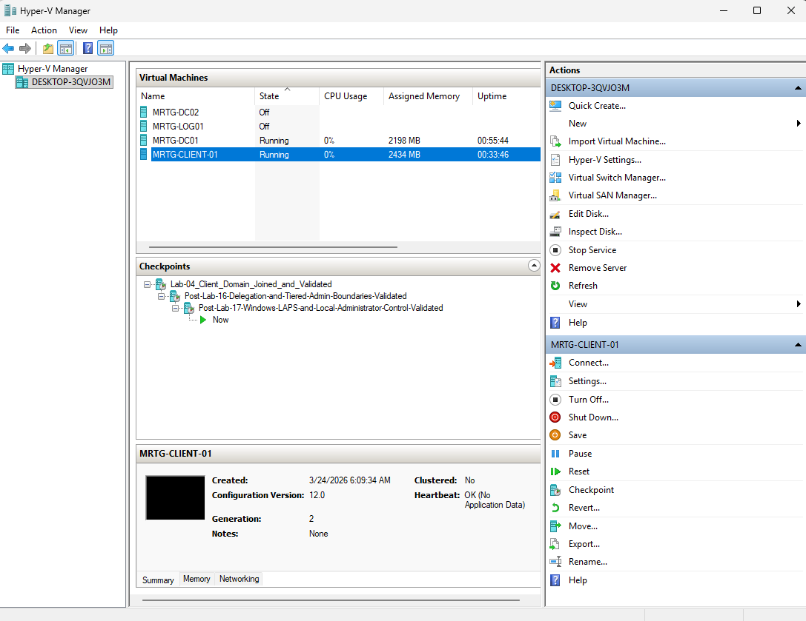

# Lab 17 — Windows LAPS and Local Administrator Control


---

## Overview

In this lab, I implemented Windows Local Administrator Password Solution, also known as Windows LAPS, in the Monroe Redstone Technology Group Active Directory environment.

This lab focused on controlling the local Administrator password for domain-joined workstations by backing up the password to Active Directory, delegating read access, applying policy through Group Policy, and validating that LAPS processed correctly on the client system.

This lab also included troubleshooting a schema extension issue caused by an Active Directory replication and DNS health problem before completing the LAPS deployment.

---

## Business Problem

MRTG needed a secure way to manage local Administrator passwords on domain-joined workstations.

In many organizations, unmanaged local Administrator passwords create serious risk. If the same local admin password is reused across multiple systems, one compromised workstation can become a path for lateral movement across the environment.

This lab solves that problem by implementing Windows LAPS to manage local Administrator passwords, store password data in Active Directory, and delegate password retrieval only to an approved security group.

---

## Lab Summary

In this lab, I configured Windows LAPS for the MRTG workstation environment.

The lab started by creating a pre-change checkpoint before any schema-related work. I then confirmed that `CLIENT01` was located in the correct Workstations OU and validated Windows LAPS availability on the domain controller.

During the schema extension process, I encountered a directory health issue tied to replication and DNS. Instead of skipping the problem, I validated and restored replication health before continuing. After the environment was healthy, I confirmed that the Windows LAPS schema attributes were present.

I then configured LAPS computer self-permission, created a dedicated password readers group, delegated LAPS password read permission, linked a Windows LAPS GPO to the Workstations OU, applied policy to `CLIENT01`, invoked LAPS policy processing, and validated password metadata retrieval from Active Directory.

---

## Objectives

- Create a pre-change checkpoint before extending the AD schema
- Confirm the target workstation object is located in the correct Workstations OU
- Validate Windows LAPS availability on the domain controller
- Confirm required Windows LAPS PowerShell commands are available
- Verify Schema Admins, Enterprise Admins, and Domain Admins context before schema work
- Identify and troubleshoot a failed LAPS schema extension attempt
- Restore AD replication health before retrying schema validation
- Verify Windows LAPS schema attributes exist in Active Directory
- Grant computer self-permission for LAPS password updates
- Create a delegated LAPS password readers group
- Delegate LAPS password read permissions using a security group
- Create and link a Windows LAPS workstation baseline GPO
- Apply the Windows LAPS policy to the client workstation
- Invoke LAPS policy processing on the client
- Validate LAPS password metadata retrieval from Active Directory
- Create final checkpoints after successful validation

---

## Scope

### Included

- Windows LAPS readiness validation
- Active Directory schema validation
- LAPS permission delegation
- Group-based password read access
- Workstation-focused LAPS policy configuration
- Client-side Group Policy validation
- LAPS policy processing validation
- LAPS password metadata retrieval
- Active Directory replication troubleshooting
- Hyper-V checkpoint creation after validation

### Not Included

- Microsoft Entra ID LAPS backup
- Intune policy deployment
- Cloud-only device management
- Privileged Access Management platform deployment
- Automated password retrieval workflows
- Production password disclosure procedures
- SIEM forwarding for LAPS retrieval events
- Just-in-time password access workflow

---

## Lab Environment

| Component | Details |
|---|---|
| Organization | Monroe Redstone Technology Group |
| Domain | `mrtg.local` |
| Primary Domain Controller | `MRTG-DC01` |
| Additional Domain Controller | `MRTG-DC02` |
| Client VM | `MRTG-CLIENT-01` |
| Client Computer Object | `CLIENT01` |
| Target OU | `_MRTG/Computers/Workstations` |
| Management Tooling | Active Directory Users and Computers, Group Policy Management, PowerShell |
| LAPS Model | Windows LAPS with Active Directory backup |
| Hypervisor | Hyper-V |

---

## Architecture and Design

The MRTG environment uses a dedicated Workstations OU to apply endpoint-specific security controls. Windows LAPS was configured through a workstation baseline GPO linked to the Workstations OU.

The design separates three key responsibilities:

| Area | Design Decision |
|---|---|
| Password storage | Back up local Administrator password data to Active Directory |
| Password management scope | Apply LAPS only to workstation computer objects in the Workstations OU |
| Password read access | Delegate read permissions to a dedicated group instead of using one-off user permissions |
| Policy enforcement | Use Group Policy to apply LAPS settings to domain-joined workstations |
| Validation | Confirm policy application, LAPS processing, and password metadata retrieval |

This supports a cleaner IAM model because local administrator password control is no longer manual, shared, or undocumented.

---

## Technologies Used

- Active Directory Domain Services
- Active Directory Users and Computers
- Group Policy Management Console
- Group Policy Management Editor
- Windows LAPS
- Windows PowerShell
- Hyper-V
- Windows Server 2022
- Windows client workstation

---

## Security Model

Windows LAPS reduces risk by ensuring that local Administrator passwords are unique, managed, and retrievable only by authorized users.

This lab used the following control model:

| Control | Purpose |
|---|---|
| Workstations OU | Defines the target scope for LAPS management |
| Windows LAPS GPO | Applies LAPS configuration to workstation systems |
| Computer self-permission | Allows workstation objects to update their own LAPS password attributes |
| LAPS password readers group | Controls who can retrieve local administrator password data |
| AD schema attributes | Stores LAPS password and expiration metadata |
| Final validation | Confirms that the workstation processed policy and wrote password data |

---

## Key Accounts, Groups, and Objects

| Object | Purpose |
|---|---|
| `CLIENT01` | Target workstation computer object |
| `MRTG-GPO-Windows-LAPS-Workstation-Baseline` | GPO used to configure Windows LAPS settings |
| `MRTG-GRP-LAPS-Password-Readers` | Delegated group allowed to read LAPS password data |
| `Administrator` | Account added to password readers group for lab validation |
| `_MRTG/Computers/Workstations` | OU targeted for LAPS management |

---

## Implementation Steps

### Step 1 — Created a Pre-LAPS Schema Extension Checkpoint

A Hyper-V checkpoint was created before making schema-related changes.

This provided a rollback point before performing higher-risk directory changes.

Checkpoint name:

```text
MRTG-DC01_Pre-Lab-17-Windows-LAPS-Schema-Extension
```



---

### Step 2 — Confirmed Client Computer Object Placement

Confirmed that `CLIENT01` was located under the Workstations OU.

This established the correct target scope before applying Windows LAPS policy.


---

### Step 3 — Validated Windows LAPS Commands and KB Installation

Validated that the required update was installed and confirmed that Windows LAPS PowerShell commands were available.

Commands used included:

```powershell
Get-HotFix -Id KB5030216
Get-Command *Laps*
Get-Module -ListAvailable LAPS
```



---

### Step 4 — Documented Initial Windows LAPS Module Path Check

Checked the domain controller for Windows LAPS module availability and confirmed the operating system build information.

The initial path validation showed that the expected LAPS module path was not detected, while the LAPS commands were still available through the installed LAPS module.



---

### Step 5 — Validated Schema Admin Context

Confirmed that the current administrative context had the required privileged group memberships for schema-related work.

Validated memberships included:

```text
Schema Admins
Enterprise Admins
Domain Admins
```


---

### Step 6 — Attempted LAPS Schema Extension and Documented Failure

Attempted the Windows LAPS schema extension and encountered an operation error.

This was treated as a real troubleshooting point instead of being skipped.

Command used:

```powershell
Update-LapsADSchema -Verbose
```



---

### Step 7 — Identified Replication and DNS Failure Before Schema Retry

Checked FSMO role ownership and replication health.

The replication summary showed a DNS lookup failure between domain controllers.

Commands used included:

```cmd
netdom query fsmo
repadmin /replsummary
dcdiag /test:advertising /test:services /test:replications
```


---

### Step 8 — Restored Replication Health

Restored replication health and confirmed that domain controller replication returned to a healthy state before continuing.

Validation command:

```cmd
repadmin /replsummary
```


---

### Step 9 — Verified Windows LAPS Schema Attributes

Verified that the Windows LAPS schema attributes were present in Active Directory.

The `ms-LAPS-*` attributes were required for password storage and expiration metadata.

Validated attributes included:

```text
ms-LAPS-EncryptedDSRMPassword
ms-LAPS-EncryptedDSRMPasswordHistory
ms-LAPS-EncryptedPassword
ms-LAPS-EncryptedPasswordHistory
ms-LAPS-Password
ms-LAPS-PasswordExpirationTime
```


---

### Step 10 — Granted Computer Self-Permission on the Workstations OU

Granted the required LAPS computer self-permission on the Workstations OU.

This allows managed workstation computer objects to update their own LAPS password attributes in Active Directory.

Command used:

```powershell
Set-LapsADComputerSelfPermission -Identity "OU=Workstations,OU=Computers,OU=_MRTG,DC=mrtg,DC=local"
```



---

### Step 11 — Created the LAPS Password Readers Group

Created the `MRTG-GRP-LAPS-Password-Readers` security group to control who can read LAPS password data.


---

### Step 12 — Added an Authorized Reader to the LAPS Password Readers Group

Added the `Administrator` account to the LAPS password readers group for lab validation.



---

### Step 13 — Delegated LAPS Password Read Permission

Delegated LAPS password read permission on the Workstations OU to the `MRTG-GRP-LAPS-Password-Readers` group.

This avoided direct user-based permission assignment and kept access controlled through group membership.

Command used:

```powershell
Set-LapsADReadPasswordPermission -Identity "OU=Workstations,OU=Computers,OU=_MRTG,DC=mrtg,DC=local" -AllowedPrincipals "MRTG\MRTG-GRP-LAPS-Password-Readers"
```


---

### Step 14 — Linked the Windows LAPS GPO to the Workstations OU

Linked the Windows LAPS workstation baseline GPO to the Workstations OU.

This ensured that the policy would apply only to workstation computer objects in the intended OU scope.

GPO linked:

```text
MRTG-GPO-Windows-LAPS-Workstation-Baseline
```


---

### Step 15 — Configured Windows LAPS Policy Settings

Configured Windows LAPS policy settings through Group Policy.

The policy was configured to back up local Administrator password data to Active Directory and apply password management controls to the workstation.



---

### Step 16 — Applied and Validated Group Policy on CLIENT01

Forced a Group Policy update on `CLIENT01` and used `gpresult` to confirm that the Windows LAPS workstation baseline GPO applied successfully.

Commands used:

```cmd
gpupdate /force
gpresult /r /scope computer
```



---

### Step 17 — Invoked Windows LAPS Policy Processing

Confirmed that Windows LAPS commands were available on the client and manually invoked LAPS policy processing.

The processing completed successfully.

Command used:

```powershell
Invoke-LapsPolicyProcessing -Verbose
```


---

### Step 18 — Retrieved LAPS Password Metadata

Retrieved Windows LAPS password metadata for `CLIENT01` from Active Directory.

The validation confirmed that password data was being stored and that decryption status was successful.

The actual password was not documented in this README.

Commands used:

```powershell
Get-LapsADPassword -Identity CLIENT01
Get-LapsADPassword -Identity CLIENT01 -AsPlainText
```


---

### Step 19 — Created Final Post-Lab Checkpoint for MRTG-DC01

Created a post-lab checkpoint for `MRTG-DC01` after validating Windows LAPS configuration.

Checkpoint name:

```text
MRTG-DC01_Post-Lab-17-Windows-LAPS-and-Local-Administrator-Control-Validated
```



---

### Step 20 — Created Final Post-Lab Checkpoint for MRTG-CLIENT-01

Created a post-lab checkpoint for `MRTG-CLIENT-01` after confirming the client processed the Windows LAPS policy.

Checkpoint name:

```text
Post-Lab-17-Windows-LAPS-and-Local-Administrator-Control-Validated
```



---

## Validation and Verification

| Validation Item | Result |
|---|---|
| Pre-change checkpoint created before schema work | Passed |
| `CLIENT01` located in Workstations OU | Passed |
| Windows LAPS commands available after update validation | Passed |
| Initial LAPS module path check documented | Passed |
| Schema Admin, Enterprise Admin, and Domain Admin context reviewed | Passed |
| Initial schema extension issue identified | Passed |
| Replication health issue identified and corrected | Passed |
| Windows LAPS schema attributes verified | Passed |
| Computer self-permission applied to Workstations OU | Passed |
| LAPS password readers group created | Passed |
| Authorized reader added to delegated group | Passed |
| LAPS read password permission delegated to group | Passed |
| Windows LAPS GPO linked to Workstations OU | Passed |
| Windows LAPS policy settings configured | Passed |
| GPO applied to `CLIENT01` | Passed |
| LAPS policy processing completed successfully | Passed |
| LAPS password metadata retrieved from AD | Passed |
| Final DC01 checkpoint created | Passed |
| Final CLIENT01 checkpoint created | Passed |

---

## Evidence Collected

| Evidence | Screenshot |
|---|---|
| Pre-LAPS schema checkpoint | `screenshots/lab-17-01-pre-laps-schema-extension-checkpoint.png` |
| Client computer object in Workstations OU | `screenshots/lab-17-02-client01-computer-object-in-workstations-ou.png` |
| KB and LAPS command validation | `screenshots/lab-17-03-kb5030216-installed-and-laps-commands-available.png` |
| Initial LAPS module path check | `screenshots/lab-17-04-windows-laps-module-not-detected.png` |
| Schema Admin membership check | `screenshots/lab-17-05-schema-admin-membership-check.png` |
| Failed schema extension attempt | `screenshots/lab-17-06-laps-schema-extension-failed-operation-error.png` |
| Replication DNS failure before retry | `screenshots/lab-17-07-replication-dns-failure-before-laps-schema-retry.png` |
| Replication health restored | `screenshots/lab-17-08-replication-health-restored-before-laps-schema-retry.png` |
| LAPS schema attributes verified | `screenshots/lab-17-09-windows-laps-schema-extension-verified.png` |
| LAPS computer self-permission applied | `screenshots/lab-17-10-workstations-ou-laps-computer-self-permission-set.png` |
| LAPS password readers group created | `screenshots/lab-17-11-laps-password-readers-group-created.png` |
| Admin added to LAPS password readers group | `screenshots/lab-17-12-admin-added-to-laps-password-readers-group.png` |
| LAPS read permission delegated | `screenshots/lab-17-13-laps-read-password-permission-delegated.png` |
| Windows LAPS GPO linked | `screenshots/lab-17-14-windows-laps-gpo-linked-to-workstations-ou.png` |
| Windows LAPS policy settings configured | `screenshots/lab-17-15-windows-laps-policy-settings-configured.png` |
| Client GPO application verified | `screenshots/lab-17-16-client01-laps-gpo-applied-with-gpresult.png` |
| LAPS policy processing invoked | `screenshots/lab-17-17-client01-laps-policy-processing-invoked.png` |
| LAPS password metadata retrieved | `screenshots/lab-17-18-laps-password-retrieval-metadata.png` |
| DC01 final checkpoint | `screenshots/lab-17-19-dc01-post-lab17-checkpoint.png` |
| CLIENT01 final checkpoint | `screenshots/lab-17-20-client01-post-lab17-checkpoint.png` |

---

## Troubleshooting Notes

During the schema extension process, the initial Windows LAPS schema update attempt failed with an operation error.

Rather than forcing the change forward, I validated domain controller health and discovered a replication or DNS-related issue involving domain controller communication.

The issue was corrected before continuing. After replication health was restored, the required `ms-LAPS-*` schema attributes were verified successfully.

This was an important part of the lab because schema changes should not be performed on top of unhealthy Active Directory replication.

---

## Security Lessons Learned

This lab reinforced several important IAM and endpoint security lessons:

- Local Administrator passwords should not be shared, reused, or manually tracked
- LAPS helps reduce lateral movement risk by rotating and storing local admin passwords securely
- Password retrieval should be delegated through groups, not assigned directly to individual users
- OU targeting matters because policy scope determines which systems are managed
- Schema changes require healthy Active Directory replication
- Troubleshooting AD health is part of real identity administration work
- Password metadata can be documented, but actual passwords should not be exposed in public documentation

---

## What I Would Improve in Production

In a production environment, I would improve this implementation by:

- Using a dedicated privileged access group instead of the built-in Administrator account for password retrieval
- Requiring separate named admin accounts for LAPS password access
- Enforcing stronger auditing for LAPS password retrieval events
- Documenting a formal break-glass process for local administrator access
- Limiting LAPS password reader membership through approval-based access
- Reviewing delegated permissions with `Find-LapsADExtendedRights`
- Using tiered administrative workstations for privileged access
- Validating replication health before all schema or domain-wide changes
- Creating formal change records before extending the AD schema
- Monitoring LAPS-related activity through centralized logging or SIEM

---

## Skills Demonstrated

- Windows LAPS deployment
- Active Directory schema validation
- Active Directory replication troubleshooting
- DNS-related replication issue identification
- Group Policy configuration
- OU-scoped workstation policy targeting
- LAPS computer self-permission configuration
- Group-based LAPS password retrieval delegation
- GPO application validation with `gpresult`
- Manual LAPS policy processing
- LAPS password metadata retrieval
- Hyper-V checkpoint management
- IAM documentation and evidence capture

---

## Outcome

Lab 17 successfully implemented Windows LAPS and local Administrator password control in the MRTG Active Directory environment.

The lab confirmed that:

- `CLIENT01` was properly scoped inside the Workstations OU
- Windows LAPS functionality was available after update validation
- LAPS schema attributes were present in Active Directory
- Computer self-permission was applied to allow password updates
- Password read access was delegated through a dedicated group
- The Windows LAPS GPO applied successfully to the client workstation
- LAPS policy processing completed successfully
- LAPS password metadata could be retrieved from Active Directory

This lab strengthened the IAM series by adding endpoint-level local Administrator control, which is a major security improvement over shared or unmanaged local admin passwords.

---

## Next Lab

[Lab 18 — Group-Based Access Control for File and Department Resources](../Lab-18-Group-Based-Access-Control-for-File-and-Department-Resources/)

Lab 18 will build on prior IAM concepts by using Active Directory security groups to control access to shared resources through a scalable authorization model.
