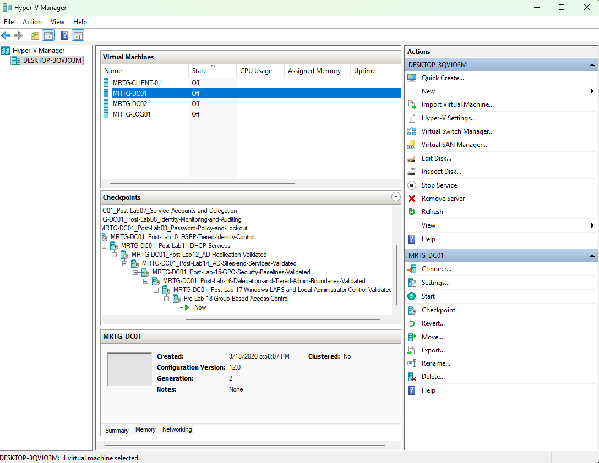
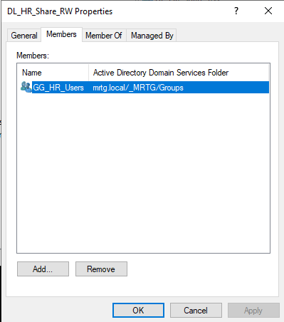
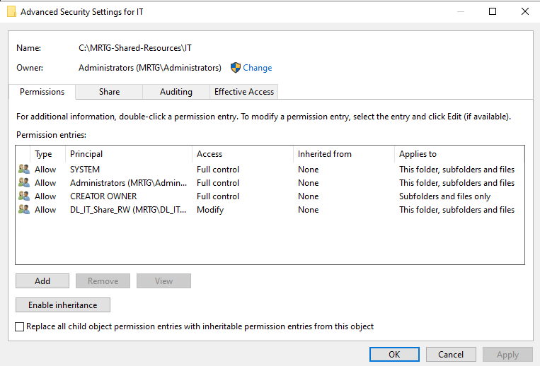
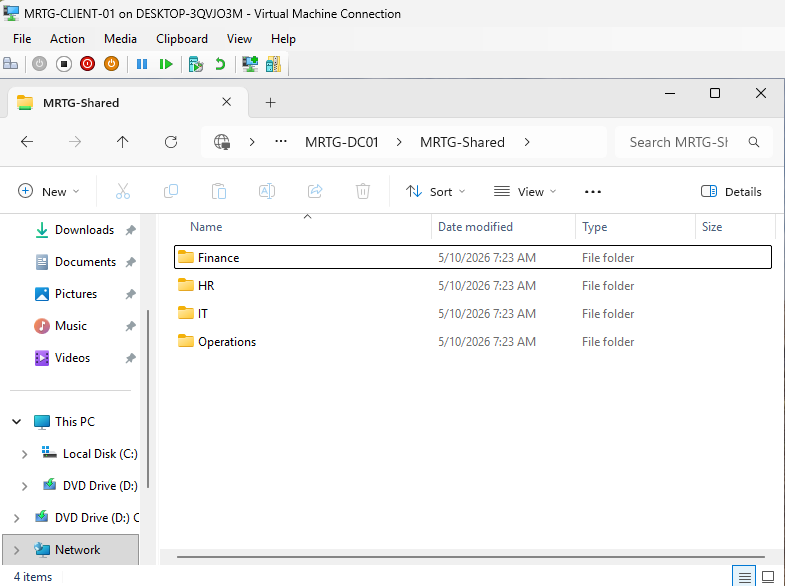
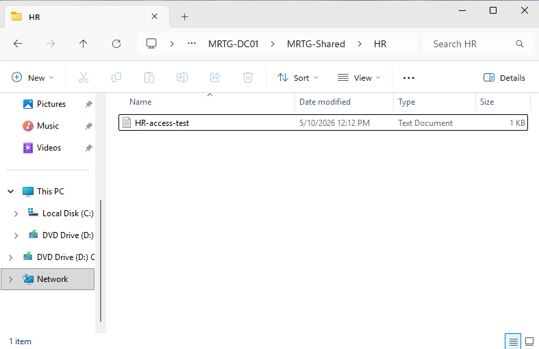

# Lab-18 — Group-Based Access Control for File and Department Resources


## Objective

The objective of this lab was to implement group-based access control for department file resources in the MRTG enterprise lab environment.

This lab focused on using Active Directory security groups and NTFS permissions to control access to shared department folders. The goal was to avoid assigning permissions directly to individual users and instead use a scalable access model based on department membership and resource access groups.

## Scope

This lab included:

- Creating a shared department resource folder structure
- Creating and validating Active Directory security groups
- Using Global Groups for department user membership
- Using Domain Local Groups for resource permissions
- Applying NTFS permissions to department folders
- Sharing the root resource folder
- Validating authorized access
- Validating unauthorized access denial
- Capturing evidence for access control validation

## Environment

| Component | Details |
|---|---|
| Domain | `mrtg.local` |
| Domain Controller | `MRTG-DC01` |
| Client Workstation | `MRTG-CLIENT-01` |
| File Share Host | `MRTG-DC01` |
| Shared Folder Path | `C:\MRTG-Shared-Resources` |
| Network Share | `\\MRTG-DC01\MRTG-Shared` |
| HR Test User | `mrtg\kevin.carter` |
| Finance Test User | `mrtg\mike.chen` |

## Scenario

Monroe Redstone Technology Group needed a controlled file access model for department resources.

Instead of assigning permissions directly to users, access was assigned through Active Directory groups. This design supports least privilege, easier access reviews, and cleaner identity lifecycle management.

The access model used in this lab was:

```text
User → Global Group → Domain Local Group → Folder Permission
```

Example:

```text
kevin.carter → GG_HR_Users → DL_HR_Share_RW → HR Folder
```

## Access Control Design

### Department Global Groups

| Department | Global Group |
|---|---|
| HR | `GG_HR_Users` |
| Finance | `GG_Finance_Users` |
| IT | `GG_IT_Users` |
| Operations | `GG_Operations_Users` |

### Resource Access Groups

| Folder | Domain Local Group | Permission |
|---|---|---|
| HR | `DL_HR_Share_RW` | Modify |
| Finance | `DL_Finance_Share_RW` | Modify |
| IT | `DL_IT_Share_RW` | Modify |
| Operations | `DL_Operations_Share_RW` | Modify |

### Group Nesting Model

| Domain Local Group | Member |
|---|---|
| `DL_HR_Share_RW` | `GG_HR_Users` |
| `DL_Finance_Share_RW` | `GG_Finance_Users` |
| `DL_IT_Share_RW` | `GG_IT_Users` |
| `DL_Operations_Share_RW` | `GG_Operations_Users` |

## Implementation Steps

### 1. Created Pre-Lab Checkpoint

A Hyper-V checkpoint was created before making Lab 18 changes.

This provided a rollback point before configuring group-based access control.



### 2. Created Department Folder Structure

A shared resource folder was created on `MRTG-DC01`:

```text
C:\MRTG-Shared-Resources
```

The following department folders were created:

```text
Finance
HR
IT
Operations
```


### 3. Created and Verified Security Groups

The lab used existing department Global Groups and created the required Domain Local resource access groups.

The Domain Local groups were configured with the correct group scope for assigning resource permissions.


### 4. Configured Group Membership

Department Global Groups were nested into their matching Domain Local resource access groups.

Example:

```text
GG_HR_Users → DL_HR_Share_RW
```



### 5. Configured Share Permissions

The root folder was shared as:

```text
\\MRTG-DC01\MRTG-Shared
```

Share permissions were configured to allow authenticated users to reach the share, while NTFS permissions handled department-level access control.


### 6. Configured NTFS Permissions

Each department folder was configured with its matching Domain Local group.

Broad user permissions were removed from department folders to prevent unintended access.

#### HR Folder

```text
DL_HR_Share_RW → Modify
```


#### Finance Folder

```text
DL_Finance_Share_RW → Modify
```


#### IT Folder

```text
DL_IT_Share_RW → Modify
```



#### Operations Folder

```text
DL_Operations_Share_RW → Modify
```


## Validation

### Shared Folder Reachability

The shared folder was accessed from `MRTG-CLIENT-01` using the UNC path:

```text
\\MRTG-DC01\MRTG-Shared
```



### HR User Context Verified

The HR test user was verified from the client workstation.

```text
mrtg\kevin.carter
```


### HR Group Membership Validated

The HR user's group membership was validated using:

```cmd
whoami /groups
```

The output confirmed membership in the HR access chain:

```text
GG_HR_Users
DL_HR_Share_RW
```


### HR Authorized Access Validated

The HR user successfully accessed the HR folder and created a test file.

```text
\\MRTG-DC01\MRTG-Shared\HR
```

Test file created:

```text
HR-access-test.txt
```



### HR Unauthorized Access Denied

The HR user attempted to access the Finance folder and was denied.

```text
\\MRTG-DC01\MRTG-Shared\Finance
```


### Finance User Remote Sign-In Access

The Finance user was confirmed as a member of the Remote Desktop access group so the user could sign in to the client workstation for testing.


### Finance Group Membership Validated

The Finance test user was validated from the client workstation.

```text
mrtg\mike.chen
```

The Finance user had the expected group access path:

```text
GG_Finance_Users
DL_Finance_Share_RW
```


### Finance Authorized Access Validated

The Finance user successfully accessed the Finance folder and created a test file.

```text
\\MRTG-DC01\MRTG-Shared\Finance
```

Test file created:

```text
Finance-access-test.txt
```


### Finance Unauthorized Access Denied

The Finance user attempted to access the HR folder and was denied.

```text
\\MRTG-DC01\MRTG-Shared\HR
```


## Validation Summary

| Test | Expected Result | Actual Result | Status |
|---|---|---|---|
| HR user accesses HR folder | Access allowed | Access allowed | Passed |
| HR user accesses Finance folder | Access denied | Access denied | Passed |
| Finance user accesses Finance folder | Access allowed | Access allowed | Passed |
| Finance user accesses HR folder | Access denied | Access denied | Passed |
| Permissions assigned directly to users | No direct user assignment | No direct user assignment | Passed |
| Permissions assigned through groups | Group-based assignment | Group-based assignment | Passed |

## Post-Lab Checkpoint

A post-lab checkpoint was created after validating group-based access control.

Checkpoint name:

```text
MRTG-DC01_Post-Lab-18-Group-Based-Access-Control-Validated
```


## Outcome

Lab 18 successfully implemented and validated group-based access control for department file resources.

The final access model used Active Directory security groups and NTFS permissions to enforce least privilege. HR and Finance users were able to access their assigned department folders while being denied access to folders outside their department.

This confirmed that department access was controlled through group membership rather than direct user permissions.

## Skills Demonstrated

- Active Directory group management
- Global Group and Domain Local Group usage
- AGDLP-style access control design
- NTFS permission configuration
- Share permission configuration
- Least privilege access control
- File share validation
- User context validation with `whoami`
- Group membership validation with `whoami /groups`
- Access denied testing
- IAM documentation and evidence capture

## Real-World Relevance

Group-based access control is a core identity and access management practice.

In enterprise and government-regulated environments, users should not receive direct permissions to sensitive resources. Access should be assigned through approved groups that align with business roles, departments, and least privilege principles.

This model improves:

- Access review accuracy
- Permission auditing
- Joiner, mover, and leaver workflows
- Department-level resource protection
- Operational consistency
- Security boundary enforcement

## Lessons Learned

- Direct user permissions are harder to manage and audit than group-based access.
- Domain Local groups are useful for assigning permissions to resources.
- Global groups are useful for organizing users by department or role.
- Access validation should prove both allowed access and denied access.
- Denied-access testing is just as important as successful-access testing.
- Clean access design supports better IAM operations and security reviews.

## Next Lab

The next lab in the MRTG Enterprise IAM Lab Series is:

```text
Lab-19 — Active Directory Certificate Services
```

Lab 19 will focus on enterprise trust services and certificate authority configuration in an Active Directory environment.
