# Lab 18: Group-Based Access Control for File and Department Resources


---

## Objective

Implement a scalable group-based authorization model for department file resources in the `mrtg.local` Active Directory domain.

This lab uses an AGDLP-style model:

```text
Accounts -> Global Groups -> Domain Local Groups -> Permissions
```

The goal is to assign permissions to resource groups rather than individual users and validate both authorized and unauthorized access.

---

## Business Scenario

Monroe Redstone Technology Group requires a scalable method for controlling access to department file resources.

Direct user permissions become difficult to manage as employees join, transfer, or leave. They also make access reviews harder because authorization is distributed across individual Access Control Entries.

This lab addresses the need to:

- Represent department membership with Global Groups
- Represent resource access with Domain Local Groups
- Assign NTFS permissions to resource groups
- Avoid direct user permissions
- Validate authorized access
- Confirm cross-department access is denied
- Support Joiner, Mover, and Leaver workflows
- Improve permission-review clarity

---

## Lab Summary

In this lab, I created department folders for HR, Finance, IT, and Operations under a central SMB share.

Existing department Global Groups were nested into matching Domain Local resource groups.

The Domain Local groups received NTFS Modify permissions on their corresponding folders.

Kevin Carter's HR account successfully accessed the HR folder and was denied access to Finance. Mike Chen's Finance account successfully accessed the Finance folder and was denied access to HR.

This confirmed that resource authorization followed group membership rather than direct user assignment.

---

## Relationship to Lab 06

Lab 06 introduced basic department file access by assigning department groups to individual shares and validating HR and IT access.

Lab 18 expands that model through:

- A central root share
- AGDLP-style group nesting
- Domain Local resource groups
- Separate identity-role and resource-permission layers
- HR and Finance positive testing
- HR and Finance negative testing
- A structure that scales more cleanly as resources increase

---

## Environment

| Component | Details |
|---|---|
| Organization | Monroe Redstone Technology Group |
| Domain | `mrtg.local` |
| Domain Controller and Lab File Server | `MRTG-DC01` |
| Client Windows Computer Name | `CLIENT01` |
| Client Hyper-V VM Name | `MRTG-CLIENT-01` |
| Local Resource Path | `C:\MRTG-Shared-Resources` |
| Network Share | `\\MRTG-DC01\MRTG-Shared` |
| HR Test User | `mrtg\kevin.carter` |
| Finance Test User | `mrtg\mike.chen` |
| Authorization Model | AGDLP-style group nesting |
| Hypervisor | Hyper-V |

---

## Prerequisites

- Operational `mrtg.local` Active Directory domain
- Existing department Global Groups
- HR-aligned account for Kevin Carter
- Finance-aligned account for Mike Chen
- Domain-joined workstation
- Administrative access to create Domain Local groups
- Administrative access to SMB and NTFS permissions
- Network connectivity to `MRTG-DC01`
- New user sign-in after group changes so the access token contains current memberships

---

## Scope

### Included

- Department folder creation
- Domain Local resource-group creation
- Existing Global Group reuse
- Global-to-Domain-Local group nesting
- Root SMB share configuration
- Department NTFS permission configuration
- HR authorized-access testing
- HR denied-access testing
- Finance authorized-access testing
- Finance denied-access testing
- User-context validation
- Security-token group validation
- Temporary Hyper-V checkpoints

### Not Included

- Dedicated file-server deployment
- IT user access testing
- Operations user access testing
- DFS Namespace
- File Server Resource Manager
- Access-based enumeration
- Advanced file-access auditing
- Data classification
- Data Loss Prevention
- Microsoft Entra ID authorization
- Production file-server hardening

---

## Access Architecture

```text
User Account
     |
     v
Department Global Group
     |
     v
Resource Domain Local Group
     |
     v
NTFS Folder Permission
```

Example:

```text
kevin.carter
     |
     v
GG_HR_Users
     |
     v
DL_HR_Share_RW
     |
     v
HR Folder: Modify
```

This separates identity classification from resource authorization.

---

## Department Groups

### Identity Groups

| Department | Global Group |
|---|---|
| HR | `GG_HR_Users` |
| Finance | `GG_Finance_Users` |
| IT | `GG_IT_Users` |
| Operations | `GG_Operations_Users` |

### Resource Groups

| Resource | Domain Local Group | NTFS Permission |
|---|---|---|
| HR folder | `DL_HR_Share_RW` | Modify |
| Finance folder | `DL_Finance_Share_RW` | Modify |
| IT folder | `DL_IT_Share_RW` | Modify |
| Operations folder | `DL_Operations_Share_RW` | Modify |

### Group Nesting

| Domain Local Group | Nested Global Group |
|---|---|
| `DL_HR_Share_RW` | `GG_HR_Users` |
| `DL_Finance_Share_RW` | `GG_Finance_Users` |
| `DL_IT_Share_RW` | `GG_IT_Users` |
| `DL_Operations_Share_RW` | `GG_Operations_Users` |

---

## Permission Model

| Layer | Purpose |
|---|---|
| User Account | Represents the individual identity |
| Global Group | Represents department or business-role membership |
| Domain Local Group | Represents access to one resource |
| Share Permission | Controls access through the SMB share |
| NTFS Permission | Enforces folder-level authorization |

Effective network access is the most restrictive combination of the applicable share and NTFS permissions.

The root share allowed authenticated users to reach the share. Department-level authorization was enforced through NTFS permissions on each child folder.

The absence of an applicable Allow permission produced the access denial. Explicit Deny entries were not required for the tested design.

---

## Resource Structure

```text
C:\MRTG-Shared-Resources
|-- Finance
|-- HR
|-- IT
`-- Operations
```

Network path:

```text
\\MRTG-DC01\MRTG-Shared
```

Without access-based enumeration, users may see department folder names even when NTFS permissions prevent them from opening those folders.

---

## Implementation and Validation

### 1. Created a Pre-Change Lab Checkpoint


The checkpoint provided a temporary recovery point for the controlled lab. It was not treated as a file backup or Active Directory recovery mechanism.

---

### 2. Created the Department Folder Structure

Root folder:

```text
C:\MRTG-Shared-Resources
```

Department folders:

```text
Finance
HR
IT
Operations
```

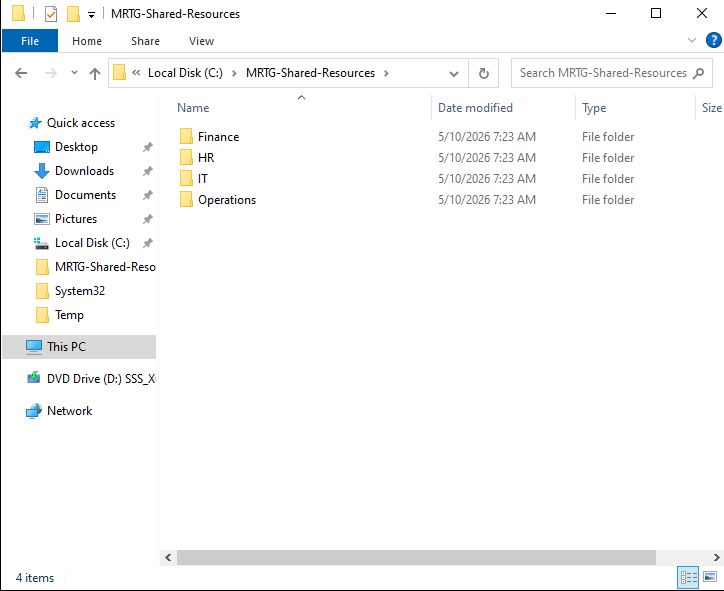

---

### 3. Created the Resource Groups

Domain Local resource groups were created for the department folders.

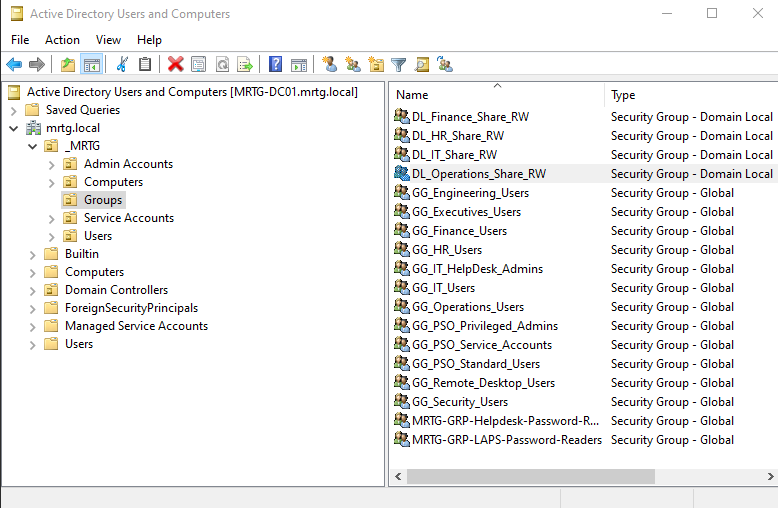

The existing department Global Groups continued to represent user and department alignment.

---

### 4. Configured Group Nesting

Each department Global Group was nested into its matching Domain Local resource group.

Example:

```text
GG_HR_Users -> DL_HR_Share_RW
```


This connected business-role membership to resource authorization.

---

### 5. Configured the Root Share

Share path:

```text
\\MRTG-DC01\MRTG-Shared
```

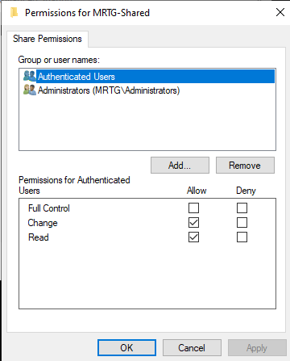

The share layer allowed authenticated users to reach the root. NTFS permissions controlled access to each department folder.

---

### 6. Configured HR NTFS Permissions

```text
DL_HR_Share_RW -> Modify
```

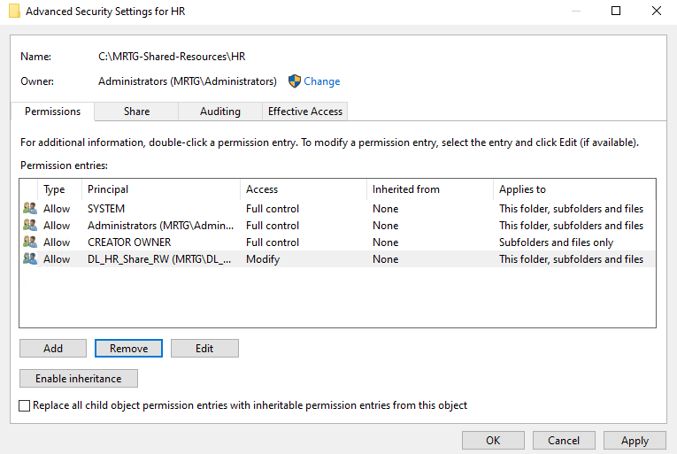

Broad inherited user access was removed or restricted so the HR resource group controlled access.

---

### 7. Configured Finance NTFS Permissions

```text
DL_Finance_Share_RW -> Modify
```


---

### 8. Configured IT NTFS Permissions

```text
DL_IT_Share_RW -> Modify
```


---

### 9. Configured Operations NTFS Permissions

```text
DL_Operations_Share_RW -> Modify
```

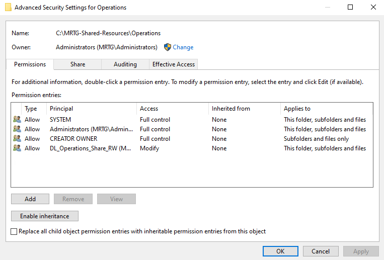

IT and Operations permissions were configured, but user-level functional testing for those departments was not captured in this lab.

---

### 10. Opened the Root Share from the Client

UNC path:

```text
\\MRTG-DC01\MRTG-Shared
```


The department folders were visible from `CLIENT01`.

Visibility of a folder name did not imply permission to open the folder.

---

### 11. Confirmed the HR User Context

Command used:

```cmd
whoami
```

Validated result:

```text
mrtg\kevin.carter
```

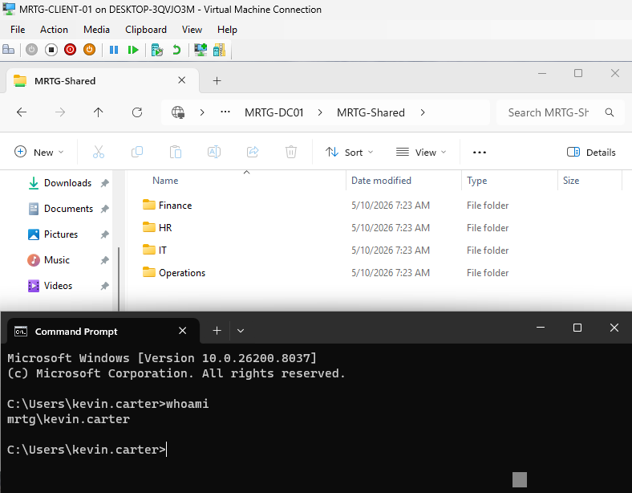

---

### 12. Validated the HR Access Token

Command used:

```cmd
whoami /groups
```

Expected access chain:

```text
GG_HR_Users
DL_HR_Share_RW
```

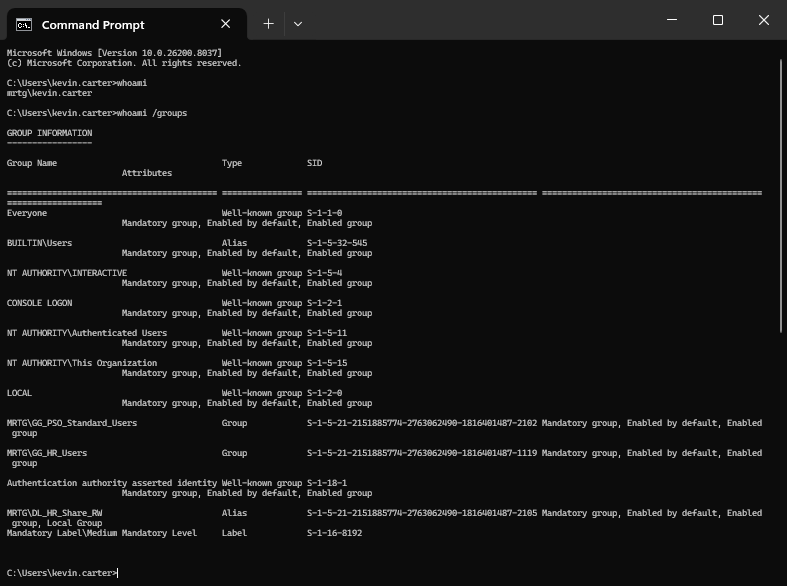

This confirmed that the active user token contained the groups required for HR access.

---

### 13. Validated Authorized HR Access

Path:

```text
\\MRTG-DC01\MRTG-Shared\HR
```

Test file:

```text
HR-access-test.txt
```


Creating the test file confirmed write access consistent with NTFS Modify permission.

---

### 14. Validated HR Denial to Finance

Path:

```text
\\MRTG-DC01\MRTG-Shared\Finance
```

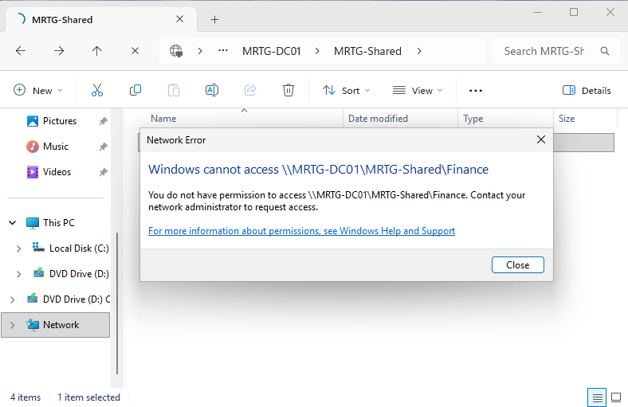

The HR user did not have an applicable Finance resource-group permission.

---

### 15. Prepared the Finance User for Workstation Testing

The Finance test account was granted the required Remote Desktop sign-in access for the controlled workstation test.

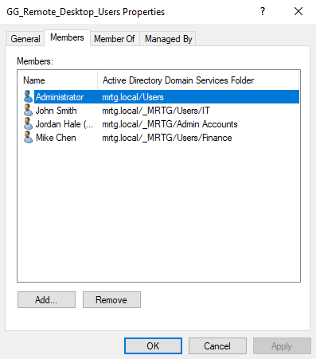

This access supported test execution and was separate from the department file authorization model.

---

### 16. Validated the Finance User and Token

Expected user:

```text
mrtg\mike.chen
```

Expected access chain:

```text
GG_Finance_Users
DL_Finance_Share_RW
```

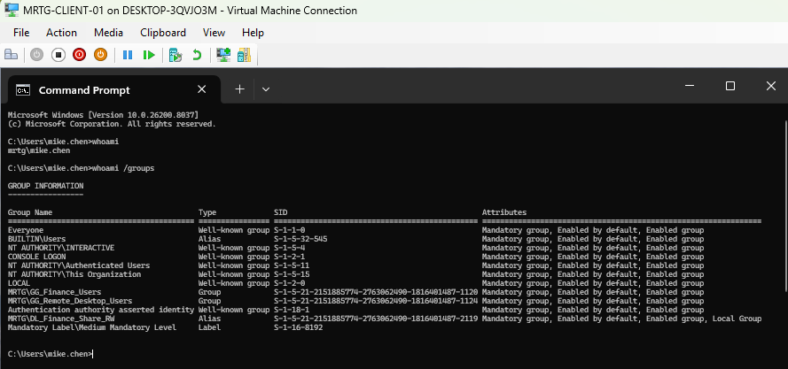

This confirmed the active Finance identity and resource-group membership.

---

### 17. Validated Authorized Finance Access

Path:

```text
\\MRTG-DC01\MRTG-Shared\Finance
```

Test file:

```text
Finance-access-test.txt
```

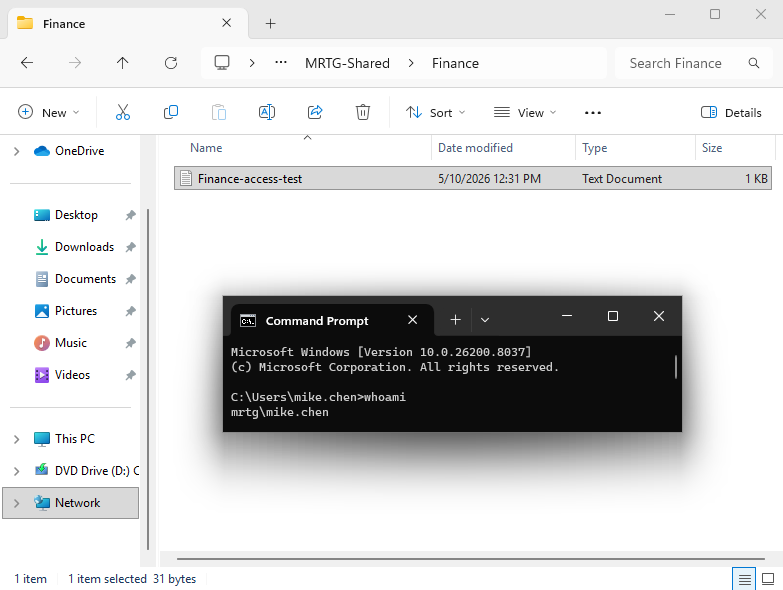

Creating the file confirmed write access consistent with NTFS Modify permission.

---

### 18. Validated Finance Denial to HR

Path:

```text
\\MRTG-DC01\MRTG-Shared\HR
```

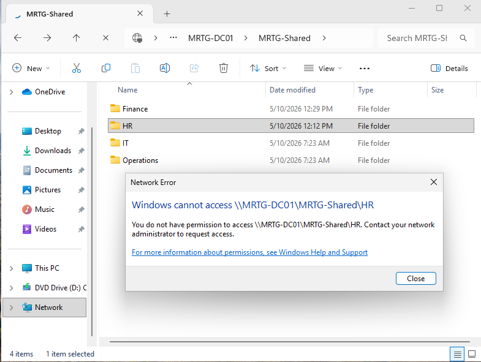

The Finance user did not have an applicable HR resource-group permission.

---

### 19. Created the Final Lab Checkpoint

Checkpoint name:

```text
MRTG-DC01_Post-Lab-18-Group-Based-Access-Control-Validated
```

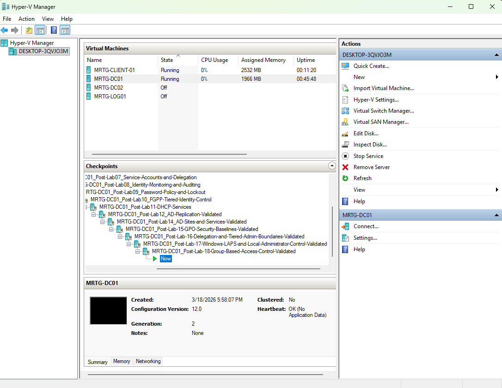

The checkpoint provided a temporary lab recovery point and was not a substitute for file-server or System State backup.

---

## Validation Results

| Test | Expected | Actual | Result |
|---|---|---|---|
| Kevin Carter accesses HR | Allowed | Allowed | Passed |
| Kevin Carter creates HR test file | Allowed | Allowed | Passed |
| Kevin Carter accesses Finance | Denied | Denied | Passed |
| Mike Chen accesses Finance | Allowed | Allowed | Passed |
| Mike Chen creates Finance test file | Allowed | Allowed | Passed |
| Mike Chen accesses HR | Denied | Denied | Passed |
| Direct user permissions | None | None documented | Passed |
| Resource permissions assigned to Domain Local groups | Required | Configured | Passed |
| IT user functional test | Not included | Not tested | Not tested |
| Operations user functional test | Not included | Not tested | Not tested |

---

## Security and IAM Relevance

This lab demonstrates how identity groups become enforceable authorization.

The model supports:

- Group-based access control
- Separation between identity roles and resource permissions
- Least privilege
- Department resource isolation
- Cleaner Joiner, Mover, and Leaver workflows
- Easier access reviews
- Reduced direct user permissions
- Positive and negative authorization testing

Access changes can be performed by modifying business-role group membership rather than editing file permissions for every user.

---

## Risks Addressed

This lab reduces the risk of:

- Direct user Access Control Entries
- Inconsistent folder permissions
- Excessive cross-department access
- Retained permissions after department transfers
- Permission sprawl
- Weak access-review evidence
- Unvalidated authorization boundaries
- Repeated manual folder-permission changes

---

## Control Mapping

| Control Area | Lab Contribution |
|---|---|
| Group-Based Authorization | Uses Global and Domain Local groups |
| Least Privilege | Limits users to department resources |
| Resource Separation | Applies distinct NTFS permissions to each folder |
| Lifecycle Management | Allows access changes through group membership |
| Operational Consistency | Uses the same AGDLP-style pattern for each department |
| Positive Testing | Confirms approved access and file creation |
| Negative Testing | Confirms cross-department denial |
| Audit Readiness | Documents identities, groups, ACLs, and results |

---

## Evidence Collected

| Evidence | Screenshot |
|---|---|
| Pre-change checkpoint | `screenshots/lab-18-01-pre-lab-checkpoint.png` |
| Department folders | `screenshots/lab-18-02-department-folder-structure.png` |
| Resource groups | `screenshots/lab-18-03-security-groups-created.png` |
| Group nesting | `screenshots/lab-18-04-group-membership-configured.png` |
| Root share permissions | `screenshots/lab-18-05-share-permissions-configured.png` |
| HR NTFS permissions | `screenshots/lab-18-06-hr-ntfs-permissions-configured.png` |
| Finance NTFS permissions | `screenshots/lab-18-07-finance-ntfs-permissions-configured.png` |
| IT NTFS permissions | `screenshots/lab-18-08-it-ntfs-permissions-configured.png` |
| Operations NTFS permissions | `screenshots/lab-18-09-operations-ntfs-permissions-configured.png` |
| Root share from client | `screenshots/lab-18-10-shared-folder-accessed-from-client.png` |
| HR user context | `screenshots/lab-18-11-hr-user-context-verified.png` |
| HR access token | `screenshots/lab-18-12-hr-group-membership-validated.png` |
| HR authorized access | `screenshots/lab-18-13-hr-authorized-access-validated.png` |
| HR denied Finance access | `screenshots/lab-18-14-hr-user-finance-access-denied.png` |
| Finance Remote Desktop access | `screenshots/lab-18-15-finance-user-rdp-group-membership.png` |
| Finance access token | `screenshots/lab-18-16-finance-group-membership-validated.png` |
| Finance authorized access | `screenshots/lab-18-17-finance-authorized-access-validated.png` |
| Finance denied HR access | `screenshots/lab-18-18-finance-user-hr-access-denied.png` |
| Final lab checkpoint | `screenshots/lab-18-19-post-lab-checkpoint.png` |

---

## What I Would Improve in Production

In a production environment, I would:

- Use a dedicated file server instead of a domain controller
- Separate read-only and modify resource groups
- Use formal naming standards for role and permission groups
- Document data owners for every resource
- Require approved access requests
- Enable access-based enumeration
- Audit access to sensitive folders
- Review group membership regularly
- Monitor permission and group changes centrally
- Use effective-access testing before production rollout
- Test every department role
- Remove temporary Remote Desktop test access
- Define inheritance and exception standards
- Back up file data and permission configuration
- Use supported backups instead of Hyper-V checkpoints

---

## Lessons Learned

This lab reinforced the value of separating users, business roles, resource groups, and permissions.

Global Groups organize identities. Domain Local Groups represent resource access. NTFS permissions enforce the authorization decision.

The primary takeaway is that successful-access testing is only half of validation. Denied-access testing confirms that users cannot cross an unintended department boundary.

The AGDLP-style structure also makes lifecycle changes cleaner because administrators update role membership instead of editing resource permissions repeatedly.

---

## Outcome

Lab 18 successfully implemented an AGDLP-style authorization model for department resources.

The lab confirmed that:

- Department Global Groups represented user roles
- Domain Local groups represented resource access
- NTFS permissions were assigned to the resource groups
- HR access worked for Kevin Carter
- Finance access was denied to Kevin Carter
- Finance access worked for Mike Chen
- HR access was denied to Mike Chen
- No direct user permissions were documented
- The authorization model followed group membership

The environment now has a scalable foundation for group-based department resource access.

---

## Next Lab

[Lab 19: Active Directory Certificate Services](../Lab-19-Active-Directory-Certificate-Services/)

Lab 19 introduces Active Directory Certificate Services and validates certificate enrollment and internal trust in the MRTG domain.
