# Lab 19 — Active Directory Certificate Services


## Objective

The objective of this lab was to install, configure, troubleshoot, and validate Active Directory Certificate Services in the MRTG enterprise lab environment.

This lab focused on deploying an internal Enterprise Root Certification Authority, integrating certificate services with Active Directory, validating certificate templates, enrolling a domain user certificate, confirming the issued certificate on the CA, and verifying that the internal root CA was trusted by the client.

## Scope

This lab included:

- Creating a pre-lab Hyper-V checkpoint
- Installing the Active Directory Certificate Services role
- Selecting the Certification Authority role service
- Configuring an Enterprise Root CA
- Creating a new CA private key
- Configuring CA cryptography settings
- Naming the internal CA
- Setting the CA validity period
- Using the default CA database location
- Validating the Certification Authority console
- Validating certificate templates
- Opening the Current User certificate store
- Testing Active Directory Enrollment Policy
- Troubleshooting certificate template availability
- Validating domain controller discovery
- Validating logon server connectivity
- Enrolling a user certificate
- Confirming the certificate in the Current User Personal store
- Confirming the issued certificate on the CA
- Confirming root CA trust on the client
- Creating post-lab checkpoints

## Environment

| Component | Details |
|---|---|
| Domain | `mrtg.local` |
| Certification Authority | `MRTG-DC01-CA` |
| CA Server | `MRTG-DC01` |
| Domain Controller | `MRTG-DC01` |
| Additional Domain Controller | `MRTG-DC02` |
| Client Workstation | `MRTG-CLIENT-01` |
| Test User | `mrtg\mike.chen` |
| CA Type | Enterprise Root CA |
| Cryptographic Provider | `RSA#Microsoft Software Key Storage Provider` |
| Key Length | `2048` |
| Hash Algorithm | `SHA256` |
| Certificate Store Tested | Current User Personal Store |
| CA Database Path | `C:\Windows\System32\CertLog` |

## Scenario

Monroe Redstone Technology Group needed an internal certificate authority to support enterprise trust services.

Certificates are used to establish trust for users, computers, services, authentication, encryption, and secure communication. This lab introduced Active Directory Certificate Services as the foundation for future identity and security labs involving certificate-based authentication and trusted internal services.

The certificate trust path tested in this lab was:

```text
Domain User → Active Directory Enrollment Policy → User Certificate Template → MRTG-DC01-CA → Issued Certificate
```

## Design Notes

For this lab, `MRTG-DC01` was configured as an Enterprise Root CA.

This is acceptable in a controlled lab environment because the purpose was to learn the AD CS deployment workflow, understand how certificate templates are exposed through Active Directory, and validate user certificate enrollment from a domain-joined workstation.

In a production or government-regulated environment, a stronger design would usually separate certificate authority roles and use a more formal PKI hierarchy.

A stronger production model would likely use:

```text
Offline Root CA → Online Issuing/Subordinate CA
```

This reduces risk by protecting the root CA and limiting exposure of the issuing CA.

## Implementation Steps

### 1. Created Pre-Lab Checkpoint

A Hyper-V checkpoint was created before installing Active Directory Certificate Services.

Checkpoint name:

```text
Pre-Lab-19-ADCS
```

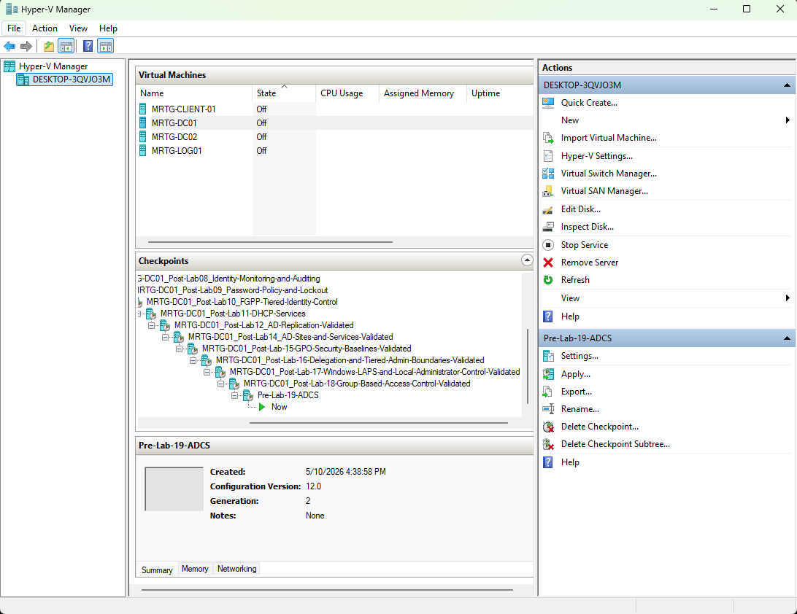

### 2. Selected the Active Directory Certificate Services Role

The Active Directory Certificate Services role was selected on `MRTG-DC01`.

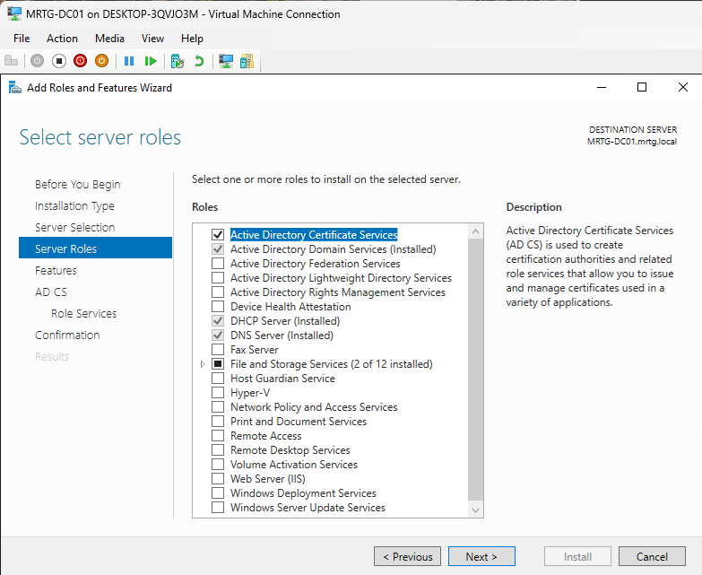

### 3. Selected the Certification Authority Role Service

Only the Certification Authority role service was selected for this lab.

Additional services such as Web Enrollment, Online Responder, and Network Device Enrollment Service were not selected because this lab focused on the core CA deployment.

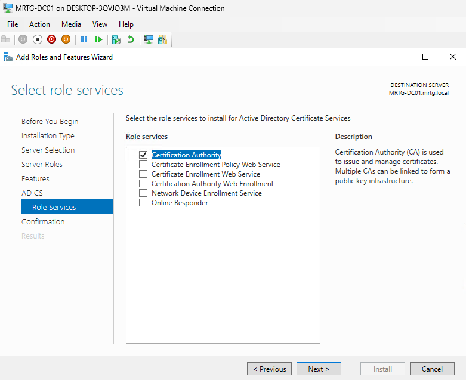

### 4. Completed AD CS Role Installation

The AD CS role installation completed successfully.

Server Manager indicated that additional post-deployment configuration was required.

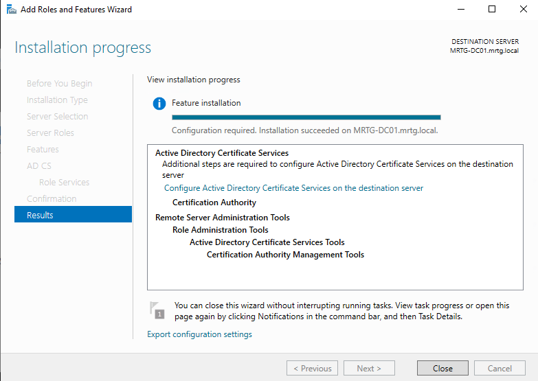

### 5. Verified AD CS Configuration Requirement

Server Manager displayed the post-deployment configuration warning for AD CS.

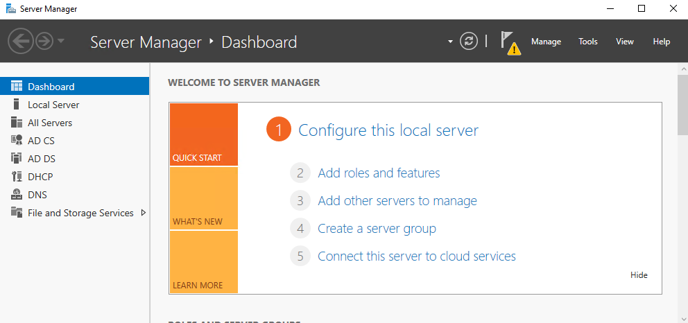

### 6. Selected Enterprise CA

The CA was configured as an Enterprise CA.

This allowed the CA to integrate with Active Directory and use AD-based certificate enrollment policies and certificate templates.

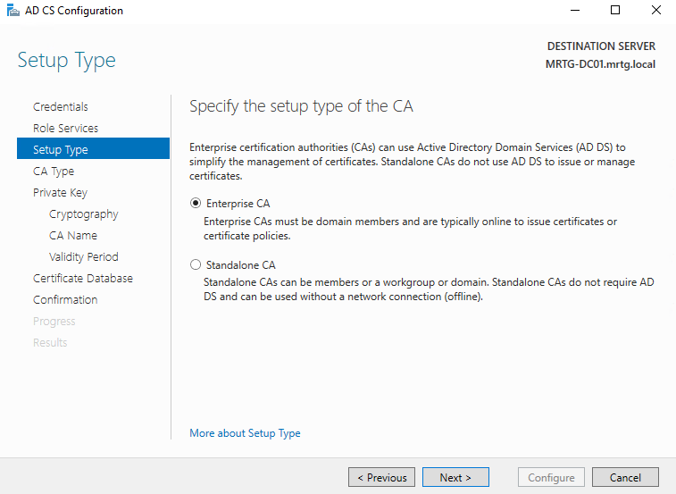

### 7. Selected Root CA

The CA was configured as a Root CA.

This made `MRTG-DC01-CA` the top-level certificate authority in the MRTG lab PKI hierarchy.

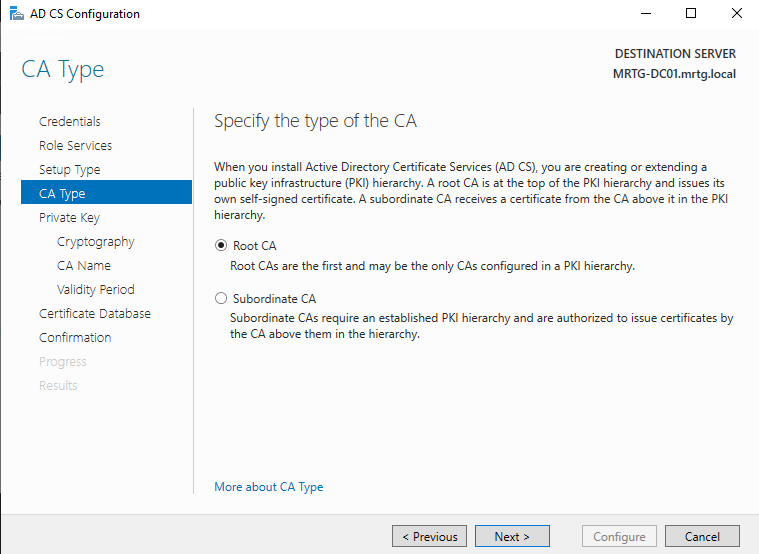

### 8. Created a New Private Key

A new private key was created for the CA.

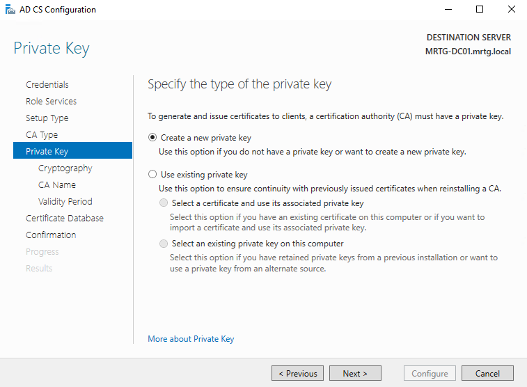

### 9. Configured Cryptography Settings

The CA was configured with the following cryptographic settings:

| Setting | Value |
|---|---|
| Provider | `RSA#Microsoft Software Key Storage Provider` |
| Key Length | `2048` |
| Hash Algorithm | `SHA256` |

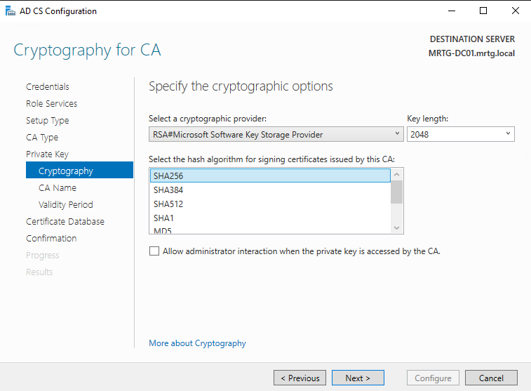

### 10. Configured CA Name

The CA was named:

```text
MRTG-DC01-CA
```

The distinguished name was:

```text
CN=MRTG-DC01-CA,DC=mrtg,DC=local
```

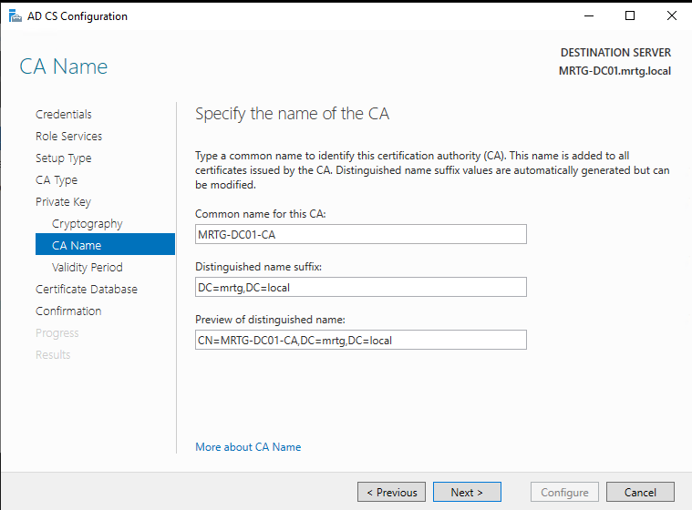

### 11. Configured CA Validity Period

The CA validity period was configured for 5 years.

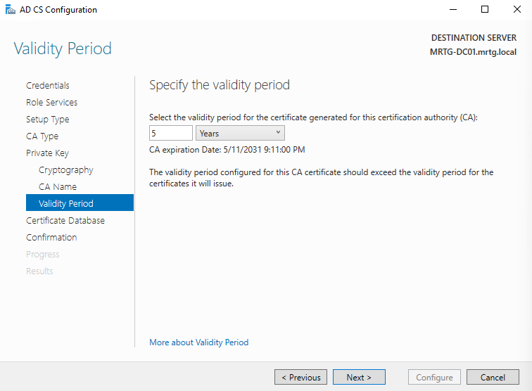

### 12. Configured Certificate Database Location

The default certificate database and log locations were used:

```text
C:\Windows\System32\CertLog
```

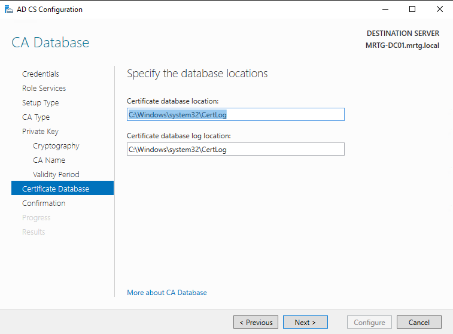

### 13. Confirmed AD CS Configuration Settings

The final AD CS configuration was reviewed before applying the settings.

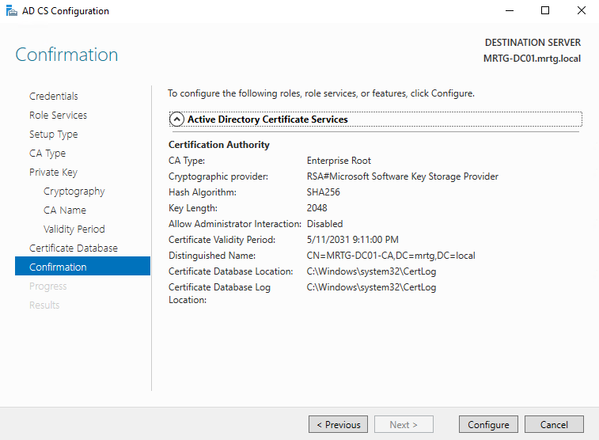

### 14. Completed AD CS Configuration

The Certification Authority configuration completed successfully.

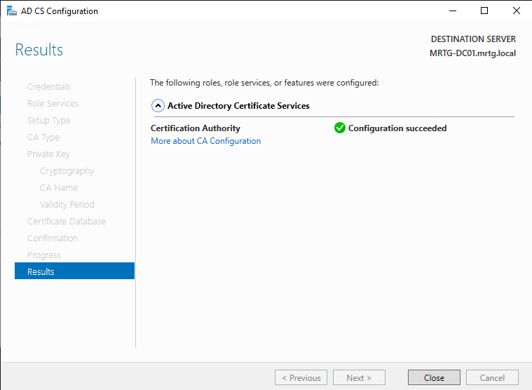

## Validation

### Certification Authority Console Validated

The Certification Authority console was opened on `MRTG-DC01`.

The CA was visible as:

```text
MRTG-DC01-CA
```

The following CA containers were present:

```text
Revoked Certificates
Issued Certificates
Pending Requests
Failed Requests
Certificate Templates
```

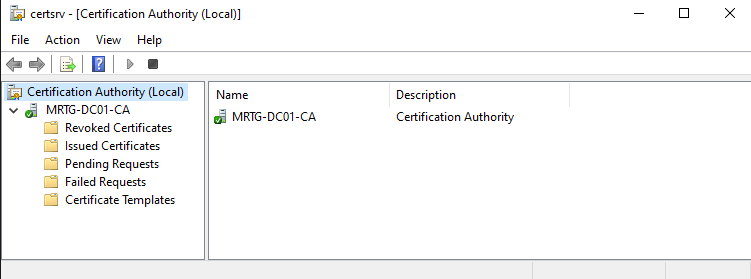

### Certificate Templates Validated

Default certificate templates were visible under the CA.

This confirmed that the Enterprise CA was integrated with Active Directory certificate templates.

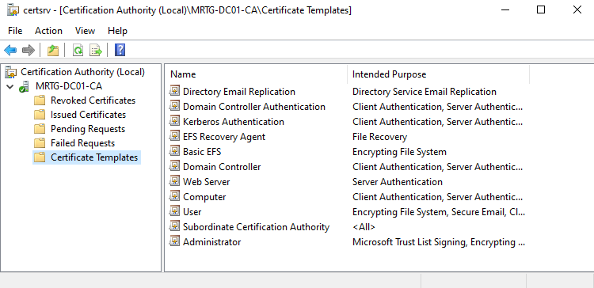

### Current User Certificate Store Opened

On `MRTG-CLIENT-01`, the Current User certificate store was opened using:

```cmd
certmgr.msc
```

The Personal certificate store was initially empty.

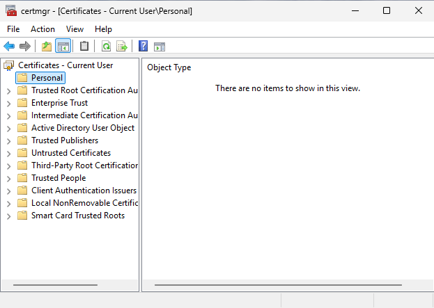

### Active Directory Enrollment Policy Selected

The domain user was able to access the Active Directory Enrollment Policy from the certificate enrollment wizard.

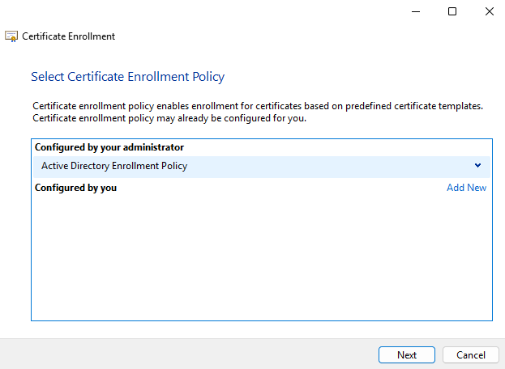

## Troubleshooting

### Certificate Types Initially Unavailable

During the first enrollment attempt, no certificate templates were available to the user.

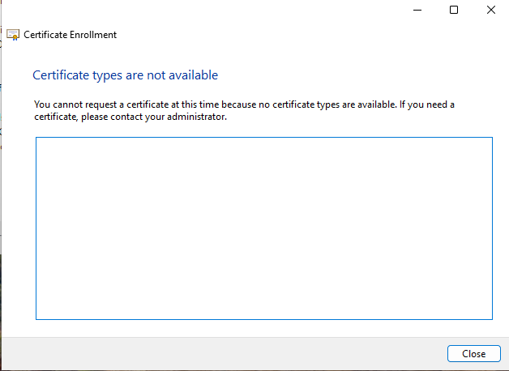

This was treated as a certificate enrollment troubleshooting point.

Certificate enrollment depends on the workstation being able to contact a domain controller, retrieve Active Directory enrollment policy, and locate available certificate templates.

### Domain Connectivity and Logon Server Validated

Domain controller discovery was validated from `MRTG-CLIENT-01` using:

```cmd
nltest /dsgetdc:mrtg.local
```

The client successfully discovered a domain controller:

```text
MRTG-DC02.mrtg.local
```

The logon server was also validated using:

```cmd
echo %logonserver%
```

The user session was authenticated through:

```text
\\MRTG-DC01
```

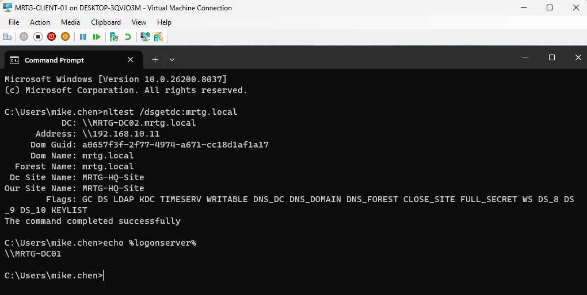

### User Certificate Template Became Available

After validating domain connectivity and refreshing the enrollment path, certificate templates became available.

The available certificate templates included:

```text
Basic EFS
User
```

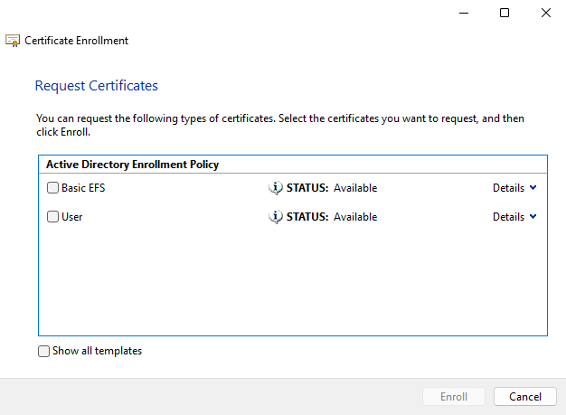

### User Certificate Enrollment Successful

The `User` certificate template was selected and successfully enrolled.

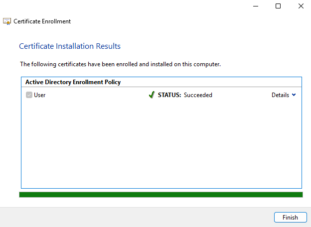

### User Certificate Installed in Personal Store

The issued certificate appeared in the Current User Personal certificate store.

The certificate details showed:

| Field | Value |
|---|---|
| Issued To | `Mike Chen` |
| Issued By | `MRTG-DC01-CA` |
| Certificate Template | `User` |
| Store | Current User → Personal → Certificates |

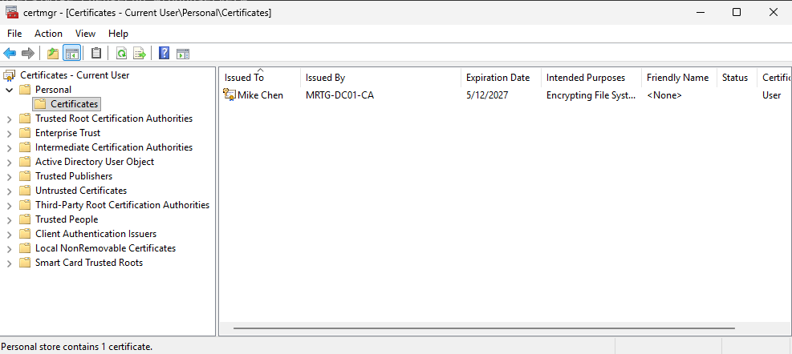

### Issued Certificate Visible on the CA

The Certification Authority console showed the issued certificate request.

The CA issued certificates to:

```text
MRTG\MRTG-DC01$
MRTG\mike.chen
```

This confirmed that the CA was actively issuing certificates.

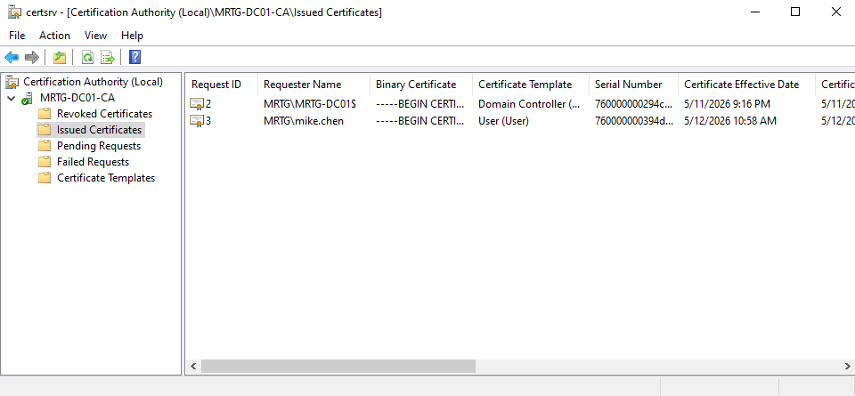

### Root CA Trusted on the Client

The MRTG root CA certificate appeared in the Trusted Root Certification Authorities store on the client.

This confirmed that the client trusted the internal Enterprise Root CA.

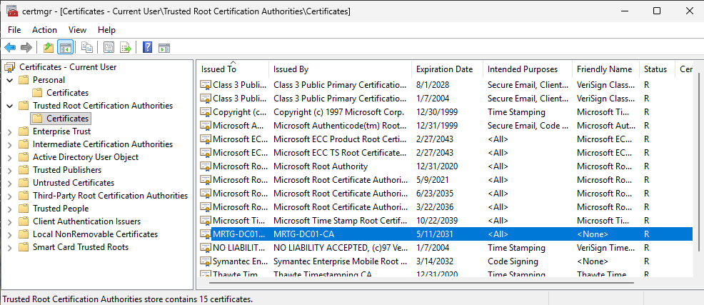

## Post-Lab Checkpoints

### Domain Controller Checkpoint

A post-lab checkpoint was created for the CA configuration.

Checkpoint name:

```text
MRTG-DC01_Post-Lab-19-ADCS-Enterprise-Root-CA-Validated
```

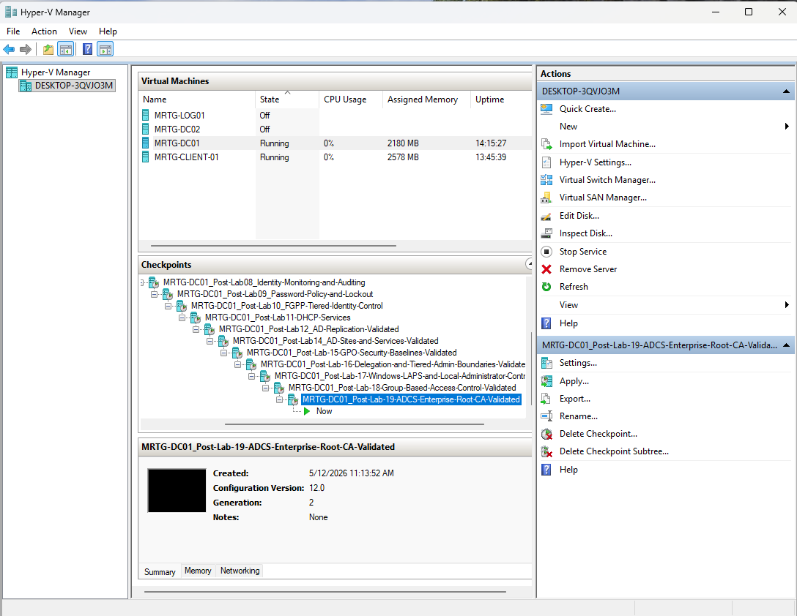

### Client Certificate Enrollment Checkpoint

A post-lab checkpoint was also created after user certificate enrollment was validated.

Checkpoint name:

```text
Post-Lab-19-User-Certificate-Enrollment-Validated
```


## Validation Summary

| Validation Area | Result |
|---|---|
| AD CS role installed | Successful |
| Certification Authority role service installed | Successful |
| Enterprise Root CA configured | Successful |
| CA private key created | Successful |
| SHA256 configured | Successful |
| CA console available | Successful |
| Certificate templates visible | Successful |
| User enrollment policy detected | Successful |
| User certificate enrolled | Successful |
| Certificate visible in user personal store | Successful |
| Certificate visible in CA issued certificates | Successful |
| Root CA trusted on client | Successful |
| Post-lab checkpoints created | Successful |

## Key Commands Used

### Validate Domain Controller Discovery

```cmd
nltest /dsgetdc:mrtg.local
```

### Validate Logon Server

```cmd
echo %logonserver%
```

### Open Current User Certificate Store

```cmd
certmgr.msc
```

### Open Certification Authority Console

```cmd
certsrv.msc
```

## Security Concepts Reinforced

- Public Key Infrastructure
- Enterprise Root Certification Authority
- Certificate trust chains
- Certificate templates
- User certificate enrollment
- Active Directory Enrollment Policy
- Internal certificate authority trust
- Certificate-based identity foundations
- Private key protection
- Cryptographic provider selection
- SHA256 certificate signing
- Certificate store validation
- Domain-integrated trust services

## Real-World Relevance

Active Directory Certificate Services is a core identity and security service in many enterprise, government, and regulated environments.

Internal certificate authorities are commonly used to support:

- User certificates
- Computer certificates
- Domain controller certificates
- EFS certificates
- VPN authentication
- Wi-Fi authentication
- Smart card logon
- Web server certificates
- Internal TLS
- Secure service authentication

This lab matters because certificate trust is part of identity infrastructure. In IAM and security operations, certificates are not just encryption objects. They are identity objects that can grant access, prove trust, and support authentication.

## What I Would Do Differently in Production

In a production environment, I would not place the full PKI trust model on a single online root CA.

A stronger production design would include:

- Offline Root CA
- Online Issuing CA
- Certificate template governance
- Role-based CA administration
- Formal certificate lifecycle management
- Certificate revocation planning
- CRL and AIA publication planning
- CA backup and recovery procedures
- Monitoring for issued certificates
- Auditing for CA configuration changes
- Separation of duties for PKI administrators

This lab intentionally used a simplified model to focus on learning the AD CS deployment and validation process.

## Lessons Learned

This lab showed that AD CS is more than just installing a server role.

Certificate enrollment depends on several connected systems working correctly:

- Active Directory
- DNS
- Domain controller discovery
- Certificate templates
- Enrollment policy
- Client trust stores
- User context
- CA availability

The biggest lesson was that certificate enrollment troubleshooting requires checking both the CA side and the client side. A certificate template may exist on the CA, but the user still needs a valid enrollment path from the client.

## Skills Demonstrated

- Installed Active Directory Certificate Services
- Configured an Enterprise Root CA
- Selected CA role services
- Configured CA cryptography
- Configured CA naming and validity
- Validated certificate templates
- Used `certsrv.msc`
- Used `certmgr.msc`
- Tested user certificate enrollment
- Validated issued certificates
- Validated trusted root certificates
- Troubleshot certificate template availability
- Confirmed domain controller discovery
- Confirmed logon server path
- Created Hyper-V checkpoints for rollback and documentation

## Screenshot Reference

| Screenshot | File Name |
|---|---|
| 1 | `screenshots/lab-19-01-pre-lab-adcs-checkpoint.png` |
| 2 | `screenshots/lab-19-02-adcs-role-selected.png` |
| 3 | `screenshots/lab-19-03-certification-authority-role-service-selected.png` |
| 4 | `screenshots/lab-19-04-adcs-installation-complete.png` |
| 5 | `screenshots/lab-19-05-server-manager-adcs-configuration-required.png` |
| 6 | `screenshots/lab-19-06-enterprise-ca-selected.png` |
| 7 | `screenshots/lab-19-07-root-ca-selected.png` |
| 8 | `screenshots/lab-19-08-create-new-private-key-selected.png` |
| 9 | `screenshots/lab-19-09-cryptography-settings-configured.png` |
| 10 | `screenshots/lab-19-10-ca-name-configured.png` |
| 11 | `screenshots/lab-19-11-ca-validity-period-configured.png` |
| 12 | `screenshots/lab-19-12-certificate-database-location-configured.png` |
| 13 | `screenshots/lab-19-13-adcs-configuration-confirmation.png` |
| 14 | `screenshots/lab-19-14-adcs-configuration-successful.png` |
| 15 | `screenshots/lab-19-15-certification-authority-console.png` |
| 16 | `screenshots/lab-19-16-certificate-templates-visible.png` |
| 17 | `screenshots/lab-19-17-current-user-certificate-store-opened.png` |
| 18 | `screenshots/lab-19-18-active-directory-enrollment-policy-selected.png` |
| 19 | `screenshots/lab-19-19-certificate-types-not-available.png` |
| 20 | `screenshots/lab-19-20-domain-connectivity-and-logon-server-validated.png` |
| 21 | `screenshots/lab-19-21-user-certificate-template-available.png` |
| 22 | `screenshots/lab-19-22-user-certificate-enrollment-successful.png` |
| 23 | `screenshots/lab-19-23-user-certificate-installed-in-personal-store.png` |
| 24 | `screenshots/lab-19-24-issued-certificate-visible-on-ca.png` |
| 25 | `screenshots/lab-19-25-root-ca-trusted-on-client.png` |
| 26 | `screenshots/lab-19-26-post-lab-dc01-checkpoint.png` |
| 27 | `screenshots/lab-19-27-post-lab-client-checkpoint.png` |

## Outcome

This lab successfully deployed and validated Active Directory Certificate Services in the MRTG domain.

By the end of the lab, the environment had a working Enterprise Root CA, certificate templates were visible, a domain user was able to enroll a user certificate, the CA showed the issued certificate, and the client trusted the MRTG internal root certificate authority.

## Next Lab

[Lab 20 — Certificate Template Governance and Auto-Enrollment](../Lab-20-Certificate-Template-Governance-and-Auto-Enrollment/)

Lab 20 will build on this PKI foundation by focusing on certificate template control, enrollment permissions, and automated certificate deployment through Group Policy.
````
