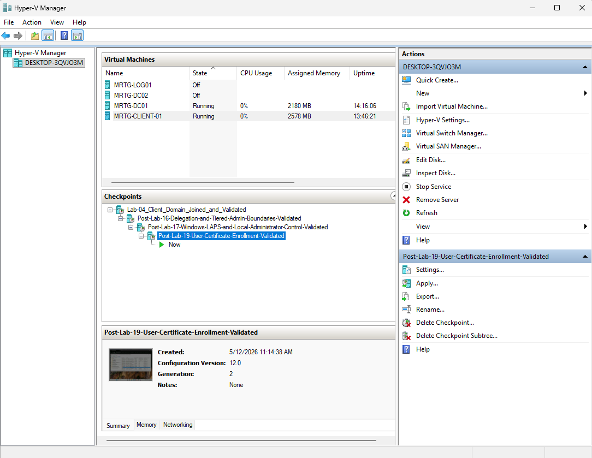

# Lab 19: Active Directory Certificate Services


---

## Objective

Deploy and validate Active Directory Certificate Services in the `mrtg.local` domain.

This lab configures an Enterprise Root Certification Authority, validates Active Directory-integrated certificate templates, enrolls a domain-user certificate, confirms certificate issuance, and verifies client trust in the internal CA.

The goal is to establish a foundational internal Public Key Infrastructure for future certificate-based security use cases.

---

## Business Scenario

Monroe Redstone Technology Group requires an internal certificate authority to support trusted enterprise services.

Certificates can support authentication, encryption, digital signatures, secure communication, device trust, web services, VPN access, Wi-Fi authentication, and smart-card sign-in.

Without managed certificate services, issuance and trust may become inconsistent, difficult to audit, and difficult to govern.

This lab addresses the need to:

- Establish an internal certificate authority
- Integrate certificate enrollment with Active Directory
- Publish certificate templates
- Enroll a certificate for a domain user
- Validate issuance from the CA
- Confirm trust on a domain client
- Document the security limits of a simplified lab PKI

---

## Lab Summary

In this lab, I installed Active Directory Certificate Services on `MRTG-DC01` and configured it as an Enterprise Root CA named `MRTG-DC01-CA`.

The CA used a new RSA private key, a 2048-bit key length, and SHA-256 for signing.

After configuration, the Certification Authority console and published certificate templates were reviewed.

Mike Chen used Active Directory Enrollment Policy from `CLIENT01` to enroll a certificate based on the default User template.

The issued certificate appeared in the user's Personal certificate store and in the CA's Issued Certificates container. The MRTG root certificate was also visible as trusted on the client.

An initial enrollment attempt showed no available certificate types. Domain discovery, logon-server connectivity, enrollment policy, and template availability were reviewed before enrollment succeeded.

---

## Environment

| Component | Details |
|---|---|
| Domain | `mrtg.local` |
| CA Server | `MRTG-DC01` |
| Certification Authority | `MRTG-DC01-CA` |
| Additional Domain Controller | `MRTG-DC02` |
| Client Windows Computer Name | `CLIENT01` |
| Client Hyper-V VM Name | `MRTG-CLIENT-01` |
| Test User | `mrtg\mike.chen` |
| CA Type | Enterprise Root CA |
| Cryptographic Provider | `RSA#Microsoft Software Key Storage Provider` |
| CA Key Length | `2048` |
| Hash Algorithm | `SHA256` |
| CA Validity Period | `5 years` |
| CA Database Path | `C:\Windows\System32\CertLog` |
| User Certificate Store | Current User Personal store |
| Hypervisor | Hyper-V |

---

## Prerequisites

- Operational `mrtg.local` domain
- Healthy Active Directory replication
- Working internal DNS
- Domain-joined client workstation
- Domain user for enrollment testing
- Enterprise administrative approval for CA deployment
- Supported Windows Server operating system
- Administrative access to install and configure AD CS
- Planned CA name, key settings, validity period, and database location

---

## Scope

### Included

- AD CS role installation
- Certification Authority role-service installation
- Enterprise Root CA configuration
- New CA private-key generation
- Cryptographic provider selection
- CA naming
- CA validity configuration
- CA database-location review
- Certification Authority console validation
- Certificate-template validation
- Active Directory Enrollment Policy review
- Current-user certificate enrollment
- Issued-certificate validation
- Client trust-store validation
- Enrollment troubleshooting
- Temporary Hyper-V checkpoints

### Not Included

- Offline Root CA
- Subordinate issuing CA
- Certificate Revocation List publication design
- Authority Information Access design
- Online Certificate Status Protocol
- Custom certificate-template creation
- Template-security hardening
- Smart-card sign-in
- VPN or Wi-Fi authentication
- Web-server certificate binding
- Hardware Security Module protection
- Production CA backup and recovery testing

---

## PKI Architecture

```text
MRTG-DC01
`-- MRTG-DC01-CA
    |-- Enterprise CA
    |-- Root CA
    |-- RSA private key
    |-- Certificate Templates
    |-- Issued Certificates
    `-- Revocation data
```

Enrollment path:

```text
Mike Chen
    |
    v
Active Directory Enrollment Policy
    |
    v
User Certificate Template
    |
    v
MRTG-DC01-CA
    |
    v
Issued User Certificate
    |
    v
Current User Personal Store
```

Trust path:

```text
Mike Chen Certificate
        |
        v
MRTG-DC01-CA Root Certificate
        |
        v
Trusted Root Certification Authorities
```

---

## Lab PKI Design

The lab uses an online Enterprise Root CA installed on a domain controller.

This design is acceptable only for a controlled learning environment because it simplifies:

- Active Directory integration
- Template publication
- Domain enrollment
- Trust distribution
- Certificate issuance validation

It does not represent a production-quality PKI architecture.

A stronger production hierarchy would commonly use:

```text
Offline Root CA
        |
        v
Online Enterprise Issuing CA
        |
        v
Users, computers, services, and devices
```

Separating the offline trust anchor from the online issuing system reduces exposure of the root private key.

---

## Security Model

| Component | Purpose |
|---|---|
| Enterprise Root CA | Establishes the lab's internal trust anchor and issues certificates |
| CA Private Key | Signs certificates and must remain protected |
| Certificate Templates | Define enrollment settings, allowed uses, and permissions |
| Enrollment Policy | Allows domain identities to discover certificate options |
| User Certificate | Demonstrates enrollment for a domain identity |
| Trusted Root Store | Allows the client to trust certificates chaining to the MRTG CA |
| Issued Certificates Container | Provides CA-side issuance records |

The default User template demonstrates enrollment. It does not, by itself, prove smart-card, VPN, Wi-Fi, or other certificate-based authentication.

---

## Tools

- Active Directory Certificate Services
- Certification Authority console
- Certificate Templates console
- Current User Certificate Manager
- Active Directory Enrollment Policy
- `certsrv.msc`
- `certtmpl.msc`
- `certmgr.msc`
- `nltest`
- Hyper-V

---

## Implementation and Validation

### 1. Created a Pre-Change Lab Checkpoint

Checkpoint name:

```text
Pre-Lab-19-ADCS
```


This created a temporary VM recovery point before the CA installation.

A Hyper-V checkpoint is not a valid PKI backup. Recovering a CA requires protected copies of the CA private key, CA certificate, database, configuration, and related system state.

---

### 2. Selected the AD CS Role

The Active Directory Certificate Services role was selected on `MRTG-DC01`.


---

### 3. Selected the Certification Authority Role Service

Only the Certification Authority role service was selected.


Web Enrollment, Online Responder, Network Device Enrollment Service, and other AD CS role services were outside this lab's scope.

---

### 4. Completed Role Installation

The AD CS role installation completed successfully.


Server Manager indicated that post-deployment CA configuration was still required.

---

### 5. Reviewed the Configuration Requirement

The Server Manager notification showed that AD CS configuration had not yet been completed.


Installing the role alone does not create an operational CA.

---

### 6. Selected Enterprise CA

The CA type was configured as:

```text
Enterprise CA
```


An Enterprise CA integrates with Active Directory and supports certificate templates and domain enrollment.

---

### 7. Selected Root CA

The CA role was configured as:

```text
Root CA
```


`MRTG-DC01-CA` became the top-level trust anchor for the simplified lab PKI.

---

### 8. Created a New Private Key

A new CA private key was generated.


The CA private key is the most sensitive asset in the PKI because it signs certificates.

---

### 9. Configured Cryptography

| Setting | Value |
|---|---|
| Provider | `RSA#Microsoft Software Key Storage Provider` |
| Key Length | `2048` |
| Hash Algorithm | `SHA256` |


These settings document the lab configuration. Production cryptographic requirements should follow current organizational and regulatory standards.

---

### 10. Configured the CA Name

Common name:

```text
MRTG-DC01-CA
```

Distinguished name:

```text
CN=MRTG-DC01-CA,DC=mrtg,DC=local
```


The CA name becomes part of its long-term identity and should be selected carefully.

---

### 11. Configured the CA Validity Period

Configured validity:

```text
5 years
```


A CA cannot issue certificates that remain valid beyond the CA certificate's own validity.

---

### 12. Reviewed the Database Location

The default CA database and log path was used:

```text
C:\Windows\System32\CertLog
```


---

### 13. Reviewed the Final Configuration

The selected CA configuration was reviewed before deployment.


---

### 14. Completed CA Configuration

The post-deployment configuration completed successfully.


`MRTG-DC01-CA` was now operational.

---

### 15. Validated the CA Console

The Certification Authority console displayed:

```text
MRTG-DC01-CA
```

Available containers included:

```text
Revoked Certificates
Issued Certificates
Pending Requests
Failed Requests
Certificate Templates
```


This confirmed that the CA service and management console were available.

---

### 16. Validated Published Certificate Templates

The CA console displayed published certificate templates.


Template publication does not automatically grant every user enrollment rights. Template security and enrollment permissions also affect availability.

---

### 17. Opened the Current User Certificate Store

Command used on `CLIENT01`:

```cmd
certmgr.msc
```


The Current User Personal store was initially empty.

---

### 18. Selected Active Directory Enrollment Policy

The certificate-enrollment wizard displayed Active Directory Enrollment Policy.


This confirmed that the domain user could reach the domain-integrated enrollment-policy path.

---

### 19. Documented the Initial Template-Availability Problem

The first enrollment attempt displayed no available certificate types.


Potential causes included:

- Enrollment-policy refresh
- Template publication
- Template permissions
- Active Directory replication
- Domain connectivity
- User security context

The exact cause was not proven by this screenshot alone.

---

### 20. Validated Domain Discovery and Logon Server

Commands used:

```cmd
nltest /dsgetdc:mrtg.local
echo %logonserver%
```

Validated domain controller discovery:

```text
MRTG-DC02.mrtg.local
```

Validated logon server:

```text
\\MRTG-DC01
```


The client could discover a domain controller and had an active domain logon context.

---

### 21. Confirmed Template Availability

After the enrollment path was refreshed and the environment was rechecked, the following templates appeared:

```text
Basic EFS
User
```


This confirmed that the user could discover eligible enrollment templates.

---

### 22. Enrolled the User Certificate

The User certificate template was selected, and enrollment completed successfully.


---

### 23. Validated the Certificate in the Personal Store

| Field | Value |
|---|---|
| Issued To | Mike Chen |
| Issued By | `MRTG-DC01-CA` |
| Certificate Template | User |
| Store | Current User Personal Certificates |


This confirmed successful client-side enrollment and installation.

---

### 24. Validated the Issued Certificate on the CA

The Issued Certificates container included certificates for:

```text
MRTG\MRTG-DC01$
MRTG\mike.chen
```


This provided CA-side evidence that the requests were issued.

The computer-account certificate in the list should be interpreted according to its template and Enhanced Key Usage values rather than assumed to provide a specific function.

---

### 25. Validated Root Trust on the Client

The `MRTG-DC01-CA` certificate appeared in the Trusted Root Certification Authorities view available to the client.


This confirmed that the client recognized the internal CA as a trust anchor.

Enterprise root trust is commonly distributed through Active Directory to domain members.

---

### 26. Created the CA Server Lab Checkpoint

Checkpoint name:

```text
MRTG-DC01_Post-Lab-19-ADCS-Enterprise-Root-CA-Validated
```


---

### 27. Created the Client Lab Checkpoint

Checkpoint name:

```text
Post-Lab-19-User-Certificate-Enrollment-Validated
```



The checkpoints were temporary lab recovery points and were not substitutes for CA backup, private-key protection, or certificate database recovery.

---

## Validation Results

| Validation Item | Result |
|---|---|
| AD CS role installed | Passed |
| Certification Authority role service installed | Passed |
| Enterprise CA configured | Passed |
| Root CA configured | Passed |
| New private key created | Passed |
| RSA and SHA-256 configuration reviewed | Passed |
| CA name configured | Passed |
| Five-year CA validity configured | Passed |
| CA database location confirmed | Passed |
| Certification Authority console available | Passed |
| Certificate templates published | Passed |
| Active Directory Enrollment Policy available | Passed |
| Initial template issue documented | Passed |
| Domain discovery validated | Passed |
| Logon-server context validated | Passed |
| User template available | Passed |
| User certificate enrolled | Passed |
| Certificate installed in Personal store | Passed |
| Issued certificate visible on CA | Passed |
| Internal root trust visible on client | Passed |
| Temporary checkpoints created | Passed |

---

## Security and IAM Relevance

Certificates can represent users, computers, services, and devices.

This lab supports:

- Internal Public Key Infrastructure
- Certificate issuance
- Active Directory-integrated enrollment
- User certificate lifecycle
- Trust-chain validation
- Certificate-template awareness
- CA-side issuance records
- Client-side certificate-store validation
- Preparation for certificate-based authentication and encryption

Issuing a certificate does not automatically create secure authentication. The template's permissions, key usage, Enhanced Key Usage, subject configuration, private-key protection, and relying-party validation determine what the certificate can do.

---

## Risks Addressed

This lab reduces the risk of:

- Unmanaged internal certificate issuance
- Inconsistent trust distribution
- Missing certificate-issuance records
- Unvalidated client enrollment
- Lack of internal trust infrastructure
- Weak understanding of certificate enrollment dependencies

The simplified lab design does not mitigate:

- Online root CA compromise
- Domain controller and CA co-hosting risk
- Private-key theft
- Certificate-template abuse
- Weak revocation design
- CA database loss
- PKI administrator misuse

---

## Control Mapping

| Control Area | Lab Contribution |
|---|---|
| Internal Trust | Deploys an internal Enterprise Root CA |
| Certificate Issuance | Enrolls and issues a domain-user certificate |
| Identity Integration | Uses Active Directory Enrollment Policy |
| Trust Validation | Confirms the CA root in the client trust store |
| Lifecycle Evidence | Confirms issuance in the CA console |
| Template Governance Foundation | Reviews published templates and enrollment availability |
| Audit Readiness | Captures deployment and issuance evidence |
| PKI Preparation | Establishes a foundation for future certificate use cases |

---

## Evidence Collected

| Evidence | Screenshot |
|---|---|
| Pre-change checkpoint | `screenshots/lab-19-01-pre-lab-adcs-checkpoint.png` |
| AD CS role selection | `screenshots/lab-19-02-adcs-role-selected.png` |
| CA role-service selection | `screenshots/lab-19-03-certification-authority-role-service-selected.png` |
| AD CS installation | `screenshots/lab-19-04-adcs-installation-complete.png` |
| Post-deployment requirement | `screenshots/lab-19-05-server-manager-adcs-configuration-required.png` |
| Enterprise CA selection | `screenshots/lab-19-06-enterprise-ca-selected.png` |
| Root CA selection | `screenshots/lab-19-07-root-ca-selected.png` |
| New private key | `screenshots/lab-19-08-create-new-private-key-selected.png` |
| Cryptographic configuration | `screenshots/lab-19-09-cryptography-settings-configured.png` |
| CA name | `screenshots/lab-19-10-ca-name-configured.png` |
| CA validity | `screenshots/lab-19-11-ca-validity-period-configured.png` |
| CA database location | `screenshots/lab-19-12-certificate-database-location-configured.png` |
| Final configuration review | `screenshots/lab-19-13-adcs-configuration-confirmation.png` |
| Successful CA configuration | `screenshots/lab-19-14-adcs-configuration-successful.png` |
| Certification Authority console | `screenshots/lab-19-15-certification-authority-console.png` |
| Published certificate templates | `screenshots/lab-19-16-certificate-templates-visible.png` |
| Current User certificate store | `screenshots/lab-19-17-current-user-certificate-store-opened.png` |
| Enrollment policy | `screenshots/lab-19-18-active-directory-enrollment-policy-selected.png` |
| Initial template issue | `screenshots/lab-19-19-certificate-types-not-available.png` |
| Domain and logon-server validation | `screenshots/lab-19-20-domain-connectivity-and-logon-server-validated.png` |
| Available User template | `screenshots/lab-19-21-user-certificate-template-available.png` |
| Successful enrollment | `screenshots/lab-19-22-user-certificate-enrollment-successful.png` |
| User Personal store | `screenshots/lab-19-23-user-certificate-installed-in-personal-store.png` |
| CA Issued Certificates | `screenshots/lab-19-24-issued-certificate-visible-on-ca.png` |
| Client root trust | `screenshots/lab-19-25-root-ca-trusted-on-client.png` |
| CA server checkpoint | `screenshots/lab-19-26-post-lab-adcs-enterprise-root-ca-checkpoint.png` |
| Client checkpoint | `screenshots/lab-19-27-post-lab-user-certificate-enrollment-checkpoint.png` |

---

## Key Commands

### Open the Certification Authority Console

```cmd
certsrv.msc
```

### Open Certificate Templates

```cmd
certtmpl.msc
```

### Open the Current User Certificate Store

```cmd
certmgr.msc
```

### Validate Domain Controller Discovery

```cmd
nltest /dsgetdc:mrtg.local
```

### Validate the Logon Server

```cmd
echo %logonserver%
```

---

## What I Would Improve in Production

In a production environment, I would:

- Use an offline standalone Root CA
- Use one or more online Enterprise Issuing CAs
- Avoid installing an issuing CA on a domain controller
- Protect CA keys with an HSM where required
- Use current approved key sizes and algorithms
- Define CA and certificate validity periods formally
- Design CRL and AIA publication locations
- Test revocation before issuing production certificates
- Back up the CA private key, certificate, database, and configuration
- Test CA recovery
- Separate PKI administrative roles
- Restrict CA logon rights
- Harden the CA operating system
- Duplicate and secure certificate templates
- Remove unnecessary published templates
- Review enrollment and autoenrollment permissions
- Monitor CA configuration and certificate issuance
- Use formal change management
- Never rely on Hyper-V checkpoints as PKI backups

---

## Lessons Learned

This lab reinforced that AD CS deployment involves more than installing a server role.

Certificate enrollment depends on:

- Active Directory
- DNS
- Domain controller discovery
- CA availability
- Template publication
- Enrollment permissions
- Enrollment policy
- User context
- Client certificate stores
- Trust distribution

The main troubleshooting lesson was that an unavailable template can have several causes. Connectivity validation is useful, but template publication, permissions, replication, and policy refresh must also be reviewed.

The security lesson was even bigger: a working CA is not automatically a secure PKI. Architecture, private-key protection, revocation, templates, auditing, backup, and administrative separation determine the actual trust level.

---

## Outcome

Lab 19 successfully deployed and validated Active Directory Certificate Services in the MRTG environment.

The lab confirmed that:

- An Enterprise Root CA was configured
- A new CA private key was generated
- Certificate templates were published
- Active Directory Enrollment Policy was available
- Mike Chen enrolled a User certificate
- The certificate appeared in the user's Personal store
- The CA recorded the issued certificate
- The client recognized the MRTG root certificate as trusted

The environment now has a functional lab PKI foundation for future certificate enrollment, trust, authentication, and encryption exercises.

---

## Next Lab

[Lab 20: Identity Lifecycle Automation with PowerShell](../Lab-20-Identity-Lifecycle-Automation-with-PowerShell/)

Lab 20 automates repeatable identity lifecycle tasks such as user creation, group assignment, validation, and administrative reporting.
