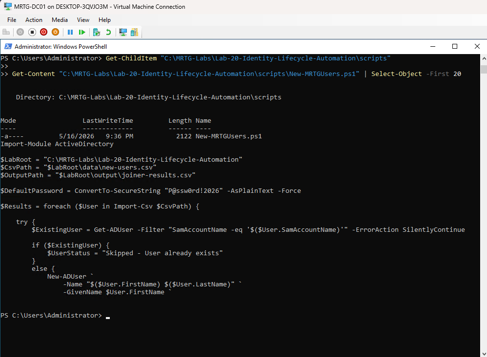
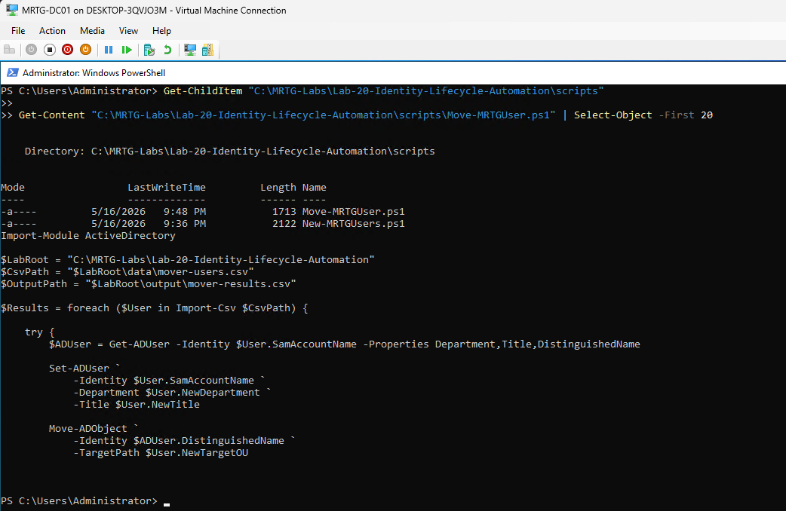
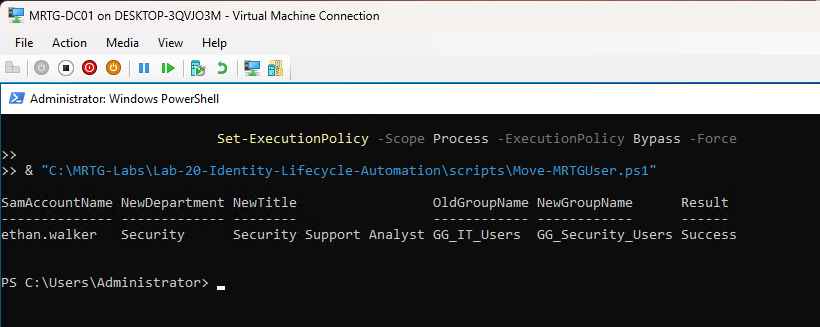
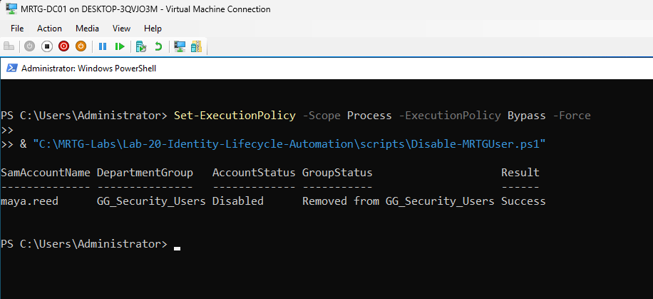
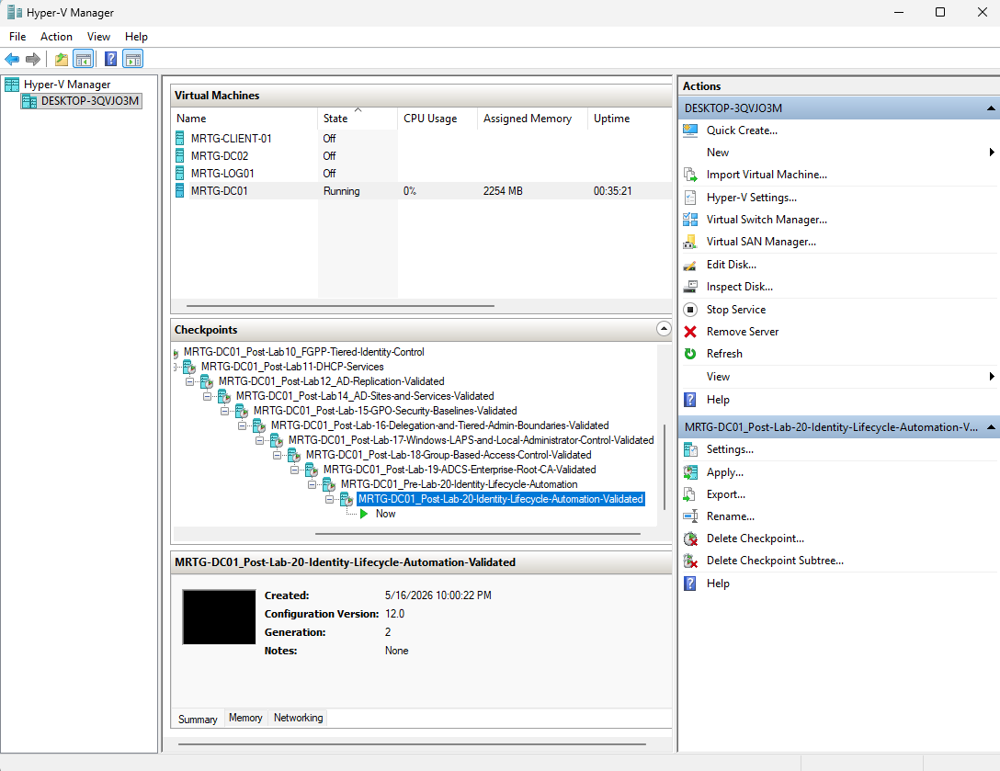

# Lab 20: Identity Lifecycle Automation with PowerShell


---

## Objective

Automate repeatable identity lifecycle tasks in the `mrtg.local` Active Directory domain with PowerShell.

This lab implements CSV-driven Joiner, Mover, and Leaver workflows for user creation, department transfer, group-membership changes, account disablement, and result reporting.

The goal is to execute approved identity changes consistently and validate the resulting Active Directory state.

---

## Business Scenario

Monroe Redstone Technology Group requires a repeatable method for managing user lifecycle events.

Manual account creation, department transfers, and offboarding can create inconsistent results. Missed group assignments, retained access, incorrect OU placement, or delayed account disablement can create security and operational risk.

This lab addresses the need to:

- Standardize common identity lifecycle actions
- Use structured input data
- Validate target OUs and groups
- Create users consistently
- Update identity attributes during transfers
- Remove obsolete department access
- Disable departing-user accounts
- Generate operational result reports
- Validate Active Directory after automation runs

---

## Lab Summary

In this lab, I created a structured workspace containing separate data, script, and output folders.

Three PowerShell scripts automated the lifecycle workflows:

- `New-MRTGUsers.ps1` for Joiners
- `Move-MRTGUser.ps1` for Movers
- `Disable-MRTGUser.ps1` for Leavers

The Joiner workflow created five user accounts, placed them in department OUs, and assigned department Global Groups.

The Mover workflow transferred Ethan Walker from IT to Security by updating attributes, changing OU placement, removing `GG_IT_Users`, and adding `GG_Security_Users`.

The Leaver workflow disabled Maya Reed and removed her department-group access.

Each workflow exported a CSV result file, and the resulting Active Directory state was independently reviewed.

---

## Environment

| Component | Details |
|---|---|
| Organization | Monroe Redstone Technology Group |
| Domain | `mrtg.local` |
| Domain Controller | `MRTG-DC01` |
| PowerShell Module | ActiveDirectory |
| Lab Root | `C:\MRTG-Labs\Lab-20-Identity-Lifecycle-Automation` |
| Data Folder | `C:\MRTG-Labs\Lab-20-Identity-Lifecycle-Automation\data` |
| Scripts Folder | `C:\MRTG-Labs\Lab-20-Identity-Lifecycle-Automation\scripts` |
| Output Folder | `C:\MRTG-Labs\Lab-20-Identity-Lifecycle-Automation\output` |
| Joiner Script | `New-MRTGUsers.ps1` |
| Mover Script | `Move-MRTGUser.ps1` |
| Leaver Script | `Disable-MRTGUser.ps1` |
| Hypervisor | Hyper-V |

---

## Prerequisites

- Operational `mrtg.local` domain
- Active Directory PowerShell module
- Existing department OUs
- Existing department Global Groups
- Administrative or delegated rights for the required actions
- Validated CSV column structure
- Approved fictional lifecycle data
- Supported backup and recovery procedures
- Secure method for handling initial passwords

---

## Scope

### Included

- OU and group validation
- Structured lab workspace
- CSV-driven input
- Joiner automation
- Mover automation
- Leaver automation
- User-account creation
- Attribute configuration
- OU placement
- Department-group assignment
- Obsolete department-group removal
- Account disablement
- CSV result generation
- Post-change Active Directory validation
- Temporary Hyper-V checkpoints

### Not Included

- Authoritative HR-system integration
- Identity Governance and Administration platform
- Microsoft Entra ID automation
- ServiceNow integration
- Automated approvals
- Production password delivery
- Credential-vault integration
- Email notifications
- Centralized immutable audit logging
- Transactional rollback
- Existing-session revocation
- Complete offboarding across all applications and resources

---

## Lifecycle Model

```text
Joiner
  |
  v
Create account
  |
  v
Set attributes and OU
  |
  v
Assign baseline access
  |
  v
Validate and report
```

```text
Mover
  |
  v
Update attributes
  |
  v
Remove obsolete access
  |
  v
Move account
  |
  v
Assign new access
  |
  v
Validate and report
```

```text
Leaver
  |
  v
Disable account
  |
  v
Remove department access
  |
  v
Record lifecycle note
  |
  v
Validate and report
```

---

## Automation Flow

```text
CSV Input
    |
    v
Input Validation
    |
    v
PowerShell Script
    |
    v
Active Directory Change
    |
    v
CSV Result Report
    |
    v
Independent State Validation
```

The exported CSV files are operational result reports. They are not immutable audit records and can be modified after creation.

---

## Automation Files

| Workflow | Input | Script | Output |
|---|---|---|---|
| Joiner | `new-users.csv` | `New-MRTGUsers.ps1` | `joiner-results.csv` |
| Mover | `mover-users.csv` | `Move-MRTGUser.ps1` | `mover-results.csv` |
| Leaver | `leaver-users.csv` | `Disable-MRTGUser.ps1` | `leaver-results.csv` |

---

## Joiner Workflow

The Joiner script was designed to:

- Import `new-users.csv`
- Check whether the user already existed
- Create the Active Directory account
- Set identity attributes
- Place the account in the department OU
- Enable the account
- Assign the department Global Group
- Export the processing result

An existence check improved repeatability by reducing duplicate-account creation risk.

---

## Mover Workflow

The Mover script was designed to:

- Import `mover-users.csv`
- Locate the existing account
- Update department and title
- Remove the previous department group
- Move the account to the new department OU
- Assign the new department group
- Export the processing result

Updated group membership affects new access tokens. Users may need to sign out and sign back in before resource access reflects the change.

---

## Leaver Workflow

The Leaver script was designed to:

- Import `leaver-users.csv`
- Locate the account
- Disable the account
- Remove department-group membership
- Add a lifecycle note to the Description attribute
- Export the processing result

Disabling an account and removing department groups is only part of a complete offboarding process. Existing sessions, non-department groups, application access, data ownership, devices, certificates, and retention requirements also require review.

---

## Implementation and Validation

### 1. Created a Pre-Change Lab Checkpoint

Checkpoint name:

```text
MRTG-DC01_Pre-Lab-20-Identity-Lifecycle-Automation
```


The checkpoint provided a temporary lab recovery point and was not treated as an Active Directory backup.

---

### 2. Created the Lab Workspace

Root path:

```text
C:\MRTG-Labs\Lab-20-Identity-Lifecycle-Automation
```

Folder structure:

```text
Lab-20-Identity-Lifecycle-Automation
|-- data
|-- output
`-- scripts
```


Separating input, code, and output improved organization and troubleshooting.

---

### 3. Validated Existing OUs and Groups

Validated department groups included:

- `GG_HR_Users`
- `GG_Finance_Users`
- `GG_IT_Users`
- `GG_Operations_Users`
- `GG_Security_Users`


This confirmed that the automation had valid placement and assignment targets.

---

## Joiner Implementation

### 4. Created the Joiner CSV

File:

```text
C:\MRTG-Labs\Lab-20-Identity-Lifecycle-Automation\data\new-users.csv
```

| User | SAM Account Name | Department | Title | Group |
|---|---|---|---|---|
| Ava Brooks | `ava.brooks` | HR | HR Coordinator | `GG_HR_Users` |
| Noah Bennett | `noah.bennett` | Finance | Financial Analyst | `GG_Finance_Users` |
| Ethan Walker | `ethan.walker` | IT | IT Support Technician | `GG_IT_Users` |
| Sophia Carter | `sophia.carter` | Operations | Operations Specialist | `GG_Operations_Users` |
| Maya Reed | `maya.reed` | Security | Security Analyst | `GG_Security_Users` |


---

### 5. Created the Joiner Script

Script:

```text
C:\MRTG-Labs\Lab-20-Identity-Lifecycle-Automation\scripts\New-MRTGUsers.ps1
```



The script imported the input file, created the users, assigned department placement and groups, and exported results.

---

### 6. Executed the Joiner Script


The script processed all five input records successfully.

---

### 7. Validated the Created Accounts

| User | SAM Account Name | Department | Title | Enabled |
|---|---|---|---|---|
| Ava Brooks | `ava.brooks` | HR | HR Coordinator | True |
| Noah Bennett | `noah.bennett` | Finance | Financial Analyst | True |
| Ethan Walker | `ethan.walker` | IT | IT Support Technician | True |
| Sophia Carter | `sophia.carter` | Operations | Operations Specialist | True |
| Maya Reed | `maya.reed` | Security | Security Analyst | True |


This independently confirmed that the accounts and attributes existed after script execution.

---

### 8. Validated Department Membership

| User | Department Group |
|---|---|
| `ava.brooks` | `GG_HR_Users` |
| `noah.bennett` | `GG_Finance_Users` |
| `ethan.walker` | `GG_IT_Users` |
| `sophia.carter` | `GG_Operations_Users` |
| `maya.reed` | `GG_Security_Users` |


---

### 9. Validated the Joiner Result File

Output:

```text
C:\MRTG-Labs\Lab-20-Identity-Lifecycle-Automation\output\joiner-results.csv
```


The result file recorded the processing outcome for each Joiner record.

---

## Mover Implementation

### 10. Created the Mover CSV

File:

```text
C:\MRTG-Labs\Lab-20-Identity-Lifecycle-Automation\data\mover-users.csv
```

Scenario:

```text
ethan.walker transfers from IT to Security
```


The input identified the new department, title, target OU, old group, and new group.

---

### 11. Created the Mover Script

Script:

```text
C:\MRTG-Labs\Lab-20-Identity-Lifecycle-Automation\scripts\Move-MRTGUser.ps1
```



---

### 12. Executed the Mover Script

| User | New Department | New Title | Old Group | New Group | Result |
|---|---|---|---|---|---|
| `ethan.walker` | Security | Security Support Analyst | `GG_IT_Users` | `GG_Security_Users` | Success |



---

### 13. Validated the Mover State

Validated values:

```text
User: ethan.walker
Department: Security
Title: Security Support Analyst
OU: OU=Security,OU=Users,OU=_MRTG,DC=mrtg,DC=local
New group: GG_Security_Users
Old group removed: GG_IT_Users
```


This confirmed that the user's attributes, placement, and department-group access matched the transfer.

---

## Leaver Implementation

### 14. Created the Leaver CSV

File:

```text
C:\MRTG-Labs\Lab-20-Identity-Lifecycle-Automation\data\leaver-users.csv
```

Scenario:

```text
maya.reed leaves MRTG
```


---

### 15. Created the Leaver Script

Script:

```text
C:\MRTG-Labs\Lab-20-Identity-Lifecycle-Automation\scripts\Disable-MRTGUser.ps1
```


---

### 16. Executed the Leaver Script

| User | Account State | Department Access | Result |
|---|---|---|---|
| `maya.reed` | Disabled | Removed from `GG_Security_Users` | Success |



---

### 17. Validated the Leaver State

Validated values:

```text
User: maya.reed
Enabled: False
Description: Disabled during Lab 20 leaver workflow
Department group access: Removed
```


No department groups matching `GG_*_Users` were returned.

This confirmed removal of the tested department access. It did not prove removal of every possible entitlement.

---

## Output Validation

### 18. Validated the Result Files

Output files:

```text
joiner-results.csv
mover-results.csv
leaver-results.csv
```


Each workflow produced an operational result file.

---

### 19. Created the Final Lab Checkpoint

Checkpoint name:

```text
MRTG-DC01_Post-Lab-20-Identity-Lifecycle-Automation-Validated
```



The checkpoint provided a temporary lab recovery point and was not a substitute for System State backup or transactional rollback.

---

## Validation Results

| Validation Item | Result |
|---|---|
| Lab workspace created | Passed |
| Existing OUs validated | Passed |
| Existing department groups validated | Passed |
| Joiner input created | Passed |
| Joiner script created | Passed |
| Five users created | Passed |
| User attributes reviewed | Passed |
| Department groups assigned | Passed |
| Joiner result file created | Passed |
| Mover input created | Passed |
| Mover script created | Passed |
| Ethan Walker's attributes updated | Passed |
| Ethan Walker moved to Security OU | Passed |
| `GG_IT_Users` removed | Passed |
| `GG_Security_Users` assigned | Passed |
| Mover result file created | Passed |
| Leaver input created | Passed |
| Leaver script created | Passed |
| Maya Reed disabled | Passed |
| Tested department access removed | Passed |
| Leaver result file created | Passed |
| All result files present | Passed |
| Existing sessions revoked | Not tested |
| Non-department entitlements reviewed | Not tested |
| Automated rollback | Not implemented |
| Temporary final checkpoint created | Passed |

---

## Evidence Collected

| Evidence | Screenshot |
|---|---|
| Pre-change checkpoint | `screenshots/lab-20-01-pre-identity-lifecycle-automation-checkpoint.png` |
| Lab workspace | `screenshots/lab-20-02-lab-folder-structure-created.png` |
| Existing OUs and groups | `screenshots/lab-20-03-existing-ous-and-groups-validated.png` |
| Joiner input | `screenshots/lab-20-04-new-users-csv-created.png` |
| Joiner script | `screenshots/lab-20-05-joiner-script-created.png` |
| Joiner execution | `screenshots/lab-20-06-joiner-script-executed-successfully.png` |
| Created users | `screenshots/lab-20-07-users-created-in-active-directory.png` |
| Department group membership | `screenshots/lab-20-08-department-group-membership-validated.png` |
| Joiner results | `screenshots/lab-20-09-joiner-results-output-validated.png` |
| Mover input | `screenshots/lab-20-10-mover-csv-created.png` |
| Mover script | `screenshots/lab-20-11-mover-script-created.png` |
| Mover execution | `screenshots/lab-20-12-mover-script-executed-successfully.png` |
| Mover validation | `screenshots/lab-20-13-mover-update-validated.png` |
| Leaver input | `screenshots/lab-20-14-leaver-csv-created.png` |
| Leaver script | `screenshots/lab-20-15-leaver-script-created.png` |
| Leaver execution | `screenshots/lab-20-16-leaver-script-executed-successfully.png` |
| Leaver validation | `screenshots/lab-20-17-leaver-account-disabled-and-access-removed.png` |
| Lifecycle result files | `screenshots/lab-20-18-lifecycle-output-files-validated.png` |
| Final lab checkpoint | `screenshots/lab-20-19-post-lab20-identity-lifecycle-automation-checkpoint.png` |

---

## Security and IAM Relevance

Identity lifecycle automation supports:

- Consistent account provisioning
- Repeatable access assignment
- Removal of obsolete department access
- Faster account disablement
- Standardized OU placement
- Reduced manual error
- Operational result reporting
- Post-change validation
- Joiner, Mover, and Leaver governance

Automation executes instructions. It does not determine whether a request is authorized. Approval, separation of duties, data ownership, and access governance remain separate controls.

---

## Risks Addressed

This lab reduces the risk of:

- Inconsistent account creation
- Incorrect department placement
- Missing baseline group assignment
- Retained department access after transfer
- Delayed account disablement
- Repetitive manual errors
- Missing operational result files
- Unvalidated lifecycle changes

Standalone automation can introduce its own risks, including bad input, excessive execution rights, partial failure, duplicate processing, and insecure password handling.

---

## Security Considerations

The lab used a temporary password in a controlled environment.

Plaintext passwords should never be stored in scripts, CSV files, screenshots, repositories, or result files.

Production automation should include:

- Secure initial-password generation
- Protected password delivery
- Least-privilege execution credentials
- Input validation
- Approved request identifiers
- Error handling
- Logging
- Idempotent behavior
- Safe retry logic
- Code review
- Script signing
- Version control
- Post-change verification

Disabling an Active Directory account does not automatically revoke every existing session or ticket immediately. Production offboarding should include session and token-revocation procedures where supported.

---

## Control Mapping

| Control Area | Lab Contribution |
|---|---|
| Joiner Management | Creates users and assigns department access |
| Mover Management | Updates attributes, OU placement, and access |
| Leaver Management | Disables accounts and removes tested department access |
| Least Privilege | Removes obsolete department membership |
| Operational Consistency | Uses structured input and repeatable scripts |
| Validation | Reviews the resulting Active Directory state |
| Reporting | Exports processing results to CSV |
| Audit Readiness | Creates evidence that can support a broader audit process |

---

## What I Would Improve in Production

In a production environment, I would:

- Use the HR system as the authoritative identity source
- Require approved requests before execution
- Separate request, approval, and execution roles
- Run automation from a secured management host instead of a domain controller
- Use delegated execution rights rather than Domain Admin
- Validate every CSV field against approved values
- Reject unapproved OUs and groups
- Implement `-WhatIf` or dry-run capability
- Add structured exception handling
- Add transactional or compensating rollback logic
- Make every workflow safely repeatable
- Record timestamps, operator identity, request ID, and before-and-after state
- Send logs to a centralized, protected audit platform
- Sign and version-control scripts
- Protect secrets in an approved vault
- Review all direct and nested group memberships during offboarding
- Revoke active sessions where supported
- Move disabled users into a controlled Disabled Users OU
- Transfer data and resource ownership
- Apply documented retention and deletion requirements
- Use supported backups instead of Hyper-V checkpoints

---

## Lessons Learned

This lab reinforced that lifecycle automation should be divided into small, testable workflows.

The Joiner workflow demonstrated repeatable creation and baseline access assignment.

The Mover workflow demonstrated that a department transfer requires both new access and removal of obsolete access.

The Leaver workflow demonstrated prompt account disablement and department-access removal, while also showing that complete offboarding requires more than one script.

The primary takeaway is that successful script execution is not sufficient. The resulting identity state must be validated independently.

---

## Outcome

Lab 20 successfully automated foundational Joiner, Mover, and Leaver tasks in the MRTG Active Directory environment.

The lab confirmed that:

- Five users were created from structured input
- Users received department attributes, OU placement, and group membership
- Ethan Walker moved from IT to Security
- Obsolete IT membership was removed
- New Security membership was assigned
- Maya Reed's account was disabled
- Tested department access was removed
- Each workflow generated a CSV result file
- Active Directory state was validated after execution

The environment now has a repeatable foundation for identity lifecycle automation, with documented limitations that would need to be addressed before production use.

---

## Next Lab

[Lab 21: Directory Recovery, Backup, and Operational Resilience](../Lab-21-Directory-Recovery-Backup-and-Operational-Resilience/)

Lab 21 validates directory backup and recovery preparation for the MRTG Active Directory environment.
