# Lab-20 — Identity Lifecycle Automation with PowerShell


## Objective

The objective of this lab was to automate identity lifecycle tasks in the MRTG enterprise Active Directory environment using PowerShell.

This lab focused on building repeatable workflows for common IAM operations, including user onboarding, department movement, access group updates, account disablement, and audit-style output reporting.

The core lifecycle model used in this lab was:

```text
Joiner → Mover → Leaver
```

## Scope

This lab included:

- Creating a pre-lab Hyper-V checkpoint
- Creating a dedicated Lab 20 workspace
- Validating existing Active Directory OUs and groups
- Creating CSV input files for lifecycle automation
- Creating a Joiner script for new user onboarding
- Creating new AD users from CSV input
- Placing users in department-based OUs
- Assigning department-based Global Groups
- Validating created user accounts and attributes
- Validating group membership assignments
- Creating a Mover workflow for department transfer
- Updating user department and title attributes
- Moving a user to a new department OU
- Removing old department group access
- Adding new department group access
- Creating a Leaver workflow for account disablement
- Disabling a user account
- Removing department access
- Adding a leaver note to the account description
- Exporting Joiner, Mover, and Leaver results to CSV output files
- Creating a post-lab Hyper-V checkpoint

## Environment

| Component | Details |
|---|---|
| Domain | `mrtg.local` |
| Domain Controller | `MRTG-DC01` |
| Lab Root Path | `C:\MRTG-Labs\Lab-20-Identity-Lifecycle-Automation` |
| Data Path | `C:\MRTG-Labs\Lab-20-Identity-Lifecycle-Automation\data` |
| Scripts Path | `C:\MRTG-Labs\Lab-20-Identity-Lifecycle-Automation\scripts` |
| Output Path | `C:\MRTG-Labs\Lab-20-Identity-Lifecycle-Automation\output` |
| Tooling | Windows PowerShell |
| PowerShell Module | ActiveDirectory |
| Joiner Script | `New-MRTGUsers.ps1` |
| Mover Script | `Move-MRTGUser.ps1` |
| Leaver Script | `Disable-MRTGUser.ps1` |

## Scenario

Monroe Redstone Technology Group needed a repeatable way to manage identity lifecycle tasks.

Manual account creation and access changes can be inconsistent, slow, and prone to mistakes. In a real IAM environment, common identity operations should be standardized and repeatable.

This lab simulated three common lifecycle events:

| Lifecycle Event | Description |
|---|---|
| Joiner | A new employee joins the company and needs an account, department placement, and access group assignment |
| Mover | An existing employee changes departments and needs updated attributes, OU placement, and access |
| Leaver | An employee leaves the company and needs the account disabled and access removed |

The workflow model used in this lab was:

```text
CSV Input → PowerShell Automation → Active Directory Change → Output Report → Validation
```

## Identity Lifecycle Design

### Joiner Workflow

The Joiner workflow created new user accounts from a CSV file.

The script performed the following actions:

- Imported user data from `new-users.csv`
- Created user accounts in Active Directory
- Placed users in the correct department OUs
- Set basic identity attributes
- Enabled the accounts
- Required password change at next logon
- Added users to department-based Global Groups
- Exported results to `joiner-results.csv`

### Mover Workflow

The Mover workflow simulated a department transfer.

The script performed the following actions:

- Imported mover data from `mover-users.csv`
- Updated the user’s department
- Updated the user’s title
- Moved the user object to the new department OU
- Removed the old department group
- Added the new department group
- Exported results to `mover-results.csv`

### Leaver Workflow

The Leaver workflow simulated account deactivation.

The script performed the following actions:

- Imported leaver data from `leaver-users.csv`
- Disabled the user account
- Removed department group access
- Added a leaver note to the account description
- Exported results to `leaver-results.csv`

## Implementation Steps

### 1. Created Pre-Lab Checkpoint

A Hyper-V checkpoint was created before making Lab 20 changes.

Checkpoint name:

```text
MRTG-DC01_Pre-Lab-20-Identity-Lifecycle-Automation
```

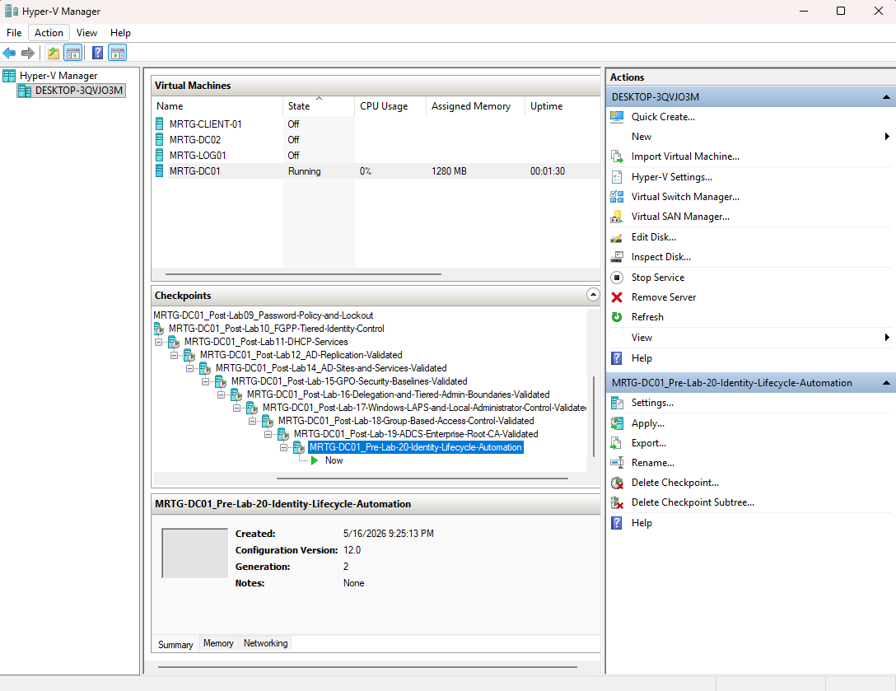

### 2. Created Lab 20 Folder Structure

A dedicated lab workspace was created on `MRTG-DC01`.

The workspace included separate folders for data, scripts, and output files.

```text
C:\MRTG-Labs\Lab-20-Identity-Lifecycle-Automation
├── data
├── output
└── scripts
```

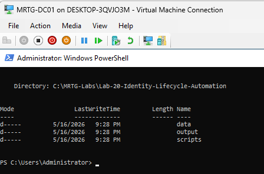

### 3. Validated Existing OUs and Groups

Before creating automation scripts, the existing Active Directory OUs and department groups were validated.

This confirmed that the automation had valid targets for user placement and group assignment.

Validated department groups included:

```text
GG_HR_Users
GG_Finance_Users
GG_IT_Users
GG_Operations_Users
GG_Security_Users
```

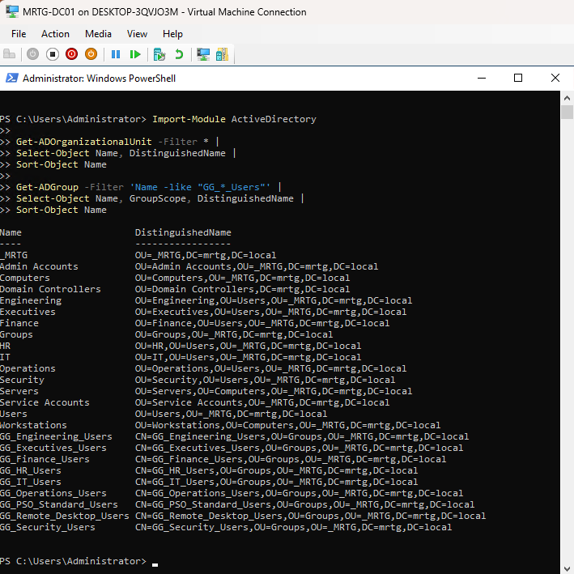

### 4. Created New Users CSV

A CSV input file was created for the Joiner workflow.

CSV file:

```text
C:\MRTG-Labs\Lab-20-Identity-Lifecycle-Automation\data\new-users.csv
```

The CSV included new users, departments, titles, target OUs, and department group assignments.

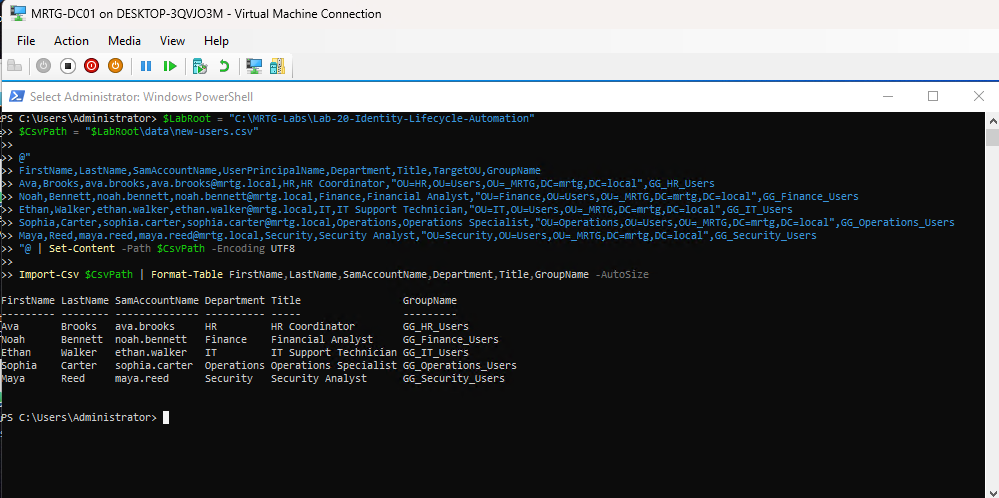

### 5. Created Joiner Script

The Joiner automation script was created.

Script file:

```text
C:\MRTG-Labs\Lab-20-Identity-Lifecycle-Automation\scripts\New-MRTGUsers.ps1
```

The script was designed to import the CSV file, create new AD users, place users into department OUs, assign department groups, and export the results.


### 6. Executed Joiner Script

The Joiner script was executed successfully.

The script processed the users from the CSV file and created the accounts in Active Directory.

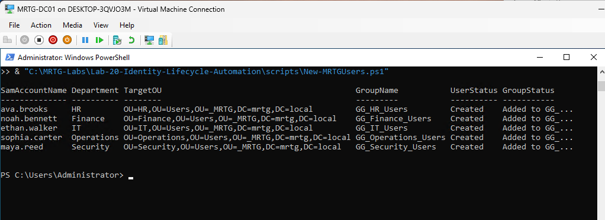

### 7. Validated Users Created in Active Directory

The newly created users were validated in Active Directory using PowerShell.

Validated users included:

| User | Department | Title | Enabled |
|---|---|---|---|
| Ava Brooks | HR | HR Coordinator | True |
| Noah Bennett | Finance | Financial Analyst | True |
| Ethan Walker | IT | IT Support Technician | True |
| Sophia Carter | Operations | Operations Specialist | True |
| Maya Reed | Security | Security Analyst | True |

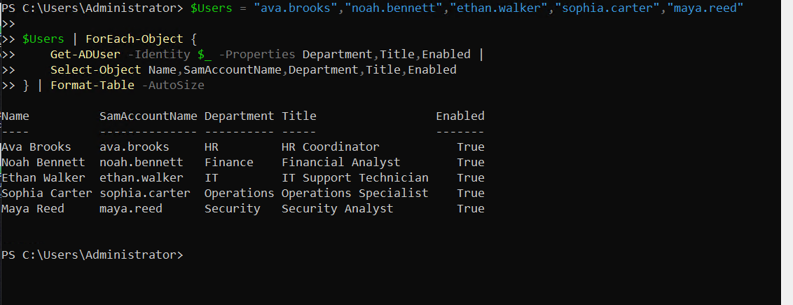

### 8. Validated Department Group Membership

Department group membership was validated for each created user.

| User | Department Group |
|---|---|
| `ava.brooks` | `GG_HR_Users` |
| `noah.bennett` | `GG_Finance_Users` |
| `ethan.walker` | `GG_IT_Users` |
| `sophia.carter` | `GG_Operations_Users` |
| `maya.reed` | `GG_Security_Users` |

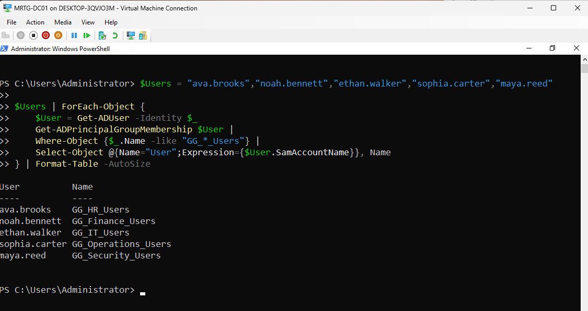

### 9. Validated Joiner Output Results

The Joiner script exported an output file showing the result of each processed user.

Output file:

```text
C:\MRTG-Labs\Lab-20-Identity-Lifecycle-Automation\output\joiner-results.csv
```

The output confirmed that each user was created and added to the correct department group.

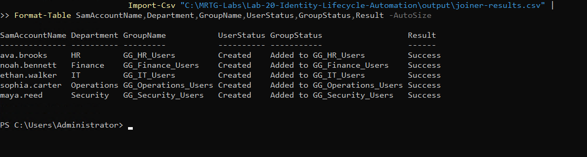

## Mover Workflow

### 10. Created Mover CSV

A CSV input file was created for the Mover workflow.

CSV file:

```text
C:\MRTG-Labs\Lab-20-Identity-Lifecycle-Automation\data\mover-users.csv
```

The scenario used in this workflow was:

```text
ethan.walker moves from IT to Security
```

The CSV defined the new department, new title, new target OU, old group, and new group.

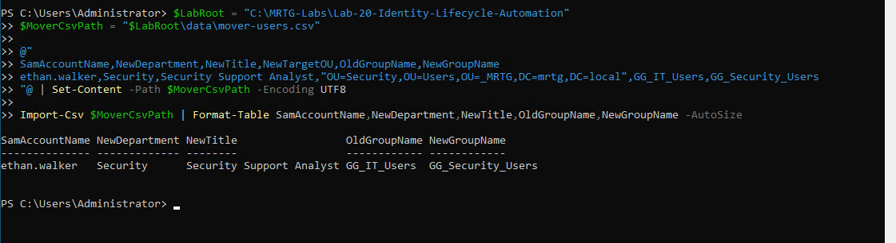

### 11. Created Mover Script

The Mover automation script was created.

Script file:

```text
C:\MRTG-Labs\Lab-20-Identity-Lifecycle-Automation\scripts\Move-MRTGUser.ps1
```

The script was designed to update the user’s department and title, move the user object to the new OU, remove the old department group, add the new department group, and export the results.


### 12. Executed Mover Script

The Mover script was executed successfully.

The script updated Ethan Walker from IT to Security.


### 13. Validated Mover Update

The Mover update was validated using PowerShell.

Validation confirmed:

```text
User: ethan.walker
Department: Security
Title: Security Support Analyst
OU: OU=Security,OU=Users,OU=_MRTG,DC=mrtg,DC=local
Group: GG_Security_Users
```

The old `GG_IT_Users` department access was removed, and the new `GG_Security_Users` access was applied.

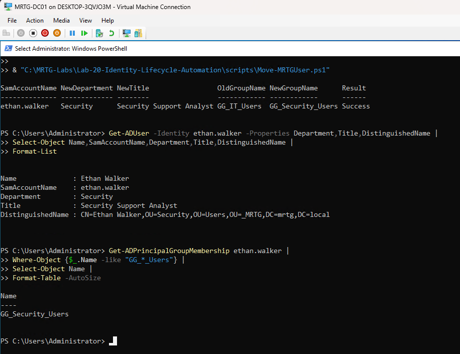

## Leaver Workflow

### 14. Created Leaver CSV

A CSV input file was created for the Leaver workflow.

CSV file:

```text
C:\MRTG-Labs\Lab-20-Identity-Lifecycle-Automation\data\leaver-users.csv
```

The scenario used in this workflow was:

```text
maya.reed leaves MRTG
```

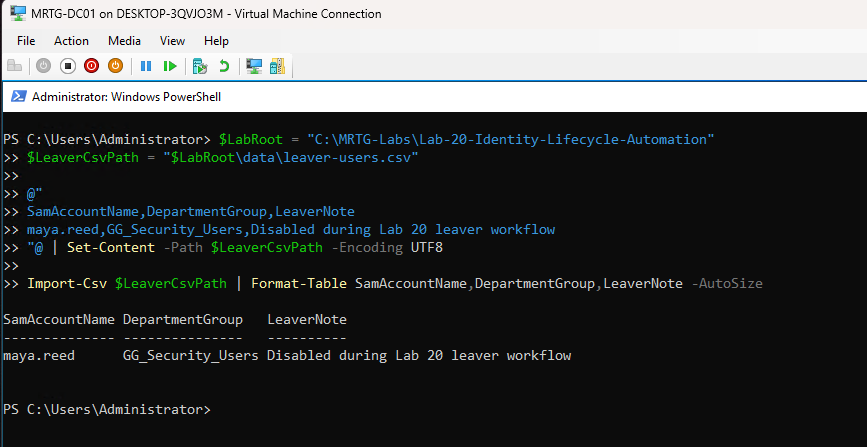

### 15. Created Leaver Script

The Leaver automation script was created.

Script file:

```text
C:\MRTG-Labs\Lab-20-Identity-Lifecycle-Automation\scripts\Disable-MRTGUser.ps1
```

The script was designed to disable the account, remove department group access, add a leaver note to the account description, and export the results.

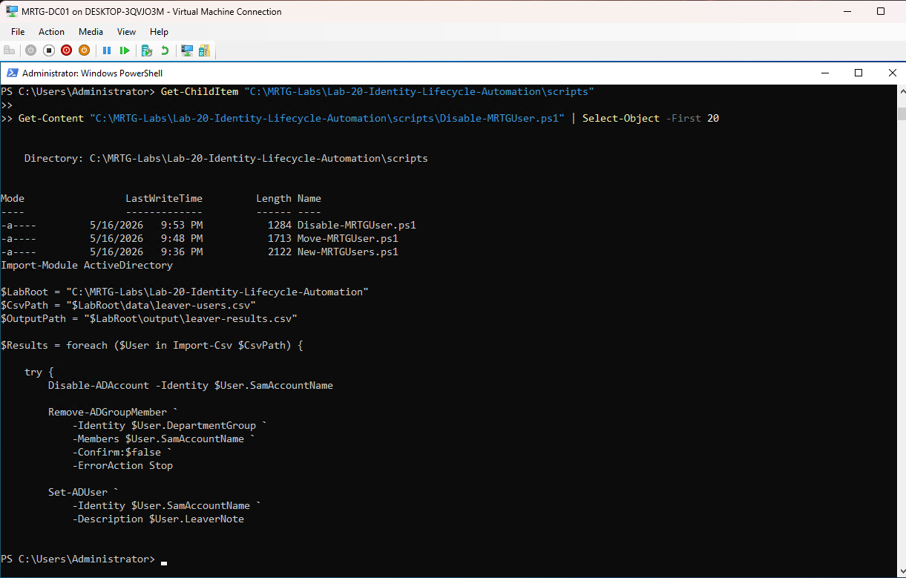

### 16. Executed Leaver Script

The Leaver script was executed successfully.

The script disabled Maya Reed’s account and removed department access.


### 17. Validated Leaver Account Disabled and Access Removed

The Leaver workflow was validated using PowerShell.

Validation confirmed:

```text
User: maya.reed
Enabled: False
Description: Disabled during Lab 20 leaver workflow
Department group access: Removed
```

No `GG_*_Users` department group membership was returned for the user after the leaver workflow completed.

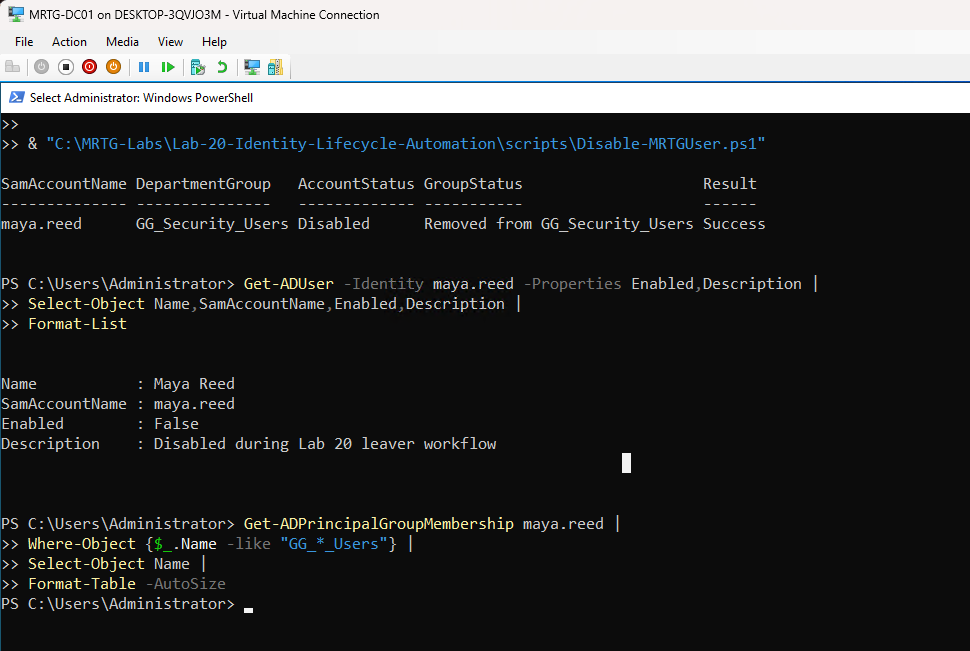

## Output Validation

### 18. Validated Lifecycle Output Files

The output folder was validated to confirm that each lifecycle workflow created an audit-style result file.

Output files created:

```text
joiner-results.csv
mover-results.csv
leaver-results.csv
```

Each workflow returned a successful result.

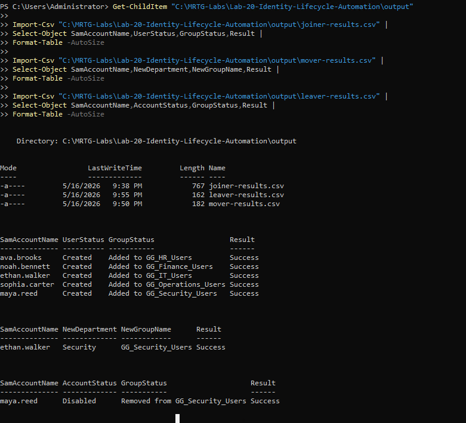

## Validation Summary

| Test | Expected Result | Actual Result | Status |
|---|---|---|---|
| Lab folder structure created | `data`, `scripts`, and `output` folders exist | Folder structure created | Passed |
| Existing OUs validated | Department OUs available | OUs confirmed | Passed |
| Existing groups validated | Department groups available | Groups confirmed | Passed |
| Joiner CSV created | New user input file exists | CSV created | Passed |
| Joiner script created | Script exists in scripts folder | `New-MRTGUsers.ps1` created | Passed |
| Joiner script executed | Users created and groups assigned | Script completed successfully | Passed |
| Users created | New accounts exist in AD | Users validated | Passed |
| Department groups assigned | Users added to correct groups | Group membership validated | Passed |
| Joiner output created | Results exported to CSV | `joiner-results.csv` created | Passed |
| Mover CSV created | Mover input file exists | CSV created | Passed |
| Mover script created | Script exists in scripts folder | `Move-MRTGUser.ps1` created | Passed |
| Mover script executed | User updated and moved | Script completed successfully | Passed |
| Mover access updated | Old group removed and new group added | Security group assigned | Passed |
| Leaver CSV created | Leaver input file exists | CSV created | Passed |
| Leaver script created | Script exists in scripts folder | `Disable-MRTGUser.ps1` created | Passed |
| Leaver script executed | Account disabled and group removed | Script completed successfully | Passed |
| Leaver account disabled | Account status disabled | `Enabled: False` confirmed | Passed |
| Leaver access removed | Department group removed | No `GG_*_Users` membership returned | Passed |
| Output files validated | Joiner, Mover, and Leaver results exist | All output files present | Passed |

## Post-Lab Checkpoint

A post-lab checkpoint was created after validating the full Joiner, Mover, and Leaver automation workflow.

Checkpoint name:

```text
MRTG-DC01_Post-Lab-20-Identity-Lifecycle-Automation-Validated
```


## Outcome

Lab 20 successfully automated identity lifecycle tasks in the MRTG enterprise Active Directory environment.

The lab demonstrated that PowerShell can be used to standardize and validate Joiner, Mover, and Leaver workflows. New users were created from CSV input, placed in the correct OUs, assigned department groups, moved between departments, removed from old groups, added to new groups, disabled during offboarding, and documented through CSV output files.

The final result was a repeatable IAM automation workflow that supports operational consistency, access control accuracy, and audit-style evidence capture.

## Skills Demonstrated

- PowerShell scripting for Active Directory administration
- Active Directory module usage
- CSV-driven user creation
- Joiner workflow automation
- Mover workflow automation
- Leaver workflow automation
- User attribute management
- OU placement and object movement
- Group membership assignment
- Group membership removal
- Account disablement
- Output reporting with CSV files
- IAM lifecycle validation
- Audit-style evidence capture
- Troubleshooting PowerShell filter syntax
- Repeatable identity administration workflows

## Real-World Relevance

Identity lifecycle management is one of the most important areas of IAM.

In enterprise and government-regulated environments, user accounts should not be created, modified, or disabled through inconsistent manual processes. Standardized automation helps reduce mistakes, improve audit readiness, and enforce consistent access control.

This lab connects directly to real IAM operations:

- Onboarding new employees
- Assigning access based on department or role
- Updating users when they transfer departments
- Removing old access when roles change
- Disabling accounts during offboarding
- Maintaining evidence of completed actions
- Supporting Joiner, Mover, and Leaver processes

Automation does not remove the need for approval, review, or governance. It helps execute approved changes consistently.

## Lessons Learned

- IAM automation should be built in phases instead of one large script.
- CSV input files make repeatable user provisioning easier to document and validate.
- Automation should verify that target OUs and groups exist before making changes.
- Joiner workflows should create accounts and assign correct access.
- Mover workflows should update both identity attributes and access.
- Leaver workflows should disable accounts and remove access.
- Output files are important because automation should leave evidence.
- PowerShell syntax matters, especially when using AD cmdlets and filters.
- A successful script is not enough; the resulting AD state must be validated.

## Security Considerations

This lab used a temporary lab password for account creation in a controlled environment.

In a production environment, password handling should be more secure and should align with organizational policy. Plaintext passwords should not be stored in scripts or repositories.

Production-ready improvements would include:

- Secure password generation
- Secure credential storage
- Privileged access controls for script execution
- Approval workflows before account changes
- Logging to a centralized location
- Error handling with alerts
- Separation of duties
- Change ticket references
- Integration with HR or identity governance systems
- Account expiration or staged onboarding controls

## What I Would Do Differently

In a production or government-regulated environment, I would not rely on standalone scripts alone.

A stronger design would include:

- Formal approval before account creation or modification
- HR-driven source data
- Identity governance integration
- Role-based access mapping
- Better error handling and rollback logic
- Secure credential and password handling
- Logging to a central audit platform
- Notifications for completed lifecycle actions
- Separation between request, approval, and execution
- Scheduled access reviews
- Automated disabled-account reporting

For this lab, standalone PowerShell scripts were appropriate because the goal was to understand and validate the core IAM lifecycle mechanics.

## Next Lab

[**Lab-21 — Directory Recovery, Backup, and Operational Resilience**](../Lab-21-Directory-Recovery-Backup-Operational-Resilience/)

The next lab will build on the identity lifecycle automation work by focusing on directory recovery, backup planning, and operational resilience for the MRTG Active Directory environment.
