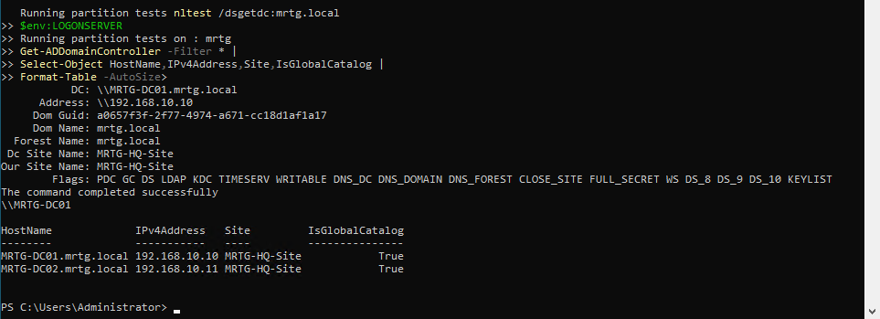
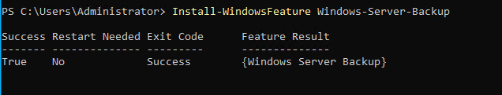
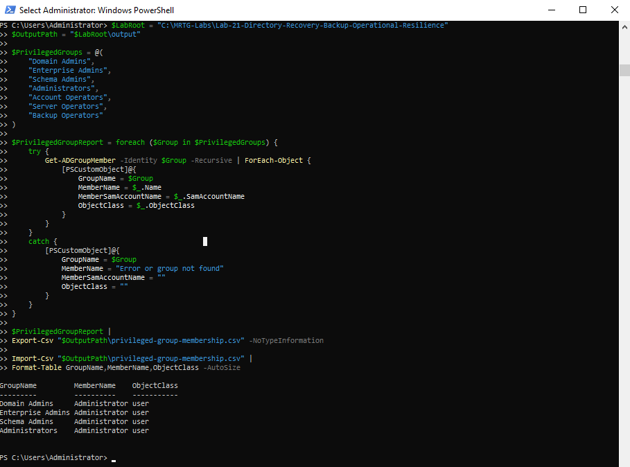
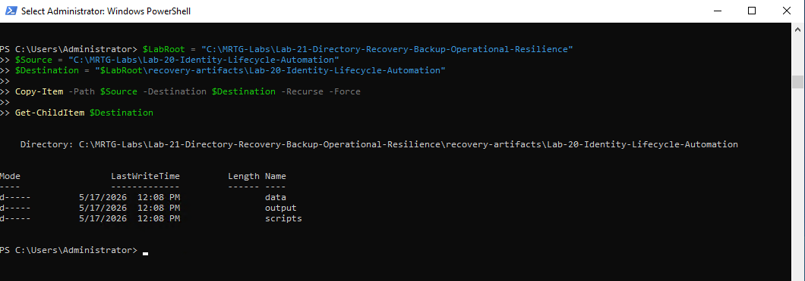
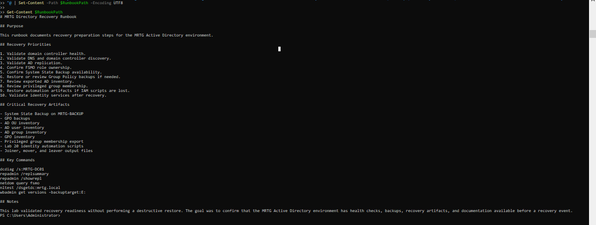
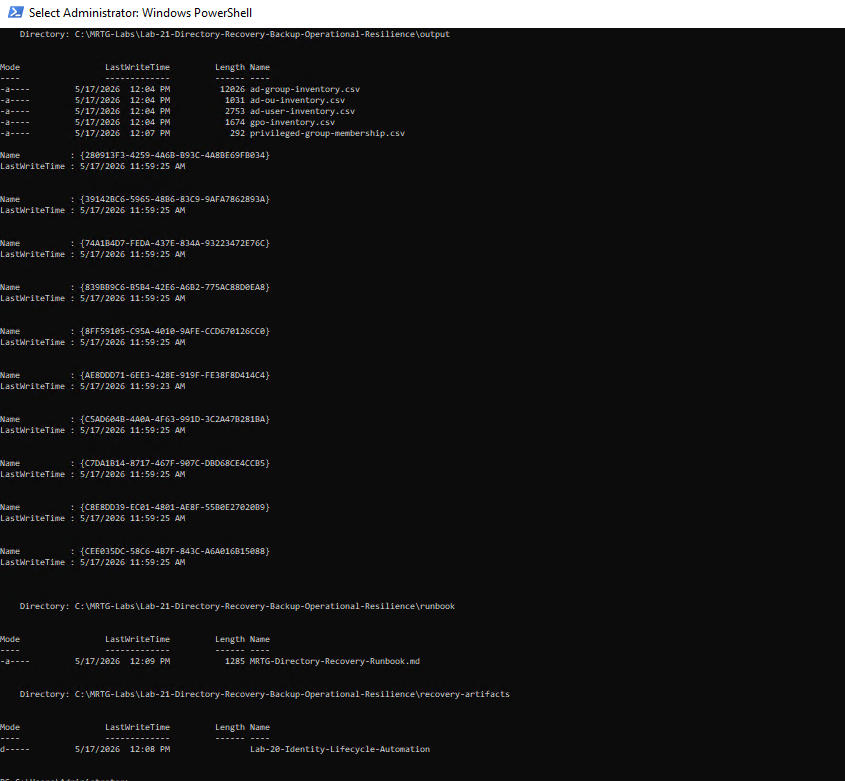
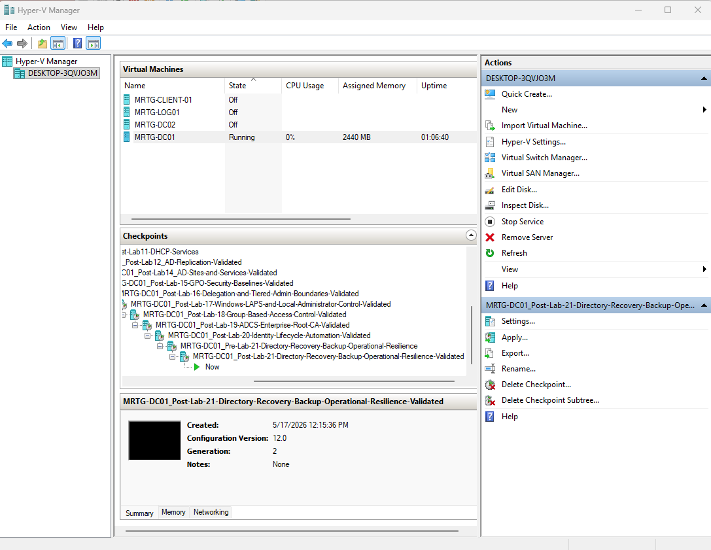

# Lab-21 — Directory Recovery, Backup, and Operational Resilience


## Objective

The objective of this lab was to validate directory recovery readiness for the MRTG enterprise Active Directory environment.

This lab focused on confirming domain controller health, validating replication, documenting FSMO role ownership, creating a dedicated backup disk, performing a System State Backup, backing up Group Policy Objects, exporting critical Active Directory inventory, preserving identity automation artifacts, and creating a recovery runbook.

The goal was to prove that the identity environment is not only functional, but also prepared for recovery and operational continuity.

## Scope

This lab included:

- Creating a pre-lab Hyper-V checkpoint
- Attaching a dedicated backup VHDX to `MRTG-DC01`
- Initializing and formatting the backup disk
- Creating a dedicated Lab 21 folder structure
- Validating domain controller health with `dcdiag`
- Validating domain controller discovery
- Validating AD replication health
- Documenting FSMO role ownership
- Installing Windows Server Backup
- Running a System State Backup
- Validating available backup versions
- Backing up all Group Policy Objects
- Exporting AD OU, user, group, and GPO inventory
- Exporting privileged group membership
- Backing up Lab 20 identity lifecycle automation artifacts
- Creating a directory recovery runbook
- Validating recovery artifacts
- Creating a post-lab Hyper-V checkpoint

## Environment

| Component | Details |
|---|---|
| Domain | `mrtg.local` |
| Primary Domain Controller | `MRTG-DC01` |
| Additional Domain Controller | `MRTG-DC02` |
| Site | `MRTG-HQ-Site` |
| Backup Disk | `MRTG-BACKUP` |
| Backup Drive Letter | `E:` |
| Backup Disk Size | `100 GB` |
| Lab Root Path | `C:\MRTG-Labs\Lab-21-Directory-Recovery-Backup-Operational-Resilience` |
| Output Path | `C:\MRTG-Labs\Lab-21-Directory-Recovery-Backup-Operational-Resilience\output` |
| GPO Backup Path | `C:\MRTG-Labs\Lab-21-Directory-Recovery-Backup-Operational-Resilience\gpo-backup` |
| Recovery Artifacts Path | `C:\MRTG-Labs\Lab-21-Directory-Recovery-Backup-Operational-Resilience\recovery-artifacts` |
| Runbook Path | `C:\MRTG-Labs\Lab-21-Directory-Recovery-Backup-Operational-Resilience\runbook` |
| Tooling | PowerShell, DCDIAG, REPADMIN, NLDIAG/NLTEST, WBADMIN |
| Backup Feature | Windows Server Backup |

## Scenario

Monroe Redstone Technology Group has built an enterprise-style Active Directory and IAM environment.

At this stage, the organization needs to prove that the directory environment can be validated, backed up, documented, and prepared for recovery.

The recovery readiness model used in this lab was:

```text
Validate Health → Confirm Replication → Document Roles → Back Up System State → Export Configuration → Preserve Artifacts → Create Runbook
```

This lab did not perform a destructive restore. The focus was recovery preparation, evidence collection, and operational resilience.

## Recovery Design

The recovery preparation strategy included multiple layers of evidence and backup readiness.

| Recovery Area | Purpose |
|---|---|
| System State Backup | Provides recovery capability for critical Windows Server and AD components |
| GPO Backup | Preserves Group Policy configuration used for identity and security control |
| AD Inventory Export | Documents users, groups, OUs, and GPOs for recovery reference |
| Privileged Group Export | Captures privileged access membership for post-recovery review |
| Lab 20 Artifact Backup | Preserves Joiner, Mover, and Leaver automation files |
| Recovery Runbook | Provides documented recovery priorities and key commands |
| Hyper-V Checkpoints | Provides lab rollback points before and after recovery preparation |

## Implementation Steps

### 1. Created Pre-Lab Checkpoint

A Hyper-V checkpoint was created before beginning Lab 21.

Checkpoint name:

```text
MRTG-DC01_Pre-Lab-21-Directory-Recovery-Backup-Operational-Resilience
```


### 2. Attached Backup VHDX

A dedicated virtual hard disk was attached to `MRTG-DC01` for System State Backup storage.

Virtual hard disk:

```text
MRTG-DC01-System-State-Backup.vhdx
```

VHDX configuration:

| Setting | Value |
|---|---|
| Format | VHDX |
| Type | Dynamically expanding |
| Size | 100 GB |
| Attached To | `MRTG-DC01` |
| Controller | SCSI Controller |


### 3. Initialized Backup Disk

The new backup disk was initialized, formatted, and assigned drive letter `E:`.

Volume configuration:

| Setting | Value |
|---|---|
| Drive Letter | `E:` |
| Volume Label | `MRTG-BACKUP` |
| File System | NTFS |
| Health Status | Healthy |
| Operational Status | OK |


### 4. Created Lab 21 Folder Structure

A dedicated Lab 21 workspace was created on `MRTG-DC01`.

Folder structure:

```text
C:\MRTG-Labs\Lab-21-Directory-Recovery-Backup-Operational-Resilience
├── data
├── gpo-backup
├── output
├── recovery-artifacts
└── runbook
```


## Health Validation

### 5. Validated Domain Controller Health

Domain controller health was validated using `dcdiag`.

Command used:

```powershell
dcdiag /s:MRTG-DC01 /test:Advertising /test:Services /test:Replications /test:KnowsOfRoleHolders
```

Validated tests included:

```text
Connectivity
Advertising
KnowsOfRoleHolders
Replications
Services
```


### 6. Validated Domain Controller Discovery

Domain controller discovery was validated using `nltest`, the logon server environment variable, and Active Directory domain controller discovery.

Commands used:

```powershell
nltest /dsgetdc:mrtg.local
$env:LOGONSERVER

Get-ADDomainController -Filter * |
Select-Object HostName,IPv4Address,Site,IsGlobalCatalog |
Format-Table -AutoSize
```

Validated domain controllers:

| Domain Controller | IP Address | Site | Global Catalog |
|---|---|---|---|
| `MRTG-DC01.mrtg.local` | `192.168.10.10` | `MRTG-HQ-Site` | True |
| `MRTG-DC02.mrtg.local` | `192.168.10.11` | `MRTG-HQ-Site` | True |



### 7. Validated Replication Health

Replication health was validated using `repadmin`.

Commands used:

```powershell
repadmin /replsummary
repadmin /showrepl
```

Validation confirmed:

```text
MRTG-DC01 replication failures: 0 / 5
MRTG-DC02 replication failures: 0 / 5
Last replication attempts: Successful
```


### 8. Documented FSMO Roles

FSMO role ownership was documented using `netdom`.

Command used:

```powershell
netdom query fsmo
```

FSMO roles were held by:

```text
MRTG-DC01.mrtg.local
```

Roles documented:

| FSMO Role | Role Holder |
|---|---|
| Schema Master | `MRTG-DC01.mrtg.local` |
| Domain Naming Master | `MRTG-DC01.mrtg.local` |
| PDC Emulator | `MRTG-DC01.mrtg.local` |
| RID Pool Manager | `MRTG-DC01.mrtg.local` |
| Infrastructure Master | `MRTG-DC01.mrtg.local` |


## Backup Configuration

### 9. Installed Windows Server Backup

Windows Server Backup was installed on `MRTG-DC01`.

Command used:

```powershell
Install-WindowsFeature Windows-Server-Backup
```

The feature installed successfully and did not require a restart.



### 10. Completed System State Backup

A System State Backup was completed to the dedicated backup disk.

Command used:

```powershell
wbadmin start systemstatebackup -backuptarget:E: -quiet
```

Backup versions were validated using:

```powershell
wbadmin get versions -backuptarget:E:
```

Validation confirmed:

```text
Backup operation: Successfully completed
Backup target: E:
Can recover: Volumes, Files, Applications, System State
```


## Recovery Artifacts

### 11. Created GPO Backup

All Group Policy Objects were backed up to the Lab 21 `gpo-backup` folder.

Command used:

```powershell
$LabRoot = "C:\MRTG-Labs\Lab-21-Directory-Recovery-Backup-Operational-Resilience"
$GpoBackupPath = "$LabRoot\gpo-backup"

Backup-GPO -All -Path $GpoBackupPath
```

A summary was captured showing the backup path, total GPO backup folders, and sample backup folders.

Validated GPO backup count:

```text
Total GPO backup folders created: 10
```


### 12. Exported Critical AD Inventory

Critical Active Directory inventory was exported to CSV files.

Commands exported:

```powershell
Get-ADOrganizationalUnit -Filter * -Properties Description |
Select-Object Name,DistinguishedName,Description |
Export-Csv "$OutputPath\ad-ou-inventory.csv" -NoTypeInformation

Get-ADGroup -Filter * -Properties GroupCategory,GroupScope,Description |
Select-Object Name,GroupCategory,GroupScope,DistinguishedName,Description |
Export-Csv "$OutputPath\ad-group-inventory.csv" -NoTypeInformation

Get-ADUser -Filter * -Properties Enabled,Department,Title,Description,LastLogonDate |
Select-Object Name,SamAccountName,Enabled,Department,Title,Description,DistinguishedName,LastLogonDate |
Export-Csv "$OutputPath\ad-user-inventory.csv" -NoTypeInformation

Get-GPO -All |
Select-Object DisplayName,Id,Owner,CreationTime,ModificationTime,GpoStatus |
Export-Csv "$OutputPath\gpo-inventory.csv" -NoTypeInformation
```

Exported inventory files:

```text
ad-group-inventory.csv
ad-ou-inventory.csv
ad-user-inventory.csv
gpo-inventory.csv
```


### 13. Exported Privileged Group Membership

Privileged group membership was exported to support recovery and access review.

Privileged groups reviewed included:

```text
Domain Admins
Enterprise Admins
Schema Admins
Administrators
Account Operators
Server Operators
Backup Operators
```

Output file:

```text
privileged-group-membership.csv
```



### 14. Backed Up Lab 20 Automation Artifacts

Lab 20 identity lifecycle automation artifacts were backed up into the Lab 21 recovery artifacts folder.

Source path:

```text
C:\MRTG-Labs\Lab-20-Identity-Lifecycle-Automation
```

Destination path:

```text
C:\MRTG-Labs\Lab-21-Directory-Recovery-Backup-Operational-Resilience\recovery-artifacts\Lab-20-Identity-Lifecycle-Automation
```

Backed up artifact folders:

```text
data
output
scripts
```



### 15. Created Recovery Runbook

A directory recovery runbook was created.

Runbook file:

```text
C:\MRTG-Labs\Lab-21-Directory-Recovery-Backup-Operational-Resilience\runbook\MRTG-Directory-Recovery-Runbook.md
```

The runbook documented:

- Recovery priorities
- Critical recovery artifacts
- Key recovery commands
- System State Backup reference
- GPO backup reference
- AD inventory reference
- Privileged group membership reference
- Lab 20 automation artifact backup reference



### 16. Validated Recovery Artifacts

Recovery artifacts were validated across the Lab 21 folder structure.

Validated recovery evidence included:

```text
output/
- ad-group-inventory.csv
- ad-ou-inventory.csv
- ad-user-inventory.csv
- gpo-inventory.csv
- privileged-group-membership.csv

gpo-backup/
- GPO backup folders

runbook/
- MRTG-Directory-Recovery-Runbook.md

recovery-artifacts/
- Lab-20-Identity-Lifecycle-Automation
```



## Troubleshooting Note

During the initial health validation process, replication testing identified a DNS-related replication issue.

The issue was resolved before backup validation by bringing the replication environment back to a healthy state and rerunning replication and domain controller health checks.

Final validation confirmed:

```text
Replication failures: 0
DCDIAG replication test: Passed
Domain controller discovery: Successful
```

This was a valuable recovery-readiness checkpoint because backups should not be treated as complete until the directory environment is validated as healthy.

## Validation Summary

| Test | Expected Result | Actual Result | Status |
|---|---|---|---|
| Pre-lab checkpoint created | Checkpoint exists before Lab 21 changes | Pre-lab checkpoint created | Passed |
| Backup VHDX attached | 100 GB backup disk attached to `MRTG-DC01` | Backup VHDX attached | Passed |
| Backup disk initialized | `E:` drive created with `MRTG-BACKUP` label | Disk initialized and healthy | Passed |
| Lab folder structure created | Required Lab 21 folders exist | Folder structure validated | Passed |
| DC health validated | `dcdiag` tests pass | Health tests passed | Passed |
| DC discovery validated | Domain controllers discoverable | DC01 and DC02 discovered | Passed |
| Replication health validated | Replication failures show `0` | Replication validated | Passed |
| FSMO roles documented | FSMO role holders identified | All roles documented on DC01 | Passed |
| Windows Server Backup installed | Feature installs successfully | Installation successful | Passed |
| System State Backup completed | Backup completes to `E:` | System State Backup completed | Passed |
| Backup version validated | Backup version listed by `wbadmin` | Backup version confirmed | Passed |
| GPO backup created | All GPOs backed up | 10 GPO backup folders created | Passed |
| AD inventory exported | OU, user, group, and GPO inventory files created | CSV exports created | Passed |
| Privileged groups exported | Privileged membership exported | CSV export created | Passed |
| Lab 20 artifacts backed up | Automation artifacts preserved | `data`, `output`, and `scripts` backed up | Passed |
| Recovery runbook created | Runbook exists with recovery guidance | Runbook created | Passed |
| Recovery artifacts validated | Recovery evidence exists | Artifacts validated | Passed |
| Post-lab checkpoint created | Checkpoint exists after validation | Post-lab checkpoint created | Passed |

## Post-Lab Checkpoint

A post-lab checkpoint was created after validating backup, recovery artifacts, and operational resilience.

Checkpoint name:

```text
MRTG-DC01_Post-Lab-21-Directory-Recovery-Backup-Operational-Resilience-Validated
```



## Outcome

Lab 21 successfully validated directory recovery readiness for the MRTG enterprise Active Directory environment.

The lab confirmed that the environment was healthy, replication was functioning, FSMO roles were documented, Windows Server Backup was installed, a System State Backup was completed, GPOs were backed up, AD inventory was exported, privileged group membership was documented, Lab 20 automation artifacts were preserved, and a recovery runbook was created.

The final result was a documented recovery package that supports identity infrastructure resilience and operational continuity.

## Skills Demonstrated

- Active Directory health validation
- Domain controller discovery validation
- Replication health validation
- FSMO role documentation
- Hyper-V virtual disk attachment
- Disk initialization and formatting
- Windows Server Backup installation
- System State Backup execution
- Backup version validation with `wbadmin`
- Group Policy Object backup
- Active Directory inventory export
- Privileged group membership export
- Recovery artifact preservation
- Recovery runbook creation
- PowerShell-based recovery documentation
- Operational resilience planning
- IAM recovery readiness validation

## Real-World Relevance

Directory recovery and operational resilience are critical in enterprise and government-regulated IT environments.

Active Directory is often the foundation for authentication, authorization, administrative access, workstation policy, certificate trust, and identity lifecycle operations. If AD is unhealthy or unrecoverable, identity operations can fail across the environment.

This lab connects directly to real-world IAM and infrastructure responsibilities:

- Validating domain controller health before backup
- Confirming replication before recovery planning
- Documenting FSMO role ownership
- Preserving GPO security configuration
- Capturing privileged access membership
- Maintaining recovery-ready inventory files
- Backing up automation scripts used for identity operations
- Creating runbooks that another administrator could follow
- Supporting audit readiness and continuity planning

The key lesson is that identity infrastructure must be recoverable, not just functional.

## Security Considerations

This lab used a dedicated virtual disk attached to the domain controller as the backup target.

For a lab environment, this is acceptable because the goal was to validate the backup process and recovery-readiness workflow.

In a production environment, backups should be stored on separate, protected infrastructure.

Production-ready improvements would include:

- Storing backups on protected backup infrastructure
- Encrypting backup storage
- Restricting backup operator access
- Testing restore procedures in an isolated environment
- Monitoring backup success and failure events
- Retaining backup history according to policy
- Protecting backup media from ransomware
- Separating production systems from backup repositories
- Documenting restore order and dependencies
- Performing regular recovery exercises
- Reviewing privileged access after recovery

## Lessons Learned

- Directory recovery readiness starts with health validation.
- Backups should not be treated as complete if replication is unhealthy.
- System State Backup is important for Active Directory recovery preparation.
- GPO backups preserve security and identity-related configuration.
- AD inventory exports provide useful recovery reference data.
- Privileged group membership must be documented before a recovery event.
- IAM automation scripts are operational assets and should be preserved.
- Recovery runbooks make recovery steps repeatable and easier to hand off.
- Operational resilience is part of identity security.
- A recoverable IAM environment is stronger than one that is only configured correctly.

## What I Would Do Differently

In a production or government-regulated environment, I would expand this recovery workflow beyond a single lab backup disk.

A stronger production design would include:

- Dedicated backup infrastructure
- Off-host backup storage
- Encrypted backup repositories
- Backup access controls
- Backup monitoring and alerting
- Scheduled System State Backups
- Routine GPO backups
- Automated AD inventory exports
- Regular privileged group export reviews
- Recovery testing in an isolated environment
- Formal recovery time objectives
- Formal recovery point objectives
- Change ticket references for recovery actions
- Documented escalation contacts
- Centralized logging of backup and recovery events

For this lab, the goal was to validate the core recovery readiness process without performing a destructive restore.

## Next Lab

[**Lab-22 — IAM Security Review and Access Control Audit**](../Lab-22-IAM-Security-Review-and-Access-Control-Audit/)

The next lab will build on this recovery and resilience work by reviewing identity security posture, privileged access, group membership, disabled accounts, delegation boundaries, and access control risks across the MRTG Active Directory environment.
