# Lab 21: Directory Recovery, Backup, and Operational Resilience


---

## Objective

Prepare and document recovery resources for the `mrtg.local` Active Directory environment.

This lab validates domain controller health, documents FSMO role ownership, completes a System State Backup, backs up Group Policy Objects, exports directory inventory, preserves automation files, and creates a recovery runbook.

The goal is to improve recovery preparation without overstating backup completion as proof of recoverability.

---

## Business Scenario

Monroe Redstone Technology Group requires recovery preparation for its identity infrastructure.

Active Directory supports authentication, authorization, Group Policy, privileged administration, certificate services, and identity lifecycle operations. Directory failure could affect the entire environment.

A functional domain is not enough. Administrators also need:

- Healthy replication
- Known FSMO role ownership
- Current System State backups
- Protected Group Policy backups
- Directory inventory
- Privileged-access records
- Preserved operational scripts
- Documented recovery procedures
- Tested restore processes

This lab creates the initial recovery package and documents the remaining validation requirements.

---

## Lab Summary

In this lab, I attached a dedicated 100 GB VHDX to `MRTG-DC01`, initialized it as `E:`, and labeled it `MRTG-BACKUP`.

A structured Lab 21 workspace was created for GPO backups, output reports, recovery artifacts, and the recovery runbook.

Initial health checks identified a DNS-related replication failure. Replication health was restored before backup work continued.

All FSMO roles were documented on `MRTG-DC01`. Windows Server Backup was installed, and a System State Backup completed successfully to `E:`. The backup version appeared in the Windows Server Backup catalog.

All GPOs were backed up, Active Directory inventory was exported, privileged group membership was documented, Lab 20 automation artifacts were copied, and a recovery runbook was created.

This lab validated backup creation and artifact preparation. It did not perform a restore, so recoverability was not fully proven.

---

## Environment

| Component | Details |
|---|---|
| Organization | Monroe Redstone Technology Group |
| Domain | `mrtg.local` |
| Original Domain Controller | `MRTG-DC01` |
| Additional Domain Controller | `MRTG-DC02` |
| Active Directory Site | `MRTG-HQ-Site` |
| Backup Volume | `MRTG-BACKUP` |
| Backup Drive | `E:` |
| Backup Disk Size | `100 GB` |
| Backup Feature | Windows Server Backup |
| Lab Root | `C:\MRTG-Labs\Lab-21-Directory-Recovery-Backup-Operational-Resilience` |
| GPO Backup Folder | `gpo-backup` |
| Output Folder | `output` |
| Recovery Artifacts Folder | `recovery-artifacts` |
| Runbook Folder | `runbook` |
| Tools | PowerShell, `dcdiag`, `repadmin`, `nltest`, and `wbadmin` |
| Hypervisor | Hyper-V |

---

## Prerequisites

- Operational `mrtg.local` domain
- Administrative access to both domain controllers
- Healthy DNS and replication
- Windows Server Backup support
- Sufficient backup storage
- Group Policy PowerShell module
- Active Directory PowerShell module
- Approved backup and recovery plan
- Current documentation of critical identity services

---

## Scope

### Included

- Temporary Hyper-V checkpoints
- Dedicated backup VHDX attachment
- Backup volume initialization
- Domain controller health validation
- Domain controller discovery
- Replication-health validation
- FSMO role documentation
- Windows Server Backup installation
- System State Backup
- Backup catalog validation
- GPO backup
- Active Directory inventory export
- Privileged-group membership export
- Automation-artifact copy
- Recovery runbook creation
- Recovery-artifact review

### Not Included

- System State restore
- Authoritative restore
- Non-authoritative restore
- Forest recovery
- Bare-metal recovery
- CA-specific recovery test
- Isolated restore validation
- Backup encryption
- Off-host backup storage
- Immutable backup storage
- Automated backup scheduling
- Retention policy
- Recovery tabletop exercise
- Recovery Time Objective validation
- Recovery Point Objective validation

---

## Recovery Preparation Model

```text
Validate Directory Health
          |
          v
Document Roles and Dependencies
          |
          v
Create System State Backup
          |
          v
Back Up GPOs and Configuration References
          |
          v
Preserve Operational Artifacts
          |
          v
Create Recovery Runbook
          |
          v
Test Restore in Isolated Environment
```

The final restore-testing stage was outside this lab's scope.

---

## Recovery Components

| Component | Purpose | Limitation |
|---|---|---|
| System State Backup | Captures critical Windows and directory components | Recoverability requires restore testing |
| GPO Backup | Preserves GPO configuration | Does not preserve every link or external dependency by itself |
| AD Inventory Export | Provides recovery and comparison reference | CSV exports are not directory backups |
| Privileged Group Export | Supports post-recovery access review | May require recursive nested-membership analysis |
| Automation Artifact Copy | Preserves scripts, input, and results | Same-host copy is not an independent backup |
| Recovery Runbook | Documents recovery references and commands | Runbook was not tested through a restore exercise |
| Hyper-V Checkpoint | Provides temporary lab rollback | Not a supported Active Directory backup |

---

## Recovery Artifact Structure

```text
C:\MRTG-Labs\Lab-21-Directory-Recovery-Backup-Operational-Resilience
|-- data
|-- gpo-backup
|-- output
|   |-- ad-group-inventory.csv
|   |-- ad-ou-inventory.csv
|   |-- ad-user-inventory.csv
|   |-- gpo-inventory.csv
|   `-- privileged-group-membership.csv
|
|-- recovery-artifacts
|   `-- Lab-20-Identity-Lifecycle-Automation
|       |-- data
|       |-- output
|       `-- scripts
|
`-- runbook
    `-- MRTG-Directory-Recovery-Runbook.md
```

---

## Implementation and Validation

### 1. Created a Pre-Change Lab Checkpoint

Checkpoint name:

```text
MRTG-DC01_Pre-Lab-21-Directory-Recovery-Backup-Operational-Resilience
```

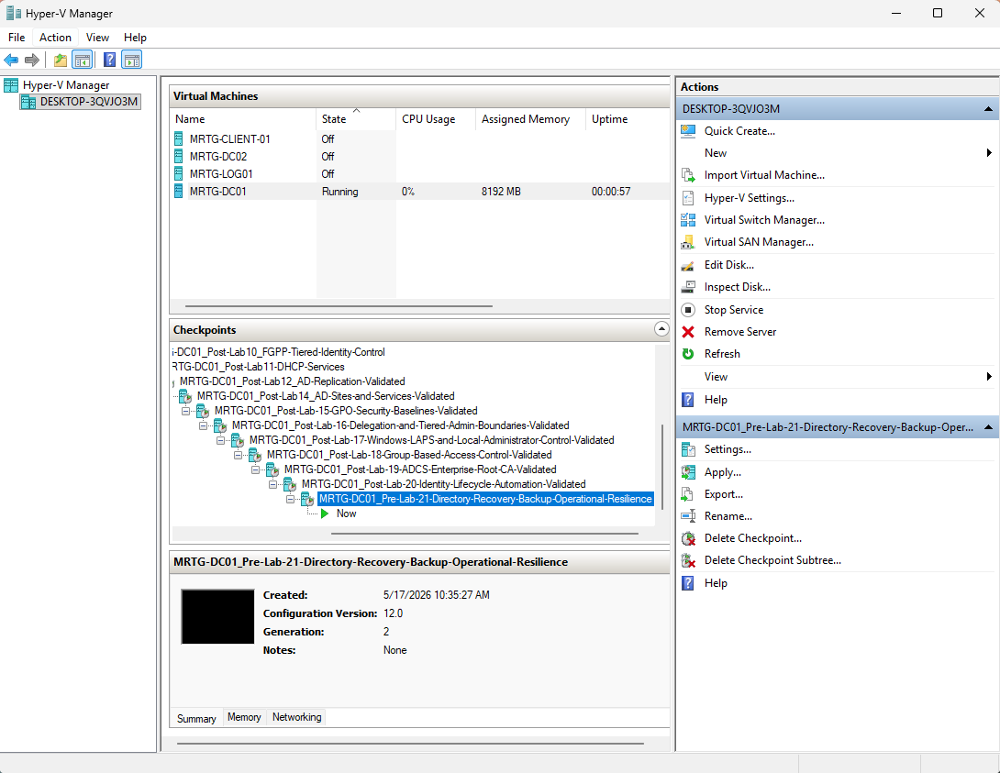

The checkpoint was a temporary lab tool and was not counted as an Active Directory backup.

---

### 2. Attached the Backup VHDX

Virtual disk:

```text
MRTG-DC01-System-State-Backup.vhdx
```

| Setting | Value |
|---|---|
| Format | VHDX |
| Type | Dynamically expanding |
| Maximum Size | `100 GB` |
| Attached To | `MRTG-DC01` |
| Controller | SCSI |

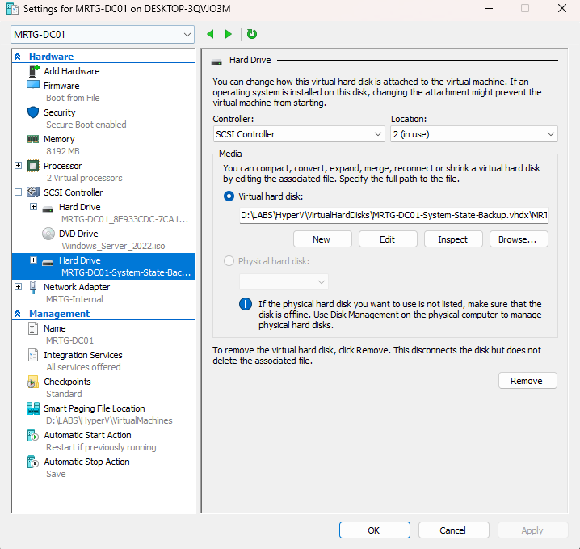

The virtual disk was attached to the same VM and physical Hyper-V host. This validates backup mechanics but does not provide independent failure protection.

---

### 3. Initialized the Backup Volume

| Setting | Value |
|---|---|
| Drive Letter | `E:` |
| Volume Label | `MRTG-BACKUP` |
| File System | NTFS |
| Health | Healthy |
| Operational Status | OK |
| Capacity | `99.98 GB` |

Commands used:

```powershell
Get-Volume -DriveLetter E
Get-Disk
```

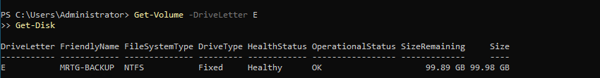

---

### 4. Created the Lab Workspace

```text
C:\MRTG-Labs\Lab-21-Directory-Recovery-Backup-Operational-Resilience
|-- data
|-- gpo-backup
|-- output
|-- recovery-artifacts
`-- runbook
```

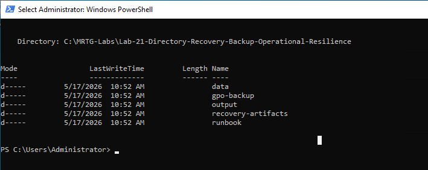

---

## Directory Health Validation

### 5. Detected a Replication DNS Failure

Command used:

```cmd
repadmin /replsummary
```

Observed error:

```text
(8524) The DSA operation is unable to proceed because of a DNS lookup failure.
```

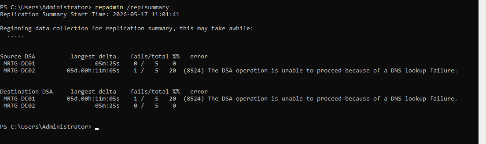

The failure was documented and corrected before backup preparation continued.

A completed backup of an unhealthy directory can preserve an unhealthy state, so health findings must be understood before relying on the backup.

---

### 6. Reviewed Domain Controller Health

Command used:

```cmd
dcdiag /s:MRTG-DC01 /test:Advertising /test:Services /test:Replications /test:KnowsOfRoleHolders
```

Reviewed tests included:

- Connectivity
- Advertising
- KnowsOfRoleHolders
- Replications
- Services

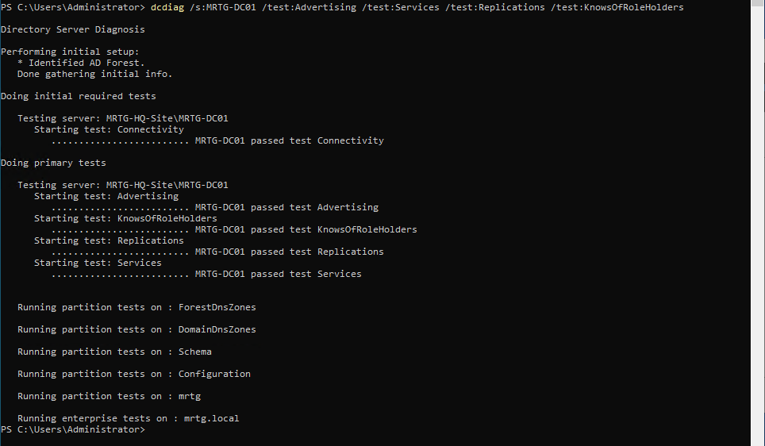

---

### 7. Validated Domain Controller Discovery

Commands used:

```powershell
nltest /dsgetdc:mrtg.local
$env:LOGONSERVER

Get-ADDomainController -Filter * |
    Select-Object HostName, IPv4Address, Site, IsGlobalCatalog |
    Format-Table -AutoSize
```


| Domain Controller | Address | Site | Global Catalog |
|---|---:|---|---|
| `MRTG-DC01.mrtg.local` | `192.168.10.10` | `MRTG-HQ-Site` | True |
| `MRTG-DC02.mrtg.local` | `192.168.10.11` | `MRTG-HQ-Site` | True |

---

### 8. Confirmed Replication Health

Commands used:

```cmd
repadmin /replsummary
repadmin /showrepl
```

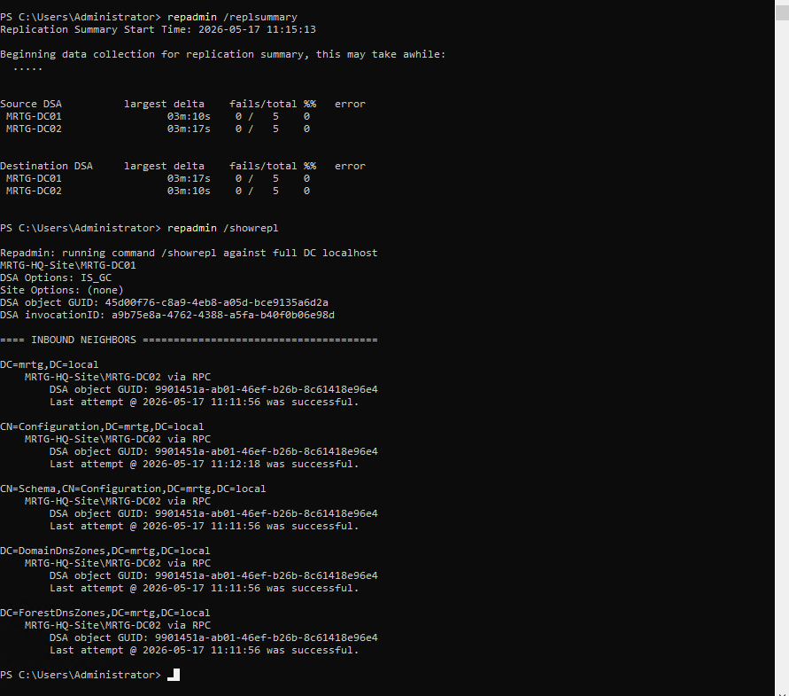

Final results included:

```text
MRTG-DC01 replication failures: 0 / 5
MRTG-DC02 replication failures: 0 / 5
Last replication attempts: Successful
```

This confirmed healthy replication at the time of backup preparation.

---

### 9. Documented FSMO Role Ownership

Command used:

```cmd
netdom query fsmo
```

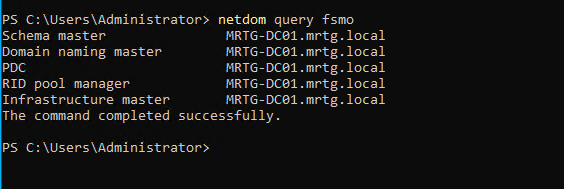

| FSMO Role | Role Holder |
|---|---|
| Schema Master | `MRTG-DC01.mrtg.local` |
| Domain Naming Master | `MRTG-DC01.mrtg.local` |
| PDC Emulator | `MRTG-DC01.mrtg.local` |
| RID Master | `MRTG-DC01.mrtg.local` |
| Infrastructure Master | `MRTG-DC01.mrtg.local` |

---

## System State Backup

### 10. Installed Windows Server Backup

Command used:

```powershell
Install-WindowsFeature Windows-Server-Backup
```


The feature installed successfully without requiring a restart.

---

### 11. Completed the System State Backup

Command used:

```cmd
wbadmin start systemstatebackup -backuptarget:E: -quiet
```

Backup catalog command:

```cmd
wbadmin get versions -backuptarget:E:
```

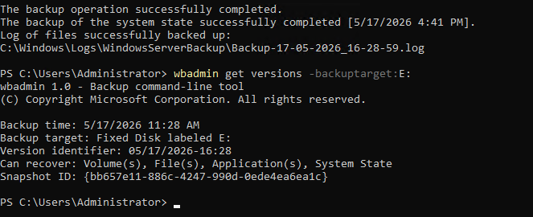

Validated output included:

```text
Backup operation: Successfully completed
Backup target: E:
Can recover: Volumes, Files, Applications, System State
```

This confirms that Windows Server Backup completed and cataloged the backup.

It does not prove that the backup can be restored successfully. Restore validation requires a controlled recovery test.

---

## Recovery Artifacts

### 12. Backed Up Group Policy Objects

```powershell
$LabRoot = "C:\MRTG-Labs\Lab-21-Directory-Recovery-Backup-Operational-Resilience"
$GpoBackupPath = "$LabRoot\gpo-backup"

Backup-GPO -All -Path $GpoBackupPath

$GpoBackups = Get-ChildItem $GpoBackupPath
$GpoBackups.Count
```

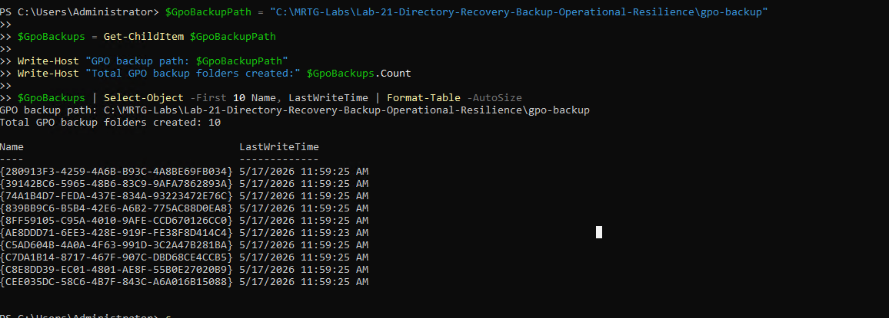

Validated count:

```text
10 GPO backup folders
```

A GPO backup preserves GPO settings and metadata supported by the backup format. OU links, external scripts, certificate dependencies, and surrounding directory design require separate documentation and recovery planning.

---

### 13. Exported Active Directory Inventory

```powershell
$LabRoot = "C:\MRTG-Labs\Lab-21-Directory-Recovery-Backup-Operational-Resilience"
$OutputPath = "$LabRoot\output"

Get-ADOrganizationalUnit -Filter * -Properties Description |
    Select-Object Name, DistinguishedName, Description |
    Export-Csv "$OutputPath\ad-ou-inventory.csv" -NoTypeInformation

Get-ADGroup -Filter * -Properties GroupCategory, GroupScope, Description |
    Select-Object Name, GroupCategory, GroupScope, DistinguishedName, Description |
    Export-Csv "$OutputPath\ad-group-inventory.csv" -NoTypeInformation

Get-ADUser -Filter * -Properties Enabled, Department, Title, Description, LastLogonDate |
    Select-Object Name, SamAccountName, Enabled, Department, Title, Description, DistinguishedName, LastLogonDate |
    Export-Csv "$OutputPath\ad-user-inventory.csv" -NoTypeInformation

Get-GPO -All |
    Select-Object DisplayName, Id, Owner, CreationTime, ModificationTime, GpoStatus |
    Export-Csv "$OutputPath\gpo-inventory.csv" -NoTypeInformation
```

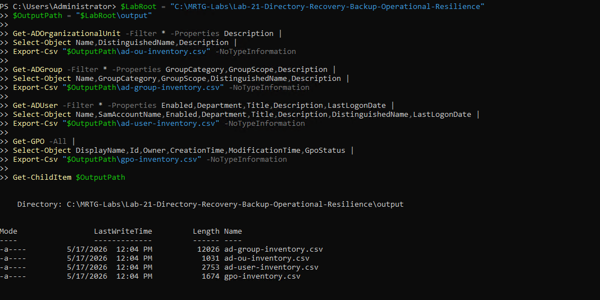

Created files:

```text
ad-group-inventory.csv
ad-ou-inventory.csv
ad-user-inventory.csv
gpo-inventory.csv
```

These exports provide reference data. They do not preserve passwords, security descriptors, all attributes, or the complete directory database.

---

### 14. Exported Privileged Group Membership

Reviewed groups included:

```text
Domain Admins
Enterprise Admins
Schema Admins
Administrators
Account Operators
Server Operators
Backup Operators
```

Output:

```text
privileged-group-membership.csv
```


The export provides a point-in-time membership reference.

A production review should include nested membership, effective privilege, delegated rights, and other sensitive groups.

---

### 15. Preserved Lab 20 Automation Artifacts

Source:

```text
C:\MRTG-Labs\Lab-20-Identity-Lifecycle-Automation
```

Destination:

```text
C:\MRTG-Labs\Lab-21-Directory-Recovery-Backup-Operational-Resilience\recovery-artifacts\Lab-20-Identity-Lifecycle-Automation
```

Copied folders:

```text
data
output
scripts
```


This created an organized recovery copy but remained on the same server and physical host. It was not an independent backup until copied to protected off-host storage.

---

### 16. Created the Recovery Runbook

Runbook:

```text
C:\MRTG-Labs\Lab-21-Directory-Recovery-Backup-Operational-Resilience\runbook\MRTG-Directory-Recovery-Runbook.md
```


The runbook documented:

- Recovery priorities
- Critical recovery artifacts
- Health-validation commands
- System State Backup reference
- GPO backup reference
- Active Directory inventory reference
- Privileged-group reference
- Automation-artifact reference

The runbook was created and reviewed but was not executed through a recovery exercise.

---

### 17. Validated the Recovery Artifact Inventory

Validated contents included:

```text
output/
|-- ad-group-inventory.csv
|-- ad-ou-inventory.csv
|-- ad-user-inventory.csv
|-- gpo-inventory.csv
`-- privileged-group-membership.csv

gpo-backup/
`-- GPO backup folders

runbook/
`-- MRTG-Directory-Recovery-Runbook.md

recovery-artifacts/
`-- Lab-20-Identity-Lifecycle-Automation
```


This confirmed artifact presence, not artifact recoverability.

---

### 18. Created the Final Lab Checkpoint

Checkpoint name:

```text
MRTG-DC01_Post-Lab-21-Directory-Recovery-Backup-Operational-Resilience-Validated
```


The checkpoint was a temporary lab recovery point and was not counted as part of the supported backup package.

---

## Recovery Limitations

The backup and artifacts share important limitations:

- The backup VHDX is attached to the protected VM
- The VHDX resides on the same Hyper-V host
- The artifact copies remain on `MRTG-DC01`
- No offline or immutable copy was created
- No backup encryption was configured
- No retention schedule was defined
- No restore was performed
- No forest-recovery sequence was tested
- No CA-specific recovery was tested
- No ransomware-resistance control was validated

This lab demonstrates backup preparation, not full disaster-recovery capability.

---

## Validation Results

| Validation Item | Result |
|---|---|
| Temporary pre-change checkpoint created | Passed |
| Backup VHDX attached | Passed |
| Backup volume initialized | Passed |
| Lab workspace created | Passed |
| Initial replication issue detected | Passed |
| Domain controller health reviewed | Passed |
| Domain controller discovery validated | Passed |
| Replication restored to zero reported failures | Passed |
| FSMO role ownership documented | Passed |
| Windows Server Backup installed | Passed |
| System State Backup completed | Passed |
| Backup version cataloged | Passed |
| Ten GPO backup folders created | Passed |
| Directory inventory exported | Passed |
| Privileged-group membership exported | Passed |
| Lab 20 artifacts copied | Passed |
| Recovery runbook created | Passed |
| Recovery artifacts present | Passed |
| System State restore | Not tested |
| GPO restore | Not tested |
| Forest recovery | Not tested |
| Temporary final checkpoint created | Passed |

---

## Security and IAM Relevance

Identity infrastructure must be recoverable as well as secure.

This lab supports:

- Directory health validation
- Replication-health review
- FSMO role documentation
- System State Backup
- Group Policy preservation
- Identity inventory
- Privileged-access reference data
- Operational-script preservation
- Recovery documentation
- Recovery-gap identification

Recovery planning is part of IAM because directory failure can interrupt authentication, authorization, administrative access, and policy enforcement.

---

## Risks Addressed

This lab reduces the risk of:

- No System State Backup
- Unknown FSMO ownership
- Missing GPO backup
- Missing directory inventory
- Missing privileged-group reference
- Unpreserved automation scripts
- Undocumented recovery priorities
- Backing up without first reviewing directory health

The lab does not yet mitigate off-host failure, ransomware, backup corruption, or unsuccessful restore.

---

## Control Mapping

| Control Area | Lab Contribution |
|---|---|
| Directory Recovery Preparation | Creates a System State Backup |
| Health Validation | Reviews domain controller and replication health |
| Role Documentation | Records FSMO ownership |
| Policy Preservation | Backs up GPO configuration |
| Identity Inventory | Exports users, groups, OUs, and GPO references |
| Privileged Access Review | Exports sensitive group membership |
| Operational Continuity | Preserves automation artifacts and a runbook |
| Gap Analysis | Documents missing restore and off-host protections |

---

## Evidence Collected

| Evidence | Screenshot |
|---|---|
| Pre-change checkpoint | `screenshots/lab-21-01-pre-lab21-directory-recovery-checkpoint.png` |
| Backup VHDX | `screenshots/lab-21-02-backup-vhdx-attached.png` |
| Backup volume | `screenshots/lab-21-03-backup-disk-initialized.png` |
| Lab workspace | `screenshots/lab-21-04-lab-folder-structure-created.png` |
| Initial replication failure | `screenshots/lab-21-05-replication-dns-failure-detected.png` |
| Domain controller health | `screenshots/lab-21-06-domain-controller-health-validated.png` |
| Domain controller discovery | `screenshots/lab-21-07-domain-controller-discovery-validated.png` |
| Restored replication health | `screenshots/lab-21-08-replication-health-validated.png` |
| FSMO role ownership | `screenshots/lab-21-09-fsmo-roles-documented.png` |
| Windows Server Backup | `screenshots/lab-21-10-windows-server-backup-installed.png` |
| System State Backup | `screenshots/lab-21-11-system-state-backup-completed.png` |
| GPO backup | `screenshots/lab-21-12-gpo-backup-created.png` |
| Directory inventory | `screenshots/lab-21-13-ad-inventory-exports-created.png` |
| Privileged-group membership | `screenshots/lab-21-14-privileged-groups-exported.png` |
| Automation artifacts | `screenshots/lab-21-15-lab-20-automation-artifacts-backed-up.png` |
| Recovery runbook | `screenshots/lab-21-16-recovery-runbook-created.png` |
| Recovery artifact inventory | `screenshots/lab-21-17-recovery-artifacts-validated.png` |
| Final lab checkpoint | `screenshots/lab-21-18-post-lab21-directory-recovery-backup-operational-resilience-checkpoint.png` |

---

## What I Would Improve in Production

In a production environment, I would:

- Store backups on separate protected infrastructure
- Maintain offline or immutable copies
- Encrypt backup repositories
- Restrict and monitor backup administration
- Schedule System State backups
- Define retention periods
- Monitor backup success and failure
- Test System State recovery in an isolated environment
- Test non-authoritative and authoritative restore procedures
- Maintain a documented forest-recovery plan
- Back up CA keys, database, certificate, and configuration separately
- Preserve GPO links and external dependencies
- Automate directory and privileged-access inventory
- Validate nested privileged memberships
- Define Recovery Time and Recovery Point Objectives
- Conduct recovery tabletop exercises
- Perform technical recovery exercises
- Protect runbooks and recovery credentials
- Use formal change and incident records
- Avoid treating Hyper-V checkpoints as backups

---

## Lessons Learned

This lab reinforced the difference between creating a backup and proving recoverability.

A successful `wbadmin` result confirms backup completion. Only a controlled restore test proves that the backup can support recovery.

The lab also showed that recovery preparation includes more than System State. Administrators need GPO configuration, role ownership, privileged-access references, operational scripts, and usable documentation.

The primary takeaway is that backup storage must be separated from the system and failure domain it protects.

---

## Outcome

Lab 21 successfully created and documented an Active Directory recovery-preparation package.

The lab confirmed that:

- Directory health and replication were reviewed
- A DNS-related replication problem was corrected
- FSMO role ownership was documented
- Windows Server Backup was installed
- A System State Backup completed successfully
- The backup version appeared in the catalog
- GPOs were backed up
- Directory inventory was exported
- Privileged-group membership was documented
- Identity automation artifacts were preserved
- A recovery runbook was created
- Recovery limitations were documented

The environment now has stronger recovery preparation, but full recoverability remains unproven until restore testing and off-host backup protections are implemented.

---

## Next Lab

[Lab 22: IAM Security Review and Access Control Audit](../Lab-22-IAM-Security-Review-and-Access-Control-Audit/)

Lab 22 reviews identity security posture, privileged access, disabled accounts, delegation, and access-control risks across the MRTG environment.
