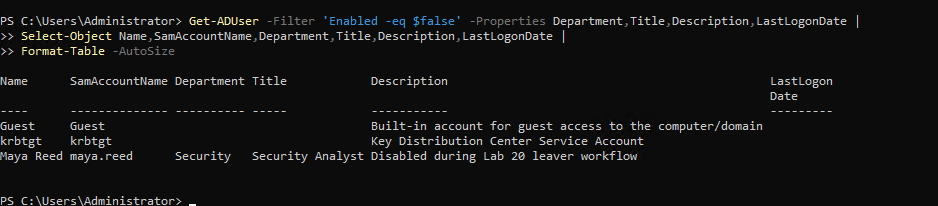
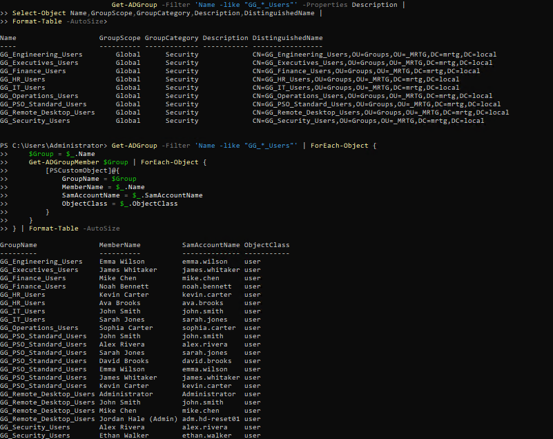
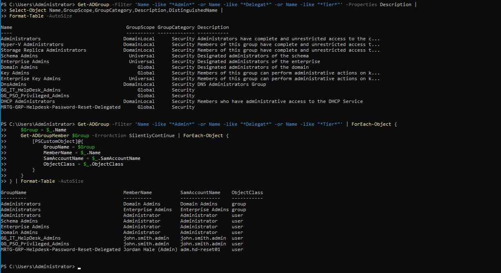
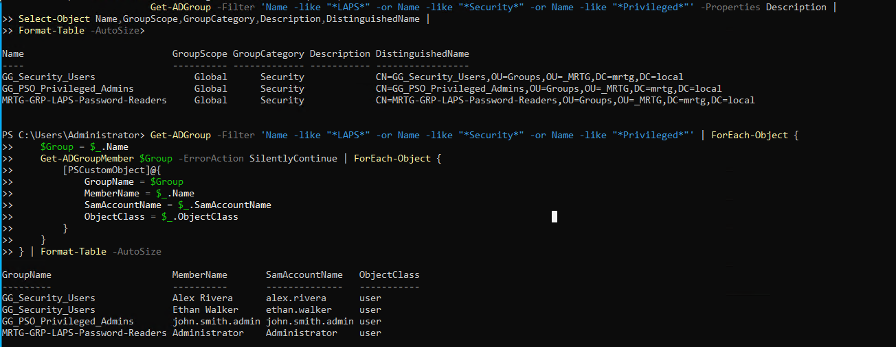
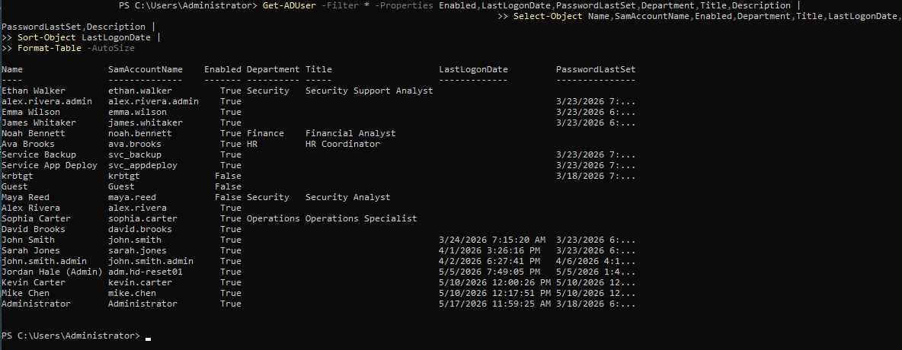
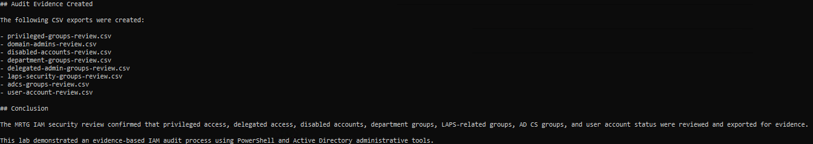
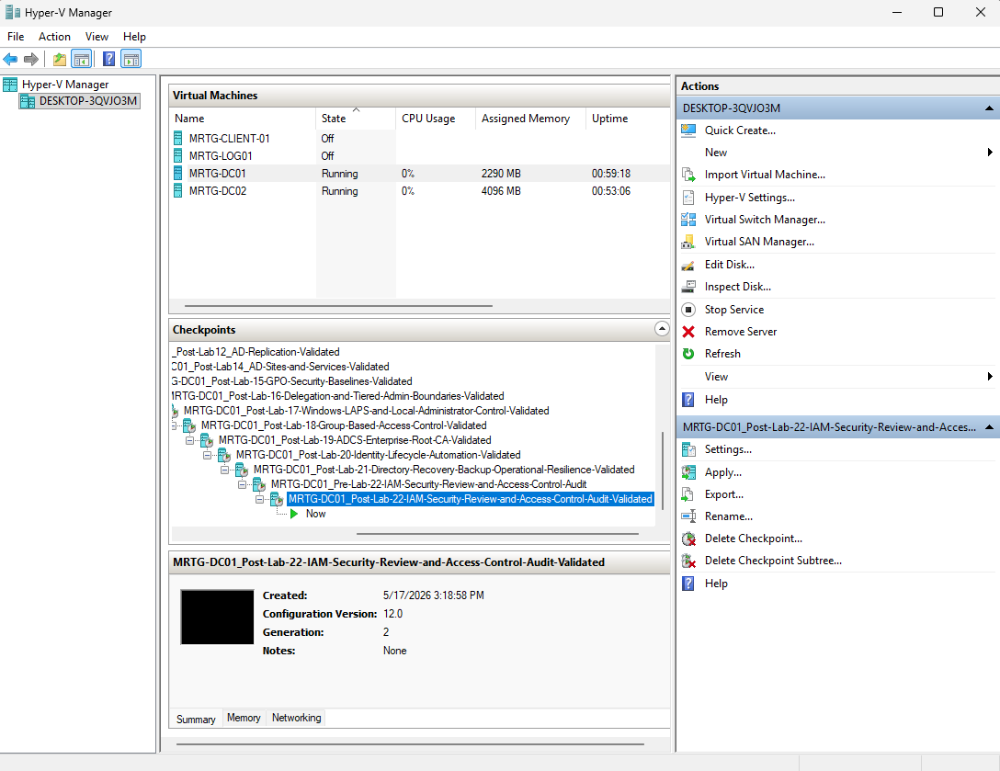

# Lab 22: IAM Security Review and Access Control Audit


---

## Objective

Perform an evidence-based IAM security review of the `mrtg.local` Active Directory environment.

This lab reviews privileged groups, Domain Admins, disabled accounts, department access groups, delegated administrative groups, LAPS password readers, certificate-related groups, and the broader user-account inventory.

The goal is to document the observed identity state and prepare findings for owner validation and remediation.

---

## Business Scenario

Monroe Redstone Technology Group requires a repeatable method for reviewing identity access after multiple rounds of configuration, delegation, lifecycle activity, endpoint management, and certificate-service deployment.

Configuration does not prove that access remains appropriate.

Potential risks include:

- Privileged groups accumulating unnecessary members
- Disabled accounts retaining access
- Movers retaining previous department access
- Delegated roles expanding beyond their intended scope
- Service accounts lacking ownership
- Administrative accounts remaining active without review
- Sensitive password-reader roles receiving unnecessary membership

This lab collects evidence and documents findings without changing access during the review.

---

## Lab Summary

In this lab, I created a dedicated audit workspace and validated domain-controller health before collecting access evidence.

The review covered:

- Privileged groups
- Domain Admins
- Disabled accounts
- Department groups
- Delegated administrative groups
- LAPS and security-related groups
- AD CS-related groups
- User-account status and purpose indicators

The review confirmed that the Lab 20 Mover and Leaver results remained visible in Active Directory.

It also identified standing privileged membership and redundant LAPS-reader membership that would require policy and owner review in a production environment.

Eight CSV files and a written IAM security review summary were created.

No remediation was performed because observed directory state does not independently prove whether access is approved or unauthorized.

---

## Environment

| Component | Details |
|---|---|
| Organization | Monroe Redstone Technology Group |
| Domain | `mrtg.local` |
| Original Domain Controller | `MRTG-DC01` |
| Additional Domain Controller | `MRTG-DC02` |
| Active Directory Site | `MRTG-HQ-Site` |
| Lab Root | `C:\MRTG-Labs\Lab-22-IAM-Security-Review-and-Access-Control-Audit` |
| Output Folder | `output` |
| Reports Folder | `reports` |
| Scripts Folder | `scripts` |
| Evidence Folder | `evidence` |
| Tools | PowerShell, Active Directory module, `dcdiag`, and `repadmin` |
| Hypervisor | Hyper-V |

---

## Prerequisites

- Operational `mrtg.local` domain
- Healthy domain-controller replication
- Active Directory PowerShell module
- Administrative read access
- Documented high-risk groups
- Defined inactivity criteria for a production stale-account review
- Approved storage location for sensitive audit evidence
- Business and technical owners for production access certification

---

## Scope

### Included

- Temporary Hyper-V checkpoints
- Audit workspace creation
- Domain-health validation
- Replication-health validation
- Selected privileged-group review
- Domain Admins review
- Disabled-account review
- Department-group review
- Delegated-administration review
- LAPS and security-group review
- AD CS group-name review
- User-account inventory review
- CSV evidence export
- Written review summary

### Not Included

- Access remediation
- Business-owner certification
- HR-record comparison
- Ticket and approval comparison
- Recursive review of every effective permission
- Complete privileged-group inventory
- OU delegation ACL analysis
- GPO delegation analysis
- Certificate-template permission analysis
- CA security ACL analysis
- File-system or application permissions
- Cloud permissions
- Formal stale-account determination
- GRC platform integration

---

## Review Workflow

```text
Validate Directory Health
          |
          v
Collect Privileged Access Evidence
          |
          v
Review Standard and Delegated Access
          |
          v
Review Disabled and Special Accounts
          |
          v
Export Structured Evidence
          |
          v
Document Findings
          |
          v
Obtain Owner Certification
          |
          v
Track Remediation
```

Owner certification and remediation were outside this lab's scope.

---

## Audit Areas

| Area | Purpose |
|---|---|
| Directory Health | Confirm evidence is collected from a healthy replicated directory |
| Privileged Groups | Identify selected high-risk memberships |
| Domain Admins | Review broad domain-level administrative access |
| Disabled Accounts | Identify disabled built-in and lifecycle accounts |
| Department Groups | Review business-aligned access membership |
| Delegated Groups | Review task-specific administrative roles |
| LAPS Groups | Review access to managed local administrator passwords |
| AD CS Groups | Identify certificate-service-related group membership |
| User Inventory | Categorize standard, privileged, service, and disabled accounts |
| Evidence Exports | Preserve point-in-time review data |
| Summary Report | Document findings, limitations, and conclusions |

---

## Implementation and Validation

### 1. Created a Pre-Review Lab Checkpoint

Checkpoint name:

```text
MRTG-DC01_Pre-Lab-22-IAM-Security-Review-and-Access-Control-Audit
```


The checkpoint was a temporary lab tool and was not part of the audit evidence or backup strategy.

---

### 2. Created the Audit Workspace

```text
C:\MRTG-Labs\Lab-22-IAM-Security-Review-and-Access-Control-Audit
|-- evidence
|-- output
|-- reports
`-- scripts
```


Audit exports contain sensitive identity and privileged-access information and should be protected accordingly.

---

### 3. Validated Directory Health

Commands used:

```cmd
dcdiag /s:MRTG-DC01 /test:Advertising /test:Services /test:Replications /test:KnowsOfRoleHolders
repadmin /replsummary
```


Validated results included:

```text
MRTG-DC01 replication failures: 0 / 5
MRTG-DC02 replication failures: 0 / 5
```

Health validation confirmed that replication was operating at the time of evidence collection. It did not validate the business appropriateness of access.

---

## Privileged Access Review

### 4. Reviewed Selected Privileged Groups

Groups reviewed:

```text
Domain Admins
Enterprise Admins
Schema Admins
Administrators
Account Operators
Server Operators
Backup Operators
Print Operators
```

Command used:

```powershell
$PrivilegedGroups = @(
    "Domain Admins",
    "Enterprise Admins",
    "Schema Admins",
    "Administrators",
    "Account Operators",
    "Server Operators",
    "Backup Operators",
    "Print Operators"
)

$PrivilegedGroups | ForEach-Object {
    $GroupName = $_

    Get-ADGroupMember -Identity $GroupName -Recursive | ForEach-Object {
        [PSCustomObject]@{
            GroupName      = $GroupName
            MemberName     = $_.Name
            SamAccountName = $_.SamAccountName
            ObjectClass    = $_.ObjectClass
        }
    }
} | Format-Table -AutoSize
```


Observed effective leaf membership included:

| Group | Returned Member |
|---|---|
| Domain Admins | Administrator |
| Enterprise Admins | Administrator |
| Schema Admins | Administrator |
| Administrators | Administrator |

The `-Recursive` switch expands nested membership and may hide the intermediate group path. A complete audit should collect both direct membership and recursive effective membership.

This was a selected privileged-group review, not an exhaustive privilege analysis.

---

### 5. Reviewed Domain Admins

Command used:

```powershell
Get-ADGroupMember "Domain Admins" -Recursive |
    Select-Object Name, SamAccountName, ObjectClass |
    Format-Table -AutoSize
```


Observed result:

```text
Domain Admins -> Administrator
```

No standard workforce account appeared in the output.

The built-in Administrator account remains highly privileged and should still be protected, monitored, and reserved for approved administrative use.

---

## Account Status Review

### 6. Reviewed Disabled Accounts

Command used:

```powershell
Get-ADUser -Filter 'Enabled -eq $false' `
    -Properties Department, Title, Description, LastLogonDate |
    Select-Object Name, SamAccountName, Department, Title, Description, LastLogonDate |
    Format-Table -AutoSize
```



| Account | Review Note |
|---|---|
| Guest | Built-in account expected to remain disabled |
| krbtgt | Built-in Kerberos service account expected to report disabled |
| maya.reed | Disabled through the Lab 20 Leaver workflow |

`maya.reed` remained disabled.

Disabled status does not prove that all group memberships, sessions, application access, certificates, or data ownership were remediated.

---

## Access Group Review

### 7. Reviewed Department Groups

Commands used:

```powershell
Get-ADGroup -Filter 'Name -like "GG_*_Users"' -Properties Description |
    Select-Object Name, GroupScope, GroupCategory, Description, DistinguishedName |
    Format-Table -AutoSize
```

```powershell
Get-ADGroup -Filter 'Name -like "GG_*_Users"' | ForEach-Object {
    $GroupName = $_.Name

    Get-ADGroupMember $GroupName | ForEach-Object {
        [PSCustomObject]@{
            GroupName      = $GroupName
            MemberName     = $_.Name
            SamAccountName = $_.SamAccountName
            ObjectClass    = $_.ObjectClass
        }
    }
} | Format-Table -AutoSize
```



Observed lifecycle results:

```text
ethan.walker appeared in GG_Security_Users
maya.reed did not appear in GG_Security_Users
```

This confirmed that the tested Mover and Leaver department-group changes remained visible.

It did not prove that every direct, nested, file, application, or cloud entitlement was removed.

---

### 8. Reviewed Delegated Administrative Groups

Commands used:

```powershell
Get-ADGroup -Filter 'Name -like "*Admin*" -or Name -like "*Delegat*" -or Name -like "*Tier*"' `
    -Properties Description |
    Select-Object Name, GroupScope, GroupCategory, Description, DistinguishedName |
    Format-Table -AutoSize
```

```powershell
Get-ADGroup -Filter 'Name -like "*Admin*" -or Name -like "*Delegat*" -or Name -like "*Tier*"' |
    ForEach-Object {
        $GroupName = $_.Name

        Get-ADGroupMember $GroupName -ErrorAction SilentlyContinue |
            ForEach-Object {
                [PSCustomObject]@{
                    GroupName      = $GroupName
                    MemberName     = $_.Name
                    SamAccountName = $_.SamAccountName
                    ObjectClass    = $_.ObjectClass
                }
            }
    } | Format-Table -AutoSize
```



| Group | Observed Member |
|---|---|
| `GG_IT_HelpDesk_Admins` | `john.smith.admin` |
| `GG_PSO_Privileged_Admins` | `john.smith.admin` |
| `MRTG-GRP-Helpdesk-Password-Reset-Delegated` | `adm.hd-reset01` |

The separation from Domain Admins supports least privilege, but group membership alone does not prove that the underlying delegated ACL remains correctly scoped.

---

### 9. Reviewed LAPS and Security Groups

Commands used:

```powershell
Get-ADGroup -Filter 'Name -like "*LAPS*" -or Name -like "*Security*" -or Name -like "*Privileged*"' `
    -Properties Description |
    Select-Object Name, GroupScope, GroupCategory, Description, DistinguishedName |
    Format-Table -AutoSize
```

```powershell
Get-ADGroup -Filter 'Name -like "*LAPS*" -or Name -like "*Security*" -or Name -like "*Privileged*"' |
    ForEach-Object {
        $GroupName = $_.Name

        Get-ADGroupMember $GroupName -ErrorAction SilentlyContinue |
            ForEach-Object {
                [PSCustomObject]@{
                    GroupName      = $GroupName
                    MemberName     = $_.Name
                    SamAccountName = $_.SamAccountName
                    ObjectClass    = $_.ObjectClass
                }
            }
    } | Format-Table -AutoSize
```



| Group | Observed Members |
|---|---|
| `GG_Security_Users` | Alex Rivera and Ethan Walker |
| `GG_PSO_Privileged_Admins` | `john.smith.admin` |
| `MRTG-GRP-LAPS-Password-Readers` | Administrator |

The LAPS readers membership was redundant for the built-in Administrator account because that account already held broad privilege. A production review should determine whether this membership is necessary and replace it with approved named reader accounts.

---

### 10. Reviewed AD CS-Related Groups

Commands used:

```powershell
Get-ADGroup -Filter 'Name -like "*Cert*" -or Name -like "*CA*" -or Name -like "*PKI*"' `
    -Properties Description |
    Select-Object Name, GroupScope, GroupCategory, Description, DistinguishedName |
    Format-Table -AutoSize
```

```powershell
Get-ADGroup -Filter 'Name -like "*Cert*" -or Name -like "*CA*" -or Name -like "*PKI*"' |
    ForEach-Object {
        $GroupName = $_.Name

        Get-ADGroupMember $GroupName -ErrorAction SilentlyContinue |
            ForEach-Object {
                [PSCustomObject]@{
                    GroupName      = $GroupName
                    MemberName     = $_.Name
                    SamAccountName = $_.SamAccountName
                    ObjectClass    = $_.ObjectClass
                }
            }
    } | Format-Table -AutoSize
```


Observed groups included:

```text
Certificate Service DCOM Access
Cert Publishers
```

Observed membership:

```text
Cert Publishers -> MRTG-DC01
```

This was consistent with `MRTG-DC01` hosting AD CS.

A group-name search does not review CA security permissions, certificate-template ACLs, enrollment rights, or dangerous template settings.

---

## User Account Review

### 11. Reviewed User Accounts

Command used:

```powershell
Get-ADUser -Filter * `
    -Properties Enabled, LastLogonDate, PasswordLastSet, Department, Title, Description |
    Select-Object Name, SamAccountName, Enabled, Department, Title,
        LastLogonDate, PasswordLastSet, Description |
    Sort-Object LastLogonDate |
    Format-Table -AutoSize
```



Account categories identified included:

```text
Disabled accounts:
- krbtgt
- Guest
- maya.reed

Service accounts:
- svc_backup
- svc_appdeploy

Administrative accounts:
- alex.rivera.admin
- john.smith.admin
- adm.hd-reset01

Lab-created standard users:
- ava.brooks
- noah.bennett
- ethan.walker
- sophia.carter
```

`LastLogonDate` is replicated and approximate. Null or old values do not independently prove that an account is stale.

A formal stale-account finding requires an approved inactivity threshold, authoritative ownership data, and review of other logon evidence.

---

## Audit Evidence

### 12. Exported the Audit Data

Created files:

```text
adcs-groups-review.csv
delegated-admin-groups-review.csv
department-groups-review.csv
disabled-accounts-review.csv
domain-admins-review.csv
laps-security-groups-review.csv
privileged-groups-review.csv
user-account-review.csv
```


The CSV files preserve point-in-time evidence but remain mutable files. Production evidence should be stored in a protected location with access control, retention, timestamps, and integrity safeguards.

---

### 13. Created the IAM Security Review Summary

Report:

```text
C:\MRTG-Labs\Lab-22-IAM-Security-Review-and-Access-Control-Audit\reports\MRTG-IAM-Security-Review-Summary.md
```



The report documented:

- Directory-health validation
- Privileged-access observations
- Disabled-account review
- Department-group review
- Delegated-administration review
- LAPS-reader review
- AD CS group review
- Evidence files
- Review limitations
- Findings requiring owner validation

---

### 14. Created the Final Lab Checkpoint

Checkpoint name:

```text
MRTG-DC01_Post-Lab-22-IAM-Security-Review-and-Access-Control-Audit-Validated
```



The checkpoint was a temporary lab recovery point and was not part of the audit trail.

---

## Key Findings

| Area | Observation | Assessment |
|---|---|---|
| Directory health | Replication reported zero failures at collection time | Evidence collected from a healthy replicated state |
| Domain Admins | Built-in Administrator was the only returned leaf member | No standard workforce account observed |
| Enterprise Admins | Built-in Administrator remained present | Standing forest-level privilege requires protection and review |
| Schema Admins | Built-in Administrator remained present | Production membership should normally be empty outside approved schema work |
| Disabled accounts | Guest, krbtgt, and Maya Reed reported disabled | Expected states observed, but full entitlement cleanup was not proven |
| Mover validation | Ethan Walker appeared in `GG_Security_Users` | Tested Mover result remained present |
| Leaver validation | Maya Reed did not appear in `GG_Security_Users` | Tested department access remained removed |
| Delegated administration | Named admin accounts used task-specific groups | Supports least privilege, subject to ACL review |
| LAPS readers | Administrator appeared in the readers group | Redundant broad-privilege membership should be reviewed |
| AD CS | `MRTG-DC01` appeared in Cert Publishers | Consistent with the lab CA role |
| User inventory | Standard, service, administrative, and disabled accounts were distinguishable | Ownership and inactivity require authoritative review |

No finding was remediated during this lab.

---

## Validation Results

| Validation Item | Result |
|---|---|
| Temporary pre-review checkpoint created | Passed |
| Audit workspace created | Passed |
| Directory health reviewed | Passed |
| Replication reported zero failures | Passed |
| Selected privileged groups reviewed | Passed |
| Domain Admins reviewed | Passed |
| Disabled accounts reviewed | Passed |
| Department groups reviewed | Passed |
| Delegated administrative groups reviewed | Passed |
| LAPS and security groups reviewed | Passed |
| AD CS-related groups reviewed | Passed |
| User-account inventory reviewed | Passed |
| Eight CSV files created | Passed |
| Written review summary created | Passed |
| Business-owner certification | Not performed |
| Delegated ACL review | Not performed |
| Certificate-template ACL review | Not performed |
| Remediation | Not performed |
| Temporary final checkpoint created | Passed |

---

## Security and IAM Relevance

Regular access review is a core IAM responsibility.

This lab supports:

- Privileged-access review
- Disabled-account governance
- Department access review
- Delegated-role review
- LAPS-reader governance
- Service-account visibility
- Certificate-service access awareness
- Evidence collection
- Finding documentation
- Separation between review and remediation

Directory evidence shows what exists. Business records and owners determine whether that access is justified.

---

## Risks Identified

The review identified or highlighted risks involving:

- Standing forest-level administrative membership
- Standing Schema Admins membership
- Redundant broad-privilege membership in LAPS readers
- Disabled accounts that may retain unreviewed entitlements
- Service accounts requiring documented ownership
- Delegated groups requiring ACL verification
- Certificate services requiring deeper template review
- Mutable local audit evidence
- Stale-account conclusions without authoritative thresholds

These observations require validation before production remediation.

---

## Control Mapping

| Control Area | Lab Contribution |
|---|---|
| Privileged Access Review | Reviews selected high-risk groups |
| Account Governance | Reviews disabled and special-purpose accounts |
| Lifecycle Validation | Confirms tested Mover and Leaver states |
| Delegated Administration | Reviews task-specific administrative groups |
| Credential Governance | Reviews LAPS password-reader membership |
| PKI Governance | Reviews selected AD CS-related groups |
| Evidence Management | Exports structured review data |
| Finding Management | Creates a written security summary |
| Separation of Duties | Separates evidence collection from remediation |

---

## Evidence Collected

| Evidence | Screenshot |
|---|---|
| Pre-review checkpoint | `screenshots/lab-22-01-pre-lab-22-checkpoint.png` |
| Audit workspace | `screenshots/lab-22-02-folder-structure-created.png` |
| Directory-health validation | `screenshots/lab-22-03-domain-health-pre-audit-validated.png` |
| Privileged-group review | `screenshots/lab-22-04-privileged-groups-reviewed.png` |
| Domain Admins review | `screenshots/lab-22-05-domain-admins-membership-reviewed.png` |
| Disabled-account review | `screenshots/lab-22-06-disabled-accounts-reviewed.png` |
| Department-group review | `screenshots/lab-22-07-department-groups-reviewed.png` |
| Delegated-administration review | `screenshots/lab-22-08-delegated-admin-groups-reviewed.png` |
| LAPS and security-group review | `screenshots/lab-22-09-laps-and-security-groups-reviewed.png` |
| AD CS group review | `screenshots/lab-22-10-adcs-related-groups-reviewed.png` |
| User-account review | `screenshots/lab-22-11-stale-or-unusual-accounts-reviewed.png` |
| CSV audit exports | `screenshots/lab-22-12-audit-exports-created.png` |
| IAM security review summary | `screenshots/lab-22-13-iam-security-review-summary-created.png` |
| Final lab checkpoint | `screenshots/lab-22-14-post-lab-22-checkpoint.png` |

---

## What I Would Improve in Production

In a production environment, I would:

- Define business and technical owners for every access group
- Establish quarterly or risk-based access certification
- Compare membership against approved requests and HR records
- Collect both direct and recursive group membership
- Expand the privileged-group inventory
- Review nested effective privilege
- Review delegated OU and GPO permissions
- Review certificate-template security and enrollment rights
- Review CA administrative permissions
- Define stale-account thresholds
- Correlate multiple logon attributes and security events
- Document service-account owners and dependencies
- Review credential rotation and interactive-logon restrictions
- Confirm disabled users have all access removed
- Track findings with owners, risk ratings, and deadlines
- Store evidence in protected centralized storage
- Add integrity verification and retention controls
- Alert on privileged-group changes
- Separate reviewer, approver, and remediator roles
- Remove unnecessary Schema Admins membership after approved work
- Replace redundant LAPS-reader membership with approved named readers

---

## Lessons Learned

This lab reinforced that access review is different from access configuration.

Active Directory can show account state and group membership, but it cannot prove business approval, employment status, ownership, or continuing need.

The main technical lesson was that recursive group queries show effective leaf members but may hide the path through nested groups. Both direct and recursive evidence are valuable.

The main governance lesson was that audit findings should be validated before remediation. Evidence collection, owner certification, risk acceptance, and access removal are separate steps.

---

## Outcome

Lab 22 successfully completed an evidence-based IAM security review of the MRTG Active Directory environment.

The lab confirmed that:

- Directory health was reviewed before evidence collection
- Selected privileged groups were inventoried
- Domain Admins membership was reviewed
- Disabled accounts were documented
- Department Mover and Leaver results remained visible
- Delegated administrative groups were reviewed
- LAPS-reader membership was identified
- AD CS-related groups were reviewed
- User accounts were categorized
- Eight CSV evidence files were created
- A written IAM security review summary was produced
- Review limitations and potential findings were documented

The resulting package supports further business-owner certification, risk review, and remediation planning.

---

## Next Lab

[Lab 23: IAM Runbooks, SOPs, and Operational Handoff](../Lab-23-IAM-Runbooks-SOPs-Operational-Handoff/)

Lab 23 creates operational procedures and handoff documentation for routine IAM administration and recovery activities.
