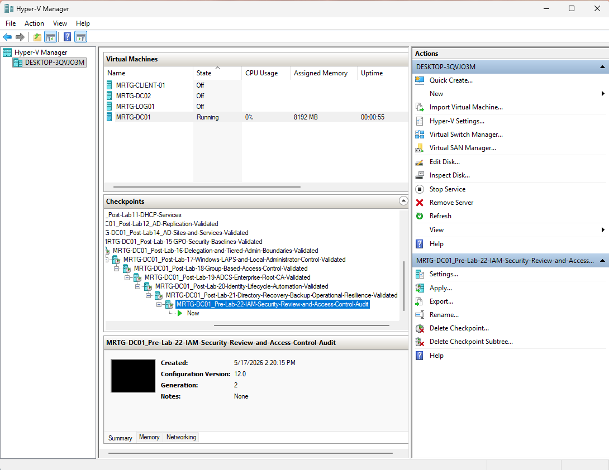
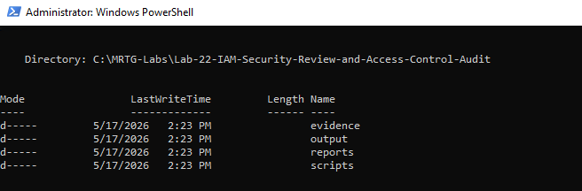
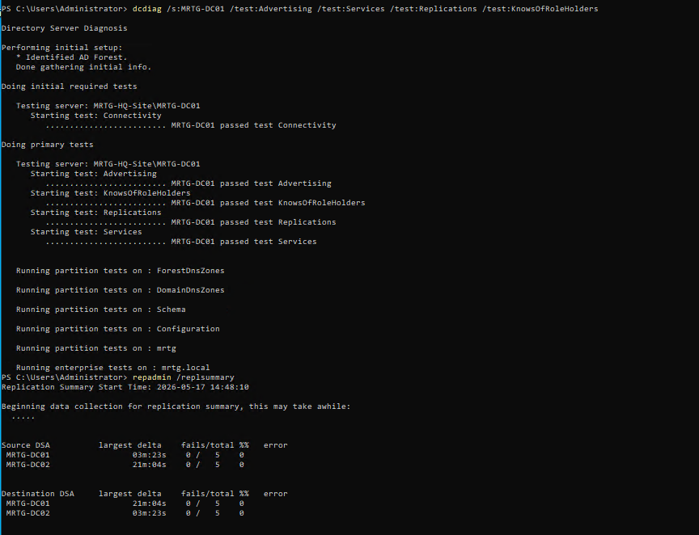
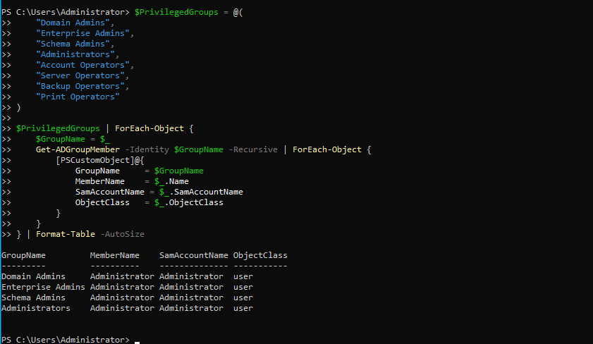
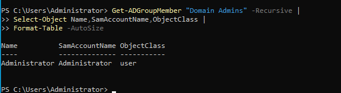
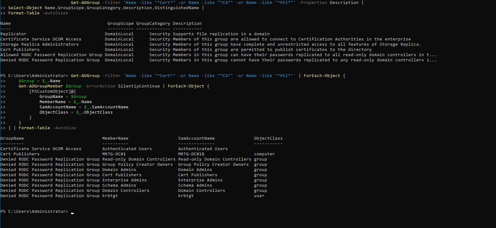
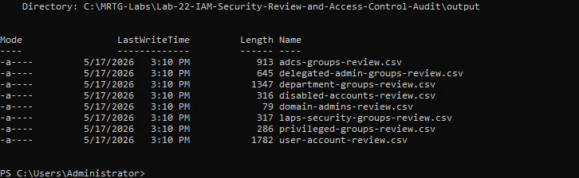

# Lab-22 — IAM Security Review and Access Control Audit


## Objective

The objective of this lab was to perform an IAM security review and access control audit in the MRTG enterprise Active Directory environment.

This lab focused on reviewing privileged access, Domain Admins membership, disabled accounts, department-based access groups, delegated admin groups, LAPS-related groups, AD CS-related groups, and stale or unusual accounts.

The goal was to move beyond configuration and demonstrate evidence-based IAM auditing using PowerShell and Active Directory administrative tools.

## Scope

This lab included:

- Creating a pre-lab Hyper-V checkpoint
- Creating a dedicated Lab 22 folder structure
- Validating domain health before starting the audit
- Reviewing privileged group membership
- Reviewing Domain Admins membership
- Reviewing disabled accounts
- Reviewing department-based access groups
- Reviewing delegated admin groups
- Reviewing LAPS and security-related groups
- Reviewing AD CS and certificate-related groups
- Reviewing stale or unusual accounts
- Exporting audit evidence to CSV files
- Creating an IAM security review summary
- Creating a post-lab Hyper-V checkpoint

## Environment

| Component | Details |
|---|---|
| Domain | `mrtg.local` |
| Primary Domain Controller | `MRTG-DC01` |
| Additional Domain Controller | `MRTG-DC02` |
| Site | `MRTG-HQ-Site` |
| Lab Root Path | `C:\MRTG-Labs\Lab-22-IAM-Security-Review-and-Access-Control-Audit` |
| Output Path | `C:\MRTG-Labs\Lab-22-IAM-Security-Review-and-Access-Control-Audit\output` |
| Reports Path | `C:\MRTG-Labs\Lab-22-IAM-Security-Review-and-Access-Control-Audit\reports` |
| Scripts Path | `C:\MRTG-Labs\Lab-22-IAM-Security-Review-and-Access-Control-Audit\scripts` |
| Evidence Path | `C:\MRTG-Labs\Lab-22-IAM-Security-Review-and-Access-Control-Audit\evidence` |
| Tools Used | PowerShell, Active Directory Module, DCDIAG, REPADMIN |

## Scenario

Monroe Redstone Technology Group has built an enterprise-style Active Directory environment with organizational units, users, groups, Group Policy, delegation, LAPS, AD CS, and identity lifecycle automation.

After building and backing up the environment, the next step was to review it from an IAM security and access control perspective.

The security review model used in this lab was:

```text
Validate Health → Review Privileged Access → Review Standard Access → Review Disabled Accounts → Export Evidence → Create Summary
```

This lab did not make access changes. It focused on reviewing the current identity state and producing audit evidence.

## Audit Design

The audit reviewed key identity and access control areas.

| Audit Area | Purpose |
|---|---|
| Domain Health | Confirm the directory was healthy before auditing access |
| Privileged Groups | Identify users or groups with elevated access |
| Domain Admins | Review the most sensitive day-to-day privileged group |
| Disabled Accounts | Confirm offboarded or built-in disabled accounts |
| Department Groups | Review business access groups |
| Delegated Admin Groups | Review least-privilege administrative delegation |
| LAPS and Security Groups | Review privileged endpoint and password-reader access |
| AD CS Groups | Review certificate and PKI-related access |
| User Account Review | Identify stale, service, admin, disabled, or unusual accounts |
| Audit Exports | Preserve review evidence in CSV format |
| Summary Report | Document findings and conclusions |

## Implementation Steps

### 1. Created Pre-Lab Checkpoint

A Hyper-V checkpoint was created before beginning the IAM security review.

Checkpoint name:

```text
MRTG-DC01_Pre-Lab-22-IAM-Security-Review-and-Access-Control-Audit
```



### 2. Created Lab 22 Folder Structure

A dedicated Lab 22 workspace was created on `MRTG-DC01`.

Folder structure:

```text
C:\MRTG-Labs\Lab-22-IAM-Security-Review-and-Access-Control-Audit
├── evidence
├── output
├── reports
└── scripts
```



## Pre-Audit Health Validation

### 3. Validated Domain Health Before Audit

Before reviewing access, domain controller health and replication were validated.

Commands used:

```powershell
dcdiag /s:MRTG-DC01 /test:Advertising /test:Services /test:Replications /test:KnowsOfRoleHolders
repadmin /replsummary
```

Validation confirmed:

```text
DCDIAG passed:
- Connectivity
- Advertising
- KnowsOfRoleHolders
- Replications
- Services

REPADMIN passed:
- MRTG-DC01 failures: 0 / 5
- MRTG-DC02 failures: 0 / 5
```



## Privileged Access Review

### 4. Reviewed Privileged Groups

Privileged groups were reviewed to identify accounts or nested groups with elevated access.

Groups reviewed included:

```text
Domain Admins
Enterprise Admins
Schema Admins
Administrators
Account Operators
Server Operators
Backup Operators
Print Operators
```

Command used:

```powershell
$PrivilegedGroups = @(
    "Domain Admins",
    "Enterprise Admins",
    "Schema Admins",
    "Administrators",
    "Account Operators",
    "Server Operators",
    "Backup Operators",
    "Print Operators"
)

$PrivilegedGroups | ForEach-Object {
    $GroupName = $_
    Get-ADGroupMember -Identity $GroupName -Recursive | ForEach-Object {
        [PSCustomObject]@{
            GroupName      = $GroupName
            MemberName     = $_.Name
            SamAccountName = $_.SamAccountName
            ObjectClass    = $_.ObjectClass
        }
    }
} | Format-Table -AutoSize
```

Observed privileged membership included:

| Group | Member |
|---|---|
| Domain Admins | Administrator |
| Enterprise Admins | Administrator |
| Schema Admins | Administrator |
| Administrators | Administrator |



### 5. Reviewed Domain Admins Membership

Domain Admins membership was reviewed separately because it is one of the most sensitive groups in an Active Directory environment.

Command used:

```powershell
Get-ADGroupMember "Domain Admins" -Recursive |
Select-Object Name,SamAccountName,ObjectClass |
Format-Table -AutoSize
```

Validation confirmed:

```text
Domain Admins → Administrator
```

No unexpected standard user accounts were observed in the Domain Admins group.



## Account Status Review

### 6. Reviewed Disabled Accounts

Disabled accounts were reviewed to confirm expected disabled accounts and identify offboarded users.

Command used:

```powershell
Get-ADUser -Filter 'Enabled -eq $false' -Properties Department,Title,Description,LastLogonDate |
Select-Object Name,SamAccountName,Department,Title,Description,LastLogonDate |
Format-Table -AutoSize
```

Disabled accounts reviewed:

| Account | Purpose / Finding |
|---|---|
| Guest | Built-in disabled guest account |
| krbtgt | Built-in Key Distribution Center service account |
| maya.reed | Disabled during Lab 20 leaver workflow |

The `maya.reed` account remained disabled and documented from the Lab 20 offboarding workflow.


## Access Group Review

### 7. Reviewed Department Groups

Department-based access groups were reviewed to confirm business access group structure and membership.

Commands used:

```powershell
Get-ADGroup -Filter 'Name -like "GG_*_Users"' -Properties Description |
Select-Object Name,GroupScope,GroupCategory,Description,DistinguishedName |
Format-Table -AutoSize
```

```powershell
Get-ADGroup -Filter 'Name -like "GG_*_Users"' | ForEach-Object {
    $Group = $_.Name
    Get-ADGroupMember $Group | ForEach-Object {
        [PSCustomObject]@{
            GroupName      = $Group
            MemberName     = $_.Name
            SamAccountName = $_.SamAccountName
            ObjectClass    = $_.ObjectClass
        }
    }
} | Format-Table -AutoSize
```

The review confirmed that department groups existed and had assigned members.

Important findings:

```text
ethan.walker was assigned to GG_Security_Users.
maya.reed was not listed in GG_Security_Users.
```

This confirmed that Lab 20 mover and leaver workflows were reflected in the current access state.


### 8. Reviewed Delegated Admin Groups

Admin and delegation-related groups were reviewed to identify delegated administrative access.

Commands used:

```powershell
Get-ADGroup -Filter 'Name -like "*Admin*" -or Name -like "*Delegat*" -or Name -like "*Tier*"' -Properties Description |
Select-Object Name,GroupScope,GroupCategory,Description,DistinguishedName |
Format-Table -AutoSize
```

```powershell
Get-ADGroup -Filter 'Name -like "*Admin*" -or Name -like "*Delegat*" -or Name -like "*Tier*"' | ForEach-Object {
    $Group = $_.Name
    Get-ADGroupMember $Group -ErrorAction SilentlyContinue | ForEach-Object {
        [PSCustomObject]@{
            GroupName      = $Group
            MemberName     = $_.Name
            SamAccountName = $_.SamAccountName
            ObjectClass    = $_.ObjectClass
        }
    }
} | Format-Table -AutoSize
```

Observed delegated/admin-related access included:

| Group | Member |
|---|---|
| `GG_IT_HelpDesk_Admins` | `john.smith.admin` |
| `GG_PSO_Privileged_Admins` | `john.smith.admin` |
| `MRTG-GRP-Helpdesk-Password-Reset-Delegated` | `adm.hd-reset01` |

This supports least privilege by separating delegated admin access from broad Domain Admins membership.


### 9. Reviewed LAPS and Security Groups

LAPS and security-related groups were reviewed.

Commands used:

```powershell
Get-ADGroup -Filter 'Name -like "*LAPS*" -or Name -like "*Security*" -or Name -like "*Privileged*"' -Properties Description |
Select-Object Name,GroupScope,GroupCategory,Description,DistinguishedName |
Format-Table -AutoSize
```

```powershell
Get-ADGroup -Filter 'Name -like "*LAPS*" -or Name -like "*Security*" -or Name -like "*Privileged*"' | ForEach-Object {
    $Group = $_.Name
    Get-ADGroupMember $Group -ErrorAction SilentlyContinue | ForEach-Object {
        [PSCustomObject]@{
            GroupName      = $Group
            MemberName     = $_.Name
            SamAccountName = $_.SamAccountName
            ObjectClass    = $_.ObjectClass
        }
    }
} | Format-Table -AutoSize
```

Observed groups included:

| Group | Member(s) |
|---|---|
| `GG_Security_Users` | Alex Rivera, Ethan Walker |
| `GG_PSO_Privileged_Admins` | `john.smith.admin` |
| `MRTG-GRP-LAPS-Password-Readers` | Administrator |


### 10. Reviewed AD CS Related Groups

Certificate and PKI-related groups were reviewed after the AD CS deployment from Lab 19.

Commands used:

```powershell
Get-ADGroup -Filter 'Name -like "*Cert*" -or Name -like "*CA*" -or Name -like "*PKI*"' -Properties Description |
Select-Object Name,GroupScope,GroupCategory,Description,DistinguishedName |
Format-Table -AutoSize
```

```powershell
Get-ADGroup -Filter 'Name -like "*Cert*" -or Name -like "*CA*" -or Name -like "*PKI*"' | ForEach-Object {
    $Group = $_.Name
    Get-ADGroupMember $Group -ErrorAction SilentlyContinue | ForEach-Object {
        [PSCustomObject]@{
            GroupName      = $Group
            MemberName     = $_.Name
            SamAccountName = $_.SamAccountName
            ObjectClass    = $_.ObjectClass
        }
    }
} | Format-Table -AutoSize
```

Observed certificate-related groups included:

```text
Certificate Service DCOM Access
Cert Publishers
```

Key finding:

```text
Cert Publishers → MRTG-DC01
```

This aligns with `MRTG-DC01` hosting the AD CS role from Lab 19.



## User Account Review

### 11. Reviewed Stale or Unusual Accounts

User accounts were reviewed for status, department/title fields, logon activity, password timestamps, and account purpose indicators.

Command used:

```powershell
Get-ADUser -Filter * -Properties Enabled,LastLogonDate,PasswordLastSet,Department,Title,Description |
Select-Object Name,SamAccountName,Enabled,Department,Title,LastLogonDate,PasswordLastSet,Description |
Sort-Object LastLogonDate |
Format-Table -AutoSize
```

The review identified several account categories:

```text
Disabled accounts:
- krbtgt
- Guest
- maya.reed

Service accounts:
- svc_backup
- svc_appdeploy

Admin accounts:
- alex.rivera.admin
- john.smith.admin
- adm.hd-reset01

Lab-created users:
- ava.brooks
- noah.bennett
- ethan.walker
- sophia.carter
```


## Audit Evidence

### 12. Created Audit Exports

Audit evidence was exported to CSV files.

Exported files:

```text
adcs-groups-review.csv
delegated-admin-groups-review.csv
department-groups-review.csv
disabled-accounts-review.csv
domain-admins-review.csv
laps-security-groups-review.csv
privileged-groups-review.csv
user-account-review.csv
```



### 13. Created IAM Security Review Summary

An IAM security review summary was created to document the audit areas reviewed, key findings, evidence created, and conclusion.

Report file:

```text
C:\MRTG-Labs\Lab-22-IAM-Security-Review-and-Access-Control-Audit\reports\MRTG-IAM-Security-Review-Summary.md
```

The report documented:

- Domain health validation
- Privileged access findings
- Disabled account review
- Department group access review
- Delegated administration review
- LAPS and security group review
- AD CS group review
- Audit evidence created
- IAM security review conclusion


## Validation Summary

| Test | Expected Result | Actual Result | Status |
|---|---|---|---|
| Pre-lab checkpoint created | Checkpoint exists before Lab 22 changes | Pre-lab checkpoint created | Passed |
| Lab folder structure created | Required folders exist | Folder structure validated | Passed |
| Domain health validated | DCDIAG and replication checks pass | Health checks passed | Passed |
| Privileged groups reviewed | Elevated groups reviewed | Privileged memberships identified | Passed |
| Domain Admins reviewed | Domain Admins membership identified | Administrator only | Passed |
| Disabled accounts reviewed | Disabled accounts listed | Guest, krbtgt, and maya.reed reviewed | Passed |
| Department groups reviewed | Department access groups and members reviewed | Groups and members listed | Passed |
| Delegated admin groups reviewed | Delegated admin groups identified | Delegated admin members reviewed | Passed |
| LAPS/security groups reviewed | LAPS and security groups reviewed | Groups and members listed | Passed |
| AD CS groups reviewed | Certificate-related groups reviewed | Cert Publishers and related groups reviewed | Passed |
| Stale/unusual accounts reviewed | User accounts reviewed for status and purpose | Account categories identified | Passed |
| Audit exports created | CSV evidence files created | Eight CSV files exported | Passed |
| Security summary created | Markdown audit summary created | Report created | Passed |
| Post-lab checkpoint created | Checkpoint exists after validation | Post-lab checkpoint created | Passed |

## Post-Lab Checkpoint

A post-lab checkpoint was created after completing the IAM security review and access control audit.

Checkpoint name:

```text
MRTG-DC01_Post-Lab-22-IAM-Security-Review-and-Access-Control-Audit-Validated
```


## Outcome

Lab 22 successfully completed an IAM security review and access control audit in the MRTG enterprise Active Directory environment.

The audit confirmed that privileged access, Domain Admins membership, disabled accounts, department groups, delegated admin groups, LAPS/security groups, AD CS groups, and user account status were reviewed and exported for evidence.

The final result was an evidence-based IAM audit package that includes CSV exports and a written security review summary.

## Skills Demonstrated

- IAM security review
- Access control auditing
- Privileged group review
- Domain Admins review
- Disabled account review
- Department group membership review
- Delegated admin group review
- LAPS/security group review
- AD CS group review
- User account status review
- Active Directory PowerShell reporting
- CSV evidence export
- IAM audit documentation
- Security review summary creation
- Domain health validation before audit
- Replication health validation before audit

## Real-World Relevance

IAM security is not only about creating users and assigning access. It also requires regular review.

In enterprise and government-regulated environments, identity teams must be able to prove who has access, who has elevated rights, which accounts are disabled, which groups control sensitive permissions, and whether access aligns with policy.

This lab connects directly to real-world IAM and security operations:

- Reviewing privileged access
- Auditing Domain Admins membership
- Confirming offboarded users remain disabled
- Reviewing access groups after lifecycle changes
- Reviewing delegated admin boundaries
- Reviewing LAPS password-reader access
- Reviewing certificate-related access
- Producing evidence for audit and compliance
- Creating written security review summaries

The key lesson is that IAM work must be reviewable, documented, and evidence-based.

## Security Considerations

This lab reviewed the current access state but did not make access changes.

In a production environment, audit findings would typically be reviewed against policy, ticket history, business ownership, and approval records before changes are made.

Production-ready improvements would include:

- Comparing privileged access to an approved access baseline
- Identifying stale admin accounts
- Reviewing nested group membership
- Reviewing inactive users based on logon data
- Confirming disabled users are removed from access groups
- Reviewing service account ownership
- Reviewing admin account separation
- Reviewing certificate authority permissions
- Reviewing LAPS password reader eligibility
- Tracking findings in a formal risk register
- Opening remediation tickets for unauthorized access
- Creating recurring access review schedules
- Integrating evidence with SIEM or GRC tooling

## Lessons Learned

- IAM audits should begin with domain health validation.
- Privileged access should be reviewed separately from normal user access.
- Domain Admins membership should remain small and tightly controlled.
- Disabled accounts must still be reviewed because disabled does not always mean fully cleaned up.
- Department groups provide useful business-aligned access review points.
- Delegated admin groups support least privilege when properly controlled.
- LAPS/password-reader access should be reviewed as privileged access.
- AD CS-related groups matter because certificates affect trust and authentication.
- Audit evidence should be exported, not only viewed on screen.
- A written summary makes the audit easier to understand and hand off.

## What I Would Do Differently

In a production or government-regulated environment, I would expand this audit into a formal access review process.

A stronger production design would include:

- Defined access owners for each group
- Formal quarterly access reviews
- Baseline comparison against approved privileged access
- Review of nested group membership
- Review of service accounts and ownership
- Review of inactive accounts
- Review of privileged admin account usage
- Review of certificate template permissions
- Review of delegated OU permissions
- Separation between reviewer and approver
- Ticket references for access approvals
- Risk ratings for findings
- Remediation tracking
- Export to a centralized audit repository

For this lab, the goal was to demonstrate the core mechanics of an evidence-based IAM security review using Active Directory and PowerShell.

## Next Lab

**Lab-23 — IAM Runbooks, SOPs, and Operational Handoff**

The next lab will build on this access review by creating operational runbooks, standard operating procedures, and handoff documentation for the MRTG enterprise IAM environment.
