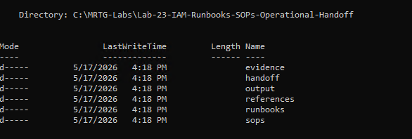
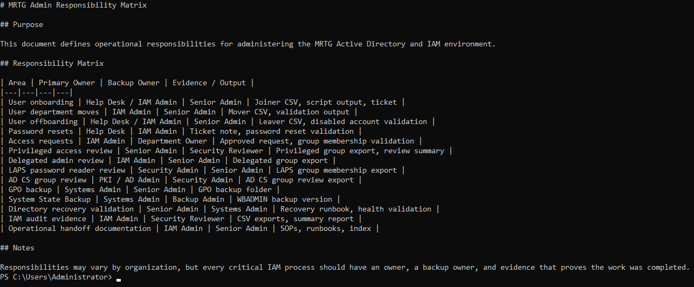

# Lab 23 - IAM Runbooks, SOPs, and Operational Handoff


---

## Overview

In this lab, I created an operational handoff documentation package for the Monroe Redstone Technology Group Active Directory and IAM environment.

The lab focused on creating standard operating procedures, recovery references, responsibility documentation, an operational handoff summary, and a central documentation index.

The goal was to prove that the IAM environment was not only built, automated, backed up, and audited, but also documented well enough for another administrator to understand, operate, review, and support.

---

## Business Problem

MRTG needed to reduce its dependence on undocumented technical knowledge held by a single administrator.

Without standardized documentation, routine IAM tasks can be completed inconsistently, security requirements can be overlooked, recovery procedures can be delayed, and operational knowledge can be lost during staffing changes.

The organization needed documented procedures covering identity lifecycle operations, access requests, password resets, privileged access reviews, directory recovery, administrative ownership, and evidence retention.

This lab addressed that problem by transforming the technical work completed in earlier labs into a structured and validated operational handoff package.

---

## Lab Summary

I began by creating a pre-lab Hyper-V checkpoint and a dedicated folder structure for SOPs, runbooks, handoff documents, prior-lab references, output, and evidence.

I then referenced identity lifecycle output from Lab 20, recovery documentation from Lab 21, and audit evidence from Lab 22.

Using those artifacts, I created four SOPs covering Joiner, Mover, and Leaver operations, access requests, password resets, and privileged access reviews.

I also created a directory recovery reference, an administrative responsibility matrix, an operational handoff summary, and a central documentation index.

Finally, I validated the complete package with PowerShell and created a post-lab checkpoint.

---

## Objectives

- Create pre-lab and post-lab Hyper-V checkpoints
- Create a dedicated Lab 23 documentation workspace
- Reference operational evidence from Labs 20, 21, and 22
- Document Joiner, Mover, and Leaver procedures
- Document access request procedures
- Document password reset procedures
- Document privileged access review procedures
- Create a directory recovery reference
- Define primary and backup administrative ownership
- Create an operational handoff summary
- Create a central documentation index
- Validate the complete handoff package

---

## Scope

### Included

- Hyper-V checkpoint creation
- Documentation folder structure creation
- Prior-lab evidence collection
- Identity lifecycle SOP creation
- Access request SOP creation
- Password reset SOP creation
- Privileged access review SOP creation
- Directory recovery reference creation
- Administrative responsibility mapping
- Operational handoff documentation
- Documentation index creation
- PowerShell-based package validation

### Not Included

- Active Directory configuration changes
- Production document approval
- Ticketing platform integration
- Formal compliance control mapping
- Full disaster recovery planning
- Business continuity planning
- Emergency access procedure testing
- Recovery tabletop exercises
- Centralized documentation platform deployment
- Automated document version control
- Formal RACI approval

---

## Environment

| Component | Details |
|---|---|
| Organization | Monroe Redstone Technology Group |
| Domain | `mrtg.local` |
| Primary Domain Controller | `MRTG-DC01` |
| Additional Domain Controller | `MRTG-DC02` |
| Site | `MRTG-HQ-Site` |
| Lab Root Path | `C:\MRTG-Labs\Lab-23-IAM-Runbooks-SOPs-Operational-Handoff` |
| SOPs Path | `C:\MRTG-Labs\Lab-23-IAM-Runbooks-SOPs-Operational-Handoff\sops` |
| Runbooks Path | `C:\MRTG-Labs\Lab-23-IAM-Runbooks-SOPs-Operational-Handoff\runbooks` |
| Handoff Path | `C:\MRTG-Labs\Lab-23-IAM-Runbooks-SOPs-Operational-Handoff\handoff` |
| References Path | `C:\MRTG-Labs\Lab-23-IAM-Runbooks-SOPs-Operational-Handoff\references` |
| Output Path | `C:\MRTG-Labs\Lab-23-IAM-Runbooks-SOPs-Operational-Handoff\output` |
| Evidence Path | `C:\MRTG-Labs\Lab-23-IAM-Runbooks-SOPs-Operational-Handoff\evidence` |
| Tools | PowerShell, Hyper-V Manager, Markdown |
| Hypervisor | Hyper-V |

---

## Scenario

MRTG has built an enterprise-style Active Directory and IAM environment containing users, groups, organizational units, Group Policy, delegated administration, Windows LAPS, AD CS, identity lifecycle automation, recovery artifacts, and IAM audit evidence.

The environment now needs formal operational documentation so another administrator can understand how it is managed and supported.

The operational handoff model used in this lab was:

```text
Reference Prior Evidence → Create SOPs → Create Recovery Reference → Define Ownership → Build Index → Validate Package
```

This lab did not make major Active Directory changes. It focused on documentation, ownership, repeatability, evidence, and operational continuity.

---

## Documentation Design

| Documentation Area | Purpose |
|---|---|
| SOPs | Standardize repeatable IAM procedures |
| Runbooks | Provide operational recovery and validation references |
| Handoff Documents | Define ownership and summarize the operating model |
| References | Preserve supporting evidence from prior labs |
| Evidence | Store screenshots and validation artifacts |
| Output | Store generated output files |

---

## Documentation Package

```text
C:\MRTG-Labs\Lab-23-IAM-Runbooks-SOPs-Operational-Handoff
│
├── evidence
├── handoff
│   ├── MRTG-Admin-Responsibility-Matrix.md
│   ├── MRTG-IAM-Documentation-Index.md
│   └── MRTG-Operational-Handoff-Summary.md
│
├── output
├── references
│   ├── Lab-20-Identity-Lifecycle-Output
│   ├── Lab-21-Recovery-Runbook
│   ├── Lab-22-Audit-Exports
│   └── Lab-22-Security-Review-Reports
│
├── runbooks
│   └── MRTG-Directory-Recovery-Reference.md
│
└── sops
    ├── MRTG-Access-Request-SOP.md
    ├── MRTG-Joiner-Mover-Leaver-SOP.md
    ├── MRTG-Password-Reset-SOP.md
    └── MRTG-Privileged-Access-Review-SOP.md
```

---

## Implementation Steps

### Step 1 - Created Pre-Lab Checkpoint

A Hyper-V checkpoint was created before beginning Lab 23.

Checkpoint name:

```text
MRTG-DC01_Pre-Lab-23-IAM-Runbooks-SOPs-Operational-Handoff
```


---

### Step 2 - Created Lab 23 Folder Structure

A dedicated Lab 23 workspace was created on `MRTG-DC01`.

Folder structure:

```text
C:\MRTG-Labs\Lab-23-IAM-Runbooks-SOPs-Operational-Handoff
├── evidence
├── handoff
├── output
├── references
├── runbooks
└── sops
```



---

### Step 3 - Referenced Prior Lab Evidence

Evidence from previous labs was copied into the Lab 23 `references` folder.

| Reference Folder | Source |
|---|---|
| `Lab-20-Identity-Lifecycle-Output` | Lab 20 Joiner, Mover, and Leaver output |
| `Lab-21-Recovery-Runbook` | Lab 21 directory recovery runbook |
| `Lab-22-Audit-Exports` | Lab 22 IAM audit CSV exports |
| `Lab-22-Security-Review-Reports` | Lab 22 IAM security review summary |

This connected the operational documentation to previously validated lifecycle, recovery, and audit evidence.


---

## SOP Creation

### Step 4 - Created Joiner, Mover, and Leaver SOP

A Joiner, Mover, and Leaver SOP was created to document identity lifecycle procedures.

SOP file:

```text
C:\MRTG-Labs\Lab-23-IAM-Runbooks-SOPs-Operational-Handoff\sops\MRTG-Joiner-Mover-Leaver-SOP.md
```

The SOP documented:

- New-user onboarding
- Department transfers
- Access updates
- User offboarding
- Account disablement
- Department group removal
- Required evidence
- Governance requirements

The procedures required approved requests, validated user attributes, automation output, directory validation, and retained evidence.


---

### Step 5 - Created Access Request and Password Reset SOPs

Two SOPs were created for common IAM and help desk workflows.

SOP files:

```text
MRTG-Access-Request-SOP.md
MRTG-Password-Reset-SOP.md
```

The Access Request SOP documented:

- Approved request validation
- Requester and user identification
- Business justification
- Access owner or manager approval
- Group-based access assignment
- Group membership validation
- Evidence retention

The Password Reset SOP documented:

- User identity verification
- Security concern evaluation
- Password reset execution
- Password change at next logon
- Sign-in validation
- Ticket documentation
- Escalation of suspicious requests


---

### Step 6 - Created Privileged Access Review SOP

A Privileged Access Review SOP was created to standardize reviews of elevated access.

SOP file:

```text
C:\MRTG-Labs\Lab-23-IAM-Runbooks-SOPs-Operational-Handoff\sops\MRTG-Privileged-Access-Review-SOP.md
```

The SOP covered:

- Domain Admins
- Enterprise Admins
- Schema Admins
- Administrators
- Account Operators
- Server Operators
- Backup Operators
- Delegated admin groups
- LAPS password-reader groups
- AD CS-related groups

The review procedure required:

1. Validating domain health
2. Exporting privileged group membership
3. Reviewing Domain Admins separately
4. Reviewing delegated administration
5. Reviewing LAPS password-reader access
6. Reviewing AD CS-related groups
7. Identifying unexpected or stale accounts
8. Comparing findings with approved access records
9. Documenting findings
10. Escalating questionable access for remediation


---

## Runbook Reference

### Step 7 - Created Directory Recovery Reference

A Directory Recovery Reference was created based on the recovery and resilience work completed in Lab 21.

Runbook file:

```text
C:\MRTG-Labs\Lab-23-IAM-Runbooks-SOPs-Operational-Handoff\runbooks\MRTG-Directory-Recovery-Reference.md
```

The reference documented:

- Domain controller health checks
- DNS and domain controller discovery
- Active Directory replication health
- FSMO role ownership
- System State Backup availability
- GPO backup availability
- AD inventory exports
- Privileged group membership exports
- Identity automation artifacts
- Post-recovery validation

Key commands:

```cmd
dcdiag /s:MRTG-DC01
repadmin /replsummary
repadmin /showrepl
netdom query fsmo
nltest /dsgetdc:mrtg.local
wbadmin get versions -backuptarget:E:
```

The document was designed as an operational reference and did not replace a complete disaster recovery plan.


---

## Handoff Documentation

### Step 8 - Created Admin Responsibility Matrix

An Admin Responsibility Matrix was created to define ownership for major IAM operational tasks.

Matrix file:

```text
C:\MRTG-Labs\Lab-23-IAM-Runbooks-SOPs-Operational-Handoff\handoff\MRTG-Admin-Responsibility-Matrix.md
```

The matrix documented:

- Operational area
- Primary owner
- Backup owner
- Required evidence or output

Example responsibilities:

| Area | Primary Owner | Backup Owner | Evidence or Output |
|---|---|---|---|
| User onboarding | Help Desk / IAM Admin | Senior Admin | Joiner CSV, script output, ticket |
| User offboarding | Help Desk / IAM Admin | Senior Admin | Leaver CSV, disabled account validation |
| Password resets | Help Desk / IAM Admin | Ticket Owner | Ticket note, reset validation |
| Access requests | IAM Admin | Department Owner | Approved request, membership validation |
| Privileged access review | Senior Admin | Security Reviewer | Group export, review summary |
| LAPS reader review | Security Admin | Senior Admin | LAPS group export |
| AD CS group review | PKI / AD Admin | Security Admin | AD CS group review export |
| Directory recovery validation | Senior Admin | Systems Admin | Recovery runbook, health validation |
| IAM audit evidence | IAM Admin | Security Reviewer | CSV exports, summary report |



---

### Step 9 - Created Operational Handoff Summary

An Operational Handoff Summary was created to explain the IAM environment and handoff package.

Handoff file:

```text
C:\MRTG-Labs\Lab-23-IAM-Runbooks-SOPs-Operational-Handoff\handoff\MRTG-Operational-Handoff-Summary.md
```

The summary documented:

- Environment overview
- Handoff package contents
- Operational priorities
- Handoff notes

The environment overview included:

```text
Active Directory Domain Services
Organizational Unit structure
Department-based security groups
Group Policy controls
Delegated administration
Windows LAPS password-reader controls
Active Directory Certificate Services
Identity lifecycle automation
Directory backup and recovery artifacts
IAM security review evidence
```

Operational priorities included limiting privileged access, using groups for access assignments, preserving lifecycle evidence, validating domain health, maintaining recovery artifacts, and keeping documentation updated.


---

### Step 10 - Created Documentation Index

A central IAM Documentation Index was created to make the handoff package easier to navigate.

Index file:

```text
C:\MRTG-Labs\Lab-23-IAM-Runbooks-SOPs-Operational-Handoff\handoff\MRTG-IAM-Documentation-Index.md
```

The index organized:

- SOPs
- Runbook references
- Handoff documents
- Prior-lab references
- Operational-use guidance

The index provides administrators with a single starting point for understanding how the MRTG IAM environment is operated, reviewed, recovered, and handed off.


---

## Handoff Package Validation

### Step 11 - Validated Handoff Package

The complete handoff package was validated with PowerShell.

Command used:

```powershell
$LabRoot = "C:\MRTG-Labs\Lab-23-IAM-Runbooks-SOPs-Operational-Handoff"

Get-ChildItem $LabRoot -Recurse |
Where-Object { -not $_.PSIsContainer } |
Select-Object Directory,Name,Length |
Format-Table -AutoSize
```

Validated handoff documents:

```text
MRTG-Admin-Responsibility-Matrix.md
MRTG-IAM-Documentation-Index.md
MRTG-Operational-Handoff-Summary.md
```

Validated runbook:

```text
MRTG-Directory-Recovery-Reference.md
```

Validated SOPs:

```text
MRTG-Access-Request-SOP.md
MRTG-Joiner-Mover-Leaver-SOP.md
MRTG-Password-Reset-SOP.md
MRTG-Privileged-Access-Review-SOP.md
```

Validated references included:

```text
Lab 20 lifecycle output
Lab 21 recovery runbook
Lab 22 audit exports
Lab 22 security review report
```


---

### Step 12 - Created Post-Lab Checkpoint

A post-lab checkpoint was created after validating the operational handoff package.

Checkpoint name:

```text
MRTG-DC01_Post-Lab-23-IAM-Runbooks-SOPs-Operational-Handoff-Validated
```


---

## Handoff Deliverables

| Category | Deliverable | Purpose |
|---|---|---|
| SOP | `MRTG-Joiner-Mover-Leaver-SOP.md` | Standardize identity lifecycle operations |
| SOP | `MRTG-Access-Request-SOP.md` | Standardize access approval and assignment |
| SOP | `MRTG-Password-Reset-SOP.md` | Standardize secure password resets |
| SOP | `MRTG-Privileged-Access-Review-SOP.md` | Standardize privileged access reviews |
| Runbook | `MRTG-Directory-Recovery-Reference.md` | Provide recovery validation guidance |
| Handoff | `MRTG-Admin-Responsibility-Matrix.md` | Define primary and backup ownership |
| Handoff | `MRTG-Operational-Handoff-Summary.md` | Summarize the environment and priorities |
| Handoff | `MRTG-IAM-Documentation-Index.md` | Provide a central navigation point |
| References | Labs 20, 21, and 22 artifacts | Connect procedures to prior evidence |

---

## Validation Summary

| Test | Expected Result | Actual Result | Status |
|---|---|---|---|
| Pre-lab checkpoint created | Checkpoint exists before changes | Pre-lab checkpoint created | Passed |
| Folder structure created | Required folders exist | Six folders validated | Passed |
| Prior evidence referenced | Labs 20 through 22 evidence available | Four reference folders created | Passed |
| Lifecycle SOP created | Joiner, Mover, and Leaver procedures documented | SOP created | Passed |
| Access Request SOP created | Access request process documented | SOP created | Passed |
| Password Reset SOP created | Password reset process documented | SOP created | Passed |
| Privileged Access SOP created | Privileged review process documented | SOP created | Passed |
| Recovery reference created | Recovery reference exists | Reference created | Passed |
| Responsibility matrix created | Process ownership documented | Matrix created | Passed |
| Handoff summary created | Operating model summarized | Summary created | Passed |
| Documentation index created | Central index exists | Index created | Passed |
| Package validated | Expected files exist and are readable | Package validated | Passed |
| Post-lab checkpoint created | Checkpoint exists after validation | Post-lab checkpoint created | Passed |

---

## Evidence Collected

| Evidence | Screenshot |
|---|---|
| Pre-lab checkpoint | `screenshots/lab-23-01-pre-lab-23-checkpoint.png` |
| Lab folder structure | `screenshots/lab-23-02-folder-structure-created.png` |
| Prior-lab evidence references | `screenshots/lab-23-03-prior-lab-evidence-referenced.png` |
| Joiner, Mover, and Leaver SOP | `screenshots/lab-23-04-joiner-mover-leaver-sop-created.png` |
| Access Request and Password Reset SOPs | `screenshots/lab-23-05-access-request-and-password-reset-sops-created.png` |
| Privileged Access Review SOP | `screenshots/lab-23-06-privileged-access-review-sop-created.png` |
| Directory Recovery Reference | `screenshots/lab-23-07-directory-recovery-runbook-reference-created.png` |
| Admin Responsibility Matrix | `screenshots/lab-23-08-admin-responsibility-matrix-created.png` |
| Operational Handoff Summary | `screenshots/lab-23-09-operational-handoff-summary-created.png` |
| IAM Documentation Index | `screenshots/lab-23-10-documentation-index-created.png` |
| Validated handoff package | `screenshots/lab-23-11-handoff-package-validated.png` |
| Post-lab checkpoint | `screenshots/lab-23-12-post-lab-23-checkpoint.png` |

---

## Troubleshooting Notes

No major technical failures occurred during this lab.

The primary challenge was converting technical tasks from previous labs into documentation that another administrator could follow without relying on undocumented knowledge.

The documentation needed to distinguish between:

- Procedures and technical commands
- Primary and backup ownership
- Required approvals and implementation steps
- Operational evidence and screenshots
- Recovery references and full recovery plans
- Documentation creation and formal organizational approval

The final validation confirmed that the expected documents and prior-lab references were present in the handoff package.

---

## Security Concepts Reinforced

- Operational resilience
- IAM process standardization
- Identity lifecycle governance
- Secure access request handling
- User identity verification
- Privileged access governance
- Least privilege
- Separation of duties
- Administrative ownership
- Backup ownership
- Evidence retention
- Recovery readiness
- Knowledge transfer
- Documentation access control
- Audit readiness

---

## Real-World Relevance

IAM environments are not successful only because they are technically configured. They must also be understandable, repeatable, auditable, and supportable.

In enterprise and government-regulated environments, documentation allows administrators, auditors, security reviewers, and incident responders to understand how identity processes operate.

This lab connects directly to real-world IAM and IT operations:

- Documenting user lifecycle procedures
- Creating repeatable access request processes
- Defining secure password reset procedures
- Standardizing privileged access reviews
- Linking recovery references to operational documentation
- Defining primary and backup ownership
- Establishing evidence requirements
- Supporting audit readiness
- Reducing dependence on individual administrators
- Preparing operational knowledge for staff transitions

The key lesson is that IAM includes technology, process, ownership, evidence, and operational continuity.

---

## Security Considerations

This lab created documentation and handoff references but did not make access changes.

In production, SOPs and runbooks should be reviewed, approved, version-controlled, protected, and updated as systems and policies change.

Production controls should include:

- Formal document approval workflows
- Version history
- Change control references
- Assigned document owners
- Scheduled review dates
- Separation of requester, approver, and implementer duties
- Restricted access to sensitive recovery documentation
- Security review of privileged procedures
- Integration with ticketing and audit systems
- Retention requirements
- Regular tabletop exercises
- Monitoring for unauthorized document changes
- Secure storage of sensitive commands and recovery details

---

## Lessons Learned

- IAM documentation should connect to real operational evidence
- SOPs make identity tasks consistent and repeatable
- Password resets are security-sensitive identity events
- Access requests require approval and business justification
- Privileged access reviews need defined evidence requirements
- Recovery references should be easy to locate before an incident
- Critical IAM processes need primary and backup owners
- Documentation indexes make larger handoff packages easier to navigate
- Prior-lab evidence strengthens operational documentation
- Documentation must be reviewed as the environment changes
- A supportable IAM environment is more mature than one that is only configured correctly

---

## What I Would Do Differently in Production

In a production or government-regulated environment, I would expand this package into a formally governed IAM operations manual.

A stronger production design would include:

- Formal document owners
- Approval and review dates
- Version-controlled documentation
- Document classification labels
- Role-based documentation access
- Integration with a ticketing system
- Links to approved access workflows
- Links to backup and recovery platforms
- Links to centralized audit evidence
- Escalation paths for security incidents
- A formal RACI matrix
- Compliance control mapping
- Quarterly privileged access reviews
- Annual recovery tabletop exercises
- Emergency access procedures
- Break-glass account procedures
- New IAM administrator onboarding checklists
- Document change notifications
- Periodic testing of documented procedures

For this lab, the goal was to demonstrate the core mechanics of creating a practical operational handoff package for an enterprise IAM environment.

---

## Skills Demonstrated

- IAM operational documentation
- SOP creation
- Runbook reference creation
- Identity lifecycle documentation
- Access request documentation
- Password reset documentation
- Privileged access review documentation
- Directory recovery documentation
- Administrative responsibility mapping
- Operational handoff planning
- Documentation indexing
- Evidence-based package validation
- PowerShell file validation
- IAM process ownership mapping
- Audit and recovery evidence referencing
- Knowledge transfer planning
- Operational continuity planning

---

## Outcome

Lab 23 successfully created and validated an operational handoff package for the MRTG enterprise IAM environment.

The package included four IAM SOPs, a directory recovery reference, an administrative responsibility matrix, an operational handoff summary, a central documentation index, and supporting references from Labs 20, 21, and 22.

The final result was a supportable documentation package that another administrator could use to understand the environment, follow repeatable procedures, review access, locate recovery artifacts, and continue operating the identity environment.

---

## Next Lab

[Lab 24 - Enterprise IAM Capstone Validation](../Lab-24-Enterprise-IAM-Capstone-Validation/)

Lab 24 will validate the MRTG identity environment as an integrated enterprise IAM system by reviewing architecture, lifecycle operations, privileged access, recovery readiness, audit evidence, and operational documentation.
