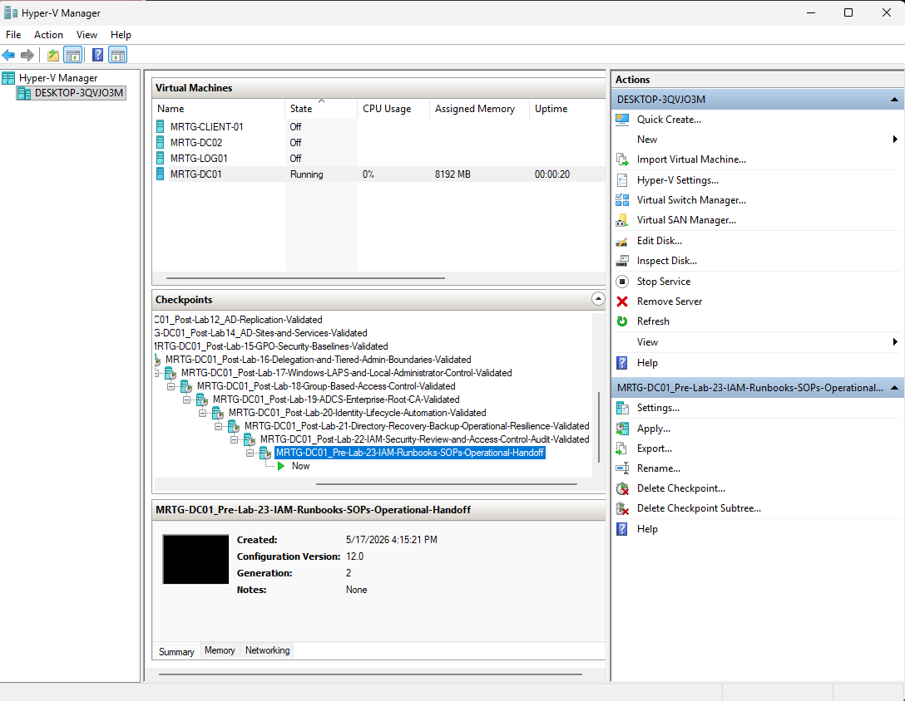
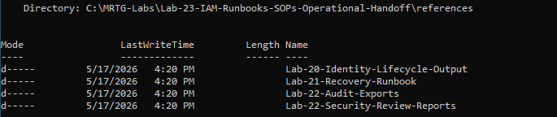
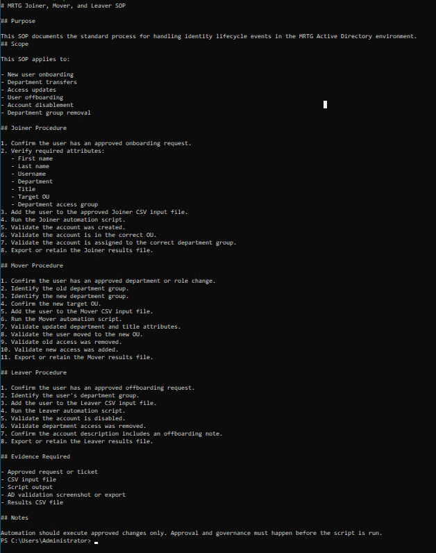
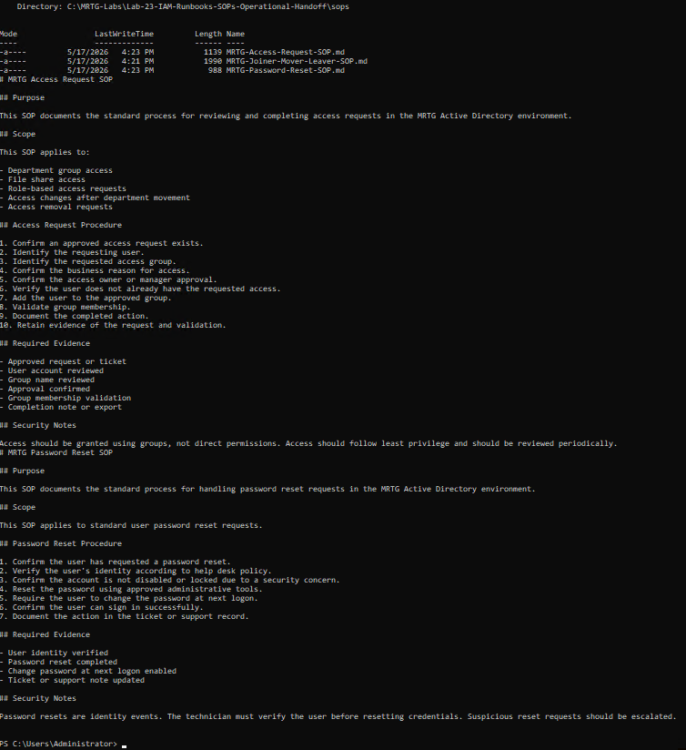
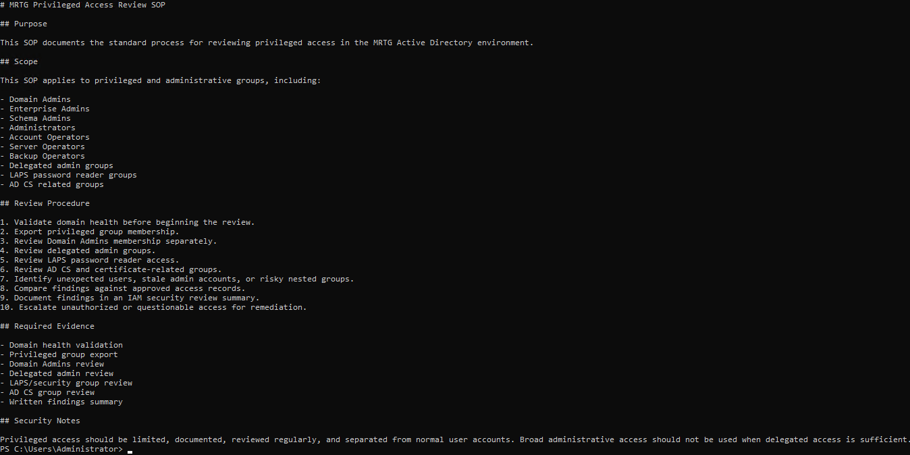
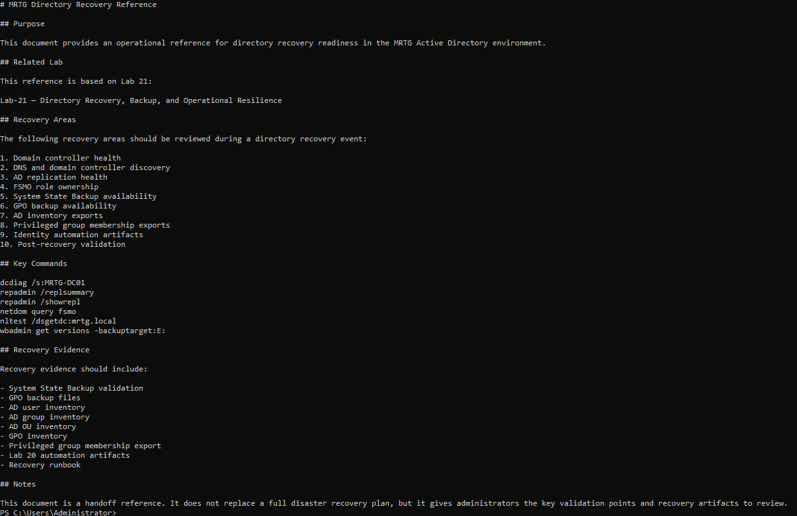
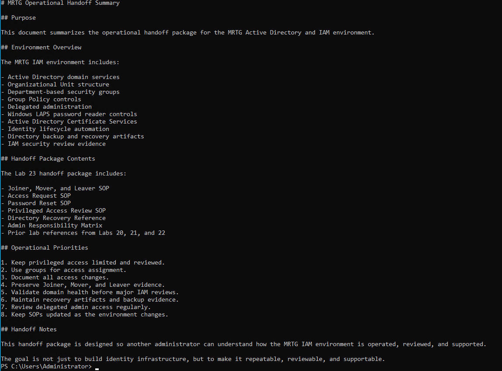
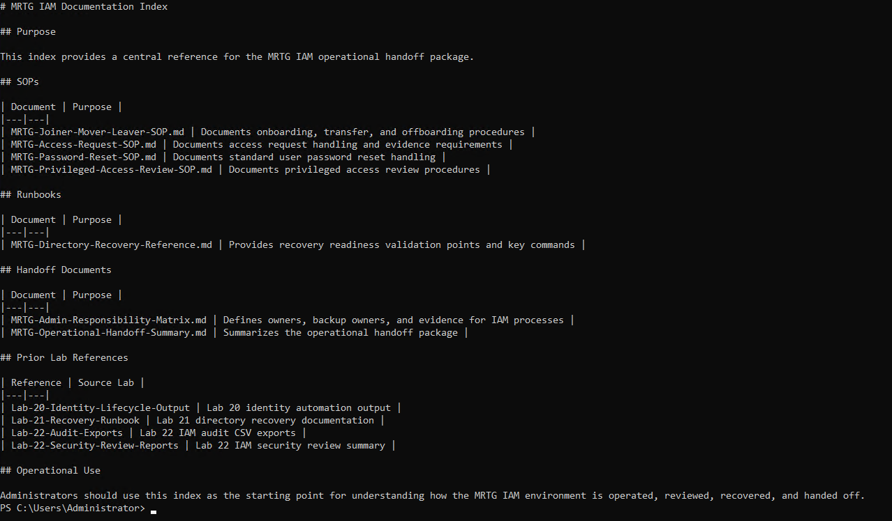
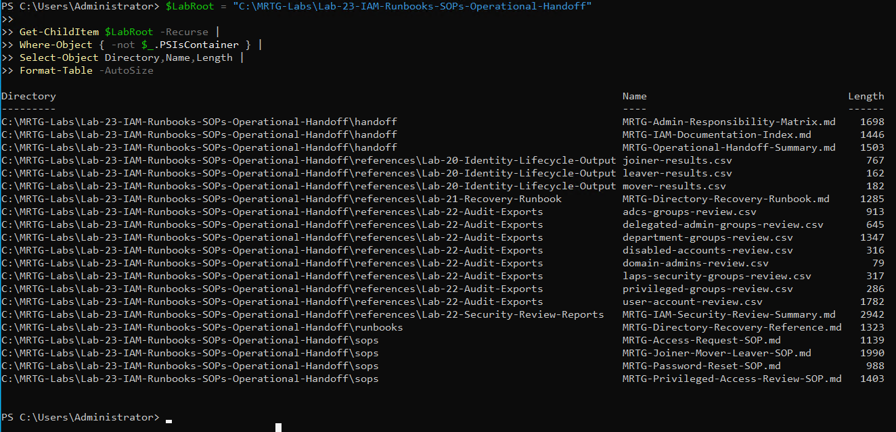
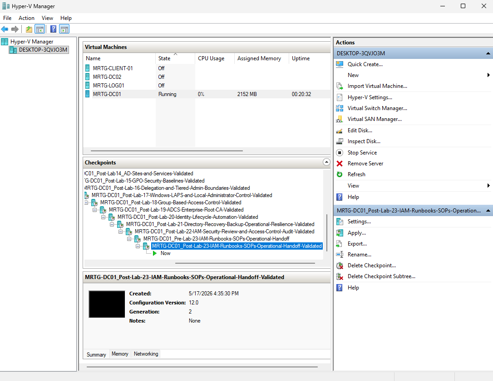

# Lab-23 — IAM Runbooks, SOPs, and Operational Handoff


## Objective

The objective of this lab was to create an operational handoff documentation package for the MRTG enterprise IAM environment.

This lab focused on creating standard operating procedures, recovery references, responsibility documentation, handoff summaries, and a central documentation index.

The goal was to prove that the IAM environment is not only built, automated, backed up, and audited, but also documented well enough for another administrator to understand, operate, review, and support it.

## Scope

This lab included:

- Creating a pre-lab Hyper-V checkpoint
- Creating a dedicated Lab 23 folder structure
- Referencing prior lab evidence from Labs 20, 21, and 22
- Creating a Joiner, Mover, and Leaver SOP
- Creating an Access Request SOP
- Creating a Password Reset SOP
- Creating a Privileged Access Review SOP
- Creating a Directory Recovery Reference
- Creating an Admin Responsibility Matrix
- Creating an Operational Handoff Summary
- Creating a Documentation Index
- Validating the full handoff package
- Creating a post-lab Hyper-V checkpoint

## Environment

| Component | Details |
|---|---|
| Domain | `mrtg.local` |
| Primary Domain Controller | `MRTG-DC01` |
| Additional Domain Controller | `MRTG-DC02` |
| Site | `MRTG-HQ-Site` |
| Lab Root Path | `C:\MRTG-Labs\Lab-23-IAM-Runbooks-SOPs-Operational-Handoff` |
| SOPs Path | `C:\MRTG-Labs\Lab-23-IAM-Runbooks-SOPs-Operational-Handoff\sops` |
| Runbooks Path | `C:\MRTG-Labs\Lab-23-IAM-Runbooks-SOPs-Operational-Handoff\runbooks` |
| Handoff Path | `C:\MRTG-Labs\Lab-23-IAM-Runbooks-SOPs-Operational-Handoff\handoff` |
| References Path | `C:\MRTG-Labs\Lab-23-IAM-Runbooks-SOPs-Operational-Handoff\references` |
| Output Path | `C:\MRTG-Labs\Lab-23-IAM-Runbooks-SOPs-Operational-Handoff\output` |
| Evidence Path | `C:\MRTG-Labs\Lab-23-IAM-Runbooks-SOPs-Operational-Handoff\evidence` |
| Tools Used | PowerShell, Hyper-V Manager, Markdown Documentation |

## Scenario

Monroe Redstone Technology Group has built an enterprise-style Active Directory and IAM environment with users, groups, organizational units, Group Policy, delegated administration, Windows LAPS, AD CS, identity lifecycle automation, backup/recovery evidence, and IAM audit exports.

At this stage, the environment needs formal operational documentation so another administrator can understand how the IAM environment is managed and supported.

The operational handoff model used in this lab was:

```text
Reference Prior Evidence → Create SOPs → Create Runbook References → Define Ownership → Build Index → Validate Handoff Package
```

This lab did not make major Active Directory changes. It focused on documentation, ownership, repeatability, and operational handoff.

## Documentation Design

The Lab 23 documentation package was organized into several categories.

| Documentation Area | Purpose |
|---|---|
| SOPs | Standardize repeatable IAM procedures |
| Runbooks | Provide operational references for recovery and validation |
| Handoff Documents | Summarize ownership, responsibilities, and operating model |
| References | Preserve supporting evidence from prior labs |
| Evidence | Store supporting screenshots or validation artifacts |
| Output | Store any generated output files |

## Implementation Steps

### 1. Created Pre-Lab Checkpoint

A Hyper-V checkpoint was created before beginning Lab 23.

Checkpoint name:

```text
MRTG-DC01_Pre-Lab-23-IAM-Runbooks-SOPs-Operational-Handoff
```



### 2. Created Lab 23 Folder Structure

A dedicated Lab 23 workspace was created on `MRTG-DC01`.

Folder structure:

```text
C:\MRTG-Labs\Lab-23-IAM-Runbooks-SOPs-Operational-Handoff
├── evidence
├── handoff
├── output
├── references
├── runbooks
└── sops
```


### 3. Referenced Prior Lab Evidence

Evidence from previous labs was copied into the Lab 23 `references` folder.

Prior lab references included:

| Reference Folder | Source |
|---|---|
| `Lab-20-Identity-Lifecycle-Output` | Lab 20 Joiner, Mover, and Leaver output files |
| `Lab-21-Recovery-Runbook` | Lab 21 directory recovery runbook |
| `Lab-22-Audit-Exports` | Lab 22 IAM audit CSV exports |
| `Lab-22-Security-Review-Reports` | Lab 22 IAM security review summary |



This proved that Lab 23 was not isolated. It tied together the identity lifecycle automation, recovery readiness, and security review evidence from prior labs.

## SOP Creation

### 4. Created Joiner, Mover, and Leaver SOP

A Joiner, Mover, and Leaver SOP was created to document identity lifecycle procedures.

SOP file:

```text
C:\MRTG-Labs\Lab-23-IAM-Runbooks-SOPs-Operational-Handoff\sops\MRTG-Joiner-Mover-Leaver-SOP.md
```

The SOP documented:

- New user onboarding
- Department transfers
- Access updates
- User offboarding
- Account disablement
- Department group removal
- Required evidence
- Governance notes



### 5. Created Access Request and Password Reset SOPs

Two additional SOPs were created for common IAM and help desk workflows.

SOP files:

```text
MRTG-Access-Request-SOP.md
MRTG-Password-Reset-SOP.md
```

The Access Request SOP documented:

- Approved access request validation
- User identification
- Access group identification
- Business justification
- Approval confirmation
- Group membership validation
- Evidence retention

The Password Reset SOP documented:

- User identity verification
- Password reset procedure
- Change password at next logon
- Sign-in validation
- Ticket documentation
- Escalation for suspicious reset requests



### 6. Created Privileged Access Review SOP

A Privileged Access Review SOP was created to document how elevated access should be reviewed.

SOP file:

```text
C:\MRTG-Labs\Lab-23-IAM-Runbooks-SOPs-Operational-Handoff\sops\MRTG-Privileged-Access-Review-SOP.md
```

The SOP covered privileged access review for:

- Domain Admins
- Enterprise Admins
- Schema Admins
- Administrators
- Account Operators
- Server Operators
- Backup Operators
- Delegated admin groups
- LAPS password reader groups
- AD CS related groups

The SOP also documented:

- Review procedure
- Required evidence
- Security notes
- Escalation expectations



## Runbook Reference

### 7. Created Directory Recovery Reference

A Directory Recovery Reference was created based on the Lab 21 recovery and resilience work.

Runbook file:

```text
C:\MRTG-Labs\Lab-23-IAM-Runbooks-SOPs-Operational-Handoff\runbooks\MRTG-Directory-Recovery-Reference.md
```

The recovery reference documented:

- Domain controller health checks
- DNS and domain controller discovery
- AD replication health
- FSMO role ownership
- System State Backup availability
- GPO backup availability
- AD inventory exports
- Privileged group membership exports
- Identity automation artifacts
- Post-recovery validation

Key commands included:

```text
dcdiag /s:MRTG-DC01
repadmin /replsummary
repadmin /showrepl
netdom query fsmo
nltest /dsgetdc:mrtg.local
wbadmin get versions -backuptarget:E:
```



## Handoff Documentation

### 8. Created Admin Responsibility Matrix

An Admin Responsibility Matrix was created to define ownership for major IAM operational tasks.

Matrix file:

```text
C:\MRTG-Labs\Lab-23-IAM-Runbooks-SOPs-Operational-Handoff\handoff\MRTG-Admin-Responsibility-Matrix.md
```

The matrix documented:

- Operational area
- Primary owner
- Backup owner
- Evidence or output required

Example responsibility areas included:

| Area | Primary Owner | Backup Owner | Evidence / Output |
|---|---|---|---|
| User onboarding | Help Desk / IAM Admin | Senior Admin | Joiner CSV, script output, ticket |
| User offboarding | Help Desk / IAM Admin | Senior Admin | Leaver CSV, disabled account validation |
| Access requests | IAM Admin | Department Owner | Approved request, group membership validation |
| Privileged access review | Senior Admin | Security Reviewer | Privileged group export, review summary |
| Directory recovery validation | Senior Admin | Systems Admin | Recovery runbook, health validation |


### 9. Created Operational Handoff Summary

An Operational Handoff Summary was created to summarize the IAM environment and handoff package.

Handoff file:

```text
C:\MRTG-Labs\Lab-23-IAM-Runbooks-SOPs-Operational-Handoff\handoff\MRTG-Operational-Handoff-Summary.md
```

The summary documented:

- Environment overview
- Handoff package contents
- Operational priorities
- Handoff notes

The environment overview included:

```text
Active Directory domain services
Organizational Unit structure
Department-based security groups
Group Policy controls
Delegated administration
Windows LAPS password reader controls
Active Directory Certificate Services
Identity lifecycle automation
Directory backup and recovery artifacts
IAM security review evidence
```



### 10. Created Documentation Index

A central IAM Documentation Index was created to make the handoff package easier to navigate.

Index file:

```text
C:\MRTG-Labs\Lab-23-IAM-Runbooks-SOPs-Operational-Handoff\handoff\MRTG-IAM-Documentation-Index.md
```

The index included references to:

- SOPs
- Runbooks
- Handoff documents
- Prior lab references
- Operational use notes



## Handoff Package Validation

### 11. Validated Handoff Package

The full handoff package was validated using PowerShell.

Validation command:

```powershell
$LabRoot = "C:\MRTG-Labs\Lab-23-IAM-Runbooks-SOPs-Operational-Handoff"

Get-ChildItem $LabRoot -Recurse |
Where-Object { -not $_.PSIsContainer } |
Select-Object Directory,Name,Length |
Format-Table -AutoSize
```

Validated package contents included:

```text
handoff/
- MRTG-Admin-Responsibility-Matrix.md
- MRTG-IAM-Documentation-Index.md
- MRTG-Operational-Handoff-Summary.md

runbooks/
- MRTG-Directory-Recovery-Reference.md

sops/
- MRTG-Access-Request-SOP.md
- MRTG-Joiner-Mover-Leaver-SOP.md
- MRTG-Password-Reset-SOP.md
- MRTG-Privileged-Access-Review-SOP.md

references/
- Lab 20 lifecycle output
- Lab 21 recovery runbook
- Lab 22 audit exports
- Lab 22 security review report
```



## Validation Summary

| Test | Expected Result | Actual Result | Status |
|---|---|---|---|
| Pre-lab checkpoint created | Checkpoint exists before Lab 23 changes | Pre-lab checkpoint created | Passed |
| Lab folder structure created | Required folders exist | Folder structure validated | Passed |
| Prior lab evidence referenced | Labs 20–22 evidence copied | Prior evidence referenced | Passed |
| Joiner/Mover/Leaver SOP created | Lifecycle SOP exists | SOP created | Passed |
| Access Request SOP created | Access request process documented | SOP created | Passed |
| Password Reset SOP created | Password reset process documented | SOP created | Passed |
| Privileged Access Review SOP created | Privileged access review documented | SOP created | Passed |
| Directory Recovery Reference created | Recovery reference exists | Runbook reference created | Passed |
| Admin Responsibility Matrix created | Ownership matrix exists | Matrix created | Passed |
| Operational Handoff Summary created | Handoff summary exists | Summary created | Passed |
| Documentation Index created | Central index exists | Index created | Passed |
| Handoff package validated | Expected files exist | Package validated | Passed |
| Post-lab checkpoint created | Checkpoint exists after validation | Post-lab checkpoint created | Passed |

## Post-Lab Checkpoint

A post-lab checkpoint was created after validating the operational handoff package.

Checkpoint name:

```text
MRTG-DC01_Post-Lab-23-IAM-Runbooks-SOPs-Operational-Handoff-Validated
```



## Outcome

Lab 23 successfully created an operational handoff package for the MRTG enterprise IAM environment.

The lab produced SOPs, runbook references, responsibility documentation, a handoff summary, a documentation index, and references to prior lab evidence.

The final result was a supportable IAM documentation package that another administrator could use to understand the environment, follow repeatable procedures, review access, reference recovery artifacts, and continue operating the identity environment.

## Skills Demonstrated

- IAM operational documentation
- SOP creation
- Runbook reference creation
- Identity lifecycle process documentation
- Access request process documentation
- Password reset process documentation
- Privileged access review documentation
- Directory recovery reference documentation
- Admin responsibility matrix creation
- Operational handoff planning
- Documentation indexing
- Evidence-based handoff validation
- PowerShell file and documentation management
- IAM process ownership mapping
- Audit and recovery evidence referencing

## Real-World Relevance

IAM environments are not successful just because they are technically configured. They must also be understandable, repeatable, and supportable.

In enterprise and government-regulated IT environments, documentation matters because another administrator, auditor, security reviewer, or incident responder may need to understand how the identity environment works.

This lab connects directly to real-world IAM and IT operations:

- Documenting user lifecycle procedures
- Creating repeatable access request processes
- Defining password reset expectations
- Reviewing privileged access through a standard process
- Linking recovery references to operational documentation
- Defining process ownership and backup ownership
- Creating evidence requirements for IAM tasks
- Building documentation that supports audit readiness
- Making the environment easier to hand off to another administrator

The key lesson is that IAM is not only technical work. It is also process, ownership, evidence, and operational continuity.

## Security Considerations

This lab created documentation and handoff references. It did not make access changes.

In a production environment, SOPs and runbooks should be reviewed, approved, version-controlled, and updated as systems and policies change.

Production-ready improvements would include:

- Formal document approval workflow
- Version history for SOPs and runbooks
- Change control references
- Role-based ownership for each process
- Scheduled document review dates
- Security review of privileged access procedures
- Legal/compliance review where required
- Separation of duties between requester, approver, and implementer
- Storage in a centralized documentation platform
- Access control for sensitive runbooks
- Integration with ticketing and audit systems
- Regular tabletop exercises using the runbooks

## Lessons Learned

- IAM documentation should be tied to real operational evidence.
- SOPs make identity tasks repeatable.
- Handoff documentation helps another administrator understand the environment.
- Recovery references should be easy to find before an incident happens.
- Access request and password reset processes are security processes, not just help desk tasks.
- Privileged access review should have a defined procedure and evidence requirements.
- Every critical IAM task should have an owner and a backup owner.
- A documentation index makes the handoff package easier to navigate.
- Prior lab evidence strengthens operational documentation.
- A supportable IAM environment is more mature than one that is only configured correctly.

## What I Would Do Differently

In a production or government-regulated environment, I would expand this handoff package into a formal IAM operations manual.

A stronger production design would include:

- Formal SOP approval and review dates
- Assigned document owners
- Version-controlled documentation repository
- Integration with a ticketing system
- Links to approved access request workflows
- Links to backup and recovery systems
- Links to audit evidence repositories
- Escalation paths for security incidents
- A formal RACI matrix
- Compliance control mapping
- Quarterly privileged access review schedule
- Annual recovery tabletop exercise
- Documented emergency access procedures
- Break-glass account handling procedures
- Formal onboarding checklist for new IAM administrators

For this lab, the goal was to demonstrate the core mechanics of creating a practical operational handoff package for an enterprise IAM environment.

## Next Lab

[**Lab-24 — Enterprise IAM Capstone Validation**](../Lab-24-Enterprise-IAM-Capstone-Validation/)

The next lab will validate the entire MRTG Enterprise IAM Lab Series as one connected identity environment, tying together identity infrastructure, access control, delegation, security baselines, AD CS, automation, backup, audit, and operational handoff.
