# Lab-24 — Enterprise IAM Capstone Validation


## Objective

The objective of this lab was to perform a final capstone validation of the MRTG Enterprise IAM Lab Series.

This lab validated the full identity environment end-to-end, including domain health, domain controller discovery, replication, FSMO role ownership, OU structure, user and group structure, Group Policy security baselines, delegated administration, Windows LAPS, Active Directory Certificate Services, identity lifecycle automation, backup and recovery artifacts, IAM audit evidence, and operational handoff documentation.

The goal was to prove that the MRTG environment functions as one connected enterprise IAM platform, not a collection of isolated labs.

## Scope

This lab included:

- Creating a pre-lab Hyper-V checkpoint
- Creating a dedicated Lab 24 folder structure
- Validating domain controller health
- Validating domain controller discovery
- Validating Active Directory replication
- Validating FSMO role ownership
- Validating domain and forest structure
- Validating OU, group, and user structure
- Validating Group Policy and security baselines
- Validating delegated administration and privileged groups
- Validating Windows LAPS and endpoint security groups
- Validating AD CS Enterprise CA functionality
- Validating identity lifecycle automation artifacts
- Validating backup, recovery, and audit artifacts
- Validating operational handoff documentation
- Creating a capstone validation summary
- Creating a post-lab Hyper-V checkpoint

## Environment

| Component | Details |
|---|---|
| Domain | `mrtg.local` |
| Primary Domain Controller | `MRTG-DC01` |
| Additional Domain Controller | `MRTG-DC02` |
| Site | `MRTG-HQ-Site` |
| Domain Mode | `Windows2016Domain` |
| Forest Mode | `Windows2016Forest` |
| Lab Root Path | `C:\MRTG-Labs\Lab-24-Enterprise-IAM-Capstone-Validation` |
| Output Path | `C:\MRTG-Labs\Lab-24-Enterprise-IAM-Capstone-Validation\output` |
| Evidence Path | `C:\MRTG-Labs\Lab-24-Enterprise-IAM-Capstone-Validation\evidence` |
| Reports Path | `C:\MRTG-Labs\Lab-24-Enterprise-IAM-Capstone-Validation\reports` |
| References Path | `C:\MRTG-Labs\Lab-24-Enterprise-IAM-Capstone-Validation\references` |
| Tools Used | PowerShell, DCDIAG, REPADMIN, NLTEST, NETDOM, Group Policy PowerShell, CertUtil, Hyper-V Manager |

## Scenario

Monroe Redstone Technology Group has completed a full enterprise-style IAM lab series.

The environment now includes:

- Active Directory Domain Services
- Domain controllers
- Organizational Units
- Department-based groups
- Users and service accounts
- Group Policy controls
- Security baselines
- Delegated administration
- Windows LAPS
- Active Directory Certificate Services
- Identity lifecycle automation
- Backup and recovery artifacts
- IAM audit evidence
- Operational handoff documentation

The capstone validation model used in this lab was:

```text
Validate Infrastructure → Validate Access Control → Validate Security Services → Validate Automation → Validate Recovery → Validate Audit → Validate Handoff
```

This lab did not introduce major new configuration. It validated that the environment built across Labs 01–23 was still functional, documented, and operationally supportable.

## Capstone Validation Design

The capstone reviewed the main identity platform components built throughout the series.

| Validation Area | Purpose |
|---|---|
| Domain Health | Confirm the domain controller passed critical health checks |
| Domain Controller Discovery | Confirm domain controllers were discoverable |
| Replication | Confirm AD replication was healthy |
| FSMO Roles | Confirm critical AD role ownership |
| OU, Group, and User Structure | Confirm the identity structure remained intact |
| Group Policy | Confirm security baseline GPOs were present and linked |
| Delegation and Privileged Groups | Confirm admin and delegated access remained reviewable |
| LAPS and Security Groups | Confirm endpoint security and password reader groups existed |
| AD CS | Confirm Enterprise CA services were running and responsive |
| Identity Automation | Confirm Joiner, Mover, and Leaver artifacts existed |
| Backup and Recovery | Confirm Lab 21 recovery artifacts existed |
| IAM Audit Evidence | Confirm Lab 22 audit exports existed |
| Operational Handoff | Confirm Lab 23 SOPs, runbooks, and handoff docs existed |
| Capstone Report | Summarize final validation results |

## Implementation Steps

### 1. Created Pre-Lab Checkpoint

A Hyper-V checkpoint was created before beginning the capstone validation.

Checkpoint name:

```text
MRTG-DC01_Pre-Lab-24-Enterprise-IAM-Capstone-Validation
```


### 2. Created Lab 24 Folder Structure

A dedicated Lab 24 workspace was created on `MRTG-DC01`.

Folder structure:

```text
C:\MRTG-Labs\Lab-24-Enterprise-IAM-Capstone-Validation
├── evidence
├── output
├── references
└── reports
```

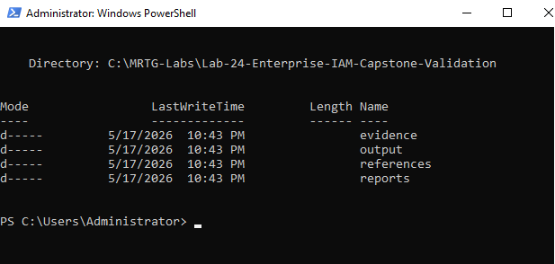

## Core Active Directory Validation

### 3. Validated Domain Health

Domain health was validated using `dcdiag` and `repadmin`.

Commands used:

```powershell
dcdiag /s:MRTG-DC01 /test:Advertising /test:Services /test:Replications /test:KnowsOfRoleHolders
repadmin /replsummary
```

Validation confirmed:

```text
DCDIAG passed:
- Connectivity
- Advertising
- KnowsOfRoleHolders
- Replications
- Services

REPADMIN passed:
- MRTG-DC01 failures: 0 / 5
- MRTG-DC02 failures: 0 / 5
```

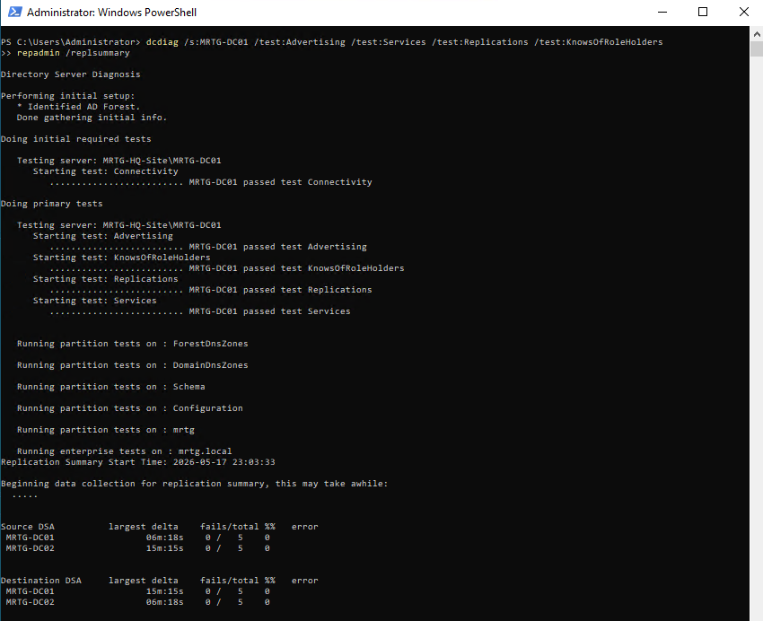

### 4. Validated Domain Controller Discovery and Replication

Domain controller discovery and detailed replication status were validated.

Commands used:

```powershell
nltest /dsgetdc:mrtg.local
$env:LOGONSERVER

Get-ADDomainController -Filter * |
Select-Object HostName,IPv4Address,Site,IsGlobalCatalog |
Format-Table -AutoSize

repadmin /showrepl MRTG-DC01
```

Validation confirmed:

| Domain Controller | IP Address | Site | Global Catalog |
|---|---|---|---|
| `MRTG-DC01.mrtg.local` | `192.168.10.10` | `MRTG-HQ-Site` | True |
| `MRTG-DC02.mrtg.local` | `192.168.10.11` | `MRTG-HQ-Site` | True |

Additional validation confirmed that replication attempts were successful.

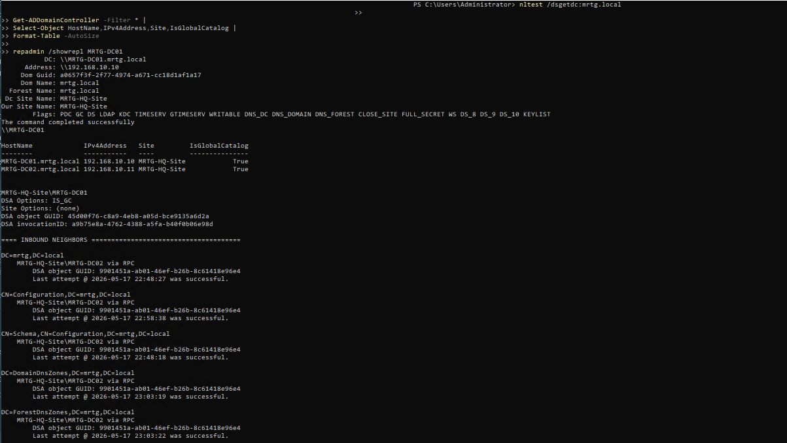

### 5. Validated FSMO and Domain Structure

FSMO role ownership, domain mode, and forest mode were validated.

Commands used:

```powershell
netdom query fsmo

Get-ADDomain |
Select-Object DNSRoot,DomainMode,InfrastructureMaster,PDCEmulator,RIDMaster |
Format-List

Get-ADForest |
Select-Object Name,ForestMode,SchemaMaster,DomainNamingMaster |
Format-List
```

Validation confirmed:

| FSMO Role | Role Holder |
|---|---|
| Schema Master | `MRTG-DC01.mrtg.local` |
| Domain Naming Master | `MRTG-DC01.mrtg.local` |
| PDC Emulator | `MRTG-DC01.mrtg.local` |
| RID Master | `MRTG-DC01.mrtg.local` |
| Infrastructure Master | `MRTG-DC01.mrtg.local` |

Domain and forest validation:

| Item | Value |
|---|---|
| DNS Root | `mrtg.local` |
| Domain Mode | `Windows2016Domain` |
| Forest Mode | `Windows2016Forest` |


## Identity Structure Validation

### 6. Validated OU, Group, and User Structure

Organizational Units, department groups, and user accounts were validated.

Commands used:

```powershell
Get-ADOrganizationalUnit -Filter * |
Select-Object Name,DistinguishedName |
Sort-Object Name |
Format-Table -AutoSize

Get-ADGroup -Filter 'Name -like "GG_*_Users"' |
Select-Object Name,GroupScope,GroupCategory,DistinguishedName |
Sort-Object Name |
Format-Table -AutoSize

Get-ADUser -Filter * -Properties Enabled,Department,Title |
Select-Object Name,SamAccountName,Enabled,Department,Title |
Sort-Object Name |
Format-Table -AutoSize
```

Validation confirmed:

- Department OUs exist
- Computer OUs exist
- Groups OU exists
- Service Accounts OU exists
- Department-based `GG_*_Users` groups exist
- Admin, service, and standard user accounts are visible
- `maya.reed` remains disabled from the Lab 20 leaver workflow
- `ethan.walker` is active in the Security department after the mover workflow

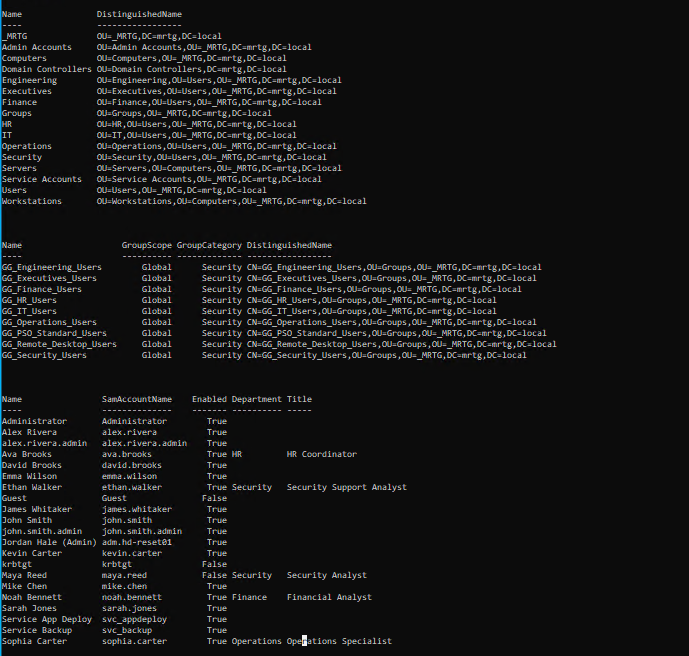

## Policy and Access Control Validation

### 7. Validated GPO and Security Baselines

Group Policy Objects and security baseline inheritance were validated.

Commands used:

```powershell
Get-GPO -All |
Select-Object DisplayName,GpoStatus,CreationTime,ModificationTime |
Sort-Object DisplayName |
Format-Table -AutoSize
```

```powershell
Get-GPInheritance -Target "OU=Workstations,OU=Computers,OU=_MRTG,DC=mrtg,DC=local"

Get-GPInheritance -Target "OU=Servers,OU=Computers,OU=_MRTG,DC=mrtg,DC=local"
```

Validated GPOs included:

```text
Default Domain Controllers Policy
Default Domain Policy
MRTG-DC-Identity-Auditing
MRTG-DC-Logon-Validation
MRTG-GPO-Centralized-Event-Forwarding
MRTG-GPO-Server-Security-Baseline
MRTG-GPO-Windows-LAPS-Workstation-Baseline
MRTG-GPO-Workstation-Security-Baseline
MRTG-User-Session-Lock
MRTG-Workstation-Baseline
```

Validated inheritance included:

| OU | Linked / Inherited GPOs |
|---|---|
| Workstations | `MRTG-GPO-Workstation-Security-Baseline`, `MRTG-GPO-Windows-LAPS-Workstation-Baseline`, `Default Domain Policy` |
| Servers | `MRTG-GPO-Server-Security-Baseline`, `Default Domain Policy` |

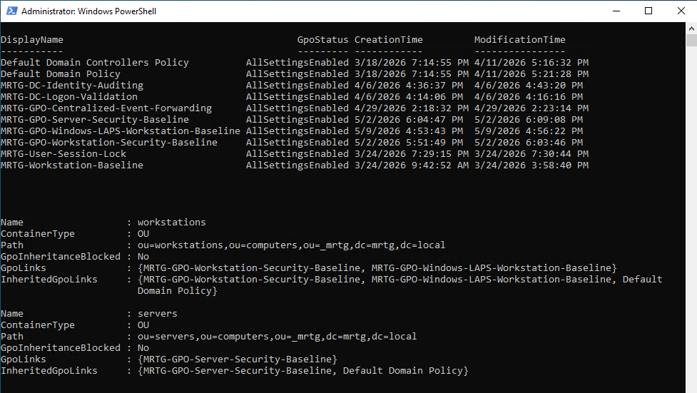

### 8. Validated Delegation and Privileged Groups

Delegated administration and privileged group membership were validated.

Commands used:

```powershell
Get-ADGroup -Filter 'Name -like "*Admin*" -or Name -like "*Delegat*" -or Name -like "*Tier*"' |
Select-Object Name,GroupScope,GroupCategory,DistinguishedName |
Sort-Object Name |
Format-Table -AutoSize
```

```powershell
Get-ADGroup -Filter 'Name -like "*Admin*" -or Name -like "*Delegat*" -or Name -like "*Tier*"' | ForEach-Object {
    $Group = $_.Name
    Get-ADGroupMember $Group -ErrorAction SilentlyContinue | ForEach-Object {
        [PSCustomObject]@{
            GroupName      = $Group
            MemberName     = $_.Name
            SamAccountName = $_.SamAccountName
            ObjectClass    = $_.ObjectClass
        }
    }
} | Format-Table -AutoSize
```

Validation confirmed:

| Group | Member |
|---|---|
| Administrators | Domain Admins |
| Administrators | Enterprise Admins |
| Administrators | Administrator |
| Schema Admins | Administrator |
| Enterprise Admins | Administrator |
| Domain Admins | Administrator |
| `GG_IT_HelpDesk_Admins` | `john.smith.admin` |
| `GG_PSO_Privileged_Admins` | `john.smith.admin` |
| `MRTG-GRP-Helpdesk-Password-Reset-Delegated` | `adm.hd-reset01` |

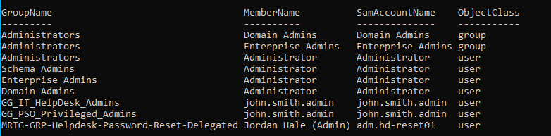

### 9. Validated LAPS and Endpoint Security Groups

LAPS-related and endpoint security groups were validated.

Commands used:

```powershell
Get-ADGroup -Filter 'Name -like "*LAPS*" -or Name -like "*Security*" -or Name -like "*Privileged*"' |
Select-Object Name,GroupScope,GroupCategory,DistinguishedName |
Sort-Object Name |
Format-Table -AutoSize
```

```powershell
Get-ADGroup -Filter 'Name -like "*LAPS*" -or Name -like "*Security*" -or Name -like "*Privileged*"' | ForEach-Object {
    $Group = $_.Name
    Get-ADGroupMember $Group -ErrorAction SilentlyContinue | ForEach-Object {
        [PSCustomObject]@{
            GroupName      = $Group
            MemberName     = $_.Name
            SamAccountName = $_.SamAccountName
            ObjectClass    = $_.ObjectClass
        }
    }
} | Format-Table -AutoSize
```

Validation confirmed:

| Group | Member(s) |
|---|---|
| `GG_Security_Users` | Alex Rivera, Ethan Walker |
| `GG_PSO_Privileged_Admins` | `john.smith.admin` |
| `MRTG-GRP-LAPS-Password-Readers` | Administrator |

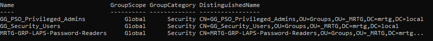

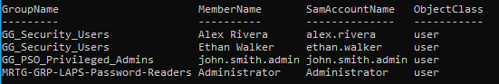

## Enterprise Trust Services Validation

### 10. Validated AD CS Enterprise CA

Active Directory Certificate Services was validated.

Commands used:

```powershell
Get-Service CertSvc

certutil -config "MRTG-DC01\MRTG-DC01-CA" -ping

certutil -catemplates
```

Validation confirmed:

```text
CertSvc is running
CA config: MRTG-DC01\MRTG-DC01-CA
Certificate Services RPC interface is alive
certutil -ping completed successfully
certutil -catemplates completed successfully
```

The `Access is denied` messages shown for some certificate templates were not treated as CA service failures. The capstone validation focused on confirming that the Enterprise CA service was running, reachable, and responding to `certutil`.

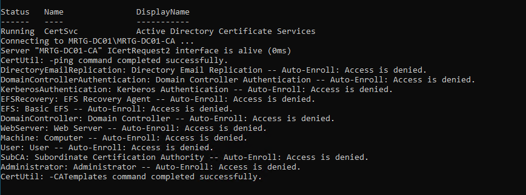

## Identity Lifecycle Automation Validation

### 11. Validated Identity Lifecycle Automation Artifacts

Identity lifecycle automation artifacts from Lab 20 were validated.

Commands used:

```powershell
$Lab20 = "C:\MRTG-Labs\Lab-20-Identity-Lifecycle-Automation"

Get-ChildItem "$Lab20\scripts"
Get-ChildItem "$Lab20\data"
Get-ChildItem "$Lab20\output"

Import-Csv "$Lab20\output\joiner-results.csv" |
Select-Object SamAccountName,UserStatus,GroupStatus,Result |
Format-Table -AutoSize

Import-Csv "$Lab20\output\mover-results.csv" |
Select-Object SamAccountName,NewDepartment,NewGroupName,Result |
Format-Table -AutoSize

Import-Csv "$Lab20\output\leaver-results.csv" |
Select-Object SamAccountName,AccountStatus,GroupStatus,Result |
Format-Table -AutoSize
```

Validated scripts:

```text
New-MRTGUsers.ps1
Move-MRTGUser.ps1
Disable-MRTGUser.ps1
```

Validated input files:

```text
new-users.csv
mover-users.csv
leaver-users.csv
```

Validated output files:

```text
joiner-results.csv
mover-results.csv
leaver-results.csv
```

Workflow validation:

| Workflow | Result |
|---|---|
| Joiner | Success |
| Mover | Success |
| Leaver | Success |

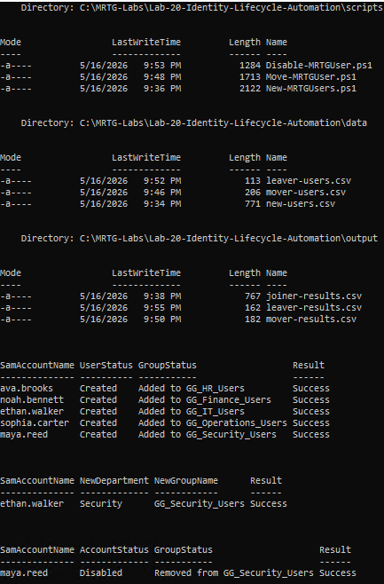

## Recovery, Audit, and Handoff Validation

### 12. Validated Backup, Recovery, and Audit Artifacts

Recovery artifacts from Lab 21 and audit artifacts from Lab 22 were validated.

Commands used:

```powershell
$Lab21 = "C:\MRTG-Labs\Lab-21-Directory-Recovery-Backup-Operational-Resilience"
$Lab22 = "C:\MRTG-Labs\Lab-22-IAM-Security-Review-and-Access-Control-Audit"

Write-Host "Lab 21 Recovery Artifacts"
Get-ChildItem "$Lab21\output"
Get-ChildItem "$Lab21\gpo-backup" | Select-Object -First 5 Name,LastWriteTime
Get-ChildItem "$Lab21\runbook"

Write-Host "`nLab 22 Audit Artifacts"
Get-ChildItem "$Lab22\output"
Get-ChildItem "$Lab22\reports"
```

Lab 21 recovery artifacts validated:

```text
ad-group-inventory.csv
ad-ou-inventory.csv
ad-user-inventory.csv
gpo-inventory.csv
privileged-group-membership.csv
GPO backup folders
MRTG-Directory-Recovery-Runbook.md
```

Lab 22 audit artifacts validated:

```text
adcs-groups-review.csv
delegated-admin-groups-review.csv
department-groups-review.csv
disabled-accounts-review.csv
domain-admins-review.csv
laps-security-groups-review.csv
privileged-groups-review.csv
user-account-review.csv
MRTG-IAM-Security-Review-Summary.md
```

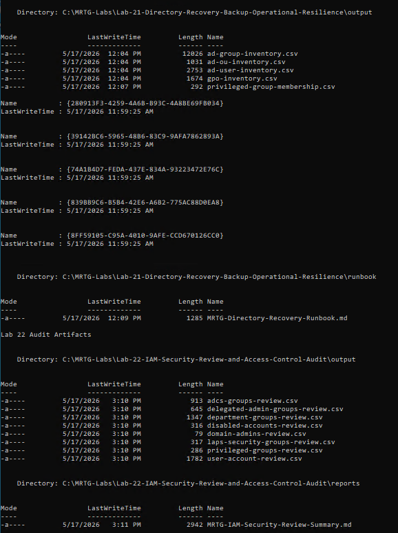

### 13. Validated Operational Handoff Package

The operational handoff package from Lab 23 was validated.

Commands used:

```powershell
$Lab23 = "C:\MRTG-Labs\Lab-23-IAM-Runbooks-SOPs-Operational-Handoff"

Get-ChildItem "$Lab23\sops"
Get-ChildItem "$Lab23\runbooks"
Get-ChildItem "$Lab23\handoff"
Get-ChildItem "$Lab23\references"
```

Validated SOPs:

```text
MRTG-Access-Request-SOP.md
MRTG-Joiner-Mover-Leaver-SOP.md
MRTG-Password-Reset-SOP.md
MRTG-Privileged-Access-Review-SOP.md
```

Validated runbooks:

```text
MRTG-Directory-Recovery-Reference.md
```

Validated handoff documents:

```text
MRTG-Admin-Responsibility-Matrix.md
MRTG-IAM-Documentation-Index.md
MRTG-Operational-Handoff-Summary.md
```

Validated references:

```text
Lab-20-Identity-Lifecycle-Output
Lab-21-Recovery-Runbook
Lab-22-Audit-Exports
Lab-22-Security-Review-Reports
```

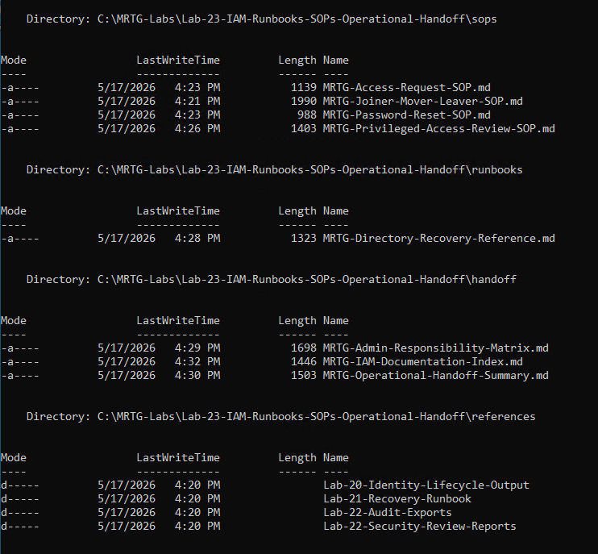

## Capstone Report

### 14. Created Capstone Validation Summary

A final capstone validation summary was created.

Report file:

```text
C:\MRTG-Labs\Lab-24-Enterprise-IAM-Capstone-Validation\reports\MRTG-Enterprise-IAM-Capstone-Validation-Summary.md
```

The report summarized:

- Domain controller health
- Domain controller discovery
- Active Directory replication
- FSMO role ownership
- OU, group, and user structure
- Group Policy and security baselines
- Delegated administration and privileged groups
- Windows LAPS and endpoint security groups
- Active Directory Certificate Services
- Identity lifecycle automation artifacts
- Backup and recovery artifacts
- IAM audit evidence
- Operational handoff documentation


## Validation Summary

| Test | Expected Result | Actual Result | Status |
|---|---|---|---|
| Pre-lab checkpoint created | Checkpoint exists before Lab 24 validation | Pre-lab checkpoint created | Passed |
| Lab folder structure created | Required folders exist | Folder structure validated | Passed |
| Domain health validated | DCDIAG tests pass | Health checks passed | Passed |
| Replication validated | Replication failures show `0 / 5` | Replication validated | Passed |
| Domain controller discovery validated | Domain controllers discoverable | DC01 and DC02 discovered | Passed |
| FSMO roles validated | FSMO role ownership documented | Roles held by DC01 | Passed |
| Domain and forest structure validated | Domain/forest details visible | Domain and forest validated | Passed |
| OU, group, and user structure validated | Identity structure visible | Structure validated | Passed |
| GPO and security baselines validated | GPOs and inheritance visible | Baselines validated | Passed |
| Delegation and privileged groups validated | Admin/delegation memberships visible | Memberships validated | Passed |
| LAPS/security groups validated | LAPS and security groups visible | Groups validated | Passed |
| AD CS Enterprise CA validated | CA service running and responding | CA validated | Passed |
| Lifecycle automation artifacts validated | Scripts, data, and output files exist | Artifacts validated | Passed |
| Backup and recovery artifacts validated | Recovery evidence exists | Artifacts validated | Passed |
| IAM audit evidence validated | Audit exports and report exist | Evidence validated | Passed |
| Operational handoff validated | SOPs, runbooks, handoff docs exist | Handoff validated | Passed |
| Capstone summary created | Final summary report exists | Report created | Passed |
| Post-lab checkpoint created | Checkpoint exists after Lab 24 validation | Post-lab checkpoint created | Passed |

## Post-Lab Checkpoint

A post-lab checkpoint was created after completing the Enterprise IAM Capstone Validation.

Checkpoint name:

```text
MRTG-DC01_Post-Lab-24-Enterprise-IAM-Capstone-Validation
```


## Outcome

Lab 24 successfully validated the MRTG Enterprise IAM Lab Series as one connected identity environment.

The capstone confirmed that the environment includes healthy domain controllers, working replication, documented FSMO roles, structured OUs, users, and groups, Group Policy security baselines, delegated administration, Windows LAPS-related access control, AD CS Enterprise CA functionality, lifecycle automation evidence, backup and recovery artifacts, IAM audit evidence, and operational handoff documentation.

The final result was a validated enterprise IAM lab environment that demonstrates the full identity administration lifecycle from infrastructure foundation to operational handoff.

## Skills Demonstrated

- Enterprise IAM capstone validation
- Active Directory health validation
- Domain controller discovery
- Replication validation
- FSMO role validation
- OU, group, and user structure review
- Group Policy validation
- Security baseline validation
- Delegated administration validation
- Privileged access validation
- Windows LAPS group validation
- AD CS Enterprise CA validation
- Identity lifecycle automation validation
- Backup and recovery evidence validation
- IAM audit evidence validation
- Operational handoff validation
- PowerShell-based enterprise validation
- Documentation and evidence review

## Real-World Relevance

Enterprise IAM work is not complete just because individual pieces are configured.

In real organizations, identity systems must work together. Domain controllers need to be healthy, replication needs to function, groups and OUs need to be structured, GPOs need to apply, privileged access needs to be controlled, certificates need to support trust, automation needs to produce evidence, backups need to exist, audits need to be documented, and handoff material needs to be available.

This lab connects directly to real-world IAM, GovTech, and regulated IT environments because it demonstrates:

- Environment-wide validation
- Evidence-based administration
- Operational readiness
- Security control review
- Recovery readiness
- Audit readiness
- Handoff readiness
- Repeatable validation using PowerShell

The key lesson is that mature IAM is not one tool or one task. It is a connected operating model.

## Security Considerations

This lab validated the final state of the MRTG IAM environment but did not make major configuration changes.

In a production environment, capstone-style validation would be tied to formal control checks, change records, access review evidence, backup validation, incident response documentation, and compliance requirements.

Production-ready improvements would include:

- Formal IAM control mapping
- Baseline comparison against approved architecture
- Automated daily AD health checks
- Scheduled privileged access reviews
- SIEM integration for identity events
- Centralized GPO backup retention
- Formal certificate template review
- Backup restore testing in an isolated environment
- Automated user lifecycle reporting
- Break-glass account validation
- Disaster recovery tabletop exercises
- Documentation stored in a controlled repository
- Ticket references for major changes
- Quarterly access review cycles
- Audit evidence retention policy

## Lessons Learned

- A healthy domain is the foundation of every IAM process.
- Replication must be validated before relying on directory state.
- FSMO role ownership should be known and documented.
- OU, user, and group structure must stay visible and reviewable.
- GPOs and security baselines must be validated as part of the identity environment.
- Delegated admin groups support least privilege when properly reviewed.
- LAPS password reader groups should be treated as privileged access.
- AD CS is part of enterprise trust and should be validated.
- Identity automation is stronger when scripts, inputs, and outputs are retained.
- Backup, recovery, and audit artifacts are part of operational maturity.
- Handoff documentation makes the environment supportable by someone else.
- A capstone validation proves the lab series works as a connected system.

## What I Would Do Differently

In a production or government-regulated environment, I would expand this capstone into a formal IAM operational readiness review.

A stronger production design would include:

- Control mapping to organizational security requirements
- Evidence retention standards
- Automated reporting
- Scheduled access reviews
- Change management references
- Formal system owner sign-off
- Service account ownership review
- Certificate template permission review
- GPO backup schedule
- Recovery testing schedule
- Privileged access monitoring
- Identity event forwarding to a SIEM
- Formal SOP review and approval workflow
- Quarterly operational readiness checks
- Annual disaster recovery exercise

For this lab, the goal was to validate the full MRTG Enterprise IAM Lab Series as a connected, documented, and operationally supportable identity environment.

## Series Completion

The MRTG Enterprise IAM Lab Series is complete.

This series demonstrated:

```text
Identity infrastructure
Active Directory administration
OU and group design
Group Policy enforcement
Password and account lockout policy
DHCP integration
Replication topology
Centralized logging
Security baselines
Delegation of control
Windows LAPS
Group-based access control
Active Directory Certificate Services
Identity lifecycle automation
Directory backup and recovery
IAM security review
Operational handoff
Enterprise IAM capstone validation
```

The completed series shows a practical, enterprise-style IAM environment built from the ground up and validated through security, automation, recovery, audit, and operations.
