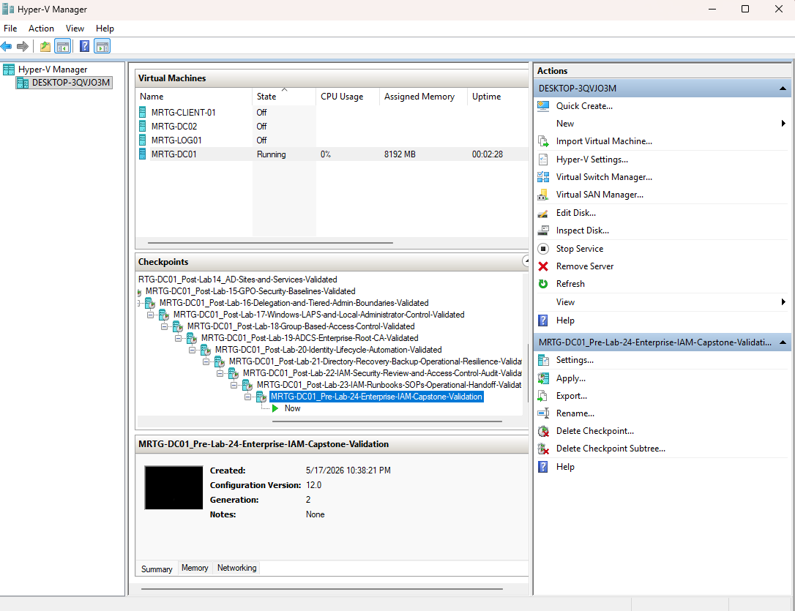
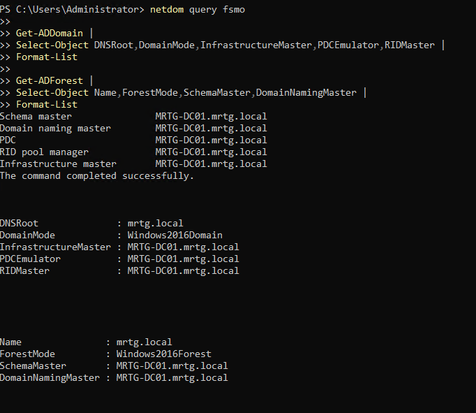
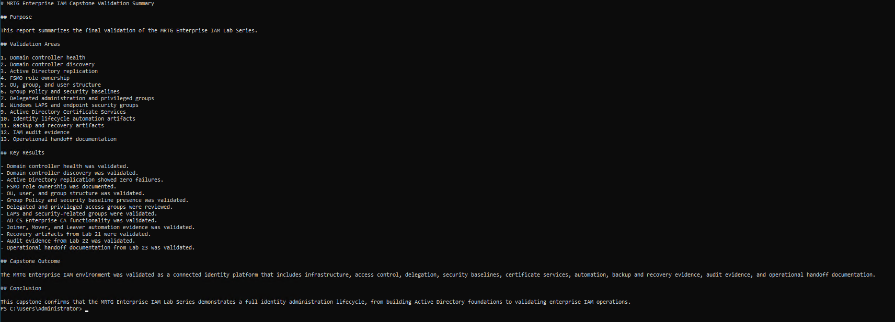
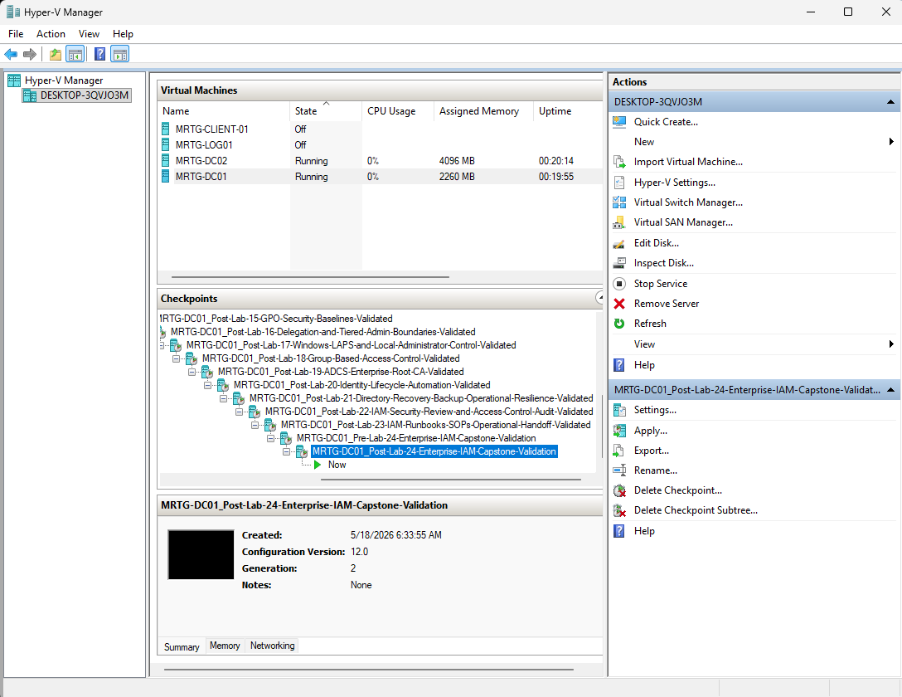

# Lab 24: Enterprise IAM Capstone Validation


---

## Objective

Perform a capstone review of the MRTG Active Directory and IAM foundation created across Labs 01 through 23.

This lab reviews domain health, replication, FSMO roles, directory structure, Group Policy, delegated administration, Windows LAPS groups, Active Directory Certificate Services, lifecycle automation, recovery artifacts, audit evidence, and operational documentation.

The goal is to evaluate the environment as a connected identity system while clearly separating live technical validation from artifact-presence review.

---

## Business Scenario

Monroe Redstone Technology Group requires an integrated review of its identity environment after completing the original foundation series.

Individual configurations may appear successful while dependencies remain unhealthy, untested, or undocumented.

A mature IAM environment requires:

- Healthy directory services
- Working replication
- Structured identity objects
- Controlled administrative access
- Applied security policy
- Managed local credentials
- Internal trust services
- Repeatable lifecycle operations
- Recovery preparation
- Access-review evidence
- Operational documentation

This capstone reviews those areas and documents remaining production-readiness gaps.

---

## Lab Summary

In this lab, I created a dedicated capstone workspace and reviewed the MRTG identity foundation.

Live technical validation covered:

- Selected domain-controller health tests
- Domain-controller discovery
- Active Directory replication
- FSMO role ownership
- Domain and forest configuration
- OU, user, and group inventory
- Group Policy links and inheritance
- Privileged and delegated group membership
- AD CS service and RPC availability

Artifact review covered:

- Identity lifecycle scripts, inputs, and result files
- Recovery inventory, GPO backups, and runbook
- IAM audit exports and review summary
- Operational SOPs, references, and handoff documents

A capstone summary was created to document results and limitations.

This lab completed the original 24-lab IAM foundation. Labs 25 through 30 later extended the environment into service account governance, encryption recovery, local administrator remediation, SIEM monitoring, and operational governance.

---

## Environment

| Component | Details |
|---|---|
| Organization | Monroe Redstone Technology Group |
| Domain | `mrtg.local` |
| Original Domain Controller | `MRTG-DC01` |
| Additional Domain Controller | `MRTG-DC02` |
| Active Directory Site | `MRTG-HQ-Site` |
| Domain Mode | `Windows2016Domain` |
| Forest Mode | `Windows2016Forest` |
| Enterprise CA | `MRTG-DC01\MRTG-DC01-CA` |
| Lab Root | `C:\MRTG-Labs\Lab-24-Enterprise-IAM-Capstone-Validation` |
| Output Folder | `output` |
| Evidence Folder | `evidence` |
| Reports Folder | `reports` |
| References Folder | `references` |
| Tools | PowerShell, `dcdiag`, `repadmin`, `nltest`, `netdom`, and `certutil` |
| Hypervisor | Hyper-V |

---

## Prerequisites

- Completed Labs 01 through 23
- Operational `mrtg.local` domain
- Both domain controllers online
- Active Directory PowerShell module
- Group Policy PowerShell module
- Access to previous lifecycle, recovery, audit, and handoff artifacts
- Administrative read access
- Defined capstone validation criteria

---

## Scope

### Included

- Selected domain-controller health tests
- Domain-controller discovery
- Replication review
- FSMO role review
- Domain and forest configuration review
- OU, user, and group inventory
- GPO inventory and inheritance review
- Privileged and delegated group review
- LAPS-related group review
- AD CS service and RPC validation
- Lifecycle-artifact inventory
- Recovery-artifact inventory
- Audit-evidence inventory
- Handoff-document inventory
- Capstone-summary creation
- Temporary Hyper-V checkpoints

### Not Included

- Full production-readiness certification
- Complete security-control assessment
- Penetration testing
- Business-owner access certification
- Functional LAPS password-retrieval testing
- Certificate-enrollment testing
- Certificate-template security review
- System State restore
- Forest-recovery exercise
- Lifecycle-script re-execution
- SOP walkthrough with another administrator
- SIEM validation
- Disaster-recovery exercise
- Formal compliance assessment

---

## Capstone Model

```text
Validate Directory Infrastructure
              |
              v
Review Identity and Access Structure
              |
              v
Review Security Services
              |
              v
Inventory Automation Artifacts
              |
              v
Inventory Recovery Evidence
              |
              v
Inventory Audit Evidence
              |
              v
Inventory Handoff Documentation
              |
              v
Document Results and Gaps
```

---

## Validation Levels

| Level | Meaning |
|---|---|
| Live Technical Validation | A service, command, or directory state was actively queried |
| Configuration Review | A GPO, group, object, or setting was confirmed present |
| Artifact Review | A file or folder from an earlier lab was confirmed present |
| Functional Test | An end-to-end action was performed and its result validated |
| Not Tested | The control was outside this capstone's scope |

Presence of an artifact does not prove that its associated recovery or operational process works.

---

## Validation Areas

| Area | Validation Type | Purpose |
|---|---|---|
| Domain Health | Live technical validation | Review selected domain-controller services |
| Replication | Live technical validation | Confirm directory partitions replicate |
| FSMO Roles | Live technical validation | Document role ownership |
| Identity Structure | Configuration review | Confirm OUs, users, and groups exist |
| Group Policy | Configuration review | Confirm GPOs and OU inheritance |
| Privileged Access | Configuration review | Review selected group membership |
| Windows LAPS | Configuration review | Confirm related groups exist |
| AD CS | Live availability validation | Confirm CA service and RPC response |
| Lifecycle Automation | Artifact review | Confirm scripts, inputs, and reports exist |
| Recovery | Artifact review | Confirm backup references and runbooks exist |
| IAM Audit | Artifact review | Confirm exported evidence and summary exist |
| Operational Handoff | Artifact review | Confirm SOPs and handoff documents exist |

---

## Implementation and Validation

### 1. Created a Pre-Review Lab Checkpoint

Checkpoint name:

```text
MRTG-DC01_Pre-Lab-24-Enterprise-IAM-Capstone-Validation
```



The checkpoint was a temporary lab tool and was not part of the validation evidence or backup strategy.

---

### 2. Created the Capstone Workspace

```text
C:\MRTG-Labs\Lab-24-Enterprise-IAM-Capstone-Validation
|-- evidence
|-- output
|-- references
`-- reports
```


---

## Core Directory Validation

### 3. Reviewed Domain Health

Commands used:

```cmd
dcdiag /s:MRTG-DC01 /test:Advertising /test:Services /test:Replications /test:KnowsOfRoleHolders
repadmin /replsummary
```


Validated results included:

```text
MRTG-DC01 replication failures: 0 / 5
MRTG-DC02 replication failures: 0 / 5
```

The selected `dcdiag` tests passed.

This was a focused health review rather than a complete domain, DNS, security, performance, or application assessment.

---

### 4. Validated Domain Controller Discovery and Replication

Commands used:

```powershell
nltest /dsgetdc:mrtg.local
$env:LOGONSERVER

Get-ADDomainController -Filter * |
    Select-Object HostName, IPv4Address, Site, IsGlobalCatalog |
    Format-Table -AutoSize

repadmin /showrepl MRTG-DC01
```


| Domain Controller | Address | Site | Global Catalog |
|---|---:|---|---|
| `MRTG-DC01.mrtg.local` | `192.168.10.10` | `MRTG-HQ-Site` | True |
| `MRTG-DC02.mrtg.local` | `192.168.10.11` | `MRTG-HQ-Site` | True |

Inbound replication for `MRTG-DC01` completed successfully for the reviewed directory partitions.

Both domain controllers share one physical Hyper-V host, so the environment has service-level redundancy but not host-level resilience.

---

### 5. Validated FSMO Roles and Directory Modes

Commands used:

```powershell
netdom query fsmo

Get-ADDomain |
    Select-Object DNSRoot, DomainMode, InfrastructureMaster, PDCEmulator, RIDMaster |
    Format-List

Get-ADForest |
    Select-Object Name, ForestMode, SchemaMaster, DomainNamingMaster |
    Format-List
```



| FSMO Role | Role Holder |
|---|---|
| Schema Master | `MRTG-DC01.mrtg.local` |
| Domain Naming Master | `MRTG-DC01.mrtg.local` |
| PDC Emulator | `MRTG-DC01.mrtg.local` |
| RID Master | `MRTG-DC01.mrtg.local` |
| Infrastructure Master | `MRTG-DC01.mrtg.local` |

| Directory Setting | Value |
|---|---|
| DNS Root | `mrtg.local` |
| Domain Mode | `Windows2016Domain` |
| Forest Mode | `Windows2016Forest` |

---

## Identity Structure Validation

### 6. Reviewed OUs, Groups, and Users

Commands used:

```powershell
Get-ADOrganizationalUnit -Filter * |
    Select-Object Name, DistinguishedName |
    Sort-Object Name |
    Format-Table -AutoSize

Get-ADGroup -Filter 'Name -like "GG_*_Users"' |
    Select-Object Name, GroupScope, GroupCategory, DistinguishedName |
    Sort-Object Name |
    Format-Table -AutoSize

Get-ADUser -Filter * -Properties Enabled, Department, Title |
    Select-Object Name, SamAccountName, Enabled, Department, Title |
    Sort-Object Name |
    Format-Table -AutoSize
```


The review confirmed:

- Department OUs existed
- Workstation and server OUs existed
- Groups and service-account OUs existed
- Department `GG_*_Users` groups existed
- Standard, administrative, and service identities were visible
- `maya.reed` remained disabled
- `ethan.walker` remained assigned to Security

Object visibility confirms directory state, not business approval or complete effective access.

---

## Policy and Access Control Validation

### 7. Reviewed GPOs and OU Inheritance

Commands used:

```powershell
Get-GPO -All |
    Select-Object DisplayName, GpoStatus, CreationTime, ModificationTime |
    Sort-Object DisplayName |
    Format-Table -AutoSize

Get-GPInheritance -Target "OU=Workstations,OU=Computers,OU=_MRTG,DC=mrtg,DC=local"

Get-GPInheritance -Target "OU=Servers,OU=Computers,OU=_MRTG,DC=mrtg,DC=local"
```


Reviewed GPOs included:

```text
Default Domain Controllers Policy
Default Domain Policy
MRTG-DC-Identity-Auditing
MRTG-DC-Logon-Validation
MRTG-GPO-Centralized-Event-Forwarding
MRTG-GPO-Server-Security-Baseline
MRTG-GPO-Windows-LAPS-Workstation-Baseline
MRTG-GPO-Workstation-Security-Baseline
MRTG-User-Session-Lock
MRTG-Workstation-Baseline
```

| OU | Reviewed GPO Scope |
|---|---|
| Workstations | Workstation baseline, Windows LAPS baseline, and Default Domain Policy |
| Servers | Server baseline and Default Domain Policy |

This confirmed GPO presence and inheritance. It did not prove that every endpoint applied every setting or that each setting produced its intended result.

---

### 8. Reviewed Delegated and Privileged Groups

Command used:

```powershell
Get-ADGroup -Filter 'Name -like "*Admin*" -or Name -like "*Delegat*" -or Name -like "*Tier*"' |
    ForEach-Object {
        $GroupName = $_.Name

        Get-ADGroupMember $GroupName -ErrorAction SilentlyContinue |
            ForEach-Object {
                [PSCustomObject]@{
                    GroupName      = $GroupName
                    MemberName     = $_.Name
                    SamAccountName = $_.SamAccountName
                    ObjectClass    = $_.ObjectClass
                }
            }
    } | Format-Table -AutoSize
```


| Group | Observed Member |
|---|---|
| Administrators | Domain Admins |
| Administrators | Enterprise Admins |
| Administrators | Administrator |
| Schema Admins | Administrator |
| Enterprise Admins | Administrator |
| Domain Admins | Administrator |
| `GG_IT_HelpDesk_Admins` | `john.smith.admin` |
| `GG_PSO_Privileged_Admins` | `john.smith.admin` |
| `MRTG-GRP-Helpdesk-Password-Reset-Delegated` | `adm.hd-reset01` |

Delegated Help Desk accounts remained separate from Domain Admins.

Standing Enterprise Admins and Schema Admins membership should be removed or tightly controlled outside approved forest-level work in a production environment.

---

### 9. Listed LAPS and Security-Related Groups

Command used:

```powershell
Get-ADGroup -Filter 'Name -like "*LAPS*" -or Name -like "*Security*" -or Name -like "*Privileged*"' |
    Select-Object Name, GroupScope, GroupCategory, DistinguishedName |
    Sort-Object Name |
    Format-Table -AutoSize
```


Reviewed groups included:

```text
GG_PSO_Privileged_Admins
GG_Security_Users
MRTG-GRP-LAPS-Password-Readers
```

A name-based query is useful for inventory but does not prove effective permissions or discover every security-sensitive group.

---

### 10. Reviewed LAPS and Security Group Membership

Command used:

```powershell
Get-ADGroup -Filter 'Name -like "*LAPS*" -or Name -like "*Security*" -or Name -like "*Privileged*"' |
    ForEach-Object {
        $GroupName = $_.Name

        Get-ADGroupMember $GroupName -ErrorAction SilentlyContinue |
            ForEach-Object {
                [PSCustomObject]@{
                    GroupName      = $GroupName
                    MemberName     = $_.Name
                    SamAccountName = $_.SamAccountName
                    ObjectClass    = $_.ObjectClass
                }
            }
    } | Format-Table -AutoSize
```


| Group | Observed Members |
|---|---|
| `GG_Security_Users` | Alex Rivera and Ethan Walker |
| `GG_PSO_Privileged_Admins` | `john.smith.admin` |
| `MRTG-GRP-LAPS-Password-Readers` | Administrator |

This confirmed group membership only.

It did not functionally test LAPS retrieval with an approved least-privilege reader or validate the extended-rights ACL on the Workstations OU.

---

## Enterprise Trust Services

### 11. Validated AD CS Availability

Commands used:

```powershell
Get-Service CertSvc

certutil -config "MRTG-DC01\MRTG-DC01-CA" -ping

certutil -catemplates
```


Validated results included:

```text
CertSvc status: Running
CA configuration: MRTG-DC01\MRTG-DC01-CA
Certificate Services RPC interface: Alive
certutil -ping: Completed successfully
certutil -catemplates: Completed
```

Some templates returned `Access is denied` for the current security context.

This confirmed CA service and RPC availability. It did not validate certificate enrollment, autoenrollment, revocation, template security, or issuance policy.

---

## Lifecycle Automation Artifacts

### 12. Reviewed Lab 20 Automation Files

Commands used:

```powershell
$Lab20 = "C:\MRTG-Labs\Lab-20-Identity-Lifecycle-Automation"

Get-ChildItem "$Lab20\scripts"
Get-ChildItem "$Lab20\data"
Get-ChildItem "$Lab20\output"

Import-Csv "$Lab20\output\joiner-results.csv"
Import-Csv "$Lab20\output\mover-results.csv"
Import-Csv "$Lab20\output\leaver-results.csv"
```


Reviewed scripts:

```text
New-MRTGUsers.ps1
Move-MRTGUser.ps1
Disable-MRTGUser.ps1
```

Reviewed input files:

```text
new-users.csv
mover-users.csv
leaver-users.csv
```

Reviewed output files:

```text
joiner-results.csv
mover-results.csv
leaver-results.csv
```

The files reported successful results from Lab 20.

This capstone did not rerun the scripts, validate code integrity, or prove that the workflows remained safe and repeatable.

---

## Recovery and Audit Artifacts

### 13. Reviewed Labs 21 and 22 Artifacts

Commands used:

```powershell
$Lab21 = "C:\MRTG-Labs\Lab-21-Directory-Recovery-Backup-Operational-Resilience"
$Lab22 = "C:\MRTG-Labs\Lab-22-IAM-Security-Review-and-Access-Control-Audit"

Get-ChildItem "$Lab21\output"
Get-ChildItem "$Lab21\gpo-backup"
Get-ChildItem "$Lab21\runbook"

Get-ChildItem "$Lab22\output"
Get-ChildItem "$Lab22\reports"
```


Reviewed Lab 21 artifacts included:

```text
ad-group-inventory.csv
ad-ou-inventory.csv
ad-user-inventory.csv
gpo-inventory.csv
privileged-group-membership.csv
GPO backup folders
MRTG-Directory-Recovery-Runbook.md
```

Reviewed Lab 22 artifacts included:

```text
adcs-groups-review.csv
delegated-admin-groups-review.csv
department-groups-review.csv
disabled-accounts-review.csv
domain-admins-review.csv
laps-security-groups-review.csv
privileged-groups-review.csv
user-account-review.csv
MRTG-IAM-Security-Review-Summary.md
```

File presence did not prove restore success, evidence integrity, owner certification, or remediation completion.

---

## Operational Handoff Artifacts

### 14. Reviewed the Lab 23 Handoff Package

Commands used:

```powershell
$Lab23 = "C:\MRTG-Labs\Lab-23-IAM-Runbooks-SOPs-Operational-Handoff"

Get-ChildItem "$Lab23\sops"
Get-ChildItem "$Lab23\runbooks"
Get-ChildItem "$Lab23\handoff"
Get-ChildItem "$Lab23\references"
```


Reviewed SOPs:

```text
MRTG-Access-Request-SOP.md
MRTG-Joiner-Mover-Leaver-SOP.md
MRTG-Password-Reset-SOP.md
MRTG-Privileged-Access-Review-SOP.md
```

Reviewed recovery reference:

```text
MRTG-Directory-Recovery-Reference.md
```

Reviewed handoff documents:

```text
MRTG-Admin-Responsibility-Matrix.md
MRTG-IAM-Documentation-Index.md
MRTG-Operational-Handoff-Summary.md
```

The documents existed, but formal approval, version control, walkthrough testing, and procedure execution were not part of the capstone.

---

## Capstone Report

### 15. Created the Capstone Summary

Report:

```text
C:\MRTG-Labs\Lab-24-Enterprise-IAM-Capstone-Validation\reports\MRTG-Enterprise-IAM-Capstone-Validation-Summary.md
```



The report documented:

- Directory health
- Domain-controller discovery
- Replication
- FSMO ownership
- Identity structure
- Group Policy
- Privileged and delegated groups
- Windows LAPS groups
- AD CS availability
- Lifecycle artifacts
- Recovery artifacts
- Audit evidence
- Handoff documents
- Validation limitations
- Final foundation outcome

---

### 16. Created the Final Lab Checkpoint

Checkpoint name:

```text
MRTG-DC01_Post-Lab-24-Enterprise-IAM-Capstone-Validation
```



The checkpoint was a temporary lab tool and was not treated as backup or capstone evidence.

---

## Key Results

| Area | Result | Validation Level |
|---|---|---|
| Domain health | Selected tests passed | Live technical validation |
| Replication | Zero failures reported in summary | Live technical validation |
| Domain controllers | Both discovered as Global Catalog servers | Live technical validation |
| FSMO roles | All five documented on `MRTG-DC01` | Live technical validation |
| Identity structure | OUs, groups, users, and service accounts visible | Configuration review |
| Group Policy | Ten GPOs and inheritance reviewed | Configuration review |
| Delegated access | Group membership documented | Configuration review |
| Windows LAPS | Related groups and membership reviewed | Configuration review |
| AD CS | CA service and RPC interface available | Live availability validation |
| Identity automation | Scripts, inputs, and outputs present | Artifact review |
| Recovery | GPO backups, inventory, and runbook present | Artifact review |
| IAM audit | Eight exports and summary present | Artifact review |
| Handoff | SOPs and handoff documents present | Artifact review |

---

## Validation Results

| Validation Item | Result |
|---|---|
| Temporary pre-review checkpoint created | Passed |
| Capstone workspace created | Passed |
| Selected domain-health tests passed | Passed |
| Replication summary reported zero failures | Passed |
| Both domain controllers discovered | Passed |
| FSMO ownership documented | Passed |
| Domain and forest modes documented | Passed |
| Identity structure reviewed | Passed |
| GPO inventory reviewed | Passed |
| OU inheritance reviewed | Passed |
| Privileged and delegated groups reviewed | Passed |
| LAPS-related groups reviewed | Passed |
| CA service and RPC availability confirmed | Passed |
| Lifecycle artifacts present | Passed |
| Recovery artifacts present | Passed |
| IAM audit artifacts present | Passed |
| Handoff artifacts present | Passed |
| Capstone report created | Passed |
| Functional LAPS retrieval | Not tested |
| Certificate enrollment | Not tested |
| System State restore | Not tested |
| Lifecycle scripts rerun | Not tested |
| Handoff procedure walkthrough | Not tested |
| Formal production certification | Not performed |
| Temporary final checkpoint created | Passed |

---

## Security and IAM Relevance

This capstone demonstrates that IAM consists of connected technical and operational controls.

The review covered:

- Directory services
- Replication
- Identity organization
- Policy scope
- Privileged access
- Delegated administration
- Local credential governance
- Internal certificate trust
- Lifecycle automation
- Recovery preparation
- Access-review evidence
- Operational documentation

The capstone also demonstrates an important governance principle: a control should not be described as fully validated when only its configuration or artifact was reviewed.

---

## Risks and Gaps

The capstone identified or retained the following gaps:

- Both domain controllers share one physical host
- Standing Enterprise Admins and Schema Admins membership remained
- LAPS readers contained the broadly privileged Administrator account
- Least-privilege LAPS retrieval was not tested
- Certificate enrollment and revocation were not retested
- GPO inheritance did not prove endpoint enforcement
- Lifecycle scripts were not rerun
- System State restore was not tested
- Backup storage remained in the same host failure domain
- Audit CSV files were mutable local evidence
- Handoff documents were not formally approved or walkthrough-tested
- SIEM monitoring was outside the original foundation capstone

These limitations do not invalidate the lab. They define the boundary between completed learning validation and production readiness.

---

## Control Mapping

| Control Area | Capstone Contribution |
|---|---|
| Directory Health | Reviews domain-controller services and replication |
| Identity Governance | Reviews users, groups, OUs, and lifecycle states |
| Policy Governance | Reviews GPO inventory and inheritance |
| Privileged Access | Reviews administrative and delegated groups |
| Credential Governance | Reviews Windows LAPS-related groups |
| PKI Availability | Confirms CA service and RPC response |
| Lifecycle Operations | Reviews automation files and results |
| Recovery Preparation | Reviews backups, inventory, and runbook artifacts |
| Audit Readiness | Reviews access-review exports and summary |
| Operational Handoff | Reviews SOPs and ownership documents |
| Gap Management | Distinguishes tested controls from untested controls |

---

## Evidence Collected

| Evidence | Screenshot |
|---|---|
| Pre-review checkpoint | `screenshots/lab-24-01-pre-lab-24-checkpoint.png` |
| Capstone workspace | `screenshots/lab-24-02-folder-structure-created.png` |
| Domain-health validation | `screenshots/lab-24-03-domain-health-capstone-validated.png` |
| Domain-controller discovery and replication | `screenshots/lab-24-04-domain-controller-discovery-and-replication-validated.png` |
| FSMO roles and directory modes | `screenshots/lab-24-05-fsmo-and-domain-structure-validated.png` |
| OU, group, and user inventory | `screenshots/lab-24-06-ou-group-and-user-structure-validated.png` |
| GPO inventory and inheritance | `screenshots/lab-24-07-gpo-and-security-baselines-validated.png` |
| Delegated and privileged groups | `screenshots/lab-24-08-delegation-and-privileged-groups-validated.png` |
| LAPS-related groups | `screenshots/lab-24-09-laps-and-endpoint-security-groups-listed.png` |
| LAPS-related group membership | `screenshots/lab-24-10-laps-and-endpoint-security-group-membership-validated.png` |
| AD CS availability | `screenshots/lab-24-11-adcs-enterprise-ca-validated.png` |
| Lifecycle artifacts | `screenshots/lab-24-12-identity-lifecycle-automation-artifacts-validated.png` |
| Recovery and audit artifacts | `screenshots/lab-24-13-backup-recovery-and-audit-artifacts-validated.png` |
| Operational handoff artifacts | `screenshots/lab-24-14-operational-handoff-package-validated.png` |
| Capstone report | `screenshots/lab-24-15-capstone-validation-summary-created.png` |
| Final lab checkpoint | `screenshots/lab-24-16-post-lab-24-checkpoint.png` |

---

## What I Would Improve in Production

In a production environment, I would:

- Place domain controllers on separate hosts and failure domains
- Remove unnecessary standing forest-level privilege
- Use named least-privilege LAPS readers
- Validate LAPS extended rights and retrieval
- Test GPO settings on representative endpoints
- Review certificate-template security
- Test certificate enrollment, renewal, and revocation
- Sign and version-control lifecycle scripts
- Rerun lifecycle workflows in a controlled test environment
- Store backups off-host
- Maintain immutable backup copies
- Test System State and forest recovery
- Protect audit evidence with integrity and retention controls
- Integrate identity events with a SIEM
- Conduct business-owner access certification
- Formally approve and test SOPs
- Track findings through remediation
- Map controls to organizational requirements
- Obtain formal system-owner approval

---

## Lessons Learned

This lab reinforced the difference among configuration review, live service validation, functional testing, and artifact inventory.

A running service does not prove that every workflow works. A GPO link does not prove endpoint behavior. A backup file does not prove recoverability. A report file does not prove business approval.

The primary takeaway is that honest validation boundaries make documentation stronger.

The capstone also showed that IAM maturity depends on technology, governance, recovery, monitoring, evidence, and operational ownership working together.

---

## Outcome

Lab 24 successfully completed the original MRTG IAM foundation capstone.

The lab confirmed that:

- Selected domain-controller health tests passed
- Replication reported zero failures
- FSMO role ownership was documented
- The domain and forest configuration remained visible
- Identity structures remained intact
- Group Policy inventory and inheritance were reviewed
- Privileged and delegated groups were documented
- Windows LAPS-related groups were reviewed
- The Enterprise CA service remained available
- Lifecycle automation artifacts remained present
- Recovery and audit artifacts remained present
- Operational handoff documents remained present
- A capstone summary documented results and limitations

The original 24-lab foundation was complete and ready for the governance expansion.

---

## Foundation Series Completion

Labs 01 through 24 established:

```text
Virtual identity infrastructure
Active Directory Domain Services
DNS and DHCP
Organizational Unit and group design
Identity lifecycle management
Group Policy
Password and lockout controls
Fine-Grained Password Policies
Domain controller replication
Active Directory Sites and Services
Centralized Windows event collection
Delegated administration
Windows LAPS
Group-based resource access
Active Directory Certificate Services
PowerShell lifecycle automation
Recovery preparation
IAM security review
Operational handoff
Foundation capstone validation
```

The foundation demonstrated a practical Active Directory and IAM environment built, secured, documented, and reviewed through hands-on lab work.

---

## Next Lab

[Lab 25: Service Account Governance Foundation](../Lab-25-Service-Account-Governance-Foundation/)

Lab 25 begins the governance expansion by inventorying service accounts, documenting ownership and purpose, reviewing privilege, and establishing recurring non-human identity governance.
