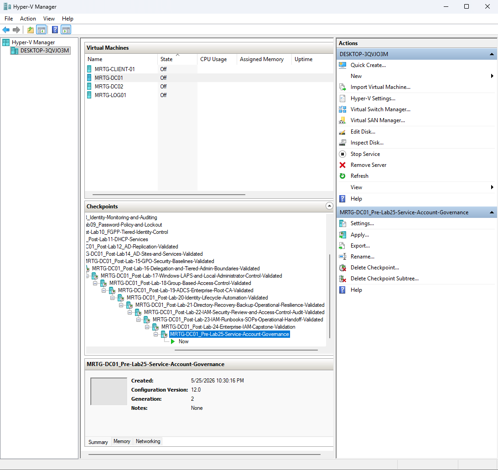
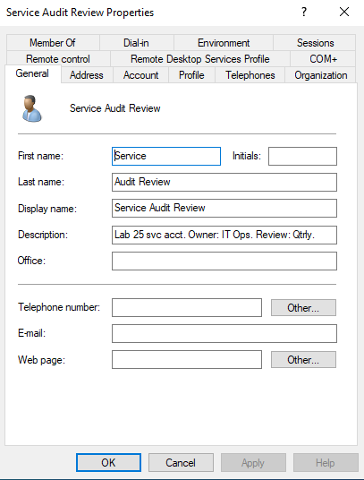
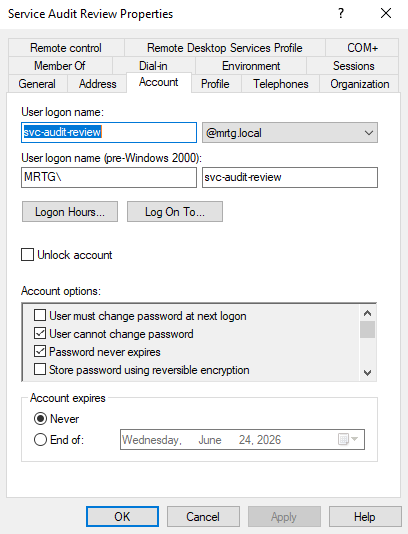
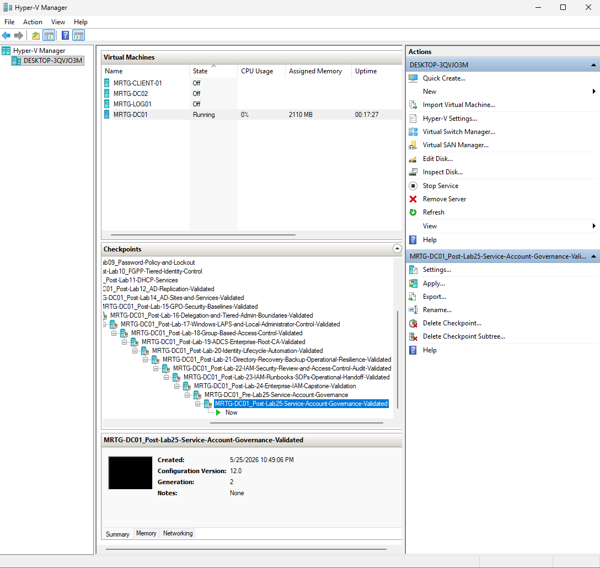

# Lab 25: Service Account Governance Foundation


---

## Objective

Establish a governance foundation for a non-human identity in the `mrtg.local` Active Directory domain.

This lab creates and documents the `svc-audit-review` service account, reviews its group membership and account settings, records ownership and review frequency, and prepares it for a controlled automation scenario in Lab 26.

The goal is to treat the service account as a governed identity rather than an undocumented technical account.

---

## Business Scenario

Monroe Redstone Technology Group requires a repeatable process for creating and managing service accounts.

Without governance, service accounts may have:

- Unclear ownership
- Inconsistent naming
- Undocumented purpose
- Excessive permissions
- Long-lived unmanaged credentials
- Interactive sign-in capability
- Missing dependencies
- No recurring review
- No retirement process

These weaknesses can produce orphaned identities, persistent access, audit findings, credential exposure, and application outages.

This lab establishes the initial account record and documents the controls that remain necessary before production use.

---

## Lab Summary

In this lab, I created `svc-audit-review` in `_MRTG\Service Accounts`.

The account followed the MRTG service-account naming standard and included a Description value documenting its purpose, owner team, and quarterly review frequency.

Group membership review showed only the default `Domain Users` membership. No privileged administrative groups were assigned.

The account's password and expiration settings were also reviewed.

The account was prepared for the Lab 26 scheduled-task scenario, but least privilege was not fully proven because no resource permission, logon-right restriction, activity monitoring, or credential-rotation control was implemented in this lab.

---

## Environment

| Component | Details |
|---|---|
| Organization | Monroe Redstone Technology Group |
| Domain | `mrtg.local` |
| Domain Controller | `MRTG-DC01` |
| Management Tool | Active Directory Users and Computers |
| Target OU | `_MRTG\Service Accounts` |
| Service Account | `svc-audit-review` |
| Display Name | Service Audit Review |
| Identity Type | Non-human user account |
| Documented Owner Team | IT Operations |
| Review Frequency | Quarterly |
| Hypervisor | Hyper-V |

---

## Prerequisites

- Operational `mrtg.local` domain
- Dedicated Service Accounts OU
- Approved service-account naming convention
- Defined technical purpose
- Assigned owner team
- Administrative access to create and review the account
- Planned downstream use for the account
- Defined credential and logon-control requirements

---

## Scope

### Included

- Service-account creation
- Naming-standard application
- Dedicated OU placement
- Purpose documentation
- Owner-team documentation
- Review-frequency documentation
- Group-membership review
- Password-setting review
- Expiration-setting review
- Initial inventory record
- Screenshot evidence
- Temporary Hyper-V checkpoints

### Not Included

- Application integration
- Scheduled-task configuration
- Group Managed Service Account deployment
- Automated password rotation
- Credential-vault integration
- Interactive-logon restrictions
- Log on as a batch job assignment
- Resource-level permission assignment
- Activity monitoring
- Named business-owner assignment
- Dependency testing
- Formal request and approval workflow
- Retirement testing

---

## Governance Workflow

```text
Define Purpose
      |
      v
Assign Owner
      |
      v
Create Account
      |
      v
Review Default Access
      |
      v
Document Credential Risk
      |
      v
Define Review Schedule
      |
      v
Validate Intended Use
      |
      v
Monitor and Retire
```

This lab completed the initial governance and review stages. Usage validation, monitoring, credential rotation, and retirement remain future controls.

---

## Service Account Standard

MRTG service accounts should:

- Use a recognizable naming convention
- Reside in a dedicated OU
- Have a documented technical purpose
- Have named business and technical owners
- Avoid privileged membership unless formally approved
- Receive only required resource permissions
- Be denied unnecessary interactive sign-in
- Use managed credentials where supported
- Be monitored for abnormal activity
- Be reviewed on a defined schedule
- Have documented dependencies
- Be disabled when no longer required

Naming standard:

```text
svc-[function]-[purpose]
```

Account:

```text
svc-audit-review
```

The prefix identifies the account as a service identity, while the remaining name describes its intended function.

---

## Account Governance Record

| Field | Value |
|---|---|
| SAM Account Name | `svc-audit-review` |
| UPN | `svc-audit-review@mrtg.local` |
| Display Name | Service Audit Review |
| OU | `_MRTG\Service Accounts` |
| Purpose | Audit-review simulation and governance documentation |
| Owner Team | IT Operations |
| Review Frequency | Quarterly |
| Privileged Groups | None observed |
| Primary Group | Domain Users |
| Credential Rotation | Not automated |
| Interactive Logon Restriction | Not configured |
| Current Status | Active for lab use |

A team name provides operational context but does not replace named business and technical accountability.

---

## Implementation and Validation

### 1. Created a Pre-Change Lab Checkpoint

Checkpoint name:

```text
MRTG-DC01_Pre-Lab25-Service-Account-Governance
```



The checkpoint was a temporary lab tool and was not a service-account backup or lifecycle control.

---

### 2. Reviewed the Service Accounts OU

OU path:

```text
mrtg.local\_MRTG\Service Accounts
```

Visible service-style identities included:

```text
Service App Deploy
Service Audit Review
Service Backup
```


A dedicated OU improves inventory, policy targeting, delegation, and reporting.

OU placement does not restrict privilege or logon rights by itself.

---

### 3. Created and Documented the Account

| Field | Value |
|---|---|
| First Name | Service |
| Last Name | Audit Review |
| Display Name | Service Audit Review |
| User Logon Name | `svc-audit-review` |
| OU | `_MRTG\Service Accounts` |
| Purpose | Audit-review simulation and governance documentation |
| Owner Team | IT Operations |
| Review Frequency | Quarterly |

Description:

```text
Lab 25 svc acct. Owner: IT Ops. Review: Qtrly.
```



The Description field provides quick context, but a production inventory should store richer ownership and dependency data in a governed system of record.

---

### 4. Reviewed Group Membership

Observed membership:

```text
Domain Users
```


The account was not observed in:

```text
Domain Admins
Enterprise Admins
Schema Admins
Administrators
Account Operators
Server Operators
Backup Operators
```

This confirmed that no broad administrative group had been assigned.

`Domain Users` remains a real access group and may receive permissions elsewhere. Group review alone does not prove the account has no effective access.

---

### 5. Reviewed Logon and Password Settings

UPN:

```text
svc-audit-review@mrtg.local
```

| Setting | Lab Configuration |
|---|---|
| User must change password at next logon | Disabled |
| User cannot change password | Enabled |
| Password never expires | Enabled |
| Store password using reversible encryption | Disabled |
| Account expires | Never |



These settings supported lab continuity but created a long-lived credential.

They are documented findings, not production recommendations.

---

### 6. Reviewed the Final Account State


| Validation Item | Result |
|---|---|
| Account exists | Passed |
| Account located in Service Accounts OU | Passed |
| Naming standard followed | Passed |
| Purpose documented | Passed |
| Owner team documented | Passed |
| Review frequency documented | Passed |
| UPN reviewed | Passed |
| Group membership reviewed | Passed |
| No privileged group membership observed | Passed |
| Credential rotation implemented | Not implemented |
| Interactive sign-in restricted | Not implemented |
| Effective resource access tested | Not tested |

---

### 7. Created the Final Lab Checkpoint

Checkpoint name:

```text
MRTG-DC01_Post-Lab25-Service-Account-Governance-Validated
```



The checkpoint was a temporary lab recovery point and not part of service-account governance.

---

## Password and Credential Risk

The account used:

```text
Password never expires
```

This setting creates risk because a compromised credential may remain valid indefinitely.

Production alternatives include:

- Group Managed Service Accounts
- Managed password rotation
- Enterprise credential vaults
- Long randomly generated credentials
- Automated dependency testing
- Rotation monitoring
- Credential-use auditing
- Emergency credential-replacement procedures

A gMSA is generally preferable when the application or scheduled task supports it because Active Directory manages the password.

---

## Logon Rights Consideration

This lab did not configure logon restrictions.

A production service identity should be evaluated for:

- Deny log on locally
- Deny log on through Remote Desktop Services
- Log on as a batch job
- Log on as a service
- Network access requirements
- Workstation restrictions
- Authentication-silo or policy requirements

Only the logon types required by the workload should be allowed.

---

## Security and IAM Relevance

Service accounts are non-human identities and require the same lifecycle discipline as user accounts.

This lab supports:

- Non-human identity inventory
- Naming standards
- Dedicated OU placement
- Purpose documentation
- Owner-team assignment
- Group-membership review
- Privileged-group avoidance
- Review-frequency documentation
- Credential-risk identification
- Preparation for controlled use

Creating an account without administrative group membership is a good starting point, but full least privilege requires effective-permission and logon-right validation.

---

## Risks Addressed

This lab reduces the risk of:

- Unidentified non-human accounts
- Inconsistent naming
- Missing purpose documentation
- Missing owner-team information
- Unreviewed administrative membership
- Missing review schedule
- Service accounts scattered among standard users

Remaining risks include:

- Long-lived password
- Missing named owner
- Missing credential rotation
- Missing logon restrictions
- Missing activity monitoring
- Unknown effective access
- Missing dependency records
- No formal retirement date

---

## Control Mapping

| Control Area | Lab Contribution |
|---|---|
| Non-Human Identity Governance | Creates and documents a service account |
| Naming Standard | Applies the `svc-[function]-[purpose]` format |
| Organizational Control | Places the identity in a dedicated OU |
| Accountability | Records an owner team and review frequency |
| Privileged Access | Confirms no broad administrative group was assigned |
| Credential Governance | Documents long-lived password risk |
| Lifecycle Management | Creates an inventory record and review requirement |
| Audit Readiness | Captures point-in-time configuration evidence |
| Gap Analysis | Identifies missing rotation, restrictions, and monitoring |

---

## Validation Results

| Validation Item | Result |
|---|---|
| Temporary pre-change checkpoint created | Passed |
| Service Accounts OU reviewed | Passed |
| `svc-audit-review` created | Passed |
| Correct OU placement confirmed | Passed |
| Naming standard followed | Passed |
| Purpose documented | Passed |
| Owner team documented | Passed |
| Quarterly review documented | Passed |
| UPN reviewed | Passed |
| Group membership reviewed | Passed |
| No privileged group membership observed | Passed |
| Named business owner | Not documented |
| Named technical owner | Not documented |
| Automated credential rotation | Not implemented |
| Interactive-logon restriction | Not implemented |
| Resource-level permission validation | Not tested |
| Activity monitoring | Not implemented |
| Temporary final checkpoint created | Passed |

---

## Evidence Collected

| Evidence | Screenshot |
|---|---|
| Pre-change checkpoint | `screenshots/lab-25-01-pre-lab-checkpoint.png` |
| Service Accounts OU inventory | `screenshots/lab-25-02-service-account-inventory-view.png` |
| Account description | `screenshots/lab-25-03-service-account-description.png` |
| Group membership | `screenshots/lab-25-04-service-account-group-membership.png` |
| Logon and password settings | `screenshots/lab-25-05-service-account-logon-settings.png` |
| Final account state | `screenshots/lab-25-06-service-account-validation.png` |
| Final lab checkpoint | `screenshots/lab-25-07-post-lab-checkpoint.png` |

---

## What I Would Improve in Production

In a production environment, I would:

- Use a formal service-account request workflow
- Assign named business and technical owners
- Require system-owner approval
- Use gMSAs where supported
- Store unavoidable static credentials in an approved vault
- Automate password rotation
- Test dependencies before credential changes
- Deny interactive and Remote Desktop sign-in
- Grant only required logon rights
- Restrict the account to approved systems
- Document every resource permission
- Monitor authentication and use
- Alert on abnormal source systems or logon types
- Review effective access regularly
- Record creation, rotation, review, and retirement dates
- Disable unused service accounts promptly
- Maintain a governed non-human identity inventory
- Use formal change management
- Avoid relying on Hyper-V checkpoints as governance controls

---

## Lessons Learned

This lab reinforced that service-account governance begins before workload integration.

A non-human identity needs:

- A defined purpose
- Clear ownership
- Consistent naming
- Controlled placement
- Limited privilege
- Managed credentials
- Restricted logon rights
- Monitoring
- Periodic review
- Retirement criteria

The main takeaway is that membership in only Domain Users does not fully prove least privilege. Effective permissions, logon rights, credential controls, and actual use must also be reviewed.

---

## Outcome

Lab 25 successfully established the initial governance record for `svc-audit-review`.

The lab confirmed that:

- The account was created in the dedicated Service Accounts OU
- The naming standard was followed
- Purpose, owner team, and review frequency were documented
- Group membership was reviewed
- No broad administrative group membership was observed
- Password and expiration settings were documented
- Missing production controls were identified

The account is prepared for the controlled scheduled-task scenario in Lab 26, where its actual permissions and logon requirements will be tested.

---

## Next Lab

[Lab 26: Scheduled Task with Least-Privilege Service Account](../Lab-26-Scheduled-Task-with-Least-Privilege-Service-Account/)

Lab 26 uses `svc-audit-review` in a scheduled task and validates the minimum resource and logon permissions required for the workload.
